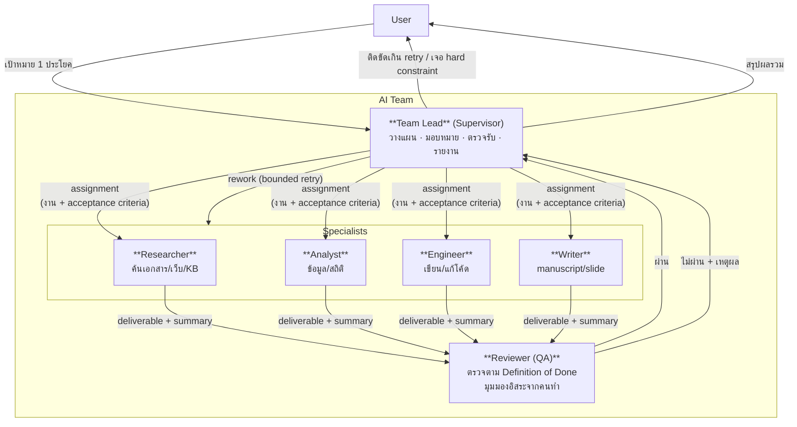
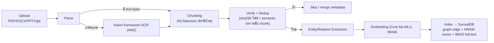
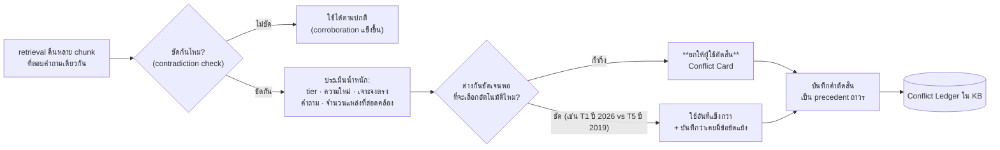
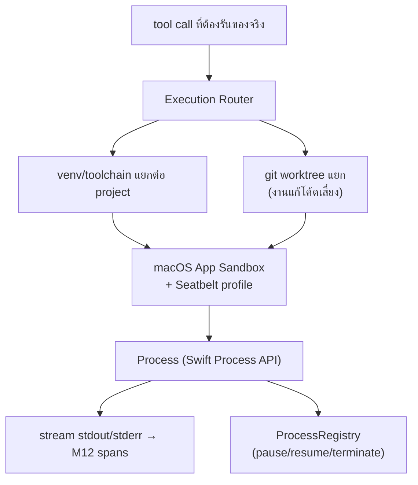
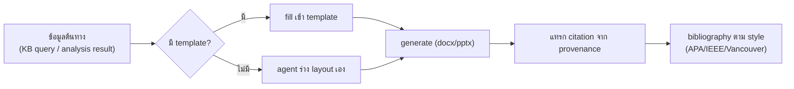
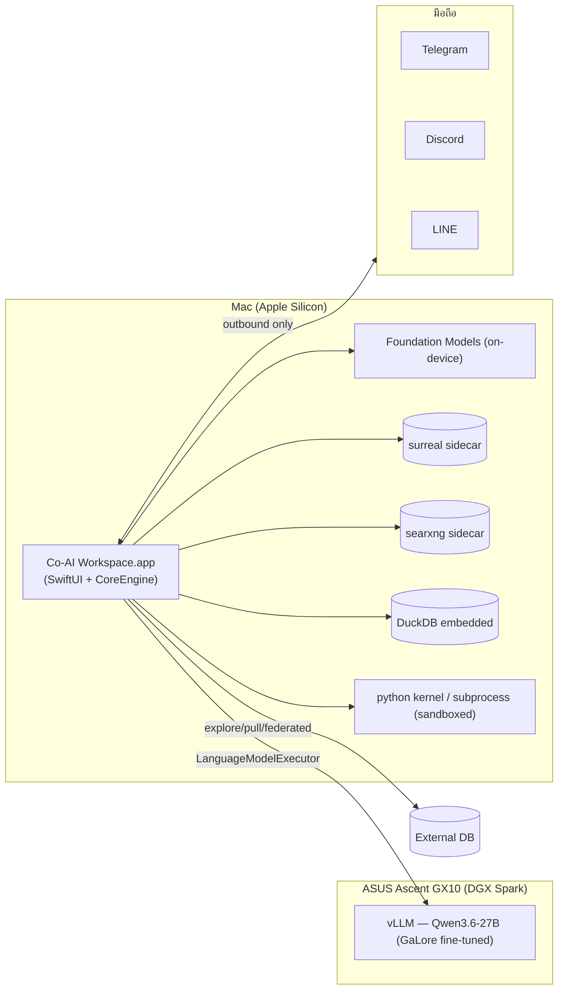
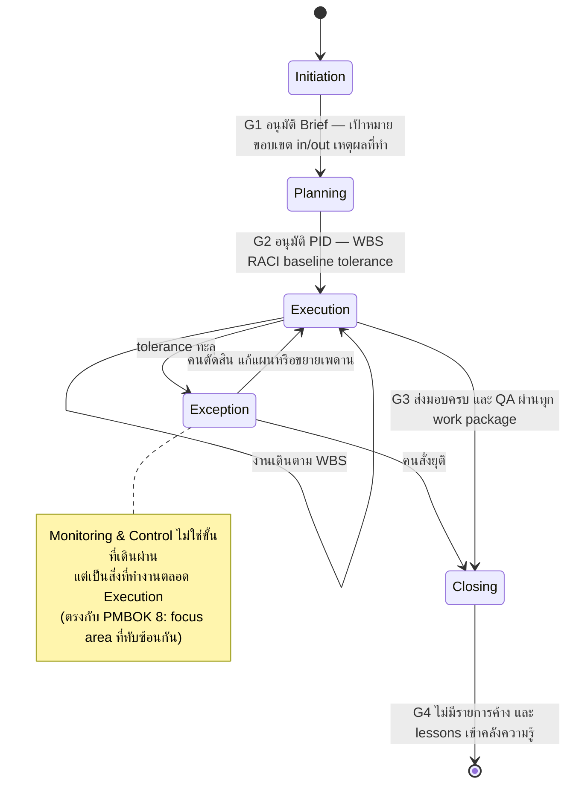
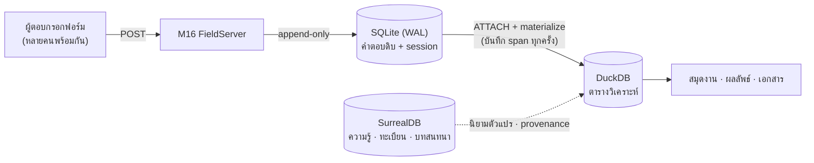

# Co-AI Workspace — Architecture & Spec (Swift Native, v2)

> **สถานะ**: ร่างสถาปัตยกรรมฉบับใหม่ — แทนที่ระบบเดิม (Rust + Tauri + React) ด้วย **Swift native (SwiftUI + Swift ล้วน)** และรื้อ hierarchy ใหม่ทั้งหมด
>
> **เอกสารนี้ self-contained**: รายละเอียด feature/function/decision/engineering-note ทั้งหมดจาก `OldARCHITECTURE/` (ARCHITECTURE.md, IMPLEMENTATION_PLAN.md, LOG.md, LOG_ARCHIVE.md) ถูกดูดเข้ามาครบแล้ว — ดู [ภาคผนวก A](#ภาคผนวก-a--legacy-feature-inventory-เก็บครบจากระบบเดิม) (feature inventory 21+7 ข้อ + Phase A–J), [ภาคผนวก B](#ภาคผนวก-b--decisions-log-ที่ยังมีผลกับ-v2) (decisions log), [ภาคผนวก C](#ภาคผนวก-c--engineering-notes-ที่ยังใช้ได้กับ-v2) (engineering notes) — **ลบโฟลเดอร์ `OldARCHITECTURE/` ได้โดยไม่สูญเสียข้อมูล**

## สารบัญ

| ส่วน | เนื้อหา |
|---|---|
| [§0](#0-เป้าหมายและคำนิยาม) | เป้าหมายระบบ · คำนิยาม Module/Sub-module/Feature/Function |
| [§1](#1-ผลการศึกษา-ecosystem-review-2026) | **ผลการศึกษา** — Swift AI agent · AI harness ยอดนิยม · เครื่องมือ Apple · Web search |
| [§2](#2-ai-team-model--แกนหลักของ-v2) | **AI Team Model** — หัวหน้าทีม/ลูกทีม/QA loop |
| [§3](#3-system-hierarchy) | System Hierarchy (hub & spoke) |
| [§4](#4-module-catalog--ภาพรวมทั้งระบบ) | **Module Catalog** — Module → Sub-module → Feature → Function ครบทั้งระบบ |
| [§5](#5-m1-coreengine)–[§16](#16-m12-observability--eval) | รายละเอียดต่อ Module (M1–M12) |
| [§17](#17-hardware-topology--deployment) | Hardware Topology & Deployment |
| [§18](#18-non-functional-requirements) | Non-Functional Requirements |
| [§19](#19-project-environment--project-management-m14-projectkit) | **Project Environment & Project Management** — General/Project · IA ใหม่ · life cycle 5 ขั้น · WBS/Gantt/Kanban/RACI · tolerance & exception · conformance matrix (M14) |
| [§20](#20-research-program--งานวิจัยที่เดินบนโครง-pm-m15-instruments) | **Research Program** — 8 ขั้นตอนวิจัยบนโครง PM · ออกแบบเครื่องมือ + ความตรง/ความเที่ยง (M15) · เว็บฟอร์ม/เซิร์ฟเวอร์/ฐานข้อมูลคำตอบ (M16) |
| [§21](#21-agent-competence-model--อะไรทำให้-agent-แต่ละตัวต่างกัน) | **Agent Competence Model** — 6 ชั้นที่ทำให้ agent ต่างกัน · knowledge view ต่อบทบาทบนกราฟเดียว · tool proficiency |
| [ภาคผนวก A](#ภาคผนวก-a--legacy-feature-inventory-เก็บครบจากระบบเดิม) | Legacy Feature Inventory (จากระบบเดิมครบทุกข้อ) |
| [ภาคผนวก B](#ภาคผนวก-b--decisions-log-ที่ยังมีผลกับ-v2) | Decisions Log |
| [ภาคผนวก C](#ภาคผนวก-c--engineering-notes-ที่ยังใช้ได้กับ-v2) | Engineering Notes (SurrealDB quirks ฯลฯ) |
| [ภาคผนวก D](#ภาคผนวก-d--open-questions-สถานะหลัง-verify) | Open Questions — สถานะหลัง verify |
| [ภาคผนวก E](#ภาคผนวก-e--verification-log-2026-08-10) | **Verification Log** — ผลทดสอบจริงบนเครื่อง + ข้อมูล dependency ที่ตรวจแล้ว |

---

## 0. เป้าหมายและคำนิยาม

### 0.1 เป้าหมายระบบ

ระบบ AI Agent ส่วนตัว (single-user) บน Mac ที่ทำงาน 3 กลุ่มหลัก:

1. **เขียนโค้ด** — coding agent พร้อม execution environment จริง
2. **วิเคราะห์ข้อมูล** — big data + qualitative analysis (แต่ละงานวิจัยเขียน analysis ของตัวเอง ไม่ใช่ query สำเร็จรูป)
3. **งานเอกสาร** — manuscript/slide พร้อม citation จาก paper จริง

**สิ่งที่เปลี่ยนจาก v1 เชิงแนวคิด**: v1 คือ "ชุด agent ให้ user เลือกทีละตัวจาก dropdown" — v2 คือ **AI Team ที่ user สั่งหัวหน้าทีมคนเดียว** แล้วทีมแบ่งงาน/ตรวจงานกันเองเป็น loop ([§2](#2-ai-team-model--แกนหลักของ-v2))

### 0.2 คำนิยาม: Module / Sub-module / Feature / Function

เพื่อไม่ให้เกิดปัญหาเดิม (module แตกซ้อนกัน ไม่รู้ว่าอะไรควรเป็นอะไร) เอกสารนี้ใช้นิยาม 4 ระดับที่ตายตัว:

| ระดับ | นิยาม | เกณฑ์ตัดสิน (ต้องผ่านทุกข้อ) | ตัวอย่าง |
|---|---|---|---|
| **Module** | หน่วยที่เป็นเจ้าของ domain หนึ่งอย่างสมบูรณ์ = 1 Swift target | (1) มี lifecycle/state ของตัวเอง (2) มี public interface ที่ module อื่นใช้โดยไม่ต้องรู้ข้างใน (3) ทดสอบแยกได้ (4) **ถ้าลบทิ้ง จะมีความสามารถหนึ่งหายไปทั้งก้อน** | `CoreEngine`, `Knowledge`, `Execution` |
| **Sub-module** | ส่วนประกอบภายใน Module — ไม่มีความหมายถ้าอยู่นอก module แม่ | (1) ใช้ state ร่วมกับ module แม่ (2) ไม่มี consumer นอก module แม่ (3) แยกไว้เพราะ *ความซับซ้อน* ไม่ใช่เพราะ *ขอบเขต* | `HookChain` (ใน CoreEngine), `Chunker` (ใน Knowledge) |
| **Feature** | ความสามารถที่ **user มองเห็น/ใช้ได้** — พูดถึงได้โดยไม่ต้องอ้างชื่อคลาส | (1) อธิบายเป็นประโยค "user ทำ X ได้" (2) มีจุดเข้าใช้งานใน UI หรือ channel | "อนุมัติ tool call เสี่ยงจาก Telegram", "รัน SQL cell ใน Notebook" |
| **Function** | หน่วยเรียกใช้จริง — method, tool, หรือ command | (1) มี signature ชัด (2) test ได้ตรงๆ | `run_shell`, `ApprovalBroker.resolve(id:decision:)` |

**กฎที่บังคับตัวเอง** (แก้ปัญหา v1 ที่แตก module ย่อยเกินจำเป็น):

- ห้ามสร้าง Module ใหม่ถ้ามี consumer เดียว — เป็น Sub-module ของ consumer นั้นแทน (v1 แตก `bridge-core`/`bridge-telegram`/`bridge-discord`/`bridge-line` เป็น 4 crate ทั้งที่ 3 ตัวหลังคือ implementation ของ protocol เดียวกัน → v2 รวมเป็น Module `Channels` เดียว มี 4 sub-module)
- ห้ามให้ 2 Module เก็บ state ที่ต้อง sync กันเอง — ยกขึ้นเป็น Module เดียวที่เป็นเจ้าของ (v1 มี `LiveMonitor` กับ `ProcessManager` เก็บ process list คนละที่ → v2 มี span store เดียว)
- ห้ามประกาศ type รูปร่างเดียวกันซ้ำข้าม module (v1 มี `Scope`-shaped enum 3 ตัว: `kb_store::Scope`, `config::DbConnectorScope`, `agent_registry::AgentScope`) → v2 ประกาศครั้งเดียวใน `AgentKit`

### 0.3 Design Principles (ที่มีผลต่อทุก section)

1. **AI Team เป็น first-class ไม่ใช่ agent เดี่ยวหลายตัว** — [§2](#2-ai-team-model--แกนหลักของ-v2)
2. **Agentic-by-default, manual override เสมอ** — ทุก artifact ที่ agent สร้าง แก้เองได้ตรงๆ
3. **On-device model เป็น tier ใช้งานจริง** — Foundation Models (~3B) รับงานเล็ก/บ่อย ไม่ต้อง round-trip ไป GX10 ทุกครั้ง
4. **Consolidate ไม่ใช่แตก module** — ตามกฎ [§0.2](#02-คำนิยาม-module--sub-module--feature--function)
5. **Type system บังคับ invariant แทน convention** — Swift actor/enum/protocol ทำสิ่งที่ v1 ต้องอาศัยวินัยของคนเขียน
6. **OS-native ก่อนเขียนเอง** — Vision (OCR), NaturalLanguage (ตัดคำไทย), App Sandbox, Keychain, Foundation Models
7. **ไม่พึ่ง dependency ที่ยังไม่โตพอ** — ตรวจ maturity จริง (release/commit/ดาว/คำเตือนของ maintainer เอง) ก่อนเอามาเป็นรากฐาน; ถ้าโปรโตคอลง่ายพอ เขียน client เองดีกว่าผูกกับ SDK alpha ([ภาคผนวก E](#ภาคผนวก-e--verification-log-2026-08-10))
8. **แยก "ของ Apple ที่มีวันนี้" ออกจาก "ของ Apple ที่กำลังจะมี"** — ทุก API ที่ยังไม่อยู่ใน SDK ที่ติดตั้งจริง ต้องมี abstraction คั่นเสมอ ไม่ผูกโค้ดตรง

---

## 1. ผลการศึกษา (Ecosystem Review 2026)

ส่วนนี้คือคำตอบของโจทย์ข้อ 2–5 ที่ขอให้ศึกษาก่อนออกแบบ — สรุปเฉพาะสิ่งที่**มีผลต่อ decision ในเอกสารนี้จริง**

### 1.1 คนอื่นทำ Swift AI Agent กันยังไง

| โปรเจกต์ | สิ่งที่ทำ | บทเรียนที่เอามาใช้ |
|---|---|---|
| [Mac Agent (macOS26/Agent)](https://github.com/macos26/agent) | agentic harness สำหรับ macOS desktop — computer use, automation, scripting, รองรับ 18+ provider ทั้ง local/cloud | ยืนยันว่า **provider-agnostic layer เป็นมาตรฐาน** ไม่ใช่ผูกกับ endpoint เดียว → v2 ใช้ `LanguageModelExecutor` เป็น abstraction ([§9](#9-m5-llmproviders)) |
| [Sumika](https://github.com/topics/mlx?l=swift) | local-first macOS agent — chat + workspace context + tool execution บน MLX Swift | "workspace context" เป็น concept เดียวกับ project scope ของเรา — ยืนยัน design เดิมถูก |
| [mlx-serve](https://github.com/ddalcu/mlx-serve) | native LLM inference server บน Apple Silicon, OpenAI+Anthropic API compatible, **ไม่ต้องพึ่ง Python** | ทางเลือกสำรองถ้า GX10 ไม่ว่าง — รันโมเดลกลางบน Mac เองได้โดยไม่ต้องติด Python stack |
| [swift-transformers 1.0](https://huggingface.co/blog/swift-transformers) | เติมช่องว่างที่ Core ML/MLX ไม่มี (tokenizer, model hub, generation loop) สำหรับ local inference | ใช้เป็น fallback path ของ embedding/tokenizer ถ้า Core ML อย่างเดียวไม่พอ |
| [SwiftMCP](https://github.com/sutheesh/SwiftMCP) | เชื่อม Apple Foundation Models เข้ากับ MCP server ใดก็ได้ — แก้ปัญหา `@Generable` เป็น compile-time แต่ MCP schema เป็น runtime ด้วย `DynamicGenerationSchema` | **สำคัญมาก** — คือชิ้นส่วนที่ทำให้ MCP tool ของเราเข้า Foundation Models ได้โดยไม่ต้องเขียน adapter เอง |
| [MCP Swift SDK ทางการ](https://github.com/modelcontextprotocol/swift-sdk) | official Swift SDK ทั้ง client และ server (spec 2025-11-25) | ไม่ต้องเขียน JSON-RPC client เองแบบ v1 (`mcp-client` crate) |

**ข้อสรุป**: Swift ecosystem ปี 2026 มีชิ้นส่วนครบพอสำหรับ agent system แล้ว — จุดที่ v1 ต้องเขียนเองเยอะที่สุด (tool-call protocol, MCP client, embedding runtime) ตอนนี้มีของสำเร็จรูปทั้งหมด

### 1.2 AI Harness ยอดนิยม — pattern ที่ยืมมา

จาก [Claude Code harness architecture](https://boringbot.substack.com/p/claude-code-skills-subagents-hooks) และ [Anthropic multi-agent research system](https://www.anthropic.com/engineering/multi-agent-research-system):

| Pattern | รายละเอียด | ใช้ใน v2 ที่ |
|---|---|---|
| **Harness = runtime รอบโมเดล** (ไม่ใช่ prompt) | สิ่งที่ทำให้ LLM เป็น agent คือ layer ที่จัดการ tool/memory/permission ไม่ใช่ prompt ที่เก่งขึ้น | [§5](#5-m1-coreengine) CoreEngine ทั้ง module |
| **โหมดการทำงานชัดเจน** (default / auto-accept / plan / auto) | user รู้ตลอดว่ากำลังอยู่โหมดไหน ไม่ใช่ระบบเดาเอง | [§5.5](#55-โหมดการทำงาน-operating-modes) — v1 มี 3 สวิตช์อยู่แล้ว (Autonomy/Plan-only/Run-until-done) v2 จัดเป็นโหมดที่มองเห็นได้ |
| **Hook = lifecycle event ที่โมเดลข้ามไม่ได้** | deterministic control point ไม่ว่าโมเดลจะ "อยากทำ" อะไร | [§5.3](#53-hook-chain-gate-sub-module) — v1 มี PreToolUse/PostToolUse แล้ว v2 ขยายเป็น lifecycle เต็ม |
| **Skill ก่อน Subagent** | ปัญหาที่พบบ่อย: คนสร้าง subagent สำหรับงานที่ควรเป็นแค่ skill → เพิ่ม overhead + context isolation ที่ไม่จำเป็น | [§7](#7-m3-roster) — Roster module บังคับให้เลือกให้ถูกชั้น |
| **Subagent คืน summary ไม่ใช่ transcript** | subagent ใช้ token หลายหมื่นได้ แต่คืนกลับ 1,000–2,000 token — Anthropic วัดได้ว่า multi-agent ดีกว่า single-agent 90.2% ในงาน research | [§2.3](#23-context-isolation--กติกาการคืนงาน) |
| **Multi-agent กิน token ~15×** | ราคาที่ต้องจ่ายของ team model | บรรเทาด้วย Tier 0 on-device ([§9.2](#92-model-router-tier-0--05--1)) — งานเล็กของทีมไม่กิน quota โมเดลใหญ่ |
| **Supervisor pattern มี framework support กว้างที่สุด** แต่ failure mode คือ over-delegation | ต้อง **hard-cap รายชื่อ worker** ที่ supervisor เรียกได้ ไม่ปล่อยอิสระ | [§2.2](#22-กติกาของหัวหน้าทีม-supervisor-contract) |
| **Cognition (Devin) เตือน**: งานที่ coupled กันแน่น (แก้โค้ดหลายไฟล์) **ห้ามแตกเป็นหลาย subagent** ต้อง full shared context | ขัดกับ multi-agent hype แต่จริง | [§2.4](#24-ข้อยกเว้น-งานที่ห้ามแตกทีม) — Engineer role ทำงาน context เดียวเสมอ |
| **Compaction ทิ้ง raw tool-output ก่อน** + ต้องมี durable rule file แยก | คำสั่งตอนต้น session หายได้หลัง compact | [§5.6](#56-context-manager-sub-module) |

### 1.3 เครื่องมือของ Apple ที่ช่วยพัฒนา

| เครื่องมือ/Framework | ใช้ทำอะไรในระบบนี้ | สถานะ |
|---|---|---|
| **[Foundation Models framework](https://developer.apple.com/wwdc26/guides/machine-learning/)** | LLM layer ทั้งหมด — on-device ~3B, `@Generable` structured output, `Tool` protocol, streaming | แกนหลักของ [§9](#9-m5-llmproviders) |
| **[Custom LLM provider API (WWDC26 session 339)](https://developer.apple.com/videos/play/wwdc2026/339/)** | ผูก vLLM/GX10 เข้า `LanguageModelSession` เดียวกับ on-device ผ่าน `LanguageModel` + `LanguageModelExecutor` | 🔶 **ยังไม่มีใน SDK ปัจจุบัน** — เป็นของ macOS 27/Xcode 27 (ออก ก.ย. 2026) ตรวจแล้วว่า `LanguageModelExecutor` ไม่มีใน SDK ที่ติดตั้ง → v2 คั่นด้วย abstraction ของเราเอง ([§9.1](#91-llm-abstraction-ของเราเอง-รองรับทั้งสองยุค)) |
| **Dynamic Profiles / multi-model routing (2026)** | routing ระหว่างหลายโมเดลในเฟรมเวิร์กเดียว | [§9.2](#92-model-router-tier-0--05--1) Model Router |
| **[MLX + MLX Swift](https://developer.apple.com/videos/play/wwdc2026/232/)** | รัน agentic AI local บน Mac, Hugging Face model ผ่าน Foundation Models ได้ | ทางเลือกสำรอง/เสริมของ Tier 0.5 |
| **Vision** (`VNRecognizeTextRequest`) | OCR สำหรับ PDF ภาพสแกน — เร่งด้วย ANE, ปี 2026 เรียกเป็น tool ให้โมเดลใช้ได้ตรงๆ | ปิด **Task K2** ของ v1 ที่ค้างอยู่ทันที ([§10](#10-m6-knowledge)) |
| **NaturalLanguage** (`NLTokenizer`) | ตัดคำภาษาไทยสำหรับ chunking + BM25 | แทน `nlpo3` — **ต้องเทียบคุณภาพก่อนใช้จริง** ([ภาคผนวก D](#ภาคผนวก-d--open-questions-ต้องตัดสินใจก่อนเริ่ม)) |
| **Security (Keychain Services)** | เก็บ token/API key/DB password | แทน `keyring` crate ([§15](#15-m11-config--secrets)) |
| **App Sandbox + Seatbelt + Hardened Runtime** | sandbox การรัน user code/DSL จริงระดับ OS | [§12](#12-m8-execution) |
| **App Intents (+ App Intents Testing)** | เปิดให้สั่งงาน workspace ผ่าน Siri/Shortcuts/Spotlight — "สั่งงานทีมโดยไม่ต้องเปิดแอป" | Feature ใหม่ที่ v1 ไม่มี ([§14.3](#143-app-intents-feature-ใหม่)) |
| **Swift Testing** (parallel by default) + **Instruments** + **MetricKit** (Swift-first API ปี 2026) | test harness, profiling, runtime metric | [§16](#16-m12-observability--eval) |
| **[Xcode 27 agent skills](https://www.avanderlee.com/ai-development/swiftui-best-practices-xcode-27-agent-skill/)** | Apple ปล่อย SwiftUI best-practice เป็น agent skill ทางการ | ใช้ตอน dev — ให้ Claude Code อ่าน skill นี้ตอนเขียน SwiftUI |
| **SwiftData + `ResultsObserver`** (iOS/macOS 27) | observe การเปลี่ยนแปลงนอก SwiftUI view | ทางเลือกสำหรับ local UI state cache (ไม่แทน SurrealDB) |

### 1.4 Web Search — มีของฟรีถาวรไหม? Apple ให้ด้วยไหม?

**คำตอบตรงๆ 2 ข้อ**:

1. **Apple ไม่มี web search API ให้นักพัฒนา** — "World Knowledge Answers" ที่เป็นข่าวคือ **ฟีเจอร์ของ Siri** (ตอบคำถามจากเว็บ + personal context) ไม่ได้เปิดเป็น public API ให้แอปอื่นเรียก ที่ Apple มีจริงคือ iTunes/App Store Search API ซึ่งค้นได้แค่ content ใน store ของตัวเอง — **ใช้กับงานวิจัยไม่ได้เลย**
2. **ของฟรีถาวรมี แต่ต้องเลือกให้ถูกชั้น** — ผู้ให้บริการเชิงพาณิชย์ปิด free tier กันหมดแล้ว (Brave ยกเลิก free tier สำหรับผู้ใช้ใหม่ตั้งแต่ต้นปี 2026 เหลือ $5 credit/เดือน ≈ 1,000 query และแผนเดิม 100 query/วัน จะปิดถาวร 1 ม.ค. 2027; Tavily/Exa/Firecrawl/Serper มี free tier แต่ throttle หนักและต้องสมัคร)

**Strategy ที่ v2 เลือก — tiering **แบบทุกแขนงความรู้** ไม่ใช่แค่การแพทย์** (v1 ผูกกับ WHO/CDC/PubMed อย่างเดียว ซึ่งแคบเกินไปสำหรับระบบที่ทำงานวิจัยได้ทุกสาขา):

| Tier | ระดับความน่าเชื่อถือ | แหล่ง (ตามสาขา) | วิธีเข้าถึง |
|---|---|---|---|
| **T1** — Authoritative | เอกสารทางการ/มาตรฐาน/กฎหมาย | **การแพทย์**: WHO, CDC, กระทรวงสาธารณสุข · **วิทยาศาสตร์/วิศวกรรม**: NIST, ISO, IEEE, IETF RFC · **สถิติ/นโยบาย**: สำนักงานสถิติ, World Bank, OECD, UN · **กฎหมาย**: ราชกิจจานุเบกษา · **เทคนิค**: เอกสารทางการของภาษา/framework | site-scoped query + API ทางการที่มี |
| **T2** — Peer-reviewed | ผ่านการตรวจสอบโดยผู้เชี่ยวชาญ | **ทุกสาขา**: OpenAlex, Crossref, Semantic Scholar, DOAJ · **การแพทย์**: PubMed · **ฟิสิกส์/คณิต/CS**: arXiv (ที่ตีพิมพ์แล้ว) · **สังคมศาสตร์**: SSRN, ERIC | API ทางการ (ฟรีถาวรทุกตัว) |
| **T3** — Preprint / กึ่งทางการ | ยังไม่ผ่าน peer review แต่มีตัวตนตรวจสอบได้ | medRxiv/bioRxiv, arXiv (preprint), รายงานของสถาบัน, thesis repository, เอกสารประกอบ conference | API ของแต่ละแหล่ง |
| **T4** — Curated community | ชุมชนที่มีกลไกตรวจสอบกันเอง | Wikipedia (+ อ้างอิงท้ายบทความ), Stack Overflow, GitHub repo ที่มีคนใช้จริง, documentation ของ OSS | API ทางการ / meta-search |
| **T5** — General web | ไม่มีกลไกตรวจสอบ | บล็อก, ข่าว, ฟอรัม, เนื้อหาทั่วไป | **SearXNG self-hosted sidecar** (meta-search ครอบ Google/Bing/DDG/70+ engine, ไม่มี key, ไม่มี rate limit) |

**การเลือก tier ไม่ผูกกับสาขาแบบตายตัว** — `WebSearch` ถือ **source registry** ที่แต่ละรายการประกาศ `{domain pattern, tier, สาขาที่ครอบคลุม}` แล้ว agent เลือกจาก**หัวข้อของ task** ไม่ใช่จาก hardcode ต่อ role: task การแพทย์ default ไป T1–T2 สายการแพทย์, task เขียนโค้ดไป T1 (เอกสารทางการของ framework) + T4 (Stack Overflow/GitHub), task นโยบายไป T1 (สถิติราชการ) — เพิ่มแหล่งใหม่ = เพิ่มแถวใน registry ไม่ต้องแก้โค้ด agent

🆕 **ค้นแล้วต้องอ่านจริง ไม่ใช่ตัดสินจาก snippet**: `web_search` คืนแค่รายการผลลัพธ์ — เมื่อจะอ้างอิงเนื้อหาใดต้องเรียก **`fetch_page`** ดึงหน้านั้นมาสกัดเป็นข้อความจริง (readability extraction ตัด nav/ads/footer ออก, รองรับ PDF ที่ลิงก์ตรง) แล้วค่อยสรุป — เหตุผล: snippet ของ search engine สั้นและตัดบริบท ทำให้ agent สรุปผิดได้ง่าย และเราต้องการ **provenance ระดับย่อหน้า** ไม่ใช่แค่ URL ([§11.3](#113-provenance-บังคับตั้งแต่-ingestion))

**เหตุผลที่เลือก SearXNG แทนการ scrape DuckDuckGo แบบ v1** *(ตัดสินใจแล้ว 2026-08-10)*: v1 ใช้วิธี scrape HTML ของ DDG (`html.duckduckgo.com/html/`) เพราะ DDG ไม่มี public API จริงสำหรับ organic result — วิธีนี้พังทุกครั้งที่ markup เปลี่ยน SearXNG แก้ปัญหานี้ให้ในตัว (มีคนดูแล parser ให้) และเป็น pattern เดียวกับที่เราต้อง run sidecar ของ SurrealDB อยู่แล้ว → เพิ่ม process ที่สองไม่ได้เพิ่มความซับซ้อนเชิงสถาปัตยกรรม เก็บ **DDG scraper เป็น fallback** เผื่อ SearXNG ล่ม

**ราคาที่ยอมจ่าย**: SearXNG เป็น Python — ต้อง bundle Python runtime หรือใช้ prebuilt binary (มี standalone CLI ที่ build ไว้ให้ macOS แล้ว) `SidecarManager` ตัวเดียวกับที่ดูแล `surreal` ดูแลตัวนี้ด้วย ([§11.5](#115-surrealdb-sidecar--client-ของเราเอง))

**ทางเลือกที่เปิดไว้**: `WebSearch` module ออกแบบเป็น provider protocol อยู่แล้ว — ถ้าวันหนึ่งอยากจ่ายเงินใช้ Tavily/Exa (ซึ่งคืนผลแบบ LLM-ready ดีกว่า) แค่เพิ่ม provider ใหม่ ไม่ต้องแก้ agent

---
#### 1.4.1 สะพานค้นเว็บด้วย WKWebView แบบไม่มีหน้าต่าง (P13.1) *(ออกแบบ 2026-08-13)*

**ไอเดีย**: ฝัง `WKWebView` ที่ไม่แสดงหน้าต่างไว้ในแอป ให้ agent สั่งมันเปิดหน้าค้นหา อ่านรายการผล เลือกลิงก์ที่น่าอ่าน แล้วโหลดหน้านั้นมาเข้าท่อ ingestion เดิม — ค้นเว็บโดยไม่มี API key และไม่มีค่าใช้จ่ายรายเรียก

**ทำไมน่าทำจริง ไม่ใช่แค่ประหยัด** — มันชนะสองข้อที่ SearXNG กับ `URLSession` ทำไม่ได้:

1. **มันอยู่ในแอปที่ sandbox แล้ว** ซึ่งเป็นเกณฑ์ตัดสินของ P13.1 ทั้งข้อ (บทเรียน P8.4/P9.6: ของที่รันได้บนเครื่องนักพัฒนา ไม่ได้แปลว่ารันได้ใน `.app` ที่ sandbox) SearXNG ต้องแพ็ก Python runtime มาเป็น sidecar — WKWebView คือเฟรมเวิร์กของระบบ ไม่ต้องแพ็กอะไร
2. **มันรัน JavaScript** ⇒ อ่านหน้าที่ render ฝั่ง client ได้ ซึ่ง `PageFetcher` วันนี้ทำไม่ได้ (`FetchError.empty` ที่เจอบ่อยคือหน้าแบบนี้)

**รูปร่างที่จะทำ** — ต่อเข้าที่เดิมทั้งหมด ไม่มีเส้นทางใหม่:

```
HeadlessBrowser (actor + WKWebView, MainActor-bound, คิวเดียว)
   ├── SERPReader ต่อ engine  → [WebResult]   (เข้า provider protocol เดิมของ WebSearch)
   └── renderedHTML(url:)      → PageFetcher/Readability เส้นเดิม → provenance + tier เดิม
```

* `web_search` / `fetch_page` **ไม่เปลี่ยนสัญญา** — agent เรียกทูลเดิม การจัดชั้นความเสี่ยง/effect เดิม (อ่านได้ทุกขั้น)
* **T5 ยังเป็น T5** — กติกา corroboration ของ [§14.1](#141-เอกสารที่อ้างอิงได้จริง) ไม่ผ่อนเพราะค้นง่ายขึ้น (Done-when ของ P13.2 พูดข้อนี้ไว้แล้ว)
* หน้าที่โหลดมา **เป็นข้อมูล ไม่ใช่คำสั่ง** — เว็บที่มีข้อความสั่ง agent คือ prompt injection ที่หน้าเว็บพาเข้ามา ข้อความจากหน้าเว็บเข้าคลังความรู้ในฐานะเนื้อหาที่มี provenance เท่านั้น ไม่ถูกต่อท้าย system prompt

**ราคาที่ต้องเขียนไว้ก่อน ไม่ใช่ค้นพบทีหลัง**:

| ความเสี่ยง | ทางรับมือที่ตั้งใจไว้ |
|---|---|
| **bot detection / CAPTCHA** โดยเฉพาะกับ Google | **ระบบไม่แก้ CAPTCHA** — หน้าที่เจอด่านต้องคืน error ที่แปลว่า "ต้องให้คนช่วย" ไม่ใช่ผลลัพธ์ว่าง (ผลว่างแยกไม่ออกจาก "ไม่มีข้อมูล" ซึ่งเป็นการโกหกที่แพงที่สุดของงานวิจัย) · ตั้งค่าเริ่มต้นไปที่ engine ที่ยอมให้เข้าถึงแบบนี้ (SearXNG instance ของเราเอง, DDG html) ไม่ใช่ Google |
| **ToS ของเครื่องมือค้นหา** | เป็นการตัดสินใจของผู้ใช้ต่อ engine ที่เขาเลือก — หน้าตั้งค่าบอกตรง ๆ ว่า engine ไหนอนุญาต และค่าเริ่มต้นไม่ใช่ Google |
| **parser ของหน้าผลลัพธ์พัง** (บทเรียน v1 ที่ scrape DDG) | `SERPReader` ต้อง **fail ดัง** — เจอ 0 ผลจากหน้าที่โหลดสำเร็จ = error ไม่ใช่รายการว่าง · เก็บ HTML ที่อ่านไม่ออกไว้ให้ debug |
| **หน่วยความจำและสถานะ** | WKWebView หนึ่งตัว คิวเดียว ล้าง cookie/website data ต่อรอบค้น (เราไม่ต้องการ session ที่ถูกจำ) · timeout ต่อหน้า |
| **เร็วเกินไป = ถูกบล็อก** | หน่วงต่อโดเมน + cache ผลของ URL เดิมในรอบเดียวกัน |

**สถานะ**: ยังไม่ลงโค้ด — เข้าเป็นทางเลือกที่ 4 ของ P13.1 (เทียบกับ SearXNG binary · scraper ที่เขียนเอง · API รายเรียก) และเป็น **ตัวเต็ง** เพราะเกณฑ์ตัดสินของ task นั้นคือ "รันได้ในแอปที่ sandbox จริง" ซึ่งข้อนี้ได้เปรียบชัดที่สุด · ต้องพิสูจน์ด้วย spike ใน `.app` ที่ build แล้ว ก่อนตัดสิน

---

## 2. AI Team Model — แกนหลักของ v2

### 2.1 แนวคิด

แทนที่ user จะเลือก agent เองจาก dropdown ทีละตัว (ปัญหาของ v1 ที่มี "5 ชื่อ dispatch" แต่ไม่มี routing layer จริง) — v2 ให้ user **สั่งหัวหน้าทีมคนเดียว** แล้วหัวหน้าแตกงานให้ลูกทีมเอง พร้อมมี QA ตรวจตามมาตรฐานก่อนส่งกลับ



### 2.2 กติกาของหัวหน้าทีม (Supervisor Contract)

จาก best practice ([§1.2](#12-ai-harness-ยอดนิยม--pattern-ที่ยืมมา)) — failure mode ที่รู้กันของ supervisor pattern คือ over-delegation และกลายเป็นคอขวด v2 บังคับกติกาไว้ในโค้ดไม่ใช่แค่ prompt:

| กติกา | บังคับยังไง |
|---|---|
| หัวหน้าทีมมอบหมายได้เฉพาะ role ที่มีจริงใน roster | `enum Role` — Swift compiler บังคับ exhaustive ไม่มีทางเรียกชื่อมั่ว |
| ทุก assignment ต้องมี **acceptance criteria** ติดไปด้วย | struct `Assignment { goal, inputs, acceptanceCriteria, deliverableType }` — field ไม่ optional |
| หัวหน้าทีมไม่ลงมือทำงานเอง (ยกเว้นงาน trivial ที่ไม่คุ้มมอบหมาย) | tool set ของ Team Lead จำกัดไว้ที่ plan/delegate/review/report — ไม่มี `run_shell` |
| จำนวน assignment ต่อรอบมี cap | `maxAssignmentsPerRound` ใน config (default 5) กัน fan-out ระเบิด |
| Task ledger เป็น source of truth ไม่ใช่ context ของหัวหน้า | เขียนลง SurrealDB ทันทีที่วางแผนเสร็จ อ่านใหม่ทุกรอบ (plan re-grounding — งานวิจัยชี้ว่า goal drift เป็นสาเหตุ ~65% ของ agent failure ในงาน multi-step) |

### 2.3 Context Isolation & กติกาการคืนงาน

- **Specialist แต่ละตัวรันเป็น Swift `actor` แยก** — คืนกลับหาหัวหน้าทีมได้แค่ `Deliverable { summary, artifacts: [ArtifactRef], evidence: [Evidence] }` **ไม่ใช่ transcript เต็ม** (actor isolation ให้ compiler การันตี แทนที่จะพึ่งวินัยเหมือน v1)
- `artifacts` เก็บเป็น **pointer** (path/record id) ไม่ใช่เนื้อหาดิบ — ตรงกับหลักที่ Claude เองใช้ตอน compact (ทิ้ง raw tool-output ก่อน)
- `evidence` คือสิ่งที่ QA ใช้ตรวจ (exit code, test output, assumption check result, citation+tier) — **ไม่ใช่คำกล่าวอ้างของโมเดล**

### 2.4 ข้อยกเว้น: งานที่ห้ามแตกทีม

**Engineer role ทำงานใน context เดียวเสมอ ห้าม fan-out ย่อยเป็นหลาย sub-engineer** — เหตุผลตรงกับที่ Cognition (ผู้สร้าง Devin) เตือน และตรงกับ decision D3 ของ v1: งานแก้โค้ดหลายไฟล์ที่ผูกกันแน่นต้องการ context ทั้งก้อน การตัดเป็น summary ทำให้ agent แก้ขัดกันเอง

fan-out ใช้ได้เฉพาะงานที่ **decompose ได้จริงและอิสระต่อกัน** — เช่น Researcher หลายตัวค้นคนละ source tier พร้อมกัน

### 2.5 QA Loop — "ตรวจตามมาตรฐาน"

QA ไม่ใช่ agent ที่ถามว่า "ดีไหม" แต่ตรวจตาม **Definition of Done ต่อ role** ที่ประกาศไว้ใน manifest:

| Role | Definition of Done (ตรวจด้วยหลักฐาน ไม่ใช่คำพูด) |
|---|---|
| Engineer | มี tool call ที่รัน build/test/lint จริงและ exit code = 0 อยู่ใน transcript ของ task นั้น (external-truth-gated done) |
| Analyst | ผ่าน Statistical Verification Gate (assumption check ตรงกับ test ที่ใช้ — [§11.3](#113-statistical-verification-gate-feature)) + ทุก variable definition มี origin tag ที่ `human_confirmed` แล้ว |
| Researcher | ทุกข้อสรุปมี ≥2 source **และอ่านเนื้อหาจริงผ่าน `fetch_page` แล้ว ไม่ใช่ตัดสินจาก snippet**; corroboration แข็งต้องมาจาก T1–T2 (T5 สองแหล่งยังถือว่าอ่อน); ข้อขัดแย้งที่เจอต้องเข้า Conflict Ledger ไม่ใช่เลือกข้างเงียบๆ |
| Writer | ทุกประโยคที่มาจาก KB มี inline citation ผูก provenance จริง + assumption ที่เป็น `agent_suggested` ขึ้นบัญชีใน Limitations |

**Loop**: ไม่ผ่าน → หัวหน้าทีมส่ง rework พร้อมเหตุผลจาก QA → retry ได้จำกัดจำนวน (default 3, ตั้งใน config) → เกินแล้ว **escalate หา user** ว่า "ติดขัด ต้องการคนช่วย" ไม่ใช่วนไม่จำกัดจนหมด budget

### 2.6 Manual Mode — ไม่ใช่ทุกอย่างต้องผ่านทีม

**"บางทีมันก็ต้อง manual เอง"** — บังคับให้มีทางลัดทุกชั้น:

| ระดับ | สิ่งที่ user ทำได้ตรงๆ |
|---|---|
| ข้าม Team Lead | คุยกับ specialist ตัวใดตัวหนึ่งตรงๆ (dropdown เลือก role แบบ v1 ยังอยู่ ไม่ได้ถอดออก) |
| ข้าม agent ทั้งหมด | รัน SQL/Python เองใน Notebook, query DB เองใน DB Explorer, แก้ไฟล์เองใน editor |
| แก้ระหว่างทาง | แก้ plan รายขั้นก่อน approve, แก้ query ที่ agent เขียนก่อนรัน, แก้ Analysis Plan ทีละ field |
| หยุด | pause/stop ราย process, stop ทั้ง session, Plan-only mode (คิดอย่างเดียว ห้ามทำ) |

---

## 3. System Hierarchy

ปัญหาของ layering เดิม (L1 Presentation → L5 Data): approval ต้องข้ามชั้นจาก L2 ไปโผล่ L1, channel อยู่ปนกับ GUI, capability 6 อย่างที่ lifecycle ต่างกันถูกยัดเป็นชั้นเดียว

v2 = **Core อยู่ตรงกลาง, ที่เหลือเป็น plugin สมมาตรกัน**:


**Invariant ที่ทำให้ hierarchy นี้ไม่พังกลับไปเป็นแบบเดิม**:

- ไม่มี channel ไหน execute tool ได้เอง — ต้องผ่าน Core เสมอ (v1 เคยพลาดจุดนี้: Telegram bridge สร้าง `AgentLoop` เองพร้อม `ShellTool` ข้าม hook chain ทั้งหมด = remote shell ไม่มี approval — bug B2 ที่ severity สูงสุดของ v1)
- ไม่มี tool ไหนเรียก channel โดยตรง — ส่งผ่าน Core's event bus
- ไม่มี module ไหนอ่าน config file เอง — ผ่าน `Config` module อย่างเดียว

---

## 4. Module Catalog — ภาพรวมทั้งระบบ

ตารางนี้คือ **แผนที่หลักของระบบ** — ตอบโจทย์ "อันไหนควรเป็น Module อันไหนเป็น sub-module อันไหน Feature อันไหน Function" ครบทั้งระบบ รายละเอียดของแต่ละ Module อยู่ใน §5–§16

| # | Module (Swift target) | Sub-modules | Features (user เห็น) | Key Functions |
|---|---|---|---|---|
| **M1** | **CoreEngine** — สมองกลางของระบบ | TeamOrchestrator · AgentLoop · HookChain · ApprovalBroker · ModelRouter · ContextManager · TaskLedger · EventBus | AI Team, โหมดการทำงาน 4 แบบ, อนุมัติงานเสี่ยงจากทุกช่องทาง, Run-until-done, Plan-only | `Team.assign(_:)` · `HookChain.preToolUse(_:)` · `ApprovalBroker.request(_:)/resolve(_:)` · `ModelRouter.select(for:)` · `ContextManager.compact(_:)` |
| **M2** | **AgentKit** — protocol/type กลาง (ไม่มี logic) | Protocols · CoreTypes · Errors | — (infrastructure) | `protocol AgentTool` · `protocol Channel` · `protocol Specialist` · `enum Scope` · `struct Assignment/Deliverable` |
| **M3** | **Roster** — ทะเบียน capability แบบ declarative | AgentManifest · SkillRegistry · PluginRegistry | สร้าง/แก้ agent เอง, สร้าง/แก้/import/export skill, ติดตั้ง plugin, agent เขียน skill เองได้ | `Roster.loadAgents(from:)` · `write_skill` · `install_plugin` · `parseFrontmatter(_:)` |
| **M4** | **Channels** — ทุกช่องทางเข้า-ออก | GUIChannel · TelegramChannel · DiscordChannel · LINEChannel · AppIntentsChannel · Notifier | คุมงานจากมือถือทุกแพลตฟอร์ม, อนุมัติ/ปฏิเสธจากแชต, แจ้งเตือน native, สั่งผ่าน Siri/Shortcuts | `Channel.send(_:)` · `Channel.present(_ request:)` · `Notifier.completion(_:)` |
| **M5** | **LLMProviders** — ชั้นเชื่อมโมเดลทั้งหมด | FoundationModelsAdapter · **MLXRuntime** ([§9.4](#94-mlx-local-tier-05--model-management)) · VLLMExecutor · EndpointRegistry · TokenAccountant · **BudgetGovernor** ([§9.5](#95-budget-governor--คุมค่าใช้จ่ายของ-tier-1b)) | ตั้งค่าหลาย endpoint พร้อมกัน, **โหลดโมเดล MLX จาก HuggingFace หรือเลือกจากที่มีอยู่**, กำหนดโมเดลต่อ role, **ตั้งเพดานค่าใช้จ่ายของ endpoint ที่คิดเงิน**, สถานะการเชื่อมต่อ, ดู token/ค่าใช้จ่ายที่ใช้ | `LLMExecutor` impl · `MLXRuntime.download(repo:)`/`.loadLocal(path:)` · `EndpointRegistry.probe(_:)` · `BudgetGovernor.authorize(_:)` · `TokenAccountant.usage(session:)` |
| **M6** | **ToolBelt** — tool ทั้งหมดที่ agent เรียกได้ | ShellTool · FileTool · KBTool · **WebSearchTool + PageReader** · AnalysisTool · DocGenTool · InstallPackageTool · MCPBridge · SkillTool | agent รันคำสั่ง, ค้น KB, **ค้นเว็บแบบจัด tier ทุกแขนง + อ่านเนื้อหาหน้าเว็บจริง**, query ข้อมูล, สร้างเอกสาร, ติดตั้ง package, ใช้ MCP tool | `run_shell` · `kb_search` · `web_search` · **`fetch_page`** · **`ingest_url`** · `analysis_query`/`analysis_execute` · `save_document` · `install_package` · `write_skill` · `fetch_docs` |
| **M7** | **Knowledge** — GraphRAG + KB store | Ingestion · Chunker · Dedup · EntityExtractor · Embedder · HybridSearch · **CredibilityIndex** · **ConflictLedger** ([§11.6](#116-conflict-ledger--เมื่อความรู้ขัดกัน)) · KBStore · SidecarManager | อัปโหลด PDF/DOCX/PPTX/รูป, **ดึงหน้าเว็บเข้า KB**, ดู/แก้ entity-relation graph, ค้นแบบ hybrid, **เห็น tier ความน่าเชื่อถือของทุกผลลัพธ์**, **ตัดสินความรู้ที่ขัดกันเอง**, KB แยก central/project/policy, export/import | `Knowledge.ingest(file:scope:)` · `Knowledge.ingest(url:)` · `hybridSearch(_:)` · `ConflictLedger.detect(_:)`/`.resolve(_:by:)` · `KBStore.runQuery(_:)` · `SidecarManager.start()` |
| **M8** | **Analysis** — งานข้อมูล/สถิติ | AnalysisStore(DuckDB) · **OLTPStore(SQLite WAL — ทางเขียนของ M16, [§19.17](#1917-ฐานข้อมูลภายในของโปรเจกต์--sql-nosql-และช่องว่างจริงที่ต้องเติม))** · DBConnectors · NotebookKernel · StatGate | Notebook (SQL+Python cell), DB Explorer, ดึงตารางจาก external DB, federated query, ตรวจ assumption อัตโนมัติ | `AnalysisStore.query(_:)` · `pull_db_table` · `NotebookKernel.execute(cell:)` · `StatGate.check(test:result:)` |
| **M9** | **Execution** — รันของจริงอย่างปลอดภัย | ProcessRunner · SandboxPolicy · VenvManager · WorktreeManager · ProcessRegistry | ดู/หยุด/พัก process ทุกตัว, isolation ต่อ project, worktree สำหรับงานเสี่ยง | `Execution.run(spec:)` · `RunningProcess.pause()/resume()/terminate()` · `Worktree.create(for:)` |
| **M10** | **DocGen** — งานเอกสาร | TemplateEngine · CitationEngine · Exporters | สร้าง manuscript/slide, upload ตัวอย่าง→auto-parse เป็น template, แก้ template เอง, bibliography อัตโนมัติ | `DocGen.render(template:data:)` · `CitationEngine.attach(provenance:)` · `export(.docx/.pptx)` |
| **M11** | **Config & Secrets** | SettingsSchema · Layering · Migration · KeychainStore | หน้า Settings ทุกหมวด, export/import profile, hot-reload | `Config.effective()` · `Config.validate(_:)` · `Keychain.set(_:for:)` |
| **M12** | **Observability & Eval** | SpanStore · LiveMonitorFeed · GoldenTaskHarness · UsageLog | Live Monitor หน้าเดียว (session + global), audit ย้อนหลัง, regression eval | `Span.begin(_:)/end(_:)` · `GoldenTask.run(suite:)` |
| **M13** | **WorkspaceUI** (App target) | 4 พื้นที่ + sub-tab ตาม [§19.2](#192-information-architecture--พื้นที่-และ-sub-tab-ของแต่ละพื้นที่): **Chat** (ประวัติ·บทสนทนา·จอเฝ้าทีม·แถบสถานะที่กดได้) · **Plan** (ภาพรวม·WBS+Gantt·Kanban·ทีม&RACI·ทะเบียน·รายงาน — แก้ inline) · **Workbench** (เก็บข้อมูล·DB ภายใน·DB ภายนอก·สคริปต์+คอนโซล·ผลลัพธ์) · **Knowledge** (เอกสาร·กราฟ·ข้อขัดแย้ง·แหล่ง) + Settings/Models/Budget/Audit | ทุกหน้าจอของแอป | SwiftUI views |
| **M14** | **ProjectKit** — โปรเจกต์เป็น first-class ([§19](#19-project-environment--project-management-m14-projectkit)) | ProjectStore · StageGate · WBS · Schedule · Board · RACI · Registers · Tolerance/Exception · Baseline/ChangeControl · Benefits · Reporting | สร้าง/ปิดโปรเจกต์, ขอบเขต in/out, WBS, Gantt, Kanban, RACI, ตั้ง tolerance, อนุมัติ gate, register 5 ตัว, รายงาน 3 แบบ | `StageGate.evaluate(_:)` · `WBS.validate(_:)` · `Schedule.criticalPath(_:)` · `Tolerance.check(_:)` · `Baseline.freeze(_:)` · `Report.render(_:)` |
| **M15** | **Instruments** — ออกแบบเครื่องมือวิจัย ([§20.3](#203-m15-instruments--เครื่องมือเก็บข้อมูล)) · **ไม่แตะเครือข่าย** | Builder · Blueprint · Versioning · Validity · Qualitative | สร้าง/แก้แบบสอบถาม-แบบสัมภาษณ์, ผังข้อ↔construct↔คำถามวิจัย, ตรวจความตรงเชิงเนื้อหาด้วยผู้เชี่ยวชาญ, α/ω/ICC/κ/EFA, ลงรหัสข้อมูลเชิงคุณภาพ | `InstrumentGate.approve(_:)` → `PublishedInstrument` · `Validity.ioc(_:)`/`.cvi(_:)`/`.alpha(_:)`/`.efa(_:)` |
| **M16** | **FieldServer** — เว็บฟอร์ม + เซิร์ฟเวอร์ + ฐานข้อมูลคำตอบ ([§20.7](#207-m16-fieldserver--เว็บฟอร์ม-เซิร์ฟเวอร์-และฐานข้อมูลคำตอบ)) · **พื้นผิวเดียวของระบบที่รับ input จากคนนอก** | HTTPServer · FormRuntime · SessionStore · ConsentGate · ResponseStore · Linkage · Waves | เปิดฟอร์มให้คนอื่นเข้ามากรอก, กรอกต่อทีหลัง, หน้าความยินยอม, เก็บคำตอบเป็นฐานข้อมูลของงานวิจัยนั้น, งานระยะยาวหลายรอบแบบนิรนาม | `FieldServer.start(_:)/.stop()` · `Wave.open(_:)/.close(_:)` · `ResponseStore.append(_:)` · `Linkage.resolve(_:)` (เขียน audit เสมอ) |

**หมายเหตุการจัดกลุ่มที่ต่างจาก v1 อย่างมีเจตนา**:

| v1 | v2 | เหตุผล |
|---|---|---|
| `bridge-core` + `bridge-telegram` + `bridge-discord` + `bridge-line` (4 crate) | **M4 Channels** (1 module, 4 sub-module) | 3 ตัวหลังคือ implementation ของ protocol เดียวกัน — ไม่มี consumer แยก ตามกฎ [§0.2](#02-คำนิยาม-module--sub-module--feature--function) |
| `graphrag` + `kb-store` + `thai-nlp` (3 crate) | **M7 Knowledge** (1 module) | ทั้ง 3 ตัวมี consumer เดียวกันและ state ผูกกัน (chunk ที่ tokenize แล้วต้องตรงกับ index ที่สร้าง) |
| `analysis-store` + `db-connectors` + `notebook-kernel` (3 crate) | **M8 Analysis** (1 module) | ทั้งหมดคือ "งานข้อมูล" domain เดียว — v1 แยกแล้วต้องเขียน glue ข้ามกันตลอด |
| `executor` (1 crate) | **M9 Execution** (คงเดิม) | เป็น domain ที่ชัดและมีหลาย consumer จริง — ถูกต้องอยู่แล้ว |
| `orchestrator` + `agent-core` (2 crate) | **M1 CoreEngine** + **M2 AgentKit** | ยังแยก 2 ตัว แต่เส้นแบ่งใหม่: M2 = type/protocol ล้วน (ไม่มี logic, ทุก module import ได้โดยไม่เกิด cycle), M1 = logic ทั้งหมด |
| `agent-registry` + `skill-registry` + `plugin-registry` (3 crate) | **M3 Roster** (1 module) | ทั้งหมดคือ "ทะเบียน capability ที่โหลดจากไฟล์" — v1 ยอมรับเองว่า reuse parser ตัวเดียวกัน |
| `app-tauri` + `frontend` | **M13 WorkspaceUI** | รวมเป็น SwiftUI app เดียว — ไม่มีเส้นแบ่ง IPC ให้ sync กันอีก |

---

## 5. M1 CoreEngine

Module ที่ใหญ่และสำคัญที่สุด — ทุกอย่างที่เป็น "การตัดสินใจ" อยู่ที่นี่ที่เดียว

### 5.1 Team Orchestrator (sub-module)

implement [§2](#2-ai-team-model--แกนหลักของ-v2) ทั้งหมด

**Functions**: `plan(goal:) -> [Assignment]` · `dispatch(_:to:)` · `review(_:)` · `rework(_:reason:)` · `escalate(_:)` · `report()`

**Features ที่ user เห็น**: สั่งเป้าหมายเดียวแล้วทีมทำงานต่อกันเอง · เห็นว่าใครทำอะไรอยู่ใน Team View · แทรกแก้ assignment ก่อนเริ่มได้

### 5.2 Agent Loop (sub-module)

state machine ที่ compiler บังคับ exhaustive:

```swift
enum AgentState {
    case clarifying(ClarifyContext)
    case planning(PlanContext)
    case awaitingCritique(Step, PlanContext)
    case awaitingApproval(Step, ApprovalRequest)
    case executing(Step, PlanContext)
    case reviewing(Deliverable)          // ใหม่ใน v2 — QA loop
    case done(Summary)
    case failed(AgentError)
}
```

**Clarify Stage** (คงจาก v1): เช็คคำสั่งกำกวมก่อนวางแผน ถูกกว่าปล่อยให้ Critic จับ plan ผิดโจทย์ทีหลัง — มี specialization สำหรับงานวิจัย ([§8.2](#82-gap-detection-mode-feature))

### 5.3 Hook Chain Gate (sub-module)

hook ที่วิ่ง**รอบทุก tool call** ไม่ใช่แค่ตอนวางแผน — ลำดับ: `Critic → Risk Scorer → Policy Gate → HITL`

| Hook | ทำอะไร | ผลลัพธ์ที่เป็นไปได้ |
|---|---|---|
| **Critic** (PreToolUse) | validate schema + logic เทียบ golden-task pattern | ผ่าน / ตีกลับพร้อมเหตุผล |
| **Risk Scorer** | ให้คะแนนความเสี่ยงจาก tool + argument + context | low / medium / high |
| **Policy Gate** | ดึง policy chunk ที่ `hard_constraint: true` จาก KB มาเทียบ action | ผ่าน / **hard stop** (ไม่ใช่แค่ "ต้อง approve" — ต้องแสดง chunk ที่ขัดกันตรงๆ ใน prompt) |
| **HITL** | ขออนุมัติเมื่อเกิน threshold ของ Autonomy Slider | approve / reject / แก้ไข |
| **PostToolUse** | เช็คผลลัพธ์ (เช่น Statistical Verification Gate, compiler output) | ผ่าน / ส่ง structured warning กลับ |

**Risk classification ต่อ tool (default)** — คงจาก v1: `kb_search`/`web_search`/`analysis_query` = Low · `analysis_execute`/`save_document` = Medium · `run_shell`/`install_package` = High

**Invariant**: agent ตัวไหนก็ตาม (built-in หรือ custom manifest) ที่มี tool risk-sensitive **ต้องวิ่งผ่าน hook chain เสมอ** — คำนวณจาก tool list จริงตอนโหลด ไม่ใช่ field ที่ manifest ประกาศเองว่าข้ามได้

### 5.4 Approval Broker (sub-module)

จุดที่แก้ debt ใหญ่สุดของ v1 (Telegram approve ไม่ได้ ต้องเขียนเพิ่มต่อ channel — Task K1 ที่ค้างไม่เสร็จ)

- `ApprovalRequest` มี `id` เดียว → broadcast ไป**ทุก channel ที่ subscribe** พร้อมกัน ไม่ผูกกับ channel ที่ trigger
- **First-response-wins**: channel ไหนตอบก่อนชนะ, broker แจ้ง channel อื่นว่า resolved แล้ว — กัน double-resolve/race เป็น invariant ของ broker ไม่ใช่สิ่งที่ต้องเทสแยกต่อ channel
- Channel แต่ละตัวแค่ implement `present(_:)` ตามรูปแบบของตัวเอง (Telegram inline keyboard / Discord button / LINE quick reply / GUI sheet / macOS notification)

**Features**: อนุมัติจากที่ไหนก็ได้ · เห็น diff/preview ก่อนอนุมัติ · approval แทรกใน Chat, ใน Workflow step card, และหน้า Approvals แยก (3 ที่ ใช้ component เดียวกัน)

### 5.5 โหมดการทำงาน (Operating Modes)

3 สวิตช์อิสระต่อกันจาก v1 **คงไว้ทั้งหมด** + จัดให้มองเห็นชัดในหัว conversation:

| สวิตช์ | คุมอะไร | ค่า |
|---|---|---|
| **Autonomy Slider** | step ระดับไหนต้อง approve | Full autonomous ↔ Approval-required (ตั้งต่อ workspace/project) — ใน Project สวิตช์นี้คือหน้าตาย่อของชุด **tolerance 6 แกน** [§19.10](#1910-tolerance--exception--กลไกที่ทำให้-autonomy-มีความหมาย) ไม่ใช่ค่าลอย ๆ |
| **Plan-only Mode** | ห้าม execute tool ทั้ง session (คิด/เสนอแผนอย่างเดียว) | on/off |
| **Run-until-done** | ทำหลาย task ต่อกันเองโดยไม่รอ user พิมพ์ | on/off ต่อ conversation — **explicit toggle เท่านั้น ไม่ auto-detect** |

### 5.6 Context Manager (sub-module)

- **Budget-aware compaction** ที่ ~70–80% ของ context window (ไม่รอเต็ม — ให้เวลาเขียน handoff สะอาด)
- **Structured handoff** `{goal, completed_steps[], remaining_steps[], key_decisions[], open_issues[], file_pointers[]}` — `file_pointers` เก็บ path ไม่ใช่เนื้อหาดิบ
- ทิ้ง raw tool-output เก่าก่อนเป็นอันดับแรก
- **Durable rules** ที่ต้องรอดหลัง compact เก็บแยกจาก transcript (คำสั่งตอนต้น session ไม่หาย)
- ⚠️ **หนี้ที่ยกมาจาก v1**: การสกัด `key_decisions`/`open_issues`/`file_pointers` ให้ไม่ว่างเปล่า ยังไม่มีวิธีที่พิสูจน์แล้ว — ต้อง design (heuristic จาก diff/failed tool call หรือเรียก LLM summarize เพิ่มตอน compact) ดู [ภาคผนวก D](#ภาคผนวก-d--open-questions-ต้องตัดสินใจก่อนเริ่ม)

### 5.7 Task Ledger (sub-module)

task list ของ session เก็บใน SurrealDB เป็น source of truth (ไม่ใช่ในหัวโมเดล) — fields: `conversation_id, step_index, description, role, status, result_summary, retry_count` (+ `work_package` เมื่ออยู่ใน Project — ผูกแผนกับผลการเดินเข้าด้วยกัน [§19.6](#196-scope--wbs-product-based))

- อ่านใหม่จาก DB ก่อนเริ่มทุก task (plan re-grounding)
- Stop flag ระดับ session: กด Stop → task ที่รันอยู่จบตามปกติ แล้วไม่เริ่มตัวถัดไป (ไม่ kill กลางคันเพื่อกัน state ค้างครึ่งๆ) — คนละชั้นจาก process signal ของ M9

### 5.8 Model Router (sub-module)

→ [§9.2](#92-model-router-tier-0--05--1)

---

## 6. M2 AgentKit

Module ที่**ไม่มี logic เลย** — มีแค่ protocol/type ที่ทุก module ใช้ร่วมกัน (ป้องกัน dependency cycle และการประกาศ type ซ้ำแบบ v1)

```swift
protocol AgentTool: Sendable {
    static var name: String { get }
    associatedtype Arguments: Generable   // Foundation Models structured input
    associatedtype Output: Sendable
    var riskLevel: RiskLevel { get }
    func call(_ arguments: Arguments, context: ToolContext) async throws -> Output
}

protocol Channel: Sendable {
    var id: ChannelID { get }
    func send(_ message: AgentMessage) async
    func present(_ request: ApprovalRequest) async
}

protocol Specialist: Actor {
    var role: Role { get }
    var definitionOfDone: [Criterion] { get }
    func execute(_ assignment: Assignment) async throws -> Deliverable
}

enum Scope: Codable, Hashable { case central, project(ProjectID), policy }
```

**หมายเหตุ**: `Scope` ประกาศที่นี่ที่เดียว — ใช้ร่วมกันทั้ง KB, DB connector, workflow, agent, notebook (v1 มี type รูปร่างนี้ 3 ตัวแยกกัน)

---

## 7. M3 Roster

ทะเบียน capability ทั้ง 3 ชนิดที่โหลดจากไฟล์โดยไม่ต้อง recompile

### 7.1 เลือกให้ถูกชั้น (Skill vs Agent vs Plugin vs Tool)

ตารางนี้แก้ปัญหาที่ [§1.2](#12-ai-harness-ยอดนิยม--pattern-ที่ยืมมา) ชี้ว่าคนพลาดบ่อยที่สุด:

| ถ้า... | ใช้ | เหตุผล |
|---|---|---|
| เป็น "วิธีทำ/ขั้นตอน/ความรู้" ที่ agent อ่านแล้วทำตามได้ | **Skill** | ถูกที่สุด ไม่มี overhead — โหลด body เฉพาะตอนถูกเลือกใช้ (progressive disclosure) |
| ต้องการ persona + tool allowlist ต่างจากเดิม + context แยก | **Agent (role)** | มี isolation cost แต่คุ้มเมื่อ context ปนกันแล้วเสีย |
| เป็นโค้ด/บริการภายนอกที่ต้องรันเป็น process | **Plugin** (= packaged MCP server) | ได้ sandbox + protocol มาตรฐานฟรี |
| เป็นความสามารถพื้นฐานที่ระบบต้องมีเสมอ | **Tool** (M6) | อยู่ใน binary, มี risk classification ตายตัว |

### 7.2 Manifest Format

รูปแบบ flat frontmatter เดียวกับ `SKILL.md` ของ Claude Code (parser ตัวเดียวใช้ทั้ง agent และ skill):

```
---
name: legal-review
description: Contract review persona — KB search + web search เท่านั้น ไม่มี shell
tools: kb_search, web_search
base: researcher
model_tier: 1
definition_of_done: ทุกข้อสรุปมี ≥2 source, tier 1-2 อย่างน้อย 1 แหล่ง
---

You are a contract-review assistant specializing in Thai commercial contracts...
```

- `tools:` validate ตอนโหลดว่าตรงกับ tool ที่ระบบรู้จักจริง — ชื่อไม่ตรง = reject พร้อม error ชัดเจน (philosophy เดียวกับ Config ที่ reject ค่า invalid ทันที)
- `base:` inherit tool set จาก role ที่มีอยู่แล้ว
- `definition_of_done:` **field ใหม่ของ v2** — ป้อนให้ QA agent ใช้ตรวจ ([§2.5](#25-qa-loop--ตรวจตามมาตรฐาน))
- โหลดจาก `~/Library/Application Support/CoAIWorkspace/agents/*.md` และ per-project `<project>/.agents/`

### 7.3 Features

สร้าง/แก้/ลบ agent ผ่าน UI · สร้าง/แก้/import/export skill ผ่าน UI · **agent เขียน skill เองได้** ผ่าน `write_skill` (ผ่าน risk/approval gate ปกติ ไม่ใช่ backdoor) · ติดตั้ง/ถอน plugin จากโฟลเดอร์ · enable/disable ต่อ skill

**ยังไม่ทำ (ยกมาจาก v1)**: usage-logging loop ที่ทำให้ระบบ "เรียนรู้จาก feedback เอง" — "เขียน skill ได้" กับ "ปรับปรุงตัวเองจากผลลัพธ์" เป็นคนละงาน

---

## 8. M4 Channels

### 8.1 Sub-modules

| Sub-module | รายละเอียด | Approval UI |
|---|---|---|
| `GUIChannel` | SwiftUI sheet + macOS native notification | native sheet + notification action |
| `TelegramChannel` | Bot API **long polling** (outbound-only — ไม่ต้องเปิด inbound port/VPN) | inline keyboard |
| `DiscordChannel` | Gateway WebSocket (Hello→Identify→Heartbeat→MESSAGE_CREATE), filter ข้อความจาก bot เอง | button component |
| `LINEChannel` | local webhook server + **HMAC signature verification**, ใช้ push API เสมอ (ไม่ใช้ one-time reply token เพราะหมดอายุเร็วเกินกว่า agent turn) | quick reply |
| `AppIntentsChannel` | **ใหม่ใน v2** — สั่งงานผ่าน Siri/Shortcuts/Spotlight | ส่งต่อไป GUI (Siri ไม่เหมาะกับ approval ที่ต้องเห็น diff) |
| `Notifier` | native notification ตอน approval request + task/chat เสร็จ | — |

### 8.2 Features

multi-account ต่อ platform (หลาย bot/หลาย chat) · allow-list chat id ต่อ account · เลือก endpoint/โมเดลแยกต่อ channel ได้ · **ทุก channel วิ่งผ่าน Core เดียวกัน ไม่มีใครข้าม hook chain**

---

## 9. M5 LLMProviders

### 9.1 LLM Abstraction ของเราเอง (รองรับทั้งสองยุค)

**ข้อเท็จจริงที่ตรวจแล้ว** ([ภาคผนวก E](#ภาคผนวก-e--verification-log-2026-08-10)): `LanguageModelExecutor` ที่ WWDC26 ประกาศ **ยังไม่มีใน SDK ที่ติดตั้งบนเครื่องจริง** (macOS 26.6.1 / Xcode 26.6) — เป็นของ macOS 27 ที่ออกกันยายน 2026 ส่วน `LanguageModelSession`/`Generable`/`Guide`/`Tool`/`Transcript`/`DynamicGenerationSchema` **มีครบแล้ววันนี้**

**Decision (2026-08-10)**: ประกาศ protocol ของเราเองที่**หน้าตาล้อ `LanguageModelExecutor`** แล้ว implement 2 ตัวตั้งแต่วันแรก — พอ macOS 27 ออก สลับ backend ไปใช้ของ Apple ได้โดยไม่กระทบ CoreEngine เลย

```swift
// protocol ของเรา — ตั้งใจให้ signature ใกล้ของ Apple มากที่สุด
protocol LLMExecutor: Sendable {
    var capabilities: LLMCapabilities { get }          // context window, tool-calling, structured output, vision
    func prewarm() async
    func respond(to request: LLMRequest) -> AsyncThrowingStream<LLMEvent, Error>
}

struct OnDeviceExecutor: LLMExecutor   // ห่อ LanguageModelSession (มีวันนี้)
struct VLLMExecutor: LLMExecutor       // OpenAI-compatible → GX10 (เขียนเอง, มีวันนี้)
// เมื่อ macOS 27 พร้อม:
// struct AppleProviderExecutor: LLMExecutor  // delegate ไปให้ LanguageModelExecutor ของ Apple
```

**สิ่งที่ยังต้องเขียนเองในระหว่างนี้ (ยุค macOS 26)**: tool-call protocol ฝั่ง vLLM (ChatML `<tool_call>` หรือ OpenAI `tool_calls` แล้วแต่ว่า serve ยังไง) + strict parser + malformed-output recovery — **เหมือน v1 แต่ขอบเขตเล็กลงมาก** เพราะฝั่ง on-device ใช้ `@Generable` ของ Apple อยู่แล้ว และ tool schema ประกาศครั้งเดียวใน `AgentTool` ([§6](#6-m2-agentkit)) แปลงลงไปทั้งสอง executor

**สิ่งที่ได้ทันทีโดยไม่ต้องรอ macOS 27**: structured output ฝั่ง Tier 0 (`@Generable`/`@Guide`), MCP tool ผ่าน `DynamicGenerationSchema`, Tool protocol ของ Apple

### 9.2 Model Router: Tier 0 / 0.5 / 1

**ปรับหลังผลการทดสอบจริง** ([E.6](#e6-d-7-spike--guided-generation-ใน-app-target-จริง)) — Tier 0 เร็วพอ (0.7–1.8 วิ) แต่ **ปฏิเสธงานการแพทย์ ~12% แบบสุ่ม** และ **คุณภาพการ route ปานกลาง** จึงลดขอบเขตงานที่ให้ Tier 0 รับผิดชอบเดี่ยวๆ ลง

| Tier | โมเดล | รับงานอะไร | ค่าใช้จ่าย |
|---|---|---|---|
| **0** | Foundation Models on-device (~3B) | งานที่**ผิดแล้วไม่เสียหาย และมี fallback เสมอ**: card title/label, จัดกลุ่มข้อความ, structured extraction จากข้อความที่มีอยู่แล้ว, สรุปสั้นสำหรับ compaction handoff | ฟรี, ไม่จำกัด |
| **0.5** | **MLX local** — โมเดลที่โหลดมารันบนเครื่องเอง ([§9.4](#94-mlx-local-tier-05--model-management)) | งานที่ Tier 0 ไม่พอ แต่ไม่ต้องการ/ไม่มี Tier 1 — และ**เป็น fallback ตัวสุดท้ายที่ต้องทำงานได้เสมอ** เมื่อ Tier 1 ใช้ไม่ได้ (เน็ตล่ม, งบหมด, GX10 ไม่ว่าง) | ฟรี, ไม่จำกัด (จำกัดด้วย RAM/ความเร็วเครื่อง) |
| **1a** | **Self-hosted ระยะไกล** — vLLM Qwen3.6-27B @ GX10, LM Studio/Ollama บนเครื่องอื่นในบ้าน | planning, **การ route งานของ Team Lead**, code, manuscript, การตีความสถิติ, gap severity, งาน high-risk ทุกชนิด | ฟรี, **unlimited** — ไม่ต้องมี budget cap |
| **1b** | **Paid API** — hosted provider ที่คิดเงินต่อ token | เหมือน 1a แต่ใช้เมื่อต้องการคุณภาพสูงสุด/ความสามารถที่ local ไม่มี | **มีค่าใช้จ่าย → ต้องผ่าน Budget Governor ([§9.5](#95-budget-governor--คุมค่าใช้จ่ายของ-tier-1b))** |

**กลไกบังคับ (ไม่ใช่ optional)**:

1. **Refusal = escalate ไม่ใช่ error** — `GenerationError.Refusal` จาก Tier 0 ต้อง retry ที่ tier ถัดไปอัตโนมัติ และ**ห้ามโผล่เป็น error ให้ user เห็น** (พิสูจน์แล้วว่า prompt งานวิจัยปกติก็โดนได้ และ `permissiveContentTransformations` ไม่ช่วย — [E.7](#e7-guardrail-characterization--โดเมนการแพทย์))
2. **ห้ามให้ tier ใดเป็นทางเดียวของงานใดก็ตาม** — ทุก call site ต้องประกาศ fallback chain (API ไม่มี overload ที่ไม่มี fallback)
3. **Fallback เมื่อ context เกิน** — input ยาวเกิน context ของ tier ปัจจุบัน → ขึ้น tier ที่รับไหว ไม่ใช่ error
4. 🆕 **Tier 0.5 เป็นพื้นรับประกัน** — ถ้า tier ที่ต้องการใช้ไม่ได้ (offline/งบหมด/endpoint ล่ม) งานต้อง**ตกลงมาที่ Tier 0.5 แล้วทำงานต่อได้ ไม่ใช่ล้มเหลว** ดังนั้นต้องมีโมเดล MLX อย่างน้อย 1 ตัวติดตั้งไว้เสมอ (ตั้งค่าตอน onboarding)

**Fallback chain (ตัวอย่างที่เป็น default)**:

```
งานเบา:  Tier 0 → Tier 0.5 → Tier 1a
งานหนัก: Tier 1a → Tier 0.5 → (Tier 1b เฉพาะเมื่อ user เปิดและงบยังพอ)
```

**เกณฑ์การเลือก tier — ไม่ hardcode ต่องาน แต่คำนวณจาก 4 signal**:

| Signal | ตัวอย่าง |
|---|---|
| **Capability ที่งานต้องการ** | ต้องการ tool-calling / structured output / context ยาว / vision → ตัด tier ที่ `LLMCapabilities` ไม่รองรับออกก่อน |
| **ผลกระทบถ้าผิด** | routing/planning/สถิติ = สูง → ห้ามใช้ Tier 0 |
| **ความพร้อมจริงตอนนี้** | endpoint ตอบ probe ไหม, งบเหลือไหม, โมเดล MLX โหลดอยู่ไหม |
| **ความเร่งของ UX** | งานที่ user รอดูผลทันที → เลือก tier ที่ latency ต่ำสุดที่ยังผ่านเกณฑ์ข้างบน |

**Progressive disclosure** ยังใช้เหมือน v1: planner เห็นแค่ manifest metadata ของ skill/tool ทั้งหมด โหลด body/schema เต็มเฉพาะตัวที่เลือกใช้จริง

### 9.3 Endpoint Registry

`{ endpoints: [InferenceEndpoint], defaultEndpointID, overrides: [Role: EndpointID] }` — ตั้งหลาย endpoint พร้อมกัน (vLLM/GX10, LM Studio, Ollama, llama.cpp, hosted provider ที่มี OpenAI-compatible mode) เลือกต่อ role ได้

แต่ละ endpoint ประกาศ **`kind: .selfHosted | .paid`** — เป็นตัวกำหนดว่าต้องผ่าน Budget Governor หรือไม่ ([§9.5](#95-budget-governor--คุมค่าใช้จ่ายของ-tier-1b))

**Features**: สถานะการเชื่อมต่อเป็นจุดสีถาวร (probe เบาๆ ไม่เปลือง token) + ปุ่ม Recheck all · token usage ต่อ session · **validate ชื่อโมเดลกับ `/v1/models` ตอนบันทึกค่า** — จำเป็นเพราะพิสูจน์แล้วว่า endpoint ไม่ปฏิเสธชื่อโมเดลที่ไม่มีอยู่จริง ([E.9](#e9-vllmexecutor-spike--tier-1-ผ่าน-openai-compatible-endpoint) เคส 8a)

### 9.4 MLX Local (Tier 0.5) — Model Management

Tier 0.5 ไม่ใช่ "ทางเลือกเสริม" แต่เป็น**พื้นรับประกันของระบบ** — ต้องมี lifecycle การจัดการโมเดลเต็มรูปแบบ

**Sub-module `MLXRuntime`** (อยู่ใน M5):

| ความสามารถ | รายละเอียด |
|---|---|
| **โหลดจาก Hugging Face** | เลือกจากรายการโมเดลที่แนะนำ (คัดไว้ว่ารันบน Apple Silicon ได้จริง) → ดาวน์โหลดพร้อม progress bar, resume ได้, cache ที่ `~/Library/Application Support/CoAIWorkspace/models/` |
| **โฮสต์โมเดล embedding ด้วย** | ไม่ใช่แค่โมเดลสนทนา — `bge-m3` ([E.10](#e10-d-2--เลือก-embedding-model-วัดจริง-ปิดแล้ว)) ต้องรันในแอปเอง เพราะ KB จะ index ไม่ได้เลยถ้าต้องพึ่ง server ภายนอกที่ผู้ใช้ลืมเปิด |
| **ใช้โมเดลที่มีอยู่แล้ว** | ชี้ไปยังโฟลเดอร์โมเดลที่ user โหลดมาเอง (รวมถึงที่ LM Studio โหลดไว้) — ไม่บังคับให้โหลดซ้ำ |
| **ตรวจความเข้ากันได้ก่อนโหลด** | เทียบ **ขนาดโมเดล (หลัง quantization) กับ RAM ที่ว่างจริง** — เกินเกณฑ์ = เตือนและไม่ให้ตั้งเป็น default (กันเครื่องค้าง) |
| **จัดการพื้นที่** | แสดงขนาดที่ใช้ต่อโมเดล, ลบได้, ตั้ง quota รวม |
| **โหลด/ปลดจากหน่วยความจำ** | โหลดเมื่อใช้ครั้งแรก, ปลดเมื่อไม่ใช้เกิน N นาที (คืน RAM ให้งานวิเคราะห์) |

**เกณฑ์ขั้นต่ำและการจับคู่ขนาดโมเดล → งาน** (ค่าเริ่มต้น ปรับได้ใน Settings):

| RAM ของเครื่อง | ขนาดโมเดลที่แนะนำ | งานที่ Tier 0.5 รับได้ |
|---|---|---|
| < 16 GB | 3–4B (4-bit) | เทียบเท่า Tier 0 — ใช้เป็น fallback ตอน Tier 0 ปฏิเสธเท่านั้น |
| 16–32 GB | 7–8B (4-bit) | routing, extraction, สรุป, งานเขียนสั้น |
| 32–64 GB | 14–32B (4-bit) | เกือบทุกอย่างยกเว้นงานที่ต้องการคุณภาพสูงสุด |
| > 64 GB | 32–70B (4-bit) | ทดแทน Tier 1a ได้จริงเมื่อ GX10 ไม่ว่าง |

**หลักการ**: Router **ไม่ตัดสินจากชื่อ tier แต่จาก capability ที่โมเดลนั้นประกาศจริง** (`LLMCapabilities`) — โมเดล MLX 32B ที่โหลดอยู่ อาจได้รับงานที่เดิมกำหนดไว้ว่าเป็นของ Tier 1a หากคุณสมบัติผ่านและ Tier 1a ใช้ไม่ได้ตอนนั้น

### 9.5 Budget Governor — คุมค่าใช้จ่ายของ Tier 1b

ใช้เฉพาะ endpoint ที่ `kind == .paid` — endpoint ที่ self-host **ไม่ผ่านชั้นนี้เลย ไม่มีเพดาน**

| กลไก | รายละเอียด |
|---|---|
| **เพดานหลายชั้น** | ต่อ request · ต่อ session · ต่อวัน · ต่อเดือน — ชั้นไหนถึงก่อนก็บล็อกก่อน |
| **ประเมินก่อนยิง** | คำนวณ token โดยประมาณ × ราคาต่อ token ที่ตั้งไว้ต่อ endpoint → เทียบเพดานที่เหลือ **ก่อน**ส่ง request |
| **เกินเพดาน = ไม่ใช่ error** | ตกไป Tier 1a/0.5 อัตโนมัติ (ตามกลไก fallback ข้อ 4) และบันทึกเหตุผลลง span |
| **HITL เมื่อจำเป็น** | ถ้างานนั้น**ต้อง**ใช้ Tier 1b จริงๆ (capability ที่ tier อื่นไม่มี) และเกินเพดาน → ยกเป็น approval request ผ่าน [§5.4](#54-approval-broker-sub-module) พร้อมแสดงค่าใช้จ่ายโดยประมาณ ไม่ใช่เงียบๆ ใช้ต่อ |
| **บัญชีจริงหลังใช้** | อ่าน `usage` ที่ endpoint คืนมา (พิสูจน์แล้วว่ามีจริงทั้ง streaming และ non-streaming — [E.9](#e9-vllmexecutor-spike--tier-1-ผ่าน-openai-compatible-endpoint)) → หักจากเพดาน, เก็บลง `TokenAccountant` |
| **มองเห็นได้ตลอด** | แถบงบคงเหลือใน UI + รายงานย้อนหลังต่อ session/role/โมเดล ว่าเงินหมดไปกับอะไร |

**เหตุผลที่ต้องมีชั้นนี้**: multi-agent กิน token ~15× ของ chat ธรรมดา ([§1.2](#12-ai-harness-ยอดนิยม--pattern-ที่ยืมมา)) — ทีมที่วน QA loop หลายรอบบน endpoint ที่คิดเงินคือช่องที่ค่าใช้จ่ายบานปลายเร็วที่สุดในระบบนี้

---

## 10. M6 ToolBelt

tool ทุกตัว conform `AgentTool` เดียวกัน — Core ไม่รู้ว่ามาจาก built-in, MCP, หรือ Foundation Models built-in capability

| Function (tool name) | ทำอะไร | Risk |
|---|---|---|
| `run_shell` | รันคำสั่งใน sandbox ผ่าน M9 | High |
| `read_file` / `write_file` | อ่าน/เขียนไฟล์ในขอบเขต project | Low / Medium |
| `kb_search` | hybrid search (BM25+vector) บน KB scope ที่กำหนด — ผลลัพธ์พ่วง credibility tier เสมอ | Low |
| `web_search` | ค้นตาม tier ทุกแขนงความรู้ ([§1.4](#14-web-search--มีของฟรีถาวรไหม-apple-ให้ด้วยไหม)) — คืน**รายการผลลัพธ์** ไม่ใช่เนื้อหา | Low |
| 🆕 `fetch_page` | **เปิดหน้าเว็บแล้วอ่านเนื้อหาจริง** — readability extraction (ตัด nav/ads), รองรับ PDF, คืนข้อความ + tier + วันที่เข้าถึง พร้อม provenance ระดับย่อหน้า | Low |
| 🆕 `ingest_url` | ดึงหน้าเว็บเข้า KB ถาวร (ผ่าน pipeline เดียวกับ upload ไฟล์) เมื่อเนื้อหานั้นควรค้นเจอได้ในอนาคต | Medium |
| `analysis_query` / `analysis_execute` | query / เขียนข้อมูลใน DuckDB | Low / Medium |
| `pull_db_table` | ดึงตารางจาก external DB เข้า analysis store | Medium |
| `save_document` | generate เอกสารผ่าน M10 | Medium |
| `install_package` | ติดตั้ง package ผ่าน manager ที่รองรับ — **แปลงเป็น argv ตรงๆ ไม่มี `sh -c`** (ปิดช่องโหว่ shell injection ที่ `run_shell` มี) | High |
| `write_skill` | สร้าง/แก้ skill | Medium |
| `fetch_docs` | ดึง doc ของ library ตามเวอร์ชันที่ project ใช้จริง (อ่านจาก lockfile) — เรียกแบบ reactive เฉพาะตอนไม่แน่ใจ ไม่ preload | Low |
| MCP tools (dynamic) | ทุก tool จาก MCP server ที่ connect อยู่ ผ่าน SwiftMCP + official Swift SDK | ตาม classification (ไม่รู้จัก = High) |

**MCP support ครบทั้ง 3 primitive** (v1 ทำครบแล้ว คงไว้): `tools/*` → agent tool · `resources/*` → agent tool สำหรับอ่าน resource · `prompts/*` → picker ให้ user เลือกใน composer (ไม่ใช่ agent tool — เป็นของ user)

---

## 11. M7 Knowledge

### 11.1 Ingestion Pipeline



### 11.2 Scope 3 ระดับ

| Scope | ใช้กับ | พิเศษ |
|---|---|---|
| `central` | ความรู้ทั่วไปข้ามโปรเจกต์ | — |
| `project(id)` | เอกสารของโปรเจกต์นั้น | default query เฉพาะ scope ที่เกี่ยวข้อง (ข้าม scope ได้เมื่อ agent ขอ) |
| `policy` | SOP/IRB/data governance | **chunking atomic ต่อกฎ** (ตามหัวข้อ ไม่ตัดตามความยาว) + metadata `hard_constraint`, `version`, `effective_date`, `supersedes` → ป้อน Policy Gate ([§5.3](#53-hook-chain-gate-sub-module)) + เตือนเมื่อ policy อาจไม่ใช่ฉบับล่าสุด |

### 11.3 Provenance + Credibility (บังคับตั้งแต่ ingestion)

ทุก chunk เก็บ provenance **พร้อมระดับความน่าเชื่อถือ** — retrieval คืนทั้งก้อนเสมอ ทำให้ M10 บังคับ citation ได้ทุกประโยค และ Conflict Ledger ([§11.6](#116-conflict-ledger--เมื่อความรู้ขัดกัน)) ตัดสินน้ำหนักได้

```
source: {
  doc_id, title, authors?, year?, page?, section?,   // เดิม
  tier: T1…T5,              // ระดับความน่าเชื่อถือ — vocabulary เดียวกับ WebSearch (§1.4)
  origin: .upload | .web(url) | .database | .userAuthored,
  accessedAt: date,         // สำคัญกับแหล่งเว็บที่เนื้อหาเปลี่ยนได้
  supersedes: doc_id?,      // ฉบับก่อนหน้าของเอกสารเดียวกัน
}
```

**หลักการสำคัญ**: tier ของ **KB กับ WebSearch ใช้ vocabulary เดียวกัน** — เอกสารที่ ingest จากเว็บพก tier เดิมติดมา, ไฟล์ที่ user อัปโหลดเองให้ผู้ใช้เลือก tier ตอน upload (default T3 พร้อมให้แก้), ผลวิเคราะห์ของระบบเองเป็น `.userAuthored` ที่ไม่มี tier ภายนอก แต่มี provenance ของ analysis run

### 11.4 Features

อัปโหลดไฟล์หลายชนิด · **ดึงหน้าเว็บเข้า KB ผ่าน `ingest_url`** · ดู/แก้/ลบ entity และ relation ผ่าน graph view · แยกแสดง central/project · export/import KB · categorization/tag · ค้นแบบ hybrid · **ดู provenance + tier ของทุกผลลัพธ์** · **ตรวจและตัดสินความรู้ที่ขัดกัน ([§11.6](#116-conflict-ledger--เมื่อความรู้ขัดกัน))**

### 11.5 SurrealDB: Sidecar + Client ของเราเอง

**ข้อเท็จจริงที่ตรวจแล้ว**: [`surrealdb.swift`](https://github.com/surrealdb/surrealdb.swift) เป็น **alpha** — 5 ดาว, สร้าง ก.พ. 2026, ไม่มี release, README ประกาศเองว่า *"public API is subject to breaking changes without notice"*, รองรับแค่ remote (ไม่มี embedded engine)

**Decision (2026-08-10)**: **คง SurrealDB ไว้** (คุ้มค่าเพราะได้ graph + vector + full-text ใน engine เดียว และ SurrealQL quirks ถูกบันทึกไว้หมดแล้วจาก v1) แต่ **ไม่พึ่ง SDK alpha** — เขียน client บาง ๆ เอง:

| ชั้น | รายละเอียด |
|---|---|
| `SidecarManager` | bundle `surreal` binary ใน `.app` · spawn ตอน launch (bind `127.0.0.1` เท่านั้น, port จาก bootstrap config) · health check + restart ถ้า crash · terminate ตอน quit — ดูแล `searxng` sidecar ด้วยตัวเดียวกัน |
| `SurrealClient` | WebSocket (URLSessionWebSocketTask ของ Foundation) พูด JSON-RPC ของ SurrealDB ตรงๆ — method ที่ต้องใช้จริงมีไม่กี่ตัว (`use`, `signin`, `query`, `live`) เขียนเองคุมได้เต็ม ไม่โดน breaking change ของคนอื่น |
| `KBStore` | typed API เหนือ `SurrealClient` — ทุก query เป็น SurrealQL ที่เราคุมเอง |

**ทางออกสำรองที่ประเมินไว้แล้ว** (ถ้า SurrealDB กลายเป็นภาระ): SQLite + FTS5(BM25) + [`sqlite-vec`](https://github.com/asg017/sqlite-vec) (8k ดาว, embedded, hybrid ด้วย RRF) — เสีย graph query สำเร็จรูป ต้อง model edge table + recursive CTE เอง เก็บไว้เป็น Plan B ที่มีของจริงรองรับ ไม่ใช่แค่ความคิด

⚠️ SurrealQL quirks ที่เจอมาแล้วใน v1 ยังใช้ได้กับ Swift → [ภาคผนวก C](#ภาคผนวก-c--engineering-notes-ที่ยังใช้ได้กับ-v2)

### 11.6 Conflict Ledger — เมื่อความรู้ขัดกัน

**ปัญหา**: ระบบที่ดูดความรู้จากหลายแหล่ง จะมีวันที่แหล่งสองแหล่งบอกไม่ตรงกัน (ค่าตัวเลขต่างกัน, คำแนะนำตรงข้าม, นิยามไม่เหมือนกัน) — การให้ agent **เลือกเองเงียบๆ** เป็นพฤติกรรมที่อันตรายที่สุดของระบบ RAG เพราะผู้ใช้จะไม่มีวันรู้ว่ามีทางเลือกอื่นอยู่

**หลักการ**: **ระบบตรวจจับ + ประเมิน + เสนอ — แต่คนตัดสิน** เก็บผลการตัดสินไว้ใช้ต่อ ไม่ต้องถามซ้ำ



**Conflict Card ที่ผู้ใช้เห็น — ต้องมีข้อมูลพอให้ตัดสินโดยไม่ต้องไปเปิดเอกสารเอง**:

| ส่วน | เนื้อหา |
|---|---|
| ข้อความที่ขัดกัน | ยกมาแบบ **verbatim ทั้งสองฝั่ง** พร้อมบริบทรอบข้าง ไม่ใช่สรุปของ agent |
| ที่มาแต่ละฝั่ง | ชื่อเอกสาร/URL, ผู้เขียน, ปี, **tier**, วันที่เข้าถึง |
| น้ำหนักที่ระบบประเมิน | เหตุผลเป็นข้อๆ ("ฝั่ง A: T1 ปี 2026 มี 3 แหล่งสอดคล้อง / ฝั่ง B: T4 ปี 2021 แหล่งเดียว") |
| ข้อเสนอของระบบ | ระบุชัดว่าเป็น **ข้อเสนอ** พร้อมเหตุผล ไม่ใช่ข้อสรุป |
| ทางเลือกของผู้ใช้ | เลือก A / เลือก B / **"ทั้งคู่ถูกในบริบทต่างกัน"** (พร้อมระบุเงื่อนไข) / "ยังไม่ตัดสิน — ให้เขียนแบบระบุว่ายังไม่ยุติ" |
| ขอบเขตของคำตัดสิน | ใช้เฉพาะโปรเจกต์นี้ หรือเป็น central precedent ข้ามโปรเจกต์ |

**การนำคำตัดสินไปใช้ต่อ**:

- เก็บเป็น record `conflict_resolution` ใน KB (`{claimKey, chosen, rejected[], rationale, scope, decidedBy: .user|.system, decidedAt}`)
- retrieval ครั้งถัดไปที่เจอ claim เดียวกัน **ใช้คำตัดสินเดิมทันที** ไม่ถามซ้ำ — แต่ถ้ามีแหล่งใหม่ที่ **tier สูงกว่าฝั่งที่ชนะ** โผล่มา ระบบ **เปิด conflict ใหม่** (ไม่เงียบ)
- ทุกครั้งที่ manuscript อ้างข้อความที่เคยมีข้อขัดแย้ง → **ขึ้นบัญชีอัตโนมัติในส่วน Limitations** ([§14.1](#141-docgen)) กลไกเดียวกับ origin tag ของ Analysis Plan
- `decidedBy: .system` (เคสที่ต่างกันชัดจนไม่ต้องถาม) ยัง **audit ได้ทั้งหมด** ในหน้า Conflict Ledger — ผู้ใช้เปิดดูย้อนหลังและ **กลับคำตัดสินได้เสมอ**

**ความสัมพันธ์กับ Cross-source Corroboration เดิม** ([§14.1](#141-docgen)): corroboration ตอบว่า "มีกี่แหล่งที่พูดตรงกัน" — Conflict Ledger ตอบว่า "แล้วแหล่งที่พูดไม่ตรงกันล่ะ จะเอายังไง" เป็นคนละด้านของเรื่องเดียวกัน ใช้ tier vocabulary ชุดเดียวกัน

---

## 12. M8 Analysis

### 12.1 Analysis Store — ทำไมยังเป็น DuckDB

ทบทวนใหม่ตามที่ขอ (ไม่ยึดของเดิมเพราะเคยเลือกไปแล้ว):

| ตัวเลือก | ข้อดี | ข้อเสีย | ผล |
|---|---|---|---|
| **DuckDB** | มี [`duckdb-swift`](https://github.com/duckdb/duckdb-swift) เป็น **native Swift package ทางการ**; vectorized OLAP; อ่าน Parquet/CSV ตรง; extension `postgres_scanner`/`sqlite_scanner`/`mssql` ทำ federated query ได้โดยไม่ต้อง copy; ไฟล์ `.duckdb` เปิดด้วย DBeaver ได้ | ต้อง manage extension version | ✅ **เลือก** |
| SQLite (GRDB) | native ที่สุด, ecosystem Swift แน่นสุด | ไม่มี vectorized execution, window function จำกัด, ไม่มี federated scanner | ❌ อ่อนเกินสำหรับงานวิเคราะห์ที่หลากหลายต่องานวิจัย |
| Polars/Arrow ล้วน | เร็วมากในหน่วยความจำ | ไม่ใช่ store (ไม่มี persistence/SQL surface ที่ user เขียนเองได้) | ❌ ไม่ตอบโจทย์ "แต่ละงานวิจัยเขียน analysis เอง" |
| ส่งไป Postgres ภายนอก | scale ได้ | ต้องมี server, ขัดหลัก local-first | ❌ |

### 12.2 DB Connectors

รองรับ **Postgres / MySQL / SQLite / SQL Server** (ผ่าน DuckDB scanner/ATTACH) + **MongoDB** (native driver — v1 พิสูจน์แล้วว่า DuckDB community extension "mongo" build ไม่ทัน core version) · มี `scope` (central/project) ต่อ connector · explore schema → pull table เข้า analysis store → หรือ federated query ตรง

**ยังไม่รองรับ (พร้อมเหตุผลที่ยังใช้ได้)**: Oracle (ไม่มี extension), BigQuery/Snowflake (ต้องการ auth model ใหม่ทั้งหมด ไม่ใช่ connection string), Redis (ไม่ใช่ relational — ต้องออกแบบ UX คนละแบบ), Redshift (ยืนยันไม่ได้ถ้าไม่มี instance จริงทดสอบ)

### 12.3 Statistical Verification Gate (Feature)

`PostToolUse` hook เฉพาะทางของ Analyst — รัน assumption check อัตโนมัติทุกครั้งที่รัน statistical test **ก่อน**ผลลัพธ์จะเข้า context ของหัวหน้าทีม:

| Test | Assumption ที่เช็ค |
|---|---|
| t-test / ANOVA | normality (Shapiro-Wilk), homogeneity of variance |
| linear/logistic regression | multicollinearity (VIF), linearity, residual distribution |
| survival analysis | proportional hazards |
| chi-square | expected cell count ≥5 |

ไม่ผ่าน → ไม่ปล่อยผ่านเป็น "เสร็จ" แต่ส่ง structured warning → เสนอ test ทางเลือก → **วนกลับไปขอ approve ที่ Analysis Plan** (เพราะเป็นการเปลี่ยน methodology ไม่ใช่แค่ retry)

### 12.4 Gap Detection Mode (Feature)

เมื่องานผูกกับ proposal ที่ ingest เข้า KB (`doc_type: proposal`) — Clarify Stage เปลี่ยนเป็นขั้นตอนเฉพาะ:

1. parse proposal → research question, hypothesis, population, exposure/outcome, planned method, timeframe
2. เทียบ field ที่ proposal พูดถึงกับ schema จริงของ external DB
3. จัดกลุ่ม gap 3 ระดับ: **Critical** (ขาดแล้ววิเคราะห์ไม่ได้ — hard block) / **Ambiguous** (ตีความได้หลายแบบ) / **Assumption-needed** (ต้องเลือกวิธี)
4. ส่ง Gap Report ให้ user ตอบ/เลือก default
5. ได้ **Analysis Plan** ที่ต้อง approve แยกจาก per-step approval (เหมือน pre-registration — กัน p-hacking โดยไม่ตั้งใจ)

**Origin tag** ติดทุก decision ใน Analysis Plan: `proposal_stated` / `human_confirmed` / `agent_suggested` — **Analysis Plan ที่ approve แล้วต้องไม่มี `agent_suggested` ค้างอยู่เลย** (field นี้มีไว้ audit ว่าอะไรเป็นข้อเสนอของ agent เดิม)

### 12.5 Notebook Kernel

Jupyter-style: **SQL cell** (รันตรงกับ DuckDB/SurrealDB) + **Python cell** (persistent kernel process ผ่าน stdin/stdout protocol, state คงอยู่ข้าม cell) · list/save/load notebook · scope ต่อ notebook

**Shared guard**: logic เตือนก่อนรัน mutating statement ใช้ร่วมกันระหว่าง Notebook กับ DB Explorer — **sub-module เดียว ไม่ก็อปโค้ด** (v1 ก็อปกันคำต่อคำ)

---

### 12.6 เครื่องคำนวณที่มีจริง — และทำไมไม่มี R

คำถามที่ต้องตอบให้ตรง เพราะมันเปลี่ยนว่าอะไรทำงานได้บนเครื่องคนอื่น:

| ชั้น | ของจริง | รันที่ไหน | สถานะวันนี้ |
|---|---|---|---|
| **SQL** | DuckDB ฝังในโปรเซส (`duckdb-swift`) | ในแอป | ใช้ได้เต็ม |
| **สถิติ** | เขียนใน Swift เอง — `Statistics.swift` + `StatGate` (t/Welch/paired · ANOVA · ไคสแควร์ · OLS · logistic · survival · Mann–Whitney · Wilcoxon · Kruskal–Wallis · Fisher · Shapiro–Wilk · VIF) | ในแอป | ใช้ได้เต็ม **โดยไม่ต้องมีอะไรติดตั้งบนเครื่อง** |
| **Python** | NotebookKernel — ล่ามที่อยู่ยาว, JSON บรรทัดละคำสั่ง, state ข้ามเซลล์ได้ | subprocess | ⚠️ **พิการใน sandbox** — แอปมองไม่เห็น `/opt/homebrew` จึงได้ Python ของ Command Line Tools ที่ไม่มี numpy/pandas |
| **R** | — | — | **ไม่มี และตั้งใจไม่มี** |

**เส้นทางที่ agent ใช้จริงคือ SQL + สถิติ Swift** — `run_stat_test` เดินผ่าน StatGate เสมอ ส่วน Python เป็นของฝั่ง manual ในสมุดงาน การแบ่งแบบนี้ตั้งใจ: สิ่งที่ agent ใช้ตัดสินใจต้องรันได้บนเครื่องที่เพิ่งติดตั้งแอป ไม่ใช่บนเครื่องที่ตั้งค่า Python มาแล้ว

**ทำไมไม่ bundle R**: R เป็น runtime ใหญ่พร้อม library tree ของตัวเอง การแพ็กเข้าแอปที่ sandbox แล้ว notarize ทีหลัง คือปัญหาเดียวกับที่ SearXNG ติดอยู่ (R7/P13) แต่ใหญ่กว่ามาก และมันซ้ำกับสิ่งที่ชั้นสถิติ Swift ทำได้แล้ว

**ถ้าจะเอา R จริง — ทำเป็น endpoint ไม่ใช่ dependency**: รัน Rserve/Plumber นอก sandbox แล้วต่อผ่าน `http://127.0.0.1:…` ใช้ **EndpointRegistry ที่มีอยู่แล้ว** ([§9.3](#93-endpoint-registry)) รูปแบบเดียวกับ vLLM — แอปไม่ต้องแพ็กอะไรเพิ่ม คนที่ไม่มี R ก็ยังใช้แอปได้ครบ และคนที่มีก็ได้ ecosystem ของ R เต็ม ๆ ข้อแลกคือมันไม่ทำงานถ้าเครื่องไม่ได้เปิด Rserve ไว้ ซึ่งต้องบอกในหน้าจอ ไม่ใช่ให้ผู้ใช้เดาเอง

**ช่องว่างที่ตามมาจากตารางนี้**: EFA/CFA ของ [§20.4](#204-ความตรงและความเที่ยง--คำนวณที่ไหน) จึงเขียน Swift + Accelerate ไม่ใช่ส่ง Python — เพราะเส้นทาง Python จะพังเฉพาะบนเครื่องที่ติดตั้งแอปจริง ซึ่งเป็นความล้มเหลวแบบที่เทสมองไม่เห็น

### 12.7 R — เรียกจากข้างนอกแบบ RStudio พร้อมตัวช่วย (P14)

ข้อสรุปหลังคุยกัน: **ไม่แพ็ก R เข้าแอป แต่ต่อกับ R ที่เครื่องมีอยู่** — รูปแบบเดียวกับที่ RStudio เป็นหน้าให้กับ R ที่ติดตั้งแยก และรูปแบบเดียวกับที่แอปนี้ต่อ vLLM ([§9.3](#93-endpoint-registry))

**ทำไมสตาร์ต R จากในแอปเองไม่ได้** — บทเรียน P8.4/P9.6 ตรงนี้พอดี: แอปที่ sandbox แล้วเรียก `/usr/bin/python3` ไม่สำเร็จเพราะมันเป็น shim ที่ต้อง `xcrun` และ `/opt/homebrew` ก็มองไม่เห็น R ที่ติดตั้งผ่าน Homebrew/CRAN อยู่นอกขอบเขตเดียวกัน ดังนั้นสะพานต้องถูกสตาร์ตจาก**นอก** sandbox

| ชั้น | ใครทำ | ของจริง |
|---|---|---|
| **สะพาน** | แอป *สร้างสคริปต์ให้* คนรัน | ไฟล์ `r-bridge.R` (Plumber) + คำสั่งคัดลอกได้บรรทัดเดียว + ไฟล์ launchd ถ้าอยากให้ขึ้นเอง |
| **การเชื่อมต่อ** | แอป | `http://127.0.0.1:<port>` ผ่าน **EndpointRegistry ที่มีอยู่แล้ว** — สถานะ/health/ปุ่มลองใหม่ ใช้หน้าเดิม |
| **ทูลของ agent** | CoreEngine | `r_eval` (เดิน hook chain ปกติ, จัดชั้น `.mutating` ⇒ ขั้นวางแผนใช้ไม่ได้) · `r_install_package` แยกต่างหากและเสี่ยงสูงเสมอ |
| **ผลลัพธ์** | Analysis | data frame ที่คืนมาลง DuckDB ของโปรเจกต์ ⇒ อ้างอิงต่อ/ใส่เอกสารได้เหมือนผลอื่น ไม่ใช่ข้อความลอย |
| **ตัวช่วย** | WorkspaceUI | ตรวจว่าเครื่องมี R ไหม · บอกว่าต้องติดตั้งอะไร · ปุ่มคัดลอกคำสั่งสตาร์ต · แสดงแพ็กเกจที่สะพานมองเห็น |

**สิ่งที่ต้องพูดตรง ๆ ในหน้าจอ**: ถ้าไม่ได้เปิดสะพานไว้ ทูล R จะใช้ไม่ได้ — และนั่นต้องเป็นข้อความที่บอกวิธีแก้ ไม่ใช่ error ที่ให้ผู้ใช้เดา · คนที่ไม่มี R ต้องใช้แอปได้ครบเหมือนเดิม เพราะชั้นสถิติ Swift ([§12.6](#126-เครื่องคำนวณที่มีจริง--และทำไมไม่มี-r)) ไม่ได้พึ่ง R เลย

**ข้อแลกที่ยอมรับ**: สะพานที่รันนอก sandbox เข้าถึงไฟล์ได้กว้างกว่าตัวแอป — จึงต้องผ่านประตูเดิมทุกครั้ง (`r_eval` ไม่ใช่ทางลัดรอบ hook chain) และหน้าตั้งค่าต้องบอกว่าสะพานเห็นโฟลเดอร์อะไรได้บ้าง

## 13. M9 Execution



- **Sandbox ระดับ OS จริง** แทนการทำ isolation เองใน userspace แบบ v1
- **pause/stop ผ่าน process-group signal** (SIGSTOP/SIGCONT/SIGTERM) ควบคุมโดย Execution ไม่ใช่ agent — กัน agent หลบ kill switch
- **Worktree isolation**: งานแก้โค้ดเสี่ยงทำบน worktree แยก merge กลับหลัง approve
- **Compiler-feedback loop**: build/test/lint ที่ exit code ≠ 0 → ป้อน stdout/stderr **ดิบ ไม่สรุป** กลับเข้า turn ถัดไป (compiler error ละเอียดกว่าสรุป) → retry มี cap → เกินแล้ว escalate
- **stdin piping** สำหรับ notebook kernel

---

## 14. M10 DocGen · M13 WorkspaceUI

### 14.1 DocGen



- Template: **upload ตัวอย่าง → auto-parse เป็น template** + Template Editor แก้เองทีหลัง
- **Cross-source corroboration แบบ tier-aware**: ≥2 source T1–T2 = เขียนแบบมั่นใจสูงได้ · ≥2 source T5 ยังอ่อน ต้องมี T1–T3 ยืนยันอย่างน้อยหนึ่งแหล่ง · ข้อความที่เคยผ่าน [Conflict Ledger](#116-conflict-ledger--เมื่อความรู้ขัดกัน) ขึ้นบัญชีใน Limitations อัตโนมัติ
- **Limitations อัตโนมัติ**: assumption ที่เดิมเป็น `agent_suggested` ขึ้นบัญชีในส่วน Limitations/Methods เอง ("นิยาม X อ้างอิงตาม [source, tier] เนื่องจาก proposal ไม่ได้ระบุ")
- ถ้าไฟล์ต้นฉบับไม่มี metadata ผู้เขียน/ปี → flag ให้ user เติมก่อน generate
- export `.bib` เป็น exporter เสริมได้ทีหลัง (ไม่กระทบ core)

### 14.2 WorkspaceUI — หน้าจอทั้งหมด

> **โครงหน้าจอถูกจัดใหม่ใน [§19.2](#192-information-architecture--พื้นที่-และ-sub-tab-ของแต่ละพื้นที่)** — ตารางนี้ยังเป็นรายการเนื้อหาที่แต่ละหน้าต้องมี (ไม่มีข้อไหนถูกตัดทิ้ง) แต่การจัดวางจริงคือ 4 พื้นที่ (Chat · Plan · Workbench · Knowledge) + Settings/ข้อมูลระบบ และหน้า **Plan** เป็นของใหม่ที่ตารางนี้ยังไม่มี

| หน้า | เนื้อหา |
|---|---|
| **Chat** | multi-turn, multi-project, upload/paste รูปคุยตรง, conversation sidebar, เลือกคุยกับทีมหรือ specialist ตรงๆ, approval banner inline, โหมด 3 สวิตช์ |
| **Team View** *(ใหม่)* | เห็นทั้งทีมพร้อมกัน: ใครได้ assignment อะไร สถานะไหน QA ผ่านไหม — แก้/สั่ง rework/ยกเลิกราย assignment |
| **Live Monitor** | card ต่อ step (Thinking/In Progress/Completed) ยุบไว้ default กดขยายดู raw output, pause/stop รายตัว, รองรับ parallel — **หน้าเดียวทำได้ทั้ง session view และ global audit view** (filter เท่านั้น) |
| **Approvals** | รายการรออนุมัติพร้อม diff/preview |
| **Notebook** | SQL + Python cell |
| **DB Explorer** | รัน SurrealQL/SQL ตรงกับ KB store และ analysis store (full read/write — เป็น direct user action จึงไม่ผ่าน approval gate โดยตั้งใจ) |
| **Knowledge Base** | list เอกสาร, graph view ของ entity/relation, edit/delete, upload, **ดึงจาก URL**, **badge tier ความน่าเชื่อถือต่อเอกสาร**, export/import |
| **Conflict Ledger** *(ใหม่)* | รายการความรู้ที่ขัดกัน — Conflict Card พร้อมข้อความ verbatim ทั้งสองฝั่ง, ที่มา+tier, น้ำหนักที่ระบบประเมิน, ปุ่มตัดสิน (A / B / ทั้งคู่ในบริบทต่างกัน / ยังไม่ยุติ) + ประวัติคำตัดสินที่กลับได้ |
| **Models** *(ใหม่)* | จัดการโมเดล MLX — เลือกโหลดจาก HuggingFace (มี progress/resume) หรือชี้ไปโฟลเดอร์ที่มีอยู่, เตือนเมื่อขนาดเกิน RAM, ดูพื้นที่ที่ใช้, ลบ, ตั้ง default ต่อ tier |
| **Workflow Builder** | node-based editor + tool palette (drag-and-drop), save/load เป็น template, approval แทรกใน step card |
| **Templates** | template เอกสาร + upload ตัวอย่างเพื่อ auto-parse |
| **File Viewer/Editor** | `.md`/`.txt`/code (json/yaml/toml/csv/swift/py/js/ts/…) view+edit ในแอป; `.docx`/`.pptx`/`.pdf` view |
| **Processes** | ตาราง process ทั้งหมดข้ามทุก conversation + kill/pause |
| **Settings** | ทุกหมวดตาม [§15](#15-m11-config--secrets) |

**Accessibility เป็น requirement ตั้งแต่ต้น ไม่ใช่แก้ทีหลัง** — v1 ไม่มี `aria-*` เลยทั้ง frontend แล้วต้องไล่แก้ 16 ปุ่ม/8 ไฟล์ทีหลัง SwiftUI ให้ VoiceOver/keyboard navigation มาโดย default แต่ต้องใส่ `accessibilityLabel` ให้ปุ่ม icon-only ตั้งแต่เขียน + รองรับ Dynamic Type + ทดสอบ keyboard-only

### 14.3 App Intents (Feature ใหม่)

expose intent เช่น "ถาม workspace ว่า…", "สรุปความคืบหน้าโปรเจกต์ X", "เริ่มงานวิจัยเรื่อง Y" ให้เรียกจาก Siri/Shortcuts/Spotlight — ทดสอบผ่าน App Intents Testing framework (ไม่ต้อง UI automation)

---

## 15. M11 Config & Secrets

**Layering 4 ชั้น** (merge บนลงล่าง, override เฉพาะ key ที่ตั้งจริง): App Defaults → Global → Workspace/Project → Session Runtime (ไม่ persist)

| ส่วน | เก็บที่ | เหตุผล |
|---|---|---|
| Bootstrap (data dir, sidecar port, log level) | `~/Library/Application Support/CoAIWorkspace/bootstrap.plist` | ต้องอ่านได้ก่อน DB พร้อม (chicken-and-egg) |
| Setting อื่นทั้งหมด | ตาราง `settings` ใน SurrealDB | แก้ผ่าน GUI แล้ว sync ทันที, versioned, audit ง่าย |
| **Secrets** (bot token, API key, DB password) | **Keychain (Security framework)** | settings เก็บแค่**ชื่อ key** ที่ชี้ไป keychain entry ไม่เก็บค่าจริง |

**หมวด Settings ที่ต้องมี**: Inference (endpoints, `kind: selfHosted|paid`, temperature/top_p/max_tokens, think toggle) · **Models** (โมเดล MLX ที่ติดตั้ง, แหล่งดาวน์โหลด, quota พื้นที่, default ต่อ tier) · **Budget** (เพดานต่อ request/session/วัน/เดือน ต่อ endpoint ที่คิดเงิน, ราคาต่อ token, พฤติกรรมเมื่อเกิน) · **Sources** (source registry ของ WebSearch — domain → tier → สาขา, เปิด/ปิดรายแหล่ง) · Team (role assignment, max fan-out, retry cap, definition-of-done defaults) · Orchestration (autonomy threshold, plan-only, clarify on/off) · Execution (sandbox policy, worktree threshold, resource quota) · Knowledge (scope default, dedup sensitivity, auto-index) · Analysis (connector, refresh schedule) · MCP servers · DB connectors · Skills · Plugins · Agents · Document (citation style, default template) · Channels · Appearance (theme, ภาษา ไทย/อังกฤษ)

**Validation/Migration**: validate ก่อนเขียนเสมอ (invalid = reject ที่ UI ทันที) · `requires_restart` flag ต่อ key · `schema_version` + migration function ตอน boot · export/import profile เป็น JSON (ไม่ export secrets)

---

## 16. M12 Observability & Eval

- **Span store เดียว**: ทุก step ของทุก agent จากทุก channel เขียน span เข้า SurrealDB (`span_id, parent_span_id, role, tool, status, started_at, ended_at, tokens`) — Live Monitor, Process view, audit ย้อนหลัง อ่านจากแหล่งเดียวกันหมด (แก้ปัญหา v1 ที่ LiveMonitor กับ ProcessManager เก็บคนละที่ คนละ data source)
- **Golden-task eval harness**: ชุด regression test ที่สะสมจาก log งานจริงที่สำเร็จ — รันตอน dev/CI ไม่ block runtime (Swift Testing รัน parallel by default)
- **Usage log**: skill/tool ไหนถูกใช้บ่อย สำเร็จ/ล้มเหลว — เป็นวัตถุดิบของ self-improvement loop ในอนาคต
- **MetricKit + Instruments**: hang, launch time, CPU/GPU/memory ของแอปจริง

---

## 17. Hardware Topology & Deployment



- **Sidecar 2 ตัว** (`surreal`, `searxng`) — bundle ใน `.app`, bind localhost, lifecycle จัดการโดยแอป, user ไม่ต้องติดตั้งเอง
- **ไม่ dispatch งาน execution ไป GX10 ใน v1** — GX10 เป็น inference server อย่างเดียว (ถ้าอนาคตต้องการ ให้เพิ่ม `ExecutionBackend` protocol ตอนนั้น ไม่ต้องรื้อ M9)
- **Single-user, ไม่มี auth/multi-tenant layer**

---

## 18. Non-Functional Requirements

| ด้าน | ข้อกำหนด |
|---|---|
| **Performance** | UI ต้องไม่ block ระหว่าง agent ทำงาน (ทุก long-running งานอยู่ใน actor/Task แยก) · งานที่ user รอดูผลทันที (label, classification) ไป Tier 0 · streaming ทุก response ที่ยาว |
| **Resource** | embedding/OCR → ANE/Metal · analysis → DuckDB vectorized (CPU multi-core) · reasoning หนัก → GX10 · จำกัด concurrent subprocess ตาม config |
| **Reliability** | conversation/task/checkpoint เป็น DB-first — ปิดแอปแล้วเปิดใหม่ต้องทำงานต่อได้ · sidecar crash → auto-restart · retry มี cap ทุกชั้น ไม่มี unbounded loop |
| **Security** | secrets ใน Keychain เท่านั้น · sandbox ทุก subprocess · ไม่มี channel ไหนข้าม hook chain · `install_package` ไม่ผ่าน shell · policy hard-constraint หยุดก่อน approve ได้ |
| **Auditability** | ทุก tool call มี span · ทุก decision ของ Analysis Plan มี origin tag · ทุกประโยคใน manuscript ที่มาจาก KB มี citation |
| **Maintainability** | 1 concern = 1 module ([§0.2](#02-คำนิยาม-module--sub-module--feature--function)) · ห้าม type ซ้ำข้าม module · ห้าม logic ก็อปกัน 2 ที่ |
| **i18n** | UI ไทย/อังกฤษ · ตัดคำไทยถูกต้องใน chunking + BM25 |

---

## 19. Project Environment & Project Management (M14 ProjectKit)

> **ที่มาของ section นี้**: จนถึง P9 `Scope.project` เป็นแค่**ป้ายกำกับ** — UI ยัง hardcode `ProjectID("default")` (`KnowledgeView.swift:360`) และไม่มีที่ไหนในระบบที่รู้ว่าโปรเจกต์หนึ่ง *เริ่มเมื่อไร ขอบเขตแค่ไหน ตอนนี้อยู่ขั้นไหน และปิดได้หรือยัง*
> ผลคือทีม AI ทำงานได้แต่ไม่มีใครตอบได้ว่า "งานนี้เสร็จตามอะไร" — section นี้ทำให้ **โปรเจกต์เป็น first-class** และยืมโครงควบคุมจากมาตรฐานสากลแทนที่จะคิดเอง

### 19.1 สองสภาพแวดล้อม: General กับ Project

ระบบแยกตั้งแต่หน้าแรก ไม่ใช่ให้ผู้ใช้เดาเองว่างานนี้ควรหนักแค่ไหน:

| | **General** | **Project** |
|---|---|---|
| ใช้กับ | คุย ถาม สั่งงานสั้น ที่ไม่ต้องบันทึกอะไรต่อ | งานหนึ่งชิ้นที่มีเป้าหมาย ขอบเขต และวันจบ |
| ทีม | ไม่มีทีม — คุยกับ agent ตัวเดียว (Tier ตาม router) | **สร้าง AI Team ต่อโปรเจกต์** (roster + DoD ต่อ role ตาม project type) |
| Knowledge scope | `central` อ่าน/เขียน | `project(id)` เป็น default · อ่าน `central` ได้ · `policy` บังคับเสมอ |
| Task Ledger | ไม่เขียน (conversation อย่างเดียว) | เขียนทุก assignment ผูกกับ work package |
| Lifecycle | ไม่มี | 5 ขั้น + stage gate ([§19.4](#194-project-life-cycle-5-ขั้น--stage-gate)) |
| Analysis store | ไม่มี schema ของตัวเอง | DuckDB schema + connector ต่อโปรเจกต์ |
| งบ/สิทธิ์ | ใช้ค่า global | เพดาน token/เงิน + autonomy + sandbox policy **ต่อโปรเจกต์** |
| ปิดงาน | ปิดแชตทิ้งได้ | ต้องผ่าน Closing gate ถึงจะปิดได้ ([§19.12](#1912-benefits--closing-gate)) |
| หน้าจอ | Chat · Knowledge | Chat · Plan · Workbench · Knowledge |

**Promotion — General → Project** (flow ที่เกิดจริงบ่อยที่สุด: คุยเล่นแล้วมันกลายเป็นงานจริง):
กด "ยกระดับเป็นโปรเจกต์" จากหน้า Chat → ระบบสร้าง `project` record, ย้าย conversation + ไฟล์ที่แนบ + เอกสารที่ ingest ไประหว่างคุยเข้า scope ใหม่, แล้ว**ร่าง Project Brief ให้จาก transcript** (เป้าหมาย/ขอบเขต/ข้อสมมติที่พูดไปแล้ว) ให้ผู้ใช้แก้ก่อนอนุมัติ — ไม่ใช่เริ่มจากฟอร์มเปล่า

**Invariant**: ไม่มี code path ไหนสร้าง work package / assignment / baseline ได้ในสภาพแวดล้อม General — `ProjectKit` ทุก entry point รับ `ProjectID` แบบ non-optional ตั้งแต่ signature

### 19.2 Information Architecture — พื้นที่ และ sub-tab ของแต่ละพื้นที่

ปัญหาของ [§14.2](#142-workspaceui--หน้าจอทั้งหมด) เดิม: หน้าจอ 14 หน้าวางแบนเท่ากันหมด ทั้งที่จริงมันแบ่งตาม**วิธีทำงาน**ได้ชัด — สั่งให้ทำ / วางแผนและติดตาม / ลงมือเอง / เก็บข้อมูลจากคนอื่น / จัดการความรู้

| พื้นที่ | General | Project | Sub-tab | ยุบหน้าเดิมเข้ามา |
|---|---|---|---|---|
| **Chat** — สั่งการ | ✅ | ✅ | ประวัติบทสนทนา (แถบซ้าย) · บทสนทนา · จอเฝ้าทีม+โปรเซส (แถบขวา) | Chat · Live Monitor · Approvals · Processes |
| **Plan** — วางแผน · กำกับ · ตั้งทีม | — | ✅ | ภาพรวม · WBS+Gantt · Kanban · **ทีม &amp; RACI** · ทะเบียน · รายงาน | Team View *(ส่วนตั้งค่า)* + *(ใหม่ทั้งหมด)* |
| **Workbench** — ทำงานกับข้อมูล | ✅ | ✅ | **เก็บข้อมูล** · ฐานข้อมูลภายใน · ฐานข้อมูลภายนอก · สคริปต์+คอนโซล · ผลลัพธ์ | Notebook · DB Explorer · File Viewer/Editor · Templates · Workflow Builder + M15/M16 |
| **Knowledge** — ความหมายและที่มา | ✅ | ✅ | เอกสาร · กราฟ · ข้อขัดแย้ง · แหล่งและ tier | Knowledge Base · Conflict Ledger · Sources |
| *(นอกพื้นที่งาน)* | ✅ | ✅ | — | Settings · Models · Budget · Observability/Audit · About |

**4 พื้นที่ = 4 คำถามที่ต่างกัน** — Chat: *จะให้ใครทำอะไร* · Plan: *ตกลงกันว่าอะไรคือเสร็จ และใครรับผิดชอบ* · Workbench: *ข้อมูลอยู่ที่ไหนและทำอะไรกับมัน* · Knowledge: *อะไรจริง และรู้ได้ยังไง*

**Workbench เรียง sub-tab ตามเส้นทางของข้อมูล ไม่ใช่ตามชนิดเครื่องมือ**:

```
เก็บเข้ามา  →  เก็บไว้ (ภายใน · ภายนอก)  →  วิเคราะห์  →  นำเสนอ
เก็บข้อมูล      ฐานข้อมูลภายใน/ภายนอก        สคริปต์+คอนโซล    ผลลัพธ์
```

- **"เก็บข้อมูล" อยู่ใต้ Workbench ไม่ใช่แท็บบนสุด** — มันคือต้นทางของเส้นทางเดียวกัน การแยกไว้ข้างนอกทำให้คนต้องกระโดดข้ามแท็บระหว่างสร้างฟอร์มกับดูว่าข้อมูลที่ได้หน้าตาเป็นยังไง ซึ่งเป็นสองอย่างที่ทำติดกันตลอด
- **ตัวแก้ไฟล์และโค้ดอยู่ในแท็บ "สคริปต์+คอนโซล"** — โค้ดที่เขียนกับสคริปต์ที่รันคือของสิ่งเดียวกัน ไม่ต้องแยกแท็บ
- **General เห็น Workbench แค่ 3 sub-tab**: ฐานข้อมูลภายนอก · สคริปต์+คอนโซล · ผลลัพธ์ — ไม่มีการเก็บข้อมูล (ต้องมีจริยธรรมและขอบเขตซึ่งเป็นของโปรเจกต์) และไม่มีฐานข้อมูลภายใน (มีแค่ scratch ที่ไม่ผูกกับใคร)

**สถานะการทำ (P10.12, 2026-08-14)** — แอปจัดเป็น 4 พื้นที่ + **ระบบ** แล้ว (⌘1–⌘5) และ**สลับ General/Project ย้ายไปอยู่หัวแอป** แทนที่จะอยู่ในแถบซ้ายของ Plan (เมื่อก่อนต้องออกจากงานที่ทำอยู่ไปเปลี่ยนว่ากำลังทำโปรเจกต์ไหน) · หน้าจอเดิมทุกหน้าใน [§14.2](#142-workspaceui--หน้าจอทั้งหมด) มีแถวใน `IAInventory` บอกว่าไปอยู่พื้นที่ไหน sub-tab ไหน และ**สถานะจริง** (ครบ / บางส่วน / ยังไม่ได้ทำ + เลข task) — ดูได้ในแอปที่ **ระบบ → ผังหน้าจอ** และ `check.sh` จะแดงถ้ามีหน้าใน §14.2 ที่ไม่มีแถว (กฎ R13)

**สองข้อที่ต่างจากตารางข้างบนโดยตั้งใจ**:

- **Knowledge มี 3 sub-tab ไม่ใช่ 4** — กราฟ entity/relation ยังแสดงเป็นรายการต่อส่วนอยู่ใน "เอกสาร" ยังไม่ใช่ภาพกราฟที่แยกแท็บได้ · แยกแท็บว่างไว้จะอ่านว่ามีของ
- **Plan ยังเห็นได้ใน General** แต่ขึ้นว่าไม่มีแผน + รายการโปรเจกต์ให้เลือก/สร้าง — เพราะการสร้างโปรเจกต์ต้องเกิดที่ไหนที่หนึ่ง และการซ่อนพื้นที่ทั้งพื้นที่ทำให้ทางเข้านั้นหาย

#### 19.2.1 ประวัติบทสนทนา — ทั้งสองสภาพแวดล้อม

แถบซ้ายของหน้า Chat: รายการบทสนทนาเรียงตามเวลาแก้ไขล่าสุด · ค้นด้วยข้อความเต็ม (BM25 ตัวเดียวกับ KB จึงค้นภาษาไทยได้จริง) · ปักหมุด · เปลี่ยนชื่อ (AI ตั้งชื่อให้จากเทิร์นแรก แก้ได้) · เปิดกลับมาคุยต่อได้ทุกอัน

| | General | Project |
|---|---|---|
| ขอบเขตที่เห็น | บทสนทนาทั้งหมดของ General | เฉพาะของโปรเจกต์นี้ + ปุ่มค้นข้ามโปรเจกต์ |
| ที่เก็บ | `conversation` ใน SurrealDB (**มีอยู่แล้ว**) | เหมือนกัน + คอลัมน์ scope ที่มีอยู่แล้ว |
| สิ่งที่ติดกลับมาด้วยตอนเปิด | โมเดล/tier ที่ใช้ตอนนั้น, ไฟล์ที่แนบ, span ของ tool call | เพิ่ม: work package ที่บทสนทนานั้นแตะ |

#### 19.2.2 Chat ต้องต่ออินเทอร์เน็ตได้ในทั้งสองสภาพแวดล้อม

`web_search` + `fetch_page` + `ingest_url` เดิน hook chain เส้นเดิม ไม่มีทางลัด — สิ่งที่ต่างคือปลายทางของสิ่งที่ค้นเจอ: General ingest เข้า `central`, Project ingest เข้า `project(id)`

> **สถานะวันนี้**: ชั้นค้นเว็บทั่วไป (T5 · SearXNG) ยังแพ็กเข้าแอปที่ sandbox ไม่ได้ ([README §6](README.md)) — Chat จึงค้นได้จริงเฉพาะแหล่งวิชาการที่ต่อตรง (T1–T3)
> **ถือเป็นงานที่รอได้** — โครงทั้งหมดรองรับไว้แล้ว (source registry, tier, `web_search`/`fetch_page` เดินประตูเดียวกัน) การเปิด T5 จึงเป็นการ*เติมแหล่ง* ไม่ใช่การ*แก้สถาปัตยกรรม* ทำเมื่อภาพรวมนิ่งแล้วได้ผลเท่ากัน (แผน P13)

#### 19.2.3 แถบสถานะเป็นแดชบอร์ดที่กดได้ ไม่ใช่ป้ายบอกสถานะ

ทุกช่องบนแถบเปิด popover ที่มีทั้ง *ที่มา* และ *ปุ่มที่ทำอะไรได้จริง* — ไม่ใช่ตัวเลขที่ต้องไปหาความหมายเอาเองในหน้าอื่น:

| ช่อง | กดแล้วเห็น | ทำอะไรได้ตรงนั้น |
|---|---|---|
| **ขั้น** | เงื่อนไขของ gate ถัดไป ข้อไหนผ่านแล้ว/ค้าง | กดข้อที่ค้างเพื่อกระโดดไปที่ต้นเหตุ |
| **เวลา** | เส้นเวลาที่ใช้ไปเทียบ p50–p90 ของงานชนิดเดียวกัน | ขยายกรอบ (บันทึกเป็นการตัดสินใจ) |
| **งบ** | แยกตาม role และตามทูล + กราฟการเผาไหม้ของขั้นนี้ | ปรับเพดานขั้นนี้ · สลับ tier ของ role |
| **คุณภาพ** | งานที่ rework แล้วกี่รอบ พร้อมเหตุผลจาก QA ทุกรอบ | สั่ง rework เพิ่ม · ผ่อน DoD (บันทึกเป็นการตัดสินใจ) |
| **ขอบเขต** | ส่วนต่างจาก baseline ล่าสุดแบบรายใบ | เปิดคำขอเปลี่ยนแปลง |
| **Exception** | Exception Report เต็ม | ตัดสินตรงนั้น — ไม่ต้องย้ายหน้า |

#### 19.2.4 Plan แก้ได้ตรงนั้น — แต่แก้สิ่งที่ *ตั้ง* ไม่ใช่สิ่งที่ *วัด*

หน้า Plan ต้องแก้ได้ inline ทุกช่อง แต่มีเส้นแบ่งที่ต้องชัดตั้งแต่ออกแบบ:

| แก้ได้ตรงนั้น (สิ่งที่คนตั้ง) | แก้ไม่ได้เพราะมันคือผลการวัด |
|---|---|
| เพิ่ม/ลบ/เปลี่ยนชื่อ/จัดลำดับใบใน WBS · เกณฑ์ DoD ต่อใบ | แถบเวลาจริง (มาจาก span ที่เกิดขึ้นแล้ว) |
| เส้นพึ่งพา (ลากเชื่อม/ตัด) | critical path (คำนวณจากเส้นพึ่งพา) |
| ช่อง RACI (dropdown ต่อช่อง) | ประมาณการ p50–p90 (มาจากประวัติงานชนิดเดียวกัน) |
| ค่า tolerance ทั้ง 6 แกน · ขอบเขต in/out · ข้อสมมติ | ตัวเลขในแผงสุขภาพ 7 แกน |
| ทะเบียนทั้ง 5 (เพิ่ม/แก้/ปิดรายการ) | สถานะการ์ด Kanban ที่ยังไม่ผ่าน QA |

**ลากแถบ Gantt เพื่อเปลี่ยนวันจบไม่ได้โดยตั้งใจ** — วันจบของงาน AI ไม่ใช่สิ่งที่ตกลงกันแล้วเกิดขึ้น มันคือผลของลำดับงานกับความเร็วจริง การลากมันคือการแก้เครื่องวัด อยากให้จบเร็วขึ้นต้องแก้สิ่งที่มันขึ้นกับ: ตัดขอบเขต ลดเส้นพึ่งพา หรือเปลี่ยน tier ของโมเดล

**แก้หลัง baseline = คำขอเปลี่ยนแปลง และ UI พูดตรง ๆ ตอนแก้** — ไม่บล็อก ไม่เตือนทีหลัง แต่ขึ้นแถบตรงนั้นว่า *"การแก้นี้จะกลายเป็นคำขอเปลี่ยนแปลง #4 · กระทบ: ขอบเขต +1 ใบ, เวลา +0.5 วัน, เงิน +฿40"* พร้อมปุ่มยืนยัน/ยกเลิก ([§19.11](#1911-registers--change-control))

#### 19.2.5 "ตั้งค่าทีม" กับ "เฝ้าดูทีม" เป็นคนละที่โดยตั้งใจ

สองอย่างนี้ถูกใช้คนละจังหวะและคนละความถี่ — รวมไว้หน้าเดียวแล้วหน้าที่ใช้ทุกนาทีจะถูกกลบด้วยหน้าที่ใช้เดือนละครั้ง:

| | อยู่ที่ไหน | ใช้ตอนไหน | มีอะไร |
|---|---|---|---|
| **เฝ้าดูทีม** | แถบขวาของ **Chat** | ตลอดเวลาที่ทีมทำงาน | ใครถือ work package ไหน · rework กี่รอบ · โปรเซสที่รันอยู่ · กดหยุดรายตัว |
| **ตั้งค่าทีม** | sub-tab **ทีม &amp; RACI** ใน **Plan** | ตอนตั้งโปรเจกต์ และตอนปรับหลังเจอปัญหา | 6 ชั้นของแต่ละ agent ([§21.1](#211-agent--6-ชั้นที่ประกาศไว้-ไม่ใช่-prompt-ก้อนเดียว)) · tool grant + proficiency · knowledge view · DoD ต่อบทบาท · ตาราง RACI ต่อใบงาน · หมวกที่คนถือ |

**ทำไมอยู่ใต้ Plan ไม่ใช่ Settings** — การกำหนดว่าใครรับผิดชอบอะไรคือ practice "Organization" ของ PRINCE2 และเป็นเงื่อนไขของ G2 ([§19.4](#194-project-life-cycle-5-ขั้น--stage-gate)) มันคือการวางแผน ไม่ใช่การตั้งค่าเครื่องมือ — และมันอยู่ติดกับตาราง RACI ที่ใช้ข้อมูลชุดเดียวกันพอดี

---
#### 19.2.6 ทิศทางหน้าตา: สามเสา (อ้างจาก Claude Code) *(ตัดสินใจ 2026-08-13)*

หน้าตาที่ใช้เป็นเข็มทิศคือ Claude Code เดสก์ท็อป — **ไม่ใช่เพราะสวย แต่เพราะโครงมันแก้ปัญหาที่เราเจอตอนขับหน้าจอเองพอดี**: หน้าที่ยาวจนต้องเลื่อนผ่านทุกอย่าง และของสำคัญ (ประตูขั้น, ข้อยกเว้น) จมอยู่ล่างสุด

| เสา | ของเรามีอะไรอยู่ในนั้น | กฎที่ยืมมา |
|---|---|---|
| **ซ้าย — ที่อยู่** | สลับ General/Project + รายการบทสนทนาของโปรเจกต์นั้น ([§19.2.1](#1921-ประวัติบทสนทนา--ทั้งสองสภาพแวดล้อม)) | จัดกลุ่มตาม workspace แล้วเรียงบทสนทนาใต้กลุ่ม ไม่ใช่รายการแบนที่ปนกัน · ปุ่ม "+" อยู่ที่หัวกลุ่ม เพราะการสร้างของใหม่เกิดในบริบทของกลุ่มเสมอ |
| **กลาง — งานที่ทำอยู่** | บทสนทนา หรือ sub-tab ของพื้นที่นั้น | คอลัมน์เดียว ความกว้างจำกัด · เครื่องมือของหน้านั้นเป็นไอคอนเล็กบนหัวเรื่อง ไม่ใช่แถบเครื่องมือเต็มความกว้าง |
| **ขวา — หลักฐาน** | เปิดเมื่อต้องการ: span ของเทิร์น · หลักฐานของใบงาน · diff ของไฟล์ที่ agent แก้ · รายงานที่เพิ่งออก | **แผงขวาคือ "ของที่พิสูจน์" ไม่ใช่ "ของที่ตั้งค่า"** — ใน Claude Code มันคือ working-tree diff; ของเราคือหลักฐานและ span ซึ่งเป็นคำตอบของ "เชื่อได้เพราะอะไร" · ยุบเป็นรายการไฟล์/รายการ span ได้เมื่อของเยอะ |

**สองอย่างที่ยืมมาแล้วสำคัญกับเรามากกว่าต้นฉบับ**:

1. **แถบตัดสินใจลอยเหนือช่องพิมพ์** — ใน Claude Code คือแถบ `+8,429 −88 · Create PR`: สิ่งที่ระบบอยากให้ตัดสิน อยู่ตรงที่มือกำลังอยู่ ไม่ใช่ในหน้าอื่น ของเราคือ **Exception Report · ประตูขั้นที่พร้อมผ่าน · คำขอเปลี่ยนแปลงที่รอคน · HITL** — ตรงกับ [§19.2.3](#1923-แถบสถานะเป็นแดชบอร์ดที่กดได้-ไม่ใช่ป้ายบอกสถานะ) ที่ว่าทุกช่องต้องกดได้และเขียน decision record
2. **ตัวควบคุมโหมดอยู่ในช่องพิมพ์** — `Auto · Opus 5 · High` เป็นชิปเล็กใต้ช่องข้อความ ของเราคือ **tier ที่จะใช้ · ใบงานที่กำลังทำ ([§19.2.3](#1923-แถบสถานะเป็นแดชบอร์ดที่กดได้-ไม่ใช่ป้ายบอกสถานะ)) · ระดับ autonomy** — ทั้งสามอย่างเปลี่ยนความหมายของเทิร์นถัดไป จึงต้องเห็นตอนพิมพ์ ไม่ใช่ในหน้าตั้งค่า

**ที่ไม่ยืม**: Claude Code เป็นเครื่องมือของคนคนเดียวทำงานกับ repo เดียว จึงไม่มีอะไรเทียบกับ WBS/Gantt/ทะเบียน 5 ตัว — โครงสามเสาใช้กับ **Chat** ได้ตรง ๆ แต่ **Plan** ยังต้องเป็นพื้นที่ที่มี sub-tab ของตัวเอง ([§19.2](#192-information-architecture--พื้นที่-และ-sub-tab-ของแต่ละพื้นที่)) เพราะตารางกับต้นไม้ไม่ยัดลงคอลัมน์กลางที่แคบ

---

### 19.3 มาตรฐาน 4 ฉบับ — เอามาใช้ตรงไหน และไม่อ้างอะไร

ทั้ง 4 ฉบับเขียนไว้สำหรับ**องค์กรที่มีคนรับผิดชอบ** ไม่ได้เขียนไว้สำหรับทีม AI — เอามาใช้ได้ที่ *โครงควบคุมและ artifact ที่ต้องมี* ไม่ใช่ที่ *คำรับรอง*

| มาตรฐาน | สิ่งที่ยืมมา | ลงมาเป็นอะไรในระบบ |
|---|---|---|
| **PRINCE2 7 (2023)** — 7 principle / 7 practice / 7 process | **โครงควบคุม**: manage by stages, **manage by exception**, product-based planning, continued business justification, defined roles | Stage gate ([§19.4](#194-project-life-cycle-5-ขั้น--stage-gate)) · Tolerance/Exception ([§19.10](#1910-tolerance--exception--กลไกที่ทำให้-autonomy-มีความหมาย)) · WBS แบบผลิตภัณฑ์ ([§19.6](#196-scope--wbs-product-based)) · Business case ที่ตรวจซ้ำทุกขั้น |
| **PMBOK Guide 8 (พ.ย. 2025)** — 6 principle / 7 performance domain / 5 focus area / 40 process | **5 focus area = 5 ขั้นของ life cycle** ที่โจทย์ต้องการพอดี · **7 performance domain = แกนวัดสุขภาพโครงการ** | ขั้น Initiating→Closing ([§19.4](#194-project-life-cycle-5-ขั้น--stage-gate)) · แผงสุขภาพ 7 แกน: Governance · Scope · Schedule · Finance · Stakeholders · Resources · Risk |
| **ISO 21502:2020** — clause 6 integrated practices, clause 7 management practices | **เช็กลิสต์ความครบ**: planning, benefit, scope, resource, schedule, cost, risk, issue, change control, quality, stakeholder, communication, org change, reporting, information/documentation, procurement, lessons learned | `Practice` enum 17 ตัว → ทุกโปรเจกต์ต้อง**มีของจริงหรือมี tailoring record ว่าตัดออกเพราะอะไร** ([§19.16](#1916-conformance-matrix)) |
| **IPMA ICB4** — 28 competence element (Perspective 5 · People 10 · Practice 13) | **คำศัพท์สำหรับนิยามบทบาทและขีดจำกัดของมัน** — ICB รับรอง *คน* ไม่ใช่โครงการหรือซอฟต์แวร์ | agent manifest ประกาศ Practice element ที่บทบาทนั้นครอบคลุม · **People/Perspective element เป็นของมนุษย์เสมอ** ไม่มี agent ตัวไหนอ้าง |

**สิ่งที่ระบบนี้ไม่อ้าง**: ไม่ใช่ certified/compliant กับฉบับไหน · ไม่ทดแทน Project Manager ที่เป็นคน · ไม่มี agent ตัวใดถือ accountability ตามความหมายของมาตรฐาน (ดู [§19.5](#195-organization--ใครถือหมวกอะไร))

**Tailoring ต้องบันทึก ไม่ใช่เงียบ** — ทั้ง 4 ฉบับอนุญาตให้ตัดแต่งได้ แต่ต้องบอกว่าตัดอะไรเพราะอะไร ระบบจึงบังคับ `tailoring_record` ต่อโปรเจกต์: practice ไหนไม่ใช้ + เหตุผล + ใครตัดสิน — ปิดโปรเจกต์ไม่ได้ถ้ามี practice ที่ไม่มีทั้งของจริงและ record

### 19.4 Project Life Cycle 5 ขั้น + Stage Gate



| ขั้น | เข้าได้เมื่อ | ของที่ต้องได้ | ออกได้เมื่อ (gate) | ใครอนุมัติ |
|---|---|---|---|---|
| **Initiation** | สร้างโปรเจกต์ | Project Brief: เป้าหมาย, **ขอบเขต in/out**, เหตุผลที่ทำ, ผู้มีส่วนได้เสีย, ความเสี่ยงระดับสูง, project type | ขอบเขตมีทั้ง in และ out (ห้ามว่างข้างใดข้างหนึ่ง) + เกณฑ์ความสำเร็จวัดได้ | **คน** (Executive) |
| **Planning** | ผ่าน G1 | PID: WBS, RACI, ตารางงาน + dependency, baseline, tolerance 6 แกน, register ตั้งต้น, แผนคุณภาพ (DoD ต่อ deliverable) | ทุก work package มี DoD + มี R และ A ครบ + งบต่อขั้นตั้งแล้ว | **คน** |
| **Execution** | ผ่าน G2 | deliverable ตาม WBS + evidence ต่อชิ้น | ทุก work package สถานะ done และผ่าน QA | ระบบตรวจ + คนรับรอง |
| **Monitoring & Control** | ตลอด Execution | highlight report, tolerance status, exception report | *(ไม่ใช่ขั้นที่ออก — เป็นวงตรวจที่วิ่งคู่ไป)* | — |
| **Closing** | ผ่าน G3 หรือคนสั่งยุติ | รายงานปิดโครงการ, benefit review, lessons learned, การจัดการข้อมูล/ไฟล์ที่เหลือ | **ไม่มีรายการค้าง** — ไม่มี work package เปิด, ไม่มี conflict ค้าง, ไม่มี assumption ที่ยังไม่ยืนยัน, ไม่มี practice ที่ไม่มี tailoring record | **คน** |

**Gate เป็น hook ตัวใหม่ในโซ่เดิม ไม่ใช่โซ่ใหม่** — hook chain ปัจจุบันคือ Critic → Risk → Policy → HITL ([§5.3](#53-hook-chain-gate-sub-module)) เพิ่ม **StageGate** ไว้ก่อน Risk: tool ที่มี side effect ถูกปฏิเสธถ้าโปรเจกต์อยู่ขั้น `initiation` หรือ `closed` และถูกจำกัดชุดถ้าอยู่ `planning` (อ่าน/ค้น/ร่างได้ · เขียนไฟล์/รันคำสั่ง/แก้ข้อมูลไม่ได้) — เหตุผลเดียวกับที่ v1 เจ็บมาแล้ว: ถ้ากติกาไม่อยู่ในเส้นทางบังคับ มันจะถูกข้าม

### 19.5 Organization — ใครถือหมวกอะไร

ทีม 6 บทบาทที่มีอยู่แล้ว ([§2](#2-ai-team-model--แกนหลักของ-v2)) แมปกับ PRINCE2 organization ได้เกือบพอดี — ที่ขาดคือฝั่งที่**ต้องเป็นคน**:

| PRINCE2 | ในระบบนี้ | บังคับยังไง |
|---|---|---|
| Executive / Senior User | **มนุษย์เท่านั้น** — เจ้าของ business case, อนุมัติทุก gate, ตัดสินทุก exception | `BoardRole` เป็น type คนละตัวกับ `Role` (enum ของ agent) — ไม่มี initializer ที่รับ `Role` ได้ ⇒ compiler ปฏิเสธการมอบหมวก Executive ให้ agent |
| Project Manager | **Team Lead** | มีอยู่แล้ว — tool set ไม่มี `run_shell` ([§2.2](#22-กติกาของหัวหน้าทีม-supervisor-contract)) |
| Team Manager / ผู้ผลิตงาน | Researcher · Analyst · Engineer · Writer | มีอยู่แล้ว (actor แยก, คืนแค่ `Deliverable`) |
| Project Assurance | **Reviewer (QA)** — อิสระจากผู้ทำ | มีอยู่แล้ว: QA ตรวจด้วยหลักฐาน ไม่ใช่คำกล่าวอ้าง ([§2.5](#25-qa-loop--ตรวจตามมาตรฐาน)) |
| Project Support | ตัวระบบ — ledger, registers, span store | ไม่ใช่ agent โดยตั้งใจ (ไม่มีอะไรให้ตัดสิน) |

**Senior Supplier ไม่มีใครถือ** — ในบริบทนี้ "ผู้จัดหา" คือโมเดลและ endpoint ซึ่งไม่ใช่คู่สัญญาที่รับผิดชอบอะไรได้ บันทึกไว้เป็น tailoring record ถาวรของทุกโปรเจกต์ แทนที่จะแกล้งมีให้ครบ

### 19.6 Scope & WBS (product-based)

**Scope statement** บังคับ 5 ช่อง — ว่างไม่ได้: `inScope[]` · `outOfScope[]` · `assumptions[]` · `constraints[]` · `acceptanceCriteria[]`
ช่อง `outOfScope` บังคับให้มีอย่างน้อย 1 ข้อโดยตั้งใจ: ขอบเขตที่ไม่เคยเขียนว่า "ไม่ทำอะไร" คือขอบเขตที่จะบานทุกครั้ง — และมันคือช่องที่ทำให้ agent ปฏิเสธงานนอกขอบเขตได้โดยมีที่อ้าง

**WBS แตกตามผลิตภัณฑ์ ไม่ใช่ตามกิจกรรม** (product-based planning ของ PRINCE2) — ใบสุดท้ายของต้นไม้คือ *ของที่ส่งมอบได้* ไม่ใช่ *สิ่งที่ต้องทำ* เหตุผลเชิงระบบ: ของที่ส่งมอบได้เท่านั้นที่ QA ตรวจได้ด้วยหลักฐาน

```
1  บทความวิจัยฉบับส่งวารสาร            ← deliverable ราก
   1.1  ชุดข้อมูลที่ทำความสะอาดแล้ว
        1.1.1  สคริปต์ดึงข้อมูล + log การรัน       ← work package (ใบ)
        1.1.2  รายงานการทำความสะอาด + rule ที่ใช้  ← work package (ใบ)
   1.2  ผลการวิเคราะห์ที่ผ่าน StatGate
   1.3  ต้นฉบับ 5 บท + bibliography
```

| กฎของ WBS | บังคับยังไง |
|---|---|
| ใบทุกใบ = 1 work package = **1 `Assignment`** | `Assignment.acceptanceCriteria` เป็น non-optional อยู่แล้ว ⇒ ใบที่ไม่มี DoD สร้างไม่ได้ตั้งแต่ type |
| 100% rule — ลูกรวมกันต้องครอบคลุมพ่อพอดี ไม่ขาดไม่เกิน | ตรวจตอนปิด G2: node ที่ไม่มีใบ = แผนไม่ครบ, ใบที่ไม่มีพ่อ = งานนอกขอบเขต ⇒ gate ไม่ผ่าน |
| ใบทุกใบผูกกับข้อใดข้อหนึ่งใน `inScope` | field `scopeRef` บังคับ ⇒ ตรวจ scope creep ได้ด้วยเครื่อง ไม่ใช่ด้วยสายตา |
| การเพิ่มใบหลัง baseline = change request | ผ่าน change control ([§19.11](#1911-registers--change-control)) ไม่ใช่แก้เงียบ ๆ |

Task Ledger ที่มีอยู่ ([§5.7](#57-task-ledger-sub-module)) เก็บ `scope_kind` + `project_id` อยู่แล้ว — เพิ่ม `work_package_id` แล้ว **แผน (WBS) กับ ผลการเดิน (ledger) ผูกกันได้ทั้งสองทาง**: ดูจากแผนว่างานนี้ใครทำถึงไหน หรือดูจาก ledger ว่ารอบนี้ไปโดนแผนข้อไหน

### 19.7 Gantt — เวลาของทีม AI ไม่ใช่ "คน-วัน"

**ปัญหาที่ต้องพูดตรง ๆ**: Gantt ของงานคนวัดเป็นคน-วัน แต่ทีม AI ไม่มีหน่วยนั้น ถ้าให้โมเดลเดา "งานนี้ใช้ 3 วัน" ตัวเลขนั้นคือเรื่องแต่ง — และ Gantt ที่สร้างจากตัวเลขแต่งคือแผนภูมิที่ดูดีแล้วผิดทุกวัน

แผนภูมิของที่นี่จึงยืนบน 3 แกนที่**วัดได้จริงจากของที่ระบบเก็บอยู่แล้ว**:

| แกน | มาจากไหน | ใช้ตอบอะไร |
|---|---|---|
| **ลำดับและการพึ่งพา** | `dependency` ใน WBS (finish-to-start เป็นหลัก) | critical path — งานไหนที่ช้าแล้วทั้งโครงการช้าตาม |
| **เวลาจริงที่ใช้ไป** | span store ที่มีอยู่ ([§16](#16-m12-observability--eval)) รวมต่อ work package | แถบ actual บน Gantt — ของจริง ไม่ใช่ประมาณการ |
| **ประมาณการล่วงหน้า** | สถิติจาก span เก่าของ **role + deliverableType เดียวกัน** แสดงเป็นช่วง p50–p90 | แถบ forecast — และเป็นช่วงเสมอ ไม่ใช่ตัวเลขเดียว |

โปรเจกต์แรก ๆ ที่ยังไม่มีประวัติ: แถบ forecast แสดงเป็น "ยังไม่มีข้อมูล" ตรง ๆ **ห้ามเดาแทน** — พอมีงานปิดไปพอสมควรค่อยมีแถบขึ้นเอง นี่คือการใช้ประโยชน์จาก span ที่ [README §4](README.md) บอกว่าเป็น "วัตถุดิบของสิ่งที่ยังไม่ได้ทำ"

แกนแนวนอนสลับได้ 2 หน่วย: **เวลานาฬิกา** และ **งบที่เผาไป** (token/บาท จาก BudgetGovernor [§9.5](#95-budget-governor--คุมค่าใช้จ่ายของ-tier-1b)) — สำหรับงานที่คอขวดจริงคือเพดานเงิน ไม่ใช่เวลา แกนที่สองอ่านง่ายกว่ามาก

**Baseline vs actual** อยู่บนแถบเดียวกัน: เส้นบางคือ baseline ที่ freeze ตอน G2, แถบทึบคือของจริง — ส่วนต่างคือสิ่งที่ต้องอธิบายใน end-stage report

### 19.8 Kanban

การ์ด = work package (ไม่ใช่ "task ที่โมเดลคิดขึ้นเอง") คอลัมน์ผูกกับสถานะใน ledger ตรง ๆ ไม่ประกาศสถานะซ้ำ:

`Backlog` → `Ready` (dependency ครบแล้ว) → `In Progress` (มี assignment วิ่ง) → `In QA` → `Blocked / Exception` → `Done` (QA ผ่าน + evidence ครบ)

- **WIP limit ของคอลัมน์ In Progress = `maxAssignmentsPerRound`** ที่มีอยู่แล้วใน config (default 5) — ไม่ต้องตั้งค่าซ้ำสองที่
- การ์ดแสดง: role ที่ถือ · รอบ rework ที่ใช้ไป (`retry_count`) · gate ที่ค้าง · evidence ที่มีแล้ว
- ลากการ์ดด้วยมือได้ แต่ลากเข้า `Done` ไม่ได้ถ้า QA ยังไม่ผ่าน — **การเลื่อนสถานะด้วยมือไม่ใช่ทางลัดข้ามหลักฐาน** (คนสั่ง override ได้ แต่ต้องบันทึกเหตุผล และมันจะโผล่ใน end-stage report)

### 19.9 RACI

| ตัวอักษร | ใครถือได้ | กฎ |
|---|---|---|
| **R** (ผู้ลงมือ) | agent role ใดก็ได้ / คน | ≥1 ต่อ work package |
| **A** (ผู้รับผิดชอบผล) | **Team Lead หรือคนเท่านั้น** | **1 คนเท่านั้นต่อ work package** (กฎมาตรฐาน) — และถ้า work package นั้น risk class สูงตาม `RiskScorer` ที่มีอยู่ ⇒ **A ต้องเป็นคน** |
| **C** (ปรึกษา) | agent / คน / แหล่งภายนอก | 0..n |
| **I** (แจ้งให้ทราบ) | agent / คน / channel | 0..n — ผูกกับ Notifier ได้ตรง ๆ (จบงานแล้วใครควรได้ noti) |

ตาราง RACI ไม่ใช่แค่เอกสาร — **มันคือสิ่งที่ Team Lead ใช้ตัดสินว่าจะมอบหมายให้ใคร** และเป็นสิ่งที่ทำให้คำถาม "AI ตัวไหนทำอะไร" ตอบได้จากข้อมูล ไม่ใช่จากการอ่าน transcript ย้อนหลัง

### 19.10 Tolerance & Exception — กลไกที่ทำให้ autonomy มีความหมาย

นี่คือชิ้นที่ได้จาก PRINCE2 แล้วคุ้มที่สุด: **manage by exception** — ทีมเดินเองได้เต็มที่ *ภายในกรอบที่ตกลงไว้ล่วงหน้า* ทะลุกรอบเมื่อไรต้องหยุดแล้วยกให้คนตัดสิน ไม่ใช่ตัดสินใจเอง

ปัจจุบันระบบมี escalation อยู่แล้วแต่มีเงื่อนไขเดียว (rework เกิน retry cap) — ขยายเป็น 6 แกนตามมาตรฐาน โดย**ทุกแกนดึงตัวเลขจากระบบที่มีอยู่แล้ว ไม่ได้สร้างกลไกวัดใหม่**:

| Tolerance | ตั้งที่ | วัดจาก | ทะลุแล้วเกิดอะไร |
|---|---|---|---|
| **เวลา** | ต่อขั้น/ต่อ work package | span รวม เทียบ forecast p90 | Exception Report + หยุดรับ assignment ใหม่ในขั้นนั้น |
| **ค่าใช้จ่าย** | ต่อขั้น | BudgetGovernor ([§9.5](#95-budget-governor--คุมค่าใช้จ่ายของ-tier-1b)) | เหมือนกัน — และ Governor ปฏิเสธ request ต่อไปอยู่แล้ว |
| **ขอบเขต** | จำนวน work package ที่เพิ่มจาก baseline | baseline diff | change request บังคับ ก่อนจะทำงานต่อได้ |
| **คุณภาพ** | รอบ rework ต่อ work package | `retry_count` (มีอยู่แล้ว, cap 3) | escalate หาคน (พฤติกรรมเดิม — แต่ตอนนี้มีชื่อและมีบันทึก) |
| **ความเสี่ยง** | risk class สูงสุดที่ยอมให้ทำเองได้ | `RiskScorer` (มีอยู่แล้ว) | ตกไปที่ HITL — ต่อกับ Approval Broker ที่มีอยู่ |
| **ประโยชน์** | เกณฑ์ขั้นต่ำของผลที่ต้องได้ | benefit ledger ([§19.12](#1912-benefits--closing-gate)) | ทบทวน business case — อาจจบโครงการก่อนกำหนดโดยไม่ถือว่าล้มเหลว |

**Autonomy Slider ที่มีอยู่ ([§5.5](#55-โหมดการทำงาน-operating-modes)) จึงไม่ใช่สวิตช์ลอย ๆ อีกต่อไป** — มันคือหน้าตาแบบย่อของชุด tolerance: เลื่อนไปทาง autonomous = ขยายกรอบทั้ง 6 แกน, เลื่อนกลับ = แคบลง และหน้า Plan แสดงกรอบจริงเป็นตัวเลขให้เห็นว่าเลื่อนแล้วแปลว่าอะไร

**Exception Report** (โครงตามมาตรฐาน): สาเหตุ · ผลกระทบต่อ business case · ทางเลือกพร้อมข้อดีข้อเสีย · ข้อเสนอของ Team Lead · **สิ่งที่ต้องการจากคน** — ส่งออกทุก channel ที่มี (GUI/Telegram/Discord/LINE) ผ่านทางเดิม ไม่ต้องเขียน delivery ใหม่

### 19.11 Registers & Change Control

register 5 ตัว โครงเหมือนกันหมด (id, ที่มา, สถานะ, เจ้าของ, ประวัติการเปลี่ยน) ต่างที่ field เฉพาะ:

| Register | field เฉพาะ | ใครเขียนได้ |
|---|---|---|
| **Risk** | probability, impact, proximity, response (avoid/reduce/transfer/accept), owner | agent เสนอ · คนอนุมัติ response |
| **Issue** | ประเภท (problem/concern/off-spec), severity, ผลกระทบ | ใครก็ได้ |
| **Change** | สิ่งที่ขอเปลี่ยน, ผลต่อ baseline 3 ด้าน (ขอบเขต/เวลา/เงิน), การตัดสิน | agent เสนอ · **คนตัดสินเสมอ** |
| **Decision** | ทางเลือกที่พิจารณา, เหตุผล, ใครตัดสิน, ย้อนกลับได้ไหม | ทั้งคู่ — โครงเดียวกับ Conflict Ledger ที่มีอยู่ |
| **Lesson** | สิ่งที่เกิด, สาเหตุ, สิ่งที่จะทำต่างไป, ใช้กับโปรเจกต์แบบไหนได้ | ทั้งคู่ — ไหลเข้า `central` KB ตอนปิดโครงการ |

**Baseline & change control**: ตอนผ่าน G2 ระบบ freeze snapshot ของ WBS + schedule + งบ เก็บเป็น `baseline` record (immutable) หลังจากนั้นการแก้แผนต้องผ่าน change request ที่บอกผลกระทบต่อ 3 ด้าน — และ baseline ใหม่จะถูกสร้างเป็น version ถัดไป **ไม่ทับของเดิม** เพื่อให้ตอบได้ว่าแผนเปลี่ยนไปกี่ครั้ง เพราะอะไร

### 19.12 Benefits & Closing Gate

**Benefit ต่างจาก deliverable** — deliverable คือของที่ส่ง, benefit คือผลที่อยากได้จากของนั้น ISO 21502 ให้ความสำคัญกับ benefit realization เป็นพิเศษ และมันคือช่องที่หายบ่อยที่สุดในงานจริง

`benefit { คำอธิบาย, ตัววัด, ค่าฐาน, ค่าเป้าหมาย, วัดเมื่อไร, ใครวัด }` — ตั้งตอน Initiation, ทบทวนทุก stage boundary, สรุปตอน Closing และถ้าวัดได้จริงหลังปิดโครงการ (เช่น 3 เดือนถัดมา) ระบบเปิด **post-project review** ให้บันทึกย้อนได้โดยไม่ต้องเปิดโปรเจกต์ใหม่

**Closing gate = กติกาข้อที่โปรเจกต์นี้ใช้กับตัวเองอยู่แล้ว** — [README §5](README.md) เขียนว่า *"ห้าม mark งานเป็นเสร็จถ้ายังมีรายการค้าง"* กติกาข้อนั้นถูกยกขึ้นมาเป็นเงื่อนไขของ gate ตรง ๆ:

1. ไม่มี work package ที่ยังไม่ `done`
2. ทุก deliverable มี evidence ที่ QA ตรวจแล้ว
3. ไม่มี issue/risk/change ที่ยังเปิดอยู่ (หรือถูกโอนออกไปพร้อมผู้รับ)
4. ไม่มี conflict ค้างใน Conflict Ledger ที่เกี่ยวกับข้อสรุปของโปรเจกต์
5. ไม่มี assumption ที่ยัง `agent_suggested` โดยไม่ได้ขึ้นบัญชี Limitations
6. ทุก ISO 21502 practice มีของจริงหรือมี tailoring record
7. lessons learned ถูกเขียนแล้วอย่างน้อย 1 ข้อ และไหลเข้า `central` KB
8. ข้อมูล/ไฟล์ที่เหลือถูกจัดการตามนโยบายเก็บรักษา (ผูกกับ `policy` scope)

ปิดไม่ผ่าน gate ได้ทางเดียว: **คนสั่งยุติ** ซึ่งบันทึกเป็น "ปิดก่อนกำหนด" พร้อมเหตุผล ไม่ใช่ "สำเร็จ"

### 19.13 Reporting

รายงาน 3 แบบตามจังหวะของมาตรฐาน — ทั้งหมดสร้างจากข้อมูลที่มีอยู่แล้ว (ledger + span + register) ผ่าน DocGen ที่มีอยู่ ไม่ใช่ให้โมเดลเขียนจากความทรงจำ:

| รายงาน | จังหวะ | เนื้อหา |
|---|---|---|
| **Highlight Report** | ตามรอบที่ตั้ง (หรือกดขอ) | ทำอะไรไปแล้ว · จะทำอะไรต่อ · tolerance ตอนนี้ · issue/risk ใหม่ · งบที่ใช้ |
| **End-Stage Report** | ทุก stage boundary | ผลเทียบ baseline · ส่วนต่างและเหตุผล · business case ยังคุ้มไหม · ขอเข้าขั้นถัดไป |
| **End-Project Report** | ตอนปิด | ส่งมอบอะไรบ้าง · benefit ที่วัดได้ · ส่วนต่างรวม · lessons · สิ่งที่ยกให้คนอื่นรับต่อ |

### 19.14 Data model (SurrealDB)

```
project(id, name, type, stage, brief, scope{in,out,assumptions,constraints,acceptance},
        autonomy, created, closed_at, closure_kind)
work_package(id, project, parent, title, deliverable_type, scope_ref, dod[], status, order)
dependency(from, to, kind)
raci(work_package, actor{agent(role)|human(name)}, letter)
baseline(id, project, version, frozen_at, wbs_snapshot, schedule_snapshot, budget_snapshot)
tolerance(project, stage, dimension, limit, current)      exception(id, project, dimension, raised_by, report, resolution)
risk / issue / change / decision / lesson (โครงร่วม + field เฉพาะ)
benefit(project, description, measure, baseline_value, target, review_at, result)
stakeholder(project, name, interest, influence, channel)
tailoring_record(project, practice, reason, decided_by)
```

ผูกกับของเดิม: `task` (ledger) เพิ่ม `work_package` · `span` เพิ่ม `project`+`work_package` (ทำให้ Gantt/forecast มีข้อมูล) · `knowledge` ใช้ `Scope.project` ที่มีอยู่แล้ว · `assignment` ↔ `work_package` เป็น 1:n (หนึ่ง work package อาจถูกทำหลายรอบ)

### 19.15 M14 ProjectKit — module และ invariant

| ระดับ | รายการ |
|---|---|
| **Module** | `ProjectKit` — 1 Swift target ผ่านเกณฑ์ [§0.2](#02-คำนิยาม-module--sub-module--feature--function) ครบ 4 ข้อ (มี lifecycle ของตัวเอง · มี interface ที่ module อื่นใช้โดยไม่รู้ข้างใน · ทดสอบแยกได้ · ลบแล้วความสามารถหายทั้งก้อน) |
| **Sub-modules** | ProjectStore · StageGate · WBS · Schedule (dependency + critical path + forecast) · Board · RACI · Registers · Tolerance/Exception · Baseline/ChangeControl · Benefits · Reporting |
| **Dependencies** | `AgentKit`, `Observability` (span), `Persistence` (store), `Config` — **ไม่ขึ้นกับ `CoreEngine`** เพื่อไม่ให้เกิด cycle: CoreEngine เรียก ProjectKit ผ่าน protocol ที่ประกาศใน AgentKit |
| **Features (user เห็น)** | สร้าง/ปิดโปรเจกต์ · แก้ขอบเขต · ดู/แก้ WBS · Gantt · Kanban · RACI · ตั้ง tolerance · อนุมัติ gate · จัดการ register · ขอรายงาน 3 แบบ |

**Invariant ที่ต้องทำให้ `check.sh` แดง** (ตามธรรมเนียมของโปรเจกต์นี้ — กฎที่คนต้องจำ = กฎที่จะถูกลืม):

1. ไม่มีทางเปลี่ยน `project.stage` โดยไม่ผ่าน `StageGate.evaluate` (grep หา assignment ตรงไปที่ field)
2. tool ที่มี side effect ทุกตัวต้องผ่าน StageGate — ทดสอบด้วยโปรเจกต์ที่อยู่ขั้น `initiation` แล้วต้องถูกปฏิเสธ
3. `BoardRole` ไม่มี initializer ที่รับ `Role` — agent ถือหมวก Executive ไม่ได้แม้แต่ใน test
4. work package ที่ `status == .done` ต้องมี evidence ≥ 1 เสมอ
5. ทุกค่าใน `Practice` enum (ISO 21502 17 ข้อ) ต้องมีทั้ง object ที่รองรับ **หรือ** มีทางบันทึก tailoring — ทดสอบแบบ exhaustive switch
6. ทุก feature ของ M14 ต้องเข้าถึงได้จากแอปจริง ไม่ใช่แค่จาก test (กฎเดิมที่เกิดจากการเจ็บ 4 ครั้ง)

### 19.16 Conformance Matrix

ตารางนี้คือคำตอบของ "follow มาตรฐานตรงไหน" แบบตรวจได้ — ไม่ใช่คำโฆษณา

| ข้อกำหนด | มาตรฐาน | ของจริงในระบบ |
|---|---|---|
| Continued business justification | PRINCE2 P1 | business case ใน brief + ทบทวนทุก end-stage report |
| Learn from experience | PRINCE2 P2 | lesson register → `central` KB ตอนปิด → ค้นเจอตอนวางแผนโปรเจกต์ถัดไป |
| Defined roles & responsibilities | PRINCE2 P3 · ISO 21502 §6 | RACI + BoardRole ที่ agent ถือไม่ได้ |
| Manage by stages | PRINCE2 P4 | 5 ขั้น + G1–G4 |
| Manage by exception | PRINCE2 P5 | tolerance 6 แกน + Exception Report |
| Focus on products | PRINCE2 P6 | WBS แบบ product-based + DoD ต่อใบ |
| Tailor to suit the project | PRINCE2 P7 · ทุกฉบับ | `tailoring_record` บังคับ |
| Initiating / Planning / Executing / Monitoring / Closing | PMBOK 8 focus areas | 5 ขั้นของ life cycle |
| Governance · Scope · Schedule · Finance · Stakeholders · Resources · Risk | PMBOK 8 performance domains | แผงสุขภาพ 7 แกนบนหน้า Plan (แต่ละแกนมีที่มาเป็นข้อมูลจริง ไม่ใช่ไฟเขียว/แดงที่คนกดเอง) |
| Planning · Benefits · Scope · Resource · Schedule · Cost · Risk · Issue · Change control · Quality · Stakeholder · Communication · Org change · Reporting · Information · Procurement · Lessons | ISO 21502 clause 7 | `Practice` enum 17 ตัว + กฎข้อ 5 ของ [§19.15](#1915-m14-projectkit--module-และ-invariant) |
| Competence elements (Practice) | IPMA ICB4 | agent manifest ประกาศ element ที่ครอบคลุม — ใช้เลือก role ตอนมอบหมาย |
| Competence elements (People / Perspective) | IPMA ICB4 | **ของมนุษย์** — บันทึกไว้ว่าไม่ได้อ้าง ไม่ใช่ทำเป็นมองไม่เห็น |

---

### 19.17 ฐานข้อมูลภายในของโปรเจกต์ — SQL, NoSQL และช่องว่างจริงที่ต้องเติม

โจทย์คือ "ต้องมี sidecar SQL และ NoSQL สำหรับฐานข้อมูลภายใน" — ตรวจของที่มีอยู่แล้วก่อนเพิ่ม:

| ต้องการ | มีอยู่แล้วไหม | ตัวไหน |
|---|---|---|
| NoSQL (document · graph · KV) | ✅ **มีแล้ว** | SurrealDB sidecar — ความรู้, ledger, registers, บทสนทนา, ข้อมูลกึ่งโครงสร้างของโปรเจกต์ |
| SQL เชิงวิเคราะห์ (OLAP) | ✅ **มีแล้ว** | DuckDB ฝังในแอป — สมุดงาน, federated query, ตารางผลวิเคราะห์ |
| SQL รับเขียนพร้อมกันจากภายนอก (OLTP) | ❌ **นี่คือช่องว่างจริง** | — |

**ช่องว่างที่สาม เพิ่งโผล่เพราะ M16** — DuckDB เป็น OLAP ที่ออกแบบมาให้มีผู้เขียนทีละราย การให้เว็บเซิร์ฟเวอร์ยิง `INSERT` เข้ามาพร้อมกันหลายคนคือการใช้มันผิดชนิดงาน และจะพังตอนมีคนกรอกฟอร์มพร้อมกัน 20 คน ซึ่งเป็นสถานการณ์ปกติของการเก็บข้อมูลจริง

**ทางเลือกที่เลือก: SQLite (WAL) ฝังในแอป — ไม่เพิ่ม sidecar ตัวที่สาม**

| เหตุผล | รายละเอียด |
|---|---|
| ชนิดงานตรง | WAL รองรับผู้อ่านพร้อมกันหลายราย + ผู้เขียนที่ต่อคิว ซึ่งตรงกับรูปแบบ "หลายคนกรอกฟอร์ม หนึ่งแอปอ่าน" พอดี |
| ไม่เพิ่มภาระแพ็กเกจ | มากับระบบปฏิบัติการ ไม่ต้อง bundle ไม่ต้องจัดการ lifecycle — ตรงกับหลัก [§0.3](#03-design-principles-ที่มีผลต่อทุก-section) ข้อ 6 และหลีกเลี่ยงความเสี่ยงแบบเดียวกับที่ SearXNG เจอ |
| ต่อกับ DuckDB ได้ตรง ๆ | DuckDB `ATTACH` ไฟล์ SQLite แล้วอ่านข้ามได้ — ไม่ต้องเขียน ETL เอง |
| ต่อขึ้นไปได้ถ้าโตเกิน | ถ้าวันหนึ่งต้องรับหลายเครื่องจริง ย้ายไป PostgreSQL ผ่าน DB connector ที่มีอยู่แล้ว โดยไม่แตะโครงส่วนอื่น |



**หน้า "คำตอบ" ทำงานเหมือน Sheet แต่ไม่ใช่ Sheet** — ตารางคำตอบดิบเป็น append-only แก้ทับไม่ได้ การแก้ค่าหนึ่งช่องถูกเก็บเป็น **record การแก้ไข** (ค่าเดิม, ค่าใหม่, เหตุผล, ใครแก้, เมื่อไร) แล้ว view แสดงค่าที่แก้แล้วพร้อมเครื่องหมาย — เหตุผลตรงไปตรงมา: ข้อมูลวิจัยที่แก้ทับได้เงียบ ๆ คือข้อมูลที่พิสูจน์ไม่ได้ว่าไม่ถูกแก้

**Invariant**:

1. M16 เขียนได้เฉพาะ SQLite — **ไม่มี code path จาก M16 ไป DuckDB โดยตรง** (structural rule)
2. ตารางคำตอบดิบไม่มี `UPDATE`/`DELETE` ทางใดในโค้ด — มีแต่ append และ correction record
3. การ materialize เข้า DuckDB เขียน span ทุกครั้ง ⇒ ตอบได้เสมอว่าตัวเลขในตารางที่ 2 มาจากการดึงข้อมูลรอบไหน
4. ฐานข้อมูลภายในเป็นของโปรเจกต์ — ไฟล์อยู่ใต้โฟลเดอร์ของโปรเจกต์นั้น ลบโปรเจกต์แล้วไม่มีของค้างที่อื่น

---

## 20. Research Program — งานวิจัยที่เดินบนโครง PM (M15 Instruments)

งานวิจัยไม่ใช่ project type พิเศษที่มีกลไกของตัวเอง — มันคือ **โปรเจกต์ที่ WBS มีรูปร่างตายตัว** เพราะระเบียบวิธีวิจัยกำหนดลำดับไว้แล้ว สิ่งที่ต้องเพิ่มจริง ๆ มีอย่างเดียว: **เครื่องมือเก็บข้อมูล** ที่ระบบยังไม่มี

### 20.1 8 ขั้นตอนงานวิจัย → 5 ขั้นของ Life Cycle

| # | ขั้นตอนวิจัย | อยู่ในขั้น PM | Deliverable (ใบใน WBS) | ใครทำ | ผ่านเมื่อ (DoD) | ใช้ของที่มีอยู่ |
|---|---|---|---|---|---|---|
| 1 | กำหนดและเลือกหัวข้อ | **Initiation** | Concept Note: ปัญหา, คำถามวิจัย, วัตถุประสงค์, ความเป็นไปได้, ประโยชน์ | Researcher | คำถามวิจัยเข้ารูป (PICO/PEO สำหรับเชิงปริมาณ · SPIDER สำหรับเชิงคุณภาพ) ครบทุกช่อง + ประเมินความเป็นไปได้ 4 ด้าน (ข้อมูล/เวลา/จริยธรรม/ทรัพยากร) | web search + KB |
| 2 | ทบทวนวรรณกรรม | **Planning** | ตารางสังเคราะห์วรรณกรรม + กรอบแนวคิด + สมมติฐาน | Researcher | DoD ของ Researcher ที่มีอยู่: ≥2 แหล่ง **อ่านเนื้อหาจริง** ไม่ใช่ snippet · ข้อขัดแย้งเข้า Conflict Ledger · แหล่ง T1–T2 สำหรับข้อสรุปหลัก | Researcher DoD + Conflict Ledger ([§11.6](#116-conflict-ledger--เมื่อความรู้ขัดกัน)) |
| 3 | ออกแบบการวิจัย | **Planning** | Research Design (ส่วนหนึ่งของ PID): รูปแบบ (quan/qual/mixed), หน่วยวิเคราะห์, ตัวแปร, แผนวิเคราะห์ล่วงหน้า | Analyst + Researcher | แผนวิเคราะห์ระบุสถิติที่จะใช้**ก่อนเห็นข้อมูล** และผ่าน StatGate ระดับ design (สถิติที่เลือกเข้ากับ scale ของตัวแปร) | StatGate ([§12.3](#123-statistical-verification-gate-feature)) · Analysis Plan ที่มี origin tag |
| 4 | ประชากร กลุ่มตัวอย่าง เครื่องมือ | **Planning** → **Execution** | เกณฑ์คัดเข้า/ออก, วิธีสุ่ม, **การคำนวณขนาดตัวอย่างพร้อมสมมติฐานที่ใช้**, ร่างเครื่องมือ | Analyst + Researcher | ขนาดตัวอย่างมี power analysis ที่ตรวจซ้ำได้ (ไม่ใช่ "n=400 ตามตารางสำเร็จรูป") + ทุกข้อคำถามผูกกับ construct/RQ | **M15** ([§20.3](#203-m15-instruments--เครื่องมือเก็บข้อมูล)) |
| 5 | เก็บรวบรวมข้อมูล | **Execution** | ฟอร์มออนไลน์ที่เผยแพร่แล้ว + ชุดข้อมูลดิบ + log การเก็บ | M15 + Analyst | **ผ่าน gate ก่อนเผยแพร่**: content validity ผ่านเกณฑ์ · ข้อความยินยอมมีและถูกอนุมัติ · บันทึกจริยธรรมครบ ([§20.5](#205-จริยธรรม-ความเป็นส่วนตัว-และข้อจำกัดที่ยอมรับ)) | **M15** |
| 6 | วิเคราะห์ข้อมูล | **Execution** | ผลวิเคราะห์ + สมุดงานที่รันซ้ำได้ | Analyst | DoD ของ Analyst ที่มีอยู่: ผ่าน Statistical Verification Gate + ทุกนิยามตัวแปร `human_confirmed` | Analysis ([§12](#12-m8-analysis)) + Notebook |
| 7 | แปลความหมายผล | **Execution / M&C** | การตีความเทียบสมมติฐานและวรรณกรรม + ข้อจำกัด | Analyst + Researcher | ทุกข้อสรุปโยงกลับสมมติฐานข้อใดข้อหนึ่ง · ผลที่ขัดกับวรรณกรรมต้องเข้า Conflict Ledger ไม่ใช่เลี่ยงไม่พูด | Conflict Ledger |
| 8 | เขียนรายงาน | **Execution** → **Closing** | ต้นฉบับ 5 บท + bibliography | Writer | DoD ของ Writer ที่มีอยู่: ทุกประโยคจาก KB มี citation ผูก provenance · assumption ที่ agent เดาขึ้นบัญชี Limitations อัตโนมัติ · แหล่งที่ไม่มีผู้เขียน/ปี **หยุดการสร้างเอกสาร** | DocGen ([§14.1](#141-docgen)) |

**Stage gate ของงานวิจัยที่แข็งที่สุดคือระหว่างข้อ 4 กับ 5** — เก็บข้อมูลไปแล้วแก้เครื่องมือไม่ได้ ข้อมูลที่เก็บด้วยเครื่องมือที่ยังไม่ผ่าน validity คือข้อมูลที่ทิ้งทั้งชุด นี่จึงเป็น gate ที่ระบบบังคับ ไม่ใช่คำแนะนำ

### 20.2 Project Type = manifest ไม่ใช่โค้ด

`project-type` เป็นไฟล์ประกาศแบบเดียวกับ agent/skill manifest ที่ [M3 Roster](#7-m3-roster) โหลดอยู่แล้ว — **ใช้ parser ตัวเดิม** ไม่เขียนทะเบียนใหม่ (กฎ [§0.2](#02-คำนิยาม-module--sub-module--feature--function))

```yaml
---
type: research.quantitative
roles: [teamLead, researcher, analyst, writer, reviewer]
stages: [initiation, planning, execution, closing]
wbs_template: research-5-chapter
gates:
  - id: G-instrument
    after: instrument.draft
    requires: [content_validity_passed, consent_approved, ethics_recorded]
practices_tailored_out:
  - practice: procurement
    reason: งานวิจัยส่วนบุคคล ไม่มีการจัดซื้อ
dod_overrides:
  writer: manuscript.5chapter
---
```

type ที่ให้มาตั้งต้น: `research.quantitative` · `research.qualitative` · `research.mixed` · `software` · `analysis` · `blank`

### 20.3 M15 Instruments — เครื่องมือเก็บข้อมูล

M15 เป็น **โมดูลออกแบบเครื่องมือ — ไม่แตะเครือข่ายเลย** (แยกจาก M8 Analysis เพราะ lifecycle ยาวกว่ามาก: ร่าง → ตรวจความตรง → เผยแพร่ → เก็บ → ปิดรอบ) ส่วนการ**เปิดเว็บ เสิร์ฟฟอร์ม และรับคำตอบ** แยกเป็น [M16 FieldServer](#207-m16-fieldserver--เว็บฟอร์ม-เซิร์ฟเวอร์-และฐานข้อมูลคำตอบ) ด้วยเหตุผลใน [§20.7](#207-m16-fieldserver--เว็บฟอร์ม-เซิร์ฟเวอร์-และฐานข้อมูลคำตอบ)

| Sub-module | ทำอะไร |
|---|---|
| **Builder** | สร้าง/แก้แบบสอบถามและแบบสัมภาษณ์ · ชนิดข้อ: Likert n ระดับ, เลือกเดียว/หลายข้อ, ข้อความเปิด, ตัวเลข, วันที่, matrix, จัดอันดับ, อัปโหลดไฟล์ · เงื่อนไขข้าม (skip logic) · สุ่มลำดับข้อ · สองภาษาไทย/อังกฤษในข้อเดียวกัน |
| **Blueprint** | ตารางผังข้อสอบ/ข้อคำถาม — ผูก **ข้อ ↔ construct ↔ คำถามวิจัย** · ข้อที่ไม่ผูกกับอะไรเลยต้องติดป้าย `demographic` มิฉะนั้น **เผยแพร่ไม่ผ่าน** (นี่คือ content validity ในรูปแบบโครงสร้าง) |
| **Versioning** | instrument เป็น immutable ต่อ version — แก้ฟอร์มที่เผยแพร่แล้ว = สร้าง version ใหม่เสมอ (ผูกกับ change control [§19.11](#1911-registers--change-control)) |
| **Validity** | ชุดคำนวณความตรง/ความเที่ยง ([§20.4](#204-ความตรงและความเที่ยง--คำนวณที่ไหน)) |
| **Qualitative** | แนวคำถามสัมภาษณ์ · ถอดเทป → เข้า Knowledge พร้อม provenance · การลงรหัส (open/axial) + codebook · ความสอดคล้องระหว่างผู้ลงรหัส · ติดตามภาวะอิ่มตัวของข้อมูล |

**ผู้ใช้แก้ได้ทุกชั้นเสมอ** ตาม design principle #2: AI ร่างฟอร์มให้จาก research design แล้วคนแก้ข้อความ ลำดับ เงื่อนไข และหน้าตาได้ตรง ๆ ในหน้า Workbench — ไม่มีอะไรที่ agent สร้างแล้วแก้เองไม่ได้

### 20.4 ความตรงและความเที่ยง — คำนวณที่ไหน

| การตรวจ | เกณฑ์ที่ใช้ | รันที่ไหน |
|---|---|---|
| **ความตรงเชิงเนื้อหา** — IOC (ค่าความสอดคล้องข้อคำถามกับวัตถุประสงค์) | ≥ 0.5 ต่อข้อ | Swift — เลขคณิตล้วน · ผู้เชี่ยวชาญให้คะแนนผ่าน **โหมดผู้เชี่ยวชาญของ Host ตัวเดียวกัน** ไม่ต้องสร้างช่องทางใหม่ |
| **ความตรงเชิงเนื้อหา** — CVI (I-CVI/S-CVI) | I-CVI ≥ 0.78 · S-CVI/Ave ≥ 0.90 | Swift |
| **ความเที่ยง** — Cronbach's α, item-total correlation, ค่าอำนาจจำแนก | α ≥ 0.70 ต่อ subscale | Swift (ต่อยอด `Statistics.swift` ที่มีอยู่) |
| **ความเที่ยง** — McDonald's ω, ICC (test-retest), Cohen's/Fleiss' κ | ตามชนิดข้อมูล | Swift — ω ต้องการ factor loading จึงพึ่ง EFA ข้างล่าง |
| **ความตรงเชิงโครงสร้าง** — EFA | KMO, Bartlett, eigenvalue, loading | Swift + **Accelerate/LAPACK** (eigen-decomposition มีในระบบปฏิบัติการอยู่แล้ว — ตรงกับหลัก "OS-native ก่อนเขียนเอง") |
| **ความตรงเชิงโครงสร้าง** — CFA / SEM | fit indices | ⚠️ **ยังไม่ทำในเฟสแรก** — ต้องการ ML estimator ที่ซับซ้อนกว่ามาก บันทึกเป็นข้อจำกัดที่รู้ตัว ไม่ใช่ทำครึ่ง ๆ |

> **ข้อจำกัดที่กระทบตรงนี้**: Python ในแอปที่ sandbox ยังไม่มี pandas/numpy ([§18](#18-non-functional-requirements) และ [README §6](README.md)) — ถ้าให้ validity ทั้งชุดไปรันบน Python มันจะพังบนเครื่องที่ติดตั้งแอปจริง จึงเลือกเขียนใน Swift ทั้งหมด (ทุกตัวยกเว้น CFA เป็นเลขคณิต/พีชคณิตเชิงเส้นที่ Accelerate ทำได้) — ผลพลอยได้คือมันตรวจซ้ำได้จาก test suite โดยไม่ต้องมี Python บนเครื่อง

### 20.5 จริยธรรม ความเป็นส่วนตัว และข้อจำกัดที่ยอมรับ

การเปิดฟอร์มให้คนอื่นกรอกคือ **การเก็บข้อมูลจากมนุษย์** — ไม่ใช่ฟีเจอร์เว็บธรรมดา ระบบจึงบังคับ:

| กฎ | บังคับยังไง |
|---|---|
| ต้องมีหน้าความยินยอมก่อนข้อแรกเสมอ | ไม่มีทาง publish ได้ถ้า `consent` ว่าง — ตรวจที่ gate ไม่ใช่ที่ UI |
| ต้องมีบันทึกจริยธรรม | เลขรับรอง IRB/EC **หรือ** คำประกาศชัดเจนว่าไม่เข้าข่ายวิจัยในมนุษย์ พร้อมผู้ประกาศ |
| นโยบายเก็บรักษาและการทำให้ไม่ระบุตัวตน | เก็บใน `policy` scope ที่มีอยู่ ⇒ Policy Gate บังคับได้เหมือน SOP อื่น |
| ข้อมูลระบุตัวตนแยกจากคำตอบ | ตารางเชื่อมรอบเก็บแยก + คีย์อยู่ Keychain ไม่ใช่ในไฟล์ฐานข้อมูล |
| ค่าเริ่มต้นคือ **เครือข่ายภายในเท่านั้น** | เปิดออกอินเทอร์เน็ตไม่ใช่ค่าเริ่มต้น และไม่มี tunnel ในตัว — ถ้าจะเปิดต้องเป็นการกระทำของคนพร้อมคำเตือนที่บอกความเสี่ยงตรง ๆ |

**ข้อจำกัดที่ต้องบอกก่อนใช้จริง**: แอปยังเซ็นแบบ ad-hoc และยังไม่มี security review · เครื่องต้องเปิดอยู่ฟอร์มถึงจะรับคำตอบได้ · ไม่มีระบบสำรองข้อมูลอัตโนมัติ · ไม่รองรับผู้กรอกจำนวนมากพร้อมกัน — งานวิจัยที่เดิมพันสูงยังควรใช้บริการที่ผ่านการตรวจสอบแล้ว จนกว่าข้อจำกัดเหล่านี้จะถูกปิด

### 20.6 M15 — module และ invariant

| ระดับ | รายการ |
|---|---|
| **Module** | `Instruments` — 1 Swift target · depends on `Knowledge` (ข้อมูลเชิงคุณภาพ), `AgentKit`, `Observability` · **ไม่ import networking ใด ๆ** |
| **Features** | สร้าง/แก้เครื่องมือ · ผังข้อ↔construct↔RQ · ตรวจความตรงเชิงเนื้อหาด้วยผู้เชี่ยวชาญ · คำนวณความเที่ยง/ความตรง · ลงรหัสข้อมูลเชิงคุณภาพ |
| **Invariant** | (1) แก้ instrument ที่เผยแพร่แล้วต้องได้ version ใหม่เสมอ ไม่มีทางแก้ทับ (2) instrument ที่ยังไม่ผ่าน gate **ไม่มี representation ที่ M16 รับได้** — ดู [§20.7](#207-m16-fieldserver--เว็บฟอร์ม-เซิร์ฟเวอร์-และฐานข้อมูลคำตอบ) (3) ทุก feature เข้าถึงได้จากแอปจริง |

### 20.7 M16 FieldServer — เว็บฟอร์ม เซิร์ฟเวอร์ และฐานข้อมูลคำตอบ

**ทำไมต้องแยกเป็น Module ไม่ใช่ sub-module ของ M15** — ผ่านเกณฑ์ [§0.2](#02-คำนิยาม-module--sub-module--feature--function) ครบทั้ง 4 ข้อ และมีเหตุผลข้อที่ 5 ที่หนักกว่าทั้งสี่:

1. **มี lifecycle ของตัวเอง** ที่ไม่เกี่ยวกับการออกแบบเครื่องมือเลย — start/stop, ผูก port, เปิด-ปิดรอบรับคำตอบ, จัดการ session ที่ค้าง
2. **มี interface ชัด** — M15 ส่ง `PublishedInstrument` (ผ่าน gate แล้วเท่านั้น) เข้ามา, ส่งคำตอบออกไปให้ M8 Analysis
3. **ทดสอบแยกได้จริง** — ยิง HTTP จริงใส่ได้โดยไม่ต้องมีเครื่องมือวิจัยจริง
4. **ลบทิ้งแล้วความสามารถหายทั้งก้อน** — "ให้คนอื่นเข้ามากรอก" หายไปทันที ส่วนการออกแบบเครื่องมือยังอยู่ครบ
5. **มันคือ module เดียวในระบบที่รับ input จากคนที่ไม่ใช่เจ้าของเครื่อง** — ทุกอย่างอื่นรับคำสั่งจากเจ้าของหรือจาก channel ที่ยืนยันตัวตนแล้ว การรวมมันไว้กับ M15 คือการเอาพื้นผิวที่ไม่น่าเชื่อถือไปปนกับตรรกะที่เชื่อถือได้ ซึ่งเป็นความผิดพลาดแบบเดียวกับ bug B2 ของ v1 (Telegram bridge ที่เอื้อมข้าม hook chain)

| Sub-module | ทำอะไร |
|---|---|
| **HTTPServer** | เปิด listener ในเครื่อง (entitlement `network.server` มีอยู่แล้วจาก LINE webhook) · bind `LAN-only` เป็นค่าเริ่มต้น · จำกัดขนาด payload + rate limit · **ไม่มี admin endpoint ใด ๆ บนเซิร์ฟเวอร์นี้** — การจัดการทั้งหมดอยู่ในแอป |
| **FormRuntime** | แปลง `PublishedInstrument` เป็นหน้าเว็บ (HTML/CSS/JS ล้วน ไม่มี framework) · skip logic + validation ฝั่ง client **และตรวจซ้ำฝั่ง server เสมอ** · เข้าถึงได้ด้วยคีย์บอร์ด/screen reader · มือถือใช้ได้ |
| **SessionStore** | resume token สำหรับกรอกต่อทีหลัง · บันทึกร่างระหว่างทาง · ไม่มีบัญชีผู้ใช้ ไม่มี cookie ติดตาม |
| **ConsentGate** | หน้าความยินยอมก่อนข้อแรกเสมอ · บันทึกเวอร์ชันของข้อความที่ผู้ตอบเห็นจริง (ไม่ใช่ฉบับล่าสุด) |
| **ResponseStore** | **ฐานข้อมูลคำตอบของโปรเจกต์** — DuckDB หนึ่งตารางต่อ instrument version · append-only + timestamp · ไม่มี endpoint ไหนอ่านคำตอบกลับออกไปทางเว็บได้ |
| **Linkage** | รหัสผู้เข้าร่วมแบบนิรนามสำหรับงานหลายรอบ (longitudinal) · **ตารางเชื่อมตัวตนอยู่คนละไฟล์กับตารางคำตอบ** คีย์อยู่ Keychain · ติดตาม attrition |
| **Waves** | รอบเก็บ: เปิด/ปิด, เตือนรอบถัดไป, สถานะต่อผู้เข้าร่วม |

**ทางเข้าจากฝั่ง agent**: agent เอื้อมถึง M16 โดยตรงไม่ได้เลย — ผ่านทูล (`publish_instrument`, `close_wave`, `pull_responses`) ที่เดิน hook chain ปกติเท่านั้น กฎเดียวกับที่ channel ห้ามแตะ tool layer

**Invariant ของ M16**:

1. `PublishedInstrument` สร้างได้จาก `InstrumentGate.approve(...)` ทางเดียว — **ไม่มี initializer สาธารณะ** ⇒ ฟอร์มที่ยังไม่ผ่าน content validity/consent/ethics ไปถึงเซิร์ฟเวอร์ไม่ได้ตั้งแต่ระดับ type ไม่ใช่ด้วยการเช็คตอน runtime
2. ทุก field ที่รับต้องมีอยู่ใน instrument schema — field แปลกปลอมถูกทิ้งและบันทึก ไม่ใช่เก็บไว้เผื่อ
3. ตารางเชื่อมตัวตนกับตารางคำตอบ join กันได้เฉพาะผ่าน API ที่เขียน audit span
4. ค่าเริ่มต้นคือ LAN-only — เปิดออกอินเทอร์เน็ตต้องเป็นการกระทำของคนพร้อมคำเตือน และไม่มี tunnel ในตัว
5. ปิดรอบเก็บแล้ว endpoint ต้องปฏิเสธคำตอบใหม่ทันที (ไม่ใช่ซ่อนปุ่มบนหน้าเว็บ)
6. ทดสอบบน `.app` ที่ build และ sandbox แล้วจริง ไม่ใช่จาก `swift run` — บทเรียนจาก P8.4/P9.6 ที่ปลั๊กอินผ่านเทสแต่พังใน sandbox

---

## 21. Agent Competence Model — อะไรทำให้ agent แต่ละตัวต่างกัน

> **คำถามที่ section นี้ตอบ**: ตอนนี้ "ความต่าง" ระหว่าง agent อยู่ที่ `Role` enum กับรายการทูลใน manifest เท่านั้น — ซึ่งเทียบกับคนแล้วเหมือนบอกว่า "คนนี้ตำแหน่งนักวิจัย" โดยไม่บอกว่าเขา*รู้อะไร* และ*ใช้เครื่องมืออะไรเป็น*
> ในคน บทบาทหนึ่งประกอบด้วย **ความรู้ที่เกี่ยวข้อง + ทักษะ + เครื่องมือที่ใช้เป็น + มาตรฐานที่ยึด** — section นี้ทำให้ agent มีครบทั้ง 4 อย่างโดยไม่ทำสำเนาความรู้แยกต่อตัว

### 21.1 Agent = 6 ชั้นที่ประกาศไว้ ไม่ใช่ prompt ก้อนเดียว

| ชั้น | คืออะไร | เก็บที่ไหน | ใครแก้ได้ |
|---|---|---|---|
| **1. Role** | ตำแหน่งในทีม + สิ่งที่คืนกลับได้ (`Deliverable` เท่านั้น) | `Role` enum + `Specialist` actor | โค้ด (compiler บังคับ) |
| **2. Competence claim** | ความสามารถที่บทบาทนี้อ้าง — ใช้คำศัพท์ **IPMA ICB4 Practice element** ([§19.3](#193-มาตรฐาน-4-ฉบับ--เอามาใช้ตรงไหน-และไม่อ้างอะไร)) | agent manifest | คน |
| **3. Tool grant** | ทูลที่เอื้อมถึงได้ + เพดานความเสี่ยงที่ตามมา | manifest → `RosterEntry.riskCeiling` (**มีอยู่แล้ว** คำนวณจากรายการทูลจริง ไม่ใช่ field ที่ประกาศเอง) | คน |
| **4. Skill** | วิธีทำงานที่เขียนเป็นข้อความ (procedural) — "ทบทวนวรรณกรรมยังไง", "ตรวจ assumption ยังไง" | skill file (**มีอยู่แล้ว** · agent เขียนเองได้ผ่าน gate ปกติ) | คน + agent |
| **5. Knowledge view** | มุมของกราฟความรู้ที่ agent ตัวนี้เห็นเป็นค่าเริ่มต้น | manifest + KB ([§21.2](#212-knowledge-view--กราฟเดียว-หลายมุมมอง)) | คน |
| **6. Model tier + งบ** | สมองที่ใช้และเพดานที่ใช้ได้ | ModelRouter + BudgetGovernor | คน |

ชั้น 1–4 และ 6 **มีของอยู่แล้วในระบบ** — ที่ section นี้เพิ่มจริง ๆ คือชั้น 5 กับการทำให้ทั้ง 6 ชั้นถูกอ่านจากที่เดียวตอนมอบหมายงาน

### 21.2 Knowledge View — กราฟเดียว หลายมุมมอง

**สิ่งที่ไม่ทำ**: ไม่แบ่งกราฟเป็นชิ้นแล้วแจกให้ agent ตัวละก้อน — นั่นคือ state ที่ต้อง sync กันเอง ซึ่งผิดกฎ [§0.2](#02-คำนิยาม-module--sub-module--feature--function) ข้อ 2 และเป็นความผิดพลาดแบบเดียวกับที่ v1 เคยเก็บ process list ไว้สองที่

**สิ่งที่ทำ**: ทุก agent ค้น**กราฟเดียวกัน** ต่างกันที่ *ตัวกรองเริ่มต้นที่ประกาศไว้ล่วงหน้า* — knowledge view คือ **query ที่ประกาศไว้ ไม่ใช่ข้อมูลที่คัดลอก**

```yaml
# ในไฟล์ manifest ของ Researcher
knowledge_view:
  scope: [project, central]        # policy ถูกบังคับเพิ่มให้ทุกตัวเสมอ ปิดไม่ได้
  entity_types: [study, construct, measure, population, finding]
  min_tier: T3                     # ข้อสรุปหลักต้องมาจากแหล่งที่น่าเชื่อถือพอ
  hops: 2                          # เดินกราฟจาก entity ที่เจอได้ 2 ชั้น
  boost: [systematic_review, rct]
  recency: {prefer_after: 2020}
```

| Role | เห็นอะไรเป็นหลัก | ตั้งใจให้ต่างเพราะ |
|---|---|---|
| **Researcher** | study · construct · measure · population · finding · แหล่ง T1–T3 | ข้อสรุปที่อ้างงานวิจัยต้องยืนบนแหล่งที่ตรวจได้ ไม่ใช่บล็อกที่เจอก่อน |
| **Analyst** | variable · dataset · codebook · analysis_plan · statistical_test · **policy ด้าน data governance** | งานสถิติผิดพลาดจากนิยามตัวแปรมากกว่าจากสูตร — view จึงเน้นสิ่งที่นิยามข้อมูล |
| **Engineer** | file · module · api · error · decision · **เน้นความสดใหม่มากกว่าความน่าเชื่อถือ** | เอกสาร API ปีที่แล้วอันตรายกว่าบล็อกที่เขียนเมื่อวาน — เกณฑ์กลับด้านกับ Researcher |
| **Writer** | **เฉพาะ chunk ที่มี provenance ครบ (ผู้เขียน+ปี+ที่มา)** | ทำให้ DoD ของ Writer เป็นจริง**ตั้งแต่ตอนค้น** ไม่ใช่ตรวจเจอตอนท้าย — chunk ที่ไม่มีผู้เขียน/ปี Writer **มองไม่เห็นเลย** จึงเขียนประโยคที่อ้างมันไม่ได้ตั้งแต่แรก |
| **Team Lead** | ระดับสรุป + pointer เท่านั้น ไม่เห็น chunk ดิบ | ตรงกับกติกาที่หัวหน้าไม่ลงมือทำเอง ([§2.2](#22-กติกาของหัวหน้าทีม-supervisor-contract)) และกัน context บวมที่หัวหน้า |
| **Reviewer (QA)** | **evidence + DoD + policy เท่านั้น** — ไม่เห็นสิ่งที่ผู้ทำใช้ประกอบการตัดสินใจ | การตรวจที่เห็นเหตุผลของผู้ทำก่อน คือการตรวจที่ถูกชักจูงไปแล้ว — ความอิสระของ QA ต้องมาจากสิ่งที่มันเห็น ไม่ใช่จากคำสั่งใน prompt |

**Role memory** — lesson register ([§19.11](#1911-registers--change-control)) ที่ปิดโปรเจกต์แล้วไหลเข้า `central` ถูกกรองด้วย role ตอนเริ่ม assignment ใหม่: *"โปรเจกต์ก่อน Analyst พลาดเรื่องนิยาม X"* เข้ามาเป็น context ของ Analyst เท่านั้น ไม่กวน role อื่น

### 21.3 กับดักของ view ที่แคบ และตัวกัน

view ที่แคบเกินไปทำให้**ความรู้หายเงียบ ๆ** ซึ่งอันตรายกว่าการค้นเจอของไม่เกี่ยวข้อง เพราะไม่มีใครเห็นว่ามันหาย กฎที่กันไว้:

1. **ทุกการค้นบันทึกว่าใช้ view ไหน** — ลงใน evidence ที่ QA อ่าน (QA เห็นได้ว่าข้อสรุปนี้มาจากการค้นที่แคบผิดปกติ)
2. **agent ขอขยาย view ได้** — เป็น tool call ที่ผ่าน hook chain ปกติ และการขยายถูกบันทึก ไม่ใช่สิทธิ์เงียบ
3. **ไม่มี view ไหนปิด `policy` ได้** — hard constraint ต้องมองเห็นจากทุกบทบาท ([§11.2](#112-scope-3-ระดับ))
4. **ห้าม agent เก็บสำเนา KB ของตัวเอง** — บังคับด้วย structural rule
5. ผลการค้นที่ **0 ผลลัพธ์เพราะ filter** ต้องรายงานต่างจาก "ไม่มีข้อมูลจริง ๆ" — สองอย่างนี้พาไปคนละการตัดสินใจ

### 21.4 ทูล: มีสิทธิ์ ≠ ใช้เป็น

manifest ประกาศว่า agent **เอื้อมถึง**ทูลอะไร แต่ *ใช้ได้ดีแค่ไหน* เป็นสิ่งที่วัดได้จาก span ที่เก็บอยู่แล้ว:

- **Tool proficiency** = อัตราสำเร็จ/จำนวนรอบที่ต้องลองซ้ำ ต่อ (role × tool) จากประวัติจริง
- แสดงในหน้า Team เพื่อให้**คน**ตัดสินใจปรับ tool grant — **ระบบไม่ปรับสิทธิ์ให้เอง** เพราะพฤติกรรมที่เปลี่ยนเองจะเดาไม่ได้ และจะทำให้ผลการทดสอบซ้ำไม่ได้
- Team Lead ใช้ proficiency เป็นหนึ่งในเกณฑ์เลือกผู้รับงาน ร่วมกับ competence claim + RACI ที่วางไว้ ([§19.9](#199-raci)) — ไม่ใช่เลือกจากชื่อ role อย่างเดียวเหมือนตอนนี้

### 21.5 agent เก่งขึ้นได้ยังไง (และไม่ได้ยังไง)

| ทางที่รองรับ | กลไก |
|---|---|
| เขียนวิธีทำงานของตัวเองเพิ่ม | `write_skill` ผ่าน gate ปกติ (**มีอยู่แล้ว**) |
| เรียนจากโปรเจกต์ที่ปิดไปแล้ว | lesson register → `central` → role memory ([§21.2](#212-knowledge-view--กราฟเดียว-หลายมุมมอง)) |
| พิสูจน์ว่าดีขึ้นจริง | golden-task eval (P9.1) เทียบก่อน/หลัง — ไม่ใช่ความรู้สึกว่าดีขึ้น |
| **ที่ไม่ทำ** | fine-tune โมเดลต่อบทบาท — ต้นทุนสูง ย้อนกลับยาก และทำให้ debug ไม่ได้ว่าพฤติกรรมมาจากไหน |

### 21.6 Invariant

1. ทุก knowledge view เห็น `policy` scope เสมอ — ทดสอบแบบ exhaustive ทุก role
2. ไม่มี agent ใดถือสำเนาความรู้ของตัวเอง (structural rule)
3. **Writer หา chunk ที่ไม่มีผู้เขียน/ปีไม่เจอ** — ทดสอบด้วยการใส่ chunk ที่ metadata ไม่ครบแล้วค้นจาก view ของ Writer ต้องได้ 0 ผล
4. QA ไม่เห็นทั้ง transcript และ knowledge view ของผู้ทำ (actor isolation มีอยู่แล้ว — เพิ่มฝั่ง view)
5. เพิ่มทูลใน manifest แล้ว `riskCeiling` ต้องขยับตาม (**กฎเดิม P8.2** ยังบังคับอยู่)
6. ทุกการค้นมี view ที่ใช้บันทึกใน evidence

---

## ภาคผนวก A — Legacy Feature Inventory (เก็บครบจากระบบเดิม)

ตารางนี้ทำให้ลบ `OldARCHITECTURE/` ได้ — ทุก feature/สถานะ/บทเรียนจากระบบเดิมถูกบันทึกไว้ที่นี่แล้ว

### A.1 Feature Audit เดิม 21 ข้อ (จาก user feedback 2026-08-08) → ที่อยู่ใน v2

| # | Feature เดิม | สถานะใน v1 | ที่อยู่ใน v2 |
|---|---|---|---|
| 1 | Rebrand ชื่อแอป | DONE (display name) | v2 ชื่อ **Co-AI Workspace** — internal id ตั้งใหม่ได้ตั้งแต่ต้น ไม่มี legacy data ผูก |
| 2 | Folder picker แบบ Finder ตอนสร้าง project | DONE | M13 — `NSOpenPanel` native |
| 3 | แยก chat/workflow/agent เป็น general vs per-project | PARTIAL (KB + DB connector มี scope) | M2 `enum Scope` ใช้ร่วมทุก entity ตั้งแต่ต้น |
| 4 | Workflow Builder: list, drag-drop, tool palette แบบ n8n | DONE (Phase D) | M13 Workflow Builder |
| 5 | Knowledge Base: scope display, entity/relation graph, edit/delete, PDF/DOCX/PPTX, ingest agent, export/import, categorization | DONE ยกเว้น OCR | M7 — **OCR ปิดด้วย Vision framework** |
| 6 | Approval แทรกในขั้นตอนต่างๆ | DONE | M1 §5.4 — 3 จุด (Chat inline, Workflow card, หน้า Approvals) |
| 7 | แจ้งเตือน Telegram + macOS native | DONE | M4 `Notifier` |
| 8 | หลาย frontier model + local + แยกตาม agent | DONE (named OpenAI-compatible endpoints) | M5 EndpointRegistry — **ทบทวนแล้วคง decision เดิม: ไม่ทำ native SDK ต่อเจ้า** |
| 9 | External DB หลายชนิด + scope | DONE (PG/MySQL/SQLite/MSSQL/MongoDB) | M8 DBConnectors |
| 10 | เข้าถึง/แก้ embedded DB ได้เองในแอป | DONE (Phase G) | M13 DB Explorer |
| 11 | MCP servers follow protocol | DONE (tools+resources+prompts, Phase H) | M6 MCPBridge — ใช้ official Swift SDK + SwiftMCP |
| 12 | Skill creation UI + import/export + agent เขียน skill เอง | DONE (Phase H) | M3 Roster |
| 13 | Bridge หลาย bot/หลาย platform | DONE (Phase I: Telegram+Discord+LINE, multi-account) | M4 Channels |
| 14 | Subwindow ดู/แก้ไฟล์ | DONE (md/txt/code) | M13 File Viewer — v2 ขยายรองรับ docx/pptx/pdf view |
| 15 | Plugin system | DONE (Phase J — plugin = packaged MCP server) | M3 PluginRegistry |
| 16 | Tag วัตถุประสงค์ตอนสร้าง project | DONE (Phase E) | M13 + M2 |
| 17 | Big data analysis แบบ Jupyter | DONE (Phase J — SQL+Python cell) | M8 NotebookKernel |
| 18 | Agent ช่วย config/ติดตั้ง tool | DONE (Phase J — `install_package`) | M6 `install_package` |
| 19 | ตั้ง LM Studio endpoint | ใช้งานได้ | M5 EndpointRegistry |
| 20 | แสดงสถานะการเชื่อมต่อ (LLM/DB/MCP) | DONE (Phase E — persistent badge) | M5 + M13 |
| 21 | แสดงสถานะ agent + background process | DONE (Phase D/E — Live Monitor + Processes page) | M12 span store (แหล่งเดียว) |

### A.2 Code Deviation D1–D7 (บทเรียนจากการ implement จริง)

| # | ปัญหาที่เจอใน v1 | บทเรียนสำหรับ v2 |
|---|---|---|
| D1 | Embedding เป็น placeholder (hash) ทั้งระบบก่อนถูกจับได้ | **ห้ามปล่อย placeholder ที่ดูเหมือนทำงาน** — v2 ต้องมี eval ของ retrieval quality ตั้งแต่วัน 1 (v1 เลือก `all-MiniLM-L6-v2` เพราะ 384 มิติตรงกับ schema, 6 layer/22M param เบาพอ) |
| D2 | research-agent ไม่มี web search เลยแม้ diagram จะวาดไว้ | v1 แก้ด้วย DDG HTML scraping (DDG ไม่มี public API จริงสำหรับ organic result) → **v2 ใช้ SearXNG sidecar** ([§1.4](#14-web-search--มีของฟรีถาวรไหม-apple-ให้ด้วยไหม)) |
| D3 | ไม่มี code-agent เฉพาะ | **จงใจไม่แยก** — งานโค้ดต้อง context เต็ม + hook chain ครบ ตรงกับคำเตือนของ Cognition → v2 [§2.4](#24-ข้อยกเว้น-งานที่ห้ามแตกทีม) |
| D4 | Chunking ไม่รองรับไทย | v1 wrap `nlpo3` (newmm) → **v2 ใช้ NLTokenizer แต่ต้องเทียบคุณภาพก่อน** |
| D5 | Config ไม่มี schema versioning/migration | v2 มีตั้งแต่ต้น ([§15](#15-m11-config--secrets)) |
| D6 | MCP tool มีโค้ดครบแต่ไม่เคยถูกต่อเข้า tool list จริง | **บทเรียน**: มี implementation ≠ มี feature — v2 ต้องมี integration test ที่พิสูจน์ว่า tool ปรากฏใน session จริง |
| D7 | ไม่มี BM25/full-text index — "hybrid search" ไม่เคยเกิดขึ้นจริง | v2 ต้อง index ทั้ง vector + full-text ตั้งแต่ ingestion แรก |

### A.3 Bug สำคัญที่เจอใน v1 (v2 ต้องไม่ทำซ้ำ)

| # | Bug | ป้องกันใน v2 ยังไง |
|---|---|---|
| B2 🔴 | **Telegram bridge ข้าม Critic/Risk/HITL ทั้งหมด** — สร้าง `AgentLoop` เองพร้อม `ShellTool` = remote shell ไม่มี approval | [§3](#3-system-hierarchy) invariant: channel execute tool เองไม่ได้เลยเชิงโครงสร้าง |
| B3 | Workflow node-ID collision หลัง load | id เป็น UUID ไม่ใช่ counter |
| B4 | Settings panel กลืน error เงียบ (แสดงหน้าว่าง) | pattern เดียวกันทุก panel + `Result` type ที่ compiler บังคับ handle |
| B5 | Live Monitor เสีย state ทุกครั้งที่สลับหน้า, event หายเงียบ | M12 span store เป็น DB-backed ไม่ใช่ in-memory ของ view |
| B7 | ไม่มี accessibility เลยทั้ง frontend | [§14.2](#142-workspaceui--หน้าจอทั้งหมด) — requirement ตั้งแต่ต้น |
| B9 | หน้าต่างไม่มี minWidth/resizable, error ยาวล้นกรอบ | SwiftUI window sizing + text wrapping ตั้งแต่ต้น |

### A.4 Phase A–J ของ v1 (งานที่ทำเสร็จแล้ว — เป็น scope reference ของ v2)

| Phase | ขอบเขต | v2 อยู่ที่ |
|---|---|---|
| A | Session persistence (conversation/message ใน DB, history โหลดจาก DB ทุกครั้ง) | M1 + M7 |
| B | Long-horizon execution (task/checkpoint ใน DB, token accounting, compaction, stop flag, external-truth-gated done) | M1 §5.6–5.7 |
| C | Declarative agent setup (manifest loader, risk classification ต่อ tool, registry-driven dispatch) | M3 |
| D | Config migration, skill self-authoring, process manager, workflow palette, file viewer | M11/M3/M12/M13 |
| E | Scope ต่อ workflow/agent, connection badge, completion notification, project purpose tag | M2/M5/M4/M13 |
| F | Approval UI ใน workflow step card (+ พบว่า workflow execution เดิมไม่ผ่าน gate เลย) | M1 §5.4 |
| G | DB Explorer (ad-hoc SurrealQL/SQL) | M13 |
| H | MCP resources/prompts + skill CRUD/import/export + usage logging | M6/M3/M12 |
| I | Generic Bridge trait + Telegram/Discord/LINE multi-account | M4 |
| J | Notebook (SQL+Python), plugin system, `install_package` | M8/M3/M6 |

**งานที่ v1 ยังค้าง (Phase K)**: K1 Telegram remote-approval → **v2 ได้ฟรีจาก [§5.4](#54-approval-broker-sub-module)** · K2 OCR → **v2 ได้ฟรีจาก Vision framework** · K3 compaction handoff extraction → **ยังค้างอยู่ ต้อง design ใหม่**

---

## ภาคผนวก B — Decisions Log ที่ยังมีผลกับ v2

| หัวข้อ | การตัดสินใจ | สถานะใน v2 |
|---|---|---|
| GaLore training framework | ไม่ทำในโปรเจกต์นี้ — อยู่นอกขอบเขต agent app | คงเดิม |
| Network topology | Telegram long polling (outbound-only) ไม่ต้อง VPN/inbound port | คงเดิม |
| Reference manager | ไม่พึ่ง Zotero — ทำ provenance-based citation เอง | คงเดิม |
| Compute dispatch ไป GX10 | ไม่ทำใน v1 — scale up บน Mac ให้เต็มก่อน | คงเดิม |
| Multi-user / auth | single-user ไม่มี auth layer | คงเดิม |
| Analysis store | DuckDB | **ทบทวนใหม่แล้ว → คงเดิม** ([§12.1](#121-analysis-store--ทำไมยังเป็น-duckdb)) |
| SurrealDB deployment | embedded (Rust) | **เปลี่ยน → sidecar process** (Swift SDK เป็น network client) |
| Multi-provider inference | named OpenAI-compatible endpoints ไม่ทำ native SDK ต่อเจ้า | คงเดิม + เพิ่ม Foundation Models เป็น provider ที่ 2 |
| Long-horizon mode | explicit toggle ไม่ auto-detect | คงเดิม |
| Custom agent tool allowlist | full allowlist อิสระ + invariant บังคับ hook chain ตาม tool จริง | คงเดิม |
| Custom user-defined hooks (script เป็น gate) | **defer** — arbitrary script-as-gate เป็น attack surface ที่ยังไม่คุ้ม | คงเดิม — revisit เมื่อมี use case จริง |
| Skill self-authoring | unlock แล้ว (agent เขียน skill ได้ผ่าน gate ปกติ) แต่ยังไม่มี self-improvement loop | คงเดิม |
| DB connector เพิ่มเติม (Redis/BigQuery/Snowflake/Redshift/Oracle) | ไม่ทำทั้ง 5 ตัว — 3 ตัวต้อง connector shape ใหม่, Oracle ไม่มี extension, Redshift verify ไม่ได้ | คงเดิม |
| **ใหม่ v2**: ภาษา/แพลตฟอร์ม | Swift native ทั้ง stack, ไม่ใช้ Rust core ผ่าน FFI | ตัดสินใจ 2026-08-10 |
| **ใหม่ v2**: AI Team model | supervisor + specialists + QA loop แทน agent เดี่ยวหลายตัว | ตัดสินใจ 2026-08-10 |
| **ใหม่ v2**: web search T5 (เว็บทั่วไป) | **SearXNG self-hosted sidecar** (ฟรีถาวร, ยอมรับ Python dependency) — DDG scraper เป็น fallback, Apple ไม่มี web search API ให้นักพัฒนา | ตัดสินใจ 2026-08-10 หลัง verify |
| **ใหม่ v2**: LLM layer กับ macOS 27 | **abstraction ของเราเอง** (`LLMExecutor`) implement 2 ตัวบน API ที่มีวันนี้ แล้วสลับไปใช้ `LanguageModelExecutor` ของ Apple เมื่อ macOS 27 ออก — ไม่ target beta, ไม่รอ, ไม่ผูกโค้ดตรง | ตัดสินใจ 2026-08-10 หลัง verify |
| **ใหม่ v2**: SurrealDB Swift access | **คง SurrealDB + เขียน `SurrealClient` เอง** (JSON-RPC over WebSocket) ไม่พึ่ง `surrealdb.swift` ที่เป็น alpha — Plan B คือ SQLite+FTS5+sqlite-vec | ตัดสินใจ 2026-08-10 หลัง verify |
| **ใหม่ v2**: Tier 0 usage pattern | on-device model **ใช้ผ่าน guided generation (`@Generable`) เท่านั้น** ห้ามพึ่ง instruction-following แบบ prose — พิสูจน์จากการรันจริงว่าโมเดล 3B ไม่ทำตามคำสั่งง่ายๆ | ตัดสินใจ 2026-08-10 หลัง verify |
| **ใหม่ v2**: ขอบเขตงานของ Tier 0 | **จำกัดไว้ที่งานที่ผิดแล้วไม่เสียหายและมี fallback เสมอ** — ย้าย routing ของ Team Lead และ gap severity ไป Tier 1 หลังพบว่า Tier 0 route ไม่นิ่ง (prompt เดิมให้คำตอบต่างกัน) | ตัดสินใจ 2026-08-10 หลัง spike D-7 |
| **ใหม่ v2**: Tier 0.5 (MLX) เป็นพื้นรับประกัน | ไม่ใช่ของเสริม — **ต้องมีโมเดลติดตั้งอย่างน้อย 1 ตัวเสมอ** เพื่อให้ระบบทำงานต่อได้เมื่อ Tier 1 ใช้ไม่ได้ (offline/งบหมด/endpoint ล่ม) พร้อม model management เต็มรูปแบบ (HuggingFace + local) และ admission control ตาม RAM | ตัดสินใจ 2026-08-10 |
| **ใหม่ v2**: แยก Tier 1a/1b + Budget Governor | self-hosted = unlimited ไม่มีเพดาน · paid API = ต้องผ่านเพดานหลายชั้น ประเมินก่อนยิง เกินแล้วตกไป tier อื่นหรือขอ approval | ตัดสินใจ 2026-08-10 |
| **ใหม่ v2**: source tiering ทุกแขนงความรู้ | ขยายจาก 4 tier เฉพาะการแพทย์ เป็น **T1–T5 ครอบทุกสาขา** ผ่าน source registry ที่แก้ได้โดยไม่แตะโค้ด + **`fetch_page` อ่านเนื้อหาจริงก่อนอ้างอิง** ไม่ตัดสินจาก snippet | ตัดสินใจ 2026-08-10 |
| **ใหม่ v2**: Conflict Ledger | ความรู้ที่ขัดกัน **ห้าม agent เลือกข้างเงียบๆ** — ประเมินน้ำหนักจาก tier/ความใหม่/ความเจาะจง/จำนวนแหล่ง แล้ว**ยกให้ผู้ใช้ตัดสินพร้อมข้อมูลประกอบ** เก็บคำตัดสินเป็น precedent ที่กลับได้ | ตัดสินใจ 2026-08-10 |
| **ใหม่ v2**: embedding model | **`bge-m3` @ 1024 มิติ** โฮสต์ผ่าน `MLXRuntime` ของเราเอง — วัดแล้วว่าเป็นตัวเดียวที่ทำ cross-lingual ไทย↔อังกฤษได้ ซึ่งจำเป็นเพราะ KB ผสมสองภาษาเสมอ | ตัดสินใจ 2026-08-10 หลังวัด 4 ตัวเลือก |
| **ใหม่ v2**: จัดการ guardrail refusal | **`GenerationError.Refusal` = สัญญาณ escalate ไป Tier 1 อัตโนมัติ ไม่ใช่ error** — วัดได้ว่า 12.5% ของ prompt งานวิจัยการแพทย์ถูกปฏิเสธแบบสุ่ม และผ่อน guardrail ไม่ได้ผล | ตัดสินใจ 2026-08-10 หลัง spike D-7b |

---

## ภาคผนวก C — Engineering Notes ที่ยังใช้ได้กับ v2

### C.0 SurrealDB v3.2.0 quirks — ยืนยันซ้ำ/ค้นพบใหม่จาก spike ฝั่ง Swift (2026-08-10)

ทดสอบจริงกับ SurrealDB **v3.2.0** ผ่าน `SurrealClient` ที่เขียนเอง ([E.8](#e8-surrealclient-spike--เขียน-client-เอง-กับ-surrealdb-v320)):

| quirk | สถานะ | รายละเอียด |
|---|---|---|
| `type::thing('tbl', $id)` | 🆕 **ถูกถอดออกแล้วใน v3.2** | error: *"Invalid function/constant path, did you maybe mean `type::record`"* → ใช้ **`type::record('tbl', $id)`** แทน (v1 ใช้ `type::thing` ทั้งระบบ — ต้องเปลี่ยนทุกจุด) |
| `DEFINE ANALYZER/TABLE/INDEX` ซ้ำ | 🆕 **ไม่ idempotent** | รันซ้ำ = error *"analyzer already exists"* → schema bootstrap **ต้องใช้ `IF NOT EXISTS` ทุก statement** ไม่งั้นแอปเปิดครั้งที่สองพัง |
| `ORDER BY search::score(1)` | ✅ ยืนยันว่ายังจริง | ต้อง project ก่อน: `SELECT *, search::score(1) AS relevance ... ORDER BY relevance DESC` |
| `RELATE` ต้อง bind ผ่าน `LET` | ✅ ยืนยันว่ายังจริง | `LET $src = entity:x; LET $tgt = entity:y; RELATE $src->edge->$tgt` ทำงานถูกต้อง, traversal `SELECT ->edge->entity.name FROM entity:x` คืนค่าถูก |
| `FULLTEXT ANALYZER ... BM25(k1,b) HIGHLIGHTS` | ✅ ยืนยันว่ายังจริง | ไม่ใช่ `SEARCH ANALYZER` |
| HNSW `<\|k,ef\|>` + `vector::distance::knn()` | ✅ **ใช้ได้ทั้ง `$param` และ literal** | ครั้งแรกที่เห็นค่าเป็น `false` เกิดจากบั๊ก decoder ฝั่งเราเอง ไม่ใช่ของ SurrealDB (ดูแถวถัดไป) |

**🆕 ค้นพบเพิ่มระหว่าง implement P1.2–P1.6 (2026-08-10) — ทุกข้อมี regression test คุมแล้ว**:

| # | อาการ | สาเหตุจริง | วิธีแก้ที่ใช้ |
|---|---|---|---|
| 1 | bound string ที่มี `/` (path, URL) → **RPC ไม่ตอบกลับเลย ค้างจนหมด timeout** | 🔴 **บั๊กของเราเอง** — `JSONSerialization` escape `/` เป็น `\/` โดย default แล้ว WS parser ของ SurrealDB ค้างกับ escape นั้น | ใส่ `.withoutEscapingSlashes` ตอน serialize RPC frame — หลังแก้ path/URL/ไทย/colon ผ่านหมด ([`BindingShapeTests`](Tests/PersistenceTests/BindingShapeTests.swift) คุมไว้ 12 shape) |
| 2 | bound string ที่หน้าตาเป็น UUID → กลายเป็น **ค่า UUID** (`u'…'`) ตกเงื่อนไข `TYPE string` | SurrealDB v3 เดาชนิดจากรูปร่างของ string ที่ bind มา | ใช้ `AgentKit.OpaqueID` (prefix + hex ไม่มี dash) เป็น id ทุกที่ — ไม่มีทางถูกตีความเป็นชนิดอื่น |
| 3 | `UPDATE` บน record ที่ยังไม่มี → error ไม่ใช่ upsert | v3 แยก `UPDATE` กับ `UPSERT` ชัดเจน | ใช้ `UPSERT` สำหรับ span/schema_meta |
| 4 | `NULL` ผ่าน `option<string>` ไม่ได้ | `NULL` ≠ `NONE` ใน v3 | `ContentBuilder` **ตัด field ที่เป็น nil ทิ้ง** แทนการ bind null |
| 5 | client ค้างถาวรเมื่อยิง request ถี่ๆ | 🔴 **race ในโค้ดเรา** — ลงทะเบียน continuation ผ่าน `Task` แยก ทำให้ response ที่มาเร็วกว่าหา waiter ไม่เจอแล้วถูกทิ้ง | ลงทะเบียนแบบ synchronous ในบริบท actor ก่อนส่ง frame; timeout แยกเป็น task ที่ fail รายการใน `pending` (กัน double-resume ด้วย `removeValue`) |

**🆕 ค้นพบเพิ่มระหว่าง implement P1.7–P1.10 (2026-08-10) — ต่อยอดจากข้อ 2 ข้างบน**:

| # | อาการ | สาเหตุจริง | วิธีแก้ที่ใช้ |
|---|---|---|---|
| 6 | **span ทุกตัวที่ gate/router/broker/process ปล่อยออกมา หายไปเงียบๆ** ทั้งที่ span ชื่อ `turn` เข้า DB ปกติ | ข้อ 2 ในรูปแบบที่ร้ายกว่า: **bound string ที่มีรูปร่าง `table:id` ถูกตีเป็น record link** → `tool:run_shell`, `llm:gx10`, `approval:run_shell` ตกเงื่อนไข `TYPE string` ทั้งหมด (`Couldn't coerce value for field name … Expected string but found tool:run_shell`) — และ `SurrealSpanSink` กลืน error ลง console fallback ตามดีไซน์ จึงไม่มีใครเห็น | `ContentBuilder.setString()` bind ผ่าน **`type::string($x)`** สำหรับทุก field ที่เป็นข้อความซึ่งเราไม่ได้กำหนดรูปร่างเอง (span name/detail/parent, message content, conversation title) |
| 7 | ผลข้างเคียงของข้อ 6 ที่ยังไม่ทันเกิด: **ข้อความของผู้ใช้ที่พิมพ์ว่า `note:1` จะบันทึกไม่ลง** | เหมือนกัน — user text ไม่มีทางบังคับรูปร่างได้ | `append()` bind `content` ผ่าน `type::string()` เช่นกัน ([`RecordShapedTextTests`](Tests/PersistenceTests/PersistenceTests.swift) คุมทั้งสองข้อ) |

**หลักที่ได้**: id ของเราเลี่ยง `:` ได้ (OpaqueID) แต่ **ข้อความที่ module อื่นหรือผู้ใช้เป็นคนเลือก เลี่ยงไม่ได้** → ต้องปักชนิดด้วย `type::string()` ที่ขอบ persistence ไม่ใช่ไปห้ามคนตั้งชื่อ. อีกบทเรียน: **sink ที่ fail แบบเงียบเพื่อไม่ให้ล้ม turn จะซ่อนบั๊กชนิดนี้ได้นาน** — สิ่งที่จับได้คือ end-to-end test ที่อ่าน span กลับจาก DB จริง ไม่ใช่ unit test ที่ใช้ in-memory sink

**บทเรียนรวม**: 3 ใน 5 ข้อที่ "ดูเหมือนบั๊กของ SurrealDB" **เป็นบั๊กของเราเอง** — การเทสกับ engine จริงตั้งแต่ต้นคือสิ่งเดียวที่ทำให้เจอ (mock จะผ่านหมดทุกข้อ)

**🆕 กับดักฝั่ง Swift ที่ไม่เกี่ยวกับ SurrealDB แต่ทำให้ข้อมูลเพี้ยนเงียบๆ**:

- **`x as? Bool` สำเร็จกับ `NSNumber` ทุกตัวใน Swift** — `0.8469` ถูกแปลงเป็น `true` เงียบๆ ตอน decode JSON ทำให้ score/distance กลายเป็น boolean โดยไม่มี error ใดๆ → **ต้องตรวจ `NSNumber` ก่อนเสมอ และตัดสินความเป็น boolean ด้วย `CFGetTypeID(n) == CFBooleanGetTypeID()`** ไม่ใช่ด้วยการ cast (ดูโค้ดจริงใน [`spikes/SurrealClient/SurrealClient.swift`](spikes/SurrealClient/SurrealClient.swift))
- **Swift 6 strict concurrency ไม่ยอมให้ `Any` ข้าม actor boundary** — บังคับให้ wire type เป็น enum `Sendable` (`SurrealValue`) ตั้งแต่ต้น ซึ่งเป็น design ที่ดีกว่าอยู่แล้ว (typed access ไม่ต้อง cast)
- **closure ที่ส่งเข้า helper แบบ async ต้องประกาศ `sending`** ไม่งั้นชน `#SendableClosureCaptures`

### C.1 SurrealDB v3 quirks (เจอจริงตอน implement v1 — เป็น SurrealQL-level ไม่ใช่ Rust-specific)

- HNSW query ต้องใช้ operator `<|k,ef|>` (เช่น `<|5,40|>`) ไม่ใช่ `<|k|>` เฉยๆ (แบบเก่าถูกถอดออกแล้ว)
- **`RELATE type::record(...)->edge->type::record(...)` parse ไม่ผ่าน** — grammar ต้องการ graph-expression operand ตรงตำแหน่งนั้น ต้อง bind แต่ละฝั่งเข้า `LET` param ก่อน แล้ว `RELATE $src->edge->$tgt`
- **full-text index clause คือ `FULLTEXT ANALYZER <name> BM25(k1,b) HIGHLIGHTS`** ไม่ใช่ `SEARCH ANALYZER ...` แบบที่ docs เก่ากว่าเขียน
- **`ORDER BY search::score(1)` parse ไม่ผ่าน** — `ORDER BY` รับแค่ plain field ต้อง project ก่อน: `SELECT *, search::score(1) AS relevance ... ORDER BY relevance DESC`
- ระวังการ bind ค่าที่มี array ตัวเลข (เช่น `embedding: [Float]`) — ใน Rust ต้องห่อ `SerdeWrapper` ไม่งั้น insert ผ่านแต่อ่านกลับไม่ได้ **ฝั่ง Swift ต้องเทสจุดนี้ซ้ำตั้งแต่ chunk แรก** อย่า assume ว่า SDK จัดการให้

### C.2 บทเรียนเชิงกระบวนการจาก v1

- **"ทดสอบกับของจริงก่อนอ้างว่าใช้ได้"** — v1 ตรวจ CDN จริงก่อนสรุปว่า DuckDB extension "mongo" ใช้ไม่ได้ (build ถึงแค่ core v1.5.4 แต่ project pin v1.5.5) แทนที่จะเชื่อ docs → นโยบายนี้เก็บไว้
- **integration test กับ instance จริง ไม่ mock** — v1 เทส KB store/MCP/notebook kernel กับของจริงทั้งหมด เจอ behavior ที่ docs ไม่ได้เขียนหลายจุด
- **เอกสารต้อง sync กับโค้ดทันทีหลัง merge** — v1 มี stale comment/doc หลายจุดที่บอกว่า feature ยังไม่ทำทั้งที่ทำแล้ว

---

## ภาคผนวก D — Open Questions (สถานะหลัง verify)

| # | คำถาม | สถานะ | ข้อสรุป |
|---|---|---|---|
| D-1 | `NLTokenizer` ตัดคำไทยดีพอสำหรับ BM25 ไหม | ✅ **ทดสอบจริงแล้ว** ([E.3](#e3-thai-tokenizer--รันจริงกับประโยคงานวิจัยการแพทย์)) | **ใช้ได้แต่ต้องเสริม** — ตัดคำไทยแท้ดี, แตกคำทับศัพท์ (`โลจิสติก`→`โล\|จิ\|สติ\|ก`) → ใช้ `NLTokenizer` + **dictionary merge layer** สำหรับศัพท์เฉพาะทาง; BM25 ยังทำงานได้เพราะ index/query ใช้ tokenizer เดียวกัน |
| D-2 | Embedding ใช้ตัวไหน | ✅ **ปิดแล้ว — `bge-m3` @ 1024 มิติ** ([E.10](#e10-d-2--เลือก-embedding-model-วัดจริง-ปิดแล้ว)) | Apple ไม่มี sentence embedding ไทย และ `NLContextualEmbedding` แยก vector space ตามสคริปต์ → cross-lingual เป็นไปไม่ได้; bge-m3 ได้ 100% ทุกมิติบนชุดทดสอบ |
| D-3 | ผูก GX10 เข้า `LanguageModelSession` ได้ไหม | ✅ **ตอบแล้ว — ยังไม่ได้ในวันนี้** ([E.2](#e2-foundation-models-api-surface-ที่มีจริงบนเครื่อง)) | API เป็นของ macOS 27 (ก.ย. 2026) → **แก้ด้วย `LLMExecutor` abstraction ของเราเอง** ([§9.1](#91-llm-abstraction-ของเราเอง-รองรับทั้งสองยุค)) ไม่ต้องรอ ไม่ต้องลง beta |
| D-4 | DB connector ฝั่ง Swift ใช้อะไร | ✅ **ตรวจแล้ว** | DuckDB scanner เป็นหลัก (federated query ได้ด้วย) — PostgresNIO (ผ่าน SSWG) เป็นทางเลือกถ้าต้องการ native; MongoDB ใช้ `mongo-swift-driver` (wrap libmongoc) |
| D-5 | Compaction handoff สกัดยังไง | ✅ **ปิดแล้ว (P4.9)** | ทำตามที่เสนอ แต่แบ่งหน้าที่ชัดกว่า: **สามฟิลด์ที่ v1 ทำให้ไม่ว่างไม่ได้ (`key_decisions`/`open_issues`/`file_pointers`) สกัดจาก transcript ด้วย heuristic ล้วน ไม่ถามโมเดล** — การอนุมัติที่เกิดขึ้นจริง คำสั่งที่ล้มเหลว และ path ที่ถูกเปิด เป็นข้อเท็จจริงที่อยู่ในข้อความอยู่แล้ว ส่วนโมเดลที่ถูกถามว่า "ตัดสินอะไรไปบ้าง" จะแต่งคำตอบที่ฟังดูดี · Tier 0 ใช้เฉพาะ `completed_steps`/`remaining_steps` ที่ถูกคร่าวๆ ก็พอ และถ้าเรียกไม่ได้ ครึ่งที่เป็นหลักฐานยังมาครบ |
| D-6 | SearXNG bundle ยังไง | ✅ **ตรวจแล้ว → ตัดสินใจใช้** | ติดตั้ง native บน macOS ได้ผ่าน Python venv หรือใช้ standalone binary ที่ build ไว้ให้แล้ว — `SidecarManager` ดูแล lifecycle เหมือน `surreal` |
| D-7 | `@Generable` guided generation ทำงานจริงใน app target ไหม | ✅ **ปิดแล้ว — ทำงานได้ดี** ([E.6](#e6-d-7-spike--guided-generation-ใน-app-target-จริง)) | ใน NSApplication runloop ทำงานปกติ **0.6–0.9 วิ** (การค้างใน CLI เป็นข้อจำกัดของ command-line context จริง) tool-calling และ streaming ก็ผ่าน |
| D-8 | latency ของ guided generation ยอมรับได้ไหม | ✅ **ปิดแล้ว — ยอมรับได้** | 0.7–1.8 วิ จาก 32 การเรียก, streaming เห็น snapshot แรกที่ **508ms** → ใช้กับงาน UX-critical ได้ |
| D-9 | 🔴 **ใหม่ (พบจาก spike)**: guardrail ปฏิเสธงานวิจัยการแพทย์ | 🔴 **ยืนยันแล้วว่าเป็นปัญหาจริง** ([E.7](#e7-guardrail-characterization--โดเมนการแพทย์)) | **12.5% ของ prompt งานวิจัยปกติถูกปฏิเสธ** ("May contain sensitive content"), เกิดแบบ**สุ่ม ไม่ deterministic**, และ `permissiveContentTransformations` **ไม่ช่วยเลย** → แก้ด้วยกลไกบังคับ 3 ข้อใน [§9.2](#92-model-router-tier-0--05--1) |
| D-10 | 🔶 **ใหม่ (พบจาก spike)**: คุณภาพการ route ของ Tier 0 | 🔶 ปานกลาง — ยอมรับไม่ได้สำหรับ Team Lead | "แก้บั๊กใน main.swift" → `engineer` (ถูก) แต่รอบที่สอง → `researcher` (ผิด); prompt งานวิเคราะห์หลายอันได้ `researcher` แทน `analyst` → **ย้ายการ route ของ Team Lead ไป Tier 1** |

---

## ภาคผนวก E — Verification Log (2026-08-10)

บันทึกผลตรวจสอบจริง ไม่ใช่การอ้างจากเอกสาร — ทำก่อนล็อกสถาปัตยกรรมตามหลัก [§0.3](#03-design-principles-ที่มีผลต่อทุก-section) ข้อ 7–8

### E.1 Foundation Models บนเครื่องจริง (macOS 26.6.1)

| รายการ | ผล |
|---|---|
| เครื่อง/ระบบ | macOS **26.6.1** (build 25G76) · Swift **6.3.3** · Xcode **26.6** · SDK **26.5** |
| `SystemLanguageModel.default.availability` | ✅ `available` (Apple Intelligence พร้อมใช้) |
| prompt ธรรมดา (`respond(to:)`) | ✅ ทำงาน — **1.92 วินาที** |
| คุณภาพการทำตามคำสั่ง | ⚠️ สั่ง *"Reply with exactly one word: OK"* → ตอบ *"Sure, I can do that. What is your question?"* → **โมเดล ~3B ไม่เหมาะกับ instruction-following แบบ prose ต้องบังคับ schema** |
| `@Generable` guided generation | 🔴 **ยืนยันไม่ได้** — เรียกจาก command-line tool ค้าง >60 วิ ไม่คืนผล (macro compile ผ่านเมื่อ build ผ่าน SwiftPM + Xcode toolchain; `swift file.swift` แบบ script ใช้ macro ไม่ได้เลย) → ต้องเทสซ้ำใน app target |

### E.2 Foundation Models API surface ที่มีจริงบนเครื่อง

ไล่ดู `FoundationModels.swiftinterface` ใน SDK ที่ติดตั้ง:

- **มีแล้ว**: `LanguageModelSession`, `SystemLanguageModel`, `Transcript`, `GenerationSchema`, `DynamicGenerationSchema`, `GeneratedContent`, `GenerationOptions`, `Guardrails`, `Tool`, `ToolCall`, `ToolDefinition`, `ToolOutput`, `Generable`, `Guide`, `Adapter`, `ResponseStream`, `LanguageModelFeedback`
- 🔴 **ยังไม่มี**: `LanguageModelExecutor`, `LanguageModelExecutorGenerationRequest` (0 ครั้งในไฟล์) — ยืนยันว่า custom-provider API เป็นของ macOS 27
- **Timeline ที่ตรวจ**: macOS 27 / Xcode 27 dev beta 8 มิ.ย. 2026 · public beta 13 ก.ค. · **ออกจริงกันยายน 2026**

### E.3 Thai tokenizer — รันจริงกับประโยคงานวิจัย/การแพทย์

`NLTokenizer(unit: .word)` + `setLanguage(.thai)`:

| Input | ผลการตัดคำ | ประเมิน |
|---|---|---|
| `ผู้ป่วยเบาหวานชนิดที่ 2 ที่มีภาวะไตเรื้อรัง...` | `ผู้ป่วย \| เบาหวาน \| ชนิด \| ที่ \| 2 \| ที่ \| มี \| ภาวะ \| ไต \| เรื้อรัง \| ...` | ✅ ดี |
| `กรมควบคุมโรค กระทรวงสาธารณสุข รายงาน...` | `กรมควบคุมโรค \| กระทรวงสาธารณสุข \| รายงาน \| สถานการณ์ \| ...` | ✅ ดีมาก (จับชื่อหน่วยงานเป็นก้อน) |
| `...แบบจำลองการถดถอยโลจิสติก` | `แบบจำลอง \| การ \| ถดถอย \| โล \| จิ \| สติ \| ก` | 🔴 **แตกคำทับศัพท์** |
| `โควิด-19 กับวัคซีน mRNA...` | `โค \| วิด \| 19 \| กับ \| วัคซีน \| mRNA \| ...` | 🔴 **แตกคำทับศัพท์** |
| `ระบบตัวแทนปัญญาประดิษฐ์ทำงานร่วมกัน...` | `ระบบ \| ตัวแทน \| ปัญญาประดิษฐ์ \| ทำงาน \| ร่วมกัน \| ...` | ✅ ดี |

เพิ่มเติม: language identification ภาษาไทยแม่นยำ (confidence 1.0) · **POS tagging ไม่รองรับไทย** (มีแค่ scheme `Language`/`Script`/`TokenType`) · เทียบข้อมูลภายนอก: `newmm` ที่ v1 ใช้ได้ **71.18%** บน BEST2010 (SOTA 95.60%) → NLTokenizer ไม่ได้ด้อยกว่าอย่างชัดเจน

#### E.3.1 merge layer ให้ผลอะไรจริง — วัดตอน P2.2 (แก้ข้อสันนิษฐานเดิม)

ตอนตั้ง P2.2 เขียน Done-when ไว้ว่า "วัด BM25 recall เทียบก่อน/หลัง merge layer" โดยสันนิษฐานว่า recall จะดีขึ้น **วัดจริงแล้วไม่ใช่** — บน corpus 10 เอกสาร / 5 query (`Tests/KnowledgeTests/RetrievalMeasurementTests.swift`):

| | recall@1 | MRR |
|---|---|---|
| ไม่มี merge layer | **1.00** | **1.00** |
| มี merge layer | **1.00** | **1.00** |

เหตุผลคือสิ่งที่ E.3 เขียนไว้เองอยู่แล้ว: index กับ query ผ่าน tokenizer ตัวเดียวกัน `โลจิสติก` จึงแตกเป็น `โล|จิ|สติ|ก` เหมือนกันทั้งสองฝั่งและยังเจอเอกสารเดิม

**สิ่งที่ merge layer แก้จริงคือ precision** — ค้น `สติ` (คำไทยแท้ แปลว่าความรู้สึกตัว) โดยไม่มี merge layer ได้เอกสารเรื่อง logistic regression ติดมาด้วย เพราะมันมี fragment `สติ` อยู่ข้างใน พอเปิด merge layer เอกสารนั้นหายไปและเหลือเฉพาะเอกสารที่พูดเรื่องสติจริงๆ · ตรวจเพิ่มด้วยว่า merge layer **ไม่เพิ่ม** ผลลัพธ์ที่ไม่มี merge layer หาไม่เจอ (subset check ทุก query)

### E.11 embedding model ที่ "ตาบอดภาษาไทย" — เจอตอน P2.4 (2026-08-11)

`text-embedding-nomic-embed-text-v1.5` ที่ LM Studio เสิร์ฟ **คืน vector ตัวเดียวกันเป๊ะทุกครั้งสำหรับ input ภาษาไทย** ไม่ว่าข้อความจะต่างกันแค่ไหน:

| input | vector 3 ตัวแรก |
|---|---|
| `การให้อินซูลินในผู้ป่วยเบาหวาน` | `-0.00297, 0.00135, -0.15952` |
| `การควบคุมระดับน้ำตาลในเลือด...` | `-0.00297, 0.00135, -0.15952` |
| `การปนเปื้อนโลหะหนักในแหล่งน้ำดิบ` | `-0.00297, 0.00135, -0.15952` |
| `insulin therapy in diabetic patients` | `0.00015, 0.06579, -0.14905` ✅ ต่างกันปกติ |

ไม่ใช่ปัญหา batch — ยิงทีละ request ก็ได้ผลเดียวกัน · ภาษาอังกฤษทำงานปกติ → tokenizer ของโมเดลไม่รู้จักสคริปต์ไทยเลย

**ทำไมอันตราย**: cosine ระหว่าง vector ที่เท่ากันคือ 1.0 ทุกคู่ ระบบจะ "ค้นเจอ" เสมอและจัดอันดับมั่วโดยไม่มี error ให้เห็น — เป็นการพังแบบเงียบที่แย่กว่าพังดังๆ · **ยืนยันการตัดสินใจของ P2.1 ([E.10](#e10-d-2--เลือก-embedding-model-วัดจริง-ปิดแล้ว)) ว่าทำไมต้อง `bge-m3`**

**สิ่งที่ทำ**: `diagnose(_ embedder:)` ใน `Knowledge` ยิงประโยคที่ต่างกันชัดเจน 2 ประโยคต่อสคริปต์ (ไทย + ละติน) ถ้าได้ vector เท่ากันเป๊ะ = `.blind(to:)` ไม่ใช่ threshold แต่เทียบว่า "เท่ากันเป๊ะ" เพราะโมเดลที่แค่มองว่าสองประโยคคล้ายกันคือทำงานถูกแล้ว — P2.3 จะไม่ยอม index ผ่าน embedder ที่อยู่ในสถานะนี้

### E.12 Vision OCR รองรับไทยแค่โหมดเดียว — ตรวจตอน P2.3 (2026-08-11)

`VNRecognizeTextRequest.supportedRecognitionLanguages()` บนเครื่องนี้:

- `.accurate` → **30 ภาษา รวม `th-TH`** ✅
- `.fast` → `en-US, fr-FR, it-IT, de-DE, es-ES, pt-BR` เท่านั้น — **ไม่มีไทย**

แปลว่าสำหรับคลังเอกสารไทย `.accurate` ไม่ใช่ตัวเลือกเรื่องคุณภาพแต่เป็นทางเดียวที่ใช้ได้ · ถ้าเผลอตั้ง `.fast` เพื่อความเร็ว หน้าที่เป็นภาษาไทยจะคืนค่าว่างโดยไม่มี error → `TextRecognizer` ล็อก `.accurate` ไว้ตายตัวและ expose `supportedLanguages` ให้ UI บอกผู้ใช้ได้ว่าเครื่องนี้อ่านภาษาอะไรได้บ้าง

### E.13 bge-m3 ในโปรเซสเราเอง — รันได้จริง + เจอกับดักสำคัญ (2026-08-11)

รันจริงแล้วบนเครื่องนี้ ([spikes/EmbeddingRuntime/](../spikes/EmbeddingRuntime/FINDINGS.md)):

| เช็ค | ผล |
|---|---|
| โหลด bge-m3 ผ่าน `MLXEmbedders` | ✅ 1024 มิติ ตรงกับที่ P2.1 ล็อก |
| อ่านภาษาไทย | ✅ ประโยคใกล้กัน 0.764 vs ไม่เกี่ยวกัน 0.379 (ต่างจาก nomic ใน [E.11](#e11-embedding-model-ที่-ตาบอดภาษาไทย--เจอตอน-p24-2026-08-11) ที่คืน vector เดียวกันหมด) |
| ความเร็ว | ✅ **232 chunk/วินาที** → re-embed 10,000 chunk ใช้เวลาไม่ถึงนาที (โหลดครั้งแรก ~43 วิรวมดาวน์โหลด) |

**🔴 กับดักที่เจอ — "bge-m3" สองบิลด์ให้ vector space ที่ตั้งฉากกัน**

เทียบ vector ของประโยคเดียวกันระหว่าง MLX conversion กับ GGUF ที่ LM Studio เสิร์ฟ: cosine = **−0.0008, −0.0068, 0.0512** ไม่ใช่ "ต่างกันนิดหน่อย" แต่คือ**ไม่เกี่ยวข้องกันเลย**

ใครที่คิดว่าชื่อโมเดลคือสิ่งที่สำคัญ จะสลับสองอันนี้โดยใช้ index เดิม แล้ว**ทำลาย KB แบบเงียบสนิท** — ค้นได้ปกติ แต่จัดอันดับมั่ว นี่คือสิ่งที่ `EmbeddingProfile.revision` มีไว้ดัก และตอนนี้ไม่ใช่สมมติฐานอีกแล้ว

**อุปสรรค 3 ข้อที่ต้องผ่าน (ไม่มีข้อไหนเกี่ยวกับตัวโมเดล)**:

1. **Metal Toolchain ไม่ได้ติดตั้ง** — Xcode 26 แยกเป็น component ต่างหาก ถ้าไม่มี MLX ตายที่ `Failed to load the default metallib` แก้ด้วย `xcodebuild -downloadComponent MetalToolchain` (ติดตั้งแล้วบนเครื่องนี้) → **เป็น prerequisite ของเครื่องที่ build โปรเจกต์นี้ตั้งแต่นี้ไป**
2. **SwiftPM สร้าง Metal shader ไม่ได้** — README ของ mlx-swift เขียนเอง ต้อง build ผ่าน `xcodebuild` ขณะที่ `check.sh`/`build-app.sh` เป็น SwiftPM โดยเจตนา → ต้องมีขั้น `xcodebuild` เพิ่มเพื่อสร้าง `.metallib` อย่างเดียว
3. **`EmbedderRegistry.bge_m3` โหลดไม่ขึ้น** — มันชี้ไป `BAAI/bge-m3` ที่ weight ใช้ชื่อ layer แบบ HF แต่ BERT port ต้องการชื่อแบบ MLX (`keyNotFound(["encoder","layers","0","ln2","weight"])`) ต้องใช้ `mlx-community/bge-m3-mlx-8bit` แทน — **entry ใน registry ผิดกับโมเดลที่มันตั้งชื่อไว้เอง** ควรระวัง entry อื่นด้วย

### E.14 MLX chat runtime (Tier 0.5) — รันจริงตอน P5.1 (2026-08-12)

โมเดลสนทนาในโปรเซสเราเอง ผ่าน `LLMExecutor` ตัวเดียวกับอีกสอง tier วัดบน qwen3.5-9B-4bit (16 GB, LM Studio ปิด):

| เช็ค (เคสเดียวกับ Tier 0/Tier 1) | ผล |
|---|---|
| สตรีมเป็นชิ้น | ✅ 29 text + 456 reasoning delta |
| reasoning แยกจากคำตอบ | ✅ 676 ตัวอักษรของความคิด ไม่ปนเข้าคำตอบ |
| structured output ถอด JSON ได้ | ✅ 1.3 วิ (ก่อนแก้: ล้มเหลว 102.7 วิ — ดูข้างล่าง) |
| tool call ประกอบกลับเป็น JSON | ✅ `lookup_patient_count{"cohort":"diabetes"}` |
| prompt เกิน context | ✅ ปฏิเสธก่อนยิง ไม่ใช่ไปพังตอนรัน |
| โหลดค้างไว้ / ปลดตอน idle / โหลดกลับ | ✅ ทั้งสามข้อ |

**สามข้อที่ tier นี้ต้องทำเอง เพราะไม่มีโปรโตคอลไหนทำให้**

1. **`<think>` ที่ไม่มีแท็กเปิด** — chat template ของ Qwen ปิดท้าย generation prompt ด้วย `<think>\n` โมเดลจึงเริ่ม*กลาง*ความคิด และ output มีแต่ `</think>` ปลายทาง · splitter ที่รอแท็กเปิดจะรายงานความคิดทั้งก้อนเป็นคำตอบ = [E.9](#e9-vllmexecutor-spike--tier-1-ผ่าน-openai-compatible-endpoint) เคส 8c เวอร์ชัน local · แก้ด้วยการ **ถาม template** (render พรอมป์ต์ทดสอบแล้วดูว่า block ยังเปิดค้างอยู่ไหม) ไม่ใช่เดาจาก output — เดาไม่ทัน เพราะกว่า `</think>` จะมาถึง ความคิดก็ถูกสตรีมออกไปเป็นคำตอบแล้ว
2. **ไม่มี guided generation ใน mlx-swift-lm** — ไม่มี grammar/logit-constraint API เลย (ต่างจาก Tier 0 ที่มี `@Generable` และ Tier 1 ที่มี `response_format`) · schema จึงเป็นคำสั่งใน prompt แล้วดึง JSON object แรกที่ balanced และ parse ผ่านออกมา · **ไม่มี JSON = error ที่ escalate ได้ ไม่ใช่สตริงว่าง** — สตริงว่างคือสิ่งที่ปลายทางอ่านว่า "ไม่พบข้อขัดแย้ง"
3. **🔴 โมเดล reasoning + schema = คิดจนหมดเพดานแล้วไม่ตอบ** — ขอ routing object สองฟิลด์ ให้เพดาน 2,048 token: โมเดลใช้ทั้ง 2,048 ไปกับการคิด **102.7 วินาที ได้สตริงว่าง** · ปิด thinking ผ่าน `enable_thinking: false` ใน additionalContext ของ template → **1.3 วินาที** · ในงานที่คำตอบคือ "เติมสองช่องนี้" ไม่มีอะไรให้คิด และ tier ที่ทำงานได้เฉพาะตอนผู้เรียกใจกว้างเรื่องเพดาน ไม่ใช่พื้นรับประกันตาม [§9.2](#92-model-router-tier-0--05--1) ข้อ 4

**สองข้อที่กระทบการออกแบบต่อไป**

- **context window ที่ประกาศ ≠ ที่เครื่องรับไหว** — config บอก 262,144 แต่ประกาศแค่ 32,768 · router คัดผู้สมัครจากตัวเลขนี้ ตัวเลขที่ใจกว้างจึงเท่ากับเชิญพรอมป์ต์ที่ทำเครื่องล่มเข้ามาพอดี (วัดไว้: prompt 7.6k โทเคน 9B = ~7.4 GB) — P5.3 จะแทนด้วยการวัด RAM จริง
- **sandbox ทำให้แอปกับ `check.sh` เห็นโมเดลคนละชุด** — `~/.lmstudio` และ `~/.cache/huggingface` อยู่นอก container จึงมองไม่เห็นจากในแอป (ที่เห็นคือ `Documents/huggingface/models` ของ container เอง ซึ่ง `HubApi` ใช้อยู่แล้ว) · แปลว่า "ใช้โมเดลที่มีอยู่แล้ว" ใน [§9.4](#94-mlx-local-tier-05--model-management) ต้องมาพร้อม open panel + security-scoped bookmark ไม่ใช่แค่ path ใน settings — งาน P5.2

### E.15 Model manager ในแอปที่ sandbox — เจอตอน P5.2 (2026-08-12)

Tier 0.5 คือ inference ในแอปนี้เอง แอปจึงต้องเป็นที่ที่โมเดล**มาจาก**ด้วย ([§9.4](#94-mlx-local-tier-05--model-management)) — กดโหลดจริงในแอปแล้ว (Qwen3-0.6B, 335 MB) ระหว่างทางเจอห้าเรื่องที่เทสระดับหน่วยไม่มีทางเห็น:

| อาการ | สาเหตุจริง |
|---|---|
| `Qwen3-VL-4B` ถูกเสนอเป็นโมเดลแชท แล้วพังตอนโหลด | มีไฟล์ครบทุกอย่างของโมเดลแชท (weights + tokenizer + chat template) แต่ `LLMModelFactory` ไม่มี implementation ของ `qwen3_vl` · และเป็นโมเดลใหญ่สุดบนเครื่อง จึงถูกเลือกเป็น Tier 0.5 พอดี → **ถาม `typeRegistry` ของ mlx-swift-lm ก่อนเสมอ** ทั้งตอนสแกนของที่มีอยู่และตอนทำรายการแนะนำ |
| โมเดล 335 MB กินดิสก์ 670 MB | `HubApi` มีที่เก็บสองที่โดยการออกแบบ: snapshot ที่ `downloadBase` กับแคชกลางแบบ content-addressed — สำเนาที่โควตาของเรามองไม่เห็นคือสำเนาที่ทำดิสก์เต็ม → `HubApi(downloadBase:cache: nil)` |
| กด "ยกเลิก" ขึ้น error สีแดง `NSURLErrorDomain -999` | การยกเลิก Task ไปถึง URLSession ก่อน จึงกลับมาเป็น NSError ไม่ใช่ `CancellationError` — ต้องแปลเองที่ขอบของ installer |
| แถบ progress เดินแต่ตัวเลขค้าง "0 MB / 0 MB" | `Progress` ที่ `snapshot` ส่งกลับนับ **ไฟล์** (unit ละไฟล์ ซอยย่อยข้างใน) ไม่ใช่ byte — ใช้ `fractionCompleted` คูณกับขนาดที่บันทึกไว้ |
| โมเดลใน HF cache รายงานขนาด ~0 | snapshot ในแคชเป็น symlink ไป `blobs/` — `fileSize` ของ link คือ 76 byte จึงแพ้ `preferred()` ให้ไฟล์จริงเสมอ |

**สองข้อที่เป็นเรื่องของการออกแบบ ไม่ใช่บั๊ก**

- **ดาวน์โหลดที่ยกเลิกไว้ต้องไม่นับว่า "ติดตั้งแล้ว"** — ไฟล์เล็กมาก่อน โมเดล 17 GB ที่ค้างจึงมี config + template + shard เดียว และอ่านว่าพร้อมใช้จนไปพังตอนโหลด · เช็ครายชื่อ shard จาก `model.safetensors.index.json` ให้ครบก่อน · เก็บไฟล์ไว้ (นั่นคือ resume) แต่ไม่เสนอ
- **Tier 0.5 เป็น "ช่อง" ไม่ใช่โมเดลตายตัว** — router ประกอบครั้งเดียวตอน boot แต่โมเดลเปลี่ยนระหว่างแอปทำงาน (โหลดตัวแรก, สลับ 4B→8B) ถ้าใส่ `MLXExecutor` ตรงๆ ทุกการเปลี่ยนต้องรีสตาร์ท — และการโหลดครั้งแรกบนเครื่องที่ไม่เคยมีโมเดล คือจังหวะที่คนกำลังดูอยู่พอดีว่ามันใช้ได้ไหม

**ผลข้างเคียงที่สำคัญต่อ [§9.2](#92-model-router-tier-0--05--1)**: พอ Tier 0.5 มีจริง การเรียงแบบ "ถูกที่สุดก่อน" กลายเป็นอันตราย — เครื่องที่มีโมเดล 0.6B จะส่ง **planning/delegation** ไปให้มันแทน 27B บน endpoint · router จึงเรียงงาน high-impact ตามสายของ §9.2 (**1a → 0.5 → 1b**) ส่วน Tier 0.5 ยังอยู่ในสายในฐานะพื้นรับประกัน เพียงแต่ไม่ใช่ตัวแรก

### E.16 Admission control ที่วัดจากรูปร่างของโมเดล — P5.3 (2026-08-12)

สิ่งที่ชั้นนี้กันไม่ใช่คำตอบผิด แต่คือ**เครื่องหยุดตอบสนอง** — โมเดลที่ใหญ่กว่าที่ว่างไม่ได้ fail fast มันเข้า swap แล้วลากทั้งเครื่องไปด้วยหลายนาที

**ประเมินจาก config ของโมเดลเอง ไม่ใช่กฎคร่าวๆ** — `2 × layers × kv-heads × head-dim × 2 bytes` ต่อโทเคน บวก weights บวก overhead 0.5 GB:

| | qwen3.5-9B-4bit |
|---|---|
| weights บนดิสก์ | 5.6 GB |
| KV cache | 128 KB/token (32 layers × 4 kv heads × 256) → ~1.0 GB ที่ 7.6k |
| overhead | 0.5 GB |
| **ประเมินรวม** | **7.1 GB** |
| **วัดจริง** ([§9.2](#92-model-router-tier-0--05--1) note ใน `Engine.swift`) | **~7.4 GB** |

คลาดต่ำกว่า 10% และมีเทสยืนยันตัวเลขนี้ — ตัวเลขที่ผิดทางสูงจะกันโมเดลที่รันได้ ตัวเลขที่ผิดทางต่ำจะทำเครื่องค้าง

**บังคับสามจุด ไม่ใช่จุดเดียว**

1. **ตอนตั้งเป็นตัวหลัก** — ปุ่มถูก disable พร้อมตัวเลขทั้งสองข้าง ([§9.4](#94-mlx-local-tier-05--model-management) บอกว่า "เตือนและไม่ให้ตั้ง default")
2. **ตอนทุก request** — `isAvailable()` ถามใหม่ทุกครั้ง เพราะโมเดลที่พอดีตอนเปิดแอปไม่พอดีตอนงานวิเคราะห์ถือ 10 GB · tier ที่ตอบว่า "ตอนนี้ไม่ว่าง" ทำให้ router ขึ้น tier ถัดไป ([§9.2](#92-model-router-tier-0--05--1) ข้อ 2) ซึ่งดีกว่า tier ที่รับงานแล้วทำเครื่องล่ม · ถ้าโมเดลโหลดค้างอยู่แล้วถือว่าผ่าน — หน่วยความจำนั้นจ่ายไปแล้ว
3. **ตอนเลือกเองอัตโนมัติ** — `preferred()` คือ**ตัวใหญ่ที่สุดที่พอดี** ไม่ใช่ตัวใหญ่ที่สุด · ถ้าไม่มีตัวไหนพอดีเลยจะคืนตัวเล็กที่สุด (ไม่ใช่ nil) เพื่อให้ tier ยังมีชื่อโมเดลไว้อธิบาย และกลับมาใช้ได้ทันทีที่ RAM ว่าง

**เกิดขึ้นจริงระหว่างตรวจ**: LM Studio ถือ RAM อยู่ เหลือว่าง 6.1 GB → 9B ถูกปฏิเสธ → contract ทั้งชุดข้ามแบบดังๆ แทนที่จะรัน · นั่นคือพฤติกรรมที่ถูก และเป็นเหตุผลที่ `MLXCheck` ต้องแยก "ข้ามเพราะไม่มีที่" ออกจาก "ล้มเหลว" — ไม่งั้นชั้นที่ทำงานถูกจะรายงานว่าตัวเองพัง

### E.17 พื้นรับประกันที่ใช้ได้จริง — วัดตอน P5.4 (2026-08-12)

ปิด LM Studio จริง แล้วให้แอปตอบจากโมเดลบนเครื่อง — หัวแชทขึ้น `mlx:mlx-community/Qwen3-VL-4B-Instruct-4bit · tier 0.5` เส้นทางของ [§9.2](#92-model-router-tier-0--05--1) ข้อ 4 จึงเป็นของจริงแล้ว ไม่ใช่ข้อความในเอกสาร

**VL checkpoint คือโมเดลแชท — แค่คนละโรงงาน** · `qwen3_vl` อยู่ใน `VLMModelFactory` ไม่ใช่ `LLMModelFactory` · ถามแค่ registry เดียวแปลว่าบนเครื่องที่มีแต่โมเดล VL จะ**ไม่มี Tier 0.5 เลย** ทั้งที่โมเดลตอบข้อความได้สบาย

**สี่อย่างที่ต้องมี ไม่งั้นโมเดล 4B ใช้งานจริงไม่ได้** (วัดบน Qwen3-VL-4B-4bit):

| อาการ | สิ่งที่แก้ |
|---|---|
| `{"role: "engineer"` — key ขาด quote ปิด ไม่มีปีกกาปิด | ใส่ **ตัวอย่างให้ลอก** ที่สร้างจาก schema (`{"role": "researcher", "needsClarification": false}`) แทนการยื่น spec ให้ตีความ |
| ขอ JSON แล้วได้บ้างไม่ได้บ้าง | **temperature 0** ตอนมี schema — การสุ่มคือสิ่งที่ทำให้ quote หาย |
| retry แล้วผิดซ้ำแบบเดิมเป๊ะ | ที่ temperature 0 การลองใหม่ได้โทเคนชุดเดิม → **รอบสองต้อง sample ต่างออกไป** (0.4) พร้อมบอกตรงๆ ว่ารอบแรกไม่ใช่ JSON |
| ตอบ `ไมรนบน` สามร้อยรอบ บน transcript ไทยที่ย่อแล้ว | **repetition penalty 1.05** — endpoint แบบ hosted ใส่ให้อยู่แล้ว, mlx-swift-lm ไม่ใส่ให้ถ้าไม่สั่ง |

นอกจากนั้นยังต้อง**เก็บกู้ tool call ที่ parser มองไม่เห็น**: โมเดลลอกตัวอย่างใน chat template ของตัวเองแล้วพิมพ์ `<tool_call>` สองครั้ง — ตัว call ถูกต้องทุกอย่าง แต่ห่ออยู่ในแท็กเกินหนึ่งอัน จึงหลุดออกมาเป็น prose

**คุณภาพที่ได้จริง — พูดตรงๆ**: เลขถูก (17×3 = 51) แต่สะกดไทยเพี้ยน ("เทากบ") และตัดสินคู่ metformin ("ต้องให้" กับ "ห้ามให้") ว่า**ไม่ขัดแย้ง** · ตรงกับตาราง [§9.4](#94-mlx-local-tier-05--model-management): เครื่อง < 16 GB ได้โมเดลระดับ fallback ไม่ใช่ระดับนักวิเคราะห์ · พื้นรับประกัน**มีจริง** แต่พื้นก็คือพื้น

**สองข้อที่เปลี่ยนวิธีทำงานของโปรเจกต์**

- **`tier 0.5` ไม่ใช่ `tier 1`** — UI พิมพ์ `rawValue` ของ enum ทำให้โมเดลบนเครื่องดูเหมือน endpoint ที่มันเพิ่งตกลงมาจาก · tier มีชื่อของมันใน §9.2 แล้ว UI ต้องเรียกตามนั้น
- **skip ต้องดังแต่ไม่ทำให้ build แดง** — เดิมสวีต Tier 1 บันทึกการข้ามเป็น Issue เครื่องที่ไม่มี LM Studio จึงไม่มีวันได้ชุดเทสสีเขียว ทั้งที่นั่นคือ*ปลายทาง*ของ P5 · ตอนนี้พิมพ์ `SKIPPED:` แล้ว `check.sh` ยกมาแสดง — เห็นชัดเท่าเดิม แต่ไม่ลงโทษเครื่องที่รันตัวเองได้ล้วนๆ

### E.18 ทะเบียน endpoint กับเพดานเงิน — สร้างตอน P5.5–P5.7 (2026-08-12)

สร้างทั้งชั้นก่อนที่จะมี endpoint จริงให้ต่อ (GX10 ยังไม่เสร็จ) — สิ่งที่พิสูจน์ได้ตอนนี้คือ*พฤติกรรม*ของมัน ไม่ใช่ตัวเลขค่าใช้จ่ายจริง และหน้าจอบอกความจริงข้อนั้นเองว่า "ยังไม่มี endpoint ที่คิดเงิน เพดานจึงยังไม่มีผลกับอะไร"

**สามการตัดสินใจที่มีผลกับโครงสร้าง**

| เรื่อง | ทำไมเป็นแบบนี้ |
|---|---|
| **บันทึก endpoint ได้ต่อเมื่อ probe ผ่าน** | [E.9](#e9-vllmexecutor-spike--tier-1-ผ่าน-openai-compatible-endpoint) เคส 8a: เซิร์ฟเวอร์ OpenAI-compatible ตอบรับชื่อโมเดลที่ไม่มีอยู่ ความผิดพลาดจึงไปโผล่ทีหลังในที่ที่ไม่มีใครรู้ว่าพิมพ์ชื่อผิด · ทะเบียนที่เต็มไปด้วย endpoint ที่ไม่เคยต่อติดคือรายการงานที่ต้องมาไล่เช็คเองทีหลัง |
| **`SpendLedger` อยู่ใน AgentKit** | สามโมดูลต้องใช้และไม่ควรต้องรู้จักกัน: `Config` เขียนเพดาน, `Persistence` เก็บยอด, `LLMProviders` เป็นที่ที่สองอย่างนั้นมาเจอกัน — รูปแบบเดียวกับ `Embedder` ที่ `Knowledge` ประกาศแล้ว `EmbeddingRuntime` ทำ |
| **API key เก็บแค่ชื่อตัวแปร env** | bootstrap.plist เป็นไฟล์ธรรมดาใน Application Support · คีย์ในนั้นคือคีย์ที่วางอยู่บนดิสก์ · Keychain จริงเป็น P9.2 แต่ระหว่างนี้ paid endpoint ต้องใช้งานได้ |

**เพดานที่บอกว่าชั้นไหนเต็ม** — "เกินงบ" เฉยๆ คือข้อความที่ทำให้คนปิดระบบงบทิ้ง ข้อความจึงบอกทั้งชั้นที่ชน ยอดที่ประเมิน และยอดที่เหลือ · และ**เกินเพดานไม่ใช่ error**: งานตกไป Tier 1a/0.5 แล้วทำต่อ ([§9.2](#92-model-router-tier-0--05--1) ข้อ 4) ผู้ใช้รู้จาก span ไม่ใช่จากความล้มเหลว

**ประเมินก่อน จ่ายจริงทีหลัง** — ตัดสินใจด้วยการประเมินจาก `maxTokens` (มองโลกในแง่ร้ายโดยตั้งใจ: ประเมินต่ำคือวิธีที่เพดานถูกข้ามโดยไม่เคยชน) แล้วลงบัญชีจาก `usage` ที่ endpoint คืนมาจริง ซึ่ง E.9 ยืนยันแล้วว่ามีทั้งแบบ streaming และไม่ streaming · **endpoint ที่คิดเงินแต่ไม่ได้ตั้งราคา = governor ไม่ยอมให้ใช้เลย** ดีกว่าเดาด้วยเงินคนอื่น

**P4.7 ที่ค้างอยู่ก็ปิดในรอบเดียวกัน** — ปุ่มสั่งแก้/ยกเลิกรายชิ้น · สองอย่างที่ไม่ใช่รายละเอียด: (1) การสั่งแก้**บังคับให้พิมพ์เหตุผล** และเหตุผลนั้นเดินทางไปทางเดียวกับ findings ของ QA — "ทำใหม่อีกรอบ" เฉยๆ คือคำสั่งที่ทำให้ loop ของ v1 วน (2) การยกเลิกถูก**บันทึกเป็น `cancelled` ไม่ใช่ลบทิ้ง** และ run-until-done ข้ามมันเหมือนที่ข้าม escalation — ทั้งคู่คือการตัดสินใจของคน และการหยิบขึ้นมาทำเองคือการกลับคำตัดสินนั้น

### E.4 สถานะ dependency หลัก (จาก GitHub API วันที่ตรวจ)

| Dependency | ตัวเลขจริง | ประเมิน |
|---|---|---|
| [`surrealdb.swift`](https://github.com/surrealdb/surrealdb.swift) | ⭐ **5** · สร้าง 2026-02-24 · push 2026-07-14 · **ไม่มี release** · README: *"API subject to breaking changes without notice"* · remote-only | 🔴 **ไม่พึ่ง** → เขียน client เอง ([§11.5](#115-surrealdb-sidecar--client-ของเราเอง)) |
| [`modelcontextprotocol/swift-sdk`](https://github.com/modelcontextprotocol/swift-sdk) | ⭐ 1.5k · 216 forks · **v0.12.1** (2026-05-07) · stdio transport ✅ · macOS 13+ | ✅ **ใช้ได้** (ระวัง minor version อาจ breaking ก่อน 1.0) |
| [`duckdb-swift`](https://github.com/duckdb/duckdb-swift) | ⭐ 134 · push 2026-07-22 · tag ล่าสุด `v1.6.0-dev11145` · ทีม DuckDB ดูแลเอง | ✅ **ใช้ได้** — ยังต้อง spike ว่า `INSTALL/LOAD` extension (postgres_scanner) ทำได้จาก Swift |
| [`sqlite-vec`](https://github.com/asg017/sqlite-vec) | ⭐ **7,996** · push 2026-05-18 | ✅ Plan B ที่แข็งแรง |
| [`SQLiteVecKit`](https://github.com/carlosypunto/SQLiteVecKit) (Swift wrapper) | ⭐ 1 · 2 commits · v0.1.0 | 🔴 ใหม่เกินไป — ถ้าใช้ Plan B ให้ bundle C extension เอง |
| [`SwiftMCP`](https://github.com/sutheesh/SwiftMCP) | bridge Foundation Models ↔ MCP ผ่าน `DynamicGenerationSchema` | ✅ ใช้เป็น reference pattern ได้ (เขียนเองก็ไม่ยากเพราะ `DynamicGenerationSchema` มีในเครื่องแล้ว) |
| PostgresNIO / MySQLNIO / mongo-swift-driver | PostgresNIO ผ่าน Swift Server Working Group; mongo driver wrap libmongoc | ✅ มีทางเลือก native ครบ |

### E.5 Web search — ข้อสรุปที่ verify แล้ว

- 🔴 **Apple ไม่มี web search API สำหรับนักพัฒนา** — "World Knowledge Answers" เป็นฟีเจอร์ของ Siri (macOS 27) ไม่ใช่ public API; iTunes/App Store Search API ค้นได้แค่ content ใน store
- 🔴 **Brave Search API ปิด free tier สำหรับผู้ใช้ใหม่แล้ว** (ต้นปี 2026) เหลือ $5 credit/เดือน ≈ 1,000 query; แผนเดิม 100 query/วัน จะปิดถาวร **1 ม.ค. 2027**
- ✅ **ฟรีถาวรจริง**: SearXNG self-hosted (ติดตั้ง native บน macOS ได้ ไม่ต้อง Docker) + API ทางการของ PubMed E-utilities / medRxiv / OpenAlex / Crossref สำหรับ tier 1–3

### E.6 D-7 Spike — guided generation ใน app target จริง

รันเป็น executable ที่มี `NSApplication` runloop (โค้ด spike อยู่ใน scratchpad) — ทุก call มี hard timeout กัน hang เงียบ:

| # | เคส | เวลา | ผล |
|---|---|---|---|
| 0 | control: prose ธรรมดา `respond(to:)` | 6,209 ms | ⚠️ ตอบเลี่ยง (*"As an AI language model, I'm prohibited…"*) — ตอกย้ำว่าอย่าใช้ prose |
| 1 | guided/struct/EN | **571 ms** | ✅ `role=researcher clarify=true` |
| 2 | guided/struct/TH | 1 ms | 🔴 **REFUSED** — "May contain sensitive content" (prompt: หางานวิจัยวัคซีน mRNA ในผู้สูงอายุ) |
| 3 | guided/`@Generable` enum/TH | **917 ms** | ✅ `role=researcher reason="Analyze age-related diabetes patterns."` |
| 4 | guided/warm session (call ที่ 2) | **673 ms** | ✅ `severity=critical field="Diabetes definition"` |
| 5 | guided/หลัง `prewarm()` | **629 ms** | ✅ `role=analyst` |
| 6 | guided/**streaming** | 632 ms | ✅ snapshot แรกที่ **508 ms**, รวม 2 snapshots |
| 7 | **tool calling** (`Tool` protocol + `@Generable Arguments`) | 1,281 ms | ✅ `toolUsed=true` → *"There are 1,234 patients in the diabetes cohort."* |

**ข้อสรุป**: กลไกที่ Tier 0 และ ToolBelt ต้องใช้ (**guided generation, streaming, tool calling**) ทำงานครบและเร็วพอ — การค้างที่เจอตอนทดสอบผ่าน CLI เป็นข้อจำกัดของ command-line context ไม่ใช่ของ API

### E.7 Guardrail characterization — โดเมนการแพทย์

16 prompt งานวิจัยการแพทย์/สาธารณสุข (ไทย+อังกฤษ) × 2 โหมด guardrail = 32 การเรียก:

| topic | TH default / permissive | EN default / permissive |
|---|---|---|
| vaccine-mRNA | ✅ 1,754 / ✅ 1,183 ms | 🔴 **REFUSED** / 🔴 **REFUSED** |
| diabetes | ✅ 925 / ✅ 773 | ✅ 963 / ✅ 822 |
| covid-outbreak | ✅ 883 / ✅ 988 | ✅ 855 / ✅ 822 |
| cancer-survival | ✅ 816 / ✅ 1,015 | ✅ 956 / ✅ 895 |
| drug-dosage | 🔴 **REFUSED** / 🔴 **REFUSED** | ✅ 749 / ✅ 878 |
| mental-health (suicide rate) | ✅ 801 / ✅ 966 | ✅ 961 / ✅ 957 |
| hiv-cohort | ✅ 799 / ✅ 855 | ✅ 739 / ✅ 723 |
| plain-code / plain-writing | ✅ 1,036 / ✅ 703 | — |

**อัตราการปฏิเสธ: 2/16 (12.5%) เท่ากันทั้งสองโหมด**

ข้อสรุป 4 ข้อที่มีผลต่อสถาปัตยกรรม:

1. **ปฏิเสธงานวิจัยการแพทย์ปกติจริง** — "หางานวิจัยวัคซีน mRNA ในผู้สูงอายุ" และ "ตรวจสอบขนาดยา metformin ตามแนวทางเวชปฏิบัติ" ไม่ใช่คำขอที่มีปัญหาใดๆ
2. **ไม่ deterministic** — prompt วัคซีนภาษาไทยถูกปฏิเสธในรอบแรก แต่ผ่านในรอบสอง ส่วนภาษาอังกฤษกลับกัน → **ทำนายไม่ได้ ต้องออกแบบให้ทนต่อมันแทนที่จะหลบ**
3. **`permissiveContentTransformations` ไม่ช่วย** — ปฏิเสธเคสเดียวกันเป๊ะ (การตั้งชื่อบอกอยู่แล้วว่าเกี่ยวกับ *content transformation* ไม่ใช่การผ่อนเรื่อง safety topic)
4. **คุณภาพการ route ปานกลาง** — prompt เดียวกันให้คำตอบต่างกันระหว่างสองโหมด (`แก้บั๊กใน main.swift` → `engineer` แล้ว `researcher`), งานวิเคราะห์หลายอันได้ `researcher` แทน `analyst` → ใช้ตัดสินใจสำคัญไม่ได้

### E.10 D-2 — เลือก embedding model (วัดจริง, ปิดแล้ว)

ชุดทดสอบ: 20 เอกสาร (ไทย 10 / อังกฤษ 10) เนื้อหาการแพทย์+สถิติ พร้อม distractor คนละโดเมน · 12 query · วัด recall@1, recall@3, MRR และ **cross-lingual** (query ภาษาหนึ่งดึงเอกสารอีกภาษาที่เกี่ยวข้องได้ไหม) — harness เก็บไว้ที่ [`spikes/EmbeddingEval/`](spikes/EmbeddingEval/)

| provider | dim | recall@1 | recall@3 | MRR | cross-lingual | fails |
|---|---|---|---|---|---|---|
| `NLEmbedding.sentence` | 512 | 50.0% | 50.0% | 0.500 | 0.0% | **16** |
| `NLContextualEmbedding` | 512 | 50.0% | 66.7% | 0.599 | 0.0% | 0 |
| `nomic-embed-text-v1.5` | 768 | 66.7% | 75.0% | 0.751 | 41.7% | 0 |
| **`bge-m3`** | **1024** | **100%** | **100%** | **1.000** | **100%** | 0 |

**ข้อเท็จจริงที่ตัดสินเรื่องนี้ — เป็นข้อจำกัดเชิงโครงสร้าง ไม่ใช่การปรับจูน**:

1. 🔴 **Apple ไม่มี sentence embedding ภาษาไทย** — `NLEmbedding.sentenceEmbedding(for: .thai)` คืน `nil` (fail ทั้ง 16 ครั้งคือฝั่งไทยล้วน)
2. 🔴 **`NLContextualEmbedding` แยกโมเดลตามสคริปต์ ไม่ใช่ multilingual ตัวเดียว** — ตรวจ `languages` จริง: โมเดลของไทยครอบ **1 ภาษา (`th`) เท่านั้น**, โมเดล Latin ครอบ 20 ภาษา (cs, da, de, en, …) **แต่ไม่มีไทย** → เอกสารไทยกับอังกฤษอยู่คนละ vector space **cross-lingual retrieval จึงเป็นไปไม่ได้เชิงโครงสร้าง** ไม่ว่าจะ pooling แบบไหน
3. ✅ **`bge-m3` ทำได้ 100% ทุกมิติบนชุดนี้** — สร้างมาเพื่อ multilingual retrieval โดยตรง (100+ ภาษา, context ยาวถึง 8192 token), ขนาด 634MB (567M params)

**Decision (2026-08-10): ใช้ `bge-m3` ที่ 1024 มิติ** — เหตุผลที่ชี้ขาดคือ **cross-lingual**: KB ของระบบนี้มี proposal ภาษาไทยปนกับ paper ภาษาอังกฤษเสมอ ถ้าค้นด้วยคำไทยแล้วไม่แตะเอกสารอังกฤษเลย ระบบจะพลาดครึ่งหนึ่งของ KB **โดยที่ผู้ใช้ไม่มีทางรู้** — เป็น failure mode ที่เงียบและอันตรายที่สุดของ RAG

**ข้อจำกัดของการวัดนี้ (ต้องบันทึกไว้)**: ชุดทดสอบมีแค่ 20 เอกสาร/12 query — คะแนนเต็ม 100% แปลว่าชุดนี้**แยกความต่างที่ปลายบนไม่ได้อีกแล้ว** ไม่ใช่ว่าโมเดลสมบูรณ์แบบ ใช้ตัดสินได้เพราะช่องว่างกับอันดับสอง (1.000 vs 0.751) กว้างมาก แต่ถ้าจะเทียบ bge-m3 กับ multilingual ตัวอื่นในอนาคต **ต้องสร้างชุดที่ยากกว่านี้ก่อน**

**ผลต่อสถาปัตยกรรม**: มิติ 1024 ถูกล็อกเข้ากับ HNSW index — เปลี่ยนโมเดลทีหลัง = re-index ทั้ง KB และ **bge-m3 ต้องรันในเครื่องเราเอง ไม่ใช่พึ่ง LM Studio** ([§9.4](#94-mlx-local-tier-05--model-management) `MLXRuntime` ต้องโฮสต์โมเดล embedding ด้วย ไม่ใช่แค่โมเดลสนทนา)

### E.8 SurrealClient spike — เขียน client เอง กับ SurrealDB v3.2.0

ทดสอบว่า **ไม่ต้องพึ่ง `surrealdb.swift` (alpha)** ได้จริงไหม — เขียน `SurrealClient` เอง (~200 บรรทัด, JSON-RPC over `URLSessionWebSocketTask`) แล้วรันกับ `surreal` v3.2.0 จริง (storage `surrealkv`, bind `127.0.0.1:18000`) โค้ดที่ผ่านการทดสอบเก็บไว้ที่ [`spikes/SurrealClient/`](spikes/SurrealClient/)

| # | เคส | เวลา | ผล |
|---|---|---|---|
| 1 | connect + signin + use | 48 ms | ✅ |
| 2 | schema: FULLTEXT(BM25) + HNSW + graph table | 130 ms | ✅ |
| 3 | insert 5 chunk (ข้อความไทย + embedding) | 69 ms | ✅ |
| 4 | **BM25 full-text ภาษาไทย** | 1 ms | ✅ เจอ "วัคซีน mRNA" score **2.3815** จาก query "ผู้สูงอายุ วัคซีน" |
| 5a | **HNSW KNN** `<\|3,40\|>` (vector เป็น `$param`) | <1 ms | ✅ อันดับถูก, `dist=0.0000` สำหรับ exact match |
| 5b | HNSW KNN (vector เป็น literal) | <1 ms | ✅ ผลเหมือน 5a |
| 5c | `vector::similarity::cosine` (ไม่ใช้ index) | <1 ms | ✅ `sim=1.0000` |
| 6 | **RELATE + graph traversal** | 14 ms | ✅ `entity:vaccine ->studied_in-> [ผู้สูงอายุ]` |
| 7 | **hybrid search (BM25 + vector, RRF fuse ใน Swift)** | 1 ms | ✅ `วัคซีน mRNA(0.0328), Survival analysis(0.0161)` |
| 8 | 10 query ขนานกัน | 1 ms | ✅ ครบทั้ง 10 ไม่มี response ปนกัน |
| 9 | SQL ผิด → error กลับมาถูกต้อง | <1 ms | ✅ ไม่ crash, ได้ error message ที่อ่านรู้เรื่อง |
| 10 | ปิด connection แล้วต่อใหม่ | 31 ms | ✅ ข้อมูลอยู่ครบ (count=5) |

**ข้อสรุป**: ความสามารถทั้งหมดที่ M7 ต้องใช้ (**BM25 ไทย + HNSW vector + graph + hybrid + concurrency + reconnect**) ทำงานครบผ่าน client ที่เราเขียนเอง — **ปิดความเสี่ยงเรื่อง SDK alpha ได้แล้ว** และ pipeline ตัดคำไทยด้วย `NLTokenizer` → BM25 index ทำงาน end-to-end จริง (ยืนยัน D-1 อีกชั้น)

ราคาที่จ่าย: ต้องดูแล wire protocol เอง (~200 บรรทัด) + เจอกับดักเฉพาะ Swift 3 อย่างระหว่างทาง (บันทึกไว้ที่ [ภาคผนวก C.0](#c0-surrealdb-v320-quirks--ยืนยันซ้ำค้นพบใหม่จาก-spike-ฝั่ง-swift-2026-08-10))

### E.9 VLLMExecutor spike — Tier 1 ผ่าน OpenAI-compatible endpoint

ทดสอบ `LLMExecutor` protocol ของเราเอง ([§9.1](#91-llm-abstraction-ของเราเอง-รองรับทั้งสองยุค)) กับ endpoint จริง — LM Studio + `meta-llama-3.1-8b-instruct` บนเครื่องเดียวกัน (โปรโตคอลเดียวกับ vLLM บน GX10) โค้ดเก็บไว้ที่ [`spikes/LLMExecutor/`](spikes/LLMExecutor/)

| # | เคส | เวลา | ผล |
|---|---|---|---|
| 1 | non-streaming + token accounting | 2,428 ms | ✅ `p=47 c=17 finish=stop` |
| 2 | **SSE streaming** | 1,770 ms | ✅ **TTFT 612 ms**, 40 deltas, usage มากับ stream |
| 3 | **tool call** (non-streaming) | 708 ms | ✅ `lookup_patient_count({"cohort":"diabetes"})` |
| 4 | **tool call (streaming, argument แตกเป็นชิ้น)** | 1,392 ms | ✅ ประกอบ JSON กลับได้ถูกต้อง |
| 5 | **structured output ผ่าน `json_schema`** | 2,228 ms | ✅ schema ถูกบังคับจริง (Tier-1 analogue ของ `@Generable`) |
| 6 | **prompt ไทยที่ Tier 0 ปฏิเสธ** | 1,851 ms | ✅ **ไม่ถูกปฏิเสธ** — ยืนยันว่า escalate ไป Tier 1 แก้ปัญหา D-9 ได้จริง |
| 7 | **full tool round-trip** (call → result → คำตอบ) | 2,377 ms | ✅ คำตอบสุดท้ายใช้ผลจาก tool จริง |
| 8a | model ที่ไม่มีอยู่ | 383 ms | ⚠️ **endpoint ยอมรับเฉยๆ ไม่ error** → ต้อง validate ฝั่ง client |
| 8b | endpoint ตายสนิท | 1 ms | ✅ error ชัด (`NSURLErrorCannotConnectToHost`) |
| 8c | validate model กับ `/v1/models` | 2 ms | ✅ กันปัญหา 8a ได้ |
| 9 | **ยกเลิกกลาง stream (ปุ่ม Stop)** | 431 ms | ✅ หยุดหลัง 5 delta, stream ถูกปิดจริง |
| 10 | 3 request ขนานกัน | 676 ms | ✅ 3/3 |

**บทเรียนที่ต้องเขียนไว้ไม่งั้นเสียเวลาแน่**:

1. 🔴 **assistant message ต้องพก `tool_calls` เดิมกลับไปด้วย ไม่ใช่แค่ `tool_call_id`** — รอบแรกส่งแค่ id ทำให้โมเดล**ตอบกลับมาเป็นข้อความว่างเปล่า ไม่มี error ใดๆ** กว่าจะรู้ต้องไล่ดูเอง (นี่คือ agent loop ทั้งเส้น — ถ้าพลาดจุดนี้ระบบจะเงียบและพังแบบหาสาเหตุยาก)
2. 🔴 **endpoint ไม่ validate ชื่อ model** — ส่งชื่อมั่วไปก็ยังตอบกลับมาปกติ → `EndpointRegistry` ([§9.3](#93-endpoint-registry)) **ต้องเช็คกับ `/v1/models` ตอนตั้งค่า** ไม่ใช่รอ error ตอนใช้งานจริง
3. **tool call argument มาเป็นชิ้นๆ ใน streaming** — ต้องสะสมตาม `index` แล้วค่อย parse ตอนจบ (parse ระหว่างทางจะได้ JSON พังตลอด)
4. **chunk ที่ parse ไม่ได้ต้องข้าม ไม่ใช่ throw** — SSE มี chunk แปลกๆ ปนได้ ระบบต้องทนได้
5. **`[String: Any]` ใน Swift 6 ข้าม concurrency boundary ไม่ได้** (บทเรียนเดียวกับ SurrealClient) → JSON Schema เก็บเป็น **string** ซึ่งเหมาะอยู่แล้วเพราะเป็นค่าคงที่

**เทียบ Tier 0 vs Tier 1 (วัดบนเครื่องเดียวกัน)**: routing แบบ structured — Tier 0 ~0.6–0.9 วิ · Tier 1 (8B) ~2.2 วิ **แต่ Tier 1 ไม่ปฏิเสธและผลนิ่งกว่า** → ยืนยันการแบ่งงานใน [§9.2](#92-model-router-tier-0--05--1) ว่าสมเหตุสมผล (โมเดลจริงบน GX10 คือ 27B จะช้ากว่านี้อีก แต่คุณภาพสูงกว่า)

---

## งานถัดไป

เอกสารนี้เป็น **สเปก** — แผนการสร้างอยู่ที่ [`IMPLEMENTATION_PLAN.md`](IMPLEMENTATION_PLAN.md) (P0–P9 พร้อม Done-when ต่อ Task, Risk Register และ Completeness Checklist ที่อ้างอิง [ภาคผนวก A](#ภาคผนวก-a--legacy-feature-inventory-เก็บครบจากระบบเดิม))

**Spike ที่ปิดแล้ว** — ✅ D-7 guided generation ([E.6](#e6-d-7-spike--guided-generation-ใน-app-target-จริง)) · ✅ SurrealClient ([E.8](#e8-surrealclient-spike--เขียน-client-เอง-กับ-surrealdb-v320)) · ✅ VLLMExecutor ([E.9](#e9-vllmexecutor-spike--tier-1-ผ่าน-openai-compatible-endpoint))

**ความเสี่ยงหลักทั้ง 3 ข้อของสถาปัตยกรรมนี้ถูกพิสูจน์ด้วยโค้ดที่รันจริงแล้ว** — โค้ดที่ผ่านการทดสอบอยู่ใน [`spikes/`](spikes/) พร้อมใช้เป็นฐานของ M1/M5/M7

**Spike ที่เหลือ (ความเสี่ยงต่ำกว่า)**:

1. **D-2 embedding** — วัด recall@k ก่อนล็อกโมเดล (เปลี่ยนทีหลัง = re-index ทั้ง KB) — มี `text-embedding-nomic-embed-text-v1.5` พร้อมใช้บนเครื่องแล้วสำหรับเทียบกับ Core ML
2. **duckdb-swift + `INSTALL/LOAD` extension** — ยืนยันว่า federated query ทำได้จาก Swift
3. **SearXNG sidecar** — ยืนยันว่ารัน native บน macOS + จัดการ lifecycle จากแอปได้จริง
4. **Thai dictionary merge layer** — วัดว่าการรวมคำทับศัพท์กลับคืน (`โล\|จิ\|สติ\|ก` → `โลจิสติก`) ช่วย BM25 ได้จริงแค่ไหน
