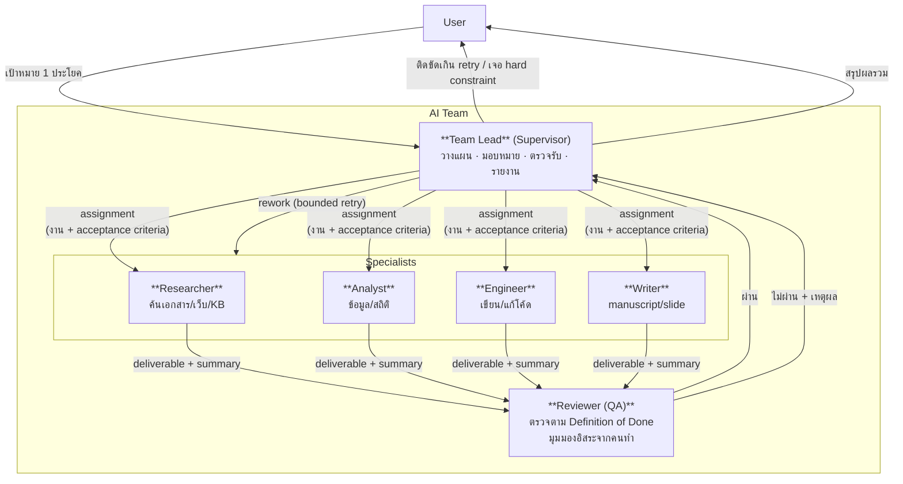
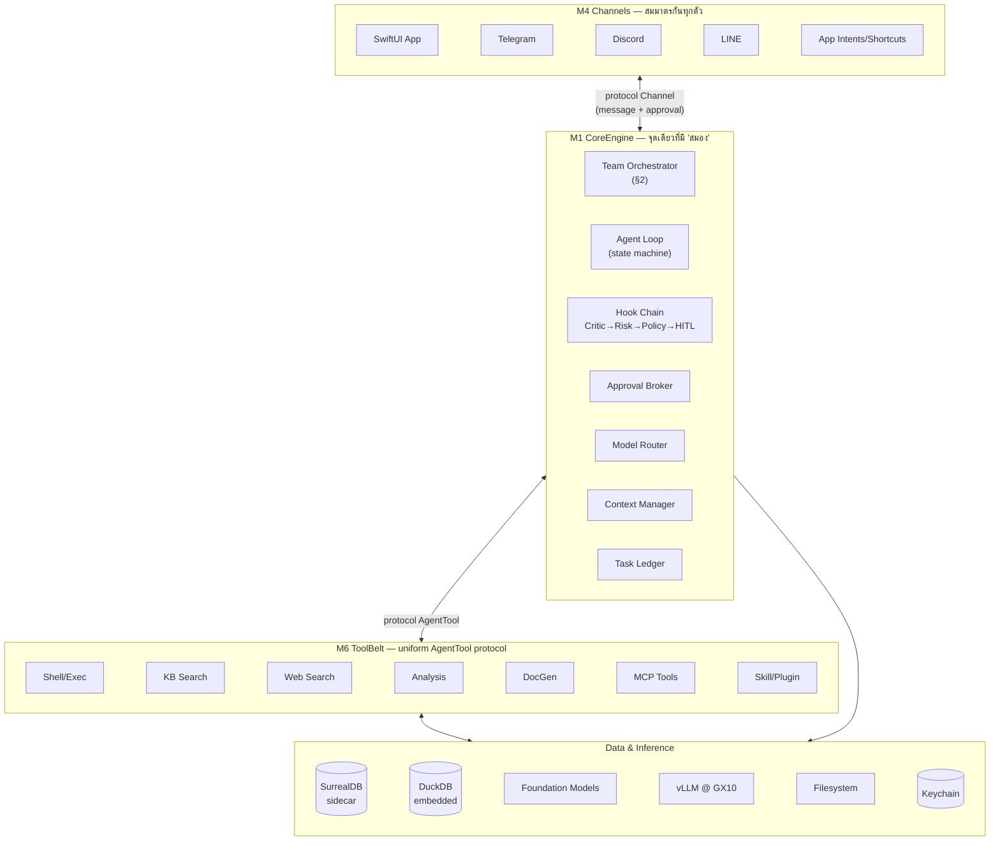
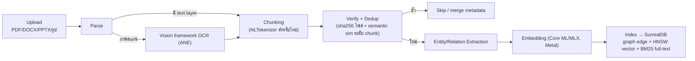
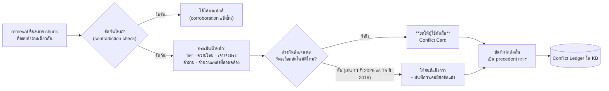
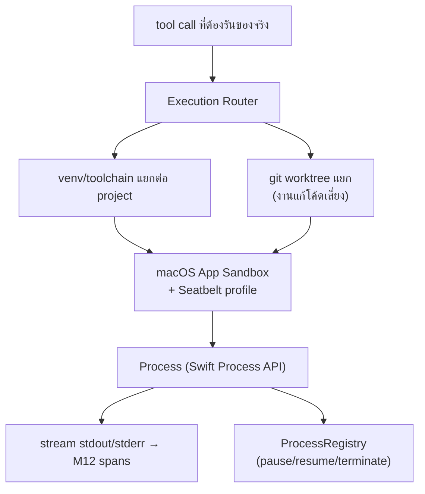
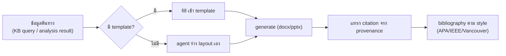
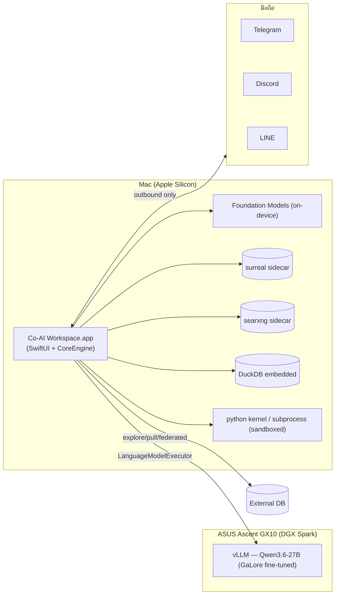
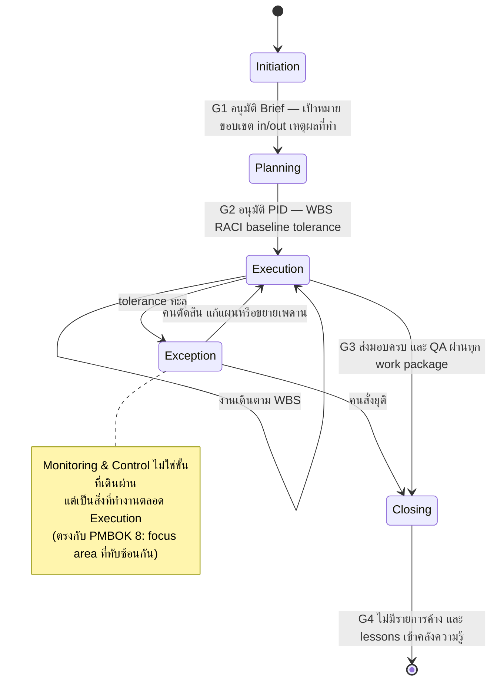
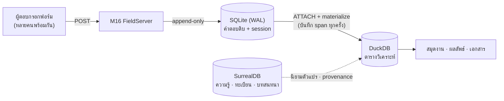
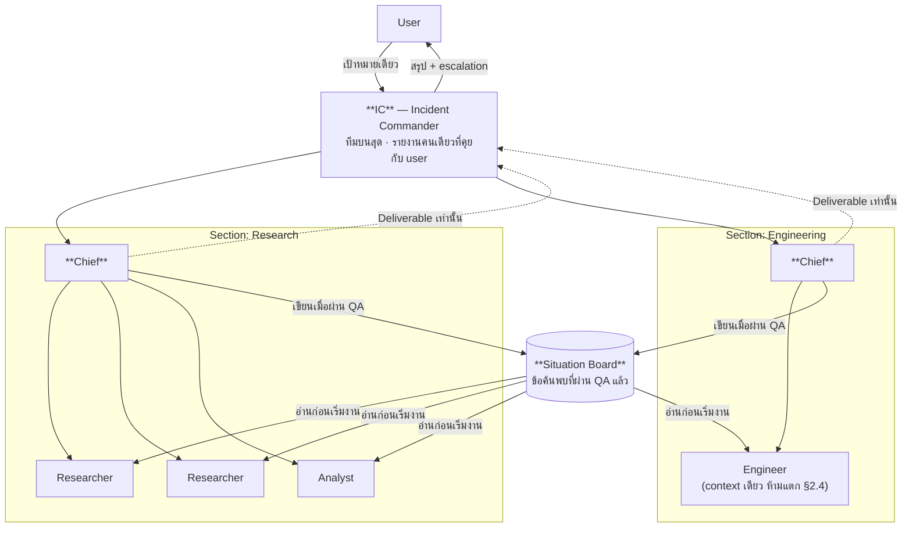

# Co-AI Workspace — Architecture & Spec (Swift Native, v2)

> **เอกสารนี้คือ *สเปก*** — ตอบว่า **ระบบคืออะไร และทำไมถึงเป็นแบบนั้น**
> ส่วน *สร้างถึงไหนแล้ว* อยู่ที่ [`IMPLEMENTATION_PLAN.md`](IMPLEMENTATION_PLAN.md) · เอกสารอ้างอิงที่แยกออกไปอยู่ใน [`docs/`](docs/)
>
> **สถานะ**: สถาปัตยกรรม v2 — แทนที่ระบบเดิม (Rust + Tauri + React) ด้วย **Swift native (SwiftUI + Swift ล้วน)** และรื้อ hierarchy ใหม่ทั้งหมด · รายละเอียดของ v1 ถูกเก็บครบใน [`docs/LEGACY_V1.md`](docs/LEGACY_V1.md) แล้ว (**ลบโฟลเดอร์ `OldARCHITECTURE/` ได้โดยไม่สูญเสียข้อมูล**)

## สารบัญ

### ส่วนที่ 1 — รากฐาน (อ่านก่อน)

| ส่วน | เนื้อหา |
|---|---|
| [§0](#0-เป้าหมายและคำนิยาม) | เป้าหมายระบบ · คำนิยาม Module/Sub-module/Feature/Function · design principles 8 ข้อ |
| [§1](#1-web-search-และการจัดชั้นแหล่งข้อมูล) | **Web search & source tiering** — T1–T5 ทุกแขนงความรู้ · สะพาน WKWebView (ข้อจำกัดที่มาก่อนการออกแบบ M6/M7) |
| [§2](#2-ai-team-model--แกนหลักของ-v2) | **AI Team Model** — หัวหน้าทีม/ลูกทีม/QA loop · manual mode |
| [§3](#3-system-hierarchy) | System Hierarchy (hub & spoke) + invariant ที่กันไม่ให้พังกลับไปเป็นแบบ v1 |
| [§4](#4-module-catalog--ภาพรวมทั้งระบบ) | **Module Catalog** — แผนที่หลัก M1–M16 (Module → Sub-module → Feature → Function) |

### ส่วนที่ 2 — รายละเอียดต่อ Module

| ส่วน | Module | เนื้อหา |
|---|---|---|
| [§5](#5-m1-coreengine) | M1 CoreEngine | team orchestrator · agent loop · hook chain · approval broker · context · ledger |
| [§6](#6-m2-agentkit) | M2 AgentKit | protocol/type กลาง ไม่มี logic |
| [§7](#7-m3-roster) | M3 Roster | skill vs agent vs plugin vs tool · manifest format |
| [§8](#8-m4-channels) | M4 Channels | GUI · Telegram · Discord · LINE · App Intents |
| [§9](#9-m5-llmproviders) | M5 LLMProviders | LLM abstraction · model router 3 tier · MLX local · budget governor |
| [§10](#10-m6-toolbelt) | M6 ToolBelt | ทูลทั้งหมดที่ agent เรียกได้ |
| [§11](#11-m7-knowledge) | M7 Knowledge | ingestion · scope · provenance/credibility · conflict ledger |
| [§12](#12-m8-analysis) | M8 Analysis | DuckDB · connectors · statistical gate · notebook · เครื่องคำนวณที่มีจริง |
| [§13](#13-m9-execution) | M9 Execution | sandbox · process registry · worktree |
| [§14](#14-m10-docgen--m13-workspaceui) | M10 · M13 | DocGen/citation · **หน้าจอทั้งหมด (§14.2)** · App Intents |
| [§15](#15-m11-config--secrets) | M11 | config layering · migration · Keychain |
| [§16](#16-m12-observability--eval) | M12 | span store · live monitor · golden task |

### ส่วนที่ 3 — สภาพแวดล้อมที่ระบบต้องรันจริง

| ส่วน | เนื้อหา |
|---|---|
| [§17](#17-hardware-topology--deployment) | Hardware Topology & Deployment |
| [§18](#18-non-functional-requirements) | Non-Functional Requirements |

### ส่วนที่ 4 — โดเมนงาน (สิ่งที่ทำให้แอปนี้ไม่ใช่ chat wrapper)

| ส่วน | เนื้อหา |
|---|---|
| [§19](#19-project-environment--project-management-m14-projectkit) | **Project Management (M14)** — General/Project · IA 4 พื้นที่ · life cycle 5 ขั้น + stage gate · WBS/Gantt/Kanban/RACI · tolerance & exception · baseline · conformance |
| [§20](#20-research-program--งานวิจัยที่เดินบนโครง-pm-m15-instruments) | **Research Program (M15 · M16)** — 8 ขั้นตอนวิจัยบนโครง PM · เครื่องมือ + ความตรง/ความเที่ยง · เว็บฟอร์ม/เซิร์ฟเวอร์/ฐานข้อมูลคำตอบ · จริยธรรม |
| [§21](#21-agent-competence-model--อะไรทำให้-agent-แต่ละตัวต่างกัน) | **Agent Competence** — 6 ชั้นที่ทำให้ agent ต่างกัน · knowledge view ต่อบทบาท · tool proficiency |

### ส่วนที่ 5 — การขยายขนาด (เพิ่ม 2026-08-15)

| ส่วน | เนื้อหา |
|---|---|
| [§22](#22-ai-organization--จากทีมเดียวเป็นองค์กร-m17-command) | **AI Organization (M17)** — ICS/EOC · recursive team encapsulation · span of control 3–7 · Situation Board · Command Tree · การรายงานที่ไม่ท่วมคน |
| [§23](#23-machine-control--ให้ระบบทดสอบหน้าจอตัวเองได้-m18-screendriver) | **Machine Control (M18)** — AX + CGEvent + ScreenCaptureKit · ให้ระบบขับหน้าจอตัวเองเพื่อทดสอบ · สิทธิ์ TCC และกับดักของมัน |
| [§24](#24-design-system--human-interface-guidelines-m13) | **Design System & HIG** — สี่เสาของ Apple · Liquid Glass ที่ใช้เท่าที่ทำหน้าที่ · Agentic UX 4 ข้อ |

### เอกสารอ้างอิงที่แยกออกไป ([`docs/`](docs/))

| ไฟล์ | อ่านเมื่อ |
|---|---|
| [`docs/DECISIONS.md`](docs/DECISIONS.md) | กำลังจะเสนอทางใหม่ — เช็คก่อนว่าเรื่องนั้นถูกตัดสินไปแล้วหรือยัง (+ open questions ที่ปิดครบแล้ว) |
| [`docs/VERIFICATION_LOG.md`](docs/VERIFICATION_LOG.md) | กำลังจะสรุปว่า "API นี้น่าจะทำได้" — ที่นี่บอกว่าวัดจริงแล้วได้อะไร |
| [`docs/ENGINEERING_NOTES.md`](docs/ENGINEERING_NOTES.md) | เจออาการแปลกกับ SurrealDB / การ bind ค่า / decoding JSON |
| [`docs/LEGACY_V1.md`](docs/LEGACY_V1.md) | อยากรู้ว่า v1 มีอะไร · เช็คว่า feature ไหนหล่นระหว่างย้าย |
| [`docs/ECOSYSTEM_REVIEW.md`](docs/ECOSYSTEM_REVIEW.md) | อยากรู้ที่มาของการเลือก Swift native / provider abstraction |
| [`docs/DRIVING_LOG.md`](docs/DRIVING_LOG.md) | อยากรู้ว่าการขับแอปด้วยมือเจอบั๊กแบบไหนที่เทสมองไม่เห็น |

---

## 0. เป้าหมายและคำนิยาม

### 0.1 เป้าหมายระบบ

ระบบ AI Agent ส่วนตัว (single-user) บน Mac ที่ทำงาน 3 กลุ่มหลัก:

1. **เขียนโค้ด** — coding agent พร้อม execution environment จริง
2. **วิเคราะห์ข้อมูล** — big data + qualitative analysis (แต่ละงานวิจัยเขียน analysis ของตัวเอง ไม่ใช่ query สำเร็จรูป)
3. **งานเอกสาร** — manuscript/slide พร้อม citation จาก paper จริง

**สิ่งที่เปลี่ยนจาก v1 เชิงแนวคิด**: v1 คือ "ชุด agent ให้ user เลือกทีละตัวจาก dropdown" — v2 คือ **AI Team ที่ user สั่งหัวหน้าทีมคนเดียว** แล้วทีมแบ่งงาน/ตรวจงานกันเองเป็น loop ([§2](#2-ai-team-model--แกนหลักของ-v2))

### 0.2 คำนิยาม: Module / Sub-module / Feature / Function

เพื่อไม่ให้เกิดปัญหาเดิม (module แตกซ้อนกัน ไม่รู้ว่าอะไรควรเป็นอะไร) เอกสารนี้ใช้นิยาม 4 ระดับที่ตายตัว:

| ระดับ | นิยาม | เกณฑ์ตัดสิน (ต้องผ่านทุกข้อ) | ตัวอย่าง |
|---|---|---|---|
| **Module** | หน่วยที่เป็นเจ้าของ domain หนึ่งอย่างสมบูรณ์ = 1 Swift target | (1) มี lifecycle/state ของตัวเอง (2) มี public interface ที่ module อื่นใช้โดยไม่ต้องรู้ข้างใน (3) ทดสอบแยกได้ (4) **ถ้าลบทิ้ง จะมีความสามารถหนึ่งหายไปทั้งก้อน** | `CoreEngine`, `Knowledge`, `Execution` |
| **Sub-module** | ส่วนประกอบภายใน Module — ไม่มีความหมายถ้าอยู่นอก module แม่ | (1) ใช้ state ร่วมกับ module แม่ (2) ไม่มี consumer นอก module แม่ (3) แยกไว้เพราะ *ความซับซ้อน* ไม่ใช่เพราะ *ขอบเขต* | `HookChain` (ใน CoreEngine), `Chunker` (ใน Knowledge) |
| **Feature** | ความสามารถที่ **user มองเห็น/ใช้ได้** — พูดถึงได้โดยไม่ต้องอ้างชื่อคลาส | (1) อธิบายเป็นประโยค "user ทำ X ได้" (2) มีจุดเข้าใช้งานใน UI หรือ channel | "อนุมัติ tool call เสี่ยงจาก Telegram", "รัน SQL cell ใน Notebook" |
| **Function** | หน่วยเรียกใช้จริง — method, tool, หรือ command | (1) มี signature ชัด (2) test ได้ตรงๆ | `run_shell`, `ApprovalBroker.resolve(id:decision:)` |

**กฎที่บังคับตัวเอง** (แก้ปัญหา v1 ที่แตก module ย่อยเกินจำเป็น):

- ห้ามสร้าง Module ใหม่ถ้ามี consumer เดียว — เป็น Sub-module ของ consumer นั้นแทน (v1 แตก `bridge-core`/`bridge-telegram`/`bridge-discord`/`bridge-line` เป็น 4 crate ทั้งที่ 3 ตัวหลังคือ implementation ของ protocol เดียวกัน → v2 รวมเป็น Module `Channels` เดียว มี 4 sub-module)
- ห้ามให้ 2 Module เก็บ state ที่ต้อง sync กันเอง — ยกขึ้นเป็น Module เดียวที่เป็นเจ้าของ (v1 มี `LiveMonitor` กับ `ProcessManager` เก็บ process list คนละที่ → v2 มี span store เดียว)
- ห้ามประกาศ type รูปร่างเดียวกันซ้ำข้าม module (v1 มี `Scope`-shaped enum 3 ตัว: `kb_store::Scope`, `config::DbConnectorScope`, `agent_registry::AgentScope`) → v2 ประกาศครั้งเดียวใน `AgentKit`

### 0.3 Design Principles (ที่มีผลต่อทุก section)

1. **AI Team เป็น first-class ไม่ใช่ agent เดี่ยวหลายตัว** — [§2](#2-ai-team-model--แกนหลักของ-v2)
2. **Agentic-by-default, manual override เสมอ** — ทุก artifact ที่ agent สร้าง แก้เองได้ตรงๆ
3. **On-device model เป็น tier ใช้งานจริง** — Foundation Models (~3B) รับงานเล็ก/บ่อย ไม่ต้อง round-trip ไป GX10 ทุกครั้ง
4. **Consolidate ไม่ใช่แตก module** — ตามกฎ [§0.2](#02-คำนิยาม-module--sub-module--feature--function)
5. **Type system บังคับ invariant แทน convention** — Swift actor/enum/protocol ทำสิ่งที่ v1 ต้องอาศัยวินัยของคนเขียน
6. **OS-native ก่อนเขียนเอง** — Vision (OCR), NaturalLanguage (ตัดคำไทย), App Sandbox, Keychain, Foundation Models
7. **ไม่พึ่ง dependency ที่ยังไม่โตพอ** — ตรวจ maturity จริง (release/commit/ดาว/คำเตือนของ maintainer เอง) ก่อนเอามาเป็นรากฐาน; ถ้าโปรโตคอลง่ายพอ เขียน client เองดีกว่าผูกกับ SDK alpha ([ภาคผนวก E](docs/VERIFICATION_LOG.md))
8. **แยก "ของ Apple ที่มีวันนี้" ออกจาก "ของ Apple ที่กำลังจะมี"** — ทุก API ที่ยังไม่อยู่ใน SDK ที่ติดตั้งจริง ต้องมี abstraction คั่นเสมอ ไม่ผูกโค้ดตรง

---

## 1. Web Search และการจัดชั้นแหล่งข้อมูล

**ข้อจำกัดที่มาก่อนการออกแบบ M6/M7** — ระบบที่ทำงานวิจัยได้ต้องตอบให้ได้ว่า *ข้อมูลนี้มาจากไหน และเชื่อได้แค่ไหน* ก่อนจะออกแบบว่าจะเก็บมันยังไง

### 1.1 ที่มาของการออกแบบ — ย้ายไป [`docs/ECOSYSTEM_REVIEW.md`](docs/ECOSYSTEM_REVIEW.md)

การสำรวจว่า **คนอื่นทำอะไรไว้แล้ว** (Swift AI agent 6 โปรเจกต์ · pattern จาก AI harness ยอดนิยม · เครื่องมือของ Apple 10 รายการ) ย้ายออกไปเป็นเอกสารอ้างอิงแยก เพราะมันคือ *ที่มา* ของการตัดสินใจ ไม่ใช่ตัวข้อผูกพัน — ข้อสรุปที่กลายเป็นสถาปัตยกรรมจริงกระจายอยู่ใน §2–§21 แล้ว

**สามข้อสรุปที่มีผลมากที่สุด**:

1. Swift ecosystem ปี 2026 มีชิ้นส่วนครบพอ — จุดที่ v1 ต้องเขียนเองเยอะที่สุด (tool-call protocol, MCP client, embedding runtime) ตอนนี้มีของสำเร็จรูปทั้งหมด
2. **harness คือ runtime รอบโมเดล ไม่ใช่ prompt** — สิ่งที่ทำให้ LLM เป็น agent คือ layer ที่จัดการ tool/memory/permission → [§5](#5-m1-coreengine) ทั้ง module
3. **supervisor pattern ต้อง hard-cap รายชื่อ worker** และ**งานที่ coupled กันแน่นห้ามแตกทีม** (คำเตือนของ Cognition) → [§2.2](#22-กติกาของหัวหน้าทีม-supervisor-contract) · [§2.4](#24-ข้อยกเว้น-งานที่ห้ามแตกทีม)

### 1.2 Web Search — มีของฟรีถาวรไหม? Apple ให้ด้วยไหม?

**คำตอบตรงๆ 2 ข้อ**:

1. **Apple ไม่มี web search API ให้นักพัฒนา** — "World Knowledge Answers" ที่เป็นข่าวคือ **ฟีเจอร์ของ Siri** (ตอบคำถามจากเว็บ + personal context) ไม่ได้เปิดเป็น public API ให้แอปอื่นเรียก ที่ Apple มีจริงคือ iTunes/App Store Search API ซึ่งค้นได้แค่ content ใน store ของตัวเอง — **ใช้กับงานวิจัยไม่ได้เลย**
2. **ของฟรีถาวรมี แต่ต้องเลือกให้ถูกชั้น** — ผู้ให้บริการเชิงพาณิชย์ปิด free tier กันหมดแล้ว (Brave ยกเลิก free tier สำหรับผู้ใช้ใหม่ตั้งแต่ต้นปี 2026 เหลือ $5 credit/เดือน ≈ 1,000 query และแผนเดิม 100 query/วัน จะปิดถาวร 1 ม.ค. 2027; Tavily/Exa/Firecrawl/Serper มี free tier แต่ throttle หนักและต้องสมัคร)

**Strategy ที่ v2 เลือก — tiering **แบบทุกแขนงความรู้** ไม่ใช่แค่การแพทย์** (v1 ผูกกับ WHO/CDC/PubMed อย่างเดียว ซึ่งแคบเกินไปสำหรับระบบที่ทำงานวิจัยได้ทุกสาขา):

| Tier | ระดับความน่าเชื่อถือ | แหล่ง (ตามสาขา) | วิธีเข้าถึง |
|---|---|---|---|
| **T1** — Authoritative | เอกสารทางการ/มาตรฐาน/กฎหมาย | **การแพทย์**: WHO, CDC, กระทรวงสาธารณสุข · **วิทยาศาสตร์/วิศวกรรม**: NIST, ISO, IEEE, IETF RFC · **สถิติ/นโยบาย**: สำนักงานสถิติ, World Bank, OECD, UN · **กฎหมาย**: ราชกิจจานุเบกษา · **เทคนิค**: เอกสารทางการของภาษา/framework | site-scoped query + API ทางการที่มี |
| **T2** — Peer-reviewed | ผ่านการตรวจสอบโดยผู้เชี่ยวชาญ | **ทุกสาขา**: OpenAlex, Crossref, Semantic Scholar, DOAJ · **การแพทย์**: PubMed · **ฟิสิกส์/คณิต/CS**: arXiv (ที่ตีพิมพ์แล้ว) · **สังคมศาสตร์**: SSRN, ERIC | API ทางการ (ฟรีถาวรทุกตัว) |
| **T3** — Preprint / กึ่งทางการ | ยังไม่ผ่าน peer review แต่มีตัวตนตรวจสอบได้ | medRxiv/bioRxiv, arXiv (preprint), รายงานของสถาบัน, thesis repository, เอกสารประกอบ conference | API ของแต่ละแหล่ง |
| **T4** — Curated community | ชุมชนที่มีกลไกตรวจสอบกันเอง | Wikipedia (+ อ้างอิงท้ายบทความ), Stack Overflow, GitHub repo ที่มีคนใช้จริง, documentation ของ OSS | API ทางการ / meta-search |
| **T5** — General web | ไม่มีกลไกตรวจสอบ | บล็อก, ข่าว, ฟอรัม, เนื้อหาทั่วไป | **`WKWebView` แบบไม่มีหน้าต่างในแอปเอง** ([§1.2.1](#121-สะพานค้นเว็บด้วย-wkwebview-แบบไม่มีหน้าต่าง-p131)) — ไม่มี key, ไม่ต้องแพ็ก runtime อะไรเพิ่ม, รัน JavaScript ได้ |

**การเลือก tier ไม่ผูกกับสาขาแบบตายตัว** — `WebSearch` ถือ **source registry** ที่แต่ละรายการประกาศ `{domain pattern, tier, สาขาที่ครอบคลุม}` แล้ว agent เลือกจาก**หัวข้อของ task** ไม่ใช่จาก hardcode ต่อ role: task การแพทย์ default ไป T1–T2 สายการแพทย์, task เขียนโค้ดไป T1 (เอกสารทางการของ framework) + T4 (Stack Overflow/GitHub), task นโยบายไป T1 (สถิติราชการ) — เพิ่มแหล่งใหม่ = เพิ่มแถวใน registry ไม่ต้องแก้โค้ด agent

🆕 **ค้นแล้วต้องอ่านจริง ไม่ใช่ตัดสินจาก snippet**: `web_search` คืนแค่รายการผลลัพธ์ — เมื่อจะอ้างอิงเนื้อหาใดต้องเรียก **`fetch_page`** ดึงหน้านั้นมาสกัดเป็นข้อความจริง (readability extraction ตัด nav/ads/footer ออก, รองรับ PDF ที่ลิงก์ตรง) แล้วค่อยสรุป — เหตุผล: snippet ของ search engine สั้นและตัดบริบท ทำให้ agent สรุปผิดได้ง่าย และเราต้องการ **provenance ระดับย่อหน้า** ไม่ใช่แค่ URL ([§11.3](#113-provenance--credibility-บังคับตั้งแต่-ingestion))

**ประวัติการตัดสินใจของช่อง T5 — เปลี่ยนแล้วหนึ่งครั้ง เพราะเกณฑ์ตัดสินเปลี่ยนจาก "รันได้ไหม" เป็น "รันได้ในแอปที่ sandbox ไหม"**:

| เมื่อ | เลือก | เหตุผล |
|---|---|---|
| 2026-08-10 | **SearXNG self-hosted sidecar** | v1 scrape HTML ของ DDG (`html.duckduckgo.com/html/`) ซึ่งพังทุกครั้งที่ markup เปลี่ยน · SearXNG มีคนดูแล parser ให้ และเราต้อง run sidecar ของ SurrealDB อยู่แล้ว จึงดูเหมือนไม่เพิ่มความซับซ้อน |
| 2026-08-14 | 🔄 **เปลี่ยนเป็น `WKWebView` ไม่มีหน้าต่าง** ([§1.2.1](#121-สะพานค้นเว็บด้วย-wkwebview-แบบไม่มีหน้าต่าง-p131)) | **SearXNG เป็น Python และ venv ของมันย้ายที่ไม่ได้** (สคริปต์ข้างในฝัง absolute path) จึงก๊อปเข้า `.app` ไม่ได้ — ติดตั้งและค้นได้จริงบนเครื่องนักพัฒนา แล้วไปตายตรงที่ผู้ใช้ต้องใช้จริง ซึ่งเป็นบทเรียน P8.4/P9.6 ซ้ำอีกครั้ง · `WKWebView` เป็นเฟรมเวิร์กของระบบ ไม่ต้องแพ็กอะไร และรัน JavaScript ได้ด้วย |

**สิ่งที่ยังอยู่จากรอบแรก**: `SearXNGSource` ยังเป็น provider ตัวหนึ่งใน `WebSearch` และใช้ได้ถ้ามีคนรัน SearXNG เองไว้ — สิ่งที่เปลี่ยนคือมันไม่ใช่ *ทางหลัก* และไม่ใช่ sidecar ที่แอปแพ็กมาให้อีกต่อไป (`SidecarManager` จึงดูแลแค่ `surreal` ตัวเดียว — [§11.5](#115-surrealdb-sidecar--client-ของเราเอง))

**ทางเลือกที่เปิดไว้**: `WebSearch` module ออกแบบเป็น provider protocol อยู่แล้ว — ถ้าวันหนึ่งอยากจ่ายเงินใช้ Tavily/Exa (ซึ่งคืนผลแบบ LLM-ready ดีกว่า) แค่เพิ่ม provider ใหม่ ไม่ต้องแก้ agent

---
#### 1.2.1 สะพานค้นเว็บด้วย WKWebView แบบไม่มีหน้าต่าง (P13.1)

**ไอเดีย**: ฝัง `WKWebView` ที่ไม่แสดงหน้าต่างไว้ในแอป ให้ agent สั่งมันเปิดหน้าค้นหา อ่านรายการผล เลือกลิงก์ที่น่าอ่าน แล้วโหลดหน้านั้นมาเข้าท่อ ingestion เดิม — ค้นเว็บโดยไม่มี API key และไม่มีค่าใช้จ่ายรายเรียก

**ทำไมน่าทำจริง ไม่ใช่แค่ประหยัด** — มันชนะสองข้อที่ SearXNG กับ `URLSession` ทำไม่ได้:

1. **มันอยู่ในแอปที่ sandbox แล้ว** ซึ่งเป็นเกณฑ์ตัดสินของ P13.1 ทั้งข้อ (บทเรียน P8.4/P9.6: ของที่รันได้บนเครื่องนักพัฒนา ไม่ได้แปลว่ารันได้ใน `.app` ที่ sandbox) SearXNG ต้องแพ็ก Python runtime มาเป็น sidecar — WKWebView คือเฟรมเวิร์กของระบบ ไม่ต้องแพ็กอะไร
2. **มันรัน JavaScript** ⇒ อ่านหน้าที่ render ฝั่ง client ได้ ซึ่ง `PageFetcher` วันนี้ทำไม่ได้ (`FetchError.empty` ที่เจอบ่อยคือหน้าแบบนี้)

**รูปร่างที่จะทำ** — ต่อเข้าที่เดิมทั้งหมด ไม่มีเส้นทางใหม่:

```
HeadlessBrowser (actor + WKWebView, MainActor-bound, คิวเดียว)
   ├── SERPReader ต่อ engine  → [WebResult]   (เข้า provider protocol เดิมของ WebSearch)
   └── renderedHTML(url:)      → PageFetcher/Readability เส้นเดิม → provenance + tier เดิม
```

* `web_search` / `fetch_page` **ไม่เปลี่ยนสัญญา** — agent เรียกทูลเดิม การจัดชั้นความเสี่ยง/effect เดิม (อ่านได้ทุกขั้น)
* **T5 ยังเป็น T5** — กติกา corroboration ของ [§14.1](#141-docgen) ไม่ผ่อนเพราะค้นง่ายขึ้น (Done-when ของ P13.2 พูดข้อนี้ไว้แล้ว)
* หน้าที่โหลดมา **เป็นข้อมูล ไม่ใช่คำสั่ง** — เว็บที่มีข้อความสั่ง agent คือ prompt injection ที่หน้าเว็บพาเข้ามา ข้อความจากหน้าเว็บเข้าคลังความรู้ในฐานะเนื้อหาที่มี provenance เท่านั้น ไม่ถูกต่อท้าย system prompt

**ราคาที่ต้องเขียนไว้ก่อน ไม่ใช่ค้นพบทีหลัง**:

| ความเสี่ยง | ทางรับมือที่ตั้งใจไว้ |
|---|---|
| **bot detection / CAPTCHA** โดยเฉพาะกับ Google | **ระบบไม่แก้ CAPTCHA** — หน้าที่เจอด่านต้องคืน error ที่แปลว่า "ต้องให้คนช่วย" ไม่ใช่ผลลัพธ์ว่าง (ผลว่างแยกไม่ออกจาก "ไม่มีข้อมูล" ซึ่งเป็นการโกหกที่แพงที่สุดของงานวิจัย) · ตั้งค่าเริ่มต้นไปที่ engine ที่ยอมให้เข้าถึงแบบนี้ (SearXNG instance ของเราเอง, DDG html) ไม่ใช่ Google |
| **ToS ของเครื่องมือค้นหา** | เป็นการตัดสินใจของผู้ใช้ต่อ engine ที่เขาเลือก — หน้าตั้งค่าบอกตรง ๆ ว่า engine ไหนอนุญาต และค่าเริ่มต้นไม่ใช่ Google |
| **parser ของหน้าผลลัพธ์พัง** (บทเรียน v1 ที่ scrape DDG) | `SERPReader` ต้อง **fail ดัง** — เจอ 0 ผลจากหน้าที่โหลดสำเร็จ = error ไม่ใช่รายการว่าง · เก็บ HTML ที่อ่านไม่ออกไว้ให้ debug |
| **หน่วยความจำและสถานะ** | WKWebView หนึ่งตัว คิวเดียว ล้าง cookie/website data ต่อรอบค้น (เราไม่ต้องการ session ที่ถูกจำ) · timeout ต่อหน้า |
| **เร็วเกินไป = ถูกบล็อก** | หน่วงต่อโดเมน + cache ผลของ URL เดิมในรอบเดียวกัน |

**สถานะ: ✅ พิสูจน์แล้วใน `.app` ที่ build + sandbox (2026-08-14)** — ค้น "ความชุกภาวะหมดไฟในพยาบาลไทย" ได้ผลจริง 8 รายการ แล้วกด "อ่านหน้านี้" ได้บทความจริง **38 ย่อหน้า** ผ่าน `Readability` เส้นเดิม พร้อม provenance และ tier · `HeadlessPageReader` conform `PageReading` ⇒ `fetch_page`/`ingest_url`/citation ทั้งเส้นได้เบราว์เซอร์ไปใช้โดยไม่มีอะไรเปลี่ยน · ไม่ต้องแพ็ก Python และไม่ต้องมี sidecar ที่สอง

**สิ่งที่การขับจริงจับได้ และแก้แล้ว**: ผลค้นภาษาไทยทั้ง 8 รายการเป็น **T5 ทั้งหมด** — วารสารใน TCI, คลังวิทยานิพนธ์มหาวิทยาลัย, เอกสารของโรงพยาบาล — ซึ่งตามกติกา corroboration ของ [§14.1](#141-docgen) แปลว่า **งานวิจัยภาษาไทยไม่มีทางอ้างอิงได้เลย** และนั่นไม่ใช่คุณสมบัติของแหล่ง มันคือรูในทะเบียน · เพิ่ม `tci-thaijo.org`/`thaijo.org` เป็น T2 และคลังของมหาวิทยาลัย/ThaiLIS/วช. เป็น T3 แล้วค้นซ้ำได้ T2/T3 ตามจริง

---

## 2. AI Team Model — แกนหลักของ v2

### 2.1 แนวคิด

แทนที่ user จะเลือก agent เองจาก dropdown ทีละตัว (ปัญหาของ v1 ที่มี "5 ชื่อ dispatch" แต่ไม่มี routing layer จริง) — v2 ให้ user **สั่งหัวหน้าทีมคนเดียว** แล้วหัวหน้าแตกงานให้ลูกทีมเอง พร้อมมี QA ตรวจตามมาตรฐานก่อนส่งกลับ



### 2.2 กติกาของหัวหน้าทีม (Supervisor Contract)

จาก best practice ([§1.2](docs/ECOSYSTEM_REVIEW.md#2-ai-harness-ยอดนิยม--pattern-ที่ยืมมา)) — failure mode ที่รู้กันของ supervisor pattern คือ over-delegation และกลายเป็นคอขวด v2 บังคับกติกาไว้ในโค้ดไม่ใช่แค่ prompt:

| กติกา | บังคับยังไง |
|---|---|
| หัวหน้าทีมมอบหมายได้เฉพาะ role ที่มีจริงใน roster | `enum Role` — Swift compiler บังคับ exhaustive ไม่มีทางเรียกชื่อมั่ว |
| ทุก assignment ต้องมี **acceptance criteria** ติดไปด้วย | struct `Assignment { goal, inputs, acceptanceCriteria, deliverableType }` — field ไม่ optional |
| หัวหน้าทีมไม่ลงมือทำงานเอง (ยกเว้นงาน trivial ที่ไม่คุ้มมอบหมาย) | tool set ของ Team Lead จำกัดไว้ที่ plan/delegate/review/report — ไม่มี `run_shell` |
| จำนวน assignment ต่อรอบมี cap | `maxAssignmentsPerRound` ใน config (default 5) กัน fan-out ระเบิด |
| Task ledger เป็น source of truth ไม่ใช่ context ของหัวหน้า | เขียนลง SurrealDB ทันทีที่วางแผนเสร็จ อ่านใหม่ทุกรอบ (plan re-grounding — งานวิจัยชี้ว่า goal drift เป็นสาเหตุ ~65% ของ agent failure ในงาน multi-step) |

### 2.3 Context Isolation & กติกาการคืนงาน

- **Specialist แต่ละตัวรันเป็น Swift `actor` แยก** — คืนกลับหาหัวหน้าทีมได้แค่ `Deliverable { summary, artifacts: [ArtifactRef], evidence: [Evidence] }` **ไม่ใช่ transcript เต็ม** (actor isolation ให้ compiler การันตี แทนที่จะพึ่งวินัยเหมือน v1)
- `artifacts` เก็บเป็น **pointer** (path/record id) ไม่ใช่เนื้อหาดิบ — ตรงกับหลักที่ Claude เองใช้ตอน compact (ทิ้ง raw tool-output ก่อน)
- `evidence` คือสิ่งที่ QA ใช้ตรวจ (exit code, test output, assumption check result, citation+tier) — **ไม่ใช่คำกล่าวอ้างของโมเดล**

### 2.4 ข้อยกเว้น: งานที่ห้ามแตกทีม

**Engineer role ทำงานใน context เดียวเสมอ ห้าม fan-out ย่อยเป็นหลาย sub-engineer** — เหตุผลตรงกับที่ Cognition (ผู้สร้าง Devin) เตือน และตรงกับ decision D3 ของ v1: งานแก้โค้ดหลายไฟล์ที่ผูกกันแน่นต้องการ context ทั้งก้อน การตัดเป็น summary ทำให้ agent แก้ขัดกันเอง

fan-out ใช้ได้เฉพาะงานที่ **decompose ได้จริงและอิสระต่อกัน** — เช่น Researcher หลายตัวค้นคนละ source tier พร้อมกัน

### 2.5 QA Loop — "ตรวจตามมาตรฐาน"

QA ไม่ใช่ agent ที่ถามว่า "ดีไหม" แต่ตรวจตาม **Definition of Done ต่อ role** ที่ประกาศไว้ใน manifest:

| Role | Definition of Done (ตรวจด้วยหลักฐาน ไม่ใช่คำพูด) |
|---|---|
| Engineer | มี tool call ที่รัน build/test/lint จริงและ exit code = 0 อยู่ใน transcript ของ task นั้น (external-truth-gated done) |
| Analyst | ผ่าน Statistical Verification Gate (assumption check ตรงกับ test ที่ใช้ — [§11.3](#123-statistical-verification-gate-feature)) + ทุก variable definition มี origin tag ที่ `human_confirmed` แล้ว |
| Researcher | ทุกข้อสรุปมี ≥2 source **และอ่านเนื้อหาจริงผ่าน `fetch_page` แล้ว ไม่ใช่ตัดสินจาก snippet**; corroboration แข็งต้องมาจาก T1–T2 (T5 สองแหล่งยังถือว่าอ่อน); ข้อขัดแย้งที่เจอต้องเข้า Conflict Ledger ไม่ใช่เลือกข้างเงียบๆ |
| Writer | ทุกประโยคที่มาจาก KB มี inline citation ผูก provenance จริง + assumption ที่เป็น `agent_suggested` ขึ้นบัญชีใน Limitations |

**Loop**: ไม่ผ่าน → หัวหน้าทีมส่ง rework พร้อมเหตุผลจาก QA → retry ได้จำกัดจำนวน (default 3, ตั้งใน config) → เกินแล้ว **escalate หา user** ว่า "ติดขัด ต้องการคนช่วย" ไม่ใช่วนไม่จำกัดจนหมด budget

### 2.6 Manual Mode — ไม่ใช่ทุกอย่างต้องผ่านทีม

**"บางทีมันก็ต้อง manual เอง"** — บังคับให้มีทางลัดทุกชั้น:

| ระดับ | สิ่งที่ user ทำได้ตรงๆ |
|---|---|
| ข้าม Team Lead | คุยกับ specialist ตัวใดตัวหนึ่งตรงๆ (dropdown เลือก role แบบ v1 ยังอยู่ ไม่ได้ถอดออก) |
| ข้าม agent ทั้งหมด | รัน SQL/Python เองใน Notebook, query DB เองใน DB Explorer, แก้ไฟล์เองใน editor |
| แก้ระหว่างทาง | แก้ plan รายขั้นก่อน approve, แก้ query ที่ agent เขียนก่อนรัน, แก้ Analysis Plan ทีละ field |
| หยุด | pause/stop ราย process, stop ทั้ง session, Plan-only mode (คิดอย่างเดียว ห้ามทำ) |

### 2.7 ขอบเขตของ section นี้ — ทีมเดียว

ทุกอย่างข้างบนอธิบาย **ทีมเดียว หัวหน้าหนึ่งคน ลูกทีมสี่บทบาท** ซึ่งพอสำหรับงานที่แตกได้ราว 4–5 ใบ งานที่ใหญ่กว่านั้นต้องมีหลายทีมและมีทีมย่อยเป็นชั้น ๆ → [§22 AI Organization](#22-ai-organization--จากทีมเดียวเป็นองค์กร-m17-command)

**§22 ไม่ได้แทนที่ section นี้ — มันเรียกใช้ซ้ำ**: ทีมย่อยหนึ่งทีม *คือ* specialist หนึ่งรายของทีมแม่ กติกาทุกข้อใน §2.2–§2.5 จึงบังคับเหมือนกันทุกชั้น รวมถึงข้อห้าม fan-out ของ Engineer

---

## 3. System Hierarchy

ปัญหาของ layering เดิม (L1 Presentation → L5 Data): approval ต้องข้ามชั้นจาก L2 ไปโผล่ L1, channel อยู่ปนกับ GUI, capability 6 อย่างที่ lifecycle ต่างกันถูกยัดเป็นชั้นเดียว

v2 = **Core อยู่ตรงกลาง, ที่เหลือเป็น plugin สมมาตรกัน**:



**Invariant ที่ทำให้ hierarchy นี้ไม่พังกลับไปเป็นแบบเดิม**:

- ไม่มี channel ไหน execute tool ได้เอง — ต้องผ่าน Core เสมอ (v1 เคยพลาดจุดนี้: Telegram bridge สร้าง `AgentLoop` เองพร้อม `ShellTool` ข้าม hook chain ทั้งหมด = remote shell ไม่มี approval — bug B2 ที่ severity สูงสุดของ v1)
- ไม่มี tool ไหนเรียก channel โดยตรง — ส่งผ่าน Core's event bus
- ไม่มี module ไหนอ่าน config file เอง — ผ่าน `Config` module อย่างเดียว

---

## 4. Module Catalog — ภาพรวมทั้งระบบ

ตารางนี้คือ **แผนที่หลักของระบบ** — ตอบโจทย์ "อันไหนควรเป็น Module อันไหนเป็น sub-module อันไหน Feature อันไหน Function" ครบทั้งระบบ

**รายละเอียดของแต่ละ Module**: M1–M12 อยู่ใน [§5](#5-m1-coreengine)–[§16](#16-m12-observability--eval) · M13 WorkspaceUI อยู่ใน [§14.2](#142-workspaceui--หน้าจอทั้งหมด) (และโครงหน้าจอที่ใช้จริงอยู่ใน [§19.2](#192-information-architecture--พื้นที่-และ-sub-tab-ของแต่ละพื้นที่)) · **M14 ProjectKit อยู่ใน [§19](#19-project-environment--project-management-m14-projectkit)** · **M15 Instruments กับ M16 FieldServer อยู่ใน [§20](#20-research-program--งานวิจัยที่เดินบนโครง-pm-m15-instruments)**

| # | Module (Swift target) | Sub-modules | Features (user เห็น) | Key Functions |
|---|---|---|---|---|
| **M1** | **CoreEngine** — สมองกลางของระบบ | TeamOrchestrator · AgentLoop · HookChain · ApprovalBroker · ModelRouter · ContextManager · TaskLedger · EventBus | AI Team, โหมดการทำงาน 4 แบบ, อนุมัติงานเสี่ยงจากทุกช่องทาง, Run-until-done, Plan-only | `Team.assign(_:)` · `HookChain.preToolUse(_:)` · `ApprovalBroker.request(_:)/resolve(_:)` · `ModelRouter.select(for:)` · `ContextManager.compact(_:)` |
| **M2** | **AgentKit** — protocol/type กลาง (ไม่มี logic) | Protocols · CoreTypes · Errors | — (infrastructure) | `protocol AgentTool` · `protocol Channel` · `protocol Specialist` · `enum Scope` · `struct Assignment/Deliverable` |
| **M3** | **Roster** — ทะเบียน capability แบบ declarative | AgentManifest · SkillRegistry · PluginRegistry | สร้าง/แก้ agent เอง, สร้าง/แก้/import/export skill, ติดตั้ง plugin, agent เขียน skill เองได้ | `Roster.loadAgents(from:)` · `write_skill` · `install_plugin` · `parseFrontmatter(_:)` |
| **M4** | **Channels** — ทุกช่องทางเข้า-ออก | GUIChannel · TelegramChannel · DiscordChannel · LINEChannel · AppIntentsChannel · Notifier | คุมงานจากมือถือทุกแพลตฟอร์ม, อนุมัติ/ปฏิเสธจากแชต, แจ้งเตือน native, สั่งผ่าน Siri/Shortcuts | `Channel.send(_:)` · `Channel.present(_ request:)` · `Notifier.completion(_:)` |
| **M5** | **LLMProviders** — ชั้นเชื่อมโมเดลทั้งหมด | FoundationModelsAdapter · **MLXRuntime** ([§9.4](#94-mlx-local-tier-05--model-management)) · VLLMExecutor · EndpointRegistry · TokenAccountant · **BudgetGovernor** ([§9.5](#95-budget-governor--คุมค่าใช้จ่ายของ-tier-1b)) | ตั้งค่าหลาย endpoint พร้อมกัน, **โหลดโมเดล MLX จาก HuggingFace หรือเลือกจากที่มีอยู่**, กำหนดโมเดลต่อ role, **ตั้งเพดานค่าใช้จ่ายของ endpoint ที่คิดเงิน**, สถานะการเชื่อมต่อ, ดู token/ค่าใช้จ่ายที่ใช้ | `LLMExecutor` impl · `MLXRuntime.download(repo:)`/`.loadLocal(path:)` · `EndpointRegistry.probe(_:)` · `BudgetGovernor.authorize(_:)` · `TokenAccountant.usage(session:)` |
| **M6** | **ToolBelt** — tool ทั้งหมดที่ agent เรียกได้ | ShellTool · FileTool · KBTool · **WebSearchTool + PageReader** · AnalysisTool · DocGenTool · InstallPackageTool · MCPBridge · SkillTool | agent รันคำสั่ง, ค้น KB, **ค้นเว็บแบบจัด tier ทุกแขนง + อ่านเนื้อหาหน้าเว็บจริง**, query ข้อมูล, สร้างเอกสาร, ติดตั้ง package, ใช้ MCP tool | `run_shell` · `kb_search` · `web_search` · **`fetch_page`** · **`ingest_url`** · `analysis_query`/`analysis_execute` · `save_document` · `install_package` · `write_skill` · `fetch_docs` |
| **M7** | **Knowledge** — GraphRAG + KB store | Ingestion · Chunker · Dedup · EntityExtractor · Embedder · HybridSearch · **CredibilityIndex** · **ConflictLedger** ([§11.6](#116-conflict-ledger--เมื่อความรู้ขัดกัน)) · KBStore · SidecarManager | อัปโหลด PDF/DOCX/PPTX/รูป, **ดึงหน้าเว็บเข้า KB**, ดู/แก้ entity-relation graph, ค้นแบบ hybrid, **เห็น tier ความน่าเชื่อถือของทุกผลลัพธ์**, **ตัดสินความรู้ที่ขัดกันเอง**, KB แยก central/project/policy, export/import | `Knowledge.ingest(file:scope:)` · `Knowledge.ingest(url:)` · `hybridSearch(_:)` · `ConflictLedger.detect(_:)`/`.resolve(_:by:)` · `KBStore.runQuery(_:)` · `SidecarManager.start()` |
| **M8** | **Analysis** — งานข้อมูล/สถิติ | AnalysisStore(DuckDB) · **OLTPStore(SQLite WAL — ทางเขียนของ M16, [§19.17](#1917-ฐานข้อมูลภายในของโปรเจกต์--sql-nosql-และช่องว่างจริงที่ต้องเติม))** · DBConnectors · NotebookKernel · StatGate | Notebook (SQL+Python cell), DB Explorer, ดึงตารางจาก external DB, federated query, ตรวจ assumption อัตโนมัติ | `AnalysisStore.query(_:)` · `pull_db_table` · `NotebookKernel.execute(cell:)` · `StatGate.check(test:result:)` |
| **M9** | **Execution** — รันของจริงอย่างปลอดภัย | ProcessRunner · SandboxPolicy · VenvManager · WorktreeManager · ProcessRegistry | ดู/หยุด/พัก process ทุกตัว, isolation ต่อ project, worktree สำหรับงานเสี่ยง | `Execution.run(spec:)` · `RunningProcess.pause()/resume()/terminate()` · `Worktree.create(for:)` |
| **M10** | **DocGen** — งานเอกสาร | TemplateEngine · CitationEngine · Exporters | สร้าง manuscript/slide, upload ตัวอย่าง→auto-parse เป็น template, แก้ template เอง, bibliography อัตโนมัติ | `DocGen.render(template:data:)` · `CitationEngine.attach(provenance:)` · `export(.docx/.pptx)` |
| **M11** | **Config & Secrets** | SettingsSchema · Layering · Migration · KeychainStore | หน้า Settings ทุกหมวด, export/import profile, hot-reload | `Config.effective()` · `Config.validate(_:)` · `Keychain.set(_:for:)` |
| **M12** | **Observability & Eval** | SpanStore · LiveMonitorFeed · GoldenTaskHarness · UsageLog | Live Monitor หน้าเดียว (session + global), audit ย้อนหลัง, regression eval | `Span.begin(_:)/end(_:)` · `GoldenTask.run(suite:)` |
| **M13** | **WorkspaceUI** (App target) | 4 พื้นที่ + sub-tab ตาม [§19.2](#192-information-architecture--พื้นที่-และ-sub-tab-ของแต่ละพื้นที่): **Chat** (ประวัติ·บทสนทนา·จอเฝ้าทีม·แถบสถานะที่กดได้) · **Plan** (ภาพรวม·WBS+Gantt·Kanban·ทีม&RACI·ทะเบียน·รายงาน — แก้ inline) · **Workbench** (เก็บข้อมูล·DB ภายใน·DB ภายนอก·สคริปต์+คอนโซล·ผลลัพธ์) · **Knowledge** (เอกสาร·กราฟ·ข้อขัดแย้ง·แหล่ง) + Settings/Models/Budget/Audit | ทุกหน้าจอของแอป | SwiftUI views |
| **M14** | **ProjectKit** — โปรเจกต์เป็น first-class ([§19](#19-project-environment--project-management-m14-projectkit)) | ProjectStore · StageGate · WBS · Schedule · Board · RACI · Registers · Tolerance/Exception · Baseline/ChangeControl · Benefits · Reporting | สร้าง/ปิดโปรเจกต์, ขอบเขต in/out, WBS, Gantt, Kanban, RACI, ตั้ง tolerance, อนุมัติ gate, register 5 ตัว, รายงาน 3 แบบ | `StageGate.evaluate(_:)` · `WBS.validate(_:)` · `Schedule.criticalPath(_:)` · `Tolerance.check(_:)` · `Baseline.freeze(_:)` · `Report.render(_:)` |
| **M15** | **Instruments** — ออกแบบเครื่องมือวิจัย ([§20.3](#203-m15-instruments--เครื่องมือเก็บข้อมูล)) · **ไม่แตะเครือข่าย** | Builder · Blueprint · Versioning · Validity · Qualitative | สร้าง/แก้แบบสอบถาม-แบบสัมภาษณ์, ผังข้อ↔construct↔คำถามวิจัย, ตรวจความตรงเชิงเนื้อหาด้วยผู้เชี่ยวชาญ, α/ω/ICC/κ/EFA, ลงรหัสข้อมูลเชิงคุณภาพ | `InstrumentGate.approve(_:)` → `PublishedInstrument` · `ContentValidity.assess(_:)` · `Reliability.cronbach(_:)`/`.icc(_:)`/`.omega(_:)` · `Agreement.cohensKappa(_:)`/`.fleissKappa(_:)` · `ExploratoryFactorAnalysis.analyse(_:)` · `ScaleReport.of(_:)` |
| **M16** | **FieldServer** — เว็บฟอร์ม + เซิร์ฟเวอร์ + ฐานข้อมูลคำตอบ ([§20.7](#207-m16-fieldserver--เว็บฟอร์ม-เซิร์ฟเวอร์-และฐานข้อมูลคำตอบ)) · **พื้นผิวเดียวของระบบที่รับ input จากคนนอก** | HTTPServer · FormRuntime · SessionStore · ConsentGate · ResponseStore · Linkage · Waves | เปิดฟอร์มให้คนอื่นเข้ามากรอก, กรอกต่อทีหลัง, หน้าความยินยอม, เก็บคำตอบเป็นฐานข้อมูลของงานวิจัยนั้น, งานระยะยาวหลายรอบแบบนิรนาม | `FieldServer.start(_:)/.stop()` · `Wave.open(_:)/.close(_:)` · `ResponseStore.append(_:)` · `Linkage.resolve(_:)` (เขียน audit เสมอ) |

| **M17** | **Command** — องค์กรหลายทีมแบบ ICS/EOC ([§22](#22-ai-organization--จากทีมเดียวเป็นองค์กร-m17-command)) · **ยังไม่เริ่ม** | TeamNode · TeamCharter · SpanOfControl · SituationBoard · CommandLedger | ตั้งทีมย่อยอัตโนมัติเมื่องานเกิน 7 ใบ, Command Tree View, หัวหน้าเดียวที่รายงานคน, บอร์ดกันงานซ้ำ | `Team: Specialist` (การซ้อนอยู่ในไทป์) · `TeamNode.spawnSubteam(_:)` · `SituationBoard.publish(_:)` (รับเฉพาะสิ่งที่ผ่าน QA) |
| **M18** | **ScreenDriver** — ให้ระบบขับหน้าจอตัวเองเพื่อทดสอบ ([§23](#23-machine-control--ให้ระบบทดสอบหน้าจอตัวเองได้-m18-screendriver)) · **ยังไม่เริ่ม** | AXNavigator · EventSynthesizer(CGEvent) · ScreenObserver(ScreenCaptureKit) · PermissionGate | agent เปิดแอปแล้วกดเองเพื่อพิสูจน์ว่าหน้าจอทำงาน, หลักฐานภาพ+AX ที่ QA อ่านได้ | `AXNavigator.find(label:)` · `EventSynthesizer.type(_:into:)` · `ScreenObserver.capture(window:)` · **จำกัดที่ pid ของแอปตัวเองเป็นค่าเริ่มต้น** |

**target เล็กที่ไม่ได้เป็นโมดูลในความหมายข้างบน**: `StatKit` (ปลายการแจกแจง + eigen-decomposition — ไม่มี dependency และไม่มี I/O) กับ `CLapack` (C shim บาง ๆ ตัวเดียวไปที่ Accelerate) แยกออกมาใน P11.3 เพราะ M8 กับ M15 ต้องใช้เลขคณิตชุดเดียวกัน แต่ M15 ห้ามพึ่ง M8 ([§20.6](#206-m15--module-และ-invariant)) — สำเนาที่สองของ continued fraction คือรูปความผิดพลาดเดียวกับ SQL guard ที่เคยมีสองชุดแล้วเพี้ยนออกจากกัน

**หมายเหตุการจัดกลุ่มที่ต่างจาก v1 อย่างมีเจตนา**:

| v1 | v2 | เหตุผล |
|---|---|---|
| `bridge-core` + `bridge-telegram` + `bridge-discord` + `bridge-line` (4 crate) | **M4 Channels** (1 module, 4 sub-module) | 3 ตัวหลังคือ implementation ของ protocol เดียวกัน — ไม่มี consumer แยก ตามกฎ [§0.2](#02-คำนิยาม-module--sub-module--feature--function) |
| `graphrag` + `kb-store` + `thai-nlp` (3 crate) | **M7 Knowledge** (1 module) | ทั้ง 3 ตัวมี consumer เดียวกันและ state ผูกกัน (chunk ที่ tokenize แล้วต้องตรงกับ index ที่สร้าง) |
| `analysis-store` + `db-connectors` + `notebook-kernel` (3 crate) | **M8 Analysis** (1 module) | ทั้งหมดคือ "งานข้อมูล" domain เดียว — v1 แยกแล้วต้องเขียน glue ข้ามกันตลอด |
| `executor` (1 crate) | **M9 Execution** (คงเดิม) | เป็น domain ที่ชัดและมีหลาย consumer จริง — ถูกต้องอยู่แล้ว |
| `orchestrator` + `agent-core` (2 crate) | **M1 CoreEngine** + **M2 AgentKit** | ยังแยก 2 ตัว แต่เส้นแบ่งใหม่: M2 = type/protocol ล้วน (ไม่มี logic, ทุก module import ได้โดยไม่เกิด cycle), M1 = logic ทั้งหมด |
| `agent-registry` + `skill-registry` + `plugin-registry` (3 crate) | **M3 Roster** (1 module) | ทั้งหมดคือ "ทะเบียน capability ที่โหลดจากไฟล์" — v1 ยอมรับเองว่า reuse parser ตัวเดียวกัน |
| `app-tauri` + `frontend` | **M13 WorkspaceUI** | รวมเป็น SwiftUI app เดียว — ไม่มีเส้นแบ่ง IPC ให้ sync กันอีก |

---

## 5. M1 CoreEngine

Module ที่ใหญ่และสำคัญที่สุด — ทุกอย่างที่เป็น "การตัดสินใจ" อยู่ที่นี่ที่เดียว

### 5.1 Team Orchestrator (sub-module)

implement [§2](#2-ai-team-model--แกนหลักของ-v2) ทั้งหมด

**Functions**: `plan(goal:) -> [Assignment]` · `dispatch(_:to:)` · `review(_:)` · `rework(_:reason:)` · `escalate(_:)` · `report()`

**Features ที่ user เห็น**: สั่งเป้าหมายเดียวแล้วทีมทำงานต่อกันเอง · เห็นว่าใครทำอะไรอยู่ใน Team View · แทรกแก้ assignment ก่อนเริ่มได้

### 5.2 Agent Loop (sub-module)

state machine ที่ compiler บังคับ exhaustive:

```swift
enum AgentState {
    case clarifying(ClarifyContext)
    case planning(PlanContext)
    case awaitingCritique(Step, PlanContext)
    case awaitingApproval(Step, ApprovalRequest)
    case executing(Step, PlanContext)
    case reviewing(Deliverable)          // ใหม่ใน v2 — QA loop
    case done(Summary)
    case failed(AgentError)
}
```

**Clarify Stage** (คงจาก v1): เช็คคำสั่งกำกวมก่อนวางแผน ถูกกว่าปล่อยให้ Critic จับ plan ผิดโจทย์ทีหลัง — มี specialization สำหรับงานวิจัย ([§8.2](#124-gap-detection-mode-feature))

### 5.3 Hook Chain Gate (sub-module)

hook ที่วิ่ง**รอบทุก tool call** ไม่ใช่แค่ตอนวางแผน — ลำดับ: `Critic → Risk Scorer → Policy Gate → HITL`

| Hook | ทำอะไร | ผลลัพธ์ที่เป็นไปได้ |
|---|---|---|
| **Critic** (PreToolUse) | validate schema + logic เทียบ golden-task pattern | ผ่าน / ตีกลับพร้อมเหตุผล |
| **Risk Scorer** | ให้คะแนนความเสี่ยงจาก tool + argument + context | low / medium / high |
| **Policy Gate** | ดึง policy chunk ที่ `hard_constraint: true` จาก KB มาเทียบ action | ผ่าน / **hard stop** (ไม่ใช่แค่ "ต้อง approve" — ต้องแสดง chunk ที่ขัดกันตรงๆ ใน prompt) |
| **HITL** | ขออนุมัติเมื่อเกิน threshold ของ Autonomy Slider | approve / reject / แก้ไข |
| **PostToolUse** | เช็คผลลัพธ์ (เช่น Statistical Verification Gate, compiler output) | ผ่าน / ส่ง structured warning กลับ |

**Risk classification ต่อ tool (default)** — คงจาก v1: `kb_search`/`web_search`/`analysis_query` = Low · `analysis_execute`/`save_document` = Medium · `run_shell`/`install_package` = High

**Invariant**: agent ตัวไหนก็ตาม (built-in หรือ custom manifest) ที่มี tool risk-sensitive **ต้องวิ่งผ่าน hook chain เสมอ** — คำนวณจาก tool list จริงตอนโหลด ไม่ใช่ field ที่ manifest ประกาศเองว่าข้ามได้

### 5.4 Approval Broker (sub-module)

จุดที่แก้ debt ใหญ่สุดของ v1 (Telegram approve ไม่ได้ ต้องเขียนเพิ่มต่อ channel — Task K1 ที่ค้างไม่เสร็จ)

- `ApprovalRequest` มี `id` เดียว → broadcast ไป**ทุก channel ที่ subscribe** พร้อมกัน ไม่ผูกกับ channel ที่ trigger
- **First-response-wins**: channel ไหนตอบก่อนชนะ, broker แจ้ง channel อื่นว่า resolved แล้ว — กัน double-resolve/race เป็น invariant ของ broker ไม่ใช่สิ่งที่ต้องเทสแยกต่อ channel
- Channel แต่ละตัวแค่ implement `present(_:)` ตามรูปแบบของตัวเอง (Telegram inline keyboard / Discord button / LINE quick reply / GUI sheet / macOS notification)

**Features**: อนุมัติจากที่ไหนก็ได้ · เห็น diff/preview ก่อนอนุมัติ · approval แทรกใน Chat, ใน Workflow step card, และหน้า Approvals แยก (3 ที่ ใช้ component เดียวกัน)

### 5.5 โหมดการทำงาน (Operating Modes)

3 สวิตช์อิสระต่อกันจาก v1 **คงไว้ทั้งหมด** + จัดให้มองเห็นชัดในหัว conversation:

| สวิตช์ | คุมอะไร | ค่า |
|---|---|---|
| **Autonomy Slider** | step ระดับไหนต้อง approve | Full autonomous ↔ Approval-required (ตั้งต่อ workspace/project) — ใน Project สวิตช์นี้คือหน้าตาย่อของชุด **tolerance 6 แกน** [§19.10](#1910-tolerance--exception--กลไกที่ทำให้-autonomy-มีความหมาย) ไม่ใช่ค่าลอย ๆ |
| **Plan-only Mode** | ห้าม execute tool ทั้ง session (คิด/เสนอแผนอย่างเดียว) | on/off |
| **Run-until-done** | ทำหลาย task ต่อกันเองโดยไม่รอ user พิมพ์ | on/off ต่อ conversation — **explicit toggle เท่านั้น ไม่ auto-detect** |

### 5.6 Context Manager (sub-module)

- **Budget-aware compaction** ที่ ~70–80% ของ context window (ไม่รอเต็ม — ให้เวลาเขียน handoff สะอาด)
- **Structured handoff** `{goal, completed_steps[], remaining_steps[], key_decisions[], open_issues[], file_pointers[]}` — `file_pointers` เก็บ path ไม่ใช่เนื้อหาดิบ
- ทิ้ง raw tool-output เก่าก่อนเป็นอันดับแรก
- **Durable rules** ที่ต้องรอดหลัง compact เก็บแยกจาก transcript (คำสั่งตอนต้น session ไม่หาย)
- ✅ **หนี้จาก v1 ปิดแล้ว (D-5 · P4.9)** — สามฟิลด์ที่ v1 ทำให้ไม่ว่างเปล่าไม่ได้ (`key_decisions`/`open_issues`/`file_pointers`) **สกัดจาก transcript ด้วย heuristic ไม่ใช่ด้วยการถามโมเดล**: การอนุมัติที่เกิดขึ้นจริง คำสั่งที่ exit ไม่ใช่ 0 และ path ที่ถูกเปิด เป็นข้อเท็จจริงที่นอนอยู่ในข้อความอยู่แล้ว ส่วนโมเดลที่ถูกถามว่า "ตัดสินอะไรไปบ้าง" จะแต่งคำตอบที่ฟังดูดี · โมเดล (Tier 0) ใช้เฉพาะสองฟิลด์เชิงเล่าเรื่อง ถ้าเรียกไม่ได้ ครึ่งที่เป็นหลักฐานยังมาครบ ([D-5](docs/DECISIONS.md#d-open-questions--ปิดครบแล้ว))

#### 5.6.1 กลยุทธ์บริบทเต็มรูปแบบ — compaction เป็นข้อเดียวในสี่ข้อ

> **ที่มา**: ระบบวันนี้ทำ compaction อย่างเดียว และทำได้ดี แต่ compaction เป็น**ทางเลือกสุดท้าย** — มันคือการยอมเสียข้อมูลเพื่อแลกที่ว่าง อีกสามข้อคือการไม่ให้ context โตตั้งแต่แรก และแนวทางที่ใช้อ้างอิงคือชุดเดียวกับที่ Anthropic เผยแพร่ไว้ (compaction · structured note-taking · sub-agent · just-in-time retrieval)

| กลยุทธ์ | สถานะวันนี้ | สิ่งที่ต้องเติม |
|---|---|---|
| **1. Just-in-time retrieval** — เก็บ*ตัวชี้* ไม่ใช่*เนื้อหา* แล้วโหลดตอนใช้ | 🔶 `file_pointers` และ `artifacts` เป็น pointer อยู่แล้ว | แต่ผลลัพธ์ทูลยังเข้าบทสนทนาเต็มก้อน — ผลที่ยาวควรเก็บเป็น record แล้วส่งเฉพาะ**หัว/ท้าย + record id** ให้ agent ขอส่วนที่เหลือเองถ้าต้องการ |
| **2. Structured note-taking** — บันทึกภายนอกที่ agent เขียนเองระหว่างทาง | ✅ มีของจริงและดีกว่าที่คิด — `write_skill` (P8.5) และ task ledger (§5.7) คือสิ่งนี้ | ยังไม่มี "สมุดบันทึกของรอบงาน" ที่ agent เขียนความคืบหน้าระหว่างงานยาว ๆ แล้วอ่านกลับหลัง compact |
| **3. Sub-agent ที่มี context สะอาด** | ✅ [§2.3](#23-context-isolation--กติกาการคืนงาน) ทำอยู่แล้ว และ [§22](#22-ai-organization--จากทีมเดียวเป็นองค์กร-m17-command) ขยายเป็นหลายชั้น | ขนาดของ `Deliverable` ที่คืนขึ้นควรมีเพดาน — สรุปที่ยาวเท่ากับ transcript ไม่ได้ประหยัดอะไร |
| **4. Compaction** | ✅ ทำแล้ว (P4.9) | ปรับพรอมป์ตให้ **เน้น recall ก่อน แล้วค่อยไล่ตัดส่วนเกิน** — ลำดับนี้สำคัญ เพราะข้อมูลที่ถูกตัดทิ้งตอน compact ไม่มีทางกลับมา |

**สองกฎที่ต้องบังคับ ไม่ใช่แนะนำ**:

- **เพดานบริบทเป็นของ endpoint ไม่ใช่ค่าคงที่ในโค้ด** — วันนี้ `ContextManager(budget: 16_384)` เป็นตัวเลขเขียนตายที่เลือกจากการวัดบนเครื่อง 16 GB ([§9](#9-m5-llmproviders)) เมื่อ GX10 เสิร์ฟด้วย `--max-model-len 32768` เพดานจริงเปลี่ยน และ**เพดานนั้นรวมโทเคนขาออกด้วย** การตั้งงบเข้าเท่ากับ max-model-len คือการรับประกันว่าคำตอบยาว ๆ จะถูกตัดกลางประโยค
- **ชุดทูลต้องเล็กและไม่ทับกัน** — ทุกทูลที่ลงทะเบียนกินที่ในทุกคำขอของทุก agent ตลอดไป เกณฑ์ที่ใช้ตัดสินคือ: **ถ้าคนเขียนโปรแกรมยังตอบไม่ได้ว่าสถานการณ์นี้ควรใช้ทูลไหน agent ก็ตอบไม่ได้** — และเกณฑ์นี้ใช้กับทูลจาก MCP server กับปลั๊กอินด้วย ซึ่งเป็นทางที่ชุดทูลโตขึ้นโดยไม่มีใครตัดสินใจ

### 5.7 Task Ledger (sub-module)

task list ของ session เก็บใน SurrealDB เป็น source of truth (ไม่ใช่ในหัวโมเดล) — fields: `conversation_id, step_index, description, role, status, result_summary, retry_count` (+ `work_package` เมื่ออยู่ใน Project — ผูกแผนกับผลการเดินเข้าด้วยกัน [§19.6](#196-scope--wbs-product-based))

- อ่านใหม่จาก DB ก่อนเริ่มทุก task (plan re-grounding)
- Stop flag ระดับ session: กด Stop → task ที่รันอยู่จบตามปกติ แล้วไม่เริ่มตัวถัดไป (ไม่ kill กลางคันเพื่อกัน state ค้างครึ่งๆ) — คนละชั้นจาก process signal ของ M9

### 5.8 Model Router (sub-module)

→ [§9.2](#92-model-router-tier-0--05--1)

---

## 6. M2 AgentKit

Module ที่**ไม่มี logic เลย** — มีแค่ protocol/type ที่ทุก module ใช้ร่วมกัน (ป้องกัน dependency cycle และการประกาศ type ซ้ำแบบ v1)

```swift
protocol AgentTool: Sendable {
    static var name: String { get }
    associatedtype Arguments: Generable   // Foundation Models structured input
    associatedtype Output: Sendable
    var riskLevel: RiskLevel { get }
    func call(_ arguments: Arguments, context: ToolContext) async throws -> Output
}

protocol Channel: Sendable {
    var id: ChannelID { get }
    func send(_ message: AgentMessage) async
    func present(_ request: ApprovalRequest) async
}

protocol Specialist: Actor {
    var role: Role { get }
    var definitionOfDone: [Criterion] { get }
    func execute(_ assignment: Assignment) async throws -> Deliverable
}

enum Scope: Codable, Hashable { case central, project(ProjectID), policy }
```

**หมายเหตุ**: `Scope` ประกาศที่นี่ที่เดียว — ใช้ร่วมกันทั้ง KB, DB connector, workflow, agent, notebook (v1 มี type รูปร่างนี้ 3 ตัวแยกกัน)

---

## 7. M3 Roster

ทะเบียน capability ทั้ง 3 ชนิดที่โหลดจากไฟล์โดยไม่ต้อง recompile

### 7.1 เลือกให้ถูกชั้น (Skill vs Agent vs Plugin vs Tool)

ตารางนี้แก้ปัญหาที่ [§1.2](docs/ECOSYSTEM_REVIEW.md#2-ai-harness-ยอดนิยม--pattern-ที่ยืมมา) ชี้ว่าคนพลาดบ่อยที่สุด:

| ถ้า... | ใช้ | เหตุผล |
|---|---|---|
| เป็น "วิธีทำ/ขั้นตอน/ความรู้" ที่ agent อ่านแล้วทำตามได้ | **Skill** | ถูกที่สุด ไม่มี overhead — โหลด body เฉพาะตอนถูกเลือกใช้ (progressive disclosure) |
| ต้องการ persona + tool allowlist ต่างจากเดิม + context แยก | **Agent (role)** | มี isolation cost แต่คุ้มเมื่อ context ปนกันแล้วเสีย |
| เป็นโค้ด/บริการภายนอกที่ต้องรันเป็น process | **Plugin** (= packaged MCP server) | ได้ sandbox + protocol มาตรฐานฟรี |
| เป็นความสามารถพื้นฐานที่ระบบต้องมีเสมอ | **Tool** (M6) | อยู่ใน binary, มี risk classification ตายตัว |

### 7.2 Manifest Format

รูปแบบ flat frontmatter เดียวกับ `SKILL.md` ของ Claude Code (parser ตัวเดียวใช้ทั้ง agent และ skill):

```
---
name: legal-review
description: Contract review persona — KB search + web search เท่านั้น ไม่มี shell
tools: kb_search, web_search
base: researcher
model_tier: 1
definition_of_done: ทุกข้อสรุปมี ≥2 source, tier 1-2 อย่างน้อย 1 แหล่ง
---

You are a contract-review assistant specializing in Thai commercial contracts...
```

- `tools:` validate ตอนโหลดว่าตรงกับ tool ที่ระบบรู้จักจริง — ชื่อไม่ตรง = reject พร้อม error ชัดเจน (philosophy เดียวกับ Config ที่ reject ค่า invalid ทันที)
- `base:` inherit tool set จาก role ที่มีอยู่แล้ว
- `definition_of_done:` **field ใหม่ของ v2** — ป้อนให้ QA agent ใช้ตรวจ ([§2.5](#25-qa-loop--ตรวจตามมาตรฐาน))
- โหลดจาก `~/Library/Application Support/CoAIWorkspace/agents/*.md` และ per-project `<project>/.agents/`

### 7.3 Features

สร้าง/แก้/ลบ agent ผ่าน UI · สร้าง/แก้/import/export skill ผ่าน UI · **agent เขียน skill เองได้** ผ่าน `write_skill` (ผ่าน risk/approval gate ปกติ ไม่ใช่ backdoor) · ติดตั้ง/ถอน plugin จากโฟลเดอร์ · enable/disable ต่อ skill

**ยังไม่ทำ (ยกมาจาก v1)**: usage-logging loop ที่ทำให้ระบบ "เรียนรู้จาก feedback เอง" — "เขียน skill ได้" กับ "ปรับปรุงตัวเองจากผลลัพธ์" เป็นคนละงาน

---

## 8. M4 Channels

### 8.1 Sub-modules

| Sub-module | รายละเอียด | Approval UI |
|---|---|---|
| `GUIChannel` | SwiftUI sheet + macOS native notification | native sheet + notification action |
| `TelegramChannel` | Bot API **long polling** (outbound-only — ไม่ต้องเปิด inbound port/VPN) | inline keyboard |
| `DiscordChannel` | Gateway WebSocket (Hello→Identify→Heartbeat→MESSAGE_CREATE), filter ข้อความจาก bot เอง | button component |
| `LINEChannel` | local webhook server + **HMAC signature verification**, ใช้ push API เสมอ (ไม่ใช้ one-time reply token เพราะหมดอายุเร็วเกินกว่า agent turn) | quick reply |
| `AppIntentsChannel` | **ใหม่ใน v2** — สั่งงานผ่าน Siri/Shortcuts/Spotlight | ส่งต่อไป GUI (Siri ไม่เหมาะกับ approval ที่ต้องเห็น diff) |
| `Notifier` | native notification ตอน approval request + task/chat เสร็จ | — |

### 8.2 Features

multi-account ต่อ platform (หลาย bot/หลาย chat) · allow-list chat id ต่อ account · เลือก endpoint/โมเดลแยกต่อ channel ได้ · **ทุก channel วิ่งผ่าน Core เดียวกัน ไม่มีใครข้าม hook chain**

---

## 9. M5 LLMProviders

### 9.1 LLM Abstraction ของเราเอง (รองรับทั้งสองยุค)

**ข้อเท็จจริงที่ตรวจแล้ว** ([ภาคผนวก E](docs/VERIFICATION_LOG.md)): `LanguageModelExecutor` ที่ WWDC26 ประกาศ **ยังไม่มีใน SDK ที่ติดตั้งบนเครื่องจริง** (macOS 26.6.1 / Xcode 26.6) — เป็นของ macOS 27 ที่ออกกันยายน 2026 ส่วน `LanguageModelSession`/`Generable`/`Guide`/`Tool`/`Transcript`/`DynamicGenerationSchema` **มีครบแล้ววันนี้**

**Decision (2026-08-10)**: ประกาศ protocol ของเราเองที่**หน้าตาล้อ `LanguageModelExecutor`** แล้ว implement 2 ตัวตั้งแต่วันแรก — พอ macOS 27 ออก สลับ backend ไปใช้ของ Apple ได้โดยไม่กระทบ CoreEngine เลย

```swift
// protocol ของเรา — ตั้งใจให้ signature ใกล้ของ Apple มากที่สุด
protocol LLMExecutor: Sendable {
    var capabilities: LLMCapabilities { get }          // context window, tool-calling, structured output, vision
    func prewarm() async
    func respond(to request: LLMRequest) -> AsyncThrowingStream<LLMEvent, Error>
}

struct OnDeviceExecutor: LLMExecutor   // ห่อ LanguageModelSession (มีวันนี้)
struct VLLMExecutor: LLMExecutor       // OpenAI-compatible → GX10 (เขียนเอง, มีวันนี้)
// เมื่อ macOS 27 พร้อม:
// struct AppleProviderExecutor: LLMExecutor  // delegate ไปให้ LanguageModelExecutor ของ Apple
```

**สิ่งที่ยังต้องเขียนเองในระหว่างนี้ (ยุค macOS 26)**: tool-call protocol ฝั่ง vLLM (ChatML `<tool_call>` หรือ OpenAI `tool_calls` แล้วแต่ว่า serve ยังไง) + strict parser + malformed-output recovery — **เหมือน v1 แต่ขอบเขตเล็กลงมาก** เพราะฝั่ง on-device ใช้ `@Generable` ของ Apple อยู่แล้ว และ tool schema ประกาศครั้งเดียวใน `AgentTool` ([§6](#6-m2-agentkit)) แปลงลงไปทั้งสอง executor

**สิ่งที่ได้ทันทีโดยไม่ต้องรอ macOS 27**: structured output ฝั่ง Tier 0 (`@Generable`/`@Guide`), MCP tool ผ่าน `DynamicGenerationSchema`, Tool protocol ของ Apple

### 9.2 Model Router: Tier 0 / 0.5 / 1

**ปรับหลังผลการทดสอบจริง** ([E.6](docs/VERIFICATION_LOG.md#e6-d-7-spike--guided-generation-ใน-app-target-จริง)) — Tier 0 เร็วพอ (0.7–1.8 วิ) แต่ **ปฏิเสธงานการแพทย์ ~12% แบบสุ่ม** และ **คุณภาพการ route ปานกลาง** จึงลดขอบเขตงานที่ให้ Tier 0 รับผิดชอบเดี่ยวๆ ลง

| Tier | โมเดล | รับงานอะไร | ค่าใช้จ่าย |
|---|---|---|---|
| **0** | Foundation Models on-device (~3B) | งานที่**ผิดแล้วไม่เสียหาย และมี fallback เสมอ**: card title/label, จัดกลุ่มข้อความ, structured extraction จากข้อความที่มีอยู่แล้ว, สรุปสั้นสำหรับ compaction handoff | ฟรี, ไม่จำกัด |
| **0.5** | **MLX local** — โมเดลที่โหลดมารันบนเครื่องเอง ([§9.4](#94-mlx-local-tier-05--model-management)) | งานที่ Tier 0 ไม่พอ แต่ไม่ต้องการ/ไม่มี Tier 1 — และ**เป็น fallback ตัวสุดท้ายที่ต้องทำงานได้เสมอ** เมื่อ Tier 1 ใช้ไม่ได้ (เน็ตล่ม, งบหมด, GX10 ไม่ว่าง) | ฟรี, ไม่จำกัด (จำกัดด้วย RAM/ความเร็วเครื่อง) |
| **1a** | **Self-hosted ระยะไกล** — vLLM Qwen3.6-27B @ GX10, LM Studio/Ollama บนเครื่องอื่นในบ้าน | planning, **การ route งานของ Team Lead**, code, manuscript, การตีความสถิติ, gap severity, งาน high-risk ทุกชนิด | ฟรี, **unlimited** — ไม่ต้องมี budget cap |
| **1b** | **Paid API** — hosted provider ที่คิดเงินต่อ token | เหมือน 1a แต่ใช้เมื่อต้องการคุณภาพสูงสุด/ความสามารถที่ local ไม่มี | **มีค่าใช้จ่าย → ต้องผ่าน Budget Governor ([§9.5](#95-budget-governor--คุมค่าใช้จ่ายของ-tier-1b))** |

**กลไกบังคับ (ไม่ใช่ optional)**:

1. **Refusal = escalate ไม่ใช่ error** — `GenerationError.Refusal` จาก Tier 0 ต้อง retry ที่ tier ถัดไปอัตโนมัติ และ**ห้ามโผล่เป็น error ให้ user เห็น** (พิสูจน์แล้วว่า prompt งานวิจัยปกติก็โดนได้ และ `permissiveContentTransformations` ไม่ช่วย — [E.7](docs/VERIFICATION_LOG.md#e7-guardrail-characterization--โดเมนการแพทย์))
2. **ห้ามให้ tier ใดเป็นทางเดียวของงานใดก็ตาม** — ทุก call site ต้องประกาศ fallback chain (API ไม่มี overload ที่ไม่มี fallback)
3. **Fallback เมื่อ context เกิน** — input ยาวเกิน context ของ tier ปัจจุบัน → ขึ้น tier ที่รับไหว ไม่ใช่ error
4. 🆕 **Tier 0.5 เป็นพื้นรับประกัน** — ถ้า tier ที่ต้องการใช้ไม่ได้ (offline/งบหมด/endpoint ล่ม) งานต้อง**ตกลงมาที่ Tier 0.5 แล้วทำงานต่อได้ ไม่ใช่ล้มเหลว** ดังนั้นต้องมีโมเดล MLX อย่างน้อย 1 ตัวติดตั้งไว้เสมอ (ตั้งค่าตอน onboarding)

**Fallback chain (ตัวอย่างที่เป็น default)**:

```
งานเบา:  Tier 0 → Tier 0.5 → Tier 1a
งานหนัก: Tier 1a → Tier 0.5 → (Tier 1b เฉพาะเมื่อ user เปิดและงบยังพอ)
```

**เกณฑ์การเลือก tier — ไม่ hardcode ต่องาน แต่คำนวณจาก 4 signal**:

| Signal | ตัวอย่าง |
|---|---|
| **Capability ที่งานต้องการ** | ต้องการ tool-calling / structured output / context ยาว / vision → ตัด tier ที่ `LLMCapabilities` ไม่รองรับออกก่อน |
| **ผลกระทบถ้าผิด** | routing/planning/สถิติ = สูง → ห้ามใช้ Tier 0 |
| **ความพร้อมจริงตอนนี้** | endpoint ตอบ probe ไหม, งบเหลือไหม, โมเดล MLX โหลดอยู่ไหม |
| **ความเร่งของ UX** | งานที่ user รอดูผลทันที → เลือก tier ที่ latency ต่ำสุดที่ยังผ่านเกณฑ์ข้างบน |

**Progressive disclosure** ยังใช้เหมือน v1: planner เห็นแค่ manifest metadata ของ skill/tool ทั้งหมด โหลด body/schema เต็มเฉพาะตัวที่เลือกใช้จริง

### 9.3 Endpoint Registry

`{ endpoints: [InferenceEndpoint], defaultEndpointID, overrides: [Role: EndpointID] }` — ตั้งหลาย endpoint พร้อมกัน (vLLM/GX10, LM Studio, Ollama, llama.cpp, hosted provider ที่มี OpenAI-compatible mode) เลือกต่อ role ได้

แต่ละ endpoint ประกาศ **`kind: .selfHosted | .paid`** — เป็นตัวกำหนดว่าต้องผ่าน Budget Governor หรือไม่ ([§9.5](#95-budget-governor--คุมค่าใช้จ่ายของ-tier-1b))

**Features**: สถานะการเชื่อมต่อเป็นจุดสีถาวร (probe เบาๆ ไม่เปลือง token) + ปุ่ม Recheck all · token usage ต่อ session · **validate ชื่อโมเดลกับ `/v1/models` ตอนบันทึกค่า** — จำเป็นเพราะพิสูจน์แล้วว่า endpoint ไม่ปฏิเสธชื่อโมเดลที่ไม่มีอยู่จริง ([E.9](docs/VERIFICATION_LOG.md#e9-vllmexecutor-spike--tier-1-ผ่าน-openai-compatible-endpoint) เคส 8a)

### 9.4 MLX Local (Tier 0.5) — Model Management

Tier 0.5 ไม่ใช่ "ทางเลือกเสริม" แต่เป็น**พื้นรับประกันของระบบ** — ต้องมี lifecycle การจัดการโมเดลเต็มรูปแบบ

**Sub-module `MLXRuntime`** (อยู่ใน M5):

| ความสามารถ | รายละเอียด |
|---|---|
| **โหลดจาก Hugging Face** | เลือกจากรายการโมเดลที่แนะนำ (คัดไว้ว่ารันบน Apple Silicon ได้จริง) → ดาวน์โหลดพร้อม progress bar, resume ได้, cache ที่ `~/Library/Application Support/CoAIWorkspace/models/` |
| **โฮสต์โมเดล embedding ด้วย** | ไม่ใช่แค่โมเดลสนทนา — `bge-m3` ([E.10](docs/VERIFICATION_LOG.md#e10-d-2--เลือก-embedding-model-วัดจริง-ปิดแล้ว)) ต้องรันในแอปเอง เพราะ KB จะ index ไม่ได้เลยถ้าต้องพึ่ง server ภายนอกที่ผู้ใช้ลืมเปิด |
| **ใช้โมเดลที่มีอยู่แล้ว** | ชี้ไปยังโฟลเดอร์โมเดลที่ user โหลดมาเอง (รวมถึงที่ LM Studio โหลดไว้) — ไม่บังคับให้โหลดซ้ำ |
| **ตรวจความเข้ากันได้ก่อนโหลด** | เทียบ **ขนาดโมเดล (หลัง quantization) กับ RAM ที่ว่างจริง** — เกินเกณฑ์ = เตือนและไม่ให้ตั้งเป็น default (กันเครื่องค้าง) |
| **จัดการพื้นที่** | แสดงขนาดที่ใช้ต่อโมเดล, ลบได้, ตั้ง quota รวม |
| **โหลด/ปลดจากหน่วยความจำ** | โหลดเมื่อใช้ครั้งแรก, ปลดเมื่อไม่ใช้เกิน N นาที (คืน RAM ให้งานวิเคราะห์) |

**เกณฑ์ขั้นต่ำและการจับคู่ขนาดโมเดล → งาน** (ค่าเริ่มต้น ปรับได้ใน Settings):

| RAM ของเครื่อง | ขนาดโมเดลที่แนะนำ | งานที่ Tier 0.5 รับได้ |
|---|---|---|
| < 16 GB | 3–4B (4-bit) | เทียบเท่า Tier 0 — ใช้เป็น fallback ตอน Tier 0 ปฏิเสธเท่านั้น |
| 16–32 GB | 7–8B (4-bit) | routing, extraction, สรุป, งานเขียนสั้น |
| 32–64 GB | 14–32B (4-bit) | เกือบทุกอย่างยกเว้นงานที่ต้องการคุณภาพสูงสุด |
| > 64 GB | 32–70B (4-bit) | ทดแทน Tier 1a ได้จริงเมื่อ GX10 ไม่ว่าง |

**หลักการ**: Router **ไม่ตัดสินจากชื่อ tier แต่จาก capability ที่โมเดลนั้นประกาศจริง** (`LLMCapabilities`) — โมเดล MLX 32B ที่โหลดอยู่ อาจได้รับงานที่เดิมกำหนดไว้ว่าเป็นของ Tier 1a หากคุณสมบัติผ่านและ Tier 1a ใช้ไม่ได้ตอนนั้น

### 9.5 Budget Governor — คุมค่าใช้จ่ายของ Tier 1b

ใช้เฉพาะ endpoint ที่ `kind == .paid` — endpoint ที่ self-host **ไม่ผ่านชั้นนี้เลย ไม่มีเพดาน**

| กลไก | รายละเอียด |
|---|---|
| **เพดานหลายชั้น** | ต่อ request · ต่อ session · ต่อวัน · ต่อเดือน — ชั้นไหนถึงก่อนก็บล็อกก่อน |
| **ประเมินก่อนยิง** | คำนวณ token โดยประมาณ × ราคาต่อ token ที่ตั้งไว้ต่อ endpoint → เทียบเพดานที่เหลือ **ก่อน**ส่ง request |
| **เกินเพดาน = ไม่ใช่ error** | ตกไป Tier 1a/0.5 อัตโนมัติ (ตามกลไก fallback ข้อ 4) และบันทึกเหตุผลลง span |
| **HITL เมื่อจำเป็น** | ถ้างานนั้น**ต้อง**ใช้ Tier 1b จริงๆ (capability ที่ tier อื่นไม่มี) และเกินเพดาน → ยกเป็น approval request ผ่าน [§5.4](#54-approval-broker-sub-module) พร้อมแสดงค่าใช้จ่ายโดยประมาณ ไม่ใช่เงียบๆ ใช้ต่อ |
| **บัญชีจริงหลังใช้** | อ่าน `usage` ที่ endpoint คืนมา (พิสูจน์แล้วว่ามีจริงทั้ง streaming และ non-streaming — [E.9](docs/VERIFICATION_LOG.md#e9-vllmexecutor-spike--tier-1-ผ่าน-openai-compatible-endpoint)) → หักจากเพดาน, เก็บลง `TokenAccountant` |
| **มองเห็นได้ตลอด** | แถบงบคงเหลือใน UI + รายงานย้อนหลังต่อ session/role/โมเดล ว่าเงินหมดไปกับอะไร |

**เหตุผลที่ต้องมีชั้นนี้**: multi-agent กิน token ~15× ของ chat ธรรมดา ([§1.2](docs/ECOSYSTEM_REVIEW.md#2-ai-harness-ยอดนิยม--pattern-ที่ยืมมา)) — ทีมที่วน QA loop หลายรอบบน endpoint ที่คิดเงินคือช่องที่ค่าใช้จ่ายบานปลายเร็วที่สุดในระบบนี้

---

## 10. M6 ToolBelt

tool ทุกตัว conform `AgentTool` เดียวกัน — Core ไม่รู้ว่ามาจาก built-in, MCP, หรือ Foundation Models built-in capability

| Function (tool name) | ทำอะไร | Risk |
|---|---|---|
| `run_shell` | รันคำสั่งใน sandbox ผ่าน M9 | High |
| `read_file` / `write_file` | อ่าน/เขียนไฟล์ในขอบเขต project | Low / Medium |
| `kb_search` | hybrid search (BM25+vector) บน KB scope ที่กำหนด — ผลลัพธ์พ่วง credibility tier เสมอ | Low |
| `web_search` | ค้นตาม tier ทุกแขนงความรู้ ([§1.2](#12-web-search--มีของฟรีถาวรไหม-apple-ให้ด้วยไหม)) — คืน**รายการผลลัพธ์** ไม่ใช่เนื้อหา | Low |
| 🆕 `fetch_page` | **เปิดหน้าเว็บแล้วอ่านเนื้อหาจริง** — readability extraction (ตัด nav/ads), รองรับ PDF, คืนข้อความ + tier + วันที่เข้าถึง พร้อม provenance ระดับย่อหน้า | Low |
| 🆕 `ingest_url` | ดึงหน้าเว็บเข้า KB ถาวร (ผ่าน pipeline เดียวกับ upload ไฟล์) เมื่อเนื้อหานั้นควรค้นเจอได้ในอนาคต | Medium |
| `analysis_query` / `analysis_execute` | query / เขียนข้อมูลใน DuckDB | Low / Medium |
| `pull_db_table` | ดึงตารางจาก external DB เข้า analysis store | Medium |
| `save_document` | generate เอกสารผ่าน M10 | Medium |
| `install_package` | ติดตั้ง package ผ่าน manager ที่รองรับ — **แปลงเป็น argv ตรงๆ ไม่มี `sh -c`** (ปิดช่องโหว่ shell injection ที่ `run_shell` มี) | High |
| `write_skill` | สร้าง/แก้ skill | Medium |
| `fetch_docs` | ดึง doc ของ library ตามเวอร์ชันที่ project ใช้จริง (อ่านจาก lockfile) — เรียกแบบ reactive เฉพาะตอนไม่แน่ใจ ไม่ preload | Low |
| MCP tools (dynamic) | ทุก tool จาก MCP server ที่ connect อยู่ ผ่าน SwiftMCP + official Swift SDK | ตาม classification (ไม่รู้จัก = High) |

**MCP support ครบทั้ง 3 primitive** (v1 ทำครบแล้ว คงไว้): `tools/*` → agent tool · `resources/*` → agent tool สำหรับอ่าน resource · `prompts/*` → picker ให้ user เลือกใน composer (ไม่ใช่ agent tool — เป็นของ user)

---

## 11. M7 Knowledge

### 11.1 Ingestion Pipeline



### 11.2 Scope 3 ระดับ

| Scope | ใช้กับ | พิเศษ |
|---|---|---|
| `central` | ความรู้ทั่วไปข้ามโปรเจกต์ | — |
| `project(id)` | เอกสารของโปรเจกต์นั้น | default query เฉพาะ scope ที่เกี่ยวข้อง (ข้าม scope ได้เมื่อ agent ขอ) |
| `policy` | SOP/IRB/data governance | **chunking atomic ต่อกฎ** (ตามหัวข้อ ไม่ตัดตามความยาว) + metadata `hard_constraint`, `version`, `effective_date`, `supersedes` → ป้อน Policy Gate ([§5.3](#53-hook-chain-gate-sub-module)) + เตือนเมื่อ policy อาจไม่ใช่ฉบับล่าสุด |

### 11.3 Provenance + Credibility (บังคับตั้งแต่ ingestion)

ทุก chunk เก็บ provenance **พร้อมระดับความน่าเชื่อถือ** — retrieval คืนทั้งก้อนเสมอ ทำให้ M10 บังคับ citation ได้ทุกประโยค และ Conflict Ledger ([§11.6](#116-conflict-ledger--เมื่อความรู้ขัดกัน)) ตัดสินน้ำหนักได้

```
source: {
  doc_id, title, authors?, year?, page?, section?,   // เดิม
  tier: T1…T5,              // ระดับความน่าเชื่อถือ — vocabulary เดียวกับ WebSearch (§1.2)
  origin: .upload | .web(url) | .database | .userAuthored,
  accessedAt: date,         // สำคัญกับแหล่งเว็บที่เนื้อหาเปลี่ยนได้
  supersedes: doc_id?,      // ฉบับก่อนหน้าของเอกสารเดียวกัน
}
```

**หลักการสำคัญ**: tier ของ **KB กับ WebSearch ใช้ vocabulary เดียวกัน** — เอกสารที่ ingest จากเว็บพก tier เดิมติดมา, ไฟล์ที่ user อัปโหลดเองให้ผู้ใช้เลือก tier ตอน upload (default T3 พร้อมให้แก้), ผลวิเคราะห์ของระบบเองเป็น `.userAuthored` ที่ไม่มี tier ภายนอก แต่มี provenance ของ analysis run

### 11.4 Features

อัปโหลดไฟล์หลายชนิด · **ดึงหน้าเว็บเข้า KB ผ่าน `ingest_url`** · ดู/แก้/ลบ entity และ relation ผ่าน graph view · แยกแสดง central/project · export/import KB · categorization/tag · ค้นแบบ hybrid · **ดู provenance + tier ของทุกผลลัพธ์** · **ตรวจและตัดสินความรู้ที่ขัดกัน ([§11.6](#116-conflict-ledger--เมื่อความรู้ขัดกัน))**

### 11.5 SurrealDB: Sidecar + Client ของเราเอง

**ข้อเท็จจริงที่ตรวจแล้ว**: [`surrealdb.swift`](https://github.com/surrealdb/surrealdb.swift) เป็น **alpha** — 5 ดาว, สร้าง ก.พ. 2026, ไม่มี release, README ประกาศเองว่า *"public API is subject to breaking changes without notice"*, รองรับแค่ remote (ไม่มี embedded engine)

**Decision (2026-08-10)**: **คง SurrealDB ไว้** (คุ้มค่าเพราะได้ graph + vector + full-text ใน engine เดียว และ SurrealQL quirks ถูกบันทึกไว้หมดแล้วจาก v1) แต่ **ไม่พึ่ง SDK alpha** — เขียน client บาง ๆ เอง:

| ชั้น | รายละเอียด |
|---|---|
| `SidecarManager` | bundle `surreal` binary ใน `.app` · spawn ตอน launch (bind `127.0.0.1` เท่านั้น, port จาก bootstrap config) · health check + restart ถ้า crash · terminate ตอน quit — ดูแล `searxng` sidecar ด้วยตัวเดียวกัน |
| `SurrealClient` | WebSocket (URLSessionWebSocketTask ของ Foundation) พูด JSON-RPC ของ SurrealDB ตรงๆ — method ที่ต้องใช้จริงมีไม่กี่ตัว (`use`, `signin`, `query`, `live`) เขียนเองคุมได้เต็ม ไม่โดน breaking change ของคนอื่น |
| `KBStore` | typed API เหนือ `SurrealClient` — ทุก query เป็น SurrealQL ที่เราคุมเอง |

**ทางออกสำรองที่ประเมินไว้แล้ว** (ถ้า SurrealDB กลายเป็นภาระ): SQLite + FTS5(BM25) + [`sqlite-vec`](https://github.com/asg017/sqlite-vec) (8k ดาว, embedded, hybrid ด้วย RRF) — เสีย graph query สำเร็จรูป ต้อง model edge table + recursive CTE เอง เก็บไว้เป็น Plan B ที่มีของจริงรองรับ ไม่ใช่แค่ความคิด

⚠️ SurrealQL quirks ที่เจอมาแล้วใน v1 ยังใช้ได้กับ Swift → [ภาคผนวก C](docs/ENGINEERING_NOTES.md)

### 11.6 Conflict Ledger — เมื่อความรู้ขัดกัน

**ปัญหา**: ระบบที่ดูดความรู้จากหลายแหล่ง จะมีวันที่แหล่งสองแหล่งบอกไม่ตรงกัน (ค่าตัวเลขต่างกัน, คำแนะนำตรงข้าม, นิยามไม่เหมือนกัน) — การให้ agent **เลือกเองเงียบๆ** เป็นพฤติกรรมที่อันตรายที่สุดของระบบ RAG เพราะผู้ใช้จะไม่มีวันรู้ว่ามีทางเลือกอื่นอยู่

**หลักการ**: **ระบบตรวจจับ + ประเมิน + เสนอ — แต่คนตัดสิน** เก็บผลการตัดสินไว้ใช้ต่อ ไม่ต้องถามซ้ำ



**Conflict Card ที่ผู้ใช้เห็น — ต้องมีข้อมูลพอให้ตัดสินโดยไม่ต้องไปเปิดเอกสารเอง**:

| ส่วน | เนื้อหา |
|---|---|
| ข้อความที่ขัดกัน | ยกมาแบบ **verbatim ทั้งสองฝั่ง** พร้อมบริบทรอบข้าง ไม่ใช่สรุปของ agent |
| ที่มาแต่ละฝั่ง | ชื่อเอกสาร/URL, ผู้เขียน, ปี, **tier**, วันที่เข้าถึง |
| น้ำหนักที่ระบบประเมิน | เหตุผลเป็นข้อๆ ("ฝั่ง A: T1 ปี 2026 มี 3 แหล่งสอดคล้อง / ฝั่ง B: T4 ปี 2021 แหล่งเดียว") |
| ข้อเสนอของระบบ | ระบุชัดว่าเป็น **ข้อเสนอ** พร้อมเหตุผล ไม่ใช่ข้อสรุป |
| ทางเลือกของผู้ใช้ | เลือก A / เลือก B / **"ทั้งคู่ถูกในบริบทต่างกัน"** (พร้อมระบุเงื่อนไข) / "ยังไม่ตัดสิน — ให้เขียนแบบระบุว่ายังไม่ยุติ" |
| ขอบเขตของคำตัดสิน | ใช้เฉพาะโปรเจกต์นี้ หรือเป็น central precedent ข้ามโปรเจกต์ |

**การนำคำตัดสินไปใช้ต่อ**:

- เก็บเป็น record `conflict_resolution` ใน KB (`{claimKey, chosen, rejected[], rationale, scope, decidedBy: .user|.system, decidedAt}`)
- retrieval ครั้งถัดไปที่เจอ claim เดียวกัน **ใช้คำตัดสินเดิมทันที** ไม่ถามซ้ำ — แต่ถ้ามีแหล่งใหม่ที่ **tier สูงกว่าฝั่งที่ชนะ** โผล่มา ระบบ **เปิด conflict ใหม่** (ไม่เงียบ)
- ทุกครั้งที่ manuscript อ้างข้อความที่เคยมีข้อขัดแย้ง → **ขึ้นบัญชีอัตโนมัติในส่วน Limitations** ([§14.1](#141-docgen)) กลไกเดียวกับ origin tag ของ Analysis Plan
- `decidedBy: .system` (เคสที่ต่างกันชัดจนไม่ต้องถาม) ยัง **audit ได้ทั้งหมด** ในหน้า Conflict Ledger — ผู้ใช้เปิดดูย้อนหลังและ **กลับคำตัดสินได้เสมอ**

**ความสัมพันธ์กับ Cross-source Corroboration เดิม** ([§14.1](#141-docgen)): corroboration ตอบว่า "มีกี่แหล่งที่พูดตรงกัน" — Conflict Ledger ตอบว่า "แล้วแหล่งที่พูดไม่ตรงกันล่ะ จะเอายังไง" เป็นคนละด้านของเรื่องเดียวกัน ใช้ tier vocabulary ชุดเดียวกัน

### 11.7 เกณฑ์ว่าอะไรคือ "ขัดแย้ง" จริง — และข้อผิดพลาดที่พบจากการใช้จริง

> **อาการที่ทำให้ต้องเขียน section นี้** (2026-08-15): การ์ดข้อขัดแย้งที่ระบบยกขึ้นมาจริง ๆ แล้วเป็น**ข้อความเดียวกันคนละภาษา** ไทยกับอังกฤษ ซึ่งแปลแล้วพูดเรื่องเดียวกัน — ระบบที่ยกการ์ดแบบนี้ขึ้นมา ทำให้การ์ดที่จริงถูกปิดทิ้งโดยไม่อ่าน ซึ่งเป็นความเสียหายที่ §11.6 ทั้ง section มีไว้เพื่อป้องกัน

**เกณฑ์ยืมจาก Natural Language Inference (NLI)** ซึ่งเป็นงานที่นิยามสามความสัมพันธ์นี้ไว้ชัดกว่าคำว่า "ขัดแย้ง" ลอย ๆ:

| ความสัมพันธ์ | นิยาม | ระบบทำอะไร |
|---|---|---|
| **Entailment** | ข้อความหนึ่งตามมาจากอีกข้อความ | นับเป็น corroboration ไม่ใช่ข้อขัดแย้ง |
| **Contradiction** | **จริงพร้อมกันไม่ได้ ภายใต้การตีความเดียวกันและบริบทเดียวกัน** | ยกเป็นการ์ด |
| **Neutral** | ข้อมูลไม่พอจะบอกว่าอย่างไหน | **ไม่ยกการ์ด** |

**สามข้อที่ต้องจริงพร้อมกันถึงจะเป็น contradiction** — ถ้าข้อใดข้อหนึ่งไม่จริง มันคือ neutral และ neutral ไม่ยกการ์ด:

1. **ตอบคำถามเดียวกัน** (same referent) — งานวิจัย NLI ชี้ว่าสาเหตุใหญ่ที่สุดของการติดป้ายผิดคือ *reference indeterminacy*: สองประโยคที่ดูขัดกันแต่จริง ๆ พูดถึงคนละประชากร คนละช่วงเวลา หรือคนละหน่วยวัด
2. **ปฏิเสธกันได้จริง** — จากข้อความ A อนุมานได้ว่า B เป็นเท็จ ไม่ใช่แค่ "ไม่เหมือนกัน" (ตัวเลขต่างกันในช่วงความเชื่อมั่นที่ทับกัน **ไม่ใช่** contradiction)
3. **บริบทเดียวกัน** — คำแนะนำสำหรับผู้ใหญ่กับสำหรับเด็กที่ต่างกัน คือคนละเงื่อนไข ไม่ใช่การขัดกัน (ตรงกับตัวเลือก `bothInContext` ที่ ledger มีอยู่แล้ว)

**กฎภาษา** — ที่ขาดไปและทำให้เกิดอาการข้างบน: **ข้อความเดียวกันคนละภาษาไม่ใช่ข้อขัดแย้ง** ต้องเป็นกฎที่เขียนไว้ในเกณฑ์ ไม่ใช่หวังว่าโมเดลจะรู้เอง โมเดลเล็กที่จับคู่ข้ามภาษาไม่ได้จะตอบว่า "ขัดแย้ง" ด้วยความมั่นใจสูง เพราะมันอ่านอีกฝั่งไม่ออก

**สิ่งที่ระบบมีอยู่แล้วและใช้ตรวจข้อนี้ได้ทันที**: `bge-m3` เป็น embedding ที่**วัดแล้วว่าทำ cross-lingual ไทย↔อังกฤษได้** ([E.10](docs/VERIFICATION_LOG.md)) ⇒ คู่ที่ระยะ embedding ใกล้กันมาก **แต่ภาษาต่างกัน** คือคู่ที่ต้องสงสัยว่าเป็นคำแปลของกันและกัน ให้ผ่านด่านตรวจภาษาก่อนถึงจะไปถึงโมเดล — ถูกกว่าและแม่นกว่าการถามโมเดลซ้ำ

### 11.8 Knowledge Graph หลายภาษา — เอนทิตีเดียวกันคนละภาษาต้องเป็นโหนดเดียว

**สถานะวันนี้เป็นข้อบกพร่องเชิงโครงสร้าง**: `EntityGraph.normalise` ทำแค่ trim + lowercase ⇒ `burnout` กับ `ภาวะหมดไฟ` เป็นคนละโหนดตลอดกาล **กราฟของห้องสมุดสองภาษาจึงถูกผ่าครึ่งตามภาษา** และคำถามที่คนเปิดกราฟมาถาม ("สิ่งนี้เชื่อมกับอะไรบ้าง") ได้คำตอบครึ่งเดียวโดยไม่มีอะไรบอก

**วิธีที่เลือก — alignment ด้วย embedding ที่มีอยู่แล้ว ไม่ใช่ dictionary และไม่ใช่การแปล**:

| ทางเลือก | ทำไมไม่เลือก / เลือก |
|---|---|
| พจนานุกรมคู่คำ | ครอบคลุมศัพท์แพทย์ไทยไม่ได้จริง และต้องดูแลตลอด |
| แปลทุกเอนทิตีเป็นอังกฤษก่อนเก็บ | ทำลายคำที่ผู้เขียนเลือกใช้ ซึ่งเป็นหลักฐานอย่างหนึ่ง — และการแปลผิดกลายเป็นข้อเท็จจริงในกราฟ |
| **embedding-based entity alignment** ✅ | `bge-m3` ฝังทั้งสองภาษาในสเปซเดียวกันอยู่แล้ว — เอนทิตีที่เทียบเท่ากันอยู่ใกล้กัน วิธีนี้คือแนวทางหลักของงาน cross-lingual entity alignment |

**กฎที่ทำให้การรวมโหนดไม่กลายเป็นการมั่ว**:

- **รวมเป็น "โหนดเดียวที่มีหลายชื่อ" ไม่ใช่ทับชื่อหนึ่งด้วยอีกชื่อ** — โหนดเก็บ `labels: [(text, lang)]` และแสดงชื่อในภาษาที่ผู้ใช้กำลังอ่าน ส่วนความสัมพันธ์ยังชี้กลับไปยัง chunk ที่เขียนด้วยภาษาต้นฉบับ ([§11.6](#116-conflict-ledger--เมื่อความรู้ขัดกัน)'s rule ว่าข้อความยกมา verbatim ใช้กับกราฟด้วย)
- **การรวมที่ระบบเดาเอง ต้องเปิดดูและแยกคืนได้** — เก็บเป็น `entity_alignment` ที่มีคะแนนและเหตุผล ไม่ใช่การรวมที่ฝังอยู่ในดัชนีจนแยกไม่ออก การรวม "ภาวะซึมเศร้า" กับ "depression" ถูก แต่การรวม "ความดัน" (โลหิต) กับ "pressure" (แรงดัน) ผิด และผู้ใช้ต้องแก้ได้
- **ต่ำกว่าเกณฑ์ = ไม่รวม และไม่นับว่าขัดแย้ง** — สองโหนดที่แยกกันคือความรู้ที่ยังไม่ถูกเชื่อม ไม่ใช่ความรู้ที่ผิด

### 11.9 การจัดหมวดความรู้ — Library of Congress Classification

**เหตุผลที่ต้องมี**: กราฟที่มีโหนดหลายพันคือภาพที่ไม่มีใครดูได้ และรายการเอกสารที่เรียงตามเวลาที่ใส่เข้ามาคือชั้นหนังสือที่เรียงตามวันที่ซื้อ — ห้องสมุดแก้ปัญหานี้ไปนานแล้ว จึงยืมมาแทนที่จะคิดเอง

**LC มี 21 คลาสหลัก** ตัวอักษรเดียว (A ทั่วไป · B ปรัชญา/จิตวิทยา/ศาสนา · **Q วิทยาศาสตร์** · **R แพทยศาสตร์** · H สังคมศาสตร์ · T เทคโนโลยี · L การศึกษา · Z บรรณารักษศาสตร์ — I, O, W, X, Y ยังไม่ถูกใช้) แล้วแตกเป็น subclass สองสามตัวอักษร (`RA` สาธารณสุข · `RC` อายุรศาสตร์ · `RT` การพยาบาล · `QA` คณิตศาสตร์/คอมพิวเตอร์)

| การตัดสินใจ | เหตุผล |
|---|---|
| **เก็บถึงระดับ subclass เท่านั้น** (`RA`, `RC`, `QA`) ไม่ลงเลข cutter | เลขเรียกหนังสือเต็มรูปแบบมีไว้เพื่อระบุ*ตำแหน่งบนชั้น* ซึ่งไม่มีความหมายที่นี่ — สิ่งที่ต้องการคือการแบ่งสัดส่วนที่ดูรู้เรื่อง |
| **หนึ่งเอกสารมีได้หลายหมวด** | งานสาธารณสุขที่ใช้สถิติอยู่ทั้ง `RA` และ `QA` จริง ๆ การบังคับเลือกหนึ่งคือการทิ้งข้อมูล |
| **หมวดที่ระบบเดา ต้องบอกว่าเดา** | จัดผิดหมวดแล้วมองไม่เห็น = ความรู้ที่มีแต่หาไม่เจอ ซึ่งอาการเหมือนไม่มีเลย · หมวดจึงมี `assignedBy: .system | .user` และแก้ได้ |
| **"ไม่รู้จะจัดหมวดไหน" เป็นคำตอบที่ยอมรับได้** | ดีกว่ายัดลง A (ทั่วไป) ทั้งหมด ซึ่งทำให้หมวดหมู่ไร้ความหมาย |

**การเชื่อมข้ามหมวดคือสิ่งที่ทำให้กราฟยังมีประโยชน์หลังจัดหมวด** — ความสัมพันธ์ไม่ถูกจำกัดอยู่ในหมวด และหน้ากราฟต้อง**เน้นเส้นที่ข้ามหมวดเป็นพิเศษ** เพราะข้อค้นพบที่น่าสนใจที่สุดในงานสหสาขาคือเส้นที่ลากจาก `RA` ไป `QA` ไม่ใช่เส้นที่อยู่ใน `RA` ด้วยกันเอง

---

## 12. M8 Analysis

### 12.1 Analysis Store — ทำไมยังเป็น DuckDB

ทบทวนใหม่ตามที่ขอ (ไม่ยึดของเดิมเพราะเคยเลือกไปแล้ว):

| ตัวเลือก | ข้อดี | ข้อเสีย | ผล |
|---|---|---|---|
| **DuckDB** | มี [`duckdb-swift`](https://github.com/duckdb/duckdb-swift) เป็น **native Swift package ทางการ**; vectorized OLAP; อ่าน Parquet/CSV ตรง; extension `postgres_scanner`/`sqlite_scanner`/`mssql` ทำ federated query ได้โดยไม่ต้อง copy; ไฟล์ `.duckdb` เปิดด้วย DBeaver ได้ | ต้อง manage extension version | ✅ **เลือก** |
| SQLite (GRDB) | native ที่สุด, ecosystem Swift แน่นสุด | ไม่มี vectorized execution, window function จำกัด, ไม่มี federated scanner | ❌ อ่อนเกินสำหรับงานวิเคราะห์ที่หลากหลายต่องานวิจัย |
| Polars/Arrow ล้วน | เร็วมากในหน่วยความจำ | ไม่ใช่ store (ไม่มี persistence/SQL surface ที่ user เขียนเองได้) | ❌ ไม่ตอบโจทย์ "แต่ละงานวิจัยเขียน analysis เอง" |
| ส่งไป Postgres ภายนอก | scale ได้ | ต้องมี server, ขัดหลัก local-first | ❌ |

### 12.2 DB Connectors

รองรับ **Postgres / MySQL / SQLite / SQL Server** (ผ่าน DuckDB scanner/ATTACH) + **MongoDB** (native driver — v1 พิสูจน์แล้วว่า DuckDB community extension "mongo" build ไม่ทัน core version) · มี `scope` (central/project) ต่อ connector · explore schema → pull table เข้า analysis store → หรือ federated query ตรง

**ยังไม่รองรับ (พร้อมเหตุผลที่ยังใช้ได้)**: Oracle (ไม่มี extension), BigQuery/Snowflake (ต้องการ auth model ใหม่ทั้งหมด ไม่ใช่ connection string), Redis (ไม่ใช่ relational — ต้องออกแบบ UX คนละแบบ), Redshift (ยืนยันไม่ได้ถ้าไม่มี instance จริงทดสอบ)

### 12.3 Statistical Verification Gate (Feature)

`PostToolUse` hook เฉพาะทางของ Analyst — รัน assumption check อัตโนมัติทุกครั้งที่รัน statistical test **ก่อน**ผลลัพธ์จะเข้า context ของหัวหน้าทีม:

| Test | Assumption ที่เช็ค |
|---|---|
| t-test / ANOVA | normality (Shapiro-Wilk), homogeneity of variance |
| linear/logistic regression | multicollinearity (VIF), linearity, residual distribution |
| survival analysis | proportional hazards |
| chi-square | expected cell count ≥5 |

ไม่ผ่าน → ไม่ปล่อยผ่านเป็น "เสร็จ" แต่ส่ง structured warning → เสนอ test ทางเลือก → **วนกลับไปขอ approve ที่ Analysis Plan** (เพราะเป็นการเปลี่ยน methodology ไม่ใช่แค่ retry)

### 12.4 Gap Detection Mode (Feature)

เมื่องานผูกกับ proposal ที่ ingest เข้า KB (`doc_type: proposal`) — Clarify Stage เปลี่ยนเป็นขั้นตอนเฉพาะ:

1. parse proposal → research question, hypothesis, population, exposure/outcome, planned method, timeframe
2. เทียบ field ที่ proposal พูดถึงกับ schema จริงของ external DB
3. จัดกลุ่ม gap 3 ระดับ: **Critical** (ขาดแล้ววิเคราะห์ไม่ได้ — hard block) / **Ambiguous** (ตีความได้หลายแบบ) / **Assumption-needed** (ต้องเลือกวิธี)
4. ส่ง Gap Report ให้ user ตอบ/เลือก default
5. ได้ **Analysis Plan** ที่ต้อง approve แยกจาก per-step approval (เหมือน pre-registration — กัน p-hacking โดยไม่ตั้งใจ)

**Origin tag** ติดทุก decision ใน Analysis Plan: `proposal_stated` / `human_confirmed` / `agent_suggested` — **Analysis Plan ที่ approve แล้วต้องไม่มี `agent_suggested` ค้างอยู่เลย** (field นี้มีไว้ audit ว่าอะไรเป็นข้อเสนอของ agent เดิม)

### 12.5 Notebook Kernel

Jupyter-style: **SQL cell** (รันตรงกับ DuckDB/SurrealDB) + **Python cell** (persistent kernel process ผ่าน stdin/stdout protocol, state คงอยู่ข้าม cell) · list/save/load notebook · scope ต่อ notebook

**Shared guard**: logic เตือนก่อนรัน mutating statement ใช้ร่วมกันระหว่าง Notebook กับ DB Explorer — **sub-module เดียว ไม่ก็อปโค้ด** (v1 ก็อปกันคำต่อคำ)

---

### 12.6 เครื่องคำนวณที่มีจริง — และทำไมไม่มี R

คำถามที่ต้องตอบให้ตรง เพราะมันเปลี่ยนว่าอะไรทำงานได้บนเครื่องคนอื่น:

| ชั้น | ของจริง | รันที่ไหน | สถานะวันนี้ |
|---|---|---|---|
| **SQL** | DuckDB ฝังในโปรเซส (`duckdb-swift`) | ในแอป | ใช้ได้เต็ม |
| **สถิติ** | เขียนใน Swift เอง — `Statistics.swift` + `StatGate` (t/Welch/paired · ANOVA · ไคสแควร์ · OLS · logistic · survival · Mann–Whitney · Wilcoxon · Kruskal–Wallis · Fisher · Shapiro–Wilk · VIF) | ในแอป | ใช้ได้เต็ม **โดยไม่ต้องมีอะไรติดตั้งบนเครื่อง** |
| **Python** | NotebookKernel — ล่ามที่อยู่ยาว, JSON บรรทัดละคำสั่ง, state ข้ามเซลล์ได้ | subprocess | ⚠️ **พิการใน sandbox** — แอปมองไม่เห็น `/opt/homebrew` จึงได้ Python ของ Command Line Tools ที่ไม่มี numpy/pandas |
| **R** | — | — | **ไม่มี และตั้งใจไม่มี** |

**เส้นทางที่ agent ใช้จริงคือ SQL + สถิติ Swift** — `run_stat_test` เดินผ่าน StatGate เสมอ ส่วน Python เป็นของฝั่ง manual ในสมุดงาน การแบ่งแบบนี้ตั้งใจ: สิ่งที่ agent ใช้ตัดสินใจต้องรันได้บนเครื่องที่เพิ่งติดตั้งแอป ไม่ใช่บนเครื่องที่ตั้งค่า Python มาแล้ว

**ทำไมไม่ bundle R**: R เป็น runtime ใหญ่พร้อม library tree ของตัวเอง การแพ็กเข้าแอปที่ sandbox แล้ว notarize ทีหลัง คือปัญหาเดียวกับที่ SearXNG ติดอยู่ (R7/P13) แต่ใหญ่กว่ามาก และมันซ้ำกับสิ่งที่ชั้นสถิติ Swift ทำได้แล้ว

**ถ้าจะเอา R จริง — ทำเป็น endpoint ไม่ใช่ dependency**: รัน Rserve/Plumber นอก sandbox แล้วต่อผ่าน `http://127.0.0.1:…` ใช้ **EndpointRegistry ที่มีอยู่แล้ว** ([§9.3](#93-endpoint-registry)) รูปแบบเดียวกับ vLLM — แอปไม่ต้องแพ็กอะไรเพิ่ม คนที่ไม่มี R ก็ยังใช้แอปได้ครบ และคนที่มีก็ได้ ecosystem ของ R เต็ม ๆ ข้อแลกคือมันไม่ทำงานถ้าเครื่องไม่ได้เปิด Rserve ไว้ ซึ่งต้องบอกในหน้าจอ ไม่ใช่ให้ผู้ใช้เดาเอง

**ช่องว่างที่ตามมาจากตารางนี้**: EFA/CFA ของ [§20.4](#204-ความตรงและความเที่ยง--คำนวณที่ไหน) จึงเขียน Swift + Accelerate ไม่ใช่ส่ง Python — เพราะเส้นทาง Python จะพังเฉพาะบนเครื่องที่ติดตั้งแอปจริง ซึ่งเป็นความล้มเหลวแบบที่เทสมองไม่เห็น

### 12.6.1 ชุดสถิติที่งานแพทย์และสาธารณสุขต้องมี — และช่องว่างที่วัดแล้ว

> ตารางข้างบนบอกว่ามีอะไร section นี้บอกว่า**ขาดอะไรเมื่อเทียบกับสิ่งที่งานวิจัยสาขานี้ใช้จริง** — จำเป็นเพราะ `StatGate` มี `case survival` อยู่ใน enum แต่ทางเดินจริงคือ `survivalUnchecked(summary:)` กล่าวคือ **ประกาศไว้แล้วแต่ยังไม่มีการคำนวณ** ซึ่งเป็นรูปเดียวกับ D6

| กลุ่ม | วิธี | มีแล้ว? | ทำไมสาขานี้ขาดไม่ได้ |
|---|---|---|---|
| **Time-to-event** | Kaplan–Meier + log-rank · Cox proportional hazards + ตรวจสมมติฐาน PH (Schoenfeld) | ❌ **ช่องว่างใหญ่ที่สุด** | ผลลัพธ์ทางคลินิกส่วนใหญ่เป็น "เกิดเมื่อไร" ไม่ใช่ "เกิดหรือไม่" และการตัดข้อมูล censored ทิ้งคือการทิ้งคนที่ยังไม่เกิดเหตุการณ์ |
| **Binary outcome** | logistic regression | ✅ | มีแล้ว — แต่ยังไม่คืน **OR + 95% CI** ในรูปที่รายงานได้ตรง |
| **Count/rate** | Poisson · negative binomial (overdispersion) | ❌ | อุบัติการณ์ต่อคน-ปี เป็นหน่วยมาตรฐานของระบาดวิทยา |
| **ข้อมูลซ้อนชั้น** | mixed-effects / multilevel (ผู้ป่วยในโรงพยาบาล · การวัดซ้ำในคนเดียว) | ❌ | ข้อมูลสาธารณสุขซ้อนชั้นเกือบทั้งหมด การใช้ OLS กับมันคือ CI ที่แคบเกินจริง ⇒ p ที่เล็กเกินจริง |
| **มาตรวัดทางระบาดวิทยา** | RR · OR · RD · NNT · incidence/prevalence · age-standardised rate | ❌ | เป็นตัวเลขที่ถูกอ่านโดยตรงในรายงาน ไม่ใช่ผลพลอยได้ของโมเดล |
| **ค่าการทดสอบวินิจฉัย** | sensitivity · specificity · PPV/NPV · likelihood ratio · ROC/AUC | ❌ | ทั้งสาขาเครื่องมือวินิจฉัยวางอยู่บนชุดนี้ |
| **ความสอดคล้อง** | Cohen's/Fleiss' κ · ICC · Bland–Altman | 🔶 κ มีในฝั่ง M15 (การลงรหัส) | ยังไม่ได้เปิดให้ฝั่งวิเคราะห์ทั่วไปใช้ |
| **ขนาดตัวอย่าง/อำนาจ** | power/sample size ของ t · สัดส่วน · survival | ❌ | ต้องคำนวณ**ก่อน**เก็บข้อมูล และ G2 ควรถามหามัน |
| **Meta-analysis** | fixed/random effects · I² · forest/funnel | ❌ | เป็นชั้นบนสุดของหลักฐาน (T1 ใน [§1](#1-web-search-และการจัดชั้นแหล่งข้อมูล)) |

**ลำดับที่ควรทำ ไม่ใช่ทำตามตัวอักษร**: มาตรวัดระบาดวิทยา + ค่าการทดสอบวินิจฉัย ก่อน (เลขคณิตล้วน ตรวจกับตำราได้ตรง ๆ ใช้บ่อยที่สุด) → survival → count models → mixed models (ยากที่สุด ต้อง optimiser และเป็นที่ที่ implementation ผิดเงียบ ๆ ได้ง่ายที่สุด) → meta-analysis

**กฎเดิมของ R12 ใช้กับทุกตัวในตารางนี้**: ตรวจกับชุดข้อมูลที่มีคำตอบตีพิมพ์แล้ว ไม่ใช่ตรวจกับผลของตัวเอง — และตัวไหนที่ยังทำไม่ครบ **ต้องปฏิเสธที่ StatGate ไม่ใช่คืนค่าที่ดูเหมือนคำตอบ** (`survivalUnchecked` วันนี้คืนสรุปโดยไม่ได้คำนวณ ซึ่งเป็นสิ่งที่ต้องแก้ก่อนอย่างอื่นในกลุ่มนี้)

### 12.7 R — เรียกจากข้างนอกแบบ RStudio พร้อมตัวช่วย (P14)

ข้อสรุปหลังคุยกัน: **ไม่แพ็ก R เข้าแอป แต่ต่อกับ R ที่เครื่องมีอยู่** — รูปแบบเดียวกับที่ RStudio เป็นหน้าให้กับ R ที่ติดตั้งแยก และรูปแบบเดียวกับที่แอปนี้ต่อ vLLM ([§9.3](#93-endpoint-registry))

**ทำไมสตาร์ต R จากในแอปเองไม่ได้** — บทเรียน P8.4/P9.6 ตรงนี้พอดี: แอปที่ sandbox แล้วเรียก `/usr/bin/python3` ไม่สำเร็จเพราะมันเป็น shim ที่ต้อง `xcrun` และ `/opt/homebrew` ก็มองไม่เห็น R ที่ติดตั้งผ่าน Homebrew/CRAN อยู่นอกขอบเขตเดียวกัน ดังนั้นสะพานต้องถูกสตาร์ตจาก**นอก** sandbox

| ชั้น | ใครทำ | ของจริง |
|---|---|---|
| **สะพาน** | แอป *สร้างสคริปต์ให้* คนรัน | ไฟล์ `r-bridge.R` (Plumber) + คำสั่งคัดลอกได้บรรทัดเดียว + ไฟล์ launchd ถ้าอยากให้ขึ้นเอง |
| **การเชื่อมต่อ** | แอป | `http://127.0.0.1:<port>` ผ่าน **EndpointRegistry ที่มีอยู่แล้ว** — สถานะ/health/ปุ่มลองใหม่ ใช้หน้าเดิม |
| **ทูลของ agent** | CoreEngine | `r_eval` (เดิน hook chain ปกติ, จัดชั้น `.mutating` ⇒ ขั้นวางแผนใช้ไม่ได้) · `r_install_package` แยกต่างหากและเสี่ยงสูงเสมอ |
| **ผลลัพธ์** | Analysis | data frame ที่คืนมาลง DuckDB ของโปรเจกต์ ⇒ อ้างอิงต่อ/ใส่เอกสารได้เหมือนผลอื่น ไม่ใช่ข้อความลอย |
| **ตัวช่วย** | WorkspaceUI | ตรวจว่าเครื่องมี R ไหม · บอกว่าต้องติดตั้งอะไร · ปุ่มคัดลอกคำสั่งสตาร์ต · แสดงแพ็กเกจที่สะพานมองเห็น |

**สิ่งที่ต้องพูดตรง ๆ ในหน้าจอ**: ถ้าไม่ได้เปิดสะพานไว้ ทูล R จะใช้ไม่ได้ — และนั่นต้องเป็นข้อความที่บอกวิธีแก้ ไม่ใช่ error ที่ให้ผู้ใช้เดา · คนที่ไม่มี R ต้องใช้แอปได้ครบเหมือนเดิม เพราะชั้นสถิติ Swift ([§12.6](#126-เครื่องคำนวณที่มีจริง--และทำไมไม่มี-r)) ไม่ได้พึ่ง R เลย

**ข้อแลกที่ยอมรับ**: สะพานที่รันนอก sandbox เข้าถึงไฟล์ได้กว้างกว่าตัวแอป — จึงต้องผ่านประตูเดิมทุกครั้ง (`r_eval` ไม่ใช่ทางลัดรอบ hook chain) และหน้าตั้งค่าต้องบอกว่าสะพานเห็นโฟลเดอร์อะไรได้บ้าง

## 13. M9 Execution



- **Sandbox ระดับ OS จริง** แทนการทำ isolation เองใน userspace แบบ v1
- **pause/stop ผ่าน process-group signal** (SIGSTOP/SIGCONT/SIGTERM) ควบคุมโดย Execution ไม่ใช่ agent — กัน agent หลบ kill switch
- **Worktree isolation**: งานแก้โค้ดเสี่ยงทำบน worktree แยก merge กลับหลัง approve
- **Compiler-feedback loop**: build/test/lint ที่ exit code ≠ 0 → ป้อน stdout/stderr **ดิบ ไม่สรุป** กลับเข้า turn ถัดไป (compiler error ละเอียดกว่าสรุป) → retry มี cap → เกินแล้ว escalate
- **stdin piping** สำหรับ notebook kernel

---

## 14. M10 DocGen · M13 WorkspaceUI

### 14.1 DocGen



- Template: **upload ตัวอย่าง → auto-parse เป็น template** + Template Editor แก้เองทีหลัง
- **Cross-source corroboration แบบ tier-aware**: ≥2 source T1–T2 = เขียนแบบมั่นใจสูงได้ · ≥2 source T5 ยังอ่อน ต้องมี T1–T3 ยืนยันอย่างน้อยหนึ่งแหล่ง · ข้อความที่เคยผ่าน [Conflict Ledger](#116-conflict-ledger--เมื่อความรู้ขัดกัน) ขึ้นบัญชีใน Limitations อัตโนมัติ
- **Limitations อัตโนมัติ**: assumption ที่เดิมเป็น `agent_suggested` ขึ้นบัญชีในส่วน Limitations/Methods เอง ("นิยาม X อ้างอิงตาม [source, tier] เนื่องจาก proposal ไม่ได้ระบุ")
- ถ้าไฟล์ต้นฉบับไม่มี metadata ผู้เขียน/ปี → flag ให้ user เติมก่อน generate
- export `.bib` เป็น exporter เสริมได้ทีหลัง (ไม่กระทบ core)

### 14.2 WorkspaceUI — หน้าจอทั้งหมด

> **โครงหน้าจอถูกจัดใหม่ใน [§19.2](#192-information-architecture--พื้นที่-และ-sub-tab-ของแต่ละพื้นที่)** — ตารางนี้ยังเป็นรายการเนื้อหาที่แต่ละหน้าต้องมี (ไม่มีข้อไหนถูกตัดทิ้ง) แต่การจัดวางจริงคือ 4 พื้นที่ (Chat · Plan · Workbench · Knowledge) + Settings/ข้อมูลระบบ และหน้า **Plan** เป็นของใหม่ที่ตารางนี้ยังไม่มี

| หน้า | เนื้อหา |
|---|---|
| **Chat** | multi-turn, multi-project, upload/paste รูปคุยตรง, conversation sidebar, เลือกคุยกับทีมหรือ specialist ตรงๆ, approval banner inline, โหมด 3 สวิตช์ |
| **Team View** *(ใหม่)* | เห็นทั้งทีมพร้อมกัน: ใครได้ assignment อะไร สถานะไหน QA ผ่านไหม — แก้/สั่ง rework/ยกเลิกราย assignment |
| **Live Monitor** | card ต่อ step (Thinking/In Progress/Completed) ยุบไว้ default กดขยายดู raw output, pause/stop รายตัว, รองรับ parallel — **หน้าเดียวทำได้ทั้ง session view และ global audit view** (filter เท่านั้น) |
| **Approvals** | รายการรออนุมัติพร้อม diff/preview |
| **Notebook** | SQL + Python cell |
| **DB Explorer** | รัน SurrealQL/SQL ตรงกับ KB store และ analysis store (full read/write — เป็น direct user action จึงไม่ผ่าน approval gate โดยตั้งใจ) |
| **Knowledge Base** | list เอกสาร, graph view ของ entity/relation, edit/delete, upload, **ดึงจาก URL**, **badge tier ความน่าเชื่อถือต่อเอกสาร**, export/import |
| **Conflict Ledger** *(ใหม่)* | รายการความรู้ที่ขัดกัน — Conflict Card พร้อมข้อความ verbatim ทั้งสองฝั่ง, ที่มา+tier, น้ำหนักที่ระบบประเมิน, ปุ่มตัดสิน (A / B / ทั้งคู่ในบริบทต่างกัน / ยังไม่ยุติ) + ประวัติคำตัดสินที่กลับได้ |
| **Models** *(ใหม่)* | จัดการโมเดล MLX — เลือกโหลดจาก HuggingFace (มี progress/resume) หรือชี้ไปโฟลเดอร์ที่มีอยู่, เตือนเมื่อขนาดเกิน RAM, ดูพื้นที่ที่ใช้, ลบ, ตั้ง default ต่อ tier |
| **Workflow Builder** | node-based editor + tool palette (drag-and-drop), save/load เป็น template, approval แทรกใน step card |
| **Templates** | template เอกสาร + upload ตัวอย่างเพื่อ auto-parse |
| **File Viewer/Editor** | `.md`/`.txt`/code (json/yaml/toml/csv/swift/py/js/ts/…) view+edit ในแอป; `.docx`/`.pptx`/`.pdf` view |
| **Processes** | ตาราง process ทั้งหมดข้ามทุก conversation + kill/pause |
| **Settings** | ทุกหมวดตาม [§15](#15-m11-config--secrets) |

**Accessibility เป็น requirement ตั้งแต่ต้น ไม่ใช่แก้ทีหลัง** — v1 ไม่มี `aria-*` เลยทั้ง frontend แล้วต้องไล่แก้ 16 ปุ่ม/8 ไฟล์ทีหลัง SwiftUI ให้ VoiceOver/keyboard navigation มาโดย default แต่ต้องใส่ `accessibilityLabel` ให้ปุ่ม icon-only ตั้งแต่เขียน + รองรับ Dynamic Type + ทดสอบ keyboard-only

### 14.3 App Intents (Feature ใหม่)

expose intent เช่น "ถาม workspace ว่า…", "สรุปความคืบหน้าโปรเจกต์ X", "เริ่มงานวิจัยเรื่อง Y" ให้เรียกจาก Siri/Shortcuts/Spotlight — ทดสอบผ่าน App Intents Testing framework (ไม่ต้อง UI automation)

---

## 15. M11 Config & Secrets

**Layering 4 ชั้น** (merge บนลงล่าง, override เฉพาะ key ที่ตั้งจริง): App Defaults → Global → Workspace/Project → Session Runtime (ไม่ persist)

| ส่วน | เก็บที่ | เหตุผล |
|---|---|---|
| Bootstrap (data dir, sidecar port, log level) | `~/Library/Application Support/CoAIWorkspace/bootstrap.plist` | ต้องอ่านได้ก่อน DB พร้อม (chicken-and-egg) |
| Setting อื่นทั้งหมด | ตาราง `settings` ใน SurrealDB | แก้ผ่าน GUI แล้ว sync ทันที, versioned, audit ง่าย |
| **Secrets** (bot token, API key, DB password) | **Keychain (Security framework)** | settings เก็บแค่**ชื่อ key** ที่ชี้ไป keychain entry ไม่เก็บค่าจริง · **ทางเดียวที่อ่านค่าคือ `SecretStore`** (P9.3) และมันตอบสามอย่าง: มี · ไม่มี · **อ่านไม่ได้** — อันสุดท้ายห้ามถูกรายงานว่า “ไม่มี” เพราะจะส่งคนไปพิมพ์คีย์ทับของเดิม · environment variable ยังใช้ได้สำหรับ CI และการรันจากเทอร์มินัล แต่ **`.app` ที่เปิดจาก Finder ไม่ได้รับ environment ของเชลล์** (วัดแล้ว) |

**หมวด Settings ที่ต้องมี**: Inference (endpoints, `kind: selfHosted|paid`, temperature/top_p/max_tokens, think toggle) · **Models** (โมเดล MLX ที่ติดตั้ง, แหล่งดาวน์โหลด, quota พื้นที่, default ต่อ tier) · **Budget** (เพดานต่อ request/session/วัน/เดือน ต่อ endpoint ที่คิดเงิน, ราคาต่อ token, พฤติกรรมเมื่อเกิน) · **Sources** (source registry ของ WebSearch — domain → tier → สาขา, เปิด/ปิดรายแหล่ง) · Team (role assignment, max fan-out, retry cap, definition-of-done defaults) · Orchestration (autonomy threshold, plan-only, clarify on/off) · Execution (sandbox policy, worktree threshold, resource quota) · Knowledge (scope default, dedup sensitivity, auto-index) · Analysis (connector, refresh schedule) · MCP servers · DB connectors · Skills · Plugins · Agents · Document (citation style, default template) · Channels · Appearance (theme, ภาษา ไทย/อังกฤษ)

**Validation/Migration**: validate ก่อนเขียนเสมอ (invalid = reject ที่ UI ทันที) · `requires_restart` flag ต่อ key · `schema_version` + migration function ตอน boot · export/import profile เป็น JSON (ไม่ export secrets)

---

## 16. M12 Observability & Eval

- **Span store เดียว**: ทุก step ของทุก agent จากทุก channel เขียน span เข้า SurrealDB (`span_id, parent_span_id, role, tool, status, started_at, ended_at, tokens`) — Live Monitor, Process view, audit ย้อนหลัง อ่านจากแหล่งเดียวกันหมด (แก้ปัญหา v1 ที่ LiveMonitor กับ ProcessManager เก็บคนละที่ คนละ data source)
- **Golden-task eval harness**: ชุด regression test ที่สะสมจาก log งานจริงที่สำเร็จ — รันตอน dev/CI ไม่ block runtime (Swift Testing รัน parallel by default)
- **Usage log**: skill/tool ไหนถูกใช้บ่อย สำเร็จ/ล้มเหลว — เป็นวัตถุดิบของ self-improvement loop ในอนาคต
- **MetricKit + Instruments**: hang, launch time, CPU/GPU/memory ของแอปจริง

---

## 17. Hardware Topology & Deployment



- **Sidecar 2 ตัว** (`surreal`, `searxng`) — bundle ใน `.app`, bind localhost, lifecycle จัดการโดยแอป, user ไม่ต้องติดตั้งเอง
- **ไม่ dispatch งาน execution ไป GX10 ใน v1** — GX10 เป็น inference server อย่างเดียว (ถ้าอนาคตต้องการ ให้เพิ่ม `ExecutionBackend` protocol ตอนนั้น ไม่ต้องรื้อ M9)
- **Single-user, ไม่มี auth/multi-tenant layer**

### 17.1 GX10 — วัดจากเครื่องจริงแล้ว (2026-08-15)

**ASUS Ascent GX10 ที่ `192.168.1.205:8000`** · vLLM **0.27.1** · **`unsloth/Qwen3.8-27B-NVFP4`** · `--max-model-len 32768` · `--kv-cache-dtype fp8` · `--enable-prefix-caching` · `--enable-chunked-prefill` · `--max-num-seqs 256` · **`--enable-auto-tool-choice --tool-call-parser qwen3_coder --reasoning-parser qwen3`**

> ผลวัดเต็มอยู่ที่ [E.19](docs/VERIFICATION_LOG.md#e19-gx10-เสิร์ฟจริงแล้ว--วัดจาก-endpoint-เป็น-2026-08-15) · **section นี้เขียนจากสิ่งที่ endpoint ตอบ ไม่ใช่จากสเปกที่ตั้งใจ** — และสองอย่างที่ตั้งใจไว้ไม่ตรงกับที่รันจริง

| ธง | ความหมายต่อฝั่งแอป |
|---|---|
| `--max-num-seqs 256` | เพดานของ**เซิร์ฟเวอร์** ไม่ใช่เพดานที่ใช้ได้จริง — ดู "ความเร็ว" ข้างล่าง เพดานจริงของ [§22](#22-ai-organization--จากทีมเดียวเป็นองค์กร-m17-command) มาจากอัตราโทเคน ไม่ใช่จากจำนวนคิว |
| `--enable-prefix-caching` | prompt ที่ขึ้นต้นเหมือนกันถูกใช้ซ้ำ ⇒ **วาง system prompt กับรายการทูลให้คงที่ตอนต้น ส่วนที่เปลี่ยนไว้ท้าย** มีผลจริง และ**วัดผลได้จาก `/metrics`** (`prefix_cache_hits_total`) ไม่ต้องเทียบเวลาแล้วเดา |
| `--max-model-len 32768` | `/v1/models` **คืนค่านี้ตรง ๆ** ⇒ `ContextManager` อ่านจาก endpoint ได้จริง ([§5.6.1](#561-กลยุทธ์บริบทเต็มรูปแบบ--compaction-เป็นข้อเดียวในสี่ข้อ)) แทน `16_384` ที่เขียนตายไว้ · เพดานนี้**รวมขาออก** |
| **`--dtype bfloat16`** | **ค่าที่เปลี่ยนทุกอย่าง** — น้ำหนัก 27B ที่ bf16 ≈ 54 GB ต้องอ่านทั้งก้อนต่อหนึ่งโทเคน กับแบนด์วิดท์ราว 273 GB/s ⇒ **≈ 4.7 โทเคน/วินาที และวัดได้ตรงนั้นพอดี** นี่คือเพดานของฮาร์ดแวร์ ไม่ใช่การจูนที่ยังไม่ดี |

**คำสั่งรันอยู่ในรีโป ไม่ใช่ในบันทึกที่ไหนสักแห่ง**: [`scripts/gx10-serve.sh`](scripts/gx10-serve.sh) (รันบน GX10) กับ [`scripts/gx10-check.sh`](scripts/gx10-check.sh) (รันจากเครื่องไหนก็ได้) · ตัวรัน**ถาม vLLM ว่ามี parser ชื่ออะไรบ้างแล้วเลือก** แทนที่จะเดา เพราะสองครั้งที่ endpoint พังคือค่าธงผิดทั้งคู่ · ตัวตรวจ**ยืนยันผลที่ parse แล้ว ไม่ใช่ status code** เพราะการพังครั้งที่สองตอบ 200 ทุกครั้ง

**สองอย่างที่ต้องตั้งเพิ่มฝั่งเซิร์ฟเวอร์ ไม่ใช่แก้ที่แอป**:

1. **tool calling ปิดอยู่** — ทุกคำขอที่มี `tools` ได้ `400` เพราะขาด `--enable-auto-tool-choice` กับ `--tool-call-parser` · **นี่บล็อกทั้งระบบ**: specialist ทุกตัวทำงานด้วยการเรียกทูล
2. **โมเดลพิมพ์สมุดทดลงใน `content`** ปิดท้ายด้วย `</think>` โดยไม่มีแท็กเปิด (chat template ใส่ให้) — ต้องตั้ง `--reasoning-parser` ไม่งั้นทุกหน้าจอที่แสดงข้อความจะโชว์บทพูดกับตัวเองเป็นภาษาอังกฤษก่อนคำตอบ · **`response_format: json_schema` ไม่มีปัญหานี้** เพราะ guided decoding บังคับรูปแบบตั้งแต่โทเคนแรก

**สิ่งที่ได้มาโดยไม่ได้ออกแบบไว้ และดีกว่าที่ออกแบบ**: `/metrics` เปิดอยู่ ⇒ สถานะ **Busy** ของ [§22.6](#226-eoc-dashboard--command-tree-view) อ่าน `vllm:num_requests_running` / `num_requests_waiting` **จากเซิร์ฟเวอร์** ได้ ไม่ต้องให้ agent รายงานตัวเอง ซึ่งตรงกับกฎ §2.5 ที่ว่าคำกล่าวอ้างไม่ใช่การวัด

**ผลต่อ §22 ที่ต้องพูดตรง ๆ**: ที่ 4.7 โทเคน/วินาที **และสมุดทดกินโควตาเดียวกัน** ลูป agent หนึ่งเทิร์นที่มีหลายรอบทูลใช้เวลาเป็นนาที ⇒ องค์กรสามชั้นที่รันขนานกันจริงยังไม่ใช่ของที่ใช้ได้จนกว่าจะมี checkpoint ที่เล็กลง (NVFP4/FP8/AWQ) หรือโมเดลเล็กกว่าสำหรับบทบาทที่ไม่ต้องคิดหนัก — **นี่คือเหตุผลที่ [§9.2](#92-model-router-tier-0--05--1) จัด tier ตามผลเสียของความผิด ไม่ใช่ตามความสามารถ** และเหตุผลนั้นเพิ่งกลายเป็นตัวเลข

---

## 18. Non-Functional Requirements

| ด้าน | ข้อกำหนด |
|---|---|
| **Performance** | UI ต้องไม่ block ระหว่าง agent ทำงาน (ทุก long-running งานอยู่ใน actor/Task แยก) · งานที่ user รอดูผลทันที (label, classification) ไป Tier 0 · streaming ทุก response ที่ยาว |
| **Resource** | embedding/OCR → ANE/Metal · analysis → DuckDB vectorized (CPU multi-core) · reasoning หนัก → GX10 · จำกัด concurrent subprocess ตาม config |
| **Reliability** | conversation/task/checkpoint เป็น DB-first — ปิดแอปแล้วเปิดใหม่ต้องทำงานต่อได้ · sidecar crash → auto-restart · retry มี cap ทุกชั้น ไม่มี unbounded loop |
| **Security** | secrets ใน Keychain เท่านั้น · sandbox ทุก subprocess · ไม่มี channel ไหนข้าม hook chain · `install_package` ไม่ผ่าน shell · policy hard-constraint หยุดก่อน approve ได้ |
| **Auditability** | ทุก tool call มี span · ทุก decision ของ Analysis Plan มี origin tag · ทุกประโยคใน manuscript ที่มาจาก KB มี citation |
| **Maintainability** | 1 concern = 1 module ([§0.2](#02-คำนิยาม-module--sub-module--feature--function)) · ห้าม type ซ้ำข้าม module · ห้าม logic ก็อปกัน 2 ที่ |
| **i18n** | UI ไทย/อังกฤษ · ตัดคำไทยถูกต้องใน chunking + BM25 |

---

## 19. Project Environment & Project Management (M14 ProjectKit)

> **ที่มาของ section นี้**: จนถึง P9 `Scope.project` เป็นแค่**ป้ายกำกับ** — UI ยัง hardcode `ProjectID("default")` (`KnowledgeView.swift:360`) และไม่มีที่ไหนในระบบที่รู้ว่าโปรเจกต์หนึ่ง *เริ่มเมื่อไร ขอบเขตแค่ไหน ตอนนี้อยู่ขั้นไหน และปิดได้หรือยัง*
> ผลคือทีม AI ทำงานได้แต่ไม่มีใครตอบได้ว่า "งานนี้เสร็จตามอะไร" — section นี้ทำให้ **โปรเจกต์เป็น first-class** และยืมโครงควบคุมจากมาตรฐานสากลแทนที่จะคิดเอง

### 19.1 สองสภาพแวดล้อม: General กับ Project

ระบบแยกตั้งแต่หน้าแรก ไม่ใช่ให้ผู้ใช้เดาเองว่างานนี้ควรหนักแค่ไหน:

| | **General** | **Project** |
|---|---|---|
| ใช้กับ | คุย ถาม สั่งงานสั้น ที่ไม่ต้องบันทึกอะไรต่อ | งานหนึ่งชิ้นที่มีเป้าหมาย ขอบเขต และวันจบ |
| ทีม | ไม่มีทีม — คุยกับ agent ตัวเดียว (Tier ตาม router) | **สร้าง AI Team ต่อโปรเจกต์** (roster + DoD ต่อ role ตาม project type) |
| Knowledge scope | `central` อ่าน/เขียน | `project(id)` เป็น default · อ่าน `central` ได้ · `policy` บังคับเสมอ |
| Task Ledger | ไม่เขียน (conversation อย่างเดียว) | เขียนทุก assignment ผูกกับ work package |
| Lifecycle | ไม่มี | 5 ขั้น + stage gate ([§19.4](#194-project-life-cycle-5-ขั้น--stage-gate)) |
| Analysis store | ไม่มี schema ของตัวเอง | DuckDB schema + connector ต่อโปรเจกต์ |
| งบ/สิทธิ์ | ใช้ค่า global | เพดาน token/เงิน + autonomy + sandbox policy **ต่อโปรเจกต์** |
| ปิดงาน | ปิดแชตทิ้งได้ | ต้องผ่าน Closing gate ถึงจะปิดได้ ([§19.12](#1912-benefits--closing-gate)) |
| หน้าจอ | Chat · Knowledge | Chat · Plan · Workbench · Knowledge |

**Promotion — General → Project** (flow ที่เกิดจริงบ่อยที่สุด: คุยเล่นแล้วมันกลายเป็นงานจริง):
กด "ยกระดับเป็นโปรเจกต์" จากหน้า Chat → ระบบสร้าง `project` record, ย้าย conversation + ไฟล์ที่แนบ + เอกสารที่ ingest ไประหว่างคุยเข้า scope ใหม่, แล้ว**ร่าง Project Brief ให้จาก transcript** (เป้าหมาย/ขอบเขต/ข้อสมมติที่พูดไปแล้ว) ให้ผู้ใช้แก้ก่อนอนุมัติ — ไม่ใช่เริ่มจากฟอร์มเปล่า

**Invariant**: ไม่มี code path ไหนสร้าง work package / assignment / baseline ได้ในสภาพแวดล้อม General — `ProjectKit` ทุก entry point รับ `ProjectID` แบบ non-optional ตั้งแต่ signature

#### 19.1.1 ความสัมพันธ์ที่ถูกต้องของสองอย่างนี้ — และสิ่งที่ implementation วันนี้ยังไม่ตรง

> **แก้ความเข้าใจผิดที่สะสมมา** (2026-08-15): ตารางข้างบนอ่านเหมือน General กับ Project เป็น "โหมดสองโหมดที่สลับกัน" ซึ่งไม่ตรงกับที่มันควรเป็น และโค้ดก็เดินตามความเข้าใจผิดนั้น

| | ที่ถูก | implementation วันนี้ |
|---|---|---|
| **General** | **หน้าใช้งานทั่วไปที่อยู่ตลอด** — เหมือนหน้าแรกของเบราว์เซอร์ ไม่ใช่ "โปรเจกต์ชื่อ General" | ✅ ตรง (`Scope.central`) |
| **Project** | **เหมือนเปิดแท็บ** — แต่ละแท็บตั้งสภาพแวดล้อมของตัวเอง (คลัง ฐานข้อมูล งบ สิทธิ์ ทีม) และ**เปิดพร้อมกันได้ไม่จำกัด** | ❌ **เปิดได้ทีละโปรเจกต์เดียว** — `selection` เป็นค่าเดี่ยว และทั้งแอป rebuild ด้วย `.id(scope.storageKey)` ทุกครั้งที่สลับ |
| **ปิดโปรเจกต์** | กลายเป็น **archive** (อ่านได้ ไม่เขียนต่อ) และ**ความรู้ย้ายขึ้นส่วนกลาง**เพื่อเป็นฐานให้งานถัดไป | 🔶 มี closing gate + `LessonPublisher` แล้ว แต่ยังไม่ใช่การย้ายคลังทั้งก้อนตามที่อธิบายไว้ |

**สามข้อที่ต้องเป็นจริงเพื่อให้ "แท็บ" เป็นคำที่ใช้ได้จริง**:

1. **หลายโปรเจกต์เปิดพร้อมกัน และแต่ละอันจำสถานะของตัวเอง** — คนที่ทำงานวิจัยสองเรื่องพร้อมกันคือกรณีปกติ ไม่ใช่กรณีพิเศษ
2. **สภาพแวดล้อมไม่รั่วข้ามแท็บ** — คลัง ฐานข้อมูล งบ สิทธิ์ ทีม แยกกันจริง ซึ่ง `Scope` ทำได้อยู่แล้ว สิ่งที่ยังไม่มีคือหลายอินสแตนซ์พร้อมกัน
3. **การรันที่ค้างอยู่ไม่ตายเพราะสลับแท็บ** — วันนี้การสลับ rebuild หน้าจอทั้งหมด ซึ่งเป็นทางแก้ที่ถูกสำหรับ "อย่าโชว์ข้อมูลของโปรเจกต์เก่า" แต่ผิดสำหรับ "อย่าหยุดงานที่กำลังทำ"

**การปิดโปรเจกต์ = การย้ายความรู้ขึ้นส่วนกลาง ไม่ใช่แค่ติดป้ายว่าปิด** — และมันต้องเป็นการย้ายที่มีเงื่อนไข ไม่ใช่เทรวม:

| ย้ายขึ้น `central` | ไม่ย้าย |
|---|---|
| บทเรียนที่สรุปแล้ว (มีอยู่แล้ว — `LessonPublisher`, P12.7) | ข้อมูลผู้เข้าร่วมและสิ่งที่ระบุตัวตนได้ (M16 — เป็นเรื่องจริยธรรม ไม่ใช่เรื่องการจัดเก็บ) |
| คำตัดสินข้อขัดแย้งที่ประกาศเป็น central precedent | คำตัดสินที่ผู้ใช้เลือกให้อยู่ในขอบเขตโปรเจกต์ |
| เอกสารอ้างอิงภายนอกและ tier ของมัน | ร่างระหว่างทาง สมมติฐานที่ถูกปฏิเสธไปแล้ว |

**สิ่งที่ archive ต้องรับประกัน**: เปิดอ่านได้ทุกอย่างเหมือนเดิม แต่**เขียนไม่ได้** — เพราะโปรเจกต์ที่ปิดแล้วยังถูกแก้ได้ แปลว่ารายงานปิดโครงการอ้างถึงสิ่งที่เปลี่ยนได้ทีหลัง

### 19.2 Information Architecture — พื้นที่ และ sub-tab ของแต่ละพื้นที่

ปัญหาของ [§14.2](#142-workspaceui--หน้าจอทั้งหมด) เดิม: หน้าจอ 14 หน้าวางแบนเท่ากันหมด ทั้งที่จริงมันแบ่งตาม**วิธีทำงาน**ได้ชัด — สั่งให้ทำ / วางแผนและติดตาม / ลงมือเอง / เก็บข้อมูลจากคนอื่น / จัดการความรู้

| พื้นที่ | General | Project | Sub-tab | ยุบหน้าเดิมเข้ามา |
|---|---|---|---|---|
| **Chat** — สั่งการ | ✅ | ✅ | ประวัติบทสนทนา (แถบซ้าย) · บทสนทนา · จอเฝ้าทีม+โปรเซส (แถบขวา) | Chat · Live Monitor · Approvals · Processes |
| **Plan** — วางแผน · กำกับ · ตั้งทีม | — | ✅ | ภาพรวม · WBS+Gantt · Kanban · **ทีม &amp; RACI** · ทะเบียน · รายงาน | Team View *(ส่วนตั้งค่า)* + *(ใหม่ทั้งหมด)* |
| **Workbench** — ทำงานกับข้อมูล | ✅ | ✅ | **เก็บข้อมูล** · ฐานข้อมูลภายใน · ฐานข้อมูลภายนอก · สคริปต์+คอนโซล · ผลลัพธ์ | Notebook · DB Explorer · File Viewer/Editor · Templates · Workflow Builder + M15/M16 |
| **Knowledge** — ความหมายและที่มา | ✅ | ✅ | เอกสาร · กราฟ · ข้อขัดแย้ง · แหล่งและ tier | Knowledge Base · Conflict Ledger · Sources |
| *(นอกพื้นที่งาน)* | ✅ | ✅ | — | Settings · Models · Budget · Observability/Audit · About |

**4 พื้นที่ = 4 คำถามที่ต่างกัน** — Chat: *จะให้ใครทำอะไร* · Plan: *ตกลงกันว่าอะไรคือเสร็จ และใครรับผิดชอบ* · Workbench: *ข้อมูลอยู่ที่ไหนและทำอะไรกับมัน* · Knowledge: *อะไรจริง และรู้ได้ยังไง*

**Workbench เรียง sub-tab ตามเส้นทางของข้อมูล ไม่ใช่ตามชนิดเครื่องมือ**:

```
เก็บเข้ามา  →  เก็บไว้ (ภายใน · ภายนอก)  →  วิเคราะห์  →  นำเสนอ
เก็บข้อมูล      ฐานข้อมูลภายใน/ภายนอก        สคริปต์+คอนโซล    ผลลัพธ์
```

- **"เก็บข้อมูล" อยู่ใต้ Workbench ไม่ใช่แท็บบนสุด** — มันคือต้นทางของเส้นทางเดียวกัน การแยกไว้ข้างนอกทำให้คนต้องกระโดดข้ามแท็บระหว่างสร้างฟอร์มกับดูว่าข้อมูลที่ได้หน้าตาเป็นยังไง ซึ่งเป็นสองอย่างที่ทำติดกันตลอด
- **ตัวแก้ไฟล์และโค้ดอยู่ในแท็บ "สคริปต์+คอนโซล"** — โค้ดที่เขียนกับสคริปต์ที่รันคือของสิ่งเดียวกัน ไม่ต้องแยกแท็บ
- **General เห็น Workbench แค่ 3 sub-tab**: ฐานข้อมูลภายนอก · สคริปต์+คอนโซล · ผลลัพธ์ — ไม่มีการเก็บข้อมูล (ต้องมีจริยธรรมและขอบเขตซึ่งเป็นของโปรเจกต์) และไม่มีฐานข้อมูลภายใน (มีแค่ scratch ที่ไม่ผูกกับใคร)

**สถานะการทำ (P10.12, 2026-08-14)** — แอปจัดเป็น 4 พื้นที่ + **ระบบ** แล้ว (⌘1–⌘5) และ**สลับ General/Project ย้ายไปอยู่หัวแอป** แทนที่จะอยู่ในแถบซ้ายของ Plan (เมื่อก่อนต้องออกจากงานที่ทำอยู่ไปเปลี่ยนว่ากำลังทำโปรเจกต์ไหน) · หน้าจอเดิมทุกหน้าใน [§14.2](#142-workspaceui--หน้าจอทั้งหมด) มีแถวใน `IAInventory` บอกว่าไปอยู่พื้นที่ไหน sub-tab ไหน และ**สถานะจริง** (ครบ / บางส่วน / ยังไม่ได้ทำ + เลข task) — ดูได้ในแอปที่ **ระบบ → ผังหน้าจอ** และ `check.sh` จะแดงถ้ามีหน้าใน §14.2 ที่ไม่มีแถว (กฎ R13)

**สองข้อที่ต่างจากตารางข้างบนโดยตั้งใจ**:

- **Knowledge มี 3 sub-tab ไม่ใช่ 4** — กราฟ entity/relation ยังแสดงเป็นรายการต่อส่วนอยู่ใน "เอกสาร" ยังไม่ใช่ภาพกราฟที่แยกแท็บได้ · แยกแท็บว่างไว้จะอ่านว่ามีของ
- **Plan ยังเห็นได้ใน General** แต่ขึ้นว่าไม่มีแผน + รายการโปรเจกต์ให้เลือก/สร้าง — เพราะการสร้างโปรเจกต์ต้องเกิดที่ไหนที่หนึ่ง และการซ่อนพื้นที่ทั้งพื้นที่ทำให้ทางเข้านั้นหาย

#### 19.2.1 ประวัติบทสนทนา — ทั้งสองสภาพแวดล้อม

แถบซ้ายของหน้า Chat: รายการบทสนทนาเรียงตามเวลาแก้ไขล่าสุด · ค้นด้วยข้อความเต็ม (BM25 ตัวเดียวกับ KB จึงค้นภาษาไทยได้จริง) · ปักหมุด · เปลี่ยนชื่อ (AI ตั้งชื่อให้จากเทิร์นแรก แก้ได้) · เปิดกลับมาคุยต่อได้ทุกอัน

| | General | Project |
|---|---|---|
| ขอบเขตที่เห็น | บทสนทนาทั้งหมดของ General | เฉพาะของโปรเจกต์นี้ + ปุ่มค้นข้ามโปรเจกต์ |
| ที่เก็บ | `conversation` ใน SurrealDB (**มีอยู่แล้ว**) | เหมือนกัน + คอลัมน์ scope ที่มีอยู่แล้ว |
| สิ่งที่ติดกลับมาด้วยตอนเปิด | โมเดล/tier ที่ใช้ตอนนั้น, ไฟล์ที่แนบ, span ของ tool call | เพิ่ม: work package ที่บทสนทนานั้นแตะ |

#### 19.2.2 Chat ต้องต่ออินเทอร์เน็ตได้ในทั้งสองสภาพแวดล้อม

`web_search` + `fetch_page` + `ingest_url` เดิน hook chain เส้นเดิม ไม่มีทางลัด — สิ่งที่ต่างคือปลายทางของสิ่งที่ค้นเจอ: General ingest เข้า `central`, Project ingest เข้า `project(id)`

> **สถานะวันนี้ (P13 ครบแล้ว · 2026-08-14)**: ชั้นค้นเว็บทั่วไป (T5) **ทำงานจริงในแอปที่ sandbox แล้ว** ผ่านสะพาน `WKWebView` ([§1.2.1](#121-สะพานค้นเว็บด้วย-wkwebview-แบบไม่มีหน้าต่าง-p131)) — ค้นได้ผลจริงและ "อ่านหน้านี้" ได้บทความเข้าท่อ `Readability` เส้นเดิม
> **สิ่งที่การเปิด T5 *ไม่* ทำ**: กติกา corroboration ของ [§14.1](#141-docgen) ไม่ผ่อนเพราะค้นง่ายขึ้น — T5 สองแหล่งยังถือว่าอ่อน และตั้งแต่ P13.2 กฎนี้เป็น *ประตูจริง* ที่ QA ของ Researcher เรียกใช้ ไม่ใช่ย่อหน้าในรายงาน

#### 19.2.3 แถบสถานะเป็นแดชบอร์ดที่กดได้ ไม่ใช่ป้ายบอกสถานะ

ทุกช่องบนแถบเปิด popover ที่มีทั้ง *ที่มา* และ *ปุ่มที่ทำอะไรได้จริง* — ไม่ใช่ตัวเลขที่ต้องไปหาความหมายเอาเองในหน้าอื่น:

| ช่อง | กดแล้วเห็น | ทำอะไรได้ตรงนั้น |
|---|---|---|
| **ขั้น** | เงื่อนไขของ gate ถัดไป ข้อไหนผ่านแล้ว/ค้าง | กดข้อที่ค้างเพื่อกระโดดไปที่ต้นเหตุ |
| **เวลา** | เส้นเวลาที่ใช้ไปเทียบ p50–p90 ของงานชนิดเดียวกัน | ขยายกรอบ (บันทึกเป็นการตัดสินใจ) |
| **งบ** | แยกตาม role และตามทูล + กราฟการเผาไหม้ของขั้นนี้ | ปรับเพดานขั้นนี้ · สลับ tier ของ role |
| **คุณภาพ** | งานที่ rework แล้วกี่รอบ พร้อมเหตุผลจาก QA ทุกรอบ | สั่ง rework เพิ่ม · ผ่อน DoD (บันทึกเป็นการตัดสินใจ) |
| **ขอบเขต** | ส่วนต่างจาก baseline ล่าสุดแบบรายใบ | เปิดคำขอเปลี่ยนแปลง |
| **Exception** | Exception Report เต็ม | ตัดสินตรงนั้น — ไม่ต้องย้ายหน้า |

#### 19.2.4 Plan แก้ได้ตรงนั้น — แต่แก้สิ่งที่ *ตั้ง* ไม่ใช่สิ่งที่ *วัด*

หน้า Plan ต้องแก้ได้ inline ทุกช่อง แต่มีเส้นแบ่งที่ต้องชัดตั้งแต่ออกแบบ:

| แก้ได้ตรงนั้น (สิ่งที่คนตั้ง) | แก้ไม่ได้เพราะมันคือผลการวัด |
|---|---|
| เพิ่ม/ลบ/เปลี่ยนชื่อ/จัดลำดับใบใน WBS · เกณฑ์ DoD ต่อใบ | แถบเวลาจริง (มาจาก span ที่เกิดขึ้นแล้ว) |
| เส้นพึ่งพา (ลากเชื่อม/ตัด) | critical path (คำนวณจากเส้นพึ่งพา) |
| ช่อง RACI (dropdown ต่อช่อง) | ประมาณการ p50–p90 (มาจากประวัติงานชนิดเดียวกัน) |
| ค่า tolerance ทั้ง 6 แกน · ขอบเขต in/out · ข้อสมมติ | ตัวเลขในแผงสุขภาพ 7 แกน |
| ทะเบียนทั้ง 5 (เพิ่ม/แก้/ปิดรายการ) | สถานะการ์ด Kanban ที่ยังไม่ผ่าน QA |

**ลากแถบ Gantt เพื่อเปลี่ยนวันจบไม่ได้โดยตั้งใจ** — วันจบของงาน AI ไม่ใช่สิ่งที่ตกลงกันแล้วเกิดขึ้น มันคือผลของลำดับงานกับความเร็วจริง การลากมันคือการแก้เครื่องวัด อยากให้จบเร็วขึ้นต้องแก้สิ่งที่มันขึ้นกับ: ตัดขอบเขต ลดเส้นพึ่งพา หรือเปลี่ยน tier ของโมเดล

**แก้หลัง baseline = คำขอเปลี่ยนแปลง และ UI พูดตรง ๆ ตอนแก้** — ไม่บล็อก ไม่เตือนทีหลัง แต่ขึ้นแถบตรงนั้นว่า *"การแก้นี้จะกลายเป็นคำขอเปลี่ยนแปลง #4 · กระทบ: ขอบเขต +1 ใบ, เวลา +0.5 วัน, เงิน +฿40"* พร้อมปุ่มยืนยัน/ยกเลิก ([§19.11](#1911-registers--change-control))

#### 19.2.5 "ตั้งค่าทีม" กับ "เฝ้าดูทีม" เป็นคนละที่โดยตั้งใจ

สองอย่างนี้ถูกใช้คนละจังหวะและคนละความถี่ — รวมไว้หน้าเดียวแล้วหน้าที่ใช้ทุกนาทีจะถูกกลบด้วยหน้าที่ใช้เดือนละครั้ง:

| | อยู่ที่ไหน | ใช้ตอนไหน | มีอะไร |
|---|---|---|---|
| **เฝ้าดูทีม** | แถบขวาของ **Chat** | ตลอดเวลาที่ทีมทำงาน | ใครถือ work package ไหน · rework กี่รอบ · โปรเซสที่รันอยู่ · กดหยุดรายตัว |
| **ตั้งค่าทีม** | sub-tab **ทีม &amp; RACI** ใน **Plan** | ตอนตั้งโปรเจกต์ และตอนปรับหลังเจอปัญหา | 6 ชั้นของแต่ละ agent ([§21.1](#211-agent--6-ชั้นที่ประกาศไว้-ไม่ใช่-prompt-ก้อนเดียว)) · tool grant + proficiency · knowledge view · DoD ต่อบทบาท · ตาราง RACI ต่อใบงาน · หมวกที่คนถือ |

**ทำไมอยู่ใต้ Plan ไม่ใช่ Settings** — การกำหนดว่าใครรับผิดชอบอะไรคือ practice "Organization" ของ PRINCE2 และเป็นเงื่อนไขของ G2 ([§19.4](#194-project-life-cycle-5-ขั้น--stage-gate)) มันคือการวางแผน ไม่ใช่การตั้งค่าเครื่องมือ — และมันอยู่ติดกับตาราง RACI ที่ใช้ข้อมูลชุดเดียวกันพอดี

---
#### 19.2.6 ทิศทางหน้าตา: สามเสา (อ้างจาก Claude Code) *(ตัดสินใจ 2026-08-13)*

หน้าตาที่ใช้เป็นเข็มทิศคือ Claude Code เดสก์ท็อป — **ไม่ใช่เพราะสวย แต่เพราะโครงมันแก้ปัญหาที่เราเจอตอนขับหน้าจอเองพอดี**: หน้าที่ยาวจนต้องเลื่อนผ่านทุกอย่าง และของสำคัญ (ประตูขั้น, ข้อยกเว้น) จมอยู่ล่างสุด

| เสา | ของเรามีอะไรอยู่ในนั้น | กฎที่ยืมมา |
|---|---|---|
| **ซ้าย — ที่อยู่** | สลับ General/Project + รายการบทสนทนาของโปรเจกต์นั้น ([§19.2.1](#1921-ประวัติบทสนทนา--ทั้งสองสภาพแวดล้อม)) | จัดกลุ่มตาม workspace แล้วเรียงบทสนทนาใต้กลุ่ม ไม่ใช่รายการแบนที่ปนกัน · ปุ่ม "+" อยู่ที่หัวกลุ่ม เพราะการสร้างของใหม่เกิดในบริบทของกลุ่มเสมอ |
| **กลาง — งานที่ทำอยู่** | บทสนทนา หรือ sub-tab ของพื้นที่นั้น | คอลัมน์เดียว ความกว้างจำกัด · เครื่องมือของหน้านั้นเป็นไอคอนเล็กบนหัวเรื่อง ไม่ใช่แถบเครื่องมือเต็มความกว้าง |
| **ขวา — หลักฐาน** | เปิดเมื่อต้องการ: span ของเทิร์น · หลักฐานของใบงาน · diff ของไฟล์ที่ agent แก้ · รายงานที่เพิ่งออก | **แผงขวาคือ "ของที่พิสูจน์" ไม่ใช่ "ของที่ตั้งค่า"** — ใน Claude Code มันคือ working-tree diff; ของเราคือหลักฐานและ span ซึ่งเป็นคำตอบของ "เชื่อได้เพราะอะไร" · ยุบเป็นรายการไฟล์/รายการ span ได้เมื่อของเยอะ |

**สองอย่างที่ยืมมาแล้วสำคัญกับเรามากกว่าต้นฉบับ**:

1. **แถบตัดสินใจลอยเหนือช่องพิมพ์** — ใน Claude Code คือแถบ `+8,429 −88 · Create PR`: สิ่งที่ระบบอยากให้ตัดสิน อยู่ตรงที่มือกำลังอยู่ ไม่ใช่ในหน้าอื่น ของเราคือ **Exception Report · ประตูขั้นที่พร้อมผ่าน · คำขอเปลี่ยนแปลงที่รอคน · HITL** — ตรงกับ [§19.2.3](#1923-แถบสถานะเป็นแดชบอร์ดที่กดได้-ไม่ใช่ป้ายบอกสถานะ) ที่ว่าทุกช่องต้องกดได้และเขียน decision record
2. **ตัวควบคุมโหมดอยู่ในช่องพิมพ์** — `Auto · Opus 5 · High` เป็นชิปเล็กใต้ช่องข้อความ ของเราคือ **tier ที่จะใช้ · ใบงานที่กำลังทำ ([§19.2.3](#1923-แถบสถานะเป็นแดชบอร์ดที่กดได้-ไม่ใช่ป้ายบอกสถานะ)) · ระดับ autonomy** — ทั้งสามอย่างเปลี่ยนความหมายของเทิร์นถัดไป จึงต้องเห็นตอนพิมพ์ ไม่ใช่ในหน้าตั้งค่า

**ที่ไม่ยืม**: Claude Code เป็นเครื่องมือของคนคนเดียวทำงานกับ repo เดียว จึงไม่มีอะไรเทียบกับ WBS/Gantt/ทะเบียน 5 ตัว — โครงสามเสาใช้กับ **Chat** ได้ตรง ๆ แต่ **Plan** ยังต้องเป็นพื้นที่ที่มี sub-tab ของตัวเอง ([§19.2](#192-information-architecture--พื้นที่-และ-sub-tab-ของแต่ละพื้นที่)) เพราะตารางกับต้นไม้ไม่ยัดลงคอลัมน์กลางที่แคบ

---

### 19.3 มาตรฐาน 4 ฉบับ — เอามาใช้ตรงไหน และไม่อ้างอะไร

ทั้ง 4 ฉบับเขียนไว้สำหรับ**องค์กรที่มีคนรับผิดชอบ** ไม่ได้เขียนไว้สำหรับทีม AI — เอามาใช้ได้ที่ *โครงควบคุมและ artifact ที่ต้องมี* ไม่ใช่ที่ *คำรับรอง*

| มาตรฐาน | สิ่งที่ยืมมา | ลงมาเป็นอะไรในระบบ |
|---|---|---|
| **PRINCE2 7 (2023)** — 7 principle / 7 practice / 7 process | **โครงควบคุม**: manage by stages, **manage by exception**, product-based planning, continued business justification, defined roles | Stage gate ([§19.4](#194-project-life-cycle-5-ขั้น--stage-gate)) · Tolerance/Exception ([§19.10](#1910-tolerance--exception--กลไกที่ทำให้-autonomy-มีความหมาย)) · WBS แบบผลิตภัณฑ์ ([§19.6](#196-scope--wbs-product-based)) · Business case ที่ตรวจซ้ำทุกขั้น |
| **PMBOK Guide 8 (พ.ย. 2025)** — 6 principle / 7 performance domain / 5 focus area / 40 process | **5 focus area = 5 ขั้นของ life cycle** ที่โจทย์ต้องการพอดี · **7 performance domain = แกนวัดสุขภาพโครงการ** | ขั้น Initiating→Closing ([§19.4](#194-project-life-cycle-5-ขั้น--stage-gate)) · แผงสุขภาพ 7 แกน: Governance · Scope · Schedule · Finance · Stakeholders · Resources · Risk |
| **ISO 21502:2020** — clause 6 integrated practices, clause 7 management practices | **เช็กลิสต์ความครบ**: planning, benefit, scope, resource, schedule, cost, risk, issue, change control, quality, stakeholder, communication, org change, reporting, information/documentation, procurement, lessons learned | `Practice` enum 17 ตัว → ทุกโปรเจกต์ต้อง**มีของจริงหรือมี tailoring record ว่าตัดออกเพราะอะไร** ([§19.16](#1916-conformance-matrix)) |
| **IPMA ICB4** — 28 competence element (Perspective 5 · People 10 · Practice 13) | **คำศัพท์สำหรับนิยามบทบาทและขีดจำกัดของมัน** — ICB รับรอง *คน* ไม่ใช่โครงการหรือซอฟต์แวร์ | agent manifest ประกาศ Practice element ที่บทบาทนั้นครอบคลุม · **People/Perspective element เป็นของมนุษย์เสมอ** ไม่มี agent ตัวไหนอ้าง |

**สิ่งที่ระบบนี้ไม่อ้าง**: ไม่ใช่ certified/compliant กับฉบับไหน · ไม่ทดแทน Project Manager ที่เป็นคน · ไม่มี agent ตัวใดถือ accountability ตามความหมายของมาตรฐาน (ดู [§19.5](#195-organization--ใครถือหมวกอะไร))

**Tailoring ต้องบันทึก ไม่ใช่เงียบ** — ทั้ง 4 ฉบับอนุญาตให้ตัดแต่งได้ แต่ต้องบอกว่าตัดอะไรเพราะอะไร ระบบจึงบังคับ `tailoring_record` ต่อโปรเจกต์: practice ไหนไม่ใช้ + เหตุผล + ใครตัดสิน — ปิดโปรเจกต์ไม่ได้ถ้ามี practice ที่ไม่มีทั้งของจริงและ record

### 19.4 Project Life Cycle 5 ขั้น + Stage Gate



| ขั้น | เข้าได้เมื่อ | ของที่ต้องได้ | ออกได้เมื่อ (gate) | ใครอนุมัติ |
|---|---|---|---|---|
| **Initiation** | สร้างโปรเจกต์ | Project Brief: เป้าหมาย, **ขอบเขต in/out**, เหตุผลที่ทำ, ผู้มีส่วนได้เสีย, ความเสี่ยงระดับสูง, project type | ขอบเขตมีทั้ง in และ out (ห้ามว่างข้างใดข้างหนึ่ง) + เกณฑ์ความสำเร็จวัดได้ | **คน** (Executive) |
| **Planning** | ผ่าน G1 | PID: WBS, RACI, ตารางงาน + dependency, baseline, tolerance 6 แกน, register ตั้งต้น, แผนคุณภาพ (DoD ต่อ deliverable) | ทุก work package มี DoD + มี R และ A ครบ + งบต่อขั้นตั้งแล้ว | **คน** |
| **Execution** | ผ่าน G2 | deliverable ตาม WBS + evidence ต่อชิ้น | ทุก work package สถานะ done และผ่าน QA | ระบบตรวจ + คนรับรอง |
| **Monitoring & Control** | ตลอด Execution | highlight report, tolerance status, exception report | *(ไม่ใช่ขั้นที่ออก — เป็นวงตรวจที่วิ่งคู่ไป)* | — |
| **Closing** | ผ่าน G3 หรือคนสั่งยุติ | รายงานปิดโครงการ, benefit review, lessons learned, การจัดการข้อมูล/ไฟล์ที่เหลือ | **ไม่มีรายการค้าง** — ไม่มี work package เปิด, ไม่มี conflict ค้าง, ไม่มี assumption ที่ยังไม่ยืนยัน, ไม่มี practice ที่ไม่มี tailoring record | **คน** |

**Gate เป็น hook ตัวใหม่ในโซ่เดิม ไม่ใช่โซ่ใหม่** — hook chain ปัจจุบันคือ Critic → Risk → Policy → HITL ([§5.3](#53-hook-chain-gate-sub-module)) เพิ่ม **StageGate** ไว้ก่อน Risk: tool ที่มี side effect ถูกปฏิเสธถ้าโปรเจกต์อยู่ขั้น `initiation` หรือ `closed` และถูกจำกัดชุดถ้าอยู่ `planning` (อ่าน/ค้น/ร่างได้ · เขียนไฟล์/รันคำสั่ง/แก้ข้อมูลไม่ได้) — เหตุผลเดียวกับที่ v1 เจ็บมาแล้ว: ถ้ากติกาไม่อยู่ในเส้นทางบังคับ มันจะถูกข้าม

### 19.5 Organization — ใครถือหมวกอะไร

ทีม 6 บทบาทที่มีอยู่แล้ว ([§2](#2-ai-team-model--แกนหลักของ-v2)) แมปกับ PRINCE2 organization ได้เกือบพอดี — ที่ขาดคือฝั่งที่**ต้องเป็นคน**:

| PRINCE2 | ในระบบนี้ | บังคับยังไง |
|---|---|---|
| Executive / Senior User | **มนุษย์เท่านั้น** — เจ้าของ business case, อนุมัติทุก gate, ตัดสินทุก exception | `BoardRole` เป็น type คนละตัวกับ `Role` (enum ของ agent) — ไม่มี initializer ที่รับ `Role` ได้ ⇒ compiler ปฏิเสธการมอบหมวก Executive ให้ agent |
| Project Manager | **Team Lead** | มีอยู่แล้ว — tool set ไม่มี `run_shell` ([§2.2](#22-กติกาของหัวหน้าทีม-supervisor-contract)) |
| Team Manager / ผู้ผลิตงาน | Researcher · Analyst · Engineer · Writer | มีอยู่แล้ว (actor แยก, คืนแค่ `Deliverable`) |
| Project Assurance | **Reviewer (QA)** — อิสระจากผู้ทำ | มีอยู่แล้ว: QA ตรวจด้วยหลักฐาน ไม่ใช่คำกล่าวอ้าง ([§2.5](#25-qa-loop--ตรวจตามมาตรฐาน)) |
| Project Support | ตัวระบบ — ledger, registers, span store | ไม่ใช่ agent โดยตั้งใจ (ไม่มีอะไรให้ตัดสิน) |

**Senior Supplier ไม่มีใครถือ** — ในบริบทนี้ "ผู้จัดหา" คือโมเดลและ endpoint ซึ่งไม่ใช่คู่สัญญาที่รับผิดชอบอะไรได้ บันทึกไว้เป็น tailoring record ถาวรของทุกโปรเจกต์ แทนที่จะแกล้งมีให้ครบ

### 19.6 Scope & WBS (product-based)

**Scope statement** บังคับ 5 ช่อง — ว่างไม่ได้: `inScope[]` · `outOfScope[]` · `assumptions[]` · `constraints[]` · `acceptanceCriteria[]`
ช่อง `outOfScope` บังคับให้มีอย่างน้อย 1 ข้อโดยตั้งใจ: ขอบเขตที่ไม่เคยเขียนว่า "ไม่ทำอะไร" คือขอบเขตที่จะบานทุกครั้ง — และมันคือช่องที่ทำให้ agent ปฏิเสธงานนอกขอบเขตได้โดยมีที่อ้าง

**WBS แตกตามผลิตภัณฑ์ ไม่ใช่ตามกิจกรรม** (product-based planning ของ PRINCE2) — ใบสุดท้ายของต้นไม้คือ *ของที่ส่งมอบได้* ไม่ใช่ *สิ่งที่ต้องทำ* เหตุผลเชิงระบบ: ของที่ส่งมอบได้เท่านั้นที่ QA ตรวจได้ด้วยหลักฐาน

```
1  บทความวิจัยฉบับส่งวารสาร            ← deliverable ราก
   1.1  ชุดข้อมูลที่ทำความสะอาดแล้ว
        1.1.1  สคริปต์ดึงข้อมูล + log การรัน       ← work package (ใบ)
        1.1.2  รายงานการทำความสะอาด + rule ที่ใช้  ← work package (ใบ)
   1.2  ผลการวิเคราะห์ที่ผ่าน StatGate
   1.3  ต้นฉบับ 5 บท + bibliography
```

| กฎของ WBS | บังคับยังไง |
|---|---|
| ใบทุกใบ = 1 work package = **1 `Assignment`** | `Assignment.acceptanceCriteria` เป็น non-optional อยู่แล้ว ⇒ ใบที่ไม่มี DoD สร้างไม่ได้ตั้งแต่ type |
| 100% rule — ลูกรวมกันต้องครอบคลุมพ่อพอดี ไม่ขาดไม่เกิน | ตรวจตอนปิด G2: node ที่ไม่มีใบ = แผนไม่ครบ, ใบที่ไม่มีพ่อ = งานนอกขอบเขต ⇒ gate ไม่ผ่าน |
| ใบทุกใบผูกกับข้อใดข้อหนึ่งใน `inScope` | field `scopeRef` บังคับ ⇒ ตรวจ scope creep ได้ด้วยเครื่อง ไม่ใช่ด้วยสายตา |
| การเพิ่มใบหลัง baseline = change request | ผ่าน change control ([§19.11](#1911-registers--change-control)) ไม่ใช่แก้เงียบ ๆ |

Task Ledger ที่มีอยู่ ([§5.7](#57-task-ledger-sub-module)) เก็บ `scope_kind` + `project_id` อยู่แล้ว — เพิ่ม `work_package_id` แล้ว **แผน (WBS) กับ ผลการเดิน (ledger) ผูกกันได้ทั้งสองทาง**: ดูจากแผนว่างานนี้ใครทำถึงไหน หรือดูจาก ledger ว่ารอบนี้ไปโดนแผนข้อไหน

### 19.7 Gantt — เวลาของทีม AI ไม่ใช่ "คน-วัน"

**ปัญหาที่ต้องพูดตรง ๆ**: Gantt ของงานคนวัดเป็นคน-วัน แต่ทีม AI ไม่มีหน่วยนั้น ถ้าให้โมเดลเดา "งานนี้ใช้ 3 วัน" ตัวเลขนั้นคือเรื่องแต่ง — และ Gantt ที่สร้างจากตัวเลขแต่งคือแผนภูมิที่ดูดีแล้วผิดทุกวัน

แผนภูมิของที่นี่จึงยืนบน 3 แกนที่**วัดได้จริงจากของที่ระบบเก็บอยู่แล้ว**:

| แกน | มาจากไหน | ใช้ตอบอะไร |
|---|---|---|
| **ลำดับและการพึ่งพา** | `dependency` ใน WBS (finish-to-start เป็นหลัก) | critical path — งานไหนที่ช้าแล้วทั้งโครงการช้าตาม |
| **เวลาจริงที่ใช้ไป** | span store ที่มีอยู่ ([§16](#16-m12-observability--eval)) รวมต่อ work package | แถบ actual บน Gantt — ของจริง ไม่ใช่ประมาณการ |
| **ประมาณการล่วงหน้า** | สถิติจาก span ระดับ assignment ของ **deliverableType เดียวกัน** แสดงเป็นช่วง p50–p90 | แถบ forecast — และเป็นช่วงเสมอ ไม่ใช่ตัวเลขเดียว |

**หน่วยของประชากรคือ assignment ทั้งงาน ไม่ใช่รอบเดียวและไม่ใช่เทิร์น** (P10.15) — span ของ assignment ครอบทุกรอบ **รวมรอบที่ต้องแก้** เพราะค่าประมาณที่นับเฉพาะงานที่ผ่านตั้งแต่แรกคือแผนที่ใช้ได้เฉพาะวันที่ไม่มีอะไรพลาด · งานที่ escalate นับเป็น `failed` และงานที่คนยกเลิกนับเป็น `cancelled` ⇒ ไม่เข้าประชากร แต่ **ต้องปิด span เสมอ** เพราะ span ที่ค้าง `running` ไม่มี `ended_at` จึงหลุดออกจากทุก query ระยะเวลาเงียบ ๆ — ซึ่งจะตัดเคสที่ช้าที่สุดออกไปพอดี · แถบพก `basis` ติดไปด้วยเสมอ (`ScheduleEstimate.Basis`) เพราะประโยคบนหน้าจอที่บอกว่าแถบทำจากอะไร **ผิดมาแล้วสองครั้ง** ทั้งสองครั้งเพราะคำอธิบายอยู่ที่หน้าจอ ส่วนประชากรอยู่คนละโมดูล

โปรเจกต์แรก ๆ ที่ยังไม่มีประวัติ: แถบ forecast แสดงเป็น "ยังไม่มีข้อมูล" ตรง ๆ **ห้ามเดาแทน** — พอมีงานปิดไปพอสมควรค่อยมีแถบขึ้นเอง นี่คือการใช้ประโยชน์จาก span ที่ [README §4](README.md) บอกว่าเป็น "วัตถุดิบของสิ่งที่ยังไม่ได้ทำ"

แกนแนวนอนสลับได้ 2 หน่วย: **เวลานาฬิกา** และ **งบที่เผาไป** (token/บาท จาก BudgetGovernor [§9.5](#95-budget-governor--คุมค่าใช้จ่ายของ-tier-1b)) — สำหรับงานที่คอขวดจริงคือเพดานเงิน ไม่ใช่เวลา แกนที่สองอ่านง่ายกว่ามาก

**Baseline vs actual** อยู่บนแถบเดียวกัน: เส้นบางคือ baseline ที่ freeze ตอน G2, แถบทึบคือของจริง — ส่วนต่างคือสิ่งที่ต้องอธิบายใน end-stage report

### 19.8 Kanban

การ์ด = work package (ไม่ใช่ "task ที่โมเดลคิดขึ้นเอง") คอลัมน์ผูกกับสถานะใน ledger ตรง ๆ ไม่ประกาศสถานะซ้ำ:

`Backlog` → `Ready` (dependency ครบแล้ว) → `In Progress` (มี assignment วิ่ง) → `In QA` → `Blocked / Exception` → `Done` (QA ผ่าน + evidence ครบ)

- **WIP limit ของคอลัมน์ In Progress = `maxAssignmentsPerRound`** ที่มีอยู่แล้วใน config (default 5) — ไม่ต้องตั้งค่าซ้ำสองที่
- การ์ดแสดง: role ที่ถือ · รอบ rework ที่ใช้ไป (`retry_count`) · gate ที่ค้าง · evidence ที่มีแล้ว
- ลากการ์ดด้วยมือได้ แต่ลากเข้า `Done` ไม่ได้ถ้า QA ยังไม่ผ่าน — **การเลื่อนสถานะด้วยมือไม่ใช่ทางลัดข้ามหลักฐาน** (คนสั่ง override ได้ แต่ต้องบันทึกเหตุผล และมันจะโผล่ใน end-stage report)

### 19.9 RACI

| ตัวอักษร | ใครถือได้ | กฎ |
|---|---|---|
| **R** (ผู้ลงมือ) | agent role ใดก็ได้ / คน | ≥1 ต่อ work package |
| **A** (ผู้รับผิดชอบผล) | **Team Lead หรือคนเท่านั้น** | **1 คนเท่านั้นต่อ work package** (กฎมาตรฐาน) — และถ้า work package นั้น risk class สูงตาม `RiskScorer` ที่มีอยู่ ⇒ **A ต้องเป็นคน** |
| **C** (ปรึกษา) | agent / คน / แหล่งภายนอก | 0..n |
| **I** (แจ้งให้ทราบ) | agent / คน / channel | 0..n — ผูกกับ Notifier ได้ตรง ๆ (จบงานแล้วใครควรได้ noti) |

ตาราง RACI ไม่ใช่แค่เอกสาร — **มันคือสิ่งที่ Team Lead ใช้ตัดสินว่าจะมอบหมายให้ใคร** และเป็นสิ่งที่ทำให้คำถาม "AI ตัวไหนทำอะไร" ตอบได้จากข้อมูล ไม่ใช่จากการอ่าน transcript ย้อนหลัง

### 19.10 Tolerance & Exception — กลไกที่ทำให้ autonomy มีความหมาย

นี่คือชิ้นที่ได้จาก PRINCE2 แล้วคุ้มที่สุด: **manage by exception** — ทีมเดินเองได้เต็มที่ *ภายในกรอบที่ตกลงไว้ล่วงหน้า* ทะลุกรอบเมื่อไรต้องหยุดแล้วยกให้คนตัดสิน ไม่ใช่ตัดสินใจเอง

ปัจจุบันระบบมี escalation อยู่แล้วแต่มีเงื่อนไขเดียว (rework เกิน retry cap) — ขยายเป็น 6 แกนตามมาตรฐาน โดย**ทุกแกนดึงตัวเลขจากระบบที่มีอยู่แล้ว ไม่ได้สร้างกลไกวัดใหม่**:

| Tolerance | ตั้งที่ | วัดจาก | ทะลุแล้วเกิดอะไร |
|---|---|---|---|
| **เวลา** | ต่อขั้น/ต่อ work package | span รวม เทียบ forecast p90 | Exception Report + หยุดรับ assignment ใหม่ในขั้นนั้น |
| **ค่าใช้จ่าย** | ต่อขั้น | BudgetGovernor ([§9.5](#95-budget-governor--คุมค่าใช้จ่ายของ-tier-1b)) | เหมือนกัน — และ Governor ปฏิเสธ request ต่อไปอยู่แล้ว |
| **ขอบเขต** | จำนวน work package ที่เพิ่มจาก baseline | baseline diff | change request บังคับ ก่อนจะทำงานต่อได้ |
| **คุณภาพ** | รอบ rework ต่อ work package | `retry_count` (มีอยู่แล้ว, cap 3) | escalate หาคน (พฤติกรรมเดิม — แต่ตอนนี้มีชื่อและมีบันทึก) |
| **ความเสี่ยง** | risk class สูงสุดที่ยอมให้ทำเองได้ | `RiskScorer` (มีอยู่แล้ว) | ตกไปที่ HITL — ต่อกับ Approval Broker ที่มีอยู่ |
| **ประโยชน์** | เกณฑ์ขั้นต่ำของผลที่ต้องได้ | benefit ledger ([§19.12](#1912-benefits--closing-gate)) | ทบทวน business case — อาจจบโครงการก่อนกำหนดโดยไม่ถือว่าล้มเหลว |

**Autonomy Slider ที่มีอยู่ ([§5.5](#55-โหมดการทำงาน-operating-modes)) จึงไม่ใช่สวิตช์ลอย ๆ อีกต่อไป** — มันคือหน้าตาแบบย่อของชุด tolerance: เลื่อนไปทาง autonomous = ขยายกรอบทั้ง 6 แกน, เลื่อนกลับ = แคบลง และหน้า Plan แสดงกรอบจริงเป็นตัวเลขให้เห็นว่าเลื่อนแล้วแปลว่าอะไร

**Exception Report** (โครงตามมาตรฐาน): สาเหตุ · ผลกระทบต่อ business case · ทางเลือกพร้อมข้อดีข้อเสีย · ข้อเสนอของ Team Lead · **สิ่งที่ต้องการจากคน** — ส่งออกทุก channel ที่มี (GUI/Telegram/Discord/LINE) ผ่านทางเดิม ไม่ต้องเขียน delivery ใหม่

### 19.11 Registers & Change Control

register 5 ตัว โครงเหมือนกันหมด (id, ที่มา, สถานะ, เจ้าของ, ประวัติการเปลี่ยน) ต่างที่ field เฉพาะ:

| Register | field เฉพาะ | ใครเขียนได้ |
|---|---|---|
| **Risk** | probability, impact, proximity, response (avoid/reduce/transfer/accept), owner | agent เสนอ · คนอนุมัติ response |
| **Issue** | ประเภท (problem/concern/off-spec), severity, ผลกระทบ | ใครก็ได้ |
| **Change** | สิ่งที่ขอเปลี่ยน, ผลต่อ baseline 3 ด้าน (ขอบเขต/เวลา/เงิน), การตัดสิน | agent เสนอ · **คนตัดสินเสมอ** |
| **Decision** | ทางเลือกที่พิจารณา, เหตุผล, ใครตัดสิน, ย้อนกลับได้ไหม | ทั้งคู่ — โครงเดียวกับ Conflict Ledger ที่มีอยู่ |
| **Lesson** | สิ่งที่เกิด, สาเหตุ, สิ่งที่จะทำต่างไป, ใช้กับโปรเจกต์แบบไหนได้ | ทั้งคู่ — ไหลเข้า `central` KB ตอนปิดโครงการ |

**Baseline & change control**: ตอนผ่าน G2 ระบบ freeze snapshot ของ WBS + schedule + งบ เก็บเป็น `baseline` record (immutable) หลังจากนั้นการแก้แผนต้องผ่าน change request ที่บอกผลกระทบต่อ 3 ด้าน — และ baseline ใหม่จะถูกสร้างเป็น version ถัดไป **ไม่ทับของเดิม** เพื่อให้ตอบได้ว่าแผนเปลี่ยนไปกี่ครั้ง เพราะอะไร

### 19.12 Benefits & Closing Gate

**Benefit ต่างจาก deliverable** — deliverable คือของที่ส่ง, benefit คือผลที่อยากได้จากของนั้น ISO 21502 ให้ความสำคัญกับ benefit realization เป็นพิเศษ และมันคือช่องที่หายบ่อยที่สุดในงานจริง

`benefit { คำอธิบาย, ตัววัด, ค่าฐาน, ค่าเป้าหมาย, วัดเมื่อไร, ใครวัด }` — ตั้งตอน Initiation, ทบทวนทุก stage boundary, สรุปตอน Closing และถ้าวัดได้จริงหลังปิดโครงการ (เช่น 3 เดือนถัดมา) ระบบเปิด **post-project review** ให้บันทึกย้อนได้โดยไม่ต้องเปิดโปรเจกต์ใหม่

**Closing gate = กติกาข้อที่โปรเจกต์นี้ใช้กับตัวเองอยู่แล้ว** — [README §5](README.md) เขียนว่า *"ห้าม mark งานเป็นเสร็จถ้ายังมีรายการค้าง"* กติกาข้อนั้นถูกยกขึ้นมาเป็นเงื่อนไขของ gate ตรง ๆ:

1. ไม่มี work package ที่ยังไม่ `done`
2. ทุก deliverable มี evidence ที่ QA ตรวจแล้ว
3. ไม่มี issue/risk/change ที่ยังเปิดอยู่ (หรือถูกโอนออกไปพร้อมผู้รับ)
4. ไม่มี conflict ค้างใน Conflict Ledger ที่เกี่ยวกับข้อสรุปของโปรเจกต์
5. ไม่มี assumption ที่ยัง `agent_suggested` โดยไม่ได้ขึ้นบัญชี Limitations
6. ทุก ISO 21502 practice มีของจริงหรือมี tailoring record
7. lessons learned ถูกเขียนแล้วอย่างน้อย 1 ข้อ และไหลเข้า `central` KB
8. ข้อมูล/ไฟล์ที่เหลือถูกจัดการตามนโยบายเก็บรักษา (ผูกกับ `policy` scope)

ปิดไม่ผ่าน gate ได้ทางเดียว: **คนสั่งยุติ** ซึ่งบันทึกเป็น "ปิดก่อนกำหนด" พร้อมเหตุผล ไม่ใช่ "สำเร็จ"

### 19.13 Reporting

รายงาน 3 แบบตามจังหวะของมาตรฐาน — ทั้งหมดสร้างจากข้อมูลที่มีอยู่แล้ว (ledger + span + register) ผ่าน DocGen ที่มีอยู่ ไม่ใช่ให้โมเดลเขียนจากความทรงจำ:

| รายงาน | จังหวะ | เนื้อหา |
|---|---|---|
| **Highlight Report** | ตามรอบที่ตั้ง (หรือกดขอ) | ทำอะไรไปแล้ว · จะทำอะไรต่อ · tolerance ตอนนี้ · issue/risk ใหม่ · งบที่ใช้ |
| **End-Stage Report** | ทุก stage boundary | ผลเทียบ baseline · ส่วนต่างและเหตุผล · business case ยังคุ้มไหม · ขอเข้าขั้นถัดไป |
| **End-Project Report** | ตอนปิด | ส่งมอบอะไรบ้าง · benefit ที่วัดได้ · ส่วนต่างรวม · lessons · สิ่งที่ยกให้คนอื่นรับต่อ |

### 19.14 Data model (SurrealDB)

```
project(id, name, type, stage, brief, scope{in,out,assumptions,constraints,acceptance},
        autonomy, created, closed_at, closure_kind)
work_package(id, project, parent, title, deliverable_type, scope_ref, dod[], status, order)
dependency(from, to, kind)
raci(work_package, actor{agent(role)|human(name)}, letter)
baseline(id, project, version, frozen_at, wbs_snapshot, schedule_snapshot, budget_snapshot)
tolerance(project, stage, dimension, limit, current)      exception(id, project, dimension, raised_by, report, resolution)
risk / issue / change / decision / lesson (โครงร่วม + field เฉพาะ)
benefit(project, description, measure, baseline_value, target, review_at, result)
stakeholder(project, name, interest, influence, channel)
tailoring_record(project, practice, reason, decided_by)
```

ผูกกับของเดิม: `task` (ledger) เพิ่ม `work_package` · `span` เพิ่ม `project`+`work_package` (ทำให้ Gantt/forecast มีข้อมูล) · `knowledge` ใช้ `Scope.project` ที่มีอยู่แล้ว · `assignment` ↔ `work_package` เป็น 1:n (หนึ่ง work package อาจถูกทำหลายรอบ)

### 19.15 M14 ProjectKit — module และ invariant

| ระดับ | รายการ |
|---|---|
| **Module** | `ProjectKit` — 1 Swift target ผ่านเกณฑ์ [§0.2](#02-คำนิยาม-module--sub-module--feature--function) ครบ 4 ข้อ (มี lifecycle ของตัวเอง · มี interface ที่ module อื่นใช้โดยไม่รู้ข้างใน · ทดสอบแยกได้ · ลบแล้วความสามารถหายทั้งก้อน) |
| **Sub-modules** | ProjectStore · StageGate · WBS · Schedule (dependency + critical path + forecast) · Board · RACI · Registers · Tolerance/Exception · Baseline/ChangeControl · Benefits · Reporting |
| **Dependencies** | `AgentKit`, `Observability` (span), `Persistence` (store), `Config` — **ไม่ขึ้นกับ `CoreEngine`** เพื่อไม่ให้เกิด cycle: CoreEngine เรียก ProjectKit ผ่าน protocol ที่ประกาศใน AgentKit |
| **Features (user เห็น)** | สร้าง/ปิดโปรเจกต์ · แก้ขอบเขต · ดู/แก้ WBS · Gantt · Kanban · RACI · ตั้ง tolerance · อนุมัติ gate · จัดการ register · ขอรายงาน 3 แบบ |

**Invariant ที่ต้องทำให้ `check.sh` แดง** (ตามธรรมเนียมของโปรเจกต์นี้ — กฎที่คนต้องจำ = กฎที่จะถูกลืม):

1. ไม่มีทางเปลี่ยน `project.stage` โดยไม่ผ่าน `StageGate.evaluate` (grep หา assignment ตรงไปที่ field)
2. tool ที่มี side effect ทุกตัวต้องผ่าน StageGate — ทดสอบด้วยโปรเจกต์ที่อยู่ขั้น `initiation` แล้วต้องถูกปฏิเสธ
3. `BoardRole` ไม่มี initializer ที่รับ `Role` — agent ถือหมวก Executive ไม่ได้แม้แต่ใน test
4. work package ที่ `status == .done` ต้องมี evidence ≥ 1 เสมอ
5. ทุกค่าใน `Practice` enum (ISO 21502 17 ข้อ) ต้องมีทั้ง object ที่รองรับ **หรือ** มีทางบันทึก tailoring — ทดสอบแบบ exhaustive switch
6. ทุก feature ของ M14 ต้องเข้าถึงได้จากแอปจริง ไม่ใช่แค่จาก test (กฎเดิมที่เกิดจากการเจ็บ 4 ครั้ง)

### 19.16 Conformance Matrix

ตารางนี้คือคำตอบของ "follow มาตรฐานตรงไหน" แบบตรวจได้ — ไม่ใช่คำโฆษณา

| ข้อกำหนด | มาตรฐาน | ของจริงในระบบ |
|---|---|---|
| Continued business justification | PRINCE2 P1 | business case ใน brief + ทบทวนทุก end-stage report |
| Learn from experience | PRINCE2 P2 | lesson register → `central` KB ตอนปิด → ค้นเจอตอนวางแผนโปรเจกต์ถัดไป |
| Defined roles & responsibilities | PRINCE2 P3 · ISO 21502 §6 | RACI + BoardRole ที่ agent ถือไม่ได้ |
| Manage by stages | PRINCE2 P4 | 5 ขั้น + G1–G4 |
| Manage by exception | PRINCE2 P5 | tolerance 6 แกน + Exception Report |
| Focus on products | PRINCE2 P6 | WBS แบบ product-based + DoD ต่อใบ |
| Tailor to suit the project | PRINCE2 P7 · ทุกฉบับ | `tailoring_record` บังคับ |
| Initiating / Planning / Executing / Monitoring / Closing | PMBOK 8 focus areas | 5 ขั้นของ life cycle |
| Governance · Scope · Schedule · Finance · Stakeholders · Resources · Risk | PMBOK 8 performance domains | แผงสุขภาพ 7 แกนบนหน้า Plan (แต่ละแกนมีที่มาเป็นข้อมูลจริง ไม่ใช่ไฟเขียว/แดงที่คนกดเอง) |
| Planning · Benefits · Scope · Resource · Schedule · Cost · Risk · Issue · Change control · Quality · Stakeholder · Communication · Org change · Reporting · Information · Procurement · Lessons | ISO 21502 clause 7 | `Practice` enum 17 ตัว + กฎข้อ 5 ของ [§19.15](#1915-m14-projectkit--module-และ-invariant) |
| Competence elements (Practice) | IPMA ICB4 | agent manifest ประกาศ element ที่ครอบคลุม — ใช้เลือก role ตอนมอบหมาย |
| Competence elements (People / Perspective) | IPMA ICB4 | **ของมนุษย์** — บันทึกไว้ว่าไม่ได้อ้าง ไม่ใช่ทำเป็นมองไม่เห็น |

---

### 19.17 ฐานข้อมูลภายในของโปรเจกต์ — SQL, NoSQL และช่องว่างจริงที่ต้องเติม

โจทย์คือ "ต้องมี sidecar SQL และ NoSQL สำหรับฐานข้อมูลภายใน" — ตรวจของที่มีอยู่แล้วก่อนเพิ่ม:

| ต้องการ | มีอยู่แล้วไหม | ตัวไหน |
|---|---|---|
| NoSQL (document · graph · KV) | ✅ **มีแล้ว** | SurrealDB sidecar — ความรู้, ledger, registers, บทสนทนา, ข้อมูลกึ่งโครงสร้างของโปรเจกต์ |
| SQL เชิงวิเคราะห์ (OLAP) | ✅ **มีแล้ว** | DuckDB ฝังในแอป — สมุดงาน, federated query, ตารางผลวิเคราะห์ |
| SQL รับเขียนพร้อมกันจากภายนอก (OLTP) | ❌ **นี่คือช่องว่างจริง** | — |

**ช่องว่างที่สาม เพิ่งโผล่เพราะ M16** — DuckDB เป็น OLAP ที่ออกแบบมาให้มีผู้เขียนทีละราย การให้เว็บเซิร์ฟเวอร์ยิง `INSERT` เข้ามาพร้อมกันหลายคนคือการใช้มันผิดชนิดงาน และจะพังตอนมีคนกรอกฟอร์มพร้อมกัน 20 คน ซึ่งเป็นสถานการณ์ปกติของการเก็บข้อมูลจริง

**ทางเลือกที่เลือก: SQLite (WAL) ฝังในแอป — ไม่เพิ่ม sidecar ตัวที่สาม**

| เหตุผล | รายละเอียด |
|---|---|
| ชนิดงานตรง | WAL รองรับผู้อ่านพร้อมกันหลายราย + ผู้เขียนที่ต่อคิว ซึ่งตรงกับรูปแบบ "หลายคนกรอกฟอร์ม หนึ่งแอปอ่าน" พอดี |
| ไม่เพิ่มภาระแพ็กเกจ | มากับระบบปฏิบัติการ ไม่ต้อง bundle ไม่ต้องจัดการ lifecycle — ตรงกับหลัก [§0.3](#03-design-principles-ที่มีผลต่อทุก-section) ข้อ 6 และหลีกเลี่ยงความเสี่ยงแบบเดียวกับที่ SearXNG เจอ |
| ต่อกับ DuckDB ได้ตรง ๆ | DuckDB `ATTACH` ไฟล์ SQLite แล้วอ่านข้ามได้ — ไม่ต้องเขียน ETL เอง |
| ต่อขึ้นไปได้ถ้าโตเกิน | ถ้าวันหนึ่งต้องรับหลายเครื่องจริง ย้ายไป PostgreSQL ผ่าน DB connector ที่มีอยู่แล้ว โดยไม่แตะโครงส่วนอื่น |



**หน้า "คำตอบ" ทำงานเหมือน Sheet แต่ไม่ใช่ Sheet** — ตารางคำตอบดิบเป็น append-only แก้ทับไม่ได้ การแก้ค่าหนึ่งช่องถูกเก็บเป็น **record การแก้ไข** (ค่าเดิม, ค่าใหม่, เหตุผล, ใครแก้, เมื่อไร) แล้ว view แสดงค่าที่แก้แล้วพร้อมเครื่องหมาย — เหตุผลตรงไปตรงมา: ข้อมูลวิจัยที่แก้ทับได้เงียบ ๆ คือข้อมูลที่พิสูจน์ไม่ได้ว่าไม่ถูกแก้

**Invariant**:

1. M16 เขียนได้เฉพาะ SQLite — **ไม่มี code path จาก M16 ไป DuckDB โดยตรง** (structural rule)
2. ตารางคำตอบดิบไม่มี `UPDATE`/`DELETE` ทางใดในโค้ด — มีแต่ append และ correction record
3. การ materialize เข้า DuckDB เขียน span ทุกครั้ง ⇒ ตอบได้เสมอว่าตัวเลขในตารางที่ 2 มาจากการดึงข้อมูลรอบไหน
4. ฐานข้อมูลภายในเป็นของโปรเจกต์ — ไฟล์อยู่ใต้โฟลเดอร์ของโปรเจกต์นั้น ลบโปรเจกต์แล้วไม่มีของค้างที่อื่น

---

## 20. Research Program — งานวิจัยที่เดินบนโครง PM (M15 Instruments)

งานวิจัยไม่ใช่ project type พิเศษที่มีกลไกของตัวเอง — มันคือ **โปรเจกต์ที่ WBS มีรูปร่างตายตัว** เพราะระเบียบวิธีวิจัยกำหนดลำดับไว้แล้ว สิ่งที่ต้องเพิ่มจริง ๆ มีอย่างเดียว: **เครื่องมือเก็บข้อมูล** ที่ระบบยังไม่มี

### 20.1 8 ขั้นตอนงานวิจัย → 5 ขั้นของ Life Cycle

| # | ขั้นตอนวิจัย | อยู่ในขั้น PM | Deliverable (ใบใน WBS) | ใครทำ | ผ่านเมื่อ (DoD) | ใช้ของที่มีอยู่ |
|---|---|---|---|---|---|---|
| 1 | กำหนดและเลือกหัวข้อ | **Initiation** | Concept Note: ปัญหา, คำถามวิจัย, วัตถุประสงค์, ความเป็นไปได้, ประโยชน์ | Researcher | คำถามวิจัยเข้ารูป (PICO/PEO สำหรับเชิงปริมาณ · SPIDER สำหรับเชิงคุณภาพ) ครบทุกช่อง + ประเมินความเป็นไปได้ 4 ด้าน (ข้อมูล/เวลา/จริยธรรม/ทรัพยากร) | web search + KB |
| 2 | ทบทวนวรรณกรรม | **Planning** | ตารางสังเคราะห์วรรณกรรม + กรอบแนวคิด + สมมติฐาน | Researcher | DoD ของ Researcher ที่มีอยู่: ≥2 แหล่ง **อ่านเนื้อหาจริง** ไม่ใช่ snippet · ข้อขัดแย้งเข้า Conflict Ledger · แหล่ง T1–T2 สำหรับข้อสรุปหลัก | Researcher DoD + Conflict Ledger ([§11.6](#116-conflict-ledger--เมื่อความรู้ขัดกัน)) |
| 3 | ออกแบบการวิจัย | **Planning** | Research Design (ส่วนหนึ่งของ PID): รูปแบบ (quan/qual/mixed), หน่วยวิเคราะห์, ตัวแปร, แผนวิเคราะห์ล่วงหน้า | Analyst + Researcher | แผนวิเคราะห์ระบุสถิติที่จะใช้**ก่อนเห็นข้อมูล** และผ่าน StatGate ระดับ design (สถิติที่เลือกเข้ากับ scale ของตัวแปร) | StatGate ([§12.3](#123-statistical-verification-gate-feature)) · Analysis Plan ที่มี origin tag |
| 4 | ประชากร กลุ่มตัวอย่าง เครื่องมือ | **Planning** → **Execution** | เกณฑ์คัดเข้า/ออก, วิธีสุ่ม, **การคำนวณขนาดตัวอย่างพร้อมสมมติฐานที่ใช้**, ร่างเครื่องมือ | Analyst + Researcher | ขนาดตัวอย่างมี power analysis ที่ตรวจซ้ำได้ (ไม่ใช่ "n=400 ตามตารางสำเร็จรูป") + ทุกข้อคำถามผูกกับ construct/RQ | **M15** ([§20.3](#203-m15-instruments--เครื่องมือเก็บข้อมูล)) |
| 5 | เก็บรวบรวมข้อมูล | **Execution** | ฟอร์มออนไลน์ที่เผยแพร่แล้ว + ชุดข้อมูลดิบ + log การเก็บ | M15 + Analyst | **ผ่าน gate ก่อนเผยแพร่**: content validity ผ่านเกณฑ์ · ข้อความยินยอมมีและถูกอนุมัติ · บันทึกจริยธรรมครบ ([§20.5](#205-จริยธรรม-ความเป็นส่วนตัว-และข้อจำกัดที่ยอมรับ)) | **M15** |
| 6 | วิเคราะห์ข้อมูล | **Execution** | ผลวิเคราะห์ + สมุดงานที่รันซ้ำได้ | Analyst | DoD ของ Analyst ที่มีอยู่: ผ่าน Statistical Verification Gate + ทุกนิยามตัวแปร `human_confirmed` | Analysis ([§12](#12-m8-analysis)) + Notebook |
| 7 | แปลความหมายผล | **Execution / M&C** | การตีความเทียบสมมติฐานและวรรณกรรม + ข้อจำกัด | Analyst + Researcher | ทุกข้อสรุปโยงกลับสมมติฐานข้อใดข้อหนึ่ง · ผลที่ขัดกับวรรณกรรมต้องเข้า Conflict Ledger ไม่ใช่เลี่ยงไม่พูด | Conflict Ledger |
| 8 | เขียนรายงาน | **Execution** → **Closing** | ต้นฉบับ 5 บท + bibliography | Writer | DoD ของ Writer ที่มีอยู่: ทุกประโยคจาก KB มี citation ผูก provenance · assumption ที่ agent เดาขึ้นบัญชี Limitations อัตโนมัติ · แหล่งที่ไม่มีผู้เขียน/ปี **หยุดการสร้างเอกสาร** | DocGen ([§14.1](#141-docgen)) |

**Stage gate ของงานวิจัยที่แข็งที่สุดคือระหว่างข้อ 4 กับ 5** — เก็บข้อมูลไปแล้วแก้เครื่องมือไม่ได้ ข้อมูลที่เก็บด้วยเครื่องมือที่ยังไม่ผ่าน validity คือข้อมูลที่ทิ้งทั้งชุด นี่จึงเป็น gate ที่ระบบบังคับ ไม่ใช่คำแนะนำ

### 20.2 Project Type = manifest ไม่ใช่โค้ด

`project-type` เป็นไฟล์ประกาศแบบเดียวกับ agent/skill manifest ที่ [M3 Roster](#7-m3-roster) โหลดอยู่แล้ว — **ใช้ parser ตัวเดิม** ไม่เขียนทะเบียนใหม่ (กฎ [§0.2](#02-คำนิยาม-module--sub-module--feature--function))

```yaml
---
type: research.quantitative
roles: [teamLead, researcher, analyst, writer, reviewer]
stages: [initiation, planning, execution, closing]
wbs_template: research-5-chapter
gates:
  - id: G-instrument
    after: instrument.draft
    requires: [content_validity_passed, consent_approved, ethics_recorded]
practices_tailored_out:
  - practice: procurement
    reason: งานวิจัยส่วนบุคคล ไม่มีการจัดซื้อ
dod_overrides:
  writer: manuscript.5chapter
---
```

type ที่ให้มาตั้งต้น: `research.quantitative` · `research.qualitative` · `research.mixed` · `software` · `analysis` · `blank`

#### 20.2.1 `gate:` ที่ไฟล์ประกาศ ถูกบังคับยังไง (P11.1 ครึ่งหลัง)

ประตูที่ไฟล์ประกาศจะเป็นของประดับทันทีถ้าไม่มีอะไรอ่านมันไปตัดสิน — รูปเดียวกับ `Scope.project` ที่เป็นฟิลด์ว่าง ๆ อยู่เก้าเฟส · `ProjectTypeGate` จึงอยู่ใน ProjectKit (ไฟล์ถูกอ่านที่ M3 แต่ถูก*ตรวจ*ที่เครื่องจักรขั้น) และกลายเป็นเงื่อนไขของ **ประตูขาออกจากขั้นดำเนินการ**

**ทำไมตรงนั้น** — ประตูเหล่านี้ยืนที่ milestone กลางขั้น การสร้างเครื่องจักร milestone มารองรับคือการสร้างเครื่องจักรขั้นตัวที่สองข้าง ๆ ตัวที่ [§19.4](#194-project-life-cycle-5-ขั้น--stage-gate) มีอยู่ · ขอบขาออกจากขั้นดำเนินการเป็นที่ที่แข็งแรงที่สุดโดยไม่สร้างของซ้ำ: โครงการถูกห่อจบไม่ได้ขณะที่คำสัญญาของชนิดตัวเองยังไม่เป็นจริง · สำหรับงานวิจัยนี่เป็น**ตาข่ายรอง** — ด่านแรกคือ `InstrumentGate.approve` ที่หยุดตั้งแต่ก่อนลงพื้นที่ ([§20.6](#206-m15--module-และ-invariant))

**สามทางที่ต่างกันโดยตั้งใจ**:

| เงื่อนไขที่ไฟล์เอ่ยถึง | ผลที่ประตู | เหตุผล |
|---|---|---|
| ระบบตอบได้ (`TypeGateConditions.answerable`) | **บล็อก**เมื่อเป็นเท็จ | นี่คือการบังคับจริง |
| ช่องว่างที่มีชื่อ (`notAnswerableYet` พร้อมเฟสที่จะมาปิด) | ไม่บล็อก แต่ขึ้นเป็น `vacuous` = "ยังไม่ได้ตรวจ" | ถ้าบล็อก 4 ใน 6 ชนิดที่ ship จะออกจากขั้นดำเนินการไม่ได้เลย — บั๊กที่แต่งตัวเป็นความเข้มงวด · ธง `vacuous` มีไว้เพื่อไม่ให้ "ไม่ได้ตรวจ" เรนเดอร์เป็นติ๊กเขียวอยู่แล้ว |
| ไม่มีในทะเบียนใดเลย | **บล็อก** พร้อมบอกว่าไม่รู้จักคำไหน | เงื่อนไขที่แต่งขึ้นได้แล้วเงียบ ๆ ไม่ทำอะไร คือการทำให้บรรทัด `gate:` กลับไปเป็นของประดับ · สะกดผิดในไฟล์ชนิดจึงหยุดโปรเจกต์ของชนิดนั้นและบอกว่าคำไหน |

> ทะเบียนทั้งสองอ่านคู่กันเสมอ (รูปเดียวกับ `RiskScorer.baseline` กับ `notBuiltYet`) และมีเทสที่**อ่านไฟล์ชนิดที่ ship จริง** แล้วแดงถ้ามีเงื่อนไขไหนหลุดจากทั้งสองทะเบียน — ความสามารถที่ขาดหายปลอดภัยได้ก็ต่อเมื่อมันขาดหายแบบ*มองเห็น*

### 20.3 M15 Instruments — เครื่องมือเก็บข้อมูล

M15 เป็น **โมดูลออกแบบเครื่องมือ — ไม่แตะเครือข่ายเลย** (แยกจาก M8 Analysis เพราะ lifecycle ยาวกว่ามาก: ร่าง → ตรวจความตรง → เผยแพร่ → เก็บ → ปิดรอบ) ส่วนการ**เปิดเว็บ เสิร์ฟฟอร์ม และรับคำตอบ** แยกเป็น [M16 FieldServer](#207-m16-fieldserver--เว็บฟอร์ม-เซิร์ฟเวอร์-และฐานข้อมูลคำตอบ) ด้วยเหตุผลใน [§20.7](#207-m16-fieldserver--เว็บฟอร์ม-เซิร์ฟเวอร์-และฐานข้อมูลคำตอบ)

| Sub-module | ทำอะไร |
|---|---|
| **Builder** | สร้าง/แก้แบบสอบถามและแบบสัมภาษณ์ · ชนิดข้อ: Likert n ระดับ, เลือกเดียว/หลายข้อ, ข้อความเปิด, ตัวเลข, วันที่, matrix, จัดอันดับ, อัปโหลดไฟล์ · เงื่อนไขข้าม (skip logic) · สุ่มลำดับข้อ · สองภาษาไทย/อังกฤษในข้อเดียวกัน |
| **Blueprint** | ตารางผังข้อสอบ/ข้อคำถาม — ผูก **ข้อ ↔ construct ↔ คำถามวิจัย** · ข้อที่ไม่ผูกกับอะไรเลยต้องติดป้าย `demographic` มิฉะนั้น **เผยแพร่ไม่ผ่าน** (นี่คือ content validity ในรูปแบบโครงสร้าง) |
| **Versioning** | instrument เป็น immutable ต่อ version — แก้ฟอร์มที่เผยแพร่แล้ว = สร้าง version ใหม่เสมอ (ผูกกับ change control [§19.11](#1911-registers--change-control)) |
| **Validity** | ชุดคำนวณความตรง/ความเที่ยง ([§20.4](#204-ความตรงและความเที่ยง--คำนวณที่ไหน)) |
| **Qualitative** | แนวคำถามสัมภาษณ์ · ถอดเทป → เข้า Knowledge พร้อม provenance · การลงรหัส (open/axial) + codebook · ความสอดคล้องระหว่างผู้ลงรหัส · ติดตามภาวะอิ่มตัวของข้อมูล |

**ผู้ใช้แก้ได้ทุกชั้นเสมอ** ตาม design principle #2: AI ร่างฟอร์มให้จาก research design แล้วคนแก้ข้อความ ลำดับ เงื่อนไข และหน้าตาได้ตรง ๆ ในหน้า Workbench — ไม่มีอะไรที่ agent สร้างแล้วแก้เองไม่ได้

### 20.4 ความตรงและความเที่ยง — คำนวณที่ไหน

| การตรวจ | เกณฑ์ที่ใช้ | รันที่ไหน |
|---|---|---|
| **ความตรงเชิงเนื้อหา** — IOC (ค่าความสอดคล้องข้อคำถามกับวัตถุประสงค์) | ≥ 0.5 ต่อข้อ | Swift — เลขคณิตล้วน · ผู้เชี่ยวชาญให้คะแนนผ่าน **โหมดผู้เชี่ยวชาญของ Host ตัวเดียวกัน** ไม่ต้องสร้างช่องทางใหม่ |
| **ความตรงเชิงเนื้อหา** — CVI (I-CVI/S-CVI) | I-CVI ≥ 0.78 · S-CVI/Ave ≥ 0.90 | Swift |
| **ความเที่ยง** — Cronbach's α, item-total correlation, ค่าอำนาจจำแนก | α ≥ 0.70 ต่อ subscale | Swift (ต่อยอด `Statistics.swift` ที่มีอยู่) |
| **ความเที่ยง** — McDonald's ω, ICC (test-retest), Cohen's/Fleiss' κ | ตามชนิดข้อมูล | Swift — ω ต้องการ factor loading จึงพึ่ง EFA ข้างล่าง |
| **ความตรงเชิงโครงสร้าง** — EFA | KMO, Bartlett, eigenvalue, loading | Swift + **Accelerate/LAPACK** (eigen-decomposition มีในระบบปฏิบัติการอยู่แล้ว — ตรงกับหลัก "OS-native ก่อนเขียนเอง") |
| **ความตรงเชิงโครงสร้าง** — CFA / SEM | fit indices | ⚠️ **ยังไม่ทำในเฟสแรก** — ต้องการ ML estimator ที่ซับซ้อนกว่ามาก บันทึกเป็นข้อจำกัดที่รู้ตัว ไม่ใช่ทำครึ่ง ๆ |

> **ข้อจำกัดที่กระทบตรงนี้**: Python ในแอปที่ sandbox ยังไม่มี pandas/numpy ([§18](#18-non-functional-requirements) และ [README §6](README.md)) — ถ้าให้ validity ทั้งชุดไปรันบน Python มันจะพังบนเครื่องที่ติดตั้งแอปจริง จึงเลือกเขียนใน Swift ทั้งหมด (ทุกตัวยกเว้น CFA เป็นเลขคณิต/พีชคณิตเชิงเส้นที่ Accelerate ทำได้) — ผลพลอยได้คือมันตรวจซ้ำได้จาก test suite โดยไม่ต้องมี Python บนเครื่อง

#### 20.3.1 การลงรหัสเชิงคุณภาพ — สิ่งที่ทำให้ κ คำนวณได้ (P11.8)

| เรื่อง | ทำอะไร | ทำไม |
|---|---|---|
| **ช่วงข้อความกำหนดครั้งเดียว** | `CodingUnit` ถูกสร้างจากบทถอดเทปครั้งเดียว แล้วผู้ลงรหัสทุกคนลงชุดเดียวกัน | ผู้ลงรหัสสองคนที่ต่างคนต่างเลือกว่าช่วงเริ่มตรงไหน ไม่ได้เห็นตรงกันหรือไม่ตรงกันกับอะไรที่เทียบได้ — คนหนึ่งเจอสามช่วงตรงที่อีกคนเจอสอง และไม่มีเลขคณิตไหนกู้ตัวหารร่วมกลับมา · นี่เป็นทั้งวิธีมาตรฐานของการรายงานความสอดคล้อง และวิธีเดียวที่ตรวจได้ |
| **“ไม่เข้ารหัสไหนเลย” เป็นหมวด** | `CodeAssignment.codeID` เป็น optional แต่การไม่มีแถวไม่ใช่ | คนที่อ่านแล้วตัดสินว่าไม่มีรหัสไหนใช้ได้ ได้ตัดสินไปแล้ว · ต่างจาก “ยังไม่ได้อ่าน” ซึ่งคือการไม่มีแถว |
| **หน่วยที่ลงไม่ครบถูกตัดและนับ** | ไม่เข้า κ และตัวเลขที่ตัดออกอยู่บนผลลัพธ์ | κ จาก 11 ช่วงใน 40 เป็นคนละคำกล่าวอ้างกับ κ จาก 40 ช่วง |
| **κ รายรหัสด้วย** | ยุบเป็นสองหมวด (รหัสนี้ / ไม่ใช่) ต่อรหัส · รหัสที่ไม่เคยถูกใช้ยังมีแถว | เลขต่ำตัวเดียวส่งคนไปไล่ทั้งสมุดรหัส คำถามที่ใช้ได้คือ “ไม่ตรงกันที่รหัสไหน” · “นิยาม 11 รหัส ใช้จริง 9” เป็นประโยคที่บทวิธีวิจัยควรพูดได้ |
| **หนึ่งแถวต่อ (ช่วง, ผู้ลงรหัส)** | บังคับด้วย unique index | การเขียนครั้งที่สองจากคนเดิมคือคนเดิมเปลี่ยนใจ ไม่ใช่ความเห็นที่สอง — เก็บทั้งคู่จะทำให้คนหนึ่งคนอยู่ใน κ สองครั้ง |
| **ชื่อผู้ลงรหัสไม่ถูกจำข้ามครั้ง** | ไม่มีค่าตั้งต้น และปุ่มลงรหัสปิดจนกว่าจะใส่ | κ เป็นข้อความเกี่ยวกับคน และวิธีที่การศึกษาความสอดคล้องพังบ่อยที่สุดคือคนที่สองมานั่งลงกับเครื่องที่ยังเป็นชื่อคนแรก |
| **ความอิ่มตัวเป็นเส้นโค้ง** | นับรหัสใหม่ต่อฉบับตามลำดับที่ลงจริง · บอกได้แค่ว่า “ไม่มีรหัสใหม่หลังฉบับที่ N” | การประกาศว่าอิ่มตัวเป็นข้อสรุปของผู้วิจัย · การศึกษาที่หยุดที่ฉบับที่ M ไม่มีหลักฐานเรื่องฉบับถัดไป |
| **เกณฑ์ .61 ไม่ใช่ประตู** | รายงานคำของ Landis & Koch ไว้ ไม่บังคับที่ไหน | κ ต่ำคือผลที่ต้องเล่า และคำตอบต่อมันคือลับสมุดรหัสแล้วลงรหัสใหม่ · ประตูที่บล็อกที่ตัวเลขจะบล็อกโครงการที่กำลังทำสิ่งที่ถูกต้องพอดี |

#### 20.3.2 บทถอดเทป และการอ้างกลับถึงช่วงข้อความจริง (P11.8 ครึ่งหลัง)

Done-when ข้อที่สองของ P11.8 คือ "citation ในต้นฉบับชี้กลับถึงช่วงข้อความจริง" ซึ่งเป็นคำสัญญาเรื่องสิ่งที่จะเกิดขึ้นอีกหลายเดือน: มีคนอ่านบทที่ 4 อยากตรวจข้อความที่ยกมา แล้วต้องไปถึงคำเดิมในบทสัมภาษณ์เดิม · ความเห็นในโค้ดรักษาสัญญานั้นไม่ได้

| กลไก | ทำอะไร | ทำไม |
|---|---|---|
| **`TranscriptQuotation` สร้างเองไม่ได้** | ไม่มี public initializer · ผู้ผลิตทางเดียวคือ `of(_:at:)` ซึ่ง**เฉือนข้อความออกมาจากบทถอดเทป** | ข้อความที่ยกมากับตำแหน่งที่อ้าง เกิดจากการกระทำเดียวกันบนสตริงเดียวกัน จึงขัดแย้งกันไม่ได้ · ข้อความที่ *พิมพ์* ลงไปคือวิธีที่คำอ้างอิงค่อย ๆ เพี้ยนจากต้นฉบับระหว่างการวิเคราะห์กับการเขียน |
| **`TextSpan` บน `Provenance`** | ตัวระบุตำแหน่งสำหรับเอกสารที่ไม่มีเลขหน้า | บทสัมภาษณ์ไม่มีหน้า 7 · ตัวเลขสองตัวที่คนต้องแกะจากสตริงคือตัวเลขที่ผู้เรียกคนที่สองจะจัดรูปแบบต่างออกไป |
| **นับเป็น `Character` (grapheme cluster)** | ทั้งตอนสร้างและตอนแปลกลับ | ขับหน้าจอด้วยข้อความไทยทำให้เห็น: บรรทัดที่แสดง 43 รูปคือ 44 code point และ 32 Character เพราะสระและวรรณยุกต์ประกอบบนพยัญชนะ · หน่วยไหนไม่สำคัญเท่ากับว่าใช้หน่วยเดียวกันทั้งสองทาง — citation ที่ส่งออกไปแล้วถูกแปลกลับด้วยเครื่องมือที่นับ code point จะไปตกคนละประโยค · มีเทสปักหมุดข้อนี้ |
| **ช่วงที่ไม่พอดีถูกปฏิเสธ ไม่ใช่ตัดให้สั้นลง** | `slice` คืน `nil` | บทถอดเทปที่ถูกแก้หลังลงรหัสได้ขยับตำแหน่งของตัวเองไปแล้ว · การคืนอักขระที่บังเอิญอยู่ตรงเลขนั้นคือวิธีที่คำพูดไปอยู่ผิดปาก |
| **`Origin.fieldwork(participantCode:)` และ tier เป็น `nil`** | ข้อมูลปฐมภูมิของการศึกษานี้เอง | ห้าชั้นจัดอันดับแหล่ง *ตีพิมพ์* ตามน้ำหนักที่การทบทวนของคนอื่นให้มา · บทสัมภาษณ์ที่คุณเก็บเองไม่มีการทบทวนแบบนั้นให้ชี้ และความน่าเชื่อถือของมันมาจากการออกแบบการศึกษา — บันทึกจริยธรรม การสุ่ม เครื่องมือที่ผ่านประตู · การให้ tier จะทำให้กติกา corroboration ([§14.1](#141-docgen)) อ่านบทสัมภาษณ์เหมือนเป็นวารสาร |
| **บทถอดเทปรู้จักรหัส ไม่รู้จักชื่อ** | `Transcript` ไม่มีช่องให้ใส่ชื่อ | บทถอดเทปคือสิ่งที่ถูกแบ่ง จัดทำดัชนี ฝัง embedding ส่งออก และยกมาอ้าง — ตัวตนที่เข้ามาตรงนี้จะออกไปทั้งห้าทาง ([§20.7](#207-m16-fieldserver--เว็บฟอร์ม-เซิร์ฟเวอร์-และฐานข้อมูลคำตอบ)) |
| **แบ่งด้วย `Chunker` ตัวเดิมของ M7** | ไม่มีตัวแบ่งที่สอง | บทถอดเทปที่ถูกแบ่งต่างจากทุกอย่างในโปรเจกต์จะถูกค้นเจอต่างออกไป ซึ่งเป็นเหตุผลที่ `Chunker.version` มีอยู่ |

#### 20.4.1 EFA — สิ่งที่ตัดสินใจไว้ และสิ่งที่ตั้งใจไม่ตัดสินใจแทน (P11.3)

| เรื่อง | ทำอะไร | ทำไม |
|---|---|---|
| **การสกัด** | principal axis factoring (วนค่าความร่วมจนลู่เข้า) ไม่ใช่ principal components | สองอย่างนี้ตอบคนละคำถาม และมีอย่างเดียวที่เป็น factor analysis — component สรุปความแปรปรวนทั้งหมดรวม noise ของแต่ละข้อ, factor จำลองเฉพาะส่วนที่ข้อต่าง ๆ ใช้ร่วมกัน งานพัฒนามาตรวัดต้องการอย่างหลัง |
| **จำนวนองค์ประกอบ** | คำนวณ **ทั้ง** เกณฑ์ Kaiser และ parallel analysis (เปอร์เซ็นไทล์ที่ 95 แบบ Glorfeld) เสมอ แล้วรายงานทั้งคู่ · ถ้าสองเกณฑ์ไม่ตรงกัน ขึ้นเป็นคำเตือน | Kaiser สกัดเกินจริงราวหนึ่งองค์ประกอบต่อห้าข้อ และเป็นค่าตั้งต้นของซอฟต์แวร์เกือบทุกตัว · การเลือกเกณฑ์เป็นการตัดสินใจที่ผู้วิจัยต้องอธิบายได้ ไลบรารีที่เลือกเงียบ ๆ คือไลบรารีที่ตัดสินใจแทน (หลักเดียวกับ ICC ทั้ง 6 รูป) |
| **การสุ่มใน parallel analysis** | ตัวสุ่มมี seed จาก *รูปร่างข้อมูล* ไม่ใช่จากนาฬิกา | รันซ้ำต้องได้จำนวนองค์ประกอบเท่าเดิม ไม่งั้นบทวิธีวิจัยทำซ้ำไม่ได้ตั้งแต่โครงสร้าง |
| **การหมุนแกน** | varimax พร้อม Kaiser normalisation (ตั้งฉาก) | oblique (promax/oblimin) เป็นแบบจำลองที่ตรงความจริงกว่าเพราะ construct จริงสัมพันธ์กัน แต่ให้เมทริกซ์สองตัว (pattern/structure) ที่ถูกสลับกันในบทความประจำ — เก็บไว้พร้อม CFA |
| **Heywood case** | ตรึงค่าความร่วมที่ 0.998 แล้ว**บอกชื่อข้อ** ว่าชนเพดาน | คำตอบที่ค่าความร่วมเกิน 1 คือคำตอบที่ไม่ถูกต้อง ไม่ใช่คำตอบที่ต้องปัดให้สวย |
| **เทียบกับ construct ที่ประกาศไว้** | `ConstructFit` เทียบผังข้อ↔construct ของ §20.3 กับองค์ประกอบที่พบ — บอกข้อที่ลงผิดที่ และ construct ที่ข้อมูลแยกออกจากกันไม่ได้ | นี่คือคำถามที่คนอ่านตารางน้ำหนักองค์ประกอบต้องการคำตอบจริง ๆ และการอ่านด้วยตาคือที่มาของประโยค “ข้อทุกข้อลงตามที่คาดไว้” ในตารางที่มีสองข้อไม่เป็นอย่างนั้น |
| **ไม่เป็นประตู** | EFA ไม่ปฏิเสธอะไรทั้งสิ้น | มันรันหลังเก็บข้อมูล ประตูที่ตั้งตรงนี้คือประตูบนข้อมูลที่เก็บมาแล้ว |
| **ผลที่คำนวณแล้วไม่ถูกลบเอง** | เก็บลายนิ้วมือของข้อมูลที่ใช้คำนวณไว้ด้วย · ถ้าคำตอบขยับ ขึ้นแถบบอกว่าตัวเลขมาจากข้อมูลชุดไหน แทนการลบผลทิ้ง · แต่ถ้าเปลี่ยนไปเลือกเครื่องมืออื่น ผลหายไปเลย | ขณะรอบเก็บข้อมูลเปิดอยู่ หน้าจอนี้อ่านคำตอบใหม่ทุก 3 วินาที — เวอร์ชันแรกล้างผลทุกครั้งที่ข้อมูลข้างใต้เปลี่ยน ซึ่งถูกต้องในหลักการและกลายเป็นปุ่มที่ดูเหมือนพังในทางปฏิบัติ (ผลถูกลบก่อนใครทันอ่าน) · ตารางที่วางอยู่ใต้ชื่อเครื่องมืออื่นเป็นคนละเรื่อง — อันนั้นต้องหาย |
| **พีชคณิตเชิงเส้น** | LAPACK (`dsyevd`) ผ่าน C shim เล็ก ๆ ตัวเดียว — `ACCELERATE_NEW_LAPACK` เป็น macro ของ C จึงเรียกจาก Swift ตรง ๆ ไม่ได้โดยไม่ไปโดนอินเทอร์เฟซที่ deprecated ตั้งแต่ macOS 13.3 | eigen-decomposition ที่เขียนเองคือโค้ดที่ *เกือบ* ถูกอยู่หลายปี — Jacobi ลู่เข้าดีกับเมทริกซ์ที่ประพฤติดี และเสียความแม่นตรงจุดที่เมทริกซ์สหสัมพันธ์เริ่มน่าสนใจพอดี |
| **การลู่เข้า** | เพดาน 1000 รอบ (ไม่ใช่ 25–50 อย่างที่แพ็กเกจส่วนใหญ่ตั้ง) และ**รายงานขนาดของช่องว่างตอนหยุด** ไม่ใช่แค่ว่าหยุด | ขับจริงกับ 5 ข้อ × 40 คน — ขนาดของการศึกษาเล็กทั่วไป — ต้องใช้ 183 รอบที่ tolerance 1e-7 (ยืนยันกับ implementation อิสระ) เพดาน 100 จึงติดคำเตือนให้ตัวเลขที่ถูกต้องถึงทศนิยมตำแหน่งที่สามแล้ว · แต่ละรอบคือการแยกค่าลักษณะเฉพาะของเมทริกซ์ขนาดเท่าจำนวนข้อ เพดานสูงจึงแทบไม่มีต้นทุน · “หยุดโดยยังขยับ 0.0002” กับ “ยังขยับ 0.3” เป็นคนละคำตอบ |
| **ตรวจยังไง (R12)** | เทียบกับรูปปิด (equicorrelation: eigenvalue, determinant, KMO, น้ำหนักองค์ประกอบเดียว = √ρ ล้วนเป็นพีชคณิต) **และ** กับ implementation อิสระที่เขียนด้วย Python ก่อน แล้วให้ Swift ต้องได้เลขเดียวกันถึง 1e-5 | หลักเดียวกับที่ใช้กับ ICC/κ: สถิติที่เขียนเองผิดแบบเงียบ ๆ แก้ด้วยการเทียบกับเลขที่โปรเจกต์นี้ไม่ได้เป็นคนผลิต |

> **ω ได้มาจากตรงนี้**: McDonald's ω ต้องการ factor loading จึงรอ EFA มาก่อน — คำนวณจากคำตอบองค์ประกอบเดียวของแต่ละมาตรวัด และรายงานคู่กับ α เสมอ ทั้งสองค่าเท่ากันเมื่อทุกข้อดีเท่ากัน (ข้อสมมติของ α) และต่างกันเมื่อไม่ — ระยะห่างระหว่างสองค่าคือข้อมูล ไม่ใช่ความคลาดเคลื่อน

### 20.4.2 ต้นฉบับ 5 บท — ตัวเลขในบทที่ 4 ที่ปลอมไม่ได้ (P11.9)

Done-when ของ P11.9 ไม่ใช่ "สร้างเอกสารที่ Word เปิดได้" — ส่วนนั้นเป็นของ P7.7 และทำงานอยู่แล้ว · เป็นข้อที่สอง: **ผลสถิติในบทที่ 4 ผูกกลับถึง cell ในสมุดงานที่รันจริง ไม่ใช่ตัวเลขที่พิมพ์เข้าไป**

นี่คือคำสัญญาเรื่องวิธีที่วิทยานิพนธ์กลายเป็นสิ่งที่ไม่จริงบ่อยที่สุด — ไม่มีใครปลอมผล สิ่งที่เกิดคือ ตัวเลขถูกคัดลอกเข้าร่าง แล้วอีกสามสัปดาห์มีการแก้ข้อมูลและรันใหม่ แต่ร่างยังบอก 3.42 อยู่ · เล่มนั้นผิดในแบบที่กรรมการมองไม่เห็น และผู้เขียนเองก็จำไม่ได้

| กลไก | ทำไม |
|---|---|
| ตัวเลขที่รายงานไม่ใช่ข้อความ แต่เป็น `ResultReference` (สมุดงาน · เซลล์ · คอลัมน์ · แถว) | ต้นฉบับถูกสร้างด้วยการ *แปลง* reference กับผลการรันที่บันทึกไว้ ไม่ใช่ด้วยการวางตัวเลข |
| อ้างเซลล์ที่ไม่เคยรัน → **ปฏิเสธทั้งเอกสาร** | เอกสารที่เรนเดอร์ออกมาโดยมีช่องว่างตรงที่ควรเป็นค่าเฉลี่ย คือเอกสารที่คนส่งออกไปอยู่ดี |
| ผลการรันที่ **source ไม่ตรงกับเซลล์ตอนนี้** → ปฏิเสธเช่นกัน | ตัวเลขนั้นมาจากคำสั่งคนละคำสั่ง — เป็นเคสข้างบนพอดี และเป็นเคสที่ไม่มีอะไรดูผิดเลย |
| `BoundResult` ไม่มี public initializer · ผู้ผลิตทางเดียวคือ `bind` | ตัวเลขในต้นฉบับ "เขียนลงไปเอง" ไม่ได้ (รูปเดียวกับ `PublishedInstrument` · `DiscardableInstrument` · `TranscriptQuotation`) |
| ประโยคเก็บ `{ป้ายชื่อ}` ไม่ใช่ตัวเลข · ป้ายที่ไม่มี reference รองรับ → ปฏิเสธ | ประโยคกับตัวเลขถูกเก็บแยกและมาต่อกันตอนเรนเดอร์ — การรันใหม่จึงเปลี่ยนต้นฉบับ แทนที่จะทิ้งต้นฉบับไว้ข้างหลัง |
| ห้าบทเป็น `enum` ไม่ใช่จำนวน | ต้นฉบับที่ขาดบทที่ 4 ไม่ใช่ต้นฉบับที่ตรวจไม่ผ่าน แต่เป็นต้นฉบับที่สร้างไม่ได้ |
| เซลล์ Python ไม่บันทึกอะไร | ตัวเลขในเล่มชี้ที่คอลัมน์และแถว · คำตอบของเซลล์ Python เป็นสายข้อความ — การขูดตัวเลขจาก `print` คือตัวเลขที่ตามกลับไปไม่ได้ ซึ่งเป็นสิ่งที่ P11.9 มีไว้เพื่อกัน · ช่องว่างนี้จึงเปิดไว้ให้เห็น |
| ภาคผนวก "ที่มาของตัวเลข" ติดไปกับเอกสาร | นิสัยเดียวกับ [§12.4](#124-gap-detection-mode-feature): ผลที่คนอ่านตามกลับไม่ได้คือผลที่ต้องเชื่อ และวิธีคืนให้ถูกที่สุดคือพิมพ์คำสั่งไว้ข้างตัวเลข |

> `CellRun` อยู่ใน M2 (AgentKit) เพราะเป็นบันทึกที่ M8 กับ M10 ใช้ร่วมกัน — วางไว้ฝั่งใดฝั่งหนึ่งจะทำให้อีกฝั่งต้องพึ่ง DuckDB หรือพึ่งตัวเรนเดอร์เอกสารเพียงเพื่อถือตารางสตริง · เก็บแถวเดียวต่อ (สมุดงาน, เซลล์) แทนที่ทุกครั้งที่รัน: การเก็บทุกครั้งจะทำให้ "อันไหนคือตัวเลขในเล่ม" กลายเป็นคำถาม และคำตอบที่การออกแบบนี้ต้องการคือมีแค่ครั้งล่าสุดเสมอ

### 20.5 จริยธรรม ความเป็นส่วนตัว และข้อจำกัดที่ยอมรับ

การเปิดฟอร์มให้คนอื่นกรอกคือ **การเก็บข้อมูลจากมนุษย์** — ไม่ใช่ฟีเจอร์เว็บธรรมดา ระบบจึงบังคับ:

| กฎ | บังคับยังไง |
|---|---|
| ต้องมีหน้าความยินยอมก่อนข้อแรกเสมอ | ไม่มีทาง publish ได้ถ้า `consent` ว่าง — ตรวจที่ gate ไม่ใช่ที่ UI |
| ต้องมีบันทึกจริยธรรม | เลขรับรอง IRB/EC **หรือ** คำประกาศชัดเจนว่าไม่เข้าข่ายวิจัยในมนุษย์ พร้อมผู้ประกาศ |
| นโยบายเก็บรักษาและการทำให้ไม่ระบุตัวตน | เก็บใน `policy` scope ที่มีอยู่ ⇒ Policy Gate บังคับได้เหมือน SOP อื่น |
| ข้อมูลระบุตัวตนแยกจากคำตอบ | ตารางเชื่อมรอบเก็บแยก + คีย์อยู่ Keychain ไม่ใช่ในไฟล์ฐานข้อมูล · **และการแยกนี้เดินสองทาง**: คำตอบต้องอ่านและแสดงได้โดยไม่ต้องเปิดไฟล์ตัวตนสำเร็จ — หน้าจอที่ให้ตารางคำตอบรอ Keychain คือหน้าจอที่ซ่อนข้อมูลจริงเมื่อ keychain ล็อก คีย์มาจากเครื่องอื่น หรือคนกด Deny (ขับจริงเจอ: คำตอบ 40 ชุดหายจากจอพร้อมข้อความชวนให้ไปเก็บข้อมูลเพิ่ม) · `check.sh` บังคับลำดับนี้ |
| ค่าเริ่มต้นคือ **เครือข่ายภายในเท่านั้น** | เปิดออกอินเทอร์เน็ตไม่ใช่ค่าเริ่มต้น และไม่มี tunnel ในตัว — ถ้าจะเปิดต้องเป็นการกระทำของคนพร้อมคำเตือนที่บอกความเสี่ยงตรง ๆ |

**ข้อจำกัดที่ต้องบอกก่อนใช้จริง**: แอปยังเซ็นแบบ ad-hoc และยังไม่มี security review · เครื่องต้องเปิดอยู่ฟอร์มถึงจะรับคำตอบได้ · ไม่มีระบบสำรองข้อมูลอัตโนมัติ · ไม่รองรับผู้กรอกจำนวนมากพร้อมกัน — งานวิจัยที่เดิมพันสูงยังควรใช้บริการที่ผ่านการตรวจสอบแล้ว จนกว่าข้อจำกัดเหล่านี้จะถูกปิด

### 20.6 M15 — module และ invariant

| ระดับ | รายการ |
|---|---|
| **Module** | `Instruments` — 1 Swift target · depends on `Knowledge` (ข้อมูลเชิงคุณภาพ), `AgentKit`, `Observability` · **ไม่ import networking ใด ๆ** |
| **Features** | สร้าง/แก้เครื่องมือ · ผังข้อ↔construct↔RQ · ตรวจความตรงเชิงเนื้อหาด้วยผู้เชี่ยวชาญ · คำนวณความเที่ยง/ความตรง · ลงรหัสข้อมูลเชิงคุณภาพ |
| **Invariant** | (1) แก้ instrument ที่เผยแพร่แล้วต้องได้ version ใหม่เสมอ ไม่มีทางแก้ทับ (2) instrument ที่ยังไม่ผ่าน gate **ไม่มี representation ที่ M16 รับได้** — ดู [§20.7](#207-m16-fieldserver--เว็บฟอร์ม-เซิร์ฟเวอร์-และฐานข้อมูลคำตอบ) (3) ทุก feature เข้าถึงได้จากแอปจริง (4) **ลบเครื่องมือได้เฉพาะร่างที่ไม่มีอะไรผูกอยู่** — ผ่านประตูแล้ว หรือมีคำตอบ หรือเคยเปิดรอบเก็บข้อมูล อย่างใดอย่างหนึ่งก็ลบไม่ได้ · `InstrumentStore.delete` รับ `DiscardableInstrument` ที่ไม่มี public initializer และมีผู้ผลิตทางเดียวคือ `InstrumentDisposal.check` — รูปเดียวกับ `PublishedInstrument` แต่คนละทิศ |

### 20.7 M16 FieldServer — เว็บฟอร์ม เซิร์ฟเวอร์ และฐานข้อมูลคำตอบ

**ทำไมต้องแยกเป็น Module ไม่ใช่ sub-module ของ M15** — ผ่านเกณฑ์ [§0.2](#02-คำนิยาม-module--sub-module--feature--function) ครบทั้ง 4 ข้อ และมีเหตุผลข้อที่ 5 ที่หนักกว่าทั้งสี่:

1. **มี lifecycle ของตัวเอง** ที่ไม่เกี่ยวกับการออกแบบเครื่องมือเลย — start/stop, ผูก port, เปิด-ปิดรอบรับคำตอบ, จัดการ session ที่ค้าง
2. **มี interface ชัด** — M15 ส่ง `PublishedInstrument` (ผ่าน gate แล้วเท่านั้น) เข้ามา, ส่งคำตอบออกไปให้ M8 Analysis
3. **ทดสอบแยกได้จริง** — ยิง HTTP จริงใส่ได้โดยไม่ต้องมีเครื่องมือวิจัยจริง
4. **ลบทิ้งแล้วความสามารถหายทั้งก้อน** — "ให้คนอื่นเข้ามากรอก" หายไปทันที ส่วนการออกแบบเครื่องมือยังอยู่ครบ
5. **มันคือ module เดียวในระบบที่รับ input จากคนที่ไม่ใช่เจ้าของเครื่อง** — ทุกอย่างอื่นรับคำสั่งจากเจ้าของหรือจาก channel ที่ยืนยันตัวตนแล้ว การรวมมันไว้กับ M15 คือการเอาพื้นผิวที่ไม่น่าเชื่อถือไปปนกับตรรกะที่เชื่อถือได้ ซึ่งเป็นความผิดพลาดแบบเดียวกับ bug B2 ของ v1 (Telegram bridge ที่เอื้อมข้าม hook chain)

| Sub-module | ทำอะไร |
|---|---|
| **HTTPServer** | เปิด listener ในเครื่อง (entitlement `network.server` มีอยู่แล้วจาก LINE webhook) · bind `LAN-only` เป็นค่าเริ่มต้น · จำกัดขนาด payload + rate limit · **ไม่มี admin endpoint ใด ๆ บนเซิร์ฟเวอร์นี้** — การจัดการทั้งหมดอยู่ในแอป |
| **FormRuntime** | แปลง `PublishedInstrument` เป็นหน้าเว็บ (HTML/CSS/JS ล้วน ไม่มี framework) · skip logic + validation ฝั่ง client **และตรวจซ้ำฝั่ง server เสมอ** · เข้าถึงได้ด้วยคีย์บอร์ด/screen reader · มือถือใช้ได้ |
| **SessionStore** | resume token สำหรับกรอกต่อทีหลัง · บันทึกร่างระหว่างทาง · ไม่มีบัญชีผู้ใช้ ไม่มี cookie ติดตาม |
| **ConsentGate** | หน้าความยินยอมก่อนข้อแรกเสมอ · บันทึกเวอร์ชันของข้อความที่ผู้ตอบเห็นจริง (ไม่ใช่ฉบับล่าสุด) |
| **ResponseStore** | **ฐานข้อมูลคำตอบของโปรเจกต์** — DuckDB หนึ่งตารางต่อ instrument version · append-only + timestamp · ไม่มี endpoint ไหนอ่านคำตอบกลับออกไปทางเว็บได้ |
| **Linkage** | รหัสผู้เข้าร่วมแบบนิรนามสำหรับงานหลายรอบ (longitudinal) · **ตารางเชื่อมตัวตนอยู่คนละไฟล์กับตารางคำตอบ** คีย์อยู่ Keychain · ติดตาม attrition |
| **Waves** | รอบเก็บ: เปิด/ปิด, เตือนรอบถัดไป, สถานะต่อผู้เข้าร่วม |

**ทางเข้าจากฝั่ง agent**: agent เอื้อมถึง M16 โดยตรงไม่ได้เลย — ผ่านทูล (`publish_instrument`, `close_wave`, `pull_responses`) ที่เดิน hook chain ปกติเท่านั้น กฎเดียวกับที่ channel ห้ามแตะ tool layer

**Invariant ของ M16**:

1. `PublishedInstrument` สร้างได้จาก `InstrumentGate.approve(...)` ทางเดียว — **ไม่มี initializer สาธารณะ** ⇒ ฟอร์มที่ยังไม่ผ่าน content validity/consent/ethics ไปถึงเซิร์ฟเวอร์ไม่ได้ตั้งแต่ระดับ type ไม่ใช่ด้วยการเช็คตอน runtime
2. ทุก field ที่รับต้องมีอยู่ใน instrument schema — field แปลกปลอมถูกทิ้งและบันทึก ไม่ใช่เก็บไว้เผื่อ
3. ตารางเชื่อมตัวตนกับตารางคำตอบ join กันได้เฉพาะผ่าน API ที่เขียน audit span
4. ค่าเริ่มต้นคือ LAN-only — เปิดออกอินเทอร์เน็ตต้องเป็นการกระทำของคนพร้อมคำเตือน และไม่มี tunnel ในตัว
5. ปิดรอบเก็บแล้ว endpoint ต้องปฏิเสธคำตอบใหม่ทันที (ไม่ใช่ซ่อนปุ่มบนหน้าเว็บ)
6. ทดสอบบน `.app` ที่ build และ sandbox แล้วจริง ไม่ใช่จาก `swift run` — บทเรียนจาก P8.4/P9.6 ที่ปลั๊กอินผ่านเทสแต่พังใน sandbox

---

## 21. Agent Competence Model — อะไรทำให้ agent แต่ละตัวต่างกัน

> **คำถามที่ section นี้ตอบ**: ตอนนี้ "ความต่าง" ระหว่าง agent อยู่ที่ `Role` enum กับรายการทูลใน manifest เท่านั้น — ซึ่งเทียบกับคนแล้วเหมือนบอกว่า "คนนี้ตำแหน่งนักวิจัย" โดยไม่บอกว่าเขา*รู้อะไร* และ*ใช้เครื่องมืออะไรเป็น*
> ในคน บทบาทหนึ่งประกอบด้วย **ความรู้ที่เกี่ยวข้อง + ทักษะ + เครื่องมือที่ใช้เป็น + มาตรฐานที่ยึด** — section นี้ทำให้ agent มีครบทั้ง 4 อย่างโดยไม่ทำสำเนาความรู้แยกต่อตัว

### 21.1 Agent = 6 ชั้นที่ประกาศไว้ ไม่ใช่ prompt ก้อนเดียว

| ชั้น | คืออะไร | เก็บที่ไหน | ใครแก้ได้ |
|---|---|---|---|
| **1. Role** | ตำแหน่งในทีม + สิ่งที่คืนกลับได้ (`Deliverable` เท่านั้น) | `Role` enum + `Specialist` actor | โค้ด (compiler บังคับ) |
| **2. Competence claim** | ความสามารถที่บทบาทนี้อ้าง — ใช้คำศัพท์ **IPMA ICB4 Practice element** ([§19.3](#193-มาตรฐาน-4-ฉบับ--เอามาใช้ตรงไหน-และไม่อ้างอะไร)) | agent manifest | คน |
| **3. Tool grant** | ทูลที่เอื้อมถึงได้ + เพดานความเสี่ยงที่ตามมา | manifest → `RosterEntry.riskCeiling` (**มีอยู่แล้ว** คำนวณจากรายการทูลจริง ไม่ใช่ field ที่ประกาศเอง) | คน |
| **4. Skill** | วิธีทำงานที่เขียนเป็นข้อความ (procedural) — "ทบทวนวรรณกรรมยังไง", "ตรวจ assumption ยังไง" | skill file (**มีอยู่แล้ว** · agent เขียนเองได้ผ่าน gate ปกติ) | คน + agent |
| **5. Knowledge view** | มุมของกราฟความรู้ที่ agent ตัวนี้เห็นเป็นค่าเริ่มต้น | manifest + KB ([§21.2](#212-knowledge-view--กราฟเดียว-หลายมุมมอง)) | คน |
| **6. Model tier + งบ** | สมองที่ใช้และเพดานที่ใช้ได้ | ModelRouter + BudgetGovernor | คน |

ชั้น 1–4 และ 6 **มีของอยู่แล้วในระบบ** — ที่ section นี้เพิ่มจริง ๆ คือชั้น 5 กับการทำให้ทั้ง 6 ชั้นถูกอ่านจากที่เดียวตอนมอบหมายงาน

### 21.2 Knowledge View — กราฟเดียว หลายมุมมอง

**สิ่งที่ไม่ทำ**: ไม่แบ่งกราฟเป็นชิ้นแล้วแจกให้ agent ตัวละก้อน — นั่นคือ state ที่ต้อง sync กันเอง ซึ่งผิดกฎ [§0.2](#02-คำนิยาม-module--sub-module--feature--function) ข้อ 2 และเป็นความผิดพลาดแบบเดียวกับที่ v1 เคยเก็บ process list ไว้สองที่

**สิ่งที่ทำ**: ทุก agent ค้น**กราฟเดียวกัน** ต่างกันที่ *ตัวกรองเริ่มต้นที่ประกาศไว้ล่วงหน้า* — knowledge view คือ **query ที่ประกาศไว้ ไม่ใช่ข้อมูลที่คัดลอก**

```yaml
# ในไฟล์ manifest ของ Researcher
knowledge_view:
  scope: [project, central]        # policy ถูกบังคับเพิ่มให้ทุกตัวเสมอ ปิดไม่ได้
  entity_types: [study, construct, measure, population, finding]
  min_tier: T3                     # ข้อสรุปหลักต้องมาจากแหล่งที่น่าเชื่อถือพอ
  hops: 2                          # เดินกราฟจาก entity ที่เจอได้ 2 ชั้น
  boost: [systematic_review, rct]
  recency: {prefer_after: 2020}
```

| Role | เห็นอะไรเป็นหลัก | ตั้งใจให้ต่างเพราะ |
|---|---|---|
| **Researcher** | study · construct · measure · population · finding · แหล่ง T1–T3 | ข้อสรุปที่อ้างงานวิจัยต้องยืนบนแหล่งที่ตรวจได้ ไม่ใช่บล็อกที่เจอก่อน |
| **Analyst** | variable · dataset · codebook · analysis_plan · statistical_test · **policy ด้าน data governance** | งานสถิติผิดพลาดจากนิยามตัวแปรมากกว่าจากสูตร — view จึงเน้นสิ่งที่นิยามข้อมูล |
| **Engineer** | file · module · api · error · decision · **เน้นความสดใหม่มากกว่าความน่าเชื่อถือ** | เอกสาร API ปีที่แล้วอันตรายกว่าบล็อกที่เขียนเมื่อวาน — เกณฑ์กลับด้านกับ Researcher |
| **Writer** | **เฉพาะ chunk ที่มี provenance ครบ (ผู้เขียน+ปี+ที่มา)** | ทำให้ DoD ของ Writer เป็นจริง**ตั้งแต่ตอนค้น** ไม่ใช่ตรวจเจอตอนท้าย — chunk ที่ไม่มีผู้เขียน/ปี Writer **มองไม่เห็นเลย** จึงเขียนประโยคที่อ้างมันไม่ได้ตั้งแต่แรก |
| **Team Lead** | ระดับสรุป + pointer เท่านั้น ไม่เห็น chunk ดิบ | ตรงกับกติกาที่หัวหน้าไม่ลงมือทำเอง ([§2.2](#22-กติกาของหัวหน้าทีม-supervisor-contract)) และกัน context บวมที่หัวหน้า |
| **Reviewer (QA)** | **evidence + DoD + policy เท่านั้น** — ไม่เห็นสิ่งที่ผู้ทำใช้ประกอบการตัดสินใจ | การตรวจที่เห็นเหตุผลของผู้ทำก่อน คือการตรวจที่ถูกชักจูงไปแล้ว — ความอิสระของ QA ต้องมาจากสิ่งที่มันเห็น ไม่ใช่จากคำสั่งใน prompt |

**Role memory** — lesson register ([§19.11](#1911-registers--change-control)) ที่ปิดโปรเจกต์แล้วไหลเข้า `central` ถูกกรองด้วย role ตอนเริ่ม assignment ใหม่: *"โปรเจกต์ก่อน Analyst พลาดเรื่องนิยาม X"* เข้ามาเป็น context ของ Analyst เท่านั้น ไม่กวน role อื่น

### 21.3 กับดักของ view ที่แคบ และตัวกัน

view ที่แคบเกินไปทำให้**ความรู้หายเงียบ ๆ** ซึ่งอันตรายกว่าการค้นเจอของไม่เกี่ยวข้อง เพราะไม่มีใครเห็นว่ามันหาย กฎที่กันไว้:

1. **ทุกการค้นบันทึกว่าใช้ view ไหน** — ลงใน evidence ที่ QA อ่าน (QA เห็นได้ว่าข้อสรุปนี้มาจากการค้นที่แคบผิดปกติ)
2. **agent ขอขยาย view ได้** — เป็น tool call ที่ผ่าน hook chain ปกติ และการขยายถูกบันทึก ไม่ใช่สิทธิ์เงียบ
3. **ไม่มี view ไหนปิด `policy` ได้** — hard constraint ต้องมองเห็นจากทุกบทบาท ([§11.2](#112-scope-3-ระดับ))
4. **ห้าม agent เก็บสำเนา KB ของตัวเอง** — บังคับด้วย structural rule
5. ผลการค้นที่ **0 ผลลัพธ์เพราะ filter** ต้องรายงานต่างจาก "ไม่มีข้อมูลจริง ๆ" — สองอย่างนี้พาไปคนละการตัดสินใจ

### 21.4 ทูล: มีสิทธิ์ ≠ ใช้เป็น

manifest ประกาศว่า agent **เอื้อมถึง**ทูลอะไร แต่ *ใช้ได้ดีแค่ไหน* เป็นสิ่งที่วัดได้จาก span ที่เก็บอยู่แล้ว:

- **Tool proficiency** = อัตราสำเร็จ/จำนวนรอบที่ต้องลองซ้ำ ต่อ (role × tool) จากประวัติจริง
- แสดงในหน้า Team เพื่อให้**คน**ตัดสินใจปรับ tool grant — **ระบบไม่ปรับสิทธิ์ให้เอง** เพราะพฤติกรรมที่เปลี่ยนเองจะเดาไม่ได้ และจะทำให้ผลการทดสอบซ้ำไม่ได้
- Team Lead ใช้ proficiency เป็นหนึ่งในเกณฑ์เลือกผู้รับงาน ร่วมกับ competence claim + RACI ที่วางไว้ ([§19.9](#199-raci)) — ไม่ใช่เลือกจากชื่อ role อย่างเดียวเหมือนตอนนี้

### 21.5 agent เก่งขึ้นได้ยังไง (และไม่ได้ยังไง)

| ทางที่รองรับ | กลไก |
|---|---|
| เขียนวิธีทำงานของตัวเองเพิ่ม | `write_skill` ผ่าน gate ปกติ (**มีอยู่แล้ว**) |
| เรียนจากโปรเจกต์ที่ปิดไปแล้ว | lesson register → `central` → role memory ([§21.2](#212-knowledge-view--กราฟเดียว-หลายมุมมอง)) |
| พิสูจน์ว่าดีขึ้นจริง | golden-task eval (P9.1) เทียบก่อน/หลัง — ไม่ใช่ความรู้สึกว่าดีขึ้น |
| **ที่ไม่ทำ** | fine-tune โมเดลต่อบทบาท — ต้นทุนสูง ย้อนกลับยาก และทำให้ debug ไม่ได้ว่าพฤติกรรมมาจากไหน |

### 21.6 Invariant

1. ทุก knowledge view เห็น `policy` scope เสมอ — ทดสอบแบบ exhaustive ทุก role
2. ไม่มี agent ใดถือสำเนาความรู้ของตัวเอง (structural rule)
3. **Writer หา chunk ที่ไม่มีผู้เขียน/ปีไม่เจอ** — ทดสอบด้วยการใส่ chunk ที่ metadata ไม่ครบแล้วค้นจาก view ของ Writer ต้องได้ 0 ผล
4. QA ไม่เห็นทั้ง transcript และ knowledge view ของผู้ทำ (actor isolation มีอยู่แล้ว — เพิ่มฝั่ง view)
5. เพิ่มทูลใน manifest แล้ว `riskCeiling` ต้องขยับตาม (**กฎเดิม P8.2** ยังบังคับอยู่)
6. ทุกการค้นมี view ที่ใช้บันทึกใน evidence

---

## 22. AI Organization — จากทีมเดียวเป็นองค์กร (M17 Command)

> **ที่มา**: [§2](#2-ai-team-model--แกนหลักของ-v2) ออกแบบไว้สำหรับ **ทีมเดียว หัวหน้าหนึ่งคน ลูกทีมสี่บทบาท** ซึ่งเพียงพอกับงานที่แตกได้ใน 4–5 ใบ งานที่ใหญ่กว่านั้นวันนี้ไม่มีที่ไป: `maxFanOut` ปฏิเสธแผนที่กว้างเกิน และไม่มีกลไกให้ "แตกเป็นทีมย่อย" — ทางเลือกเดียวคือผู้ใช้แตกงานเองแล้วรันทีละรอบ ซึ่งย้ายภาระการประสานงานกลับมาที่คน
>
> section นี้ยกโครงจาก **Incident Command System (ICS/EOC)** ซึ่งเป็นระบบที่ถูกออกแบบมาเพื่อปัญหานี้พอดี: งานที่โตเร็วเกินกว่าคนคนเดียวจะคุมได้ โดยไม่ทำให้สายบังคับบัญชาพร่า

### 22.1 กฎที่ยืมมาจาก ICS และเหตุผลที่ยืมได้

| กฎ ICS | ในระบบนี้ | ทำไมมันแปลได้ตรง |
|---|---|---|
| **Span of control 3–7 (เหมาะสุด 5)** | หนึ่งทีมมีลูกทีมได้ 3–7 ราย เกินกว่านั้น**ต้องแตกทีมย่อย** | ข้อจำกัดจริงเหมือนกัน: หัวหน้าหนึ่งคนตรวจรับงานได้จำกัด — สำหรับ agent ข้อจำกัดคือ context window ของหัวหน้า ไม่ใช่ความสนใจของมนุษย์ แต่พฤติกรรมที่ได้เหมือนกัน |
| **Unity of command** — ลูกทีมรับคำสั่งจากหัวหน้าคนเดียว | หนึ่ง assignment มีเจ้าของเดียว | agent ที่รับคำสั่งขัดกันจากสองทางไม่มีกลไกไกล่เกลี่ย มันจะเลือกอันหลังสุดเงียบ ๆ |
| **Modular organisation** — ตั้งเฉพาะตำแหน่งที่จำเป็น | ไม่มีทีมที่ว่างงาน · โครงสร้างเกิดจากงาน ไม่ใช่ตั้งไว้ล่วงหน้า | ทีมที่ตั้งไว้เฉย ๆ คือ prompt ที่กินโทเคนทุกรอบโดยไม่ผลิตอะไร |
| **Management by objective** — ทุกระดับได้วัตถุประสงค์ ไม่ใช่ขั้นตอน | `TeamCharter` มี mission + acceptance criteria เหมือน `Assignment` | เป็นกฎเดียวกับที่ §2.2 บังคับอยู่แล้ว แค่ยกขึ้นไปอีกชั้น |
| **Transfer of command เป็นเหตุการณ์ที่บันทึก** | การตั้ง Team Lead ชั่วคราวเป็น span + แถวใน ledger | "ใครสั่งงานนี้ตอนนั้น" ต้องตอบได้ย้อนหลัง ไม่ใช่อนุมานจาก log |

**สิ่งที่ *ไม่* ยืม**: ICS มีตำแหน่งตายตัว (Operations/Planning/Logistics/Finance) ซึ่งมาจากรูปร่างของงานภัยพิบัติ ไม่ใช่ของงานความรู้ — ระบบนี้ใช้ **domain team** แทน (ทีมวิจัย ทีมโค้ด ทีมวิเคราะห์) เพราะสิ่งที่ต้องแยก context ออกจากกันคือ *โดเมน* ไม่ใช่ *ฟังก์ชันการบริหาร*

### 22.2 Recursive Agent Encapsulation — การซ้อนอยู่ในไทป์ ไม่ใช่ในคอนฟิก

หัวใจของ section นี้เป็นการเปลี่ยนเล็กเดียว:

```
protocol Specialist { func execute(_ assignment: Assignment) async throws -> Deliverable }

Team: Specialist        ← ทีมทั้งทีม "เป็น" ลูกทีมหนึ่งราย เมื่อมองจากทีมแม่
```

**ทีมย่อยคือ specialist ตัวหนึ่งของทีมแม่** — ไม่ใช่ชนิดใหม่ ไม่ใช่โหมด ไม่ใช่ flag ผลที่ตามมาโดยไม่ต้องเขียนกฎเพิ่ม:

- **Sub-Workspace Isolation ได้ฟรีและบังคับด้วย compiler** — [§2.3](#23-context-isolation--กติกาการคืนงาน) บอกอยู่แล้วว่า specialist เป็น `actor` และคืนได้แค่ `Deliverable` ไม่ใช่ transcript ⇒ ทีม Coding มองไม่เห็น context ของทีม Medical Research **เพราะไทป์ไม่มีทางส่งมันข้ามมา** ไม่ใช่เพราะมีวินัย
- **Standardized Hand-off Protocol ได้ฟรี** — อินเทอร์เฟซระหว่างทีมคือ `Assignment` ลงและ `Deliverable` ขึ้น ซึ่งผ่าน `QAReviewer` ตัวเดียวกันทุกชั้น หัวหน้าทีมย่อยตรวจก่อนส่งขึ้น หัวหน้าทีมแม่ตรวจอีกครั้ง — **QA สองชั้นกับหลักฐานชุดเดิม ไม่ใช่ความเห็นสองความเห็น**
- **สิ่งที่ §2.4 ห้ามยังห้ามอยู่** — Engineer ห้าม fan-out และการเป็นทีมย่อยไม่ใช่ช่องหลบ: กฎตรวจที่ระดับ `TeamPlan` ทุกชั้น

**เพดานความลึก = 3 และมันมีอยู่เพราะการซ้อนที่ไม่มีเพดานคือ fork bomb ที่มีใบเสร็จ** — ทุกชั้นคูณจำนวน agent และ R6 วัดไว้แล้วว่า multi-agent กินโทเคน ~15× ชั้นที่ 4 ต้องมีคนอนุมัติ ไม่ใช่ระบบตัดสินเอง

### 22.3 Dynamic Scaling — เมื่อไรถึงแตกทีม และใครจ่าย



**เงื่อนไขแตกทีม** — ทั้งสามข้อต้องจริง ไม่ใช่ข้อใดข้อหนึ่ง:

1. ใบงานในทีมนั้นเกิน **7** (span of control)
2. ใบงานที่เกินมา**แตกได้จริงและอิสระต่อกัน** — ถ้ามันผูกกันแน่น การแตกทีมทำให้สองทีมแก้ขัดกันเอง ซึ่งเป็นเหตุผลเดียวกับ §2.4
3. **งบที่เหลือรับไหว** — `BudgetGovernor` ประเมินก่อนตั้ง ไม่ใช่ค้นพบตอนหมด

**ถ้าข้อ 3 ไม่ผ่าน ระบบไม่แตกทีมและบอกว่าทำไม** — ทางเลือกคือทำเป็นรอบ ๆ หรือผู้ใช้ยกเพดาน การแตกทีมเงียบ ๆ จนงบหมดกลางทางแย่กว่าการทำช้า

**Team Lead ชั่วคราวคือการแต่งตั้งที่บันทึก** — agent ที่ถูกยกขึ้นเป็นหัวหน้าได้ tool set ของหัวหน้า (plan/delegate/review/report) และ**เสียสิทธิ์ทูลลงมือทำ** ตามกฎ §2.2 การเป็นหัวหน้าไม่ใช่การได้สิทธิ์เพิ่ม แต่เป็นการเปลี่ยนสิทธิ์

### 22.4 Team Role & Team Skill — ตอบข้อ "ต้องมีอะไรครอบอีกชั้นไหม"

**ต้องมี แต่เป็นของที่อนุมานได้ ไม่ใช่ของที่ตั้งใหม่ทั้งชุด**

| | ระดับ agent (มีอยู่แล้ว [§21](#21-agent-competence-model--อะไรทำให้-agent-แต่ละตัวต่างกัน)) | ระดับทีม (ใหม่) |
|---|---|---|
| ตัวตน | `Role` (enum ปิด) | `TeamCharter { mission, domain, acceptanceCriteria }` |
| ทำอะไรได้ | tool manifest ต่อ role | **union ของลูกทีม ∩ เพดานของ charter** |
| รู้อะไร | `KnowledgeView` ต่อ role | scope ของทีม + สิ่งที่ Situation Board เปิดให้ |
| เก่งแค่ไหน | `ToolProficiency` (P12.8) | ประวัติ span ระดับทีม — เวลา รอบ rework งบ |

**Invariant ที่สำคัญที่สุดของทั้ง section**: **ทีมมอบสิทธิ์ที่ตัวเองไม่มีให้ลูกทีมไม่ได้** สิทธิ์ไหลลงอย่างเดียวและหดได้เท่านั้น — ถ้าไม่มีกฎนี้ การแตกทีมย่อยจะกลายเป็นวิธีหลบ policy gate ที่ถูกที่สุด (ตั้งทีมใหม่ที่ "ต้องใช้" `run_shell`) ซึ่งเป็นรูปเดียวกับ privilege escalation ผ่านการสร้าง process ลูก

### 22.5 Situation Board — ที่คุยกันระหว่างทีม และเหตุผลที่มันไม่ขัดกับ Isolation

ข้อกำหนดสองข้อดูขัดกันตรง ๆ: §22.2 บอกให้แยก context เพื่อกันหลอน แต่ก็ต้องมีที่แชร์ความรู้เพื่อไม่ให้ทำซ้ำซ้อน **ทางออกคือแยกให้ชัดว่าอะไรแชร์ได้**

| แชร์ | ไม่แชร์ |
|---|---|
| ข้อค้นพบที่**ผ่าน QA แล้ว** พร้อม provenance | transcript ดิบ |
| "ทีมไหนกำลังทำใบงานไหน" (กันงานซ้ำ) | context window ของทีมอื่น |
| ข้อขัดแย้งที่ยังไม่ตัดสิน (เพื่อไม่ให้สองทีมตัดสินคนละทาง) | สมมติฐานระหว่างทาง ความเห็นที่ยังไม่ตรวจ |

**กฎเดียวที่ทำให้บอร์ดนี้ไม่กลายเป็นเครื่องขยายการหลอน**: **ไม่มีอะไรขึ้นบอร์ดได้ถ้ายังไม่ผ่าน QA** บอร์ดที่รับความเห็นดิบของ agent คือกลไกที่ทำให้ความเข้าใจผิดของตัวหนึ่งกลายเป็น "สิ่งที่รู้กัน" ของทั้งองค์กรภายในหนึ่งรอบ — แย่กว่าไม่มีบอร์ดเลย

**ในทางเทคนิคมันไม่ใช่ระบบใหม่** — เป็น scope หนึ่งใน [M7 Knowledge](#11-m7-knowledge) (`Scope.board(runID)`) อ่านผ่าน `kb_search` เดิม เขียนผ่านทางเดียวคือ QA ที่ผ่านแล้ว และ**เป็น pull ไม่ใช่ push**: agent อ่านตอนกำลังจะเริ่มงาน ("มีใครทำเรื่องนี้ไปแล้วไหม") แบบเดียวกับที่ `RoleMemory` (P12.7) เอาบทเรียนมาวางไว้หน้างาน — ไม่ใช่ feed ที่ไหลเข้า context ทุกตัวตลอดเวลา ซึ่งจะทำให้ context ของทุกคนโตพร้อมกัน

### 22.6 EOC Dashboard — Command Tree View

**ไม่ใช่ระบบข้อมูลใหม่** — [§16](#16-m12-observability--eval) มี span stream เส้นเดียวที่ทุกหน้าจอเป็นฟิลเตอร์ของมัน และ `Span.parent` ก็เป็นต้นไม้อยู่แล้ว Command Tree จึงเป็นการวาด tree นั้นตามสายบังคับบัญชา

| สิ่งที่จอต้องบอก | อ่านจากไหน | กฎความซื่อสัตย์ |
|---|---|---|
| ใครเป็น IC / Chief / ลูกทีม ตอนนี้ | span tree + ledger การแต่งตั้ง | โครงสร้างที่แสดงคือโครงสร้าง ณ เวลานั้น ไม่ใช่ผังที่ตั้งใจไว้ |
| แต่ละตัวกำลังทำ task อะไร | assignment span ที่ยัง `running` (P10.15) | งานที่ span ปิดแล้วไม่ใช่ "กำลังทำ" |
| ทีมไหน **Busy** | `AdmissionControl` + span ที่ค้างอยู่ ไม่ใช่สถานะที่ agent รายงานเอง | สถานะที่ agent บอกเองคือคำกล่าวอ้าง ไม่ใช่การวัด — หลักเดียวกับ §2.5 |
| ใช้งบไปเท่าไรต่อทีม | spend ledger รวมตาม subtree | |

### 22.7 การรายงานผ่านช่องทางแชท — กัน Notification Fatigue

**ค่าเริ่มต้น: มีเพียง IC ที่คุยกับผู้ใช้** ลูกทีมรายงานหัวหน้าตัวเอง หัวหน้ารายงานขึ้นไป — ผู้ใช้ได้ข้อความจากที่เดียว

**ข้อยกเว้นเดียวคือ escalation** — เมื่อ retry หมดแล้วยังไม่ผ่าน ([§2.5](#25-qa-loop--ตรวจตามมาตรฐาน)) สิ่งนั้นเป็น "คำถามที่ต้องการคนตอบ" ไม่ใช่ความคืบหน้า และมันต้องไปถึงคนโดยไม่รอสรุปรอบถัดไป — เพราะทั้งองค์กรอาจกำลังรอคำตอบนั้นอยู่

**กฎที่ป้องกันความเงียบผิดจังหวะ**: ถ้าไม่มีอะไรรายงานเกินช่วงเวลาที่ตั้งไว้ ระบบต้องส่ง "ยังทำอยู่ ตอนนี้ถึงไหน" — ความเงียบสองชั่วโมงจากระบบที่เผางบอยู่ อ่านเหมือนระบบตายไปแล้วเป๊ะ

---

## 23. Machine Control — ให้ระบบทดสอบหน้าจอตัวเองได้ (M18 ScreenDriver)

> **ที่มา**: [`docs/DRIVING_LOG.md`](docs/DRIVING_LOG.md) บันทึกไว้ว่า**ทุกรอบของการขับหน้าจอด้วยมือเจอบั๊กที่เทสทั้งชุดมองไม่เห็น** (8 · 10 · 5 · 7 · 7 · 3 ตัว) — และตัวขับปัจจุบัน (`spikes/ScreenDriver/ax.py` ผ่าน System Events/AppleScript) พิมพ์ลง `TextField`/`TextEditor`/`SecureField` ไม่ได้ ทำให้ของค้างหลายข้อในแผนค้างอยู่ที่ "ขับไม่ได้" ไม่ใช่ "ยังไม่ได้ทำ"

### 23.1 สามชั้น และหน้าที่ที่ต่างกัน

| ชั้น | API | ตอบคำถามอะไร |
|---|---|---|
| **โครงสร้าง** | Accessibility (AX) — `AXUIElement` | "ปุ่มชื่อนี้อยู่ไหน มีสถานะอะไร" — เป็นชั้นหลัก เพราะมันคือสิ่งเดียวกับที่ผู้พิการใช้ ([§11.3 ของ HIG](#24-design-system--human-interface-guidelines-m13)) ⇒ **ตัวขับที่ทำงานได้ พิสูจน์ว่าหน้าจอเข้าถึงได้จริงไปด้วยในตัว** |
| **อินพุต** | Core Graphics `CGEvent` | "กด/พิมพ์/ลาก" — ระดับ event ของระบบ จึงพิมพ์ลงตัวควบคุมที่ AX เขียนค่าไม่ได้ ซึ่งเป็นข้อจำกัดที่ทำให้ตัวขับปัจจุบันตัน |
| **เอาต์พุต** | ScreenCaptureKit | "หน้าจอตอนนี้เป็นยังไงจริง ๆ" — จับภาพหน้าต่างเฉพาะแอปได้ ไม่ต้องจับทั้งจอ |

**AX มาก่อน CGEvent เสมอ** — คลิกที่พิกัดคือคำสั่งที่พังเงียบเมื่อเลย์เอาต์ขยับหนึ่งพิกเซล ส่วนการหาปุ่มจากชื่อแล้วค่อยคลิกที่กึ่งกลางของมันคือคำสั่งที่พังแบบมีข้อความบอก CGEvent ใช้เมื่อ AX **เขียนค่าไม่ได้** เท่านั้น ไม่ใช่ใช้แทน

### 23.2 สิ่งที่ต้องยอมรับตั้งแต่ออกแบบ ไม่ใช่ค้นพบตอนรัน

1. **สิทธิ์ TCC ให้ตัวเองไม่ได้** — Accessibility, Input Monitoring และ Screen Recording ต้องให้**คนกดอนุญาตใน System Settings** ระบบทำแทนไม่ได้ และไม่ควรพยายามทำให้เนียน
2. **สิทธิ์ผูกกับลายเซ็นของไบนารี** — แอปนี้ยังเซ็นแบบ ad-hoc (R11) ⇒ **build ใหม่อาจทำให้สิทธิ์ที่เคยให้ถูกเพิกถอน** อาการคือ "ตัวขับเคยทำงาน วันนี้ไม่ทำ" โดยไม่มีข้อความอะไร นี่เป็นเหตุผลตรง ๆ อีกข้อที่ต้อง notarize
3. **มันควบคุมได้ทุกแอป ไม่ใช่แค่แอปนี้** — ค่าเริ่มต้นจึงจำกัดที่หน้าต่างของแอปตัวเอง (ตรวจจาก pid) การขับแอปอื่นต้องเปิดเป็นรายครั้งพร้อมเหตุผล และเป็นการกระทำระดับ `high` ในตารางความเสี่ยง
4. **ภาพหน้าจอคือข้อมูล ไม่ใช่คำสั่ง** — ข้อความที่อ่านได้จากจอ (รวมถึงหน้าเว็บที่เปิดอยู่) ต้องถูกปฏิบัติเหมือน tool output ที่ไม่น่าเชื่อถือ ผ่าน hook chain เดิม การให้ agent ทำตามสิ่งที่มันอ่านเจอบนจอคือ prompt injection ที่มีมือและคีย์บอร์ด

### 23.3 หลักฐาน ไม่ใช่คำกล่าวอ้าง

เหตุผลที่สร้างสิ่งนี้คือให้ระบบ**ทดสอบตัวเองได้** ⇒ ผลของการขับต้องเป็นสิ่งที่ QA ตรวจได้ตาม [§2.5](#25-qa-loop--ตรวจตามมาตรฐาน) ไม่ใช่โมเดลบอกว่ากดแล้ว

- `Evidence.kind` เพิ่ม `.screenObservation` — เก็บ **AX tree snapshot + ภาพ** ณ ก่อน/หลังการกระทำ
- **Done-when ของงานที่มีหน้าจอเปลี่ยนจาก "ขับด้วยมือ" เป็น "ขับด้วยมือ *หรือ* มีหลักฐานหน้าจอที่ QA อ่านแล้วผ่าน"** — และการขับด้วยมือยังต้องมีอยู่ในรอบสุดท้ายก่อนปล่อย เพราะตัวขับเห็นสิ่งที่มันถูกสอนให้มอง
- ทุกการกระทำเป็น span ([§16](#16-m12-observability--eval)) — "ตัวขับกดอะไรไปบ้าง" ต้องย้อนดูได้เหมือนทูลอื่น

---

## 24. Design System & Human Interface Guidelines (M13)

> **ที่มา**: หน้าจอถูกสร้างทีละหน้าตามลำดับที่ทำ task ไม่ได้สร้างจากระบบการออกแบบ ⇒ วันนี้มีทั้ง `GroupBox`, `List`, ปุ่มต่อแถว, popover และ sheet ที่แก้ปัญหาเดียวกันคนละวิธี ([U33-7](docs/DRIVING_LOG.md) — `List(selection:)` ใช้ไม่ได้ ทุกที่อื่นในแอปใช้ Button ต่อแถว จึงต้องตามนั้น "เพราะที่อื่นทำแบบนั้น" ไม่ใช่เพราะมีกฎ)

### 24.1 สี่เสาของ HIG กับสิ่งที่แอปนี้ต้องแก้จริง

| เสา | สถานะวันนี้ | สิ่งที่ต้องเปลี่ยน |
|---|---|---|
| **Clarity** | ข้อความเยอะมาก ทุกกล่องอธิบายเหตุผลของตัวเอง | เหตุผลย้ายไป popover/help ส่วนบรรทัดแรกเหลือคำตอบ — **ไม่ใช่ลบคำอธิบาย** เพราะมันคือสิ่งที่ทำให้ตัวเลขในแอปนี้เถียงได้ |
| **Deference** | พื้นหลังแข่งกับเนื้อหาน้อย แต่ chrome ต่อหน้าจอไม่เท่ากัน | โครงหน้าเดียวกันทุกพื้นที่: หัวเรื่อง → การกระทำหลัก → เนื้อหา → คำอธิบาย |
| **Depth** | ไม่มีลำดับชั้นทางสายตาเลย ทุกกล่องน้ำหนักเท่ากัน | ชั้นตาม Liquid Glass (ดู §24.2) |
| **Consistency** | **นี่คือข้อที่แย่ที่สุด** | Design tokens + ชุด component กลาง แล้ว**มีกฎใน `check.sh` ห้ามสร้าง control ใหม่นอกชุด** — ไม่งั้นเอกสารนี้จะเป็นความตั้งใจอีกฉบับ |

### 24.2 Liquid Glass — ใช้เท่าที่มันทำหน้าที่

API ที่ใช้ได้จริงบน macOS 26 คือ `.glassEffect(_:in:)` และ `GlassEffectContainer` — **ตรวจกับ SDK บนเครื่องแล้ว ([E.27](docs/VERIFICATION_LOG.md#e27-liquid-glass-บน-sdk-ของเครื่องนี้--และเครื่องมือตรวจที่ตอบผิด-2026-08-16))**: ลายเซ็นที่เคยเขียนไว้ที่นี่คือ `.glassEffect(_:in:isEnabled:)` ซึ่ง**ไม่มีพารามิเตอร์ `isEnabled` จริง** — เปิด/ปิดแก้วต้องแยกสาขาใน view · และวิธีตรวจก็สำคัญ: grep ใน `.swiftinterface` ตอบว่าไม่มีทั้งที่มี ต้องคอมไพล์ถึงจะรู้

**Honest Materiality เป็นกฎที่บังคับได้ ไม่ใช่คำขวัญ**: ชั้นแก้วใช้กับ**สิ่งที่ลอยอยู่เหนือเนื้อหาและปิดมันบางส่วน**เท่านั้น (แถบเครื่องมือ · แถบสถานะ · popover) เนื้อหาที่ต้องอ่าน — ตาราง ตัวเลข ผลสถิติ ข้อความอ้างอิง — อยู่บน **Solid Layer** เสมอ

> **ข้อนี้ไม่ใช่รสนิยม**: แอปนี้แสดงค่า p, ช่วงความเชื่อมั่น และข้อความที่มี citation ตัวเลขที่อ่านผิดเพราะพื้นหลังโปร่งแสงพาดผ่าน คือความเสียหายที่แก้ไม่ได้ในงานวิจัย — ความคมชัดของตัวอักษรบนตัวเลขจึงเป็นข้อกำหนด ไม่ใช่ตัวเลือก

### 24.3 Agentic UX — สี่อย่างที่หน้าจอของระบบอัตโนมัติต้องมี

| ข้อกำหนด | มีแล้วบางส่วน | ที่ต้องเติม |
|---|---|---|
| **Status Communication** | span stream · Live Monitor · แถบสถานะ 6 ช่อง | Command Tree ([§22.6](#226-eoc-dashboard--command-tree-view)) — วันนี้เห็นว่ามีอะไรเกิด แต่ไม่เห็นว่าใครสั่งใคร |
| **Visible Decision-Making** | hook chain บอกว่าอะไรถูกหยุดและด้วยกฎข้อไหน | **เหตุผลของการ*เลือกทำ*** ยังไม่แสดง — วันนี้เห็นเฉพาะเหตุผลของการปฏิเสธ |
| **Human-in-the-loop** | ApprovalBroker · pause/stop · Plan-only · แก้แผนก่อนเริ่ม | แทรกกลางทางระดับทีมย่อย (หยุดทีมเดียวโดยไม่หยุดทั้งองค์กร) |
| **Confidence Indicators** | `ConflictDetector` มี confidence และ `ToolProficiency` มีอัตราสำเร็จ | ยังไม่มีที่ไหน**แสดง**ให้ผู้ใช้เห็นก่อนอนุมัติ — และกฎต้องเป็น: **ความมั่นใจต่ำ = ต้องมีคนดู ไม่ใช่แค่แสดงตัวเลขให้สวย** |

**Adaptive Interface มีเงื่อนไขเดียวที่ยอมรับได้**: ปรับตาม **project type** ที่ผู้ใช้เลือกเอง ([§20.2](#202-project-type--manifest-ไม่ใช่โค้ด)) ไม่ใช่ระบบเดาจากพฤติกรรม — หน้าจอที่ย้ายของเองตามที่มันคิดว่าคุณกำลังทำอะไร คือหน้าจอที่จำตำแหน่งอะไรไม่ได้เลย

---

## ภาคผนวก — ย้ายออกเป็นเอกสารอ้างอิงแยก

เนื้อหาอ้างอิงทั้งหมดถูกย้ายออกจากไฟล์นี้เมื่อ 2026-08-15 เพื่อให้สเปกอ่านจบได้โดยไม่ต้องเลื่อนผ่านบันทึกการวัด — **ไม่มีเนื้อหาไหนถูกลบ**

| เดิม | ตอนนี้อยู่ที่ | อ่านเมื่อ |
|---|---|---|
| ภาคผนวก A — Legacy Feature Inventory | [`docs/LEGACY_V1.md`](docs/LEGACY_V1.md) | อยากรู้ว่า v1 มีอะไร · เช็คว่า feature ไหนหล่นระหว่างย้าย |
| ภาคผนวก B — Decisions Log | [`docs/DECISIONS.md`](docs/DECISIONS.md) | กำลังจะเสนอทางใหม่ — เช็คก่อนว่าเรื่องนั้นเคยถูกตัดสินไปแล้วหรือยัง |
| ภาคผนวก C — Engineering Notes | [`docs/ENGINEERING_NOTES.md`](docs/ENGINEERING_NOTES.md) | เจออาการแปลกกับ SurrealDB / การ bind ค่า / decoding JSON |
| ภาคผนวก D — Open Questions | [`docs/DECISIONS.md#d-open-questions--ปิดครบแล้ว`](docs/DECISIONS.md#d-open-questions--ปิดครบแล้ว) | อยากรู้ว่าคำถามก่อนล็อกสถาปัตยกรรมถูกตอบด้วยอะไร (ปิดครบ 10 ข้อ) |
| ภาคผนวก E — Verification Log | [`docs/VERIFICATION_LOG.md`](docs/VERIFICATION_LOG.md) | กำลังจะสรุปว่า "API นี้น่าจะทำได้" — ที่นี่บอกว่าวัดแล้วได้อะไรจริง |
| §1.1–1.3 Ecosystem Review | [`docs/ECOSYSTEM_REVIEW.md`](docs/ECOSYSTEM_REVIEW.md) | อยากรู้ที่มาของการเลือก Swift native / provider abstraction |

---

## เอกสารนี้กับส่วนอื่นของโปรเจกต์

เอกสารนี้เป็น **สเปก** — ตอบว่า *ระบบคืออะไรและทำไม* ไม่ตอบว่า *สร้างถึงไหนแล้ว*

| ถ้าอยากรู้ | อ่านที่ |
|---|---|
| สร้างอะไรก่อนหลัง · แต่ละ Task เสร็จแล้วหรือยัง · Done-when คืออะไร | [`IMPLEMENTATION_PLAN.md`](IMPLEMENTATION_PLAN.md) |
| ขับแอปด้วยมือแล้วเจออะไร (บั๊กที่เทสมองไม่เห็น) | [`docs/DRIVING_LOG.md`](docs/DRIVING_LOG.md) |
| ภาพรวมโปรเจกต์สำหรับคนนอก | [`README.md`](README.md) |
| โค้ด spike ที่รันผ่านจริงแล้ว | [`spikes/`](spikes/) |
