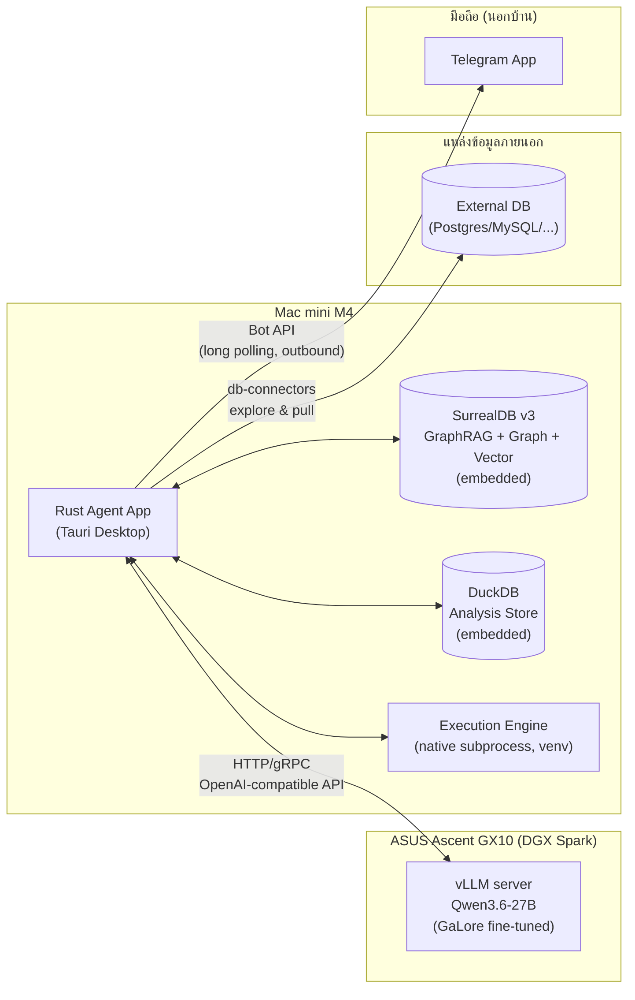
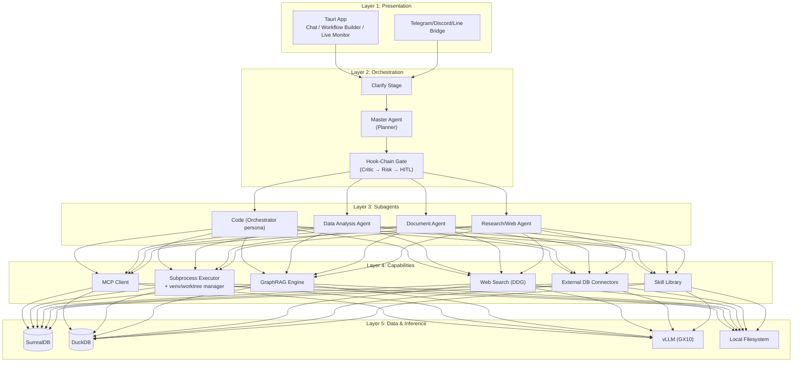
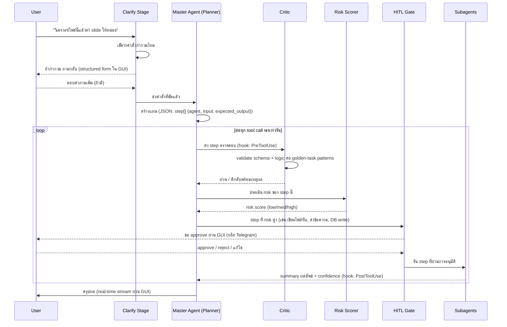
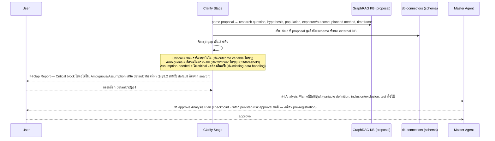
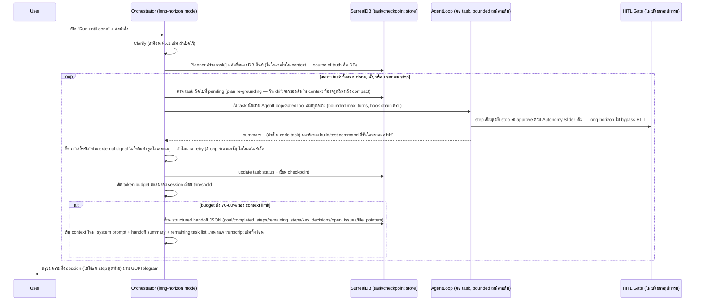
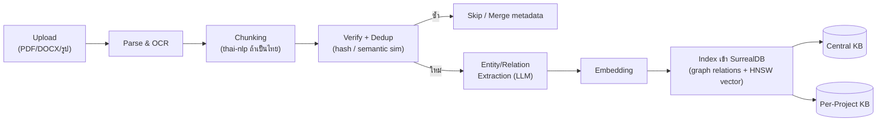
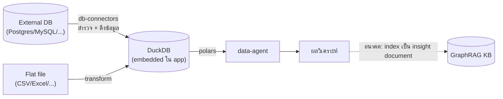
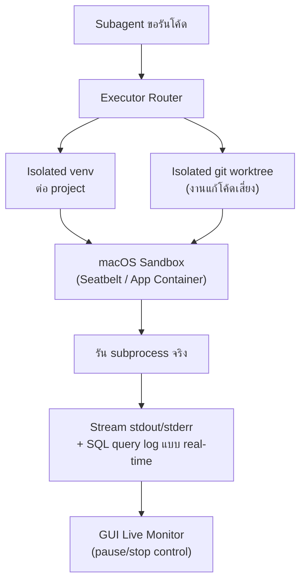
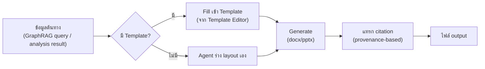
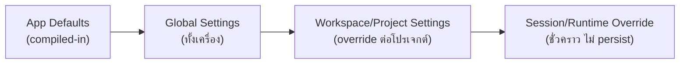

# สถาปัตยกรรมระบบ AI Agent (Rust) — Architecture & Spec

เอกสารนี้สรุป **spec, function, feature, non-functional requirement, และ system workflow** ที่ล็อกแล้วของระบบ — เป็น reference หลักสำหรับสร้างระบบ

> **แยกเป็น 3 ไฟล์เมื่อ 2026-08-09, เรียบเรียงใหม่รอบสองในวันเดียวกันให้ไม่ซ้ำซ้อน**: spec ในเอกสารนี้พูดแค่ "ระบบทำอะไร/ออกแบบยังไง" ล้วนๆ — รายละเอียด "สร้างยังไง เจอปัญหาอะไรระหว่างทำ" ทั้งหมดย้ายไปรวมที่ Log แล้วเพื่อไม่ให้ข้อมูลชุดเดียวกันซ้ำอยู่ 2 ที่:
> - **`ARCHITECTURE.md`** (ไฟล์นี้) — spec/function/feature/NFR/system workflow (§1–§15)
> - **[`IMPLEMENTATION_PLAN.md`](IMPLEMENTATION_PLAN.md)** — สถานะ feature ปัจจุบัน (DONE/PARTIAL/MISSING) + งานที่เหลือเท่านั้น (§17, §19) — สั้น กระชับ อัปเดตบ่อย
> - **[`LOG.md`](LOG.md)** — decisions log, known bugs, engineering notes, build history แบบละเอียด, และ external research notes (§16, §18, §20–§23) — append-only, ที่เก็บรายละเอียดทั้งหมด
>
> เนื้อหาทุกจุดจากฉบับรวมเดิมยังอยู่ครบใน 4 ไฟล์นี้ ไม่มีอะไรถูกลบทิ้ง — ย้ายที่เก็บให้ตรงหมวดและตัดข้อความที่พูดซ้ำออกเท่านั้น
>
> **Cleanup pass (2026-08-09 รอบสาม)**: ตรวจพบว่าเอกสารนี้เอง (แม้จะประกาศไว้ว่าเป็น spec ล้วนๆ) ยังมี status/decision-narrative ปนอยู่ราว 1 ใน 5 ของเนื้อหา และมี inconsistency ภายในตัวเอง 2-3 จุด (Svelte ที่เลิกใช้แล้วแต่ยังเหลือคำในบรรทัดเดียว, `code-agent` ที่ถูกพูดถึงปนกับ subagent จริง, ลิงก์ไป `§17.2` ที่ชี้ผิดไฟล์) — แก้ครบรอบนี้แล้ว พร้อมขยาย ToC ให้ครอบ subsection ทั้งหมด ไม่ใช่แค่หัวข้อใหญ่ 15 หัวข้อ ดูรายละเอียดการรีวิวที่ [`LOG.md`](LOG.md)/[`LOG_ARCHIVE.md`](LOG_ARCHIVE.md)

## สารบัญ

- **ภาพรวมระบบ**: [1. เป้าหมาย](#1-เป้าหมายระบบ) · [2. Hardware Topology](#2-hardware-topology) · [3. Layered Architecture](#3-layered-architecture) · [4. Cargo Workspace](#4-cargo-workspace-layout)
- **Orchestration, Session & Long-Horizon Execution**: [5. Master Agent Orchestration](#5-master-agent-orchestration) ([5.1](#51-plan-verification-pipeline) Plan Verification · [5.2](#52-hook-chain-gate-architecture) Hook-Chain Gate · [5.3](#53-subagent-context-isolation) Subagent Isolation · [5.4](#54-plan-only-mode) Plan-only Mode · [5.5](#55-progressive-disclosure-context-budget) Progressive Disclosure · [5.6](#56-golden-task-eval-harness) Golden-task Eval · [5.7](#57-autonomy-slider) Autonomy Slider · [5.8](#58-gap-detection-mode--data-agent-clarify-specialization) Gap Detection · [5.9](#59-statistical-verification-gate--data-agent-hook) Statistical Verification) · [6. Session & Conversation Persistence](#6-session--conversation-persistence) · [7. Long-Horizon Autonomous Execution](#7-long-horizon-autonomous-execution--run-until-done-mode)
- **LLM Interface**: [8. Tool-Call Protocol](#8-llm-tool-call-protocol-hermes-style)
- **Data & Knowledge**: [9. GraphRAG Pipeline](#9-graphrag-ingestion-pipeline) ([9.1](#91-policysop-scope--hard-constraints) Policy/SOP Scope · [9.2](#92-source-tiering--domain-scoped-search-research-agent) Source Tiering) · [10. Analysis Data Store](#10-analysis-data-store) · [11. Skill & Agent Setup](#11-skill--agent-setup-declarative-configuration) ([11.1](#111-skill-system-v1-scope) Skill System · [11.2](#112-agent-manifests--declarative-setup-model) Agent Manifests)
- **Execution & Compute**: [12. Execution Engine](#12-execution-engine-mac-mini) ([12.1](#121-การใช้ทรัพยากร-local-compute-cpugpunpu-บน-mac-mini) Local Compute · [12.2](#122-worktree-isolation-สำหรับงานแก้โค้ดที่เสี่ยง) Worktree Isolation · [12.3](#123-compiler-feedback-loop-code-agent) Compiler-Feedback Loop)
- **GUI & Interaction**: [13. GUI (Tauri)](#13-gui-tauri) ([13.1](#131-live-monitor--card-model--parallel-execution) Live Monitor)
- **Document Generation**: [14. Docgen Pipeline](#14-document-generation-pipeline) ([14.1](#141-citation--reference--provenance-based) Citation · [14.2](#142-cross-source-corroboration) Cross-source Corroboration)
- **Configuration**: [15. Settings & Config Module](#15-settings--configuration-module) ([15.1](#151-config-layers-เรียงจาก-override-ต่ำ--สูง) Config Layers · [15.2](#152-ที่เก็บข้อมูล--bootstrap-file--surrealdb) Storage · [15.3](#153-หมวดของ-setting-ที่-gui-ต้องเปิดให้ปรับ) Setting Categories · [15.4](#154-validation-hot-reload-migration) Validation/Migration)
- **ดูเพิ่ม**: [Implementation Plan →](IMPLEMENTATION_PLAN.md) · [Log (active) →](LOG.md) · [Log (archive) →](LOG_ARCHIVE.md)

---

## ภาพรวมระบบ

### 1. เป้าหมายระบบ

ระบบ AI Agent ส่วนตัวที่ทำงาน 3 กลุ่มหลัก:

1. **เขียนโค้ด** — coding agent พร้อม execution environment
2. **วิเคราะห์ข้อมูล** — big data analysis + qualitative data analysis
3. **งานเอกสาร** — manuscript, slide deck พร้อมอ้างอิง paper

ควบคุมผ่าน Desktop App (GUI หลัก) และเสริมด้วย Telegram/Discord/Line สำหรับสั่งงานด่วนหรือตอบคำถาม agent ระหว่างไม่อยู่หน้าเครื่อง

### 2. Hardware Topology



**หมายเหตุ**: GX10 ทำหน้าที่ inference server อย่างเดียว (ไม่รัน user code). Mac mini เป็นทั้ง GUI, orchestrator, execution และ data layer เพราะเป็นเครื่องที่เข้าถึงไฟล์ผู้ใช้โดยตรง.

**หลักการออกแบบ**: `llm-client` ตั้งใจให้ชี้ไปที่ endpoint ใดก็ได้ที่พูด OpenAI-compatible API ผ่าน config (`LLM_ENDPOINT`) แทนการ hardcode ต้องต่อ GX10 เท่านั้น — สลับไป vLLM จริงบน GX10 หรือ dev/test ด้วย local model เล็กๆ บน Mac mini เองได้โดยไม่ต้องแก้โค้ด (ดู [§12.1](#121-การใช้ทรัพยากร-local-compute-cpugpunpu-บน-mac-mini)) สถานะการ deploy จริงปัจจุบันของ GX10 (ว่าง/ไม่ว่าง) เป็นข้อมูล operational ไม่ใช่สถาปัตยกรรม — ดูสถานะล่าสุดที่ [`LOG.md` §16](LOG.md#16-decisions-log) แทนที่จะบันทึกไว้ในเอกสารนี้ (จะเก่าทันทีที่สถานการณ์เปลี่ยน)

Telegram bridge ใช้ **Bot API แบบ long polling** (bot เป็นฝ่าย poll ออกไปหา Telegram server เอง) — ไม่ต้องเปิด inbound port หรือใช้ Tailscale/VPN ใดๆ ที่บ้าน สั่งงานจากมือถือนอกบ้านได้ทันทีตราบใดที่ Mac mini ต่อเน็ตอยู่และ bridge process รันอยู่

### 3. Layered Architecture



**หมายเหตุ**: มีแค่ **3 subagent ที่เป็น crate แยกจริง** — `agents/data-agent`, `agents/doc-agent`, `agents/research-agent` (bare `AgentLoop`, ไม่ผ่าน Orchestrator's hook chain เพราะ tool set แคบ/ปลอดภัยพอ) "Code" และ "General" ใน diagram**ไม่ใช่ subagent crate แยก** แต่เป็น **persona ของ `Orchestrator` เอง** (ต่างกันแค่ system prompt, tool set เต็ม+hook chain ครบเหมือนกันทั้งคู่) — 5 ชื่อ dispatch (`general`/`code`/`data`/`research`/`doc`) จึงไม่ใช่ "5 subagent" แต่คือ "3 subagent crate + 2 persona ของ Orchestrator" รายละเอียด dispatch ที่ [§5.3](#53-subagent-context-isolation)/[§11.2](#112-agent-manifests--declarative-setup-model)

### 4. Cargo Workspace Layout

โครงสร้าง workspace แบบ multi-crate เพื่อแยก concern ให้ compile เร็วและ test ง่าย — ✅ = มีจริงแล้ว, ❌ = อยู่ใน plan แต่ยังไม่สร้าง, ⛔ = จงใจไม่สร้าง (เหตุผลในตัวเอง). สถานะละเอียดของแต่ละ feature/ทำไมถึงเลือกทางนี้อยู่ใน [Implementation Plan](IMPLEMENTATION_PLAN.md) และ [Log — Build History](LOG.md#23-build-history):

```
agent-workspace/
├── Cargo.toml                     # workspace root
├── crates/
│   ├── app-tauri/                 # ✅ Tauri shell: commands, window mgmt, file access
│   ├── orchestrator/              # ✅ Master Agent, Clarify, Critic, risk scoring, hook chain
│   ├── agent-core/                # ✅ Subagent trait, message passing, agent runtime
│   ├── agent-registry/            # ✅ Declarative agent manifest loader (§11.2)
│   ├── agents/
│   │   ├── code-agent/            # ⛔ จงใจไม่สร้าง — "เขียนโค้ด" (§1) วิ่งผ่าน `orchestrator::Orchestrator` agent choice `"code"` แทน (persona ต่างจาก `"general"` แค่ system prompt, hook-chain/worktree isolation ครบ — bare `AgentLoop` แบบ data/research/doc ไม่ปลอดภัยพอสำหรับ `run_shell`)
│   │   ├── data-agent/            # ✅
│   │   ├── doc-agent/             # ✅
│   │   └── research-agent/        # ✅ KbSearchTool + WebSearchTool — 4-tier source client (§9.2), ไม่ใช่แค่ DDG
│   ├── llm-client/                # ✅ OpenAI-compatible client, streaming, retries, Hermes-style tool-call parsing (§8)
│   ├── mcp-client/                # ✅ JSON-RPC client, wired เข้า chat tool-calling ผ่าน `app-tauri::mcp::connect_mcp_tools`
│   ├── executor/                  # ✅ native subprocess mgmt, venv isolation, worktree isolation, sandbox
│   ├── graphrag/                  # ✅ ingestion pipeline, entity/relation extraction, hybrid (vector + BM25) search
│   ├── kb-store/                  # ✅ SurrealDB v3 access layer (graph + vector + full-text), embedded kv-surrealkv
│   ├── analysis-store/            # ✅ embedded DuckDB wrapper — tabular/OLAP store for data-agent (§10)
│   ├── local-compute/             # ✅ `CandleEmbedder` (candle, Metal/CPU fallback) รัน `all-MiniLM-L6-v2` จริง — OCR ผ่าน `ort`/CoreML ยังไม่ implement
│   ├── config/                    # ✅ settings schema, layering, validation, secrets refs (§15)
│   ├── web-search/                 # ✅ 4-tier client (§9.2): WHO/CDC scoped, PubMed E-utilities, medRxiv preprint, `DdgSearchClient` ทั่วไป — ต่อเข้า `research-agent`
│   ├── db-connectors/             # ✅ Postgres/MySQL/SQLite/SQL Server (ATTACH) + MongoDB (native driver)
│   ├── skill-registry/            # ✅ skill loading, versioning, manifest, progressive disclosure, self-authoring ผ่าน `write_skill`
│   ├── docgen/                    # ✅ manuscript/slide generation, template engine, provenance citations
│   ├── thai-nlp/                  # ✅ wrap `nlpo3` newmm tokenizer — ใช้ทั้งใน chunking (§9) และ BM25 full-text index (kb-store)
│   ├── bridge-telegram/           # ✅ Telegram bot (long polling), bot/chat เดียว, multi-account — วิ่งผ่าน `Orchestrator`/hook chain เดียวกับ GUI chat (ดู [§6](#6-session--conversation-persistence)); ยังไม่มี remote-approval UI ผ่าน Telegram เอง (backlog, ดู [Implementation Plan](IMPLEMENTATION_PLAN.md))
│   ├── bridge-discord/            # ✅ Discord bot (Gateway WebSocket), เข้า `bridge_core::Bridge` trait เดียวกับ Telegram
│   ├── bridge-line/                # ✅ LINE bot (local webhook server + HMAC signature verification), เข้า `bridge_core::Bridge` trait เดียวกัน
│   └── common/                    # ✅ shared types, error handling
└── frontend/                      # ✅ React + React Flow (Tauri webview) — เลือกใช้ React ล้วน ไม่ใช้ Svelte
```
---

## Orchestration, Session & Long-Horizon Execution

### 5. Master Agent Orchestration

รวมกลไกทั้งหมดที่คุมว่า agent วางแผนถูก, รู้ตัวว่าเสี่ยงแค่ไหน, และหยุดรอ human ตอนที่ควร — ทำงานเป็น pipeline เดียวต่อเนื่องกัน:



#### 5.1 Plan Verification Pipeline

ลำดับ `Clarify → Planner → Critic → Risk → HITL → Subagents` เป็น pipeline หลักของทุก request — Clarify กันความกำกวมตั้งแต่ต้นน้ำ ถูกกว่าปล่อยให้ Critic จับ plan ที่ผิดโจทย์ทีหลัง (ยิ่งสำคัญเพราะ user ทำงานคนเดียว ไม่อยากเสียเวลา re-work)

#### 5.2 Hook-Chain Gate Architecture

Critic/Risk/HITL ไม่ใช่ pass เดียวตอนวางแผน แต่เป็น **hook chain ที่ทำงานรอบทุก tool call** ระหว่างรันจริง (แบบ Claude Code `PreToolUse`/`PostToolUse`) — จับปัญหาที่โผล่ระหว่างทางได้ ไม่ใช่แค่ตอนวางแผนตั้งต้น ออกแบบเป็น chain แบบ extensible ใน `orchestrator` เพื่อเพิ่ม gate ใหม่ในอนาคตได้โดยไม่แก้ core loop

#### 5.3 Subagent Context Isolation

Subagent ที่เป็น **crate แยกจริง 3 ตัว** (`data-agent`/`doc-agent`/`research-agent`) **return summary กลับเข้า context ของ Master Agent เท่านั้น ไม่ใช่ transcript เต็ม** — กัน context ของ orchestrator บวมและกันข้อมูลหลุดข้าม subagent โดยไม่ตั้งใจ ออกแบบ `agent-core` message-passing ให้บังคับ contract นี้ตั้งแต่ต้น **`code` ไม่ใช่ subagent แยกแบบนี้** — วิ่งเป็น persona ของ `Orchestrator` เองด้วย context เต็ม (เหตุผล: งานแก้โค้ดหลายไฟล์ที่ผูกกันแน่นต้องการ context ทั้งก้อน ไม่ใช่ summary ตัดตอน — ดู [§4](#4-cargo-workspace-layout))

#### 5.4 Plan-only Mode

session state `PlanOnly` ใน orchestrator ที่ตัด tool execution ออกทั้งหมด (agent คิดและเสนอแผนอย่างเดียว) — คนละอย่างกับ autonomy threshold ใน [§5.7](#57-autonomy-slider) ที่ควบคุมว่า step ไหนต้อง approve; `PlanOnly` คือ "ห้ามทำอะไรเลยทั้ง session" ใช้ตอนอยากให้ agent ช่วยคิดเฉยๆ

#### 5.5 Progressive Disclosure (Context Budget)

สำคัญกับระบบนี้มากกว่าปกติเพราะ context budget ของโมเดล self-hosted มักเล็กกว่า hosted frontier model — Planner ไม่ควรเห็นทุกอย่างเต็มๆ ตั้งแต่ต้น:

- `skill-registry`: prompt ของ planner เห็นแค่ manifest metadata ของ skill ทั้งหมด โหลด body เต็มเฉพาะ skill ที่ถูกเลือกใช้จริง
- `mcp-client`: เก็บ index เบาๆ ของ tool ทั้งหมดใน prompt, ดึง JSON schema เต็มเฉพาะตอน subagent เลือก tool นั้น

#### 5.6 Golden-task Eval Harness

ทำงานแยกจาก runtime loop — เป็นชุด regression test ที่สะสมจาก log งานจริงที่สำเร็จ รันตอน dev/CI เพื่อจับ plan ที่เบี่ยงจาก pattern เดิมโดยไม่ได้ตั้งใจ (ไม่ block การรันจริง)

#### 5.7 Autonomy Slider

threshold ของ Risk Scorer ผูกกับสวิตช์ Full Autonomous ↔ Approval-required ใน GUI — เลื่อนค่าได้ต่อ workspace/project ผ่าน `config` ([§15](#15-settings--configuration-module))

#### 5.8 Gap Detection Mode — Data-Agent Clarify Specialization

(เพิ่ม 2026-08-09)

เมื่อ task ของ `data-agent` ผูกกับเอกสาร proposal ที่ ingest เข้า KB แล้ว (tag `doc_type: proposal` ตอน upload) Clarify Stage ([§5.1](#51-plan-verification-pipeline)) เปลี่ยนจากถามกำกวมทั่วไป เป็นขั้นตอนเฉพาะที่ป้องกัน agent เดาแทนนักวิจัยในจุดที่กระทบผลวิเคราะห์:



**หลักการ**: Critical gap เป็น **hard block** ใน Clarify Stage เอง (agent สร้าง plan ต่อไม่ได้จนกว่าจะตอบ) — ต่างจาก Ambiguous/Assumption-needed ที่ปล่อยให้เลือก "ใช้ default ที่ระบบเสนอ" ได้ แต่ทุกครั้งที่เลือก default ต้องบันทึก **origin tag** กำกับไว้ในตัว Analysis Plan artifact เอง (ไม่ใช่แค่ log แยก):

| origin | ความหมาย | ใครกำหนด |
|---|---|---|
| `proposal_stated` | proposal ระบุไว้ตรงๆ | parse ตรงจากเอกสาร |
| `human_confirmed` | นักวิจัยตอบ/เลือกเองระหว่าง Clarify | user ตอบใน Gap Report |
| `agent_suggested` | agent เสนอ default จาก search/standard guideline | ต้องผ่าน `human_confirmed` ก่อนใช้จริงเสมอ ไม่มีข้อยกเว้น |

Analysis Plan approval ([§5.1](#51-plan-verification-pipeline)) คือจุดที่บังคับให้ `agent_suggested` ทุกรายการถูก promote เป็น `human_confirmed` ก่อนแตะข้อมูลจริง — Analysis Plan ที่ approve แล้วจึงไม่มี field ไหนเป็น `agent_suggested` ค้างอยู่เลย field นี้มีไว้เพื่อ audit ว่าอะไรเป็นข้อเสนอของ agent เดิม ไม่ใช่สถานะที่คงอยู่ถาวร

**ทำไมต้องแยกจาก per-step risk approval เดิม**: HITL Gate ปกติ ([§5.2](#52-hook-chain-gate-architecture)) approve เป็นราย tool-call ที่ risk สูง — Analysis Plan approval คนละมิติ คือ approve **methodology ทั้งก้อนก่อนเริ่มดึงข้อมูลจริง** กันไม่ให้ agent เปลี่ยนนิยาม variable หรือ test กลางทางหลังจากเห็นข้อมูลแล้ว (ป้องกัน p-hacking โดยไม่ตั้งใจ)

#### 5.9 Statistical Verification Gate — Data-Agent Hook

(เพิ่ม 2026-08-09)

ต่อยอด Hook-Chain Gate ([§5.2](#52-hook-chain-gate-architecture)) ด้วย `PostToolUse` hook เฉพาะทางสำหรับ `data-agent`: ทุกครั้งที่รัน statistical test (t-test, regression, survival analysis ฯลฯ) ผ่าน `analysis-store`/`polars`, hook นี้รัน assumption check ที่ตรงกับ test นั้นอัตโนมัติก่อนผลลัพธ์จะถูกส่งกลับเข้า context ของ Master Agent:

| ประเภท test | assumption ที่เช็ค |
|---|---|
| t-test/ANOVA | normality (Shapiro-Wilk), homogeneity of variance |
| linear/logistic regression | multicollinearity (VIF), linearity, residual distribution |
| survival analysis | proportional hazards assumption |
| chi-square | expected cell count ≥5 |

ถ้า assumption ไม่ผ่าน hook **ไม่ปล่อยให้ผลลัพธ์ผ่านไปเป็น "เสร็จ" เฉยๆ** — ส่งกลับเป็น structured warning ให้ Master Agent ตัดสินใจ: เสนอ test ทางเลือก (เช่น non-parametric แทน) แล้ววนกลับไปขอ approve ที่ Analysis Plan ([§5.8](#58-gap-detection-mode--data-agent-clarify-specialization)) เพราะเป็นการเปลี่ยน methodology ไม่ใช่แค่ retry — ใช้กลไก "วนกลับ clarification เมื่อเจอปัญหานอก plan" เดียวกับ Data Quality check ไม่ใช่กลไกใหม่

หลักการเดียวกับ external-truth-gated done ของ code-agent ([§7](#7-long-horizon-autonomous-execution--run-until-done-mode) จุด 5, [§12.3](#123-compiler-feedback-loop-code-agent)): **ไม่เชื่อว่าโมเดลพูดว่า "ผลนี้ใช้ได้" — ต้องเห็นการเช็คโครงสร้างจริงผ่านก่อน**

---

### 6. Session & Conversation Persistence

หลักการ: ยึด database-first policy เดิม ([§9](#9-graphrag-ingestion-pipeline)) — **SurrealDB เป็น source of truth ของบทสนทนา ไม่ใช่ frontend state**

**การออกแบบ (implemented)**:

- ตาราง `conversation` (id, scope, title, created_at, updated_at) และ `message` (conversation_id, role, content, agent_kind, created_at) ใน SurrealDB ต่อยอด `kb-store` connection ที่มีอยู่แล้ว (คนละ concern จาก KB chunk/entity แต่ใช้ engine เดียวกัน ไม่ต้อง embed DB ตัวที่สอง)
- `send_message` รับ `conversation_id: Option<String>` — `None` สร้างบทสนทนาใหม่, `Some(id)` โหลด history เต็มจาก DB ก่อนเรียก agent เสมอ (กัน payload บวมจากการพึ่ง frontend ส่ง full history ทุกครั้ง และกัน frontend/backend เพี้ยนกันได้)
- User message เขียนลง DB ก่อนเรียก agent เสมอ (เห็นว่า user พูดอะไรไปแม้ agent จะ error ทีหลัง), assistant reply เขียนกลับหลัง agent สำเร็จ — ทั้งสอง write รอ `.await` จริงก่อนถือว่า turn จบ (ไม่ fire-and-forget) กัน history หายถ้า app crash กลางคัน
- `AgentLoop::run_with_events`/`Orchestrator::handle_request_with_events` รับ param `history: Vec<ChatMessage>` ต่อเข้าไปก่อน `user_message` แทนที่จะ hardcode แค่ system+user 2 ข้อความแบบเดิม
- Frontend: `Chat.tsx` มี conversation list/sidebar (โหลดจาก `list_conversations`/`get_conversation_messages`) — `messages` state เปลี่ยนบทบาทเป็นแค่ local cache ที่ sync กับสิ่งที่ DB มีจริง ไม่ใช่ source of truth อีกต่อไป

**ขอบเขตที่ยังไม่ครอบ (ตั้งใจ ไม่ใช่ bug)**: history เต็มรูปแบบนี้ใช้ได้เฉพาะ path ของ GUI Chat (`send_message`/`run_long_horizon_session`) — **Telegram bridge ยังไม่ต่อ history** (ยังใช้ `AgentLoop::run()` เดิมแบบ single-turn) เพราะสโคปของงานนี้คือ GUI Chat ตาม [§1](#1-เป้าหมายระบบ)/[§13](#13-gui-tauri) โดยตรง — ดูหมายเหตุด้านความปลอดภัยที่เกี่ยวข้อง (Telegram bridge ไม่ผ่าน hook chain เลย) ใน [Log §21](LOG.md#21-ข้อค้นพบใหม่จาก-uxarchitecture-review-2026-08-09)
---

### 7. Long-Horizon Autonomous Execution — "Run Until Done" Mode

**Design**: เป็น **explicit toggle ต่อ conversation** (ปุ่ม/switch ใน Chat UI เช่น "Run until done") ที่ user เปิดเอง — ไม่ใช่ orchestrator auto-detect ความซับซ้อนของ request แล้วสลับโหมดเอง เหตุผล: พฤติกรรม auto-upgrade ทำนายยากกว่า และ user ควรรู้ชัดเจนตั้งแต่ต้นว่ากำลังปล่อยให้ agent ทำงานยาวต่อเนื่องแบบไม่ต้องคอยตอบทุก turn — คนละสวิตช์กับ Autonomy Slider ([§5.7](#57-autonomy-slider)) ที่คุมว่า step ไหนต้อง approve, และคนละอย่างกับ Plan-only Mode ([§5.4](#54-plan-only-mode)) ที่ห้ามทำอะไรเลย — ทั้ง 3 สวิตช์ independent กัน คุมคนละมิติ (ทำต่อเนื่องแค่ไหน / เสี่ยงแค่ไหนต้อง approve / ทำจริงหรือแค่คิด)



**กลไกหลัก (อิงจาก [§20](LOG.md#20-external-reference-notes-2026-08-08) + long-horizon pattern research)**:

1. **Plan-file re-grounding**: task list เก็บใน SurrealDB เป็น source of truth เสมอ ไม่ใช่แค่ "จำอยู่ใน context ของโมเดล" — orchestrator อ่านจาก DB ก่อนเริ่มแต่ละ task ทุกครั้ง กัน goal drift ที่งานวิจัยชี้ว่าเป็นสาเหตุ ~65% ของ agent failure ในงาน multi-step (context rot ไม่ใช่แค่ context เต็ม)
2. **Bounded per-task loop ไม่เปลี่ยน**: แต่ละ task ยังวิ่งผ่าน `AgentLoop` เดิมที่มี `max_turns` cap ([§8](#8-llm-tool-call-protocol-hermes-style)) — สิ่งที่ใหม่คือ **outer loop** ที่ไล่ทำหลาย task ต่อกัน ไม่ใช่การเอา cap เดิมออก
3. **Structured JSON handoff แทน raw summary**: table ใหม่ `session_checkpoint` เก็บ field ตายตัว `{goal, completed_steps[], remaining_steps[], key_decisions[], open_issues[], file_pointers[]}` — `file_pointers` เก็บ path ไม่ใช่ raw content (ตรงกับที่ Claude เองก็ทิ้ง raw tool-output เก่าก่อนเป็นอันดับแรกตอน compact) ทำให้ context ใหม่หลัง restart กระชับกว่าสรุปเป็น prose เฉยๆ และ diff/audit ได้ง่ายกว่า
4. **Budget-aware, ไม่ใช่รอ hard limit**: trigger compaction ที่ ~70-80% ของ context window ไม่ใช่รอจนเกือบเต็ม — ให้เวลาเขียน handoff ที่สะอาดแทนที่จะ emergency-truncate กลางคัน ต้องมี `llm-client` expose token usage/estimate ต่อ request จริง (เช็คว่ามีอยู่แล้วหรือไม่ตอน implement — ถ้าไม่มีต้องเพิ่มเป็นงานย่อย)
5. **External-truth-gated "done"**: task ของ code-agent (persona "code" ตาม [§17.2](LOG_ARCHIVE.md#232-โค้ดจริงเบี่ยงจากแผนเดิมของเอกสารนี้เอง-บันทึกดั้งเดิม-2026-08-08) D3) ไม่ถูก mark ว่า done เพียงเพราะโมเดลพูดว่าทำเสร็จ — ต้องเห็น tool call ที่รัน build/test/lint จริงและได้ exit code สำเร็จอยู่ในทรานสคริปต์ของ task นั้น (ต่อยอดจากที่ `CODE_SYSTEM_PROMPT` สั่งไว้อยู่แล้วด้วย prompt เฉยๆ — เปลี่ยนให้เป็น structural check ไม่ใช่หวังพึ่ง prompt compliance อย่างเดียว) — ป้องกันปัญหาแบบ AutoGPT/BabyAGI ปี 2023 ที่ agent เชื่อตัวเองว่าเสร็จทั้งที่ยังไม่ผ่านจริง (รายละเอียด compiler-feedback loop เฉพาะทางของ code-agent ที่ [§12.3](#123-compiler-feedback-loop-code-agent), เวอร์ชันฝั่ง data-agent ที่ [§5.9](#59-statistical-verification-gate--data-agent-hook))
6. **Bounded retry, ไม่ใช่ unlimited loop**: task ที่ external-truth check ไม่ผ่าน retry ได้จำกัดจำนวนครั้ง (ตั้งค่าใน `config`, default เสนอ 3) — เกินแล้ว escalate เป็น HITL "ติดขัด ต้องการคนช่วย" แทนที่จะวนไม่จำกัดจนหมด budget
7. **Subagent fan-out เฉพาะงานที่ decompose ได้จริง**: task ที่เป็นงาน research/data-gathering อิสระจากกัน (เช่น หาข้อมูลจากหลาย source ขนานกัน) fan-out ผ่าน subagent context ที่แยกกันได้ตาม [§5.3](#53-subagent-context-isolation) เดิม — แต่งานแก้โค้ดหลายไฟล์ที่ผูกกันแน่น (tightly-coupled) ยังคงอยู่ใน single Orchestrator session เดียวกับ context เต็ม ตาม decision D3 + คำเตือนของ Cognition ใน [§20.1](LOG.md#201-claude--claude-agent-sdk) — **ไม่ decompose งาน coding แบบเดียวกันเป็นหลาย subagent เด็ดขาด**
8. **Pause/stop ระดับ session**: คนละชั้นจาก process-group signal ที่มีอยู่แล้ว ([§12](#12-execution-engine-mac-mini)) — เป็น stop-flag ที่ orchestrator เช็คระหว่าง task ต่อ task (ไม่ใช่ signal กลาง task) กด "Stop" แล้ว task ที่กำลังรันอยู่จบตามปกติก่อน ค่อยไม่เริ่ม task ถัดไป (ไม่ kill กลางคันเพื่อกัน state ค้างครึ่งๆ กลางๆ)

**สิ่งที่ไม่เปลี่ยน**: hook chain (Critic→Risk→HITL), Autonomy Slider, Plan-only Mode, worktree isolation ทั้งหมดยังทำงานเหมือนเดิมทุกประการ — long-horizon mode เป็นแค่ **outer loop ที่ไล่ทำหลาย bounded task ต่อกันโดยอัตโนมัติแทนที่จะรอ user พิมพ์ข้อความถัดไปเอง** ไม่ใช่การเปิด autonomy เพิ่มหรือลด safety net ใดๆ

---

## LLM Interface

### 8. LLM Tool-Call Protocol (Hermes-style)

ชิ้นสำคัญที่สุดและง่ายต่อการมองข้าม เพราะโมเดลที่ fine-tune เองรันผ่าน vLLM ไม่มี tool-use ผูกมากับ API เหมือน hosted provider — `llm-client`/`agent-core` ต้อง implement เอง:

- ใช้ ChatML-style contract: `<tools>...</tools>` แจ้ง schema ใน system prompt, โมเดล output `<tool_call>{json}</tool_call>`, ผลลัพธ์ป้อนกลับเป็น `<tool_response>...</tool_response>` ใน message ถัดไป
- **ต้องมี strict parser + malformed-output recovery**: ถ้าโมเดล output JSON ผิด format ห้าม crash — ป้อน error กลับเข้าไปให้โมเดลแก้เอง (retry loop ที่มี cap จำนวนครั้ง)
- รองรับ `<think>...</think>` เป็น toggle แยกจาก tool-call: บังคับเปิดสำหรับ step ที่ Risk Scorer มองว่า high-risk ([§5.7](#57-autonomy-slider)), ปิดได้สำหรับ call เร็วๆ ที่ low-risk เพื่อประหยัด token/latency

---

## Data & Knowledge

### 9. GraphRAG Ingestion Pipeline



- **Verify + Dedup**: เช็ค hash ของไฟล์ต้นฉบับก่อน (กันอัปโหลดซ้ำ) + semantic similarity ระดับ chunk (กันเนื้อหาซ้ำจากไฟล์คนละไฟล์)
- **Central vs Per-project**: metadata field `scope: central | project:<id>` — query ข้ามscope ได้เมื่อ agent ต้องการ แต่ default query เฉพาะ scope ที่เกี่ยวข้อง
- **ภาษาไทย**: chunking/BM25 tokenization ผ่าน `thai-nlp` (wrap `nlpo3`) ก่อน index เพื่อให้ hybrid search (BM25+vector) แม่นยำขึ้นสำหรับเอกสารไทย — **สถานะ (2026-08-08)**: ทำครบทั้งสองฝั่งแล้ว ([§17.2](LOG_ARCHIVE.md#232-โค้ดจริงเบี่ยงจากแผนเดิมของเอกสารนี้เอง-บันทึกดั้งเดิม-2026-08-08) D4 = chunking, D7 = BM25 index + hybrid fusion จริงใน `IngestPipeline::query`)
- Flat file ที่ไม่ได้ผ่าน DB (เช่นไฟล์ทำงานชั่วคราวในโปรเจกต์) จะถูก transform เข้า DB ตามนโยบาย "database-first" ที่ตกลงไว้
- **Engine**: `kb-store` ใช้ crate `surrealdb` **v3.x** แบบ embedded ด้วย feature `kv-surrealkv` (storage engine ใหม่ของ SurrealDB เอง, native Rust, ลดการพึ่งพา RocksDB) — ไม่มี server process แยก รันอยู่ใน process เดียวกับ Tauri app ([SurrealDB repo](https://github.com/surrealdb/surrealdb), [surrealkv](https://github.com/surrealdb/surrealkv))
- **Engineering note**: SurrealDB v3.2.4 มี syntax/behavior หลายจุดที่ต่างจาก docs ทั่วไปของ SurrealDB (การ bind ต้องห่อ `SerdeWrapper`, `RELATE`/`ORDER BY search::score()` ต้อง bind ผ่าน `LET` ก่อนเสมอ, full-text index clause คือ `FULLTEXT ANALYZER ... BM25(...)` ไม่ใช่ `SEARCH ANALYZER`) — บันทึกรายละเอียด+ตัวอย่างโค้ดทั้งหมดไว้ที่ [Log §22 — Engineering Notes](LOG.md#22-engineering-notes--surrealdb-v3-quirks) เพื่อกันคนที่แก้โค้ดจุดนี้ทีหลังเจอปัญหาเดิมซ้ำ

#### 9.1 Policy/SOP Scope — Hard Constraints

(เพิ่ม 2026-08-09)

เอกสาร SOP/guideline ขององค์กร (IRB requirement, data governance policy) ใช้ pipeline ingestion เดียวกับ [§9](#9-graphrag-ingestion-pipeline) ทั้งหมด (parse/chunk/dedup/embed/index) แต่เพิ่ม `scope: policy` เป็นค่าที่ 3 ต่อจาก `central | project:<id>` เดิม พร้อม metadata เฉพาะทางต่อ chunk:

```
source: {
  doc_id, title, ...              # เดิมจาก §14.1
  hard_constraint: bool,          # true = ห้ามฝ่าฝืนเด็ดขาด, false = guideline ยืดหยุ่นได้
  version: string,
  effective_date: date,
  supersedes: Option<doc_id>,     # ผูก policy version เก่า→ใหม่
}
```

- **Chunking ต้อง atomic ต่อกฎ**: policy scope ใช้ semantic chunking ตามหัวข้อ/ข้อกฎหมาย (ไม่ตัดตามความยาวตัวอักษรเหมือน chunk ทั่วไป) — กันกฎข้อเดียวถูกตัดครึ่งระหว่าง chunk
- **Rule hierarchy เป็น gate แยกชั้นจาก Risk Scorer**: เมื่อ Critic ([§5.2](#52-hook-chain-gate-architecture)) ดึง policy chunk ที่เกี่ยวข้องมาเช็ค step ที่กำลังจะรัน ถ้าเจอ chunk ที่ `hard_constraint: true` ขัดกับ action นั้น เป็น **hard stop ทันที** ไม่ผ่าน Risk Scorer เป็นแค่ "high risk ต้อง approve" เหมือน step ทั่วไป — เพราะ hard constraint ไม่ควรมีทางให้ user กด approve ผ่านโดยไม่เห็นเหตุผลเต็มๆ ก่อน (ต้องแสดง chunk ที่ขัดกันตรงๆ ใน HITL prompt เสมอ ไม่ใช่แค่บอกว่า "เสี่ยง")
- **Freshness**: ingestion เช็ค `supersedes` และ `effective_date` เทียบ policy scope เดิมที่มี title เดียวกัน — เจอ version ใหม่กว่าที่ยังไม่ index ให้ flag เตือนตอน query ("policy chunk นี้อาจไม่ใช่ฉบับล่าสุด") แทนที่จะเงียบแล้วให้ agent อ้างอิงฉบับเก่าต่อไป

#### 9.2 Source Tiering & Domain-Scoped Search (Research-Agent)

(เพิ่ม 2026-08-09)

`web-search` crate ([§4](#4-cargo-workspace-layout)) ขยายจาก `DdgSearchClient` ตัวเดียว เพิ่ม client เฉพาะทางสำหรับ context งานวิจัยการแพทย์/สาธารณสุข:

| tier | แหล่ง | client |
|---|---|---|
| 1 — official guideline | WHO/CDC/กระทรวงสาธารณสุข | scoped query (site-restricted) ผ่าน client เดิม |
| 2 — peer-reviewed | PubMed | client ใหม่ผ่าน PubMed E-utilities API |
| 3 — preprint | medRxiv ฯลฯ | scoped query เช่นกัน |
| 4 — general web | อื่นๆ | `DdgSearchClient` เดิม |

`research-agent` เลือก client ตาม context ของ task (ผูกกับ agent manifest/`base` เดิม [§11.2](#112-agent-manifests--declarative-setup-model) — เพิ่ม field `search_tier_default` ต่อ manifest) — task ที่มาจาก `data-agent`/`doc-agent` ที่ผูกกับ proposal ทางการแพทย์ default ไป tier 1–2 ก่อนเสมอ, general web_search (tier 4) ยังเปิดใช้ได้แต่ไม่ใช่ default

ทุกผลลัพธ์ที่ถูกอ้างต่อ (ไม่ว่าจะเข้า Gap Report [§5.8](#58-gap-detection-mode--data-agent-clarify-specialization) หรือ manuscript [§14.1](#141-citation--reference--provenance-based)) พ่วง `{tier, access_date, url}` เข้ากับ provenance เดียวกัน — เป็นที่มาของ origin `agent_suggested` ที่ [§5.8](#58-gap-detection-mode--data-agent-clarify-specialization) กำหนดไว้ (ต้อง human_confirm ก่อนใช้จริงเสมอ) และเป็นตัวป้อน tier เข้า Cross-source Corroboration ([§14.2](#142-cross-source-corroboration)) — corroboration จาก 2 source tier 1–2 ถือว่า "แข็ง", จาก tier 4 สองแหล่งยังถือว่า "อ่อน" ต้องมี tier 1–3 ยืนยันอย่างน้อยหนึ่งแหล่งก่อนเขียนแบบมั่นใจสูง

### 10. Analysis Data Store

แยกจาก GraphRAG KB ตามที่ตกลงไว้ — GraphRAG เก็บ knowledge แบบ unstructured/graph (เอกสาร, ความสัมพันธ์) ส่วนนี้เก็บข้อมูลแบบ **tabular/structured สำหรับงาน big-data/qualitative analysis** ของ `data-agent` โดยเฉพาะ



- **Engine**: `analysis-store` wrap crate [`duckdb`](https://github.com/duckdb/duckdb-rs) แบบ **embedded** — ไม่มี server process แยก ไฟล์ `.duckdb` เปิดด้วยเครื่องมือภายนอก (DBeaver ฯลฯ) ได้ตรงๆ ถ้าอยากสำรวจข้อมูลเอง โดยไม่ต้องผ่าน app
- **ความสัมพันธ์กับ `db-connectors`**: แหล่งข้อมูลขนาดใหญ่จริงๆ มักอยู่ใน external database ของผู้ใช้เอง (Postgres/MySQL/ฯลฯ) — `db-connectors` มีหน้าที่ **สำรวจ (explore schema) และดึงข้อมูล (pull)** จาก external DB เข้ามาเป็นตาราง/ไฟล์ใน `analysis-store` (หรือ query แบบ federated ถ้าใช้ DuckDB extension เช่น `postgres_scanner` ที่ query ตรงไป external DB ได้โดยไม่ต้อง copy ข้อมูลทั้งหมด) จากนั้น `data-agent` ค่อยรัน analysis จริงบน DuckDB/`polars` ในเครื่อง
- ผลวิเคราะห์ที่สำคัญ (insight, สรุป) สามารถ index กลับเข้า GraphRAG KB เป็นเอกสารได้ในอนาคต เพื่อให้ค้นเจอผ่าน RAG ทีหลัง — ยังไม่ทำใน v1

### 11. Skill & Agent Setup (Declarative Configuration)

ทั้ง skill และ agent persona ในระบบนี้ใช้กลไกเดียวกัน: **manifest แบบ flat `key: value` frontmatter** ที่ `skill-registry::manifest::parse_frontmatter` implement ไว้ (เหมือน `SKILL.md` ของ Claude Code) — ต่างกันแค่ *skill* คือความรู้/ขั้นตอนที่ agent **เรียกใช้เป็นเครื่องมือ**, ส่วน *agent manifest* คือ**ตัวตน/persona/tool-allowlist ของ agent เอง** รวมไว้หมวดเดียวกันเพราะเป็น declarative capability registration แบบเดียวกันทั้งคู่ (ประกาศผ่านไฟล์ ไม่ hardcode ในโปรแกรม, โหลด/reload ได้โดยไม่ต้อง recompile)

#### 11.1 Skill System (v1 scope)

- **Manual library**: skill = โฟลเดอร์ manifest (เช่นเดียวกับ Claude Code skills) — ผู้ใช้ curate เอง, เข้า planner ผ่าน progressive disclosure ([§5.5](#55-progressive-disclosure-context-budget))
- Agent **เรียกใช้** skill ที่มีอยู่ได้เต็มที่ — **อัปเดต 2026-08-09**: เดิมล็อกไว้ว่า "ไม่เขียน/แก้ skill เองอัตโนมัติ" แต่ปลดล็อกแล้วตามคำขอ user (ดู [§16 Decisions Log](LOG.md#16-decisions-log)) — implement เป็น `skill_registry::WriteSkillTool` (`write_skill`, ดู [§19 Phase D](LOG_ARCHIVE.md#237-phase-d--backlog-เดิม-p2)) ให้ agent สร้าง/แก้ skill ได้จริงผ่าน tool call เดียวกับ tool อื่นๆ (ผ่าน risk/approval gate ตามปกติ ไม่ใช่ backdoor). ยังไม่ build: log การใช้ skill (success/fail, feedback) สำหรับ self-improvement loop อัตโนมัติ — "เขียนได้" กับ "เรียนรู้เองจาก feedback" เป็นคนละงานกัน

#### 11.2 Agent Manifests — Declarative "Setup" Model

**Design**: custom agent เลือก tool set ของตัวเองได้อิสระเต็มที่ (**Full tool allowlist**, ไม่ใช่แค่ persona-only) — เพื่อให้ตอบโจทย์ "custom build agent ผ่านการ setup" ได้จริงเหมือน Claude's `.claude/agents/*.md` frontmatter ที่มี field `tools:` เลือกได้อิสระ ไม่ใช่แค่เปลี่ยน system prompt

**Invariant ที่ต้องบังคับด้วย code ไม่ใช่ตกลงกันแค่ใน manifest**: agent (built-in หรือ user-defined) ตัวไหนก็ตามที่ tool list ของมันมี tool ที่ risk-sensitive (เช่น `run_shell`, MCP tool ที่ไม่รู้จัก) **ต้องถูกบังคับให้วิ่งผ่าน `GatedTool` hook chain เสมอ ไม่มีทาง manifest ปลดออกได้** — ต่างจาก `data`/`research`/`doc` ที่เป็น bare `AgentLoop` ได้เพราะ **tool ของมันแคบและปลอดภัยพอโดยธรรมชาติ** (ตรวจสอบจาก tool ที่มีจริง ไม่ใช่เพราะ config บอกให้ข้าม hook chain) — จุดนี้คือสิ่งที่ทำให้ "full tool allowlist" ปลอดภัยพอจะเลือกได้ตามที่ user ตัดสินใจไว้

**Manifest format** (reuse `skill-registry::manifest::parse_frontmatter` ตรงๆ — parser เดียวกับ `SKILL.md` ใน [§11.1](#111-skill-system-v1-scope) ไม่ต้องเขียนใหม่):

```
---
name: legal-review
description: Contract review persona — KB search + web search เท่านั้น ไม่มี shell
tools: kb_search, web_search
base: general
model_override: kb_extraction
---

You are a contract-review assistant specializing in Thai commercial contracts...
```

- `tools:` — comma-separated allowlist, validate ตอนโหลดว่าทุกชื่อ tool ตรงกับ tool ที่ระบบรู้จักจริง (`run_shell`, `kb_search`, `web_search`, MCP tool name ที่ connect อยู่, ฯลฯ) — ชื่อไม่ตรง = reject manifest พร้อม error message ชัดเจนตอนโหลด (ตรงกับ philosophy เดิมของ `config` crate ที่ reject ค่า invalid ทันทีไม่ปล่อยผ่าน, [§15.4](#154-validation-hot-reload-migration))
- `base:` (optional) — inherit tool set เริ่มต้นจาก agent kind ที่มีอยู่แล้ว (general/code/data/research/doc) แล้ว `tools:` มาเสริม/กรองทับ
- `model_override:` (optional) — ผูกกับ `agent_overrides` ที่มีอยู่แล้วใน `InferenceSettings` ([§17.1](LOG_ARCHIVE.md#231-feature-gaps--user-feedback-audit-บันทึกดั้งเดิม-2026-08-08) #8) ไม่ต้องออกแบบ mechanism ใหม่

**Loader**: crate ใหม่ `agent-registry` (แยกจาก `skill-registry` เพราะคนละ concern — skill คือความรู้ที่ agent เรียกใช้, ส่วนนี้คือตัวตน/tool ของ agent เอง แต่ reuse ฟังก์ชัน parser ตัวเดียวกันได้ตรงๆ) — struct `AgentManifest { name, description, tools: Vec<String>, base: Option<String>, model_override: Option<String>, extra: HashMap<String,String> }`, `load_from_dir(path)` โหลดทุกไฟล์จาก `~/Library/Application Support/agent-workspace/agents/*.md` (หรือ per-project `<project>/.agents/`) — ลงทะเบียนเข้า GUI's agent dropdown ตอน startup โดย**ไม่ต้อง recompile** — นี่คือชิ้นส่วนที่ตอบโจทย์การ custom-build agent ในระบบผ่านการ setup โดยตรง

**การเปลี่ยน dispatch ใน `app-tauri`**: ปัจจุบัน `send_message` (`lib.rs:200`) hardcode match แค่ 5 กรณี (`"data"|"research"|"doc"` เป็น bare `AgentLoop`, ที่เหลือ `"general"|"code"` ผ่าน `Orchestrator`) — เปลี่ยนเป็น registry-driven: ทุก agent (built-in 5 ตัวเดิม + manifest ใหม่) resolve เป็น `{system_prompt, tools, needs_gated_pipeline}` จาก registry เดียวกัน โดย `needs_gated_pipeline` **คำนวณอัตโนมัติจาก tool list ไม่ใช่ field ที่ manifest ประกาศเอง** (เช็คว่ามี tool ไหนถูก classify เป็น risk-sensitive ใน `risk.rs` หรือไม่ — ต้องเพิ่ม default risk classification ต่อ tool ที่ระบบรู้จักทุกตัวเป็นงานย่อยด้วย) — built-in 5 ตัวเดิมค่อยๆ ย้ายมาเป็น manifest ด้วยเพื่อความ consistent (ไม่ใช่ built-in ใช้ path นึง custom ใช้อีก path นึง)

---

## Execution & Compute

### 12. Execution Engine (Mac mini)



- แต่ละ project มี virtualenv แยก (Python) และ isolated toolchain equivalent สำหรับภาษาอื่น (เช่น cargo target dir แยก, node_modules แยก)
- `pause/stop` ทำผ่าน process group signal (SIGSTOP/SIGCONT/SIGTERM) ที่ Executor ควบคุม ไม่ใช่ agent สั่งเอง — กัน agent หลบ kill switch
- v1 **ไม่ dispatch งานไป GX10** — เน้น scale up บน Mac mini ให้เต็มที่ก่อน ถ้าเจอ bottleneck จริงในอนาคตค่อยพิจารณาแยกออกไปทีหลัง

#### 12.1 การใช้ทรัพยากร Local Compute (CPU/GPU/NPU) บน Mac mini

เพราะไม่ dispatch ไป GX10 ใน v1 ต้องรีดพลัง Apple Silicon (M4) ให้คุ้ม แบ่งงานตามหน่วยประมวลผลที่เหมาะสม แทนที่จะยิงทุกอย่างไป vLLM บน GX10:

| งาน | หน่วยที่ใช้ | แนวทาง Rust |
|---|---|---|
| Embedding สำหรับ GraphRAG indexing | GPU (Metal) | [`candle`](https://github.com/huggingface/candle) รัน embedding model เล็กๆ local ผ่าน Metal backend |
| OCR / vision preprocessing ของ PDF, รูป | NPU (ANE) ก่อน, fallback GPU | [`ort`](https://github.com/pykeio/ort) (ONNX Runtime bindings) ใช้ CoreML execution provider เพื่อ route เข้า ANE |
| Whisper/เสียง (ถ้ามีในอนาคต) | NPU/GPU | ort + CoreML EP เช่นกัน |
| Heavy dataframe/analysis compute | CPU (multi-core) | `polars` (Rust) แทน pandas สำหรับงาน data analysis หนักๆ, ทำงานคู่กับ [§10](#10-analysis-data-store) |

**คนละ pipeline กับรูปที่ upload เข้า Chat ([§13](#13-gui-tauri))**: แถว OCR/vision ข้างบนนี้คือ preprocessing ตอน **ingest เอกสาร** เข้า GraphRAG ([§9](#9-graphrag-ingestion-pipeline)) — สกัดข้อความจาก PDF/รูปที่เป็นภาพสแกนก่อน chunk/embed (**ยังไม่ implement**, ดู [Implementation Plan](IMPLEMENTATION_PLAN.md)) ส่วนรูปที่ user upload/paste **เข้า Chat โดยตรง** ไม่ผ่าน pipeline นี้ — ส่งเป็น image input ตรงไปที่ vLLM endpoint เลย (ต้องใช้โมเดลที่เป็น image-text-to-text) คนละเส้นทาง คนละจุดประสงค์กัน ไม่ใช่กลไกซ้ำกัน
| Reasoning/generation หลัก | ยังคงยิงไป vLLM บน GX10 เสมอ | ไม่ทำ local — โมเดล fine-tuned 27B ไม่เหมาะรันบน M4 |

หลักการ: งานที่เป็น "preprocessing/support" (embedding, OCR, dataframe ops) ทำ local บน Mac mini เพื่อลด round-trip และลดโหลด GX10; งานที่เป็น "การให้เหตุผลหลักของ agent" ยังคงยิงไป vLLM เสมอ — ไม่พยายามรันโมเดลหลักบน M4

#### 12.2 Worktree Isolation สำหรับงานแก้โค้ดที่เสี่ยง

ต่อยอดจาก venv isolation ข้างบน (แยก dependency ไม่ใช่แยก source tree): งานแก้โค้ดหลายไฟล์ที่มีความเสี่ยง ให้ `executor` ทำงานบน **git worktree แยก** (copy อิสระของ repo) แล้ว merge กลับ main working copy เฉพาะหลังผ่าน HITL approval ([§5.2](#52-hook-chain-gate-architecture))

#### 12.3 Compiler-Feedback Loop (Code-Agent)

(เพิ่ม 2026-08-09)

ขยายรายละเอียดของ external-truth-gated done ([§7](#7-long-horizon-autonomous-execution--run-until-done-mode) จุด 5) เฉพาะฝั่ง code-agent: แทนที่จะพึ่งความรู้ static ของโมเดลเรื่อง syntax/API ล่าสุด (Rust ecosystem เปลี่ยนเร็ว — crate ออกเวอร์ชันใหม่, breaking change บ่อย) ให้ **compiler เป็นแหล่งความจริงหลัก** แทน RAG:

- เมื่อ `run_shell`/`install_package`-class tool รัน `cargo build`/`cargo check`/`clippy` แล้ว exit code ไม่ใช่ 0 — stdout/stderr ดิบ (ไม่ผ่านการสรุป) ถูกป้อนกลับเข้า turn ถัดไปของ code-agent ตรงๆ ผ่าน `<tool_response>` เดิม ([§8](#8-llm-tool-call-protocol-hermes-style)) — Rust compiler error message ละเอียดพอที่จะเป็น ground truth ได้ดีกว่าสรุปทิ้งรายละเอียด
- Tool ใหม่ `fetch_crate_docs(crate, version?)` — ดึง doc จาก docs.rs ตรงเวอร์ชัน ถ้าไม่ระบุ version อ่านจาก `Cargo.lock` ของ project ที่ `executor` กำลังทำงานอยู่ก่อนเป็น default (กัน agent แนะนำ API ของเวอร์ชันที่ project ไม่ได้ใช้จริง)
- **Reactive ไม่ใช่ preload**: `fetch_crate_docs` ถูกเรียกเฉพาะตอน agent ไม่แน่ใจ signature หรือหลัง compiler error พูดถึง method/type ที่ไม่รู้จัก — ไม่ยัดเข้า system prompt ล่วงหน้าทุก turn ตรงกับหลัก Progressive Disclosure เดิม ([§5.5](#55-progressive-disclosure-context-budget))
- Retry ใช้ cap เดิมจาก [§7](#7-long-horizon-autonomous-execution--run-until-done-mode) จุด 6 (bounded retry, escalate เป็น HITL เมื่อเกิน) — ไม่เพิ่ม retry budget แยกต่างหาก

---

## GUI & Interaction

### 13. GUI (Tauri)

| ส่วน | รายละเอียด |
|---|---|
| Chat interface | หลัก เหมือน ChatGPT app, multi-turn, multi-project, รองรับ upload/paste รูปเข้าคุยตรงๆ (โมเดลเป็น image-text-to-text) |
| Visual Workflow Builder | node-based editor (React Flow) แก้ pipeline ของ subagent ได้เอง, save เป็น template |
| Live Agent Monitor | card ต่อ step (ดู [§13.1](#131-live-monitor--card-model--parallel-execution)) พร้อม SQL query log แบบ real-time, ปุ่ม pause/stop ต่อ step |
| Approval Panel | แสดง step ที่ต้องการ human approval (มาจาก HITL Gate) พร้อม diff/preview ก่อนกดอนุมัติ |
| Workspace/Project Manager | สลับ project, ตั้งค่า autonomy threshold, ตั้งค่า KB scope ต่อ project |
| Template Editor | แก้ template เอกสาร (manuscript/slide) + workflow "upload ตัวอย่าง → auto-parse เป็น template" |
| Settings | รายละเอียดทั้งหมดใน [§15](#15-settings--configuration-module) |

Frontend เป็น React ล้วน (ดู [§4](#4-cargo-workspace-layout) — เลือก React ไม่ใช้ Svelte) ใน Tauri webview, สื่อสารกับ Rust core ผ่าน Tauri commands + events (สำหรับ streaming)

#### 13.1 Live Monitor — Card Model & Parallel Execution

แทนที่จะ stream ทุกอย่างดิบๆ ลง chat เหมือน chatbot ทั่วไป ใช้ **card ต่อ step** (Thinking/In Progress/Completed) ที่ยุบไว้ก่อนโดย default, กดขยายดู raw output ได้เมื่อต้องการ — และออกแบบ `orchestrator` ให้รัน subagent **ขนานกันได้หลายตัว** (ไม่ต้อง serial ทีละ step เสมอไป) พร้อม pause/stop เป็นรายตัว

---

## Document Generation

### 14. Document Generation Pipeline



Template รองรับทั้ง **Upload & Auto-Parse** (อัปโหลดตัวอย่างเอกสาร → agent สกัด structure/format เป็น template) และ **Template Editor** (แก้ manual ทีหลัง) ตามที่ตกลง

#### 14.1 Citation / Reference — Provenance-based

หลักการ: **ทุก chunk ที่เข้า GraphRAG ต้องมี provenance metadata ติดตัวมาตั้งแต่ ingestion** (ชื่อไฟล์ต้นฉบับ, ผู้เขียน/ปี ถ้าสกัดได้, เลขหน้า/section) ดังนั้นเวลา docgen ดึงเนื้อหาจาก KB มาเขียน ก็ดึง provenance ติดมาด้วยเสมอ — ไม่ต้องพึ่งซอฟต์แวร์จัดการอ้างอิงภายนอก (Zotero ฯลฯ) ในเวอร์ชัน v1:

1. **Ingestion**: `graphrag` เก็บ field `source: {doc_id, title, authors?, year?, page?, section?}` ต่อ chunk ใน SurrealDB
2. **Retrieval**: เมื่อ `doc-agent` query KB มาใช้เขียนเนื้อหา ทุกผลลัพธ์พ่วง provenance กลับมาด้วย
3. **Generation**: ทุกประโยค/ย่อหน้าที่เนื้อหามาจาก KB (ไม่ใช่ agent คิดเอง) ต้องแทรก inline citation marker ที่ผูกกับ `source` นั้น
4. **Bibliography**: `docgen` รวบรวม `source` ทั้งหมดที่ถูกอ้างในเอกสาร generate เป็นบรรณานุกรมท้ายเล่ม ตาม citation style ที่ตั้งไว้ (APA/IEEE/Vancouver ฯลฯ — เลือกได้ต่อ template)
5. ถ้าไฟล์ต้นฉบับไม่มี metadata ผู้เขียน/ปีชัดเจน (เช่น scan ภาพ) ระบบ flag ให้ผู้ใช้เติมเองใน Template/Source Editor ก่อน generate
6. **Origin tag ในส่วน Limitations** (เพิ่ม 2026-08-09): สำหรับ manuscript ที่มาจาก Analysis Plan ตาม [§5.8](#58-gap-detection-mode--data-agent-clarify-specialization) — ทุก decision ที่มี origin `agent_suggested` (ตอน approve แล้วกลายเป็น `human_confirmed` แต่ยังพ่วง flag เดิมไว้) ถูกดึงมาขึ้นบัญชีอัตโนมัติในส่วน Limitations/Methods ของ draft ("นิยาม X อ้างอิงตาม [source, tier] เนื่องจาก proposal ไม่ได้ระบุไว้") — กันไม่ให้ assumption ที่ agent เสนอเนียนหายเป็นเนื้อเดียวกับสิ่งที่ proposal ระบุจริง

ทำแบบนี้เพราะบังคับ "ทุกความที่หยิบมาเขียนต้องมี ref" ได้ตรงจุดกว่าไปพึ่งเครื่องมือภายนอกที่ user ต้องจัดการ library เอง — ถ้าในอนาคตต้องการ export เป็น `.bib` เพื่อไปต่อกับ Zotero ก็ทำเป็น exporter เสริมได้ทีหลัง ไม่กระทบ core design

#### 14.2 Cross-source Corroboration

เวลา `research-agent`/`graphrag` ดึงข้อมูลจากเว็บหรือ KB มาสรุป ให้ flag ข้อความที่มาจาก source เดียว และพยายามหา ≥2 source ที่สอดคล้องกันก่อนจะเขียนแบบมั่นใจสูง (high-confidence) — ลดโอกาส hallucination หลุดเข้าไปในเอกสารที่มี citation กำกับ

**Tier-aware (เพิ่ม 2026-08-09)**: จำนวน source อย่างเดียวไม่พอ — ผูกกับ source tier จาก [§9.2](#92-source-tiering--domain-scoped-search-research-agent) ด้วย: corroboration จาก ≥2 source tier 1–2 (official guideline/peer-reviewed) ถือว่าแข็งพอเขียนแบบมั่นใจสูง, แต่ ≥2 source tier 4 (general web) ยังไม่พอ ต้องมี tier 1–3 ยืนยันอย่างน้อยหนึ่งแหล่งก่อน

---

## Configuration

### 15. Settings & Configuration Module

ตอบ requirement เดิม "ตั้งค่าอื่นๆ ได้หมด" — ต้องมี module กลางที่จัดการ config ทั้งระบบ ไม่ใช่กระจัดกระจายอยู่ใน crate ต่างๆ crate `config` เป็นเจ้าของ schema + validation + layering ทั้งหมด, crate อื่นแค่ read ผ่าน `config` เท่านั้น ห้าม parse ไฟล์ config เอง

#### 15.1 Config Layers (เรียงจาก override ต่ำ → สูง)



ค่าที่ effective = merge จากบนลงล่าง, layer ที่สูงกว่า override layer ที่ต่ำกว่าเฉพาะ key ที่ตั้งไว้จริง (ไม่ใช่ทับทั้งก้อน)

#### 15.2 ที่เก็บข้อมูล — Bootstrap file + SurrealDB

เข้ากับนโยบาย database-first ที่ตกลงไว้ ([§9](#9-graphrag-ingestion-pipeline)) แต่มีข้อยกเว้นจำเป็นอย่างเดียว:

| ส่วน | เก็บที่ | เหตุผล |
|---|---|---|
| Bootstrap config (data dir, SurrealDB connection, log level) | flat file `~/Library/Application Support/<app>/bootstrap.toml` | ต้องอ่านได้ก่อน DB จะพร้อมใช้งานด้วยซ้ำ — เป็น chicken-and-egg ที่หลีกเลี่ยงไม่ได้ |
| Global + Workspace + ทุก setting อื่นทั้งหมด | ตาราง `settings` ใน SurrealDB | แก้ผ่าน GUI แล้ว query/sync ได้ทันที, versioned, audit ง่าย |
| Secrets (Telegram bot token, MCP API key, external DB password) | **OS Keychain** ผ่าน crate [`keyring`](https://crates.io/crates/keyring) — ไม่เก็บ plaintext ทั้งใน flat file และใน SurrealDB | `settings` table เก็บแค่ **ชื่อ key** ที่ชี้ไปยัง keychain entry ไม่เก็บค่าจริง |

#### 15.3 หมวดของ Setting ที่ GUI ต้องเปิดให้ปรับ

| กลุ่ม | ตัวอย่างค่า | ref |
|---|---|---|
| Inference | vLLM endpoint URL, temperature/top_p/max_tokens, `<think>` toggle default | [§8](#8-llm-tool-call-protocol-hermes-style) |
| Orchestration | autonomy threshold (global + ต่อ project), Plan-only toggle, Clarify stage on/off | [§5.4](#54-plan-only-mode), [§5.7](#57-autonomy-slider) |
| Execution | sandbox policy, worktree isolation threshold, resource quota (CPU/GPU/NPU) | [§12](#12-execution-engine-mac-mini), [§12.1](#121-การใช้ทรัพยากร-local-compute-cpugpunpu-บน-mac-mini) |
| Knowledge Base | KB scope default (central/project), dedup sensitivity, auto-index on/off | [§9](#9-graphrag-ingestion-pipeline) |
| Analysis Store | external DB connection ที่จะ sync เข้า DuckDB, refresh schedule | [§10](#10-analysis-data-store) |
| MCP servers | รายการ server + secret reference | [§5.5](#55-progressive-disclosure-context-budget) |
| External DB connectors | connection string (secret reference) | [§10](#10-analysis-data-store) |
| Skill library | path, enable/disable ต่อ skill | [§11.1](#111-skill-system-v1-scope) |
| Document | citation style (APA/IEEE/...), default template | [§14.1](#141-citation--reference--provenance-based) |
| Bridges | Telegram bot token (secret reference), enabled channels | [§2](#2-hardware-topology) |
| Appearance | theme, ภาษา UI (ไทย/อังกฤษ) | — |

#### 15.4 Validation, Hot-reload, Migration

- ทุก setting validate ผ่าน `serde` + custom validator ใน `config` ก่อนเขียนลง SurrealDB เสมอ — ค่าที่ invalid โดน reject ที่ GUI พร้อม error message ทันที ไม่มีทาง save ค่าพังเข้าระบบ
- แต่ละ key มี flag `requires_restart: bool` ใน schema — ส่วนใหญ่ (inference params, orchestration threshold, KB scope) apply ทันทีโดยไม่ restart app; ส่วนที่กระทบ process ที่รันอยู่แล้ว (เช่น sandbox policy ของ subprocess ที่กำลังรัน) ต้อง restart component นั้น
- `config` crate เก็บ `schema_version` — เมื่อ app อัปเดตแล้ว schema เปลี่ยน ต้องมี migration function แปลงค่าเก่า → ใหม่ อัตโนมัติตอน boot ไม่ทำให้ setting เดิมของผู้ใช้หาย
- รองรับ export/import settings profile เป็นไฟล์ JSON ไว้ backup หรือย้ายไปเครื่องอื่นในอนาคต (ไม่ export secrets — ต้องผูก keychain ใหม่ที่เครื่องปลายทางเอง)
