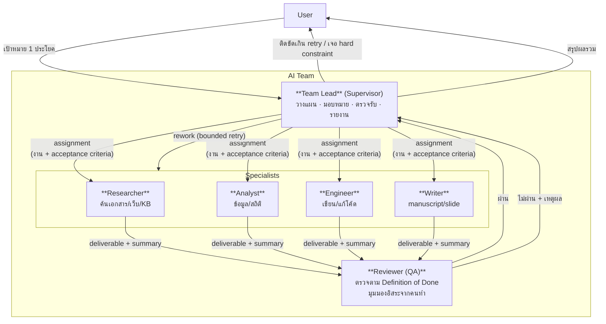
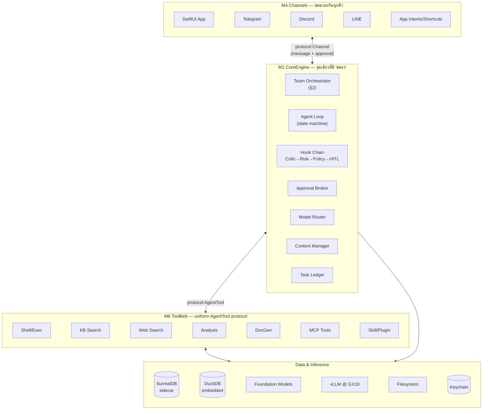

# รากฐาน — เป้าหมาย · แหล่งข้อมูล · ทีม · โครงระบบ

> ส่วนหนึ่งของ [สถาปัตยกรรม Co-AI Workspace](../../ARCHITECTURE.md) — §0–§4
>
> เอกสารนี้ตอบว่า **ระบบคืออะไรและทำไม** ไม่ตอบว่าสร้างถึงไหนแล้ว (นั่นคือ [`docs/plan/`](../plan/README.md)) · กฎที่บังคับด้วยเครื่องอยู่ที่ [`RULES.md`](../../RULES.md)

---

## 0. เป้าหมายและคำนิยาม

### 0.1 เป้าหมายระบบ

ระบบ AI Agent ส่วนตัว (single-user) บน Mac ที่ทำงาน 3 กลุ่มหลัก:

1. **เขียนโค้ด** — coding agent พร้อม execution environment จริง
2. **วิเคราะห์ข้อมูล** — big data + qualitative analysis (แต่ละงานวิจัยเขียน analysis ของตัวเอง ไม่ใช่ query สำเร็จรูป)
3. **งานเอกสาร** — manuscript/slide พร้อม citation จาก paper จริง

**สิ่งที่เปลี่ยนจาก v1 เชิงแนวคิด**: v1 คือ "ชุด agent ให้ user เลือกทีละตัวจาก dropdown" — v2 คือ **AI Team ที่ user สั่งหัวหน้าทีมคนเดียว** แล้วทีมแบ่งงาน/ตรวจงานกันเองเป็น loop ([§2](#2-ai-team-model--แกนหลักของ-v2))

### 0.2 คำนิยาม: Module / Sub-module / Feature / Function

เพื่อไม่ให้เกิดปัญหาเดิม (module แตกซ้อนกัน ไม่รู้ว่าอะไรควรเป็นอะไร) เอกสารนี้ใช้นิยาม 4 ระดับที่ตายตัว:

| ระดับ | นิยาม | เกณฑ์ตัดสิน (ต้องผ่านทุกข้อ) | ตัวอย่าง |
|---|---|---|---|
| **Module** | หน่วยที่เป็นเจ้าของ domain หนึ่งอย่างสมบูรณ์ = 1 Swift target | (1) มี lifecycle/state ของตัวเอง (2) มี public interface ที่ module อื่นใช้โดยไม่ต้องรู้ข้างใน (3) ทดสอบแยกได้ (4) **ถ้าลบทิ้ง จะมีความสามารถหนึ่งหายไปทั้งก้อน** | `CoreEngine`, `Knowledge`, `Execution` |
| **Sub-module** | ส่วนประกอบภายใน Module — ไม่มีความหมายถ้าอยู่นอก module แม่ | (1) ใช้ state ร่วมกับ module แม่ (2) ไม่มี consumer นอก module แม่ (3) แยกไว้เพราะ *ความซับซ้อน* ไม่ใช่เพราะ *ขอบเขต* | `HookChain` (ใน CoreEngine), `Chunker` (ใน Knowledge) |
| **Feature** | ความสามารถที่ **user มองเห็น/ใช้ได้** — พูดถึงได้โดยไม่ต้องอ้างชื่อคลาส | (1) อธิบายเป็นประโยค "user ทำ X ได้" (2) มีจุดเข้าใช้งานใน UI หรือ channel | "อนุมัติ tool call เสี่ยงจาก Telegram", "รัน SQL cell ใน Notebook" |
| **Function** | หน่วยเรียกใช้จริง — method, tool, หรือ command | (1) มี signature ชัด (2) test ได้ตรงๆ | `run_shell`, `ApprovalBroker.resolve(id:decision:)` |

**กฎที่บังคับตัวเอง** (แก้ปัญหา v1 ที่แตก module ย่อยเกินจำเป็น):

- ห้ามสร้าง Module ใหม่ถ้ามี consumer เดียว — เป็น Sub-module ของ consumer นั้นแทน (v1 แตก `bridge-core`/`bridge-telegram`/`bridge-discord`/`bridge-line` เป็น 4 crate ทั้งที่ 3 ตัวหลังคือ implementation ของ protocol เดียวกัน → v2 รวมเป็น Module `Channels` เดียว มี 4 sub-module)
- ห้ามให้ 2 Module เก็บ state ที่ต้อง sync กันเอง — ยกขึ้นเป็น Module เดียวที่เป็นเจ้าของ (v1 มี `LiveMonitor` กับ `ProcessManager` เก็บ process list คนละที่ → v2 มี span store เดียว)
- ห้ามประกาศ type รูปร่างเดียวกันซ้ำข้าม module (v1 มี `Scope`-shaped enum 3 ตัว: `kb_store::Scope`, `config::DbConnectorScope`, `agent_registry::AgentScope`) → v2 ประกาศครั้งเดียวใน `AgentKit`

### 0.3 Design Principles (ที่มีผลต่อทุก section)

1. **AI Team เป็น first-class ไม่ใช่ agent เดี่ยวหลายตัว** — [§2](#2-ai-team-model--แกนหลักของ-v2)
2. **Agentic-by-default, manual override เสมอ** — ทุก artifact ที่ agent สร้าง แก้เองได้ตรงๆ
3. **On-device model เป็น tier ใช้งานจริง** — Foundation Models (~3B) รับงานเล็ก/บ่อย ไม่ต้อง round-trip ไป GX10 ทุกครั้ง
4. **Consolidate ไม่ใช่แตก module** — ตามกฎ [§0.2](#02-คำนิยาม-module--sub-module--feature--function)
5. **Type system บังคับ invariant แทน convention** — Swift actor/enum/protocol ทำสิ่งที่ v1 ต้องอาศัยวินัยของคนเขียน
6. **OS-native ก่อนเขียนเอง** — Vision (OCR), NaturalLanguage (ตัดคำไทย), App Sandbox, Keychain, Foundation Models
7. **ไม่พึ่ง dependency ที่ยังไม่โตพอ** — ตรวจ maturity จริง (release/commit/ดาว/คำเตือนของ maintainer เอง) ก่อนเอามาเป็นรากฐาน; ถ้าโปรโตคอลง่ายพอ เขียน client เองดีกว่าผูกกับ SDK alpha ([ภาคผนวก E](../VERIFICATION_LOG.md))
8. **แยก "ของ Apple ที่มีวันนี้" ออกจาก "ของ Apple ที่กำลังจะมี"** — ทุก API ที่ยังไม่อยู่ใน SDK ที่ติดตั้งจริง ต้องมี abstraction คั่นเสมอ ไม่ผูกโค้ดตรง

---

## 1. Web Search และการจัดชั้นแหล่งข้อมูล

**ข้อจำกัดที่มาก่อนการออกแบบ M6/M7** — ระบบที่ทำงานวิจัยได้ต้องตอบให้ได้ว่า *ข้อมูลนี้มาจากไหน และเชื่อได้แค่ไหน* ก่อนจะออกแบบว่าจะเก็บมันยังไง

### 1.1 ที่มาของการออกแบบ — ย้ายไป [`docs/ECOSYSTEM_REVIEW.md`](../ECOSYSTEM_REVIEW.md)

การสำรวจว่า **คนอื่นทำอะไรไว้แล้ว** (Swift AI agent 6 โปรเจกต์ · pattern จาก AI harness ยอดนิยม · เครื่องมือของ Apple 10 รายการ) ย้ายออกไปเป็นเอกสารอ้างอิงแยก เพราะมันคือ *ที่มา* ของการตัดสินใจ ไม่ใช่ตัวข้อผูกพัน — ข้อสรุปที่กลายเป็นสถาปัตยกรรมจริงกระจายอยู่ใน §2–§21 แล้ว

**สามข้อสรุปที่มีผลมากที่สุด**:

1. Swift ecosystem ปี 2026 มีชิ้นส่วนครบพอ — จุดที่ v1 ต้องเขียนเองเยอะที่สุด (tool-call protocol, MCP client, embedding runtime) ตอนนี้มีของสำเร็จรูปทั้งหมด
2. **harness คือ runtime รอบโมเดล ไม่ใช่ prompt** — สิ่งที่ทำให้ LLM เป็น agent คือ layer ที่จัดการ tool/memory/permission → [§5](02-core-modules.md#5-m1-coreengine) ทั้ง module
3. **supervisor pattern ต้อง hard-cap รายชื่อ worker** และ**งานที่ coupled กันแน่นห้ามแตกทีม** (คำเตือนของ Cognition) → [§2.2](#22-กติกาของหัวหน้าทีม-supervisor-contract) · [§2.4](#24-ข้อยกเว้น-งานที่ห้ามแตกทีม)

### 1.2 Web Search — มีของฟรีถาวรไหม? Apple ให้ด้วยไหม?

**คำตอบตรงๆ 2 ข้อ**:

1. **Apple ไม่มี web search API ให้นักพัฒนา** — "World Knowledge Answers" ที่เป็นข่าวคือ **ฟีเจอร์ของ Siri** (ตอบคำถามจากเว็บ + personal context) ไม่ได้เปิดเป็น public API ให้แอปอื่นเรียก ที่ Apple มีจริงคือ iTunes/App Store Search API ซึ่งค้นได้แค่ content ใน store ของตัวเอง — **ใช้กับงานวิจัยไม่ได้เลย**
2. **ของฟรีถาวรมี แต่ต้องเลือกให้ถูกชั้น** — ผู้ให้บริการเชิงพาณิชย์ปิด free tier กันหมดแล้ว (Brave ยกเลิก free tier สำหรับผู้ใช้ใหม่ตั้งแต่ต้นปี 2026 เหลือ $5 credit/เดือน ≈ 1,000 query และแผนเดิม 100 query/วัน จะปิดถาวร 1 ม.ค. 2027; Tavily/Exa/Firecrawl/Serper มี free tier แต่ throttle หนักและต้องสมัคร)

**Strategy ที่ v2 เลือก — tiering **แบบทุกแขนงความรู้** ไม่ใช่แค่การแพทย์** (v1 ผูกกับ WHO/CDC/PubMed อย่างเดียว ซึ่งแคบเกินไปสำหรับระบบที่ทำงานวิจัยได้ทุกสาขา):

| Tier | ระดับความน่าเชื่อถือ | แหล่ง (ตามสาขา) | วิธีเข้าถึง |
|---|---|---|---|
| **T1** — Authoritative | เอกสารทางการ/มาตรฐาน/กฎหมาย | **การแพทย์**: WHO, CDC, กระทรวงสาธารณสุข · **วิทยาศาสตร์/วิศวกรรม**: NIST, ISO, IEEE, IETF RFC · **สถิติ/นโยบาย**: สำนักงานสถิติ, World Bank, OECD, UN · **กฎหมาย**: ราชกิจจานุเบกษา · **เทคนิค**: เอกสารทางการของภาษา/framework | site-scoped query + API ทางการที่มี |
| **T2** — Peer-reviewed | ผ่านการตรวจสอบโดยผู้เชี่ยวชาญ | **ทุกสาขา**: OpenAlex, Crossref, Semantic Scholar, DOAJ · **การแพทย์**: PubMed · **ฟิสิกส์/คณิต/CS**: arXiv (ที่ตีพิมพ์แล้ว) · **สังคมศาสตร์**: SSRN, ERIC | API ทางการ (ฟรีถาวรทุกตัว) |
| **T3** — Preprint / กึ่งทางการ | ยังไม่ผ่าน peer review แต่มีตัวตนตรวจสอบได้ | medRxiv/bioRxiv, arXiv (preprint), รายงานของสถาบัน, thesis repository, เอกสารประกอบ conference | API ของแต่ละแหล่ง |
| **T4** — Curated community | ชุมชนที่มีกลไกตรวจสอบกันเอง | Wikipedia (+ อ้างอิงท้ายบทความ), Stack Overflow, GitHub repo ที่มีคนใช้จริง, documentation ของ OSS | API ทางการ / meta-search |
| **T5** — General web | ไม่มีกลไกตรวจสอบ | บล็อก, ข่าว, ฟอรัม, เนื้อหาทั่วไป | **`WKWebView` แบบไม่มีหน้าต่างในแอปเอง** ([§1.2.1](#121-สะพานค้นเว็บด้วย-wkwebview-แบบไม่มีหน้าต่าง-p131)) — ไม่มี key, ไม่ต้องแพ็ก runtime อะไรเพิ่ม, รัน JavaScript ได้ |

**การเลือก tier ไม่ผูกกับสาขาแบบตายตัว** — `WebSearch` ถือ **source registry** ที่แต่ละรายการประกาศ `{domain pattern, tier, สาขาที่ครอบคลุม}` แล้ว agent เลือกจาก**หัวข้อของ task** ไม่ใช่จาก hardcode ต่อ role: task การแพทย์ default ไป T1–T2 สายการแพทย์, task เขียนโค้ดไป T1 (เอกสารทางการของ framework) + T4 (Stack Overflow/GitHub), task นโยบายไป T1 (สถิติราชการ) — เพิ่มแหล่งใหม่ = เพิ่มแถวใน registry ไม่ต้องแก้โค้ด agent

🆕 **ค้นแล้วต้องอ่านจริง ไม่ใช่ตัดสินจาก snippet**: `web_search` คืนแค่รายการผลลัพธ์ — เมื่อจะอ้างอิงเนื้อหาใดต้องเรียก **`fetch_page`** ดึงหน้านั้นมาสกัดเป็นข้อความจริง (readability extraction ตัด nav/ads/footer ออก, รองรับ PDF ที่ลิงก์ตรง) แล้วค่อยสรุป — เหตุผล: snippet ของ search engine สั้นและตัดบริบท ทำให้ agent สรุปผิดได้ง่าย และเราต้องการ **provenance ระดับย่อหน้า** ไม่ใช่แค่ URL ([§11.3](02-core-modules.md#113-provenance--credibility-บังคับตั้งแต่-ingestion))

**ประวัติการตัดสินใจของช่อง T5 — เปลี่ยนแล้วหนึ่งครั้ง เพราะเกณฑ์ตัดสินเปลี่ยนจาก "รันได้ไหม" เป็น "รันได้ในแอปที่ sandbox ไหม"**:

| เมื่อ | เลือก | เหตุผล |
|---|---|---|
| 2026-08-10 | **SearXNG self-hosted sidecar** | v1 scrape HTML ของ DDG (`html.duckduckgo.com/html/`) ซึ่งพังทุกครั้งที่ markup เปลี่ยน · SearXNG มีคนดูแล parser ให้ และเราต้อง run sidecar ของ SurrealDB อยู่แล้ว จึงดูเหมือนไม่เพิ่มความซับซ้อน |
| 2026-08-14 | 🔄 **เปลี่ยนเป็น `WKWebView` ไม่มีหน้าต่าง** ([§1.2.1](#121-สะพานค้นเว็บด้วย-wkwebview-แบบไม่มีหน้าต่าง-p131)) | **SearXNG เป็น Python และ venv ของมันย้ายที่ไม่ได้** (สคริปต์ข้างในฝัง absolute path) จึงก๊อปเข้า `.app` ไม่ได้ — ติดตั้งและค้นได้จริงบนเครื่องนักพัฒนา แล้วไปตายตรงที่ผู้ใช้ต้องใช้จริง ซึ่งเป็นบทเรียน P8.4/P9.6 ซ้ำอีกครั้ง · `WKWebView` เป็นเฟรมเวิร์กของระบบ ไม่ต้องแพ็กอะไร และรัน JavaScript ได้ด้วย |

**สิ่งที่ยังอยู่จากรอบแรก**: `SearXNGSource` ยังเป็น provider ตัวหนึ่งใน `WebSearch` และใช้ได้ถ้ามีคนรัน SearXNG เองไว้ — สิ่งที่เปลี่ยนคือมันไม่ใช่ *ทางหลัก* และไม่ใช่ sidecar ที่แอปแพ็กมาให้อีกต่อไป (`SidecarManager` จึงดูแลแค่ `surreal` ตัวเดียว — [§11.5](02-core-modules.md#115-surrealdb-sidecar--client-ของเราเอง))

**ทางเลือกที่เปิดไว้**: `WebSearch` module ออกแบบเป็น provider protocol อยู่แล้ว — ถ้าวันหนึ่งอยากจ่ายเงินใช้ Tavily/Exa (ซึ่งคืนผลแบบ LLM-ready ดีกว่า) แค่เพิ่ม provider ใหม่ ไม่ต้องแก้ agent

---
#### 1.2.1 สะพานค้นเว็บด้วย WKWebView แบบไม่มีหน้าต่าง (P13.1)

**ไอเดีย**: ฝัง `WKWebView` ที่ไม่แสดงหน้าต่างไว้ในแอป ให้ agent สั่งมันเปิดหน้าค้นหา อ่านรายการผล เลือกลิงก์ที่น่าอ่าน แล้วโหลดหน้านั้นมาเข้าท่อ ingestion เดิม — ค้นเว็บโดยไม่มี API key และไม่มีค่าใช้จ่ายรายเรียก

**ทำไมน่าทำจริง ไม่ใช่แค่ประหยัด** — มันชนะสองข้อที่ SearXNG กับ `URLSession` ทำไม่ได้:

1. **มันอยู่ในแอปที่ sandbox แล้ว** ซึ่งเป็นเกณฑ์ตัดสินของ P13.1 ทั้งข้อ (บทเรียน P8.4/P9.6: ของที่รันได้บนเครื่องนักพัฒนา ไม่ได้แปลว่ารันได้ใน `.app` ที่ sandbox) SearXNG ต้องแพ็ก Python runtime มาเป็น sidecar — WKWebView คือเฟรมเวิร์กของระบบ ไม่ต้องแพ็กอะไร
2. **มันรัน JavaScript** ⇒ อ่านหน้าที่ render ฝั่ง client ได้ ซึ่ง `PageFetcher` วันนี้ทำไม่ได้ (`FetchError.empty` ที่เจอบ่อยคือหน้าแบบนี้)

**รูปร่างที่จะทำ** — ต่อเข้าที่เดิมทั้งหมด ไม่มีเส้นทางใหม่:

```
HeadlessBrowser (actor + WKWebView, MainActor-bound, คิวเดียว)
   ├── SERPReader ต่อ engine  → [WebResult]   (เข้า provider protocol เดิมของ WebSearch)
   └── renderedHTML(url:)      → PageFetcher/Readability เส้นเดิม → provenance + tier เดิม
```

* `web_search` / `fetch_page` **ไม่เปลี่ยนสัญญา** — agent เรียกทูลเดิม การจัดชั้นความเสี่ยง/effect เดิม (อ่านได้ทุกขั้น)
* **T5 ยังเป็น T5** — กติกา corroboration ของ [§14.1](03-surfaces-and-ops.md#141-docgen) ไม่ผ่อนเพราะค้นง่ายขึ้น (Done-when ของ P13.2 พูดข้อนี้ไว้แล้ว)
* หน้าที่โหลดมา **เป็นข้อมูล ไม่ใช่คำสั่ง** — เว็บที่มีข้อความสั่ง agent คือ prompt injection ที่หน้าเว็บพาเข้ามา ข้อความจากหน้าเว็บเข้าคลังความรู้ในฐานะเนื้อหาที่มี provenance เท่านั้น ไม่ถูกต่อท้าย system prompt

**ราคาที่ต้องเขียนไว้ก่อน ไม่ใช่ค้นพบทีหลัง**:

| ความเสี่ยง | ทางรับมือที่ตั้งใจไว้ |
|---|---|
| **bot detection / CAPTCHA** โดยเฉพาะกับ Google | **ระบบไม่แก้ CAPTCHA** — หน้าที่เจอด่านต้องคืน error ที่แปลว่า "ต้องให้คนช่วย" ไม่ใช่ผลลัพธ์ว่าง (ผลว่างแยกไม่ออกจาก "ไม่มีข้อมูล" ซึ่งเป็นการโกหกที่แพงที่สุดของงานวิจัย) · ตั้งค่าเริ่มต้นไปที่ engine ที่ยอมให้เข้าถึงแบบนี้ (SearXNG instance ของเราเอง, DDG html) ไม่ใช่ Google |
| **ToS ของเครื่องมือค้นหา** | เป็นการตัดสินใจของผู้ใช้ต่อ engine ที่เขาเลือก — หน้าตั้งค่าบอกตรง ๆ ว่า engine ไหนอนุญาต และค่าเริ่มต้นไม่ใช่ Google |
| **parser ของหน้าผลลัพธ์พัง** (บทเรียน v1 ที่ scrape DDG) | `SERPReader` ต้อง **fail ดัง** — เจอ 0 ผลจากหน้าที่โหลดสำเร็จ = error ไม่ใช่รายการว่าง · เก็บ HTML ที่อ่านไม่ออกไว้ให้ debug |
| **หน่วยความจำและสถานะ** | WKWebView หนึ่งตัว คิวเดียว ล้าง cookie/website data ต่อรอบค้น (เราไม่ต้องการ session ที่ถูกจำ) · timeout ต่อหน้า |
| **เร็วเกินไป = ถูกบล็อก** | หน่วงต่อโดเมน + cache ผลของ URL เดิมในรอบเดียวกัน |

**สถานะ: ✅ พิสูจน์แล้วใน `.app` ที่ build + sandbox (2026-08-14)** — ค้น "ความชุกภาวะหมดไฟในพยาบาลไทย" ได้ผลจริง 8 รายการ แล้วกด "อ่านหน้านี้" ได้บทความจริง **38 ย่อหน้า** ผ่าน `Readability` เส้นเดิม พร้อม provenance และ tier · `HeadlessPageReader` conform `PageReading` ⇒ `fetch_page`/`ingest_url`/citation ทั้งเส้นได้เบราว์เซอร์ไปใช้โดยไม่มีอะไรเปลี่ยน · ไม่ต้องแพ็ก Python และไม่ต้องมี sidecar ที่สอง

**สิ่งที่การขับจริงจับได้ และแก้แล้ว**: ผลค้นภาษาไทยทั้ง 8 รายการเป็น **T5 ทั้งหมด** — วารสารใน TCI, คลังวิทยานิพนธ์มหาวิทยาลัย, เอกสารของโรงพยาบาล — ซึ่งตามกติกา corroboration ของ [§14.1](03-surfaces-and-ops.md#141-docgen) แปลว่า **งานวิจัยภาษาไทยไม่มีทางอ้างอิงได้เลย** และนั่นไม่ใช่คุณสมบัติของแหล่ง มันคือรูในทะเบียน · เพิ่ม `tci-thaijo.org`/`thaijo.org` เป็น T2 และคลังของมหาวิทยาลัย/ThaiLIS/วช. เป็น T3 แล้วค้นซ้ำได้ T2/T3 ตามจริง

---

## 2. AI Team Model — แกนหลักของ v2

### 2.1 แนวคิด

แทนที่ user จะเลือก agent เองจาก dropdown ทีละตัว (ปัญหาของ v1 ที่มี "5 ชื่อ dispatch" แต่ไม่มี routing layer จริง) — v2 ให้ user **สั่งหัวหน้าทีมคนเดียว** แล้วหัวหน้าแตกงานให้ลูกทีมเอง พร้อมมี QA ตรวจตามมาตรฐานก่อนส่งกลับ



### 2.2 กติกาของหัวหน้าทีม (Supervisor Contract)

จาก best practice ([§1.2](../ECOSYSTEM_REVIEW.md#2-ai-harness-ยอดนิยม--pattern-ที่ยืมมา)) — failure mode ที่รู้กันของ supervisor pattern คือ over-delegation และกลายเป็นคอขวด v2 บังคับกติกาไว้ในโค้ดไม่ใช่แค่ prompt:

| กติกา | บังคับยังไง |
|---|---|
| หัวหน้าทีมมอบหมายได้เฉพาะ role ที่มีจริงใน roster | `enum Role` — Swift compiler บังคับ exhaustive ไม่มีทางเรียกชื่อมั่ว |
| ทุก assignment ต้องมี **acceptance criteria** ติดไปด้วย | struct `Assignment { goal, inputs, acceptanceCriteria, deliverableType }` — field ไม่ optional |
| หัวหน้าทีมไม่ลงมือทำงานเอง (ยกเว้นงาน trivial ที่ไม่คุ้มมอบหมาย) | tool set ของ Team Lead จำกัดไว้ที่ plan/delegate/review/report — ไม่มี `run_shell` |
| จำนวน assignment ต่อรอบมี cap | `maxAssignmentsPerRound` ใน config (default 5) กัน fan-out ระเบิด |
| Task ledger เป็น source of truth ไม่ใช่ context ของหัวหน้า | เขียนลง SurrealDB ทันทีที่วางแผนเสร็จ อ่านใหม่ทุกรอบ (plan re-grounding — งานวิจัยชี้ว่า goal drift เป็นสาเหตุ ~65% ของ agent failure ในงาน multi-step) |

### 2.3 Context Isolation & กติกาการคืนงาน

- **Specialist แต่ละตัวรันเป็น Swift `actor` แยก** — คืนกลับหาหัวหน้าทีมได้แค่ `Deliverable { summary, artifacts: [ArtifactRef], evidence: [Evidence] }` **ไม่ใช่ transcript เต็ม** (actor isolation ให้ compiler การันตี แทนที่จะพึ่งวินัยเหมือน v1)
- `artifacts` เก็บเป็น **pointer** (path/record id) ไม่ใช่เนื้อหาดิบ — ตรงกับหลักที่ Claude เองใช้ตอน compact (ทิ้ง raw tool-output ก่อน)
- `evidence` คือสิ่งที่ QA ใช้ตรวจ (exit code, test output, assumption check result, citation+tier) — **ไม่ใช่คำกล่าวอ้างของโมเดล**

### 2.4 ข้อยกเว้น: งานที่ห้ามแตกทีม

**Engineer role ทำงานใน context เดียวเสมอ ห้าม fan-out ย่อยเป็นหลาย sub-engineer** — เหตุผลตรงกับที่ Cognition (ผู้สร้าง Devin) เตือน และตรงกับ decision D3 ของ v1: งานแก้โค้ดหลายไฟล์ที่ผูกกันแน่นต้องการ context ทั้งก้อน การตัดเป็น summary ทำให้ agent แก้ขัดกันเอง

fan-out ใช้ได้เฉพาะงานที่ **decompose ได้จริงและอิสระต่อกัน** — เช่น Researcher หลายตัวค้นคนละ source tier พร้อมกัน

### 2.5 QA Loop — "ตรวจตามมาตรฐาน"

QA ไม่ใช่ agent ที่ถามว่า "ดีไหม" แต่ตรวจตาม **Definition of Done ต่อ role** ที่ประกาศไว้ใน manifest:

| Role | Definition of Done (ตรวจด้วยหลักฐาน ไม่ใช่คำพูด) |
|---|---|
| Engineer | มี tool call ที่รัน build/test/lint จริงและ exit code = 0 อยู่ใน transcript ของ task นั้น (external-truth-gated done) |
| Analyst | ผ่าน Statistical Verification Gate (assumption check ตรงกับ test ที่ใช้ — [§11.3](02-core-modules.md#123-statistical-verification-gate-feature)) + ทุก variable definition มี origin tag ที่ `human_confirmed` แล้ว |
| Researcher | ทุกข้อสรุปมี ≥2 source **และอ่านเนื้อหาจริงผ่าน `fetch_page` แล้ว ไม่ใช่ตัดสินจาก snippet**; corroboration แข็งต้องมาจาก T1–T2 (T5 สองแหล่งยังถือว่าอ่อน); ข้อขัดแย้งที่เจอต้องเข้า Conflict Ledger ไม่ใช่เลือกข้างเงียบๆ |
| Writer | ทุกประโยคที่มาจาก KB มี inline citation ผูก provenance จริง + assumption ที่เป็น `agent_suggested` ขึ้นบัญชีใน Limitations |

**Loop**: ไม่ผ่าน → หัวหน้าทีมส่ง rework พร้อมเหตุผลจาก QA → retry ได้จำกัดจำนวน (default 3, ตั้งใน config) → เกินแล้ว **escalate หา user** ว่า "ติดขัด ต้องการคนช่วย" ไม่ใช่วนไม่จำกัดจนหมด budget

### 2.6 Manual Mode — ไม่ใช่ทุกอย่างต้องผ่านทีม

**"บางทีมันก็ต้อง manual เอง"** — บังคับให้มีทางลัดทุกชั้น:

| ระดับ | สิ่งที่ user ทำได้ตรงๆ |
|---|---|
| ข้าม Team Lead | คุยกับ specialist ตัวใดตัวหนึ่งตรงๆ (dropdown เลือก role แบบ v1 ยังอยู่ ไม่ได้ถอดออก) |
| ข้าม agent ทั้งหมด | รัน SQL/Python เองใน Notebook, query DB เองใน DB Explorer, แก้ไฟล์เองใน editor |
| แก้ระหว่างทาง | แก้ plan รายขั้นก่อน approve, แก้ query ที่ agent เขียนก่อนรัน, แก้ Analysis Plan ทีละ field |
| หยุด | pause/stop ราย process, stop ทั้ง session, Plan-only mode (คิดอย่างเดียว ห้ามทำ) |

### 2.7 ขอบเขตของ section นี้ — ทีมเดียว

ทุกอย่างข้างบนอธิบาย **ทีมเดียว หัวหน้าหนึ่งคน ลูกทีมสี่บทบาท** ซึ่งพอสำหรับงานที่แตกได้ราว 4–5 ใบ งานที่ใหญ่กว่านั้นต้องมีหลายทีมและมีทีมย่อยเป็นชั้น ๆ → [§22 AI Organization](06-organisation-and-ui.md#22-ai-organization--จากทีมเดียวเป็นองค์กร-m17-command)

**§22 ไม่ได้แทนที่ section นี้ — มันเรียกใช้ซ้ำ**: ทีมย่อยหนึ่งทีม *คือ* specialist หนึ่งรายของทีมแม่ กติกาทุกข้อใน §2.2–§2.5 จึงบังคับเหมือนกันทุกชั้น รวมถึงข้อห้าม fan-out ของ Engineer

---

## 3. System Hierarchy

ปัญหาของ layering เดิม (L1 Presentation → L5 Data): approval ต้องข้ามชั้นจาก L2 ไปโผล่ L1, channel อยู่ปนกับ GUI, capability 6 อย่างที่ lifecycle ต่างกันถูกยัดเป็นชั้นเดียว

v2 = **Core อยู่ตรงกลาง, ที่เหลือเป็น plugin สมมาตรกัน**:



**Invariant ที่ทำให้ hierarchy นี้ไม่พังกลับไปเป็นแบบเดิม**:

- ไม่มี channel ไหน execute tool ได้เอง — ต้องผ่าน Core เสมอ (v1 เคยพลาดจุดนี้: Telegram bridge สร้าง `AgentLoop` เองพร้อม `ShellTool` ข้าม hook chain ทั้งหมด = remote shell ไม่มี approval — bug B2 ที่ severity สูงสุดของ v1)
- ไม่มี tool ไหนเรียก channel โดยตรง — ส่งผ่าน Core's event bus
- ไม่มี module ไหนอ่าน config file เอง — ผ่าน `Config` module อย่างเดียว

---

## 4. Module Catalog — ภาพรวมทั้งระบบ

ตารางนี้คือ **แผนที่หลักของระบบ** — ตอบโจทย์ "อันไหนควรเป็น Module อันไหนเป็น sub-module อันไหน Feature อันไหน Function" ครบทั้งระบบ

**รายละเอียดของแต่ละ Module**: M1–M12 อยู่ใน [§5](02-core-modules.md#5-m1-coreengine)–[§16](03-surfaces-and-ops.md#16-m12-observability--eval) · M13 WorkspaceUI อยู่ใน [§14.2](03-surfaces-and-ops.md#142-workspaceui--หน้าจอทั้งหมด) (และโครงหน้าจอที่ใช้จริงอยู่ใน [§19.2](04-project-management.md#192-information-architecture--พื้นที่-และ-sub-tab-ของแต่ละพื้นที่)) · **M14 ProjectKit อยู่ใน [§19](04-project-management.md#19-project-environment--project-management-m14-projectkit)** · **M15 Instruments กับ M16 FieldServer อยู่ใน [§20](05-research.md#20-research-program--งานวิจัยที่เดินบนโครง-pm-m15-instruments)**

| # | Module (Swift target) | Sub-modules | Features (user เห็น) | Key Functions |
|---|---|---|---|---|
| **M1** | **CoreEngine** — สมองกลางของระบบ | TeamOrchestrator · AgentLoop · HookChain · ApprovalBroker · ModelRouter · ContextManager · TaskLedger · EventBus | AI Team, โหมดการทำงาน 4 แบบ, อนุมัติงานเสี่ยงจากทุกช่องทาง, Run-until-done, Plan-only | `Team.assign(_:)` · `HookChain.preToolUse(_:)` · `ApprovalBroker.request(_:)/resolve(_:)` · `ModelRouter.select(for:)` · `ContextManager.compact(_:)` |
| **M2** | **AgentKit** — protocol/type กลาง (ไม่มี logic) | Protocols · CoreTypes · Errors | — (infrastructure) | `protocol AgentTool` · `protocol Channel` · `protocol Specialist` · `enum Scope` · `struct Assignment/Deliverable` |
| **M3** | **Roster** — ทะเบียน capability แบบ declarative | AgentManifest · SkillRegistry · PluginRegistry | สร้าง/แก้ agent เอง, สร้าง/แก้/import/export skill, ติดตั้ง plugin, agent เขียน skill เองได้ | `Roster.loadAgents(from:)` · `write_skill` · `install_plugin` · `parseFrontmatter(_:)` |
| **M4** | **Channels** — ทุกช่องทางเข้า-ออก | GUIChannel · TelegramChannel · DiscordChannel · LINEChannel · AppIntentsChannel · Notifier | คุมงานจากมือถือทุกแพลตฟอร์ม, อนุมัติ/ปฏิเสธจากแชต, แจ้งเตือน native, สั่งผ่าน Siri/Shortcuts | `Channel.send(_:)` · `Channel.present(_ request:)` · `Notifier.completion(_:)` |
| **M5** | **LLMProviders** — ชั้นเชื่อมโมเดลทั้งหมด | FoundationModelsAdapter · **MLXRuntime** ([§9.4](02-core-modules.md#94-mlx-local-tier-05--model-management)) · VLLMExecutor · EndpointRegistry · TokenAccountant · **BudgetGovernor** ([§9.5](02-core-modules.md#95-budget-governor--คุมค่าใช้จ่ายของ-tier-1b)) | ตั้งค่าหลาย endpoint พร้อมกัน, **โหลดโมเดล MLX จาก HuggingFace หรือเลือกจากที่มีอยู่**, กำหนดโมเดลต่อ role, **ตั้งเพดานค่าใช้จ่ายของ endpoint ที่คิดเงิน**, สถานะการเชื่อมต่อ, ดู token/ค่าใช้จ่ายที่ใช้ | `LLMExecutor` impl · `MLXRuntime.download(repo:)`/`.loadLocal(path:)` · `EndpointRegistry.probe(_:)` · `BudgetGovernor.authorize(_:)` · `TokenAccountant.usage(session:)` |
| **M6** | **ToolBelt** — tool ทั้งหมดที่ agent เรียกได้ | ShellTool · FileTool · KBTool · **WebSearchTool + PageReader** · AnalysisTool · DocGenTool · InstallPackageTool · MCPBridge · SkillTool | agent รันคำสั่ง, ค้น KB, **ค้นเว็บแบบจัด tier ทุกแขนง + อ่านเนื้อหาหน้าเว็บจริง**, query ข้อมูล, สร้างเอกสาร, ติดตั้ง package, ใช้ MCP tool | `run_shell` · `kb_search` · `web_search` · **`fetch_page`** · **`ingest_url`** · `analysis_query`/`analysis_execute` · `save_document` · `install_package` · `write_skill` · `fetch_docs` |
| **M7** | **Knowledge** — GraphRAG + KB store | Ingestion · Chunker · Dedup · EntityExtractor · Embedder · HybridSearch · **CredibilityIndex** · **ConflictLedger** ([§11.6](02-core-modules.md#116-conflict-ledger--เมื่อความรู้ขัดกัน)) · KBStore · SidecarManager | อัปโหลด PDF/DOCX/PPTX/รูป, **ดึงหน้าเว็บเข้า KB**, ดู/แก้ entity-relation graph, ค้นแบบ hybrid, **เห็น tier ความน่าเชื่อถือของทุกผลลัพธ์**, **ตัดสินความรู้ที่ขัดกันเอง**, KB แยก central/project/policy, export/import | `Knowledge.ingest(file:scope:)` · `Knowledge.ingest(url:)` · `hybridSearch(_:)` · `ConflictLedger.detect(_:)`/`.resolve(_:by:)` · `KBStore.runQuery(_:)` · `SidecarManager.start()` |
| **M8** | **Analysis** — งานข้อมูล/สถิติ | AnalysisStore(DuckDB) · **OLTPStore(SQLite WAL — ทางเขียนของ M16, [§19.17](04-project-management.md#1917-ฐานข้อมูลภายในของโปรเจกต์--sql-nosql-และช่องว่างจริงที่ต้องเติม))** · DBConnectors · NotebookKernel · StatGate | Notebook (SQL+Python cell), DB Explorer, ดึงตารางจาก external DB, federated query, ตรวจ assumption อัตโนมัติ | `AnalysisStore.query(_:)` · `pull_db_table` · `NotebookKernel.execute(cell:)` · `StatGate.check(test:result:)` |
| **M9** | **Execution** — รันของจริงอย่างปลอดภัย | ProcessRunner · SandboxPolicy · VenvManager · WorktreeManager · ProcessRegistry | ดู/หยุด/พัก process ทุกตัว, isolation ต่อ project, worktree สำหรับงานเสี่ยง | `Execution.run(spec:)` · `RunningProcess.pause()/resume()/terminate()` · `Worktree.create(for:)` |
| **M10** | **DocGen** — งานเอกสาร | TemplateEngine · CitationEngine · Exporters | สร้าง manuscript/slide, upload ตัวอย่าง→auto-parse เป็น template, แก้ template เอง, bibliography อัตโนมัติ | `DocGen.render(template:data:)` · `CitationEngine.attach(provenance:)` · `export(.docx/.pptx)` |
| **M11** | **Config & Secrets** | SettingsSchema · Layering · Migration · KeychainStore | หน้า Settings ทุกหมวด, export/import profile, hot-reload | `Config.effective()` · `Config.validate(_:)` · `Keychain.set(_:for:)` |
| **M12** | **Observability & Eval** | SpanStore · LiveMonitorFeed · GoldenTaskHarness · UsageLog | Live Monitor หน้าเดียว (session + global), audit ย้อนหลัง, regression eval | `Span.begin(_:)/end(_:)` · `GoldenTask.run(suite:)` |
| **M13** | **WorkspaceUI** (App target) | 4 พื้นที่ + sub-tab ตาม [§19.2](04-project-management.md#192-information-architecture--พื้นที่-และ-sub-tab-ของแต่ละพื้นที่): **Chat** (ประวัติ·บทสนทนา·จอเฝ้าทีม·แถบสถานะที่กดได้) · **Plan** (ภาพรวม·WBS+Gantt·Kanban·ทีม&RACI·ทะเบียน·รายงาน — แก้ inline) · **Workbench** (เก็บข้อมูล·DB ภายใน·DB ภายนอก·สคริปต์+คอนโซล·ผลลัพธ์) · **Knowledge** (เอกสาร·กราฟ·ข้อขัดแย้ง·แหล่ง) + Settings/Models/Budget/Audit | ทุกหน้าจอของแอป | SwiftUI views |
| **M14** | **ProjectKit** — โปรเจกต์เป็น first-class ([§19](04-project-management.md#19-project-environment--project-management-m14-projectkit)) | ProjectStore · StageGate · WBS · Schedule · Board · RACI · Registers · Tolerance/Exception · Baseline/ChangeControl · Benefits · Reporting | สร้าง/ปิดโปรเจกต์, ขอบเขต in/out, WBS, Gantt, Kanban, RACI, ตั้ง tolerance, อนุมัติ gate, register 5 ตัว, รายงาน 3 แบบ | `StageGate.evaluate(_:)` · `WBS.validate(_:)` · `Schedule.criticalPath(_:)` · `Tolerance.check(_:)` · `Baseline.freeze(_:)` · `Report.render(_:)` |
| **M15** | **Instruments** — ออกแบบเครื่องมือวิจัย ([§20.3](05-research.md#203-m15-instruments--เครื่องมือเก็บข้อมูล)) · **ไม่แตะเครือข่าย** | Builder · Blueprint · Versioning · Validity · Qualitative | สร้าง/แก้แบบสอบถาม-แบบสัมภาษณ์, ผังข้อ↔construct↔คำถามวิจัย, ตรวจความตรงเชิงเนื้อหาด้วยผู้เชี่ยวชาญ, α/ω/ICC/κ/EFA, ลงรหัสข้อมูลเชิงคุณภาพ | `InstrumentGate.approve(_:)` → `PublishedInstrument` · `ContentValidity.assess(_:)` · `Reliability.cronbach(_:)`/`.icc(_:)`/`.omega(_:)` · `Agreement.cohensKappa(_:)`/`.fleissKappa(_:)` · `ExploratoryFactorAnalysis.analyse(_:)` · `ScaleReport.of(_:)` |
| **M16** | **FieldServer** — เว็บฟอร์ม + เซิร์ฟเวอร์ + ฐานข้อมูลคำตอบ ([§20.7](05-research.md#207-m16-fieldserver--เว็บฟอร์ม-เซิร์ฟเวอร์-และฐานข้อมูลคำตอบ)) · **พื้นผิวเดียวของระบบที่รับ input จากคนนอก** | HTTPServer · FormRuntime · SessionStore · ConsentGate · ResponseStore · Linkage · Waves | เปิดฟอร์มให้คนอื่นเข้ามากรอก, กรอกต่อทีหลัง, หน้าความยินยอม, เก็บคำตอบเป็นฐานข้อมูลของงานวิจัยนั้น, งานระยะยาวหลายรอบแบบนิรนาม | `FieldServer.start(_:)/.stop()` · `Wave.open(_:)/.close(_:)` · `ResponseStore.append(_:)` · `Linkage.resolve(_:)` (เขียน audit เสมอ) |

| **M17** | **Command** — องค์กรหลายทีมแบบ ICS/EOC ([§22](06-organisation-and-ui.md#22-ai-organization--จากทีมเดียวเป็นองค์กร-m17-command)) · **ยังไม่เริ่ม** | TeamNode · TeamCharter · SpanOfControl · SituationBoard · CommandLedger | ตั้งทีมย่อยอัตโนมัติเมื่องานเกิน 7 ใบ, Command Tree View, หัวหน้าเดียวที่รายงานคน, บอร์ดกันงานซ้ำ | `Team: Specialist` (การซ้อนอยู่ในไทป์) · `TeamNode.spawnSubteam(_:)` · `SituationBoard.publish(_:)` (รับเฉพาะสิ่งที่ผ่าน QA) |
| **M18** | **ScreenDriver** — ให้ระบบขับหน้าจอตัวเองเพื่อทดสอบ ([§23](06-organisation-and-ui.md#23-machine-control--ให้ระบบทดสอบหน้าจอตัวเองได้-m18-screendriver)) · **ยังไม่เริ่ม** | AXNavigator · EventSynthesizer(CGEvent) · ScreenObserver(ScreenCaptureKit) · PermissionGate | agent เปิดแอปแล้วกดเองเพื่อพิสูจน์ว่าหน้าจอทำงาน, หลักฐานภาพ+AX ที่ QA อ่านได้ | `AXNavigator.find(label:)` · `EventSynthesizer.type(_:into:)` · `ScreenObserver.capture(window:)` · **จำกัดที่ pid ของแอปตัวเองเป็นค่าเริ่มต้น** |

**target เล็กที่ไม่ได้เป็นโมดูลในความหมายข้างบน**: `StatKit` (ปลายการแจกแจง + eigen-decomposition — ไม่มี dependency และไม่มี I/O) กับ `CLapack` (C shim บาง ๆ ตัวเดียวไปที่ Accelerate) แยกออกมาใน P11.3 เพราะ M8 กับ M15 ต้องใช้เลขคณิตชุดเดียวกัน แต่ M15 ห้ามพึ่ง M8 ([§20.6](05-research.md#206-m15--module-และ-invariant)) — สำเนาที่สองของ continued fraction คือรูปความผิดพลาดเดียวกับ SQL guard ที่เคยมีสองชุดแล้วเพี้ยนออกจากกัน

**หมายเหตุการจัดกลุ่มที่ต่างจาก v1 อย่างมีเจตนา**:

| v1 | v2 | เหตุผล |
|---|---|---|
| `bridge-core` + `bridge-telegram` + `bridge-discord` + `bridge-line` (4 crate) | **M4 Channels** (1 module, 4 sub-module) | 3 ตัวหลังคือ implementation ของ protocol เดียวกัน — ไม่มี consumer แยก ตามกฎ [§0.2](#02-คำนิยาม-module--sub-module--feature--function) |
| `graphrag` + `kb-store` + `thai-nlp` (3 crate) | **M7 Knowledge** (1 module) | ทั้ง 3 ตัวมี consumer เดียวกันและ state ผูกกัน (chunk ที่ tokenize แล้วต้องตรงกับ index ที่สร้าง) |
| `analysis-store` + `db-connectors` + `notebook-kernel` (3 crate) | **M8 Analysis** (1 module) | ทั้งหมดคือ "งานข้อมูล" domain เดียว — v1 แยกแล้วต้องเขียน glue ข้ามกันตลอด |
| `executor` (1 crate) | **M9 Execution** (คงเดิม) | เป็น domain ที่ชัดและมีหลาย consumer จริง — ถูกต้องอยู่แล้ว |
| `orchestrator` + `agent-core` (2 crate) | **M1 CoreEngine** + **M2 AgentKit** | ยังแยก 2 ตัว แต่เส้นแบ่งใหม่: M2 = type/protocol ล้วน (ไม่มี logic, ทุก module import ได้โดยไม่เกิด cycle), M1 = logic ทั้งหมด |
| `agent-registry` + `skill-registry` + `plugin-registry` (3 crate) | **M3 Roster** (1 module) | ทั้งหมดคือ "ทะเบียน capability ที่โหลดจากไฟล์" — v1 ยอมรับเองว่า reuse parser ตัวเดียวกัน |
| `app-tauri` + `frontend` | **M13 WorkspaceUI** | รวมเป็น SwiftUI app เดียว — ไม่มีเส้นแบ่ง IPC ให้ sync กันอีก |

---
