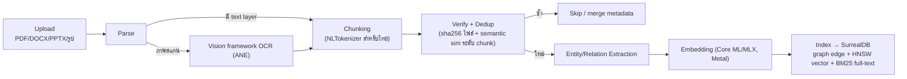
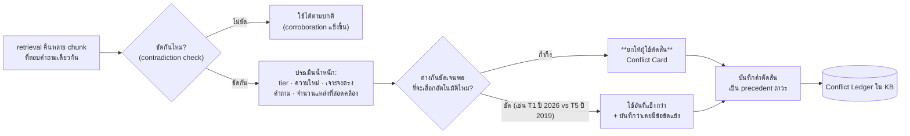
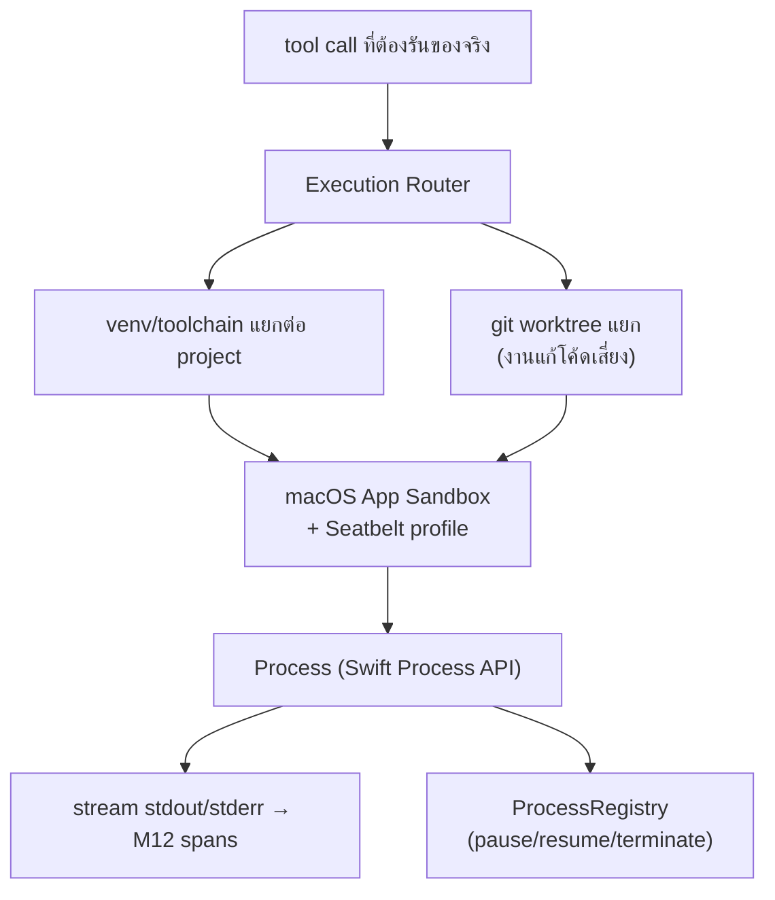

# โมดูลแกน — M1–M9

> ส่วนหนึ่งของ [สถาปัตยกรรม Co-AI Workspace](../../ARCHITECTURE.md) — §5–§13
>
> เอกสารนี้ตอบว่า **ระบบคืออะไรและทำไม** ไม่ตอบว่าสร้างถึงไหนแล้ว (นั่นคือ [`docs/plan/`](../plan/README.md)) · กฎที่บังคับด้วยเครื่องอยู่ที่ [`RULES.md`](../../RULES.md)

---

## 5. M1 CoreEngine

Module ที่ใหญ่และสำคัญที่สุด — ทุกอย่างที่เป็น "การตัดสินใจ" อยู่ที่นี่ที่เดียว

### 5.1 Team Orchestrator (sub-module)

implement [§2](01-foundations.md#2-ai-team-model--แกนหลักของ-v2) ทั้งหมด

**Functions**: `plan(goal:) -> [Assignment]` · `dispatch(_:to:)` · `review(_:)` · `rework(_:reason:)` · `escalate(_:)` · `report()`

**Features ที่ user เห็น**: สั่งเป้าหมายเดียวแล้วทีมทำงานต่อกันเอง · เห็นว่าใครทำอะไรอยู่ใน Team View · แทรกแก้ assignment ก่อนเริ่มได้

### 5.2 Agent Loop (sub-module)

state machine ที่ compiler บังคับ exhaustive:

```swift
enum AgentState {
    case clarifying(ClarifyContext)
    case planning(PlanContext)
    case awaitingCritique(Step, PlanContext)
    case awaitingApproval(Step, ApprovalRequest)
    case executing(Step, PlanContext)
    case reviewing(Deliverable)          // ใหม่ใน v2 — QA loop
    case done(Summary)
    case failed(AgentError)
}
```

**Clarify Stage** (คงจาก v1): เช็คคำสั่งกำกวมก่อนวางแผน ถูกกว่าปล่อยให้ Critic จับ plan ผิดโจทย์ทีหลัง — มี specialization สำหรับงานวิจัย ([§8.2](#124-gap-detection-mode-feature))

### 5.3 Hook Chain Gate (sub-module)

hook ที่วิ่ง**รอบทุก tool call** ไม่ใช่แค่ตอนวางแผน — ลำดับ: `Critic → Risk Scorer → Policy Gate → HITL`

| Hook | ทำอะไร | ผลลัพธ์ที่เป็นไปได้ |
|---|---|---|
| **Critic** (PreToolUse) | validate schema + logic เทียบ golden-task pattern | ผ่าน / ตีกลับพร้อมเหตุผล |
| **Risk Scorer** | ให้คะแนนความเสี่ยงจาก tool + argument + context | low / medium / high |
| **Policy Gate** | ดึง policy chunk ที่ `hard_constraint: true` จาก KB มาเทียบ action | ผ่าน / **hard stop** (ไม่ใช่แค่ "ต้อง approve" — ต้องแสดง chunk ที่ขัดกันตรงๆ ใน prompt) |
| **HITL** | ขออนุมัติเมื่อเกิน threshold ของ Autonomy Slider | approve / reject / แก้ไข |
| **PostToolUse** | เช็คผลลัพธ์ (เช่น Statistical Verification Gate, compiler output) | ผ่าน / ส่ง structured warning กลับ |

**Risk classification ต่อ tool (default)** — คงจาก v1: `kb_search`/`web_search`/`analysis_query` = Low · `analysis_execute`/`save_document` = Medium · `run_shell`/`install_package` = High

**Invariant**: agent ตัวไหนก็ตาม (built-in หรือ custom manifest) ที่มี tool risk-sensitive **ต้องวิ่งผ่าน hook chain เสมอ** — คำนวณจาก tool list จริงตอนโหลด ไม่ใช่ field ที่ manifest ประกาศเองว่าข้ามได้

### 5.4 Approval Broker (sub-module)

จุดที่แก้ debt ใหญ่สุดของ v1 (Telegram approve ไม่ได้ ต้องเขียนเพิ่มต่อ channel — Task K1 ที่ค้างไม่เสร็จ)

- `ApprovalRequest` มี `id` เดียว → broadcast ไป**ทุก channel ที่ subscribe** พร้อมกัน ไม่ผูกกับ channel ที่ trigger
- **First-response-wins**: channel ไหนตอบก่อนชนะ, broker แจ้ง channel อื่นว่า resolved แล้ว — กัน double-resolve/race เป็น invariant ของ broker ไม่ใช่สิ่งที่ต้องเทสแยกต่อ channel
- Channel แต่ละตัวแค่ implement `present(_:)` ตามรูปแบบของตัวเอง (Telegram inline keyboard / Discord button / LINE quick reply / GUI sheet / macOS notification)

**Features**: อนุมัติจากที่ไหนก็ได้ · เห็น diff/preview ก่อนอนุมัติ · approval แทรกใน Chat, ใน Workflow step card, และหน้า Approvals แยก (3 ที่ ใช้ component เดียวกัน)

### 5.5 โหมดการทำงาน (Operating Modes)

3 สวิตช์อิสระต่อกันจาก v1 **คงไว้ทั้งหมด** + จัดให้มองเห็นชัดในหัว conversation:

| สวิตช์ | คุมอะไร | ค่า |
|---|---|---|
| **Autonomy Slider** | step ระดับไหนต้อง approve | Full autonomous ↔ Approval-required (ตั้งต่อ workspace/project) — ใน Project สวิตช์นี้คือหน้าตาย่อของชุด **tolerance 6 แกน** [§19.10](04-project-management.md#1910-tolerance--exception--กลไกที่ทำให้-autonomy-มีความหมาย) ไม่ใช่ค่าลอย ๆ |
| **Plan-only Mode** | ห้าม execute tool ทั้ง session (คิด/เสนอแผนอย่างเดียว) | on/off |
| **Run-until-done** | ทำหลาย task ต่อกันเองโดยไม่รอ user พิมพ์ | on/off ต่อ conversation — **explicit toggle เท่านั้น ไม่ auto-detect** |

### 5.6 Context Manager (sub-module)

- **Budget-aware compaction** ที่ ~70–80% ของ context window (ไม่รอเต็ม — ให้เวลาเขียน handoff สะอาด)
- **Structured handoff** `{goal, completed_steps[], remaining_steps[], key_decisions[], open_issues[], file_pointers[]}` — `file_pointers` เก็บ path ไม่ใช่เนื้อหาดิบ
- ทิ้ง raw tool-output เก่าก่อนเป็นอันดับแรก
- **Durable rules** ที่ต้องรอดหลัง compact เก็บแยกจาก transcript (คำสั่งตอนต้น session ไม่หาย)
- ✅ **หนี้จาก v1 ปิดแล้ว (D-5 · P4.9)** — สามฟิลด์ที่ v1 ทำให้ไม่ว่างเปล่าไม่ได้ (`key_decisions`/`open_issues`/`file_pointers`) **สกัดจาก transcript ด้วย heuristic ไม่ใช่ด้วยการถามโมเดล**: การอนุมัติที่เกิดขึ้นจริง คำสั่งที่ exit ไม่ใช่ 0 และ path ที่ถูกเปิด เป็นข้อเท็จจริงที่นอนอยู่ในข้อความอยู่แล้ว ส่วนโมเดลที่ถูกถามว่า "ตัดสินอะไรไปบ้าง" จะแต่งคำตอบที่ฟังดูดี · โมเดล (Tier 0) ใช้เฉพาะสองฟิลด์เชิงเล่าเรื่อง ถ้าเรียกไม่ได้ ครึ่งที่เป็นหลักฐานยังมาครบ ([D-5](../DECISIONS.md#d-open-questions--ปิดครบแล้ว))

#### 5.6.1 กลยุทธ์บริบทเต็มรูปแบบ — compaction เป็นข้อเดียวในสี่ข้อ

> **ที่มา**: ระบบวันนี้ทำ compaction อย่างเดียว และทำได้ดี แต่ compaction เป็น**ทางเลือกสุดท้าย** — มันคือการยอมเสียข้อมูลเพื่อแลกที่ว่าง อีกสามข้อคือการไม่ให้ context โตตั้งแต่แรก และแนวทางที่ใช้อ้างอิงคือชุดเดียวกับที่ Anthropic เผยแพร่ไว้ (compaction · structured note-taking · sub-agent · just-in-time retrieval)

| กลยุทธ์ | สถานะวันนี้ | สิ่งที่ต้องเติม |
|---|---|---|
| **1. Just-in-time retrieval** — เก็บ*ตัวชี้* ไม่ใช่*เนื้อหา* แล้วโหลดตอนใช้ | 🔶 `file_pointers` และ `artifacts` เป็น pointer อยู่แล้ว | แต่ผลลัพธ์ทูลยังเข้าบทสนทนาเต็มก้อน — ผลที่ยาวควรเก็บเป็น record แล้วส่งเฉพาะ**หัว/ท้าย + record id** ให้ agent ขอส่วนที่เหลือเองถ้าต้องการ |
| **2. Structured note-taking** — บันทึกภายนอกที่ agent เขียนเองระหว่างทาง | ✅ มีของจริงและดีกว่าที่คิด — `write_skill` (P8.5) และ task ledger (§5.7) คือสิ่งนี้ | ยังไม่มี "สมุดบันทึกของรอบงาน" ที่ agent เขียนความคืบหน้าระหว่างงานยาว ๆ แล้วอ่านกลับหลัง compact |
| **3. Sub-agent ที่มี context สะอาด** | ✅ [§2.3](01-foundations.md#23-context-isolation--กติกาการคืนงาน) ทำอยู่แล้ว และ [§22](06-organisation-and-ui.md#22-ai-organization--จากทีมเดียวเป็นองค์กร-m17-command) ขยายเป็นหลายชั้น | ขนาดของ `Deliverable` ที่คืนขึ้นควรมีเพดาน — สรุปที่ยาวเท่ากับ transcript ไม่ได้ประหยัดอะไร |
| **4. Compaction** | ✅ ทำแล้ว (P4.9) | ปรับพรอมป์ตให้ **เน้น recall ก่อน แล้วค่อยไล่ตัดส่วนเกิน** — ลำดับนี้สำคัญ เพราะข้อมูลที่ถูกตัดทิ้งตอน compact ไม่มีทางกลับมา |

**สองกฎที่ต้องบังคับ ไม่ใช่แนะนำ**:

- **เพดานบริบทเป็นของ endpoint ไม่ใช่ค่าคงที่ในโค้ด** — วันนี้ `ContextManager(budget: 16_384)` เป็นตัวเลขเขียนตายที่เลือกจากการวัดบนเครื่อง 16 GB ([§9](#9-m5-llmproviders)) เมื่อ GX10 เสิร์ฟด้วย `--max-model-len 32768` เพดานจริงเปลี่ยน และ**เพดานนั้นรวมโทเคนขาออกด้วย** การตั้งงบเข้าเท่ากับ max-model-len คือการรับประกันว่าคำตอบยาว ๆ จะถูกตัดกลางประโยค
- **ชุดทูลต้องเล็กและไม่ทับกัน** — ทุกทูลที่ลงทะเบียนกินที่ในทุกคำขอของทุก agent ตลอดไป เกณฑ์ที่ใช้ตัดสินคือ: **ถ้าคนเขียนโปรแกรมยังตอบไม่ได้ว่าสถานการณ์นี้ควรใช้ทูลไหน agent ก็ตอบไม่ได้** — และเกณฑ์นี้ใช้กับทูลจาก MCP server กับปลั๊กอินด้วย ซึ่งเป็นทางที่ชุดทูลโตขึ้นโดยไม่มีใครตัดสินใจ

### 5.7 Task Ledger (sub-module)

task list ของ session เก็บใน SurrealDB เป็น source of truth (ไม่ใช่ในหัวโมเดล) — fields: `conversation_id, step_index, description, role, status, result_summary, retry_count` (+ `work_package` เมื่ออยู่ใน Project — ผูกแผนกับผลการเดินเข้าด้วยกัน [§19.6](04-project-management.md#196-scope--wbs-product-based))

- อ่านใหม่จาก DB ก่อนเริ่มทุก task (plan re-grounding)
- Stop flag ระดับ session: กด Stop → task ที่รันอยู่จบตามปกติ แล้วไม่เริ่มตัวถัดไป (ไม่ kill กลางคันเพื่อกัน state ค้างครึ่งๆ) — คนละชั้นจาก process signal ของ M9

### 5.8 Model Router (sub-module)

→ [§9.2](#92-model-router-tier-0--05--1)

---

## 6. M2 AgentKit

Module ที่**ไม่มี logic เลย** — มีแค่ protocol/type ที่ทุก module ใช้ร่วมกัน (ป้องกัน dependency cycle และการประกาศ type ซ้ำแบบ v1)

```swift
protocol AgentTool: Sendable {
    static var name: String { get }
    associatedtype Arguments: Generable   // Foundation Models structured input
    associatedtype Output: Sendable
    var riskLevel: RiskLevel { get }
    func call(_ arguments: Arguments, context: ToolContext) async throws -> Output
}

protocol Channel: Sendable {
    var id: ChannelID { get }
    func send(_ message: AgentMessage) async
    func present(_ request: ApprovalRequest) async
}

protocol Specialist: Actor {
    var role: Role { get }
    var definitionOfDone: [Criterion] { get }
    func execute(_ assignment: Assignment) async throws -> Deliverable
}

enum Scope: Codable, Hashable { case central, project(ProjectID), policy }
```

**หมายเหตุ**: `Scope` ประกาศที่นี่ที่เดียว — ใช้ร่วมกันทั้ง KB, DB connector, workflow, agent, notebook (v1 มี type รูปร่างนี้ 3 ตัวแยกกัน)

---

## 7. M3 Roster

ทะเบียน capability ทั้ง 3 ชนิดที่โหลดจากไฟล์โดยไม่ต้อง recompile

### 7.1 เลือกให้ถูกชั้น (Skill vs Agent vs Plugin vs Tool)

ตารางนี้แก้ปัญหาที่ [§1.2](../ECOSYSTEM_REVIEW.md#2-ai-harness-ยอดนิยม--pattern-ที่ยืมมา) ชี้ว่าคนพลาดบ่อยที่สุด:

| ถ้า... | ใช้ | เหตุผล |
|---|---|---|
| เป็น "วิธีทำ/ขั้นตอน/ความรู้" ที่ agent อ่านแล้วทำตามได้ | **Skill** | ถูกที่สุด ไม่มี overhead — โหลด body เฉพาะตอนถูกเลือกใช้ (progressive disclosure) |
| ต้องการ persona + tool allowlist ต่างจากเดิม + context แยก | **Agent (role)** | มี isolation cost แต่คุ้มเมื่อ context ปนกันแล้วเสีย |
| เป็นโค้ด/บริการภายนอกที่ต้องรันเป็น process | **Plugin** (= packaged MCP server) | ได้ sandbox + protocol มาตรฐานฟรี |
| เป็นความสามารถพื้นฐานที่ระบบต้องมีเสมอ | **Tool** (M6) | อยู่ใน binary, มี risk classification ตายตัว |

### 7.2 Manifest Format

รูปแบบ flat frontmatter เดียวกับ `SKILL.md` ของ Claude Code (parser ตัวเดียวใช้ทั้ง agent และ skill):

```
---
name: legal-review
description: Contract review persona — KB search + web search เท่านั้น ไม่มี shell
tools: kb_search, web_search
base: researcher
model_tier: 1
definition_of_done: ทุกข้อสรุปมี ≥2 source, tier 1-2 อย่างน้อย 1 แหล่ง
---

You are a contract-review assistant specializing in Thai commercial contracts...
```

- `tools:` validate ตอนโหลดว่าตรงกับ tool ที่ระบบรู้จักจริง — ชื่อไม่ตรง = reject พร้อม error ชัดเจน (philosophy เดียวกับ Config ที่ reject ค่า invalid ทันที)
- `base:` inherit tool set จาก role ที่มีอยู่แล้ว
- `definition_of_done:` **field ใหม่ของ v2** — ป้อนให้ QA agent ใช้ตรวจ ([§2.5](01-foundations.md#25-qa-loop--ตรวจตามมาตรฐาน))
- โหลดจาก `~/Library/Application Support/CoAIWorkspace/agents/*.md` และ per-project `<project>/.agents/`

### 7.3 Features

สร้าง/แก้/ลบ agent ผ่าน UI · สร้าง/แก้/import/export skill ผ่าน UI · **agent เขียน skill เองได้** ผ่าน `write_skill` (ผ่าน risk/approval gate ปกติ ไม่ใช่ backdoor) · ติดตั้ง/ถอน plugin จากโฟลเดอร์ · enable/disable ต่อ skill

**ยังไม่ทำ (ยกมาจาก v1)**: usage-logging loop ที่ทำให้ระบบ "เรียนรู้จาก feedback เอง" — "เขียน skill ได้" กับ "ปรับปรุงตัวเองจากผลลัพธ์" เป็นคนละงาน

---

## 8. M4 Channels

### 8.1 Sub-modules

| Sub-module | รายละเอียด | Approval UI |
|---|---|---|
| `GUIChannel` | SwiftUI sheet + macOS native notification | native sheet + notification action |
| `TelegramChannel` | Bot API **long polling** (outbound-only — ไม่ต้องเปิด inbound port/VPN) | inline keyboard |
| `DiscordChannel` | Gateway WebSocket (Hello→Identify→Heartbeat→MESSAGE_CREATE), filter ข้อความจาก bot เอง | button component |
| `LINEChannel` | local webhook server + **HMAC signature verification**, ใช้ push API เสมอ (ไม่ใช้ one-time reply token เพราะหมดอายุเร็วเกินกว่า agent turn) | quick reply |
| `AppIntentsChannel` | **ใหม่ใน v2** — สั่งงานผ่าน Siri/Shortcuts/Spotlight | ส่งต่อไป GUI (Siri ไม่เหมาะกับ approval ที่ต้องเห็น diff) |
| `Notifier` | native notification ตอน approval request + task/chat เสร็จ | — |

### 8.2 Features

multi-account ต่อ platform (หลาย bot/หลาย chat) · allow-list chat id ต่อ account · เลือก endpoint/โมเดลแยกต่อ channel ได้ · **ทุก channel วิ่งผ่าน Core เดียวกัน ไม่มีใครข้าม hook chain**

---

## 9. M5 LLMProviders

### 9.1 LLM Abstraction ของเราเอง (รองรับทั้งสองยุค)

**ข้อเท็จจริงที่ตรวจแล้ว** ([ภาคผนวก E](../VERIFICATION_LOG.md)): `LanguageModelExecutor` ที่ WWDC26 ประกาศ **ยังไม่มีใน SDK ที่ติดตั้งบนเครื่องจริง** (macOS 26.6.1 / Xcode 26.6) — เป็นของ macOS 27 ที่ออกกันยายน 2026 ส่วน `LanguageModelSession`/`Generable`/`Guide`/`Tool`/`Transcript`/`DynamicGenerationSchema` **มีครบแล้ววันนี้**

**Decision (2026-08-10)**: ประกาศ protocol ของเราเองที่**หน้าตาล้อ `LanguageModelExecutor`** แล้ว implement 2 ตัวตั้งแต่วันแรก — พอ macOS 27 ออก สลับ backend ไปใช้ของ Apple ได้โดยไม่กระทบ CoreEngine เลย

```swift
// protocol ของเรา — ตั้งใจให้ signature ใกล้ของ Apple มากที่สุด
protocol LLMExecutor: Sendable {
    var capabilities: LLMCapabilities { get }          // context window, tool-calling, structured output, vision
    func prewarm() async
    func respond(to request: LLMRequest) -> AsyncThrowingStream<LLMEvent, Error>
}

struct OnDeviceExecutor: LLMExecutor   // ห่อ LanguageModelSession (มีวันนี้)
struct VLLMExecutor: LLMExecutor       // OpenAI-compatible → GX10 (เขียนเอง, มีวันนี้)
// เมื่อ macOS 27 พร้อม:
// struct AppleProviderExecutor: LLMExecutor  // delegate ไปให้ LanguageModelExecutor ของ Apple
```

**สิ่งที่ยังต้องเขียนเองในระหว่างนี้ (ยุค macOS 26)**: tool-call protocol ฝั่ง vLLM (ChatML `<tool_call>` หรือ OpenAI `tool_calls` แล้วแต่ว่า serve ยังไง) + strict parser + malformed-output recovery — **เหมือน v1 แต่ขอบเขตเล็กลงมาก** เพราะฝั่ง on-device ใช้ `@Generable` ของ Apple อยู่แล้ว และ tool schema ประกาศครั้งเดียวใน `AgentTool` ([§6](#6-m2-agentkit)) แปลงลงไปทั้งสอง executor

**สิ่งที่ได้ทันทีโดยไม่ต้องรอ macOS 27**: structured output ฝั่ง Tier 0 (`@Generable`/`@Guide`), MCP tool ผ่าน `DynamicGenerationSchema`, Tool protocol ของ Apple

### 9.2 Model Router: Tier 0 / 0.5 / 1

**ปรับหลังผลการทดสอบจริง** ([E.6](../verification/01-e01-e15.md#e6-d-7-spike--guided-generation-ใน-app-target-จริง)) — Tier 0 เร็วพอ (0.7–1.8 วิ) แต่ **ปฏิเสธงานการแพทย์ ~12% แบบสุ่ม** และ **คุณภาพการ route ปานกลาง** จึงลดขอบเขตงานที่ให้ Tier 0 รับผิดชอบเดี่ยวๆ ลง

| Tier | โมเดล | รับงานอะไร | ค่าใช้จ่าย |
|---|---|---|---|
| **0** | Foundation Models on-device (~3B) | งานที่**ผิดแล้วไม่เสียหาย และมี fallback เสมอ**: card title/label, จัดกลุ่มข้อความ, structured extraction จากข้อความที่มีอยู่แล้ว, สรุปสั้นสำหรับ compaction handoff | ฟรี, ไม่จำกัด |
| **0.5** | **MLX local** — โมเดลที่โหลดมารันบนเครื่องเอง ([§9.4](#94-mlx-local-tier-05--model-management)) | งานที่ Tier 0 ไม่พอ แต่ไม่ต้องการ/ไม่มี Tier 1 — และ**เป็น fallback ตัวสุดท้ายที่ต้องทำงานได้เสมอ** เมื่อ Tier 1 ใช้ไม่ได้ (เน็ตล่ม, งบหมด, GX10 ไม่ว่าง) | ฟรี, ไม่จำกัด (จำกัดด้วย RAM/ความเร็วเครื่อง) |
| **1a** | **Self-hosted ระยะไกล** — vLLM Qwen3.6-27B @ GX10, LM Studio/Ollama บนเครื่องอื่นในบ้าน | planning, **การ route งานของ Team Lead**, code, manuscript, การตีความสถิติ, gap severity, งาน high-risk ทุกชนิด | ฟรี, **unlimited** — ไม่ต้องมี budget cap |
| **1b** | **Paid API** — hosted provider ที่คิดเงินต่อ token | เหมือน 1a แต่ใช้เมื่อต้องการคุณภาพสูงสุด/ความสามารถที่ local ไม่มี | **มีค่าใช้จ่าย → ต้องผ่าน Budget Governor ([§9.5](#95-budget-governor--คุมค่าใช้จ่ายของ-tier-1b))** |

**กลไกบังคับ (ไม่ใช่ optional)**:

1. **Refusal = escalate ไม่ใช่ error** — `GenerationError.Refusal` จาก Tier 0 ต้อง retry ที่ tier ถัดไปอัตโนมัติ และ**ห้ามโผล่เป็น error ให้ user เห็น** (พิสูจน์แล้วว่า prompt งานวิจัยปกติก็โดนได้ และ `permissiveContentTransformations` ไม่ช่วย — [E.7](../verification/01-e01-e15.md#e7-guardrail-characterization--โดเมนการแพทย์))
2. **ห้ามให้ tier ใดเป็นทางเดียวของงานใดก็ตาม** — ทุก call site ต้องประกาศ fallback chain (API ไม่มี overload ที่ไม่มี fallback)
3. **Fallback เมื่อ context เกิน** — input ยาวเกิน context ของ tier ปัจจุบัน → ขึ้น tier ที่รับไหว ไม่ใช่ error
4. 🆕 **Tier 0.5 เป็นพื้นรับประกัน** — ถ้า tier ที่ต้องการใช้ไม่ได้ (offline/งบหมด/endpoint ล่ม) งานต้อง**ตกลงมาที่ Tier 0.5 แล้วทำงานต่อได้ ไม่ใช่ล้มเหลว** ดังนั้นต้องมีโมเดล MLX อย่างน้อย 1 ตัวติดตั้งไว้เสมอ (ตั้งค่าตอน onboarding)

**Fallback chain (ตัวอย่างที่เป็น default)**:

```
งานเบา:  Tier 0 → Tier 0.5 → Tier 1a
งานหนัก: Tier 1a → Tier 0.5 → (Tier 1b เฉพาะเมื่อ user เปิดและงบยังพอ)
```

**เกณฑ์การเลือก tier — ไม่ hardcode ต่องาน แต่คำนวณจาก 4 signal**:

| Signal | ตัวอย่าง |
|---|---|
| **Capability ที่งานต้องการ** | ต้องการ tool-calling / structured output / context ยาว / vision → ตัด tier ที่ `LLMCapabilities` ไม่รองรับออกก่อน |
| **ผลกระทบถ้าผิด** | routing/planning/สถิติ = สูง → ห้ามใช้ Tier 0 |
| **ความพร้อมจริงตอนนี้** | endpoint ตอบ probe ไหม, งบเหลือไหม, โมเดล MLX โหลดอยู่ไหม |
| **ความเร่งของ UX** | งานที่ user รอดูผลทันที → เลือก tier ที่ latency ต่ำสุดที่ยังผ่านเกณฑ์ข้างบน |

**Progressive disclosure** ยังใช้เหมือน v1: planner เห็นแค่ manifest metadata ของ skill/tool ทั้งหมด โหลด body/schema เต็มเฉพาะตัวที่เลือกใช้จริง

### 9.3 Endpoint Registry

`{ endpoints: [InferenceEndpoint], defaultEndpointID, overrides: [Role: EndpointID] }` — ตั้งหลาย endpoint พร้อมกัน (vLLM/GX10, LM Studio, Ollama, llama.cpp, hosted provider ที่มี OpenAI-compatible mode) เลือกต่อ role ได้

แต่ละ endpoint ประกาศ **`kind: .selfHosted | .paid`** — เป็นตัวกำหนดว่าต้องผ่าน Budget Governor หรือไม่ ([§9.5](#95-budget-governor--คุมค่าใช้จ่ายของ-tier-1b))

**Features**: สถานะการเชื่อมต่อเป็นจุดสีถาวร (probe เบาๆ ไม่เปลือง token) + ปุ่ม Recheck all · token usage ต่อ session · **validate ชื่อโมเดลกับ `/v1/models` ตอนบันทึกค่า** — จำเป็นเพราะพิสูจน์แล้วว่า endpoint ไม่ปฏิเสธชื่อโมเดลที่ไม่มีอยู่จริง ([E.9](../verification/01-e01-e15.md#e9-vllmexecutor-spike--tier-1-ผ่าน-openai-compatible-endpoint) เคส 8a)

### 9.4 MLX Local (Tier 0.5) — Model Management

Tier 0.5 ไม่ใช่ "ทางเลือกเสริม" แต่เป็น**พื้นรับประกันของระบบ** — ต้องมี lifecycle การจัดการโมเดลเต็มรูปแบบ

**Sub-module `MLXRuntime`** (อยู่ใน M5):

| ความสามารถ | รายละเอียด |
|---|---|
| **โหลดจาก Hugging Face** | เลือกจากรายการโมเดลที่แนะนำ (คัดไว้ว่ารันบน Apple Silicon ได้จริง) → ดาวน์โหลดพร้อม progress bar, resume ได้, cache ที่ `~/Library/Application Support/CoAIWorkspace/models/` |
| **โฮสต์โมเดล embedding ด้วย** | ไม่ใช่แค่โมเดลสนทนา — `bge-m3` ([E.10](../verification/01-e01-e15.md#e10-d-2--เลือก-embedding-model-วัดจริง-ปิดแล้ว)) ต้องรันในแอปเอง เพราะ KB จะ index ไม่ได้เลยถ้าต้องพึ่ง server ภายนอกที่ผู้ใช้ลืมเปิด |
| **ใช้โมเดลที่มีอยู่แล้ว** | ชี้ไปยังโฟลเดอร์โมเดลที่ user โหลดมาเอง (รวมถึงที่ LM Studio โหลดไว้) — ไม่บังคับให้โหลดซ้ำ |
| **ตรวจความเข้ากันได้ก่อนโหลด** | เทียบ **ขนาดโมเดล (หลัง quantization) กับ RAM ที่ว่างจริง** — เกินเกณฑ์ = เตือนและไม่ให้ตั้งเป็น default (กันเครื่องค้าง) |
| **จัดการพื้นที่** | แสดงขนาดที่ใช้ต่อโมเดล, ลบได้, ตั้ง quota รวม |
| **โหลด/ปลดจากหน่วยความจำ** | โหลดเมื่อใช้ครั้งแรก, ปลดเมื่อไม่ใช้เกิน N นาที (คืน RAM ให้งานวิเคราะห์) |

**เกณฑ์ขั้นต่ำและการจับคู่ขนาดโมเดล → งาน** (ค่าเริ่มต้น ปรับได้ใน Settings):

| RAM ของเครื่อง | ขนาดโมเดลที่แนะนำ | งานที่ Tier 0.5 รับได้ |
|---|---|---|
| < 16 GB | 3–4B (4-bit) | เทียบเท่า Tier 0 — ใช้เป็น fallback ตอน Tier 0 ปฏิเสธเท่านั้น |
| 16–32 GB | 7–8B (4-bit) | routing, extraction, สรุป, งานเขียนสั้น |
| 32–64 GB | 14–32B (4-bit) | เกือบทุกอย่างยกเว้นงานที่ต้องการคุณภาพสูงสุด |
| > 64 GB | 32–70B (4-bit) | ทดแทน Tier 1a ได้จริงเมื่อ GX10 ไม่ว่าง |

**หลักการ**: Router **ไม่ตัดสินจากชื่อ tier แต่จาก capability ที่โมเดลนั้นประกาศจริง** (`LLMCapabilities`) — โมเดล MLX 32B ที่โหลดอยู่ อาจได้รับงานที่เดิมกำหนดไว้ว่าเป็นของ Tier 1a หากคุณสมบัติผ่านและ Tier 1a ใช้ไม่ได้ตอนนั้น

### 9.5 Budget Governor — คุมค่าใช้จ่ายของ Tier 1b

ใช้เฉพาะ endpoint ที่ `kind == .paid` — endpoint ที่ self-host **ไม่ผ่านชั้นนี้เลย ไม่มีเพดาน**

| กลไก | รายละเอียด |
|---|---|
| **เพดานหลายชั้น** | ต่อ request · ต่อ session · ต่อวัน · ต่อเดือน — ชั้นไหนถึงก่อนก็บล็อกก่อน |
| **ประเมินก่อนยิง** | คำนวณ token โดยประมาณ × ราคาต่อ token ที่ตั้งไว้ต่อ endpoint → เทียบเพดานที่เหลือ **ก่อน**ส่ง request |
| **เกินเพดาน = ไม่ใช่ error** | ตกไป Tier 1a/0.5 อัตโนมัติ (ตามกลไก fallback ข้อ 4) และบันทึกเหตุผลลง span |
| **HITL เมื่อจำเป็น** | ถ้างานนั้น**ต้อง**ใช้ Tier 1b จริงๆ (capability ที่ tier อื่นไม่มี) และเกินเพดาน → ยกเป็น approval request ผ่าน [§5.4](#54-approval-broker-sub-module) พร้อมแสดงค่าใช้จ่ายโดยประมาณ ไม่ใช่เงียบๆ ใช้ต่อ |
| **บัญชีจริงหลังใช้** | อ่าน `usage` ที่ endpoint คืนมา (พิสูจน์แล้วว่ามีจริงทั้ง streaming และ non-streaming — [E.9](../verification/01-e01-e15.md#e9-vllmexecutor-spike--tier-1-ผ่าน-openai-compatible-endpoint)) → หักจากเพดาน, เก็บลง `TokenAccountant` |
| **มองเห็นได้ตลอด** | แถบงบคงเหลือใน UI + รายงานย้อนหลังต่อ session/role/โมเดล ว่าเงินหมดไปกับอะไร |

**เหตุผลที่ต้องมีชั้นนี้**: multi-agent กิน token ~15× ของ chat ธรรมดา ([§1.2](../ECOSYSTEM_REVIEW.md#2-ai-harness-ยอดนิยม--pattern-ที่ยืมมา)) — ทีมที่วน QA loop หลายรอบบน endpoint ที่คิดเงินคือช่องที่ค่าใช้จ่ายบานปลายเร็วที่สุดในระบบนี้

---

## 10. M6 ToolBelt

tool ทุกตัว conform `AgentTool` เดียวกัน — Core ไม่รู้ว่ามาจาก built-in, MCP, หรือ Foundation Models built-in capability

| Function (tool name) | ทำอะไร | Risk |
|---|---|---|
| `run_shell` | รันคำสั่งใน sandbox ผ่าน M9 | High |
| `read_file` / `write_file` | อ่าน/เขียนไฟล์ในขอบเขต project | Low / Medium |
| `kb_search` | hybrid search (BM25+vector) บน KB scope ที่กำหนด — ผลลัพธ์พ่วง credibility tier เสมอ | Low |
| `web_search` | ค้นตาม tier ทุกแขนงความรู้ ([§1.2](01-foundations.md#12-web-search--มีของฟรีถาวรไหม-apple-ให้ด้วยไหม)) — คืน**รายการผลลัพธ์** ไม่ใช่เนื้อหา | Low |
| 🆕 `fetch_page` | **เปิดหน้าเว็บแล้วอ่านเนื้อหาจริง** — readability extraction (ตัด nav/ads), รองรับ PDF, คืนข้อความ + tier + วันที่เข้าถึง พร้อม provenance ระดับย่อหน้า | Low |
| 🆕 `ingest_url` | ดึงหน้าเว็บเข้า KB ถาวร (ผ่าน pipeline เดียวกับ upload ไฟล์) เมื่อเนื้อหานั้นควรค้นเจอได้ในอนาคต | Medium |
| `analysis_query` / `analysis_execute` | query / เขียนข้อมูลใน DuckDB | Low / Medium |
| `pull_db_table` | ดึงตารางจาก external DB เข้า analysis store | Medium |
| `save_document` | generate เอกสารผ่าน M10 | Medium |
| `install_package` | ติดตั้ง package ผ่าน manager ที่รองรับ — **แปลงเป็น argv ตรงๆ ไม่มี `sh -c`** (ปิดช่องโหว่ shell injection ที่ `run_shell` มี) | High |
| `write_skill` | สร้าง/แก้ skill | Medium |
| `fetch_docs` | ดึง doc ของ library ตามเวอร์ชันที่ project ใช้จริง (อ่านจาก lockfile) — เรียกแบบ reactive เฉพาะตอนไม่แน่ใจ ไม่ preload | Low |
| MCP tools (dynamic) | ทุก tool จาก MCP server ที่ connect อยู่ ผ่าน SwiftMCP + official Swift SDK | ตาม classification (ไม่รู้จัก = High) |

**MCP support ครบทั้ง 3 primitive** (v1 ทำครบแล้ว คงไว้): `tools/*` → agent tool · `resources/*` → agent tool สำหรับอ่าน resource · `prompts/*` → picker ให้ user เลือกใน composer (ไม่ใช่ agent tool — เป็นของ user)

---

## 11. M7 Knowledge

### 11.1 Ingestion Pipeline



### 11.2 Scope 3 ระดับ

| Scope | ใช้กับ | พิเศษ |
|---|---|---|
| `central` | ความรู้ทั่วไปข้ามโปรเจกต์ | — |
| `project(id)` | เอกสารของโปรเจกต์นั้น | default query เฉพาะ scope ที่เกี่ยวข้อง (ข้าม scope ได้เมื่อ agent ขอ) |
| `policy` | SOP/IRB/data governance | **chunking atomic ต่อกฎ** (ตามหัวข้อ ไม่ตัดตามความยาว) + metadata `hard_constraint`, `version`, `effective_date`, `supersedes` → ป้อน Policy Gate ([§5.3](#53-hook-chain-gate-sub-module)) + เตือนเมื่อ policy อาจไม่ใช่ฉบับล่าสุด |

### 11.3 Provenance + Credibility (บังคับตั้งแต่ ingestion)

ทุก chunk เก็บ provenance **พร้อมระดับความน่าเชื่อถือ** — retrieval คืนทั้งก้อนเสมอ ทำให้ M10 บังคับ citation ได้ทุกประโยค และ Conflict Ledger ([§11.6](#116-conflict-ledger--เมื่อความรู้ขัดกัน)) ตัดสินน้ำหนักได้

```
source: {
  doc_id, title, authors?, year?, page?, section?,   // เดิม
  tier: T1…T5,              // ระดับความน่าเชื่อถือ — vocabulary เดียวกับ WebSearch (§1.2)
  origin: .upload | .web(url) | .database | .userAuthored,
  accessedAt: date,         // สำคัญกับแหล่งเว็บที่เนื้อหาเปลี่ยนได้
  supersedes: doc_id?,      // ฉบับก่อนหน้าของเอกสารเดียวกัน
}
```

**หลักการสำคัญ**: tier ของ **KB กับ WebSearch ใช้ vocabulary เดียวกัน** — เอกสารที่ ingest จากเว็บพก tier เดิมติดมา, ไฟล์ที่ user อัปโหลดเองให้ผู้ใช้เลือก tier ตอน upload (default T3 พร้อมให้แก้), ผลวิเคราะห์ของระบบเองเป็น `.userAuthored` ที่ไม่มี tier ภายนอก แต่มี provenance ของ analysis run

### 11.4 Features

อัปโหลดไฟล์หลายชนิด · **ดึงหน้าเว็บเข้า KB ผ่าน `ingest_url`** · ดู/แก้/ลบ entity และ relation ผ่าน graph view · แยกแสดง central/project · export/import KB · categorization/tag · ค้นแบบ hybrid · **ดู provenance + tier ของทุกผลลัพธ์** · **ตรวจและตัดสินความรู้ที่ขัดกัน ([§11.6](#116-conflict-ledger--เมื่อความรู้ขัดกัน))**

### 11.5 SurrealDB: Sidecar + Client ของเราเอง

**ข้อเท็จจริงที่ตรวจแล้ว**: [`surrealdb.swift`](https://github.com/surrealdb/surrealdb.swift) เป็น **alpha** — 5 ดาว, สร้าง ก.พ. 2026, ไม่มี release, README ประกาศเองว่า *"public API is subject to breaking changes without notice"*, รองรับแค่ remote (ไม่มี embedded engine)

**Decision (2026-08-10)**: **คง SurrealDB ไว้** (คุ้มค่าเพราะได้ graph + vector + full-text ใน engine เดียว และ SurrealQL quirks ถูกบันทึกไว้หมดแล้วจาก v1) แต่ **ไม่พึ่ง SDK alpha** — เขียน client บาง ๆ เอง:

| ชั้น | รายละเอียด |
|---|---|
| `SidecarManager` | bundle `surreal` binary ใน `.app` · spawn ตอน launch (bind `127.0.0.1` เท่านั้น, port จาก bootstrap config) · health check + restart ถ้า crash · terminate ตอน quit — ดูแล `searxng` sidecar ด้วยตัวเดียวกัน |
| `SurrealClient` | WebSocket (URLSessionWebSocketTask ของ Foundation) พูด JSON-RPC ของ SurrealDB ตรงๆ — method ที่ต้องใช้จริงมีไม่กี่ตัว (`use`, `signin`, `query`, `live`) เขียนเองคุมได้เต็ม ไม่โดน breaking change ของคนอื่น |
| `KBStore` | typed API เหนือ `SurrealClient` — ทุก query เป็น SurrealQL ที่เราคุมเอง |

**ทางออกสำรองที่ประเมินไว้แล้ว** (ถ้า SurrealDB กลายเป็นภาระ): SQLite + FTS5(BM25) + [`sqlite-vec`](https://github.com/asg017/sqlite-vec) (8k ดาว, embedded, hybrid ด้วย RRF) — เสีย graph query สำเร็จรูป ต้อง model edge table + recursive CTE เอง เก็บไว้เป็น Plan B ที่มีของจริงรองรับ ไม่ใช่แค่ความคิด

⚠️ SurrealQL quirks ที่เจอมาแล้วใน v1 ยังใช้ได้กับ Swift → [ภาคผนวก C](../ENGINEERING_NOTES.md)

### 11.6 Conflict Ledger — เมื่อความรู้ขัดกัน

**ปัญหา**: ระบบที่ดูดความรู้จากหลายแหล่ง จะมีวันที่แหล่งสองแหล่งบอกไม่ตรงกัน (ค่าตัวเลขต่างกัน, คำแนะนำตรงข้าม, นิยามไม่เหมือนกัน) — การให้ agent **เลือกเองเงียบๆ** เป็นพฤติกรรมที่อันตรายที่สุดของระบบ RAG เพราะผู้ใช้จะไม่มีวันรู้ว่ามีทางเลือกอื่นอยู่

**หลักการ**: **ระบบตรวจจับ + ประเมิน + เสนอ — แต่คนตัดสิน** เก็บผลการตัดสินไว้ใช้ต่อ ไม่ต้องถามซ้ำ



**Conflict Card ที่ผู้ใช้เห็น — ต้องมีข้อมูลพอให้ตัดสินโดยไม่ต้องไปเปิดเอกสารเอง**:

| ส่วน | เนื้อหา |
|---|---|
| ข้อความที่ขัดกัน | ยกมาแบบ **verbatim ทั้งสองฝั่ง** พร้อมบริบทรอบข้าง ไม่ใช่สรุปของ agent |
| ที่มาแต่ละฝั่ง | ชื่อเอกสาร/URL, ผู้เขียน, ปี, **tier**, วันที่เข้าถึง |
| น้ำหนักที่ระบบประเมิน | เหตุผลเป็นข้อๆ ("ฝั่ง A: T1 ปี 2026 มี 3 แหล่งสอดคล้อง / ฝั่ง B: T4 ปี 2021 แหล่งเดียว") |
| ข้อเสนอของระบบ | ระบุชัดว่าเป็น **ข้อเสนอ** พร้อมเหตุผล ไม่ใช่ข้อสรุป |
| ทางเลือกของผู้ใช้ | เลือก A / เลือก B / **"ทั้งคู่ถูกในบริบทต่างกัน"** (พร้อมระบุเงื่อนไข) / "ยังไม่ตัดสิน — ให้เขียนแบบระบุว่ายังไม่ยุติ" |
| ขอบเขตของคำตัดสิน | ใช้เฉพาะโปรเจกต์นี้ หรือเป็น central precedent ข้ามโปรเจกต์ |

**การนำคำตัดสินไปใช้ต่อ**:

- เก็บเป็น record `conflict_resolution` ใน KB (`{claimKey, chosen, rejected[], rationale, scope, decidedBy: .user|.system, decidedAt}`)
- retrieval ครั้งถัดไปที่เจอ claim เดียวกัน **ใช้คำตัดสินเดิมทันที** ไม่ถามซ้ำ — แต่ถ้ามีแหล่งใหม่ที่ **tier สูงกว่าฝั่งที่ชนะ** โผล่มา ระบบ **เปิด conflict ใหม่** (ไม่เงียบ)
- ทุกครั้งที่ manuscript อ้างข้อความที่เคยมีข้อขัดแย้ง → **ขึ้นบัญชีอัตโนมัติในส่วน Limitations** ([§14.1](03-surfaces-and-ops.md#141-docgen)) กลไกเดียวกับ origin tag ของ Analysis Plan
- `decidedBy: .system` (เคสที่ต่างกันชัดจนไม่ต้องถาม) ยัง **audit ได้ทั้งหมด** ในหน้า Conflict Ledger — ผู้ใช้เปิดดูย้อนหลังและ **กลับคำตัดสินได้เสมอ**

**ความสัมพันธ์กับ Cross-source Corroboration เดิม** ([§14.1](03-surfaces-and-ops.md#141-docgen)): corroboration ตอบว่า "มีกี่แหล่งที่พูดตรงกัน" — Conflict Ledger ตอบว่า "แล้วแหล่งที่พูดไม่ตรงกันล่ะ จะเอายังไง" เป็นคนละด้านของเรื่องเดียวกัน ใช้ tier vocabulary ชุดเดียวกัน

### 11.7 เกณฑ์ว่าอะไรคือ "ขัดแย้ง" จริง — และข้อผิดพลาดที่พบจากการใช้จริง

> **อาการที่ทำให้ต้องเขียน section นี้** (2026-08-15): การ์ดข้อขัดแย้งที่ระบบยกขึ้นมาจริง ๆ แล้วเป็น**ข้อความเดียวกันคนละภาษา** ไทยกับอังกฤษ ซึ่งแปลแล้วพูดเรื่องเดียวกัน — ระบบที่ยกการ์ดแบบนี้ขึ้นมา ทำให้การ์ดที่จริงถูกปิดทิ้งโดยไม่อ่าน ซึ่งเป็นความเสียหายที่ §11.6 ทั้ง section มีไว้เพื่อป้องกัน

**เกณฑ์ยืมจาก Natural Language Inference (NLI)** ซึ่งเป็นงานที่นิยามสามความสัมพันธ์นี้ไว้ชัดกว่าคำว่า "ขัดแย้ง" ลอย ๆ:

| ความสัมพันธ์ | นิยาม | ระบบทำอะไร |
|---|---|---|
| **Entailment** | ข้อความหนึ่งตามมาจากอีกข้อความ | นับเป็น corroboration ไม่ใช่ข้อขัดแย้ง |
| **Contradiction** | **จริงพร้อมกันไม่ได้ ภายใต้การตีความเดียวกันและบริบทเดียวกัน** | ยกเป็นการ์ด |
| **Neutral** | ข้อมูลไม่พอจะบอกว่าอย่างไหน | **ไม่ยกการ์ด** |

**สามข้อที่ต้องจริงพร้อมกันถึงจะเป็น contradiction** — ถ้าข้อใดข้อหนึ่งไม่จริง มันคือ neutral และ neutral ไม่ยกการ์ด:

1. **ตอบคำถามเดียวกัน** (same referent) — งานวิจัย NLI ชี้ว่าสาเหตุใหญ่ที่สุดของการติดป้ายผิดคือ *reference indeterminacy*: สองประโยคที่ดูขัดกันแต่จริง ๆ พูดถึงคนละประชากร คนละช่วงเวลา หรือคนละหน่วยวัด
2. **ปฏิเสธกันได้จริง** — จากข้อความ A อนุมานได้ว่า B เป็นเท็จ ไม่ใช่แค่ "ไม่เหมือนกัน" (ตัวเลขต่างกันในช่วงความเชื่อมั่นที่ทับกัน **ไม่ใช่** contradiction)
3. **บริบทเดียวกัน** — คำแนะนำสำหรับผู้ใหญ่กับสำหรับเด็กที่ต่างกัน คือคนละเงื่อนไข ไม่ใช่การขัดกัน (ตรงกับตัวเลือก `bothInContext` ที่ ledger มีอยู่แล้ว)

**กฎภาษา** — ที่ขาดไปและทำให้เกิดอาการข้างบน: **ข้อความเดียวกันคนละภาษาไม่ใช่ข้อขัดแย้ง** ต้องเป็นกฎที่เขียนไว้ในเกณฑ์ ไม่ใช่หวังว่าโมเดลจะรู้เอง โมเดลเล็กที่จับคู่ข้ามภาษาไม่ได้จะตอบว่า "ขัดแย้ง" ด้วยความมั่นใจสูง เพราะมันอ่านอีกฝั่งไม่ออก

**สิ่งที่ระบบมีอยู่แล้วและใช้ตรวจข้อนี้ได้ทันที**: `bge-m3` เป็น embedding ที่**วัดแล้วว่าทำ cross-lingual ไทย↔อังกฤษได้** ([E.10](../VERIFICATION_LOG.md)) ⇒ คู่ที่ระยะ embedding ใกล้กันมาก **แต่ภาษาต่างกัน** คือคู่ที่ต้องสงสัยว่าเป็นคำแปลของกันและกัน ให้ผ่านด่านตรวจภาษาก่อนถึงจะไปถึงโมเดล — ถูกกว่าและแม่นกว่าการถามโมเดลซ้ำ

### 11.8 Knowledge Graph หลายภาษา — เอนทิตีเดียวกันคนละภาษาต้องเป็นโหนดเดียว

**สถานะวันนี้เป็นข้อบกพร่องเชิงโครงสร้าง**: `EntityGraph.normalise` ทำแค่ trim + lowercase ⇒ `burnout` กับ `ภาวะหมดไฟ` เป็นคนละโหนดตลอดกาล **กราฟของห้องสมุดสองภาษาจึงถูกผ่าครึ่งตามภาษา** และคำถามที่คนเปิดกราฟมาถาม ("สิ่งนี้เชื่อมกับอะไรบ้าง") ได้คำตอบครึ่งเดียวโดยไม่มีอะไรบอก

**วิธีที่เลือก — alignment ด้วย embedding ที่มีอยู่แล้ว ไม่ใช่ dictionary และไม่ใช่การแปล**:

| ทางเลือก | ทำไมไม่เลือก / เลือก |
|---|---|
| พจนานุกรมคู่คำ | ครอบคลุมศัพท์แพทย์ไทยไม่ได้จริง และต้องดูแลตลอด |
| แปลทุกเอนทิตีเป็นอังกฤษก่อนเก็บ | ทำลายคำที่ผู้เขียนเลือกใช้ ซึ่งเป็นหลักฐานอย่างหนึ่ง — และการแปลผิดกลายเป็นข้อเท็จจริงในกราฟ |
| **embedding-based entity alignment** ✅ | `bge-m3` ฝังทั้งสองภาษาในสเปซเดียวกันอยู่แล้ว — เอนทิตีที่เทียบเท่ากันอยู่ใกล้กัน วิธีนี้คือแนวทางหลักของงาน cross-lingual entity alignment |

**กฎที่ทำให้การรวมโหนดไม่กลายเป็นการมั่ว**:

- **รวมเป็น "โหนดเดียวที่มีหลายชื่อ" ไม่ใช่ทับชื่อหนึ่งด้วยอีกชื่อ** — โหนดเก็บ `labels: [(text, lang)]` และแสดงชื่อในภาษาที่ผู้ใช้กำลังอ่าน ส่วนความสัมพันธ์ยังชี้กลับไปยัง chunk ที่เขียนด้วยภาษาต้นฉบับ ([§11.6](#116-conflict-ledger--เมื่อความรู้ขัดกัน)'s rule ว่าข้อความยกมา verbatim ใช้กับกราฟด้วย)
- **การรวมที่ระบบเดาเอง ต้องเปิดดูและแยกคืนได้** — เก็บเป็น `entity_alignment` ที่มีคะแนนและเหตุผล ไม่ใช่การรวมที่ฝังอยู่ในดัชนีจนแยกไม่ออก การรวม "ภาวะซึมเศร้า" กับ "depression" ถูก แต่การรวม "ความดัน" (โลหิต) กับ "pressure" (แรงดัน) ผิด และผู้ใช้ต้องแก้ได้
- **ต่ำกว่าเกณฑ์ = ไม่รวม และไม่นับว่าขัดแย้ง** — สองโหนดที่แยกกันคือความรู้ที่ยังไม่ถูกเชื่อม ไม่ใช่ความรู้ที่ผิด

### 11.9 การจัดหมวดความรู้ — Library of Congress Classification

**เหตุผลที่ต้องมี**: กราฟที่มีโหนดหลายพันคือภาพที่ไม่มีใครดูได้ และรายการเอกสารที่เรียงตามเวลาที่ใส่เข้ามาคือชั้นหนังสือที่เรียงตามวันที่ซื้อ — ห้องสมุดแก้ปัญหานี้ไปนานแล้ว จึงยืมมาแทนที่จะคิดเอง

**LC มี 21 คลาสหลัก** ตัวอักษรเดียว (A ทั่วไป · B ปรัชญา/จิตวิทยา/ศาสนา · **Q วิทยาศาสตร์** · **R แพทยศาสตร์** · H สังคมศาสตร์ · T เทคโนโลยี · L การศึกษา · Z บรรณารักษศาสตร์ — I, O, W, X, Y ยังไม่ถูกใช้) แล้วแตกเป็น subclass สองสามตัวอักษร (`RA` สาธารณสุข · `RC` อายุรศาสตร์ · `RT` การพยาบาล · `QA` คณิตศาสตร์/คอมพิวเตอร์)

| การตัดสินใจ | เหตุผล |
|---|---|
| **เก็บถึงระดับ subclass เท่านั้น** (`RA`, `RC`, `QA`) ไม่ลงเลข cutter | เลขเรียกหนังสือเต็มรูปแบบมีไว้เพื่อระบุ*ตำแหน่งบนชั้น* ซึ่งไม่มีความหมายที่นี่ — สิ่งที่ต้องการคือการแบ่งสัดส่วนที่ดูรู้เรื่อง |
| **หนึ่งเอกสารมีได้หลายหมวด** | งานสาธารณสุขที่ใช้สถิติอยู่ทั้ง `RA` และ `QA` จริง ๆ การบังคับเลือกหนึ่งคือการทิ้งข้อมูล |
| **หมวดที่ระบบเดา ต้องบอกว่าเดา** | จัดผิดหมวดแล้วมองไม่เห็น = ความรู้ที่มีแต่หาไม่เจอ ซึ่งอาการเหมือนไม่มีเลย · หมวดจึงมี `assignedBy: .system | .user` และแก้ได้ |
| **"ไม่รู้จะจัดหมวดไหน" เป็นคำตอบที่ยอมรับได้** | ดีกว่ายัดลง A (ทั่วไป) ทั้งหมด ซึ่งทำให้หมวดหมู่ไร้ความหมาย |

**การเชื่อมข้ามหมวดคือสิ่งที่ทำให้กราฟยังมีประโยชน์หลังจัดหมวด** — ความสัมพันธ์ไม่ถูกจำกัดอยู่ในหมวด และหน้ากราฟต้อง**เน้นเส้นที่ข้ามหมวดเป็นพิเศษ** เพราะข้อค้นพบที่น่าสนใจที่สุดในงานสหสาขาคือเส้นที่ลากจาก `RA` ไป `QA` ไม่ใช่เส้นที่อยู่ใน `RA` ด้วยกันเอง

---

## 12. M8 Analysis

### 12.1 Analysis Store — ทำไมยังเป็น DuckDB

ทบทวนใหม่ตามที่ขอ (ไม่ยึดของเดิมเพราะเคยเลือกไปแล้ว):

| ตัวเลือก | ข้อดี | ข้อเสีย | ผล |
|---|---|---|---|
| **DuckDB** | มี [`duckdb-swift`](https://github.com/duckdb/duckdb-swift) เป็น **native Swift package ทางการ**; vectorized OLAP; อ่าน Parquet/CSV ตรง; extension `postgres_scanner`/`sqlite_scanner`/`mssql` ทำ federated query ได้โดยไม่ต้อง copy; ไฟล์ `.duckdb` เปิดด้วย DBeaver ได้ | ต้อง manage extension version | ✅ **เลือก** |
| SQLite (GRDB) | native ที่สุด, ecosystem Swift แน่นสุด | ไม่มี vectorized execution, window function จำกัด, ไม่มี federated scanner | ❌ อ่อนเกินสำหรับงานวิเคราะห์ที่หลากหลายต่องานวิจัย |
| Polars/Arrow ล้วน | เร็วมากในหน่วยความจำ | ไม่ใช่ store (ไม่มี persistence/SQL surface ที่ user เขียนเองได้) | ❌ ไม่ตอบโจทย์ "แต่ละงานวิจัยเขียน analysis เอง" |
| ส่งไป Postgres ภายนอก | scale ได้ | ต้องมี server, ขัดหลัก local-first | ❌ |

### 12.2 DB Connectors

รองรับ **Postgres / MySQL / SQLite / SQL Server** (ผ่าน DuckDB scanner/ATTACH) + **MongoDB** (native driver — v1 พิสูจน์แล้วว่า DuckDB community extension "mongo" build ไม่ทัน core version) · มี `scope` (central/project) ต่อ connector · explore schema → pull table เข้า analysis store → หรือ federated query ตรง

**ยังไม่รองรับ (พร้อมเหตุผลที่ยังใช้ได้)**: Oracle (ไม่มี extension), BigQuery/Snowflake (ต้องการ auth model ใหม่ทั้งหมด ไม่ใช่ connection string), Redis (ไม่ใช่ relational — ต้องออกแบบ UX คนละแบบ), Redshift (ยืนยันไม่ได้ถ้าไม่มี instance จริงทดสอบ)

### 12.3 Statistical Verification Gate (Feature)

`PostToolUse` hook เฉพาะทางของ Analyst — รัน assumption check อัตโนมัติทุกครั้งที่รัน statistical test **ก่อน**ผลลัพธ์จะเข้า context ของหัวหน้าทีม:

| Test | Assumption ที่เช็ค |
|---|---|
| t-test / ANOVA | normality (Shapiro-Wilk), homogeneity of variance |
| linear/logistic regression | multicollinearity (VIF), linearity, residual distribution |
| survival analysis | proportional hazards |
| chi-square | expected cell count ≥5 |

ไม่ผ่าน → ไม่ปล่อยผ่านเป็น "เสร็จ" แต่ส่ง structured warning → เสนอ test ทางเลือก → **วนกลับไปขอ approve ที่ Analysis Plan** (เพราะเป็นการเปลี่ยน methodology ไม่ใช่แค่ retry)

### 12.4 Gap Detection Mode (Feature)

เมื่องานผูกกับ proposal ที่ ingest เข้า KB (`doc_type: proposal`) — Clarify Stage เปลี่ยนเป็นขั้นตอนเฉพาะ:

1. parse proposal → research question, hypothesis, population, exposure/outcome, planned method, timeframe
2. เทียบ field ที่ proposal พูดถึงกับ schema จริงของ external DB
3. จัดกลุ่ม gap 3 ระดับ: **Critical** (ขาดแล้ววิเคราะห์ไม่ได้ — hard block) / **Ambiguous** (ตีความได้หลายแบบ) / **Assumption-needed** (ต้องเลือกวิธี)
4. ส่ง Gap Report ให้ user ตอบ/เลือก default
5. ได้ **Analysis Plan** ที่ต้อง approve แยกจาก per-step approval (เหมือน pre-registration — กัน p-hacking โดยไม่ตั้งใจ)

**Origin tag** ติดทุก decision ใน Analysis Plan: `proposal_stated` / `human_confirmed` / `agent_suggested` — **Analysis Plan ที่ approve แล้วต้องไม่มี `agent_suggested` ค้างอยู่เลย** (field นี้มีไว้ audit ว่าอะไรเป็นข้อเสนอของ agent เดิม)

### 12.5 Notebook Kernel

Jupyter-style: **SQL cell** (รันตรงกับ DuckDB/SurrealDB) + **Python cell** (persistent kernel process ผ่าน stdin/stdout protocol, state คงอยู่ข้าม cell) · list/save/load notebook · scope ต่อ notebook

**Shared guard**: logic เตือนก่อนรัน mutating statement ใช้ร่วมกันระหว่าง Notebook กับ DB Explorer — **sub-module เดียว ไม่ก็อปโค้ด** (v1 ก็อปกันคำต่อคำ)

---

### 12.6 เครื่องคำนวณที่มีจริง — และทำไมไม่มี R

คำถามที่ต้องตอบให้ตรง เพราะมันเปลี่ยนว่าอะไรทำงานได้บนเครื่องคนอื่น:

| ชั้น | ของจริง | รันที่ไหน | สถานะวันนี้ |
|---|---|---|---|
| **SQL** | DuckDB ฝังในโปรเซส (`duckdb-swift`) | ในแอป | ใช้ได้เต็ม |
| **สถิติ** | เขียนใน Swift เอง — `Statistics.swift` + `StatGate` (t/Welch/paired · ANOVA · ไคสแควร์ · OLS · logistic · survival · Mann–Whitney · Wilcoxon · Kruskal–Wallis · Fisher · Shapiro–Wilk · VIF) | ในแอป | ใช้ได้เต็ม **โดยไม่ต้องมีอะไรติดตั้งบนเครื่อง** |
| **Python** | NotebookKernel — ล่ามที่อยู่ยาว, JSON บรรทัดละคำสั่ง, state ข้ามเซลล์ได้ | subprocess | ⚠️ **พิการใน sandbox** — แอปมองไม่เห็น `/opt/homebrew` จึงได้ Python ของ Command Line Tools ที่ไม่มี numpy/pandas |
| **R** | — | — | **ไม่มี และตั้งใจไม่มี** |

**เส้นทางที่ agent ใช้จริงคือ SQL + สถิติ Swift** — `run_stat_test` เดินผ่าน StatGate เสมอ ส่วน Python เป็นของฝั่ง manual ในสมุดงาน การแบ่งแบบนี้ตั้งใจ: สิ่งที่ agent ใช้ตัดสินใจต้องรันได้บนเครื่องที่เพิ่งติดตั้งแอป ไม่ใช่บนเครื่องที่ตั้งค่า Python มาแล้ว

**ทำไมไม่ bundle R**: R เป็น runtime ใหญ่พร้อม library tree ของตัวเอง การแพ็กเข้าแอปที่ sandbox แล้ว notarize ทีหลัง คือปัญหาเดียวกับที่ SearXNG ติดอยู่ (R7/P13) แต่ใหญ่กว่ามาก และมันซ้ำกับสิ่งที่ชั้นสถิติ Swift ทำได้แล้ว

**ถ้าจะเอา R จริง — ทำเป็น endpoint ไม่ใช่ dependency**: รัน Rserve/Plumber นอก sandbox แล้วต่อผ่าน `http://127.0.0.1:…` ใช้ **EndpointRegistry ที่มีอยู่แล้ว** ([§9.3](#93-endpoint-registry)) รูปแบบเดียวกับ vLLM — แอปไม่ต้องแพ็กอะไรเพิ่ม คนที่ไม่มี R ก็ยังใช้แอปได้ครบ และคนที่มีก็ได้ ecosystem ของ R เต็ม ๆ ข้อแลกคือมันไม่ทำงานถ้าเครื่องไม่ได้เปิด Rserve ไว้ ซึ่งต้องบอกในหน้าจอ ไม่ใช่ให้ผู้ใช้เดาเอง

**ช่องว่างที่ตามมาจากตารางนี้**: EFA/CFA ของ [§20.4](05-research.md#204-ความตรงและความเที่ยง--คำนวณที่ไหน) จึงเขียน Swift + Accelerate ไม่ใช่ส่ง Python — เพราะเส้นทาง Python จะพังเฉพาะบนเครื่องที่ติดตั้งแอปจริง ซึ่งเป็นความล้มเหลวแบบที่เทสมองไม่เห็น

### 12.6.1 ชุดสถิติที่งานแพทย์และสาธารณสุขต้องมี — และช่องว่างที่วัดแล้ว

> ตารางข้างบนบอกว่ามีอะไร section นี้บอกว่า**ขาดอะไรเมื่อเทียบกับสิ่งที่งานวิจัยสาขานี้ใช้จริง** — จำเป็นเพราะ `StatGate` มี `case survival` อยู่ใน enum แต่ทางเดินจริงคือ `survivalUnchecked(summary:)` กล่าวคือ **ประกาศไว้แล้วแต่ยังไม่มีการคำนวณ** ซึ่งเป็นรูปเดียวกับ D6

| กลุ่ม | วิธี | มีแล้ว? | ทำไมสาขานี้ขาดไม่ได้ |
|---|---|---|---|
| **Time-to-event** | Kaplan–Meier + log-rank · Cox proportional hazards + ตรวจสมมติฐาน PH (Schoenfeld) | ❌ **ช่องว่างใหญ่ที่สุด** | ผลลัพธ์ทางคลินิกส่วนใหญ่เป็น "เกิดเมื่อไร" ไม่ใช่ "เกิดหรือไม่" และการตัดข้อมูล censored ทิ้งคือการทิ้งคนที่ยังไม่เกิดเหตุการณ์ |
| **Binary outcome** | logistic regression | ✅ | มีแล้ว — แต่ยังไม่คืน **OR + 95% CI** ในรูปที่รายงานได้ตรง |
| **Count/rate** | Poisson · negative binomial (overdispersion) | ❌ | อุบัติการณ์ต่อคน-ปี เป็นหน่วยมาตรฐานของระบาดวิทยา |
| **ข้อมูลซ้อนชั้น** | mixed-effects / multilevel (ผู้ป่วยในโรงพยาบาล · การวัดซ้ำในคนเดียว) | ❌ | ข้อมูลสาธารณสุขซ้อนชั้นเกือบทั้งหมด การใช้ OLS กับมันคือ CI ที่แคบเกินจริง ⇒ p ที่เล็กเกินจริง |
| **มาตรวัดทางระบาดวิทยา** | RR · OR · RD · NNT · incidence/prevalence · age-standardised rate | ❌ | เป็นตัวเลขที่ถูกอ่านโดยตรงในรายงาน ไม่ใช่ผลพลอยได้ของโมเดล |
| **ค่าการทดสอบวินิจฉัย** | sensitivity · specificity · PPV/NPV · likelihood ratio · ROC/AUC | ❌ | ทั้งสาขาเครื่องมือวินิจฉัยวางอยู่บนชุดนี้ |
| **ความสอดคล้อง** | Cohen's/Fleiss' κ · ICC · Bland–Altman | 🔶 κ มีในฝั่ง M15 (การลงรหัส) | ยังไม่ได้เปิดให้ฝั่งวิเคราะห์ทั่วไปใช้ |
| **ขนาดตัวอย่าง/อำนาจ** | power/sample size ของ t · สัดส่วน · survival | ❌ | ต้องคำนวณ**ก่อน**เก็บข้อมูล และ G2 ควรถามหามัน |
| **Meta-analysis** | fixed/random effects · I² · forest/funnel | ❌ | เป็นชั้นบนสุดของหลักฐาน (T1 ใน [§1](01-foundations.md#1-web-search-และการจัดชั้นแหล่งข้อมูล)) |

**ลำดับที่ควรทำ ไม่ใช่ทำตามตัวอักษร**: มาตรวัดระบาดวิทยา + ค่าการทดสอบวินิจฉัย ก่อน (เลขคณิตล้วน ตรวจกับตำราได้ตรง ๆ ใช้บ่อยที่สุด) → survival → count models → mixed models (ยากที่สุด ต้อง optimiser และเป็นที่ที่ implementation ผิดเงียบ ๆ ได้ง่ายที่สุด) → meta-analysis

**กฎเดิมของ R12 ใช้กับทุกตัวในตารางนี้**: ตรวจกับชุดข้อมูลที่มีคำตอบตีพิมพ์แล้ว ไม่ใช่ตรวจกับผลของตัวเอง — และตัวไหนที่ยังทำไม่ครบ **ต้องปฏิเสธที่ StatGate ไม่ใช่คืนค่าที่ดูเหมือนคำตอบ** (`survivalUnchecked` วันนี้คืนสรุปโดยไม่ได้คำนวณ ซึ่งเป็นสิ่งที่ต้องแก้ก่อนอย่างอื่นในกลุ่มนี้)

### 12.7 R — เรียกจากข้างนอกแบบ RStudio พร้อมตัวช่วย (P14)

ข้อสรุปหลังคุยกัน: **ไม่แพ็ก R เข้าแอป แต่ต่อกับ R ที่เครื่องมีอยู่** — รูปแบบเดียวกับที่ RStudio เป็นหน้าให้กับ R ที่ติดตั้งแยก และรูปแบบเดียวกับที่แอปนี้ต่อ vLLM ([§9.3](#93-endpoint-registry))

**ทำไมสตาร์ต R จากในแอปเองไม่ได้** — บทเรียน P8.4/P9.6 ตรงนี้พอดี: แอปที่ sandbox แล้วเรียก `/usr/bin/python3` ไม่สำเร็จเพราะมันเป็น shim ที่ต้อง `xcrun` และ `/opt/homebrew` ก็มองไม่เห็น R ที่ติดตั้งผ่าน Homebrew/CRAN อยู่นอกขอบเขตเดียวกัน ดังนั้นสะพานต้องถูกสตาร์ตจาก**นอก** sandbox

| ชั้น | ใครทำ | ของจริง |
|---|---|---|
| **สะพาน** | แอป *สร้างสคริปต์ให้* คนรัน | ไฟล์ `r-bridge.R` (Plumber) + คำสั่งคัดลอกได้บรรทัดเดียว + ไฟล์ launchd ถ้าอยากให้ขึ้นเอง |
| **การเชื่อมต่อ** | แอป | `http://127.0.0.1:<port>` ผ่าน **EndpointRegistry ที่มีอยู่แล้ว** — สถานะ/health/ปุ่มลองใหม่ ใช้หน้าเดิม |
| **ทูลของ agent** | CoreEngine | `r_eval` (เดิน hook chain ปกติ, จัดชั้น `.mutating` ⇒ ขั้นวางแผนใช้ไม่ได้) · `r_install_package` แยกต่างหากและเสี่ยงสูงเสมอ |
| **ผลลัพธ์** | Analysis | data frame ที่คืนมาลง DuckDB ของโปรเจกต์ ⇒ อ้างอิงต่อ/ใส่เอกสารได้เหมือนผลอื่น ไม่ใช่ข้อความลอย |
| **ตัวช่วย** | WorkspaceUI | ตรวจว่าเครื่องมี R ไหม · บอกว่าต้องติดตั้งอะไร · ปุ่มคัดลอกคำสั่งสตาร์ต · แสดงแพ็กเกจที่สะพานมองเห็น |

**สิ่งที่ต้องพูดตรง ๆ ในหน้าจอ**: ถ้าไม่ได้เปิดสะพานไว้ ทูล R จะใช้ไม่ได้ — และนั่นต้องเป็นข้อความที่บอกวิธีแก้ ไม่ใช่ error ที่ให้ผู้ใช้เดา · คนที่ไม่มี R ต้องใช้แอปได้ครบเหมือนเดิม เพราะชั้นสถิติ Swift ([§12.6](#126-เครื่องคำนวณที่มีจริง--และทำไมไม่มี-r)) ไม่ได้พึ่ง R เลย

**ข้อแลกที่ยอมรับ**: สะพานที่รันนอก sandbox เข้าถึงไฟล์ได้กว้างกว่าตัวแอป — จึงต้องผ่านประตูเดิมทุกครั้ง (`r_eval` ไม่ใช่ทางลัดรอบ hook chain) และหน้าตั้งค่าต้องบอกว่าสะพานเห็นโฟลเดอร์อะไรได้บ้าง

## 13. M9 Execution



- **Sandbox ระดับ OS จริง** แทนการทำ isolation เองใน userspace แบบ v1
- **pause/stop ผ่าน process-group signal** (SIGSTOP/SIGCONT/SIGTERM) ควบคุมโดย Execution ไม่ใช่ agent — กัน agent หลบ kill switch
- **Worktree isolation**: งานแก้โค้ดเสี่ยงทำบน worktree แยก merge กลับหลัง approve
- **Compiler-feedback loop**: build/test/lint ที่ exit code ≠ 0 → ป้อน stdout/stderr **ดิบ ไม่สรุป** กลับเข้า turn ถัดไป (compiler error ละเอียดกว่าสรุป) → retry มี cap → เกินแล้ว escalate
- **stdin piping** สำหรับ notebook kernel

---
