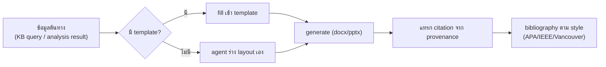
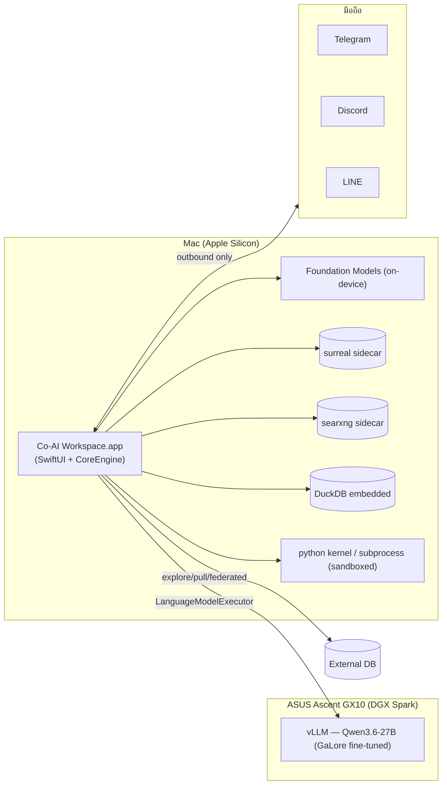

# หน้าจอ · คอนฟิก · ฮาร์ดแวร์ · NFR — M10–M13 และการติดตั้ง

> ส่วนหนึ่งของ [สถาปัตยกรรม Co-AI Workspace](../../ARCHITECTURE.md) — §14–§18
>
> เอกสารนี้ตอบว่า **ระบบคืออะไรและทำไม** ไม่ตอบว่าสร้างถึงไหนแล้ว (นั่นคือ [`docs/plan/`](../plan/README.md)) · กฎที่บังคับด้วยเครื่องอยู่ที่ [`RULES.md`](../../RULES.md)

---

## 14. M10 DocGen · M13 WorkspaceUI

### 14.1 DocGen

- Template: **upload ตัวอย่าง → auto-parse เป็น template** + Template Editor แก้เองทีหลัง
- **Cross-source corroboration แบบ tier-aware**: ≥2 source T1–T2 = เขียนแบบมั่นใจสูงได้ · ≥2 source T5 ยังอ่อน ต้องมี T1–T3 ยืนยันอย่างน้อยหนึ่งแหล่ง · ข้อความที่เคยผ่าน [Conflict Ledger](02-core-modules.md#116-conflict-ledger--เมื่อความรู้ขัดกัน) ขึ้นบัญชีใน Limitations อัตโนมัติ
- **Limitations อัตโนมัติ**: assumption ที่เดิมเป็น `agent_suggested` ขึ้นบัญชีในส่วน Limitations/Methods เอง ("นิยาม X อ้างอิงตาม [source, tier] เนื่องจาก proposal ไม่ได้ระบุ")
- ถ้าไฟล์ต้นฉบับไม่มี metadata ผู้เขียน/ปี → flag ให้ user เติมก่อน generate
- export `.bib` เป็น exporter เสริมได้ทีหลัง (ไม่กระทบ core)

### 14.2 WorkspaceUI — หน้าจอทั้งหมด

> **โครงหน้าจอถูกจัดใหม่ใน [§19.2](04-project-management.md#192-information-architecture--พื้นที่-และ-sub-tab-ของแต่ละพื้นที่)** — ตารางนี้ยังเป็นรายการเนื้อหาที่แต่ละหน้าต้องมี (ไม่มีข้อไหนถูกตัดทิ้ง) แต่การจัดวางจริงคือ 4 พื้นที่ (Chat · Plan · Workbench · Knowledge) + Settings/ข้อมูลระบบ และหน้า **Plan** เป็นของใหม่ที่ตารางนี้ยังไม่มี

| หน้า | เนื้อหา |
|---|---|
| **Chat** | multi-turn, multi-project, upload/paste รูปคุยตรง, conversation sidebar, เลือกคุยกับทีมหรือ specialist ตรงๆ, approval banner inline, โหมด 3 สวิตช์ |
| **Team View** *(ใหม่)* | เห็นทั้งทีมพร้อมกัน: ใครได้ assignment อะไร สถานะไหน QA ผ่านไหม — แก้/สั่ง rework/ยกเลิกราย assignment |
| **Live Monitor** | card ต่อ step (Thinking/In Progress/Completed) ยุบไว้ default กดขยายดู raw output, pause/stop รายตัว, รองรับ parallel — **หน้าเดียวทำได้ทั้ง session view และ global audit view** (filter เท่านั้น) |
| **Approvals** | รายการรออนุมัติพร้อม diff/preview |
| **Notebook** | SQL + Python cell |
| **DB Explorer** | รัน SurrealQL/SQL ตรงกับ KB store และ analysis store (full read/write — เป็น direct user action จึงไม่ผ่าน approval gate โดยตั้งใจ) |
| **Knowledge Base** | list เอกสาร, graph view ของ entity/relation, edit/delete, upload, **ดึงจาก URL**, **badge tier ความน่าเชื่อถือต่อเอกสาร**, export/import |
| **Conflict Ledger** *(ใหม่)* | รายการความรู้ที่ขัดกัน — Conflict Card พร้อมข้อความ verbatim ทั้งสองฝั่ง, ที่มา+tier, น้ำหนักที่ระบบประเมิน, ปุ่มตัดสิน (A / B / ทั้งคู่ในบริบทต่างกัน / ยังไม่ยุติ) + ประวัติคำตัดสินที่กลับได้ |
| **Models** *(ใหม่)* | จัดการโมเดล MLX — เลือกโหลดจาก HuggingFace (มี progress/resume) หรือชี้ไปโฟลเดอร์ที่มีอยู่, เตือนเมื่อขนาดเกิน RAM, ดูพื้นที่ที่ใช้, ลบ, ตั้ง default ต่อ tier |
| **Workflow Builder** | node-based editor + tool palette (drag-and-drop), save/load เป็น template, approval แทรกใน step card |
| **Templates** | template เอกสาร + upload ตัวอย่างเพื่อ auto-parse |
| **File Viewer/Editor** | `.md`/`.txt`/code (json/yaml/toml/csv/swift/py/js/ts/…) view+edit ในแอป; `.docx`/`.pptx`/`.pdf` view |
| **Processes** | ตาราง process ทั้งหมดข้ามทุก conversation + kill/pause |
| **Settings** | ทุกหมวดตาม [§15](#15-m11-config--secrets) |

**Accessibility เป็น requirement ตั้งแต่ต้น ไม่ใช่แก้ทีหลัง** — v1 ไม่มี `aria-*` เลยทั้ง frontend แล้วต้องไล่แก้ 16 ปุ่ม/8 ไฟล์ทีหลัง SwiftUI ให้ VoiceOver/keyboard navigation มาโดย default แต่ต้องใส่ `accessibilityLabel` ให้ปุ่ม icon-only ตั้งแต่เขียน + รองรับ Dynamic Type + ทดสอบ keyboard-only

### 14.3 App Intents (Feature ใหม่)

expose intent เช่น "ถาม workspace ว่า…", "สรุปความคืบหน้าโปรเจกต์ X", "เริ่มงานวิจัยเรื่อง Y" ให้เรียกจาก Siri/Shortcuts/Spotlight — ทดสอบผ่าน App Intents Testing framework (ไม่ต้อง UI automation)

---

## 15. M11 Config & Secrets

**Layering 4 ชั้น** (merge บนลงล่าง, override เฉพาะ key ที่ตั้งจริง): App Defaults → Global → Workspace/Project → Session Runtime (ไม่ persist)

| ส่วน | เก็บที่ | เหตุผล |
|---|---|---|
| Bootstrap (data dir, sidecar port, log level) | `~/Library/Application Support/CoAIWorkspace/bootstrap.plist` | ต้องอ่านได้ก่อน DB พร้อม (chicken-and-egg) |
| Setting อื่นทั้งหมด | ตาราง `settings` ใน SurrealDB | แก้ผ่าน GUI แล้ว sync ทันที, versioned, audit ง่าย |
| **Secrets** (bot token, API key, DB password) | **Keychain (Security framework)** | settings เก็บแค่**ชื่อ key** ที่ชี้ไป keychain entry ไม่เก็บค่าจริง · **ทางเดียวที่อ่านค่าคือ `SecretStore`** (P9.3) และมันตอบสามอย่าง: มี · ไม่มี · **อ่านไม่ได้** — อันสุดท้ายห้ามถูกรายงานว่า “ไม่มี” เพราะจะส่งคนไปพิมพ์คีย์ทับของเดิม · environment variable ยังใช้ได้สำหรับ CI และการรันจากเทอร์มินัล แต่ **`.app` ที่เปิดจาก Finder ไม่ได้รับ environment ของเชลล์** (วัดแล้ว) |

**หมวด Settings ที่ต้องมี**: Inference (endpoints, `kind: selfHosted|paid`, temperature/top_p/max_tokens, think toggle) · **Models** (โมเดล MLX ที่ติดตั้ง, แหล่งดาวน์โหลด, quota พื้นที่, default ต่อ tier) · **Budget** (เพดานต่อ request/session/วัน/เดือน ต่อ endpoint ที่คิดเงิน, ราคาต่อ token, พฤติกรรมเมื่อเกิน) · **Sources** (source registry ของ WebSearch — domain → tier → สาขา, เปิด/ปิดรายแหล่ง) · Team (role assignment, max fan-out, retry cap, definition-of-done defaults) · Orchestration (autonomy threshold, plan-only, clarify on/off) · Execution (sandbox policy, worktree threshold, resource quota) · Knowledge (scope default, dedup sensitivity, auto-index) · Analysis (connector, refresh schedule) · MCP servers · DB connectors · Skills · Plugins · Agents · Document (citation style, default template) · Channels · Appearance (theme, ภาษา ไทย/อังกฤษ)

**Validation/Migration**: validate ก่อนเขียนเสมอ (invalid = reject ที่ UI ทันที) · `requires_restart` flag ต่อ key · `schema_version` + migration function ตอน boot · export/import profile เป็น JSON (ไม่ export secrets)

---

## 16. M12 Observability & Eval

- **Span store เดียว**: ทุก step ของทุก agent จากทุก channel เขียน span เข้า SurrealDB (`span_id, parent_span_id, role, tool, status, started_at, ended_at, tokens`) — Live Monitor, Process view, audit ย้อนหลัง อ่านจากแหล่งเดียวกันหมด (แก้ปัญหา v1 ที่ LiveMonitor กับ ProcessManager เก็บคนละที่ คนละ data source)
- **Golden-task eval harness**: ชุด regression test ที่สะสมจาก log งานจริงที่สำเร็จ — รันตอน dev/CI ไม่ block runtime (Swift Testing รัน parallel by default)
- **Usage log**: skill/tool ไหนถูกใช้บ่อย สำเร็จ/ล้มเหลว — เป็นวัตถุดิบของ self-improvement loop ในอนาคต
- **MetricKit + Instruments**: hang, launch time, CPU/GPU/memory ของแอปจริง

---

## 17. Hardware Topology & Deployment

- **Sidecar 2 ตัว** (`surreal`, `searxng`) — bundle ใน `.app`, bind localhost, lifecycle จัดการโดยแอป, user ไม่ต้องติดตั้งเอง
- **ไม่ dispatch งาน execution ไป GX10 ใน v1** — GX10 เป็น inference server อย่างเดียว (ถ้าอนาคตต้องการ ให้เพิ่ม `ExecutionBackend` protocol ตอนนั้น ไม่ต้องรื้อ M9)
- **Single-user, ไม่มี auth/multi-tenant layer**

### 17.1 GX10 — วัดจากเครื่องจริงแล้ว (2026-08-15)

**ASUS Ascent GX10 ที่ `192.168.1.205:8000`** · vLLM **0.27.1** · **`unsloth/Qwen3.8-27B-NVFP4`** · `--max-model-len 32768` · `--kv-cache-dtype fp8` · `--enable-prefix-caching` · `--enable-chunked-prefill` · `--max-num-seqs 256` · **`--enable-auto-tool-choice --tool-call-parser qwen3_coder --reasoning-parser qwen3`**

> ผลวัดเต็มอยู่ที่ [E.19](../verification/02-e16-e30.md#e19-gx10-เสิร์ฟจริงแล้ว--วัดจาก-endpoint-เป็น-2026-08-15) · **section นี้เขียนจากสิ่งที่ endpoint ตอบ ไม่ใช่จากสเปกที่ตั้งใจ** — และสองอย่างที่ตั้งใจไว้ไม่ตรงกับที่รันจริง

| ธง | ความหมายต่อฝั่งแอป |
|---|---|
| `--max-num-seqs 256` | เพดานของ**เซิร์ฟเวอร์** ไม่ใช่เพดานที่ใช้ได้จริง — ดู "ความเร็ว" ข้างล่าง เพดานจริงของ [§22](06-organisation-and-ui.md#22-ai-organization--จากทีมเดียวเป็นองค์กร-m17-command) มาจากอัตราโทเคน ไม่ใช่จากจำนวนคิว |
| `--enable-prefix-caching` | prompt ที่ขึ้นต้นเหมือนกันถูกใช้ซ้ำ ⇒ **วาง system prompt กับรายการทูลให้คงที่ตอนต้น ส่วนที่เปลี่ยนไว้ท้าย** มีผลจริง และ**วัดผลได้จาก `/metrics`** (`prefix_cache_hits_total`) ไม่ต้องเทียบเวลาแล้วเดา |
| `--max-model-len 32768` | `/v1/models` **คืนค่านี้ตรง ๆ** ⇒ `ContextManager` อ่านจาก endpoint ได้จริง ([§5.6.1](02-core-modules.md#561-กลยุทธ์บริบทเต็มรูปแบบ--compaction-เป็นข้อเดียวในสี่ข้อ)) แทน `16_384` ที่เขียนตายไว้ · เพดานนี้**รวมขาออก** |
| **`--dtype bfloat16`** | **ค่าที่เปลี่ยนทุกอย่าง** — น้ำหนัก 27B ที่ bf16 ≈ 54 GB ต้องอ่านทั้งก้อนต่อหนึ่งโทเคน กับแบนด์วิดท์ราว 273 GB/s ⇒ **≈ 4.7 โทเคน/วินาที และวัดได้ตรงนั้นพอดี** นี่คือเพดานของฮาร์ดแวร์ ไม่ใช่การจูนที่ยังไม่ดี |

**คำสั่งรันอยู่ในรีโป ไม่ใช่ในบันทึกที่ไหนสักแห่ง**: [`scripts/gx10-serve.sh`](../../scripts/gx10-serve.sh) (รันบน GX10) กับ [`scripts/gx10-check.sh`](../../scripts/gx10-check.sh) (รันจากเครื่องไหนก็ได้) · ตัวรัน**ถาม vLLM ว่ามี parser ชื่ออะไรบ้างแล้วเลือก** แทนที่จะเดา เพราะสองครั้งที่ endpoint พังคือค่าธงผิดทั้งคู่ · ตัวตรวจ**ยืนยันผลที่ parse แล้ว ไม่ใช่ status code** เพราะการพังครั้งที่สองตอบ 200 ทุกครั้ง

**สองอย่างที่ต้องตั้งเพิ่มฝั่งเซิร์ฟเวอร์ ไม่ใช่แก้ที่แอป**:

1. **tool calling ปิดอยู่** — ทุกคำขอที่มี `tools` ได้ `400` เพราะขาด `--enable-auto-tool-choice` กับ `--tool-call-parser` · **นี่บล็อกทั้งระบบ**: specialist ทุกตัวทำงานด้วยการเรียกทูล
2. **โมเดลพิมพ์สมุดทดลงใน `content`** ปิดท้ายด้วย `</think>` โดยไม่มีแท็กเปิด (chat template ใส่ให้) — ต้องตั้ง `--reasoning-parser` ไม่งั้นทุกหน้าจอที่แสดงข้อความจะโชว์บทพูดกับตัวเองเป็นภาษาอังกฤษก่อนคำตอบ · **`response_format: json_schema` ไม่มีปัญหานี้** เพราะ guided decoding บังคับรูปแบบตั้งแต่โทเคนแรก

**สิ่งที่ได้มาโดยไม่ได้ออกแบบไว้ และดีกว่าที่ออกแบบ**: `/metrics` เปิดอยู่ ⇒ สถานะ **Busy** ของ [§22.6](06-organisation-and-ui.md#226-eoc-dashboard--command-tree-view) อ่าน `vllm:num_requests_running` / `num_requests_waiting` **จากเซิร์ฟเวอร์** ได้ ไม่ต้องให้ agent รายงานตัวเอง ซึ่งตรงกับกฎ §2.5 ที่ว่าคำกล่าวอ้างไม่ใช่การวัด

**ผลต่อ §22 ที่ต้องพูดตรง ๆ**: ที่ 4.7 โทเคน/วินาที **และสมุดทดกินโควตาเดียวกัน** ลูป agent หนึ่งเทิร์นที่มีหลายรอบทูลใช้เวลาเป็นนาที ⇒ องค์กรสามชั้นที่รันขนานกันจริงยังไม่ใช่ของที่ใช้ได้จนกว่าจะมี checkpoint ที่เล็กลง (NVFP4/FP8/AWQ) หรือโมเดลเล็กกว่าสำหรับบทบาทที่ไม่ต้องคิดหนัก — **นี่คือเหตุผลที่ [§9.2](02-core-modules.md#92-model-router-tier-0--05--1) จัด tier ตามผลเสียของความผิด ไม่ใช่ตามความสามารถ** และเหตุผลนั้นเพิ่งกลายเป็นตัวเลข

---

## 18. Non-Functional Requirements

| ด้าน | ข้อกำหนด |
|---|---|
| **Performance** | UI ต้องไม่ block ระหว่าง agent ทำงาน (ทุก long-running งานอยู่ใน actor/Task แยก) · งานที่ user รอดูผลทันที (label, classification) ไป Tier 0 · streaming ทุก response ที่ยาว |
| **Resource** | embedding/OCR → ANE/Metal · analysis → DuckDB vectorized (CPU multi-core) · reasoning หนัก → GX10 · จำกัด concurrent subprocess ตาม config |
| **Reliability** | conversation/task/checkpoint เป็น DB-first — ปิดแอปแล้วเปิดใหม่ต้องทำงานต่อได้ · sidecar crash → auto-restart · retry มี cap ทุกชั้น ไม่มี unbounded loop |
| **Security** | secrets ใน Keychain เท่านั้น · sandbox ทุก subprocess · ไม่มี channel ไหนข้าม hook chain · `install_package` ไม่ผ่าน shell · policy hard-constraint หยุดก่อน approve ได้ |
| **Auditability** | ทุก tool call มี span · ทุก decision ของ Analysis Plan มี origin tag · ทุกประโยคใน manuscript ที่มาจาก KB มี citation |
| **Maintainability** | 1 concern = 1 module ([§0.2](01-foundations.md#02-คำนิยาม-module--sub-module--feature--function)) · ห้าม type ซ้ำข้าม module · ห้าม logic ก็อปกัน 2 ที่ |
| **i18n** | UI ไทย/อังกฤษ · ตัดคำไทยถูกต้องใน chunking + BM25 |

---
