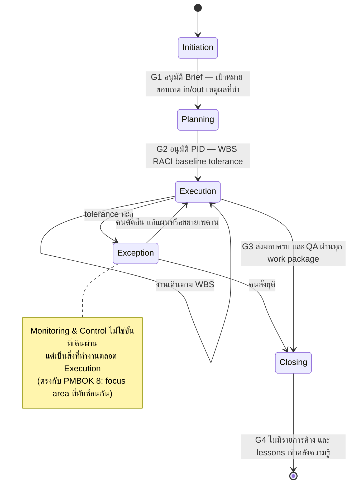
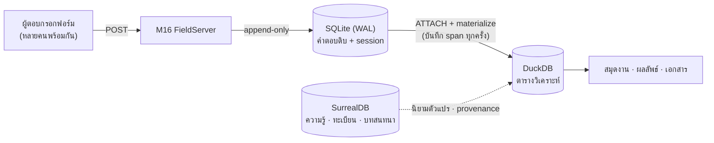

# Project Environment & Project Management — M14

> ส่วนหนึ่งของ [สถาปัตยกรรม Co-AI Workspace](../../ARCHITECTURE.md) — §19
>
> เอกสารนี้ตอบว่า **ระบบคืออะไรและทำไม** ไม่ตอบว่าสร้างถึงไหนแล้ว (นั่นคือ [`docs/plan/`](../plan/README.md)) · กฎที่บังคับด้วยเครื่องอยู่ที่ [`RULES.md`](../../RULES.md)

---

## 19. Project Environment & Project Management (M14 ProjectKit)

> **ที่มาของ section นี้**: จนถึง P9 `Scope.project` เป็นแค่**ป้ายกำกับ** — UI ยัง hardcode `ProjectID("default")` (`KnowledgeView.swift:360`) และไม่มีที่ไหนในระบบที่รู้ว่าโปรเจกต์หนึ่ง *เริ่มเมื่อไร ขอบเขตแค่ไหน ตอนนี้อยู่ขั้นไหน และปิดได้หรือยัง*
> ผลคือทีม AI ทำงานได้แต่ไม่มีใครตอบได้ว่า "งานนี้เสร็จตามอะไร" — section นี้ทำให้ **โปรเจกต์เป็น first-class** และยืมโครงควบคุมจากมาตรฐานสากลแทนที่จะคิดเอง

### 19.1 สองสภาพแวดล้อม: General กับ Project

ระบบแยกตั้งแต่หน้าแรก ไม่ใช่ให้ผู้ใช้เดาเองว่างานนี้ควรหนักแค่ไหน:

| | **General** | **Project** |
|---|---|---|
| ใช้กับ | คุย ถาม สั่งงานสั้น ที่ไม่ต้องบันทึกอะไรต่อ | งานหนึ่งชิ้นที่มีเป้าหมาย ขอบเขต และวันจบ |
| ทีม | ไม่มีทีม — คุยกับ agent ตัวเดียว (Tier ตาม router) | **สร้าง AI Team ต่อโปรเจกต์** (roster + DoD ต่อ role ตาม project type) |
| Knowledge scope | `central` อ่าน/เขียน | `project(id)` เป็น default · อ่าน `central` ได้ · `policy` บังคับเสมอ |
| Task Ledger | ไม่เขียน (conversation อย่างเดียว) | เขียนทุก assignment ผูกกับ work package |
| Lifecycle | ไม่มี | 5 ขั้น + stage gate ([§19.4](#194-project-life-cycle-5-ขั้น--stage-gate)) |
| Analysis store | ไม่มี schema ของตัวเอง | DuckDB schema + connector ต่อโปรเจกต์ |
| งบ/สิทธิ์ | ใช้ค่า global | เพดาน token/เงิน + autonomy + sandbox policy **ต่อโปรเจกต์** |
| ปิดงาน | ปิดแชตทิ้งได้ | ต้องผ่าน Closing gate ถึงจะปิดได้ ([§19.12](#1912-benefits--closing-gate)) |
| หน้าจอ | Chat · Knowledge | Chat · Plan · Workbench · Knowledge |

**Promotion — General → Project** (flow ที่เกิดจริงบ่อยที่สุด: คุยเล่นแล้วมันกลายเป็นงานจริง):
กด "ยกระดับเป็นโปรเจกต์" จากหน้า Chat → ระบบสร้าง `project` record, ย้าย conversation + ไฟล์ที่แนบ + เอกสารที่ ingest ไประหว่างคุยเข้า scope ใหม่, แล้ว**ร่าง Project Brief ให้จาก transcript** (เป้าหมาย/ขอบเขต/ข้อสมมติที่พูดไปแล้ว) ให้ผู้ใช้แก้ก่อนอนุมัติ — ไม่ใช่เริ่มจากฟอร์มเปล่า

**Invariant**: ไม่มี code path ไหนสร้าง work package / assignment / baseline ได้ในสภาพแวดล้อม General — `ProjectKit` ทุก entry point รับ `ProjectID` แบบ non-optional ตั้งแต่ signature

#### 19.1.1 ความสัมพันธ์ที่ถูกต้องของสองอย่างนี้ — และสิ่งที่ implementation วันนี้ยังไม่ตรง

> **แก้ความเข้าใจผิดที่สะสมมา** (2026-08-15): ตารางข้างบนอ่านเหมือน General กับ Project เป็น "โหมดสองโหมดที่สลับกัน" ซึ่งไม่ตรงกับที่มันควรเป็น และโค้ดก็เดินตามความเข้าใจผิดนั้น

| | ที่ถูก | implementation วันนี้ |
|---|---|---|
| **General** | **หน้าใช้งานทั่วไปที่อยู่ตลอด** — เหมือนหน้าแรกของเบราว์เซอร์ ไม่ใช่ "โปรเจกต์ชื่อ General" | ✅ ตรง (`Scope.central`) |
| **Project** | **เหมือนเปิดแท็บ** — แต่ละแท็บตั้งสภาพแวดล้อมของตัวเอง (คลัง ฐานข้อมูล งบ สิทธิ์ ทีม) และ**เปิดพร้อมกันได้ไม่จำกัด** | ❌ **เปิดได้ทีละโปรเจกต์เดียว** — `selection` เป็นค่าเดี่ยว และทั้งแอป rebuild ด้วย `.id(scope.storageKey)` ทุกครั้งที่สลับ |
| **ปิดโปรเจกต์** | กลายเป็น **archive** (อ่านได้ ไม่เขียนต่อ) และ**ความรู้ย้ายขึ้นส่วนกลาง**เพื่อเป็นฐานให้งานถัดไป | 🔶 มี closing gate + `LessonPublisher` แล้ว แต่ยังไม่ใช่การย้ายคลังทั้งก้อนตามที่อธิบายไว้ |

**สามข้อที่ต้องเป็นจริงเพื่อให้ "แท็บ" เป็นคำที่ใช้ได้จริง**:

1. **หลายโปรเจกต์เปิดพร้อมกัน และแต่ละอันจำสถานะของตัวเอง** — คนที่ทำงานวิจัยสองเรื่องพร้อมกันคือกรณีปกติ ไม่ใช่กรณีพิเศษ
2. **สภาพแวดล้อมไม่รั่วข้ามแท็บ** — คลัง ฐานข้อมูล งบ สิทธิ์ ทีม แยกกันจริง ซึ่ง `Scope` ทำได้อยู่แล้ว สิ่งที่ยังไม่มีคือหลายอินสแตนซ์พร้อมกัน
3. **การรันที่ค้างอยู่ไม่ตายเพราะสลับแท็บ** — วันนี้การสลับ rebuild หน้าจอทั้งหมด ซึ่งเป็นทางแก้ที่ถูกสำหรับ "อย่าโชว์ข้อมูลของโปรเจกต์เก่า" แต่ผิดสำหรับ "อย่าหยุดงานที่กำลังทำ"

**การปิดโปรเจกต์ = การย้ายความรู้ขึ้นส่วนกลาง ไม่ใช่แค่ติดป้ายว่าปิด** — และมันต้องเป็นการย้ายที่มีเงื่อนไข ไม่ใช่เทรวม:

| ย้ายขึ้น `central` | ไม่ย้าย |
|---|---|
| บทเรียนที่สรุปแล้ว (มีอยู่แล้ว — `LessonPublisher`, P12.7) | ข้อมูลผู้เข้าร่วมและสิ่งที่ระบุตัวตนได้ (M16 — เป็นเรื่องจริยธรรม ไม่ใช่เรื่องการจัดเก็บ) |
| คำตัดสินข้อขัดแย้งที่ประกาศเป็น central precedent | คำตัดสินที่ผู้ใช้เลือกให้อยู่ในขอบเขตโปรเจกต์ |
| เอกสารอ้างอิงภายนอกและ tier ของมัน | ร่างระหว่างทาง สมมติฐานที่ถูกปฏิเสธไปแล้ว |

**สิ่งที่ archive ต้องรับประกัน**: เปิดอ่านได้ทุกอย่างเหมือนเดิม แต่**เขียนไม่ได้** — เพราะโปรเจกต์ที่ปิดแล้วยังถูกแก้ได้ แปลว่ารายงานปิดโครงการอ้างถึงสิ่งที่เปลี่ยนได้ทีหลัง

### 19.2 Information Architecture — พื้นที่ และ sub-tab ของแต่ละพื้นที่

ปัญหาของ [§14.2](03-surfaces-and-ops.md#142-workspaceui--หน้าจอทั้งหมด) เดิม: หน้าจอ 14 หน้าวางแบนเท่ากันหมด ทั้งที่จริงมันแบ่งตาม**วิธีทำงาน**ได้ชัด — สั่งให้ทำ / วางแผนและติดตาม / ลงมือเอง / เก็บข้อมูลจากคนอื่น / จัดการความรู้

| พื้นที่ | General | Project | Sub-tab | ยุบหน้าเดิมเข้ามา |
|---|---|---|---|---|
| **Chat** — สั่งการ | ✅ | ✅ | ประวัติบทสนทนา (แถบซ้าย) · บทสนทนา · จอเฝ้าทีม+โปรเซส (แถบขวา) | Chat · Live Monitor · Approvals · Processes |
| **Plan** — วางแผน · กำกับ · ตั้งทีม | — | ✅ | ภาพรวม · WBS+Gantt · Kanban · **ทีม &amp; RACI** · ทะเบียน · รายงาน | Team View *(ส่วนตั้งค่า)* + *(ใหม่ทั้งหมด)* |
| **Workbench** — ทำงานกับข้อมูล | ✅ | ✅ | **เก็บข้อมูล** · ฐานข้อมูลภายใน · ฐานข้อมูลภายนอก · สคริปต์+คอนโซล · ผลลัพธ์ | Notebook · DB Explorer · File Viewer/Editor · Templates · Workflow Builder + M15/M16 |
| **Knowledge** — ความหมายและที่มา | ✅ | ✅ | เอกสาร · กราฟ · ข้อขัดแย้ง · แหล่งและ tier | Knowledge Base · Conflict Ledger · Sources |
| *(นอกพื้นที่งาน)* | ✅ | ✅ | — | Settings · Models · Budget · Observability/Audit · About |

**4 พื้นที่ = 4 คำถามที่ต่างกัน** — Chat: *จะให้ใครทำอะไร* · Plan: *ตกลงกันว่าอะไรคือเสร็จ และใครรับผิดชอบ* · Workbench: *ข้อมูลอยู่ที่ไหนและทำอะไรกับมัน* · Knowledge: *อะไรจริง และรู้ได้ยังไง*

**Workbench เรียง sub-tab ตามเส้นทางของข้อมูล ไม่ใช่ตามชนิดเครื่องมือ**:

```
เก็บเข้ามา  →  เก็บไว้ (ภายใน · ภายนอก)  →  วิเคราะห์  →  นำเสนอ
เก็บข้อมูล      ฐานข้อมูลภายใน/ภายนอก        สคริปต์+คอนโซล    ผลลัพธ์
```

- **"เก็บข้อมูล" อยู่ใต้ Workbench ไม่ใช่แท็บบนสุด** — มันคือต้นทางของเส้นทางเดียวกัน การแยกไว้ข้างนอกทำให้คนต้องกระโดดข้ามแท็บระหว่างสร้างฟอร์มกับดูว่าข้อมูลที่ได้หน้าตาเป็นยังไง ซึ่งเป็นสองอย่างที่ทำติดกันตลอด
- **ตัวแก้ไฟล์และโค้ดอยู่ในแท็บ "สคริปต์+คอนโซล"** — โค้ดที่เขียนกับสคริปต์ที่รันคือของสิ่งเดียวกัน ไม่ต้องแยกแท็บ
- **General เห็น Workbench แค่ 3 sub-tab**: ฐานข้อมูลภายนอก · สคริปต์+คอนโซล · ผลลัพธ์ — ไม่มีการเก็บข้อมูล (ต้องมีจริยธรรมและขอบเขตซึ่งเป็นของโปรเจกต์) และไม่มีฐานข้อมูลภายใน (มีแค่ scratch ที่ไม่ผูกกับใคร)

**สถานะการทำ (P10.12, 2026-08-14)** — แอปจัดเป็น 4 พื้นที่ + **ระบบ** แล้ว (⌘1–⌘5) และ**สลับ General/Project ย้ายไปอยู่หัวแอป** แทนที่จะอยู่ในแถบซ้ายของ Plan (เมื่อก่อนต้องออกจากงานที่ทำอยู่ไปเปลี่ยนว่ากำลังทำโปรเจกต์ไหน) · หน้าจอเดิมทุกหน้าใน [§14.2](03-surfaces-and-ops.md#142-workspaceui--หน้าจอทั้งหมด) มีแถวใน `IAInventory` บอกว่าไปอยู่พื้นที่ไหน sub-tab ไหน และ**สถานะจริง** (ครบ / บางส่วน / ยังไม่ได้ทำ + เลข task) — ดูได้ในแอปที่ **ระบบ → ผังหน้าจอ** และ `check.sh` จะแดงถ้ามีหน้าใน §14.2 ที่ไม่มีแถว (กฎ R13)

**สองข้อที่ต่างจากตารางข้างบนโดยตั้งใจ**:

- **Knowledge มี 3 sub-tab ไม่ใช่ 4** — กราฟ entity/relation ยังแสดงเป็นรายการต่อส่วนอยู่ใน "เอกสาร" ยังไม่ใช่ภาพกราฟที่แยกแท็บได้ · แยกแท็บว่างไว้จะอ่านว่ามีของ
- **Plan ยังเห็นได้ใน General** แต่ขึ้นว่าไม่มีแผน + รายการโปรเจกต์ให้เลือก/สร้าง — เพราะการสร้างโปรเจกต์ต้องเกิดที่ไหนที่หนึ่ง และการซ่อนพื้นที่ทั้งพื้นที่ทำให้ทางเข้านั้นหาย

#### 19.2.1 ประวัติบทสนทนา — ทั้งสองสภาพแวดล้อม

แถบซ้ายของหน้า Chat: รายการบทสนทนาเรียงตามเวลาแก้ไขล่าสุด · ค้นด้วยข้อความเต็ม (BM25 ตัวเดียวกับ KB จึงค้นภาษาไทยได้จริง) · ปักหมุด · เปลี่ยนชื่อ (AI ตั้งชื่อให้จากเทิร์นแรก แก้ได้) · เปิดกลับมาคุยต่อได้ทุกอัน

| | General | Project |
|---|---|---|
| ขอบเขตที่เห็น | บทสนทนาทั้งหมดของ General | เฉพาะของโปรเจกต์นี้ + ปุ่มค้นข้ามโปรเจกต์ |
| ที่เก็บ | `conversation` ใน SurrealDB (**มีอยู่แล้ว**) | เหมือนกัน + คอลัมน์ scope ที่มีอยู่แล้ว |
| สิ่งที่ติดกลับมาด้วยตอนเปิด | โมเดล/tier ที่ใช้ตอนนั้น, ไฟล์ที่แนบ, span ของ tool call | เพิ่ม: work package ที่บทสนทนานั้นแตะ |

#### 19.2.2 Chat ต้องต่ออินเทอร์เน็ตได้ในทั้งสองสภาพแวดล้อม

`web_search` + `fetch_page` + `ingest_url` เดิน hook chain เส้นเดิม ไม่มีทางลัด — สิ่งที่ต่างคือปลายทางของสิ่งที่ค้นเจอ: General ingest เข้า `central`, Project ingest เข้า `project(id)`

> **สถานะวันนี้ (P13 ครบแล้ว · 2026-08-14)**: ชั้นค้นเว็บทั่วไป (T5) **ทำงานจริงในแอปที่ sandbox แล้ว** ผ่านสะพาน `WKWebView` ([§1.2.1](01-foundations.md#121-สะพานค้นเว็บด้วย-wkwebview-แบบไม่มีหน้าต่าง-p131)) — ค้นได้ผลจริงและ "อ่านหน้านี้" ได้บทความเข้าท่อ `Readability` เส้นเดิม
> **สิ่งที่การเปิด T5 *ไม่* ทำ**: กติกา corroboration ของ [§14.1](03-surfaces-and-ops.md#141-docgen) ไม่ผ่อนเพราะค้นง่ายขึ้น — T5 สองแหล่งยังถือว่าอ่อน และตั้งแต่ P13.2 กฎนี้เป็น *ประตูจริง* ที่ QA ของ Researcher เรียกใช้ ไม่ใช่ย่อหน้าในรายงาน

#### 19.2.3 แถบสถานะเป็นแดชบอร์ดที่กดได้ ไม่ใช่ป้ายบอกสถานะ

ทุกช่องบนแถบเปิด popover ที่มีทั้ง *ที่มา* และ *ปุ่มที่ทำอะไรได้จริง* — ไม่ใช่ตัวเลขที่ต้องไปหาความหมายเอาเองในหน้าอื่น:

| ช่อง | กดแล้วเห็น | ทำอะไรได้ตรงนั้น |
|---|---|---|
| **ขั้น** | เงื่อนไขของ gate ถัดไป ข้อไหนผ่านแล้ว/ค้าง | กดข้อที่ค้างเพื่อกระโดดไปที่ต้นเหตุ |
| **เวลา** | เส้นเวลาที่ใช้ไปเทียบ p50–p90 ของงานชนิดเดียวกัน | ขยายกรอบ (บันทึกเป็นการตัดสินใจ) |
| **งบ** | แยกตาม role และตามทูล + กราฟการเผาไหม้ของขั้นนี้ | ปรับเพดานขั้นนี้ · สลับ tier ของ role |
| **คุณภาพ** | งานที่ rework แล้วกี่รอบ พร้อมเหตุผลจาก QA ทุกรอบ | สั่ง rework เพิ่ม · ผ่อน DoD (บันทึกเป็นการตัดสินใจ) |
| **ขอบเขต** | ส่วนต่างจาก baseline ล่าสุดแบบรายใบ | เปิดคำขอเปลี่ยนแปลง |
| **Exception** | Exception Report เต็ม | ตัดสินตรงนั้น — ไม่ต้องย้ายหน้า |

#### 19.2.4 Plan แก้ได้ตรงนั้น — แต่แก้สิ่งที่ *ตั้ง* ไม่ใช่สิ่งที่ *วัด*

หน้า Plan ต้องแก้ได้ inline ทุกช่อง แต่มีเส้นแบ่งที่ต้องชัดตั้งแต่ออกแบบ:

| แก้ได้ตรงนั้น (สิ่งที่คนตั้ง) | แก้ไม่ได้เพราะมันคือผลการวัด |
|---|---|
| เพิ่ม/ลบ/เปลี่ยนชื่อ/จัดลำดับใบใน WBS · เกณฑ์ DoD ต่อใบ | แถบเวลาจริง (มาจาก span ที่เกิดขึ้นแล้ว) |
| เส้นพึ่งพา (ลากเชื่อม/ตัด) | critical path (คำนวณจากเส้นพึ่งพา) |
| ช่อง RACI (dropdown ต่อช่อง) | ประมาณการ p50–p90 (มาจากประวัติงานชนิดเดียวกัน) |
| ค่า tolerance ทั้ง 6 แกน · ขอบเขต in/out · ข้อสมมติ | ตัวเลขในแผงสุขภาพ 7 แกน |
| ทะเบียนทั้ง 5 (เพิ่ม/แก้/ปิดรายการ) | สถานะการ์ด Kanban ที่ยังไม่ผ่าน QA |

**ลากแถบ Gantt เพื่อเปลี่ยนวันจบไม่ได้โดยตั้งใจ** — วันจบของงาน AI ไม่ใช่สิ่งที่ตกลงกันแล้วเกิดขึ้น มันคือผลของลำดับงานกับความเร็วจริง การลากมันคือการแก้เครื่องวัด อยากให้จบเร็วขึ้นต้องแก้สิ่งที่มันขึ้นกับ: ตัดขอบเขต ลดเส้นพึ่งพา หรือเปลี่ยน tier ของโมเดล

**แก้หลัง baseline = คำขอเปลี่ยนแปลง และ UI พูดตรง ๆ ตอนแก้** — ไม่บล็อก ไม่เตือนทีหลัง แต่ขึ้นแถบตรงนั้นว่า *"การแก้นี้จะกลายเป็นคำขอเปลี่ยนแปลง #4 · กระทบ: ขอบเขต +1 ใบ, เวลา +0.5 วัน, เงิน +฿40"* พร้อมปุ่มยืนยัน/ยกเลิก ([§19.11](#1911-registers--change-control))

#### 19.2.5 "ตั้งค่าทีม" กับ "เฝ้าดูทีม" เป็นคนละที่โดยตั้งใจ

สองอย่างนี้ถูกใช้คนละจังหวะและคนละความถี่ — รวมไว้หน้าเดียวแล้วหน้าที่ใช้ทุกนาทีจะถูกกลบด้วยหน้าที่ใช้เดือนละครั้ง:

| | อยู่ที่ไหน | ใช้ตอนไหน | มีอะไร |
|---|---|---|---|
| **เฝ้าดูทีม** | แถบขวาของ **Chat** | ตลอดเวลาที่ทีมทำงาน | ใครถือ work package ไหน · rework กี่รอบ · โปรเซสที่รันอยู่ · กดหยุดรายตัว |
| **ตั้งค่าทีม** | sub-tab **ทีม &amp; RACI** ใน **Plan** | ตอนตั้งโปรเจกต์ และตอนปรับหลังเจอปัญหา | 6 ชั้นของแต่ละ agent ([§21.1](05-research.md#211-agent--6-ชั้นที่ประกาศไว้-ไม่ใช่-prompt-ก้อนเดียว)) · tool grant + proficiency · knowledge view · DoD ต่อบทบาท · ตาราง RACI ต่อใบงาน · หมวกที่คนถือ |

**ทำไมอยู่ใต้ Plan ไม่ใช่ Settings** — การกำหนดว่าใครรับผิดชอบอะไรคือ practice "Organization" ของ PRINCE2 และเป็นเงื่อนไขของ G2 ([§19.4](#194-project-life-cycle-5-ขั้น--stage-gate)) มันคือการวางแผน ไม่ใช่การตั้งค่าเครื่องมือ — และมันอยู่ติดกับตาราง RACI ที่ใช้ข้อมูลชุดเดียวกันพอดี

---
#### 19.2.6 ทิศทางหน้าตา: สามเสา (อ้างจาก Claude Code) *(ตัดสินใจ 2026-08-13)*

หน้าตาที่ใช้เป็นเข็มทิศคือ Claude Code เดสก์ท็อป — **ไม่ใช่เพราะสวย แต่เพราะโครงมันแก้ปัญหาที่เราเจอตอนขับหน้าจอเองพอดี**: หน้าที่ยาวจนต้องเลื่อนผ่านทุกอย่าง และของสำคัญ (ประตูขั้น, ข้อยกเว้น) จมอยู่ล่างสุด

| เสา | ของเรามีอะไรอยู่ในนั้น | กฎที่ยืมมา |
|---|---|---|
| **ซ้าย — ที่อยู่** | สลับ General/Project + รายการบทสนทนาของโปรเจกต์นั้น ([§19.2.1](#1921-ประวัติบทสนทนา--ทั้งสองสภาพแวดล้อม)) | จัดกลุ่มตาม workspace แล้วเรียงบทสนทนาใต้กลุ่ม ไม่ใช่รายการแบนที่ปนกัน · ปุ่ม "+" อยู่ที่หัวกลุ่ม เพราะการสร้างของใหม่เกิดในบริบทของกลุ่มเสมอ |
| **กลาง — งานที่ทำอยู่** | บทสนทนา หรือ sub-tab ของพื้นที่นั้น | คอลัมน์เดียว ความกว้างจำกัด · เครื่องมือของหน้านั้นเป็นไอคอนเล็กบนหัวเรื่อง ไม่ใช่แถบเครื่องมือเต็มความกว้าง |
| **ขวา — หลักฐาน** | เปิดเมื่อต้องการ: span ของเทิร์น · หลักฐานของใบงาน · diff ของไฟล์ที่ agent แก้ · รายงานที่เพิ่งออก | **แผงขวาคือ "ของที่พิสูจน์" ไม่ใช่ "ของที่ตั้งค่า"** — ใน Claude Code มันคือ working-tree diff; ของเราคือหลักฐานและ span ซึ่งเป็นคำตอบของ "เชื่อได้เพราะอะไร" · ยุบเป็นรายการไฟล์/รายการ span ได้เมื่อของเยอะ |

**สองอย่างที่ยืมมาแล้วสำคัญกับเรามากกว่าต้นฉบับ**:

1. **แถบตัดสินใจลอยเหนือช่องพิมพ์** — ใน Claude Code คือแถบ `+8,429 −88 · Create PR`: สิ่งที่ระบบอยากให้ตัดสิน อยู่ตรงที่มือกำลังอยู่ ไม่ใช่ในหน้าอื่น ของเราคือ **Exception Report · ประตูขั้นที่พร้อมผ่าน · คำขอเปลี่ยนแปลงที่รอคน · HITL** — ตรงกับ [§19.2.3](#1923-แถบสถานะเป็นแดชบอร์ดที่กดได้-ไม่ใช่ป้ายบอกสถานะ) ที่ว่าทุกช่องต้องกดได้และเขียน decision record
2. **ตัวควบคุมโหมดอยู่ในช่องพิมพ์** — `Auto · Opus 5 · High` เป็นชิปเล็กใต้ช่องข้อความ ของเราคือ **tier ที่จะใช้ · ใบงานที่กำลังทำ ([§19.2.3](#1923-แถบสถานะเป็นแดชบอร์ดที่กดได้-ไม่ใช่ป้ายบอกสถานะ)) · ระดับ autonomy** — ทั้งสามอย่างเปลี่ยนความหมายของเทิร์นถัดไป จึงต้องเห็นตอนพิมพ์ ไม่ใช่ในหน้าตั้งค่า

**ที่ไม่ยืม**: Claude Code เป็นเครื่องมือของคนคนเดียวทำงานกับ repo เดียว จึงไม่มีอะไรเทียบกับ WBS/Gantt/ทะเบียน 5 ตัว — โครงสามเสาใช้กับ **Chat** ได้ตรง ๆ แต่ **Plan** ยังต้องเป็นพื้นที่ที่มี sub-tab ของตัวเอง ([§19.2](#192-information-architecture--พื้นที่-และ-sub-tab-ของแต่ละพื้นที่)) เพราะตารางกับต้นไม้ไม่ยัดลงคอลัมน์กลางที่แคบ

---

### 19.3 มาตรฐาน 4 ฉบับ — เอามาใช้ตรงไหน และไม่อ้างอะไร

ทั้ง 4 ฉบับเขียนไว้สำหรับ**องค์กรที่มีคนรับผิดชอบ** ไม่ได้เขียนไว้สำหรับทีม AI — เอามาใช้ได้ที่ *โครงควบคุมและ artifact ที่ต้องมี* ไม่ใช่ที่ *คำรับรอง*

| มาตรฐาน | สิ่งที่ยืมมา | ลงมาเป็นอะไรในระบบ |
|---|---|---|
| **PRINCE2 7 (2023)** — 7 principle / 7 practice / 7 process | **โครงควบคุม**: manage by stages, **manage by exception**, product-based planning, continued business justification, defined roles | Stage gate ([§19.4](#194-project-life-cycle-5-ขั้น--stage-gate)) · Tolerance/Exception ([§19.10](#1910-tolerance--exception--กลไกที่ทำให้-autonomy-มีความหมาย)) · WBS แบบผลิตภัณฑ์ ([§19.6](#196-scope--wbs-product-based)) · Business case ที่ตรวจซ้ำทุกขั้น |
| **PMBOK Guide 8 (พ.ย. 2025)** — 6 principle / 7 performance domain / 5 focus area / 40 process | **5 focus area = 5 ขั้นของ life cycle** ที่โจทย์ต้องการพอดี · **7 performance domain = แกนวัดสุขภาพโครงการ** | ขั้น Initiating→Closing ([§19.4](#194-project-life-cycle-5-ขั้น--stage-gate)) · แผงสุขภาพ 7 แกน: Governance · Scope · Schedule · Finance · Stakeholders · Resources · Risk |
| **ISO 21502:2020** — clause 6 integrated practices, clause 7 management practices | **เช็กลิสต์ความครบ**: planning, benefit, scope, resource, schedule, cost, risk, issue, change control, quality, stakeholder, communication, org change, reporting, information/documentation, procurement, lessons learned | `Practice` enum 17 ตัว → ทุกโปรเจกต์ต้อง**มีของจริงหรือมี tailoring record ว่าตัดออกเพราะอะไร** ([§19.16](#1916-conformance-matrix)) |
| **IPMA ICB4** — 28 competence element (Perspective 5 · People 10 · Practice 13) | **คำศัพท์สำหรับนิยามบทบาทและขีดจำกัดของมัน** — ICB รับรอง *คน* ไม่ใช่โครงการหรือซอฟต์แวร์ | agent manifest ประกาศ Practice element ที่บทบาทนั้นครอบคลุม · **People/Perspective element เป็นของมนุษย์เสมอ** ไม่มี agent ตัวไหนอ้าง |

**สิ่งที่ระบบนี้ไม่อ้าง**: ไม่ใช่ certified/compliant กับฉบับไหน · ไม่ทดแทน Project Manager ที่เป็นคน · ไม่มี agent ตัวใดถือ accountability ตามความหมายของมาตรฐาน (ดู [§19.5](#195-organization--ใครถือหมวกอะไร))

**Tailoring ต้องบันทึก ไม่ใช่เงียบ** — ทั้ง 4 ฉบับอนุญาตให้ตัดแต่งได้ แต่ต้องบอกว่าตัดอะไรเพราะอะไร ระบบจึงบังคับ `tailoring_record` ต่อโปรเจกต์: practice ไหนไม่ใช้ + เหตุผล + ใครตัดสิน — ปิดโปรเจกต์ไม่ได้ถ้ามี practice ที่ไม่มีทั้งของจริงและ record

### 19.4 Project Life Cycle 5 ขั้น + Stage Gate



| ขั้น | เข้าได้เมื่อ | ของที่ต้องได้ | ออกได้เมื่อ (gate) | ใครอนุมัติ |
|---|---|---|---|---|
| **Initiation** | สร้างโปรเจกต์ | Project Brief: เป้าหมาย, **ขอบเขต in/out**, เหตุผลที่ทำ, ผู้มีส่วนได้เสีย, ความเสี่ยงระดับสูง, project type | ขอบเขตมีทั้ง in และ out (ห้ามว่างข้างใดข้างหนึ่ง) + เกณฑ์ความสำเร็จวัดได้ | **คน** (Executive) |
| **Planning** | ผ่าน G1 | PID: WBS, RACI, ตารางงาน + dependency, baseline, tolerance 6 แกน, register ตั้งต้น, แผนคุณภาพ (DoD ต่อ deliverable) | ทุก work package มี DoD + มี R และ A ครบ + งบต่อขั้นตั้งแล้ว | **คน** |
| **Execution** | ผ่าน G2 | deliverable ตาม WBS + evidence ต่อชิ้น | ทุก work package สถานะ done และผ่าน QA | ระบบตรวจ + คนรับรอง |
| **Monitoring & Control** | ตลอด Execution | highlight report, tolerance status, exception report | *(ไม่ใช่ขั้นที่ออก — เป็นวงตรวจที่วิ่งคู่ไป)* | — |
| **Closing** | ผ่าน G3 หรือคนสั่งยุติ | รายงานปิดโครงการ, benefit review, lessons learned, การจัดการข้อมูล/ไฟล์ที่เหลือ | **ไม่มีรายการค้าง** — ไม่มี work package เปิด, ไม่มี conflict ค้าง, ไม่มี assumption ที่ยังไม่ยืนยัน, ไม่มี practice ที่ไม่มี tailoring record | **คน** |

**Gate เป็น hook ตัวใหม่ในโซ่เดิม ไม่ใช่โซ่ใหม่** — hook chain ปัจจุบันคือ Critic → Risk → Policy → HITL ([§5.3](02-core-modules.md#53-hook-chain-gate-sub-module)) เพิ่ม **StageGate** ไว้ก่อน Risk: tool ที่มี side effect ถูกปฏิเสธถ้าโปรเจกต์อยู่ขั้น `initiation` หรือ `closed` และถูกจำกัดชุดถ้าอยู่ `planning` (อ่าน/ค้น/ร่างได้ · เขียนไฟล์/รันคำสั่ง/แก้ข้อมูลไม่ได้) — เหตุผลเดียวกับที่ v1 เจ็บมาแล้ว: ถ้ากติกาไม่อยู่ในเส้นทางบังคับ มันจะถูกข้าม

### 19.5 Organization — ใครถือหมวกอะไร

ทีม 6 บทบาทที่มีอยู่แล้ว ([§2](01-foundations.md#2-ai-team-model--แกนหลักของ-v2)) แมปกับ PRINCE2 organization ได้เกือบพอดี — ที่ขาดคือฝั่งที่**ต้องเป็นคน**:

| PRINCE2 | ในระบบนี้ | บังคับยังไง |
|---|---|---|
| Executive / Senior User | **มนุษย์เท่านั้น** — เจ้าของ business case, อนุมัติทุก gate, ตัดสินทุก exception | `BoardRole` เป็น type คนละตัวกับ `Role` (enum ของ agent) — ไม่มี initializer ที่รับ `Role` ได้ ⇒ compiler ปฏิเสธการมอบหมวก Executive ให้ agent |
| Project Manager | **Team Lead** | มีอยู่แล้ว — tool set ไม่มี `run_shell` ([§2.2](01-foundations.md#22-กติกาของหัวหน้าทีม-supervisor-contract)) |
| Team Manager / ผู้ผลิตงาน | Researcher · Analyst · Engineer · Writer | มีอยู่แล้ว (actor แยก, คืนแค่ `Deliverable`) |
| Project Assurance | **Reviewer (QA)** — อิสระจากผู้ทำ | มีอยู่แล้ว: QA ตรวจด้วยหลักฐาน ไม่ใช่คำกล่าวอ้าง ([§2.5](01-foundations.md#25-qa-loop--ตรวจตามมาตรฐาน)) |
| Project Support | ตัวระบบ — ledger, registers, span store | ไม่ใช่ agent โดยตั้งใจ (ไม่มีอะไรให้ตัดสิน) |

**Senior Supplier ไม่มีใครถือ** — ในบริบทนี้ "ผู้จัดหา" คือโมเดลและ endpoint ซึ่งไม่ใช่คู่สัญญาที่รับผิดชอบอะไรได้ บันทึกไว้เป็น tailoring record ถาวรของทุกโปรเจกต์ แทนที่จะแกล้งมีให้ครบ

### 19.6 Scope & WBS (product-based)

**Scope statement** บังคับ 5 ช่อง — ว่างไม่ได้: `inScope[]` · `outOfScope[]` · `assumptions[]` · `constraints[]` · `acceptanceCriteria[]`
ช่อง `outOfScope` บังคับให้มีอย่างน้อย 1 ข้อโดยตั้งใจ: ขอบเขตที่ไม่เคยเขียนว่า "ไม่ทำอะไร" คือขอบเขตที่จะบานทุกครั้ง — และมันคือช่องที่ทำให้ agent ปฏิเสธงานนอกขอบเขตได้โดยมีที่อ้าง

**WBS แตกตามผลิตภัณฑ์ ไม่ใช่ตามกิจกรรม** (product-based planning ของ PRINCE2) — ใบสุดท้ายของต้นไม้คือ *ของที่ส่งมอบได้* ไม่ใช่ *สิ่งที่ต้องทำ* เหตุผลเชิงระบบ: ของที่ส่งมอบได้เท่านั้นที่ QA ตรวจได้ด้วยหลักฐาน

```
1  บทความวิจัยฉบับส่งวารสาร            ← deliverable ราก
   1.1  ชุดข้อมูลที่ทำความสะอาดแล้ว
        1.1.1  สคริปต์ดึงข้อมูล + log การรัน       ← work package (ใบ)
        1.1.2  รายงานการทำความสะอาด + rule ที่ใช้  ← work package (ใบ)
   1.2  ผลการวิเคราะห์ที่ผ่าน StatGate
   1.3  ต้นฉบับ 5 บท + bibliography
```

| กฎของ WBS | บังคับยังไง |
|---|---|
| ใบทุกใบ = 1 work package = **1 `Assignment`** | `Assignment.acceptanceCriteria` เป็น non-optional อยู่แล้ว ⇒ ใบที่ไม่มี DoD สร้างไม่ได้ตั้งแต่ type |
| 100% rule — ลูกรวมกันต้องครอบคลุมพ่อพอดี ไม่ขาดไม่เกิน | ตรวจตอนปิด G2: node ที่ไม่มีใบ = แผนไม่ครบ, ใบที่ไม่มีพ่อ = งานนอกขอบเขต ⇒ gate ไม่ผ่าน |
| ใบทุกใบผูกกับข้อใดข้อหนึ่งใน `inScope` | field `scopeRef` บังคับ ⇒ ตรวจ scope creep ได้ด้วยเครื่อง ไม่ใช่ด้วยสายตา |
| การเพิ่มใบหลัง baseline = change request | ผ่าน change control ([§19.11](#1911-registers--change-control)) ไม่ใช่แก้เงียบ ๆ |

Task Ledger ที่มีอยู่ ([§5.7](02-core-modules.md#57-task-ledger-sub-module)) เก็บ `scope_kind` + `project_id` อยู่แล้ว — เพิ่ม `work_package_id` แล้ว **แผน (WBS) กับ ผลการเดิน (ledger) ผูกกันได้ทั้งสองทาง**: ดูจากแผนว่างานนี้ใครทำถึงไหน หรือดูจาก ledger ว่ารอบนี้ไปโดนแผนข้อไหน

### 19.7 Gantt — เวลาของทีม AI ไม่ใช่ "คน-วัน"

**ปัญหาที่ต้องพูดตรง ๆ**: Gantt ของงานคนวัดเป็นคน-วัน แต่ทีม AI ไม่มีหน่วยนั้น ถ้าให้โมเดลเดา "งานนี้ใช้ 3 วัน" ตัวเลขนั้นคือเรื่องแต่ง — และ Gantt ที่สร้างจากตัวเลขแต่งคือแผนภูมิที่ดูดีแล้วผิดทุกวัน

แผนภูมิของที่นี่จึงยืนบน 3 แกนที่**วัดได้จริงจากของที่ระบบเก็บอยู่แล้ว**:

| แกน | มาจากไหน | ใช้ตอบอะไร |
|---|---|---|
| **ลำดับและการพึ่งพา** | `dependency` ใน WBS (finish-to-start เป็นหลัก) | critical path — งานไหนที่ช้าแล้วทั้งโครงการช้าตาม |
| **เวลาจริงที่ใช้ไป** | span store ที่มีอยู่ ([§16](03-surfaces-and-ops.md#16-m12-observability--eval)) รวมต่อ work package | แถบ actual บน Gantt — ของจริง ไม่ใช่ประมาณการ |
| **ประมาณการล่วงหน้า** | สถิติจาก span ระดับ assignment ของ **deliverableType เดียวกัน** แสดงเป็นช่วง p50–p90 | แถบ forecast — และเป็นช่วงเสมอ ไม่ใช่ตัวเลขเดียว |

**หน่วยของประชากรคือ assignment ทั้งงาน ไม่ใช่รอบเดียวและไม่ใช่เทิร์น** (P10.15) — span ของ assignment ครอบทุกรอบ **รวมรอบที่ต้องแก้** เพราะค่าประมาณที่นับเฉพาะงานที่ผ่านตั้งแต่แรกคือแผนที่ใช้ได้เฉพาะวันที่ไม่มีอะไรพลาด · งานที่ escalate นับเป็น `failed` และงานที่คนยกเลิกนับเป็น `cancelled` ⇒ ไม่เข้าประชากร แต่ **ต้องปิด span เสมอ** เพราะ span ที่ค้าง `running` ไม่มี `ended_at` จึงหลุดออกจากทุก query ระยะเวลาเงียบ ๆ — ซึ่งจะตัดเคสที่ช้าที่สุดออกไปพอดี · แถบพก `basis` ติดไปด้วยเสมอ (`ScheduleEstimate.Basis`) เพราะประโยคบนหน้าจอที่บอกว่าแถบทำจากอะไร **ผิดมาแล้วสองครั้ง** ทั้งสองครั้งเพราะคำอธิบายอยู่ที่หน้าจอ ส่วนประชากรอยู่คนละโมดูล

โปรเจกต์แรก ๆ ที่ยังไม่มีประวัติ: แถบ forecast แสดงเป็น "ยังไม่มีข้อมูล" ตรง ๆ **ห้ามเดาแทน** — พอมีงานปิดไปพอสมควรค่อยมีแถบขึ้นเอง นี่คือการใช้ประโยชน์จาก span ที่ [README §4](../../README.md) บอกว่าเป็น "วัตถุดิบของสิ่งที่ยังไม่ได้ทำ"

แกนแนวนอนสลับได้ 2 หน่วย: **เวลานาฬิกา** และ **งบที่เผาไป** (token/บาท จาก BudgetGovernor [§9.5](02-core-modules.md#95-budget-governor--คุมค่าใช้จ่ายของ-tier-1b)) — สำหรับงานที่คอขวดจริงคือเพดานเงิน ไม่ใช่เวลา แกนที่สองอ่านง่ายกว่ามาก

**Baseline vs actual** อยู่บนแถบเดียวกัน: เส้นบางคือ baseline ที่ freeze ตอน G2, แถบทึบคือของจริง — ส่วนต่างคือสิ่งที่ต้องอธิบายใน end-stage report

### 19.8 Kanban

การ์ด = work package (ไม่ใช่ "task ที่โมเดลคิดขึ้นเอง") คอลัมน์ผูกกับสถานะใน ledger ตรง ๆ ไม่ประกาศสถานะซ้ำ:

`Backlog` → `Ready` (dependency ครบแล้ว) → `In Progress` (มี assignment วิ่ง) → `In QA` → `Blocked / Exception` → `Done` (QA ผ่าน + evidence ครบ)

- **WIP limit ของคอลัมน์ In Progress = `maxAssignmentsPerRound`** ที่มีอยู่แล้วใน config (default 5) — ไม่ต้องตั้งค่าซ้ำสองที่
- การ์ดแสดง: role ที่ถือ · รอบ rework ที่ใช้ไป (`retry_count`) · gate ที่ค้าง · evidence ที่มีแล้ว
- ลากการ์ดด้วยมือได้ แต่ลากเข้า `Done` ไม่ได้ถ้า QA ยังไม่ผ่าน — **การเลื่อนสถานะด้วยมือไม่ใช่ทางลัดข้ามหลักฐาน** (คนสั่ง override ได้ แต่ต้องบันทึกเหตุผล และมันจะโผล่ใน end-stage report)

### 19.9 RACI

| ตัวอักษร | ใครถือได้ | กฎ |
|---|---|---|
| **R** (ผู้ลงมือ) | agent role ใดก็ได้ / คน | ≥1 ต่อ work package |
| **A** (ผู้รับผิดชอบผล) | **Team Lead หรือคนเท่านั้น** | **1 คนเท่านั้นต่อ work package** (กฎมาตรฐาน) — และถ้า work package นั้น risk class สูงตาม `RiskScorer` ที่มีอยู่ ⇒ **A ต้องเป็นคน** |
| **C** (ปรึกษา) | agent / คน / แหล่งภายนอก | 0..n |
| **I** (แจ้งให้ทราบ) | agent / คน / channel | 0..n — ผูกกับ Notifier ได้ตรง ๆ (จบงานแล้วใครควรได้ noti) |

ตาราง RACI ไม่ใช่แค่เอกสาร — **มันคือสิ่งที่ Team Lead ใช้ตัดสินว่าจะมอบหมายให้ใคร** และเป็นสิ่งที่ทำให้คำถาม "AI ตัวไหนทำอะไร" ตอบได้จากข้อมูล ไม่ใช่จากการอ่าน transcript ย้อนหลัง

### 19.10 Tolerance & Exception — กลไกที่ทำให้ autonomy มีความหมาย

นี่คือชิ้นที่ได้จาก PRINCE2 แล้วคุ้มที่สุด: **manage by exception** — ทีมเดินเองได้เต็มที่ *ภายในกรอบที่ตกลงไว้ล่วงหน้า* ทะลุกรอบเมื่อไรต้องหยุดแล้วยกให้คนตัดสิน ไม่ใช่ตัดสินใจเอง

ปัจจุบันระบบมี escalation อยู่แล้วแต่มีเงื่อนไขเดียว (rework เกิน retry cap) — ขยายเป็น 6 แกนตามมาตรฐาน โดย**ทุกแกนดึงตัวเลขจากระบบที่มีอยู่แล้ว ไม่ได้สร้างกลไกวัดใหม่**:

| Tolerance | ตั้งที่ | วัดจาก | ทะลุแล้วเกิดอะไร |
|---|---|---|---|
| **เวลา** | ต่อขั้น/ต่อ work package | span รวม เทียบ forecast p90 | Exception Report + หยุดรับ assignment ใหม่ในขั้นนั้น |
| **ค่าใช้จ่าย** | ต่อขั้น | BudgetGovernor ([§9.5](02-core-modules.md#95-budget-governor--คุมค่าใช้จ่ายของ-tier-1b)) | เหมือนกัน — และ Governor ปฏิเสธ request ต่อไปอยู่แล้ว |
| **ขอบเขต** | จำนวน work package ที่เพิ่มจาก baseline | baseline diff | change request บังคับ ก่อนจะทำงานต่อได้ |
| **คุณภาพ** | รอบ rework ต่อ work package | `retry_count` (มีอยู่แล้ว, cap 3) | escalate หาคน (พฤติกรรมเดิม — แต่ตอนนี้มีชื่อและมีบันทึก) |
| **ความเสี่ยง** | risk class สูงสุดที่ยอมให้ทำเองได้ | `RiskScorer` (มีอยู่แล้ว) | ตกไปที่ HITL — ต่อกับ Approval Broker ที่มีอยู่ |
| **ประโยชน์** | เกณฑ์ขั้นต่ำของผลที่ต้องได้ | benefit ledger ([§19.12](#1912-benefits--closing-gate)) | ทบทวน business case — อาจจบโครงการก่อนกำหนดโดยไม่ถือว่าล้มเหลว |

**Autonomy Slider ที่มีอยู่ ([§5.5](02-core-modules.md#55-โหมดการทำงาน-operating-modes)) จึงไม่ใช่สวิตช์ลอย ๆ อีกต่อไป** — มันคือหน้าตาแบบย่อของชุด tolerance: เลื่อนไปทาง autonomous = ขยายกรอบทั้ง 6 แกน, เลื่อนกลับ = แคบลง และหน้า Plan แสดงกรอบจริงเป็นตัวเลขให้เห็นว่าเลื่อนแล้วแปลว่าอะไร

**Exception Report** (โครงตามมาตรฐาน): สาเหตุ · ผลกระทบต่อ business case · ทางเลือกพร้อมข้อดีข้อเสีย · ข้อเสนอของ Team Lead · **สิ่งที่ต้องการจากคน** — ส่งออกทุก channel ที่มี (GUI/Telegram/Discord/LINE) ผ่านทางเดิม ไม่ต้องเขียน delivery ใหม่

### 19.11 Registers & Change Control

register 5 ตัว โครงเหมือนกันหมด (id, ที่มา, สถานะ, เจ้าของ, ประวัติการเปลี่ยน) ต่างที่ field เฉพาะ:

| Register | field เฉพาะ | ใครเขียนได้ |
|---|---|---|
| **Risk** | probability, impact, proximity, response (avoid/reduce/transfer/accept), owner | agent เสนอ · คนอนุมัติ response |
| **Issue** | ประเภท (problem/concern/off-spec), severity, ผลกระทบ | ใครก็ได้ |
| **Change** | สิ่งที่ขอเปลี่ยน, ผลต่อ baseline 3 ด้าน (ขอบเขต/เวลา/เงิน), การตัดสิน | agent เสนอ · **คนตัดสินเสมอ** |
| **Decision** | ทางเลือกที่พิจารณา, เหตุผล, ใครตัดสิน, ย้อนกลับได้ไหม | ทั้งคู่ — โครงเดียวกับ Conflict Ledger ที่มีอยู่ |
| **Lesson** | สิ่งที่เกิด, สาเหตุ, สิ่งที่จะทำต่างไป, ใช้กับโปรเจกต์แบบไหนได้ | ทั้งคู่ — ไหลเข้า `central` KB ตอนปิดโครงการ |

**Baseline & change control**: ตอนผ่าน G2 ระบบ freeze snapshot ของ WBS + schedule + งบ เก็บเป็น `baseline` record (immutable) หลังจากนั้นการแก้แผนต้องผ่าน change request ที่บอกผลกระทบต่อ 3 ด้าน — และ baseline ใหม่จะถูกสร้างเป็น version ถัดไป **ไม่ทับของเดิม** เพื่อให้ตอบได้ว่าแผนเปลี่ยนไปกี่ครั้ง เพราะอะไร

### 19.12 Benefits & Closing Gate

**Benefit ต่างจาก deliverable** — deliverable คือของที่ส่ง, benefit คือผลที่อยากได้จากของนั้น ISO 21502 ให้ความสำคัญกับ benefit realization เป็นพิเศษ และมันคือช่องที่หายบ่อยที่สุดในงานจริง

`benefit { คำอธิบาย, ตัววัด, ค่าฐาน, ค่าเป้าหมาย, วัดเมื่อไร, ใครวัด }` — ตั้งตอน Initiation, ทบทวนทุก stage boundary, สรุปตอน Closing และถ้าวัดได้จริงหลังปิดโครงการ (เช่น 3 เดือนถัดมา) ระบบเปิด **post-project review** ให้บันทึกย้อนได้โดยไม่ต้องเปิดโปรเจกต์ใหม่

**Closing gate = กติกาข้อที่โปรเจกต์นี้ใช้กับตัวเองอยู่แล้ว** — [README §5](../../README.md) เขียนว่า *"ห้าม mark งานเป็นเสร็จถ้ายังมีรายการค้าง"* กติกาข้อนั้นถูกยกขึ้นมาเป็นเงื่อนไขของ gate ตรง ๆ:

1. ไม่มี work package ที่ยังไม่ `done`
2. ทุก deliverable มี evidence ที่ QA ตรวจแล้ว
3. ไม่มี issue/risk/change ที่ยังเปิดอยู่ (หรือถูกโอนออกไปพร้อมผู้รับ)
4. ไม่มี conflict ค้างใน Conflict Ledger ที่เกี่ยวกับข้อสรุปของโปรเจกต์
5. ไม่มี assumption ที่ยัง `agent_suggested` โดยไม่ได้ขึ้นบัญชี Limitations
6. ทุก ISO 21502 practice มีของจริงหรือมี tailoring record
7. lessons learned ถูกเขียนแล้วอย่างน้อย 1 ข้อ และไหลเข้า `central` KB
8. ข้อมูล/ไฟล์ที่เหลือถูกจัดการตามนโยบายเก็บรักษา (ผูกกับ `policy` scope)

ปิดไม่ผ่าน gate ได้ทางเดียว: **คนสั่งยุติ** ซึ่งบันทึกเป็น "ปิดก่อนกำหนด" พร้อมเหตุผล ไม่ใช่ "สำเร็จ"

### 19.13 Reporting

รายงาน 3 แบบตามจังหวะของมาตรฐาน — ทั้งหมดสร้างจากข้อมูลที่มีอยู่แล้ว (ledger + span + register) ผ่าน DocGen ที่มีอยู่ ไม่ใช่ให้โมเดลเขียนจากความทรงจำ:

| รายงาน | จังหวะ | เนื้อหา |
|---|---|---|
| **Highlight Report** | ตามรอบที่ตั้ง (หรือกดขอ) | ทำอะไรไปแล้ว · จะทำอะไรต่อ · tolerance ตอนนี้ · issue/risk ใหม่ · งบที่ใช้ |
| **End-Stage Report** | ทุก stage boundary | ผลเทียบ baseline · ส่วนต่างและเหตุผล · business case ยังคุ้มไหม · ขอเข้าขั้นถัดไป |
| **End-Project Report** | ตอนปิด | ส่งมอบอะไรบ้าง · benefit ที่วัดได้ · ส่วนต่างรวม · lessons · สิ่งที่ยกให้คนอื่นรับต่อ |

### 19.14 Data model (SurrealDB)

```
project(id, name, type, stage, brief, scope{in,out,assumptions,constraints,acceptance},
        autonomy, created, closed_at, closure_kind)
work_package(id, project, parent, title, deliverable_type, scope_ref, dod[], status, order)
dependency(from, to, kind)
raci(work_package, actor{agent(role)|human(name)}, letter)
baseline(id, project, version, frozen_at, wbs_snapshot, schedule_snapshot, budget_snapshot)
tolerance(project, stage, dimension, limit, current)      exception(id, project, dimension, raised_by, report, resolution)
risk / issue / change / decision / lesson (โครงร่วม + field เฉพาะ)
benefit(project, description, measure, baseline_value, target, review_at, result)
stakeholder(project, name, interest, influence, channel)
tailoring_record(project, practice, reason, decided_by)
```

ผูกกับของเดิม: `task` (ledger) เพิ่ม `work_package` · `span` เพิ่ม `project`+`work_package` (ทำให้ Gantt/forecast มีข้อมูล) · `knowledge` ใช้ `Scope.project` ที่มีอยู่แล้ว · `assignment` ↔ `work_package` เป็น 1:n (หนึ่ง work package อาจถูกทำหลายรอบ)

### 19.15 M14 ProjectKit — module และ invariant

| ระดับ | รายการ |
|---|---|
| **Module** | `ProjectKit` — 1 Swift target ผ่านเกณฑ์ [§0.2](01-foundations.md#02-คำนิยาม-module--sub-module--feature--function) ครบ 4 ข้อ (มี lifecycle ของตัวเอง · มี interface ที่ module อื่นใช้โดยไม่รู้ข้างใน · ทดสอบแยกได้ · ลบแล้วความสามารถหายทั้งก้อน) |
| **Sub-modules** | ProjectStore · StageGate · WBS · Schedule (dependency + critical path + forecast) · Board · RACI · Registers · Tolerance/Exception · Baseline/ChangeControl · Benefits · Reporting |
| **Dependencies** | `AgentKit`, `Observability` (span), `Persistence` (store), `Config` — **ไม่ขึ้นกับ `CoreEngine`** เพื่อไม่ให้เกิด cycle: CoreEngine เรียก ProjectKit ผ่าน protocol ที่ประกาศใน AgentKit |
| **Features (user เห็น)** | สร้าง/ปิดโปรเจกต์ · แก้ขอบเขต · ดู/แก้ WBS · Gantt · Kanban · RACI · ตั้ง tolerance · อนุมัติ gate · จัดการ register · ขอรายงาน 3 แบบ |

**Invariant ที่ต้องทำให้ `check.sh` แดง** (ตามธรรมเนียมของโปรเจกต์นี้ — กฎที่คนต้องจำ = กฎที่จะถูกลืม):

1. ไม่มีทางเปลี่ยน `project.stage` โดยไม่ผ่าน `StageGate.evaluate` (grep หา assignment ตรงไปที่ field)
2. tool ที่มี side effect ทุกตัวต้องผ่าน StageGate — ทดสอบด้วยโปรเจกต์ที่อยู่ขั้น `initiation` แล้วต้องถูกปฏิเสธ
3. `BoardRole` ไม่มี initializer ที่รับ `Role` — agent ถือหมวก Executive ไม่ได้แม้แต่ใน test
4. work package ที่ `status == .done` ต้องมี evidence ≥ 1 เสมอ
5. ทุกค่าใน `Practice` enum (ISO 21502 17 ข้อ) ต้องมีทั้ง object ที่รองรับ **หรือ** มีทางบันทึก tailoring — ทดสอบแบบ exhaustive switch
6. ทุก feature ของ M14 ต้องเข้าถึงได้จากแอปจริง ไม่ใช่แค่จาก test (กฎเดิมที่เกิดจากการเจ็บ 4 ครั้ง)

### 19.16 Conformance Matrix

ตารางนี้คือคำตอบของ "follow มาตรฐานตรงไหน" แบบตรวจได้ — ไม่ใช่คำโฆษณา

| ข้อกำหนด | มาตรฐาน | ของจริงในระบบ |
|---|---|---|
| Continued business justification | PRINCE2 P1 | business case ใน brief + ทบทวนทุก end-stage report |
| Learn from experience | PRINCE2 P2 | lesson register → `central` KB ตอนปิด → ค้นเจอตอนวางแผนโปรเจกต์ถัดไป |
| Defined roles & responsibilities | PRINCE2 P3 · ISO 21502 §6 | RACI + BoardRole ที่ agent ถือไม่ได้ |
| Manage by stages | PRINCE2 P4 | 5 ขั้น + G1–G4 |
| Manage by exception | PRINCE2 P5 | tolerance 6 แกน + Exception Report |
| Focus on products | PRINCE2 P6 | WBS แบบ product-based + DoD ต่อใบ |
| Tailor to suit the project | PRINCE2 P7 · ทุกฉบับ | `tailoring_record` บังคับ |
| Initiating / Planning / Executing / Monitoring / Closing | PMBOK 8 focus areas | 5 ขั้นของ life cycle |
| Governance · Scope · Schedule · Finance · Stakeholders · Resources · Risk | PMBOK 8 performance domains | แผงสุขภาพ 7 แกนบนหน้า Plan (แต่ละแกนมีที่มาเป็นข้อมูลจริง ไม่ใช่ไฟเขียว/แดงที่คนกดเอง) |
| Planning · Benefits · Scope · Resource · Schedule · Cost · Risk · Issue · Change control · Quality · Stakeholder · Communication · Org change · Reporting · Information · Procurement · Lessons | ISO 21502 clause 7 | `Practice` enum 17 ตัว + กฎข้อ 5 ของ [§19.15](#1915-m14-projectkit--module-และ-invariant) |
| Competence elements (Practice) | IPMA ICB4 | agent manifest ประกาศ element ที่ครอบคลุม — ใช้เลือก role ตอนมอบหมาย |
| Competence elements (People / Perspective) | IPMA ICB4 | **ของมนุษย์** — บันทึกไว้ว่าไม่ได้อ้าง ไม่ใช่ทำเป็นมองไม่เห็น |

---

### 19.17 ฐานข้อมูลภายในของโปรเจกต์ — SQL, NoSQL และช่องว่างจริงที่ต้องเติม

โจทย์คือ "ต้องมี sidecar SQL และ NoSQL สำหรับฐานข้อมูลภายใน" — ตรวจของที่มีอยู่แล้วก่อนเพิ่ม:

| ต้องการ | มีอยู่แล้วไหม | ตัวไหน |
|---|---|---|
| NoSQL (document · graph · KV) | ✅ **มีแล้ว** | SurrealDB sidecar — ความรู้, ledger, registers, บทสนทนา, ข้อมูลกึ่งโครงสร้างของโปรเจกต์ |
| SQL เชิงวิเคราะห์ (OLAP) | ✅ **มีแล้ว** | DuckDB ฝังในแอป — สมุดงาน, federated query, ตารางผลวิเคราะห์ |
| SQL รับเขียนพร้อมกันจากภายนอก (OLTP) | ❌ **นี่คือช่องว่างจริง** | — |

**ช่องว่างที่สาม เพิ่งโผล่เพราะ M16** — DuckDB เป็น OLAP ที่ออกแบบมาให้มีผู้เขียนทีละราย การให้เว็บเซิร์ฟเวอร์ยิง `INSERT` เข้ามาพร้อมกันหลายคนคือการใช้มันผิดชนิดงาน และจะพังตอนมีคนกรอกฟอร์มพร้อมกัน 20 คน ซึ่งเป็นสถานการณ์ปกติของการเก็บข้อมูลจริง

**ทางเลือกที่เลือก: SQLite (WAL) ฝังในแอป — ไม่เพิ่ม sidecar ตัวที่สาม**

| เหตุผล | รายละเอียด |
|---|---|
| ชนิดงานตรง | WAL รองรับผู้อ่านพร้อมกันหลายราย + ผู้เขียนที่ต่อคิว ซึ่งตรงกับรูปแบบ "หลายคนกรอกฟอร์ม หนึ่งแอปอ่าน" พอดี |
| ไม่เพิ่มภาระแพ็กเกจ | มากับระบบปฏิบัติการ ไม่ต้อง bundle ไม่ต้องจัดการ lifecycle — ตรงกับหลัก [§0.3](01-foundations.md#03-design-principles-ที่มีผลต่อทุก-section) ข้อ 6 และหลีกเลี่ยงความเสี่ยงแบบเดียวกับที่ SearXNG เจอ |
| ต่อกับ DuckDB ได้ตรง ๆ | DuckDB `ATTACH` ไฟล์ SQLite แล้วอ่านข้ามได้ — ไม่ต้องเขียน ETL เอง |
| ต่อขึ้นไปได้ถ้าโตเกิน | ถ้าวันหนึ่งต้องรับหลายเครื่องจริง ย้ายไป PostgreSQL ผ่าน DB connector ที่มีอยู่แล้ว โดยไม่แตะโครงส่วนอื่น |



**หน้า "คำตอบ" ทำงานเหมือน Sheet แต่ไม่ใช่ Sheet** — ตารางคำตอบดิบเป็น append-only แก้ทับไม่ได้ การแก้ค่าหนึ่งช่องถูกเก็บเป็น **record การแก้ไข** (ค่าเดิม, ค่าใหม่, เหตุผล, ใครแก้, เมื่อไร) แล้ว view แสดงค่าที่แก้แล้วพร้อมเครื่องหมาย — เหตุผลตรงไปตรงมา: ข้อมูลวิจัยที่แก้ทับได้เงียบ ๆ คือข้อมูลที่พิสูจน์ไม่ได้ว่าไม่ถูกแก้

**Invariant**:

1. M16 เขียนได้เฉพาะ SQLite — **ไม่มี code path จาก M16 ไป DuckDB โดยตรง** (structural rule)
2. ตารางคำตอบดิบไม่มี `UPDATE`/`DELETE` ทางใดในโค้ด — มีแต่ append และ correction record
3. การ materialize เข้า DuckDB เขียน span ทุกครั้ง ⇒ ตอบได้เสมอว่าตัวเลขในตารางที่ 2 มาจากการดึงข้อมูลรอบไหน
4. ฐานข้อมูลภายในเป็นของโปรเจกต์ — ไฟล์อยู่ใต้โฟลเดอร์ของโปรเจกต์นั้น ลบโปรเจกต์แล้วไม่มีของค้างที่อื่น

---
