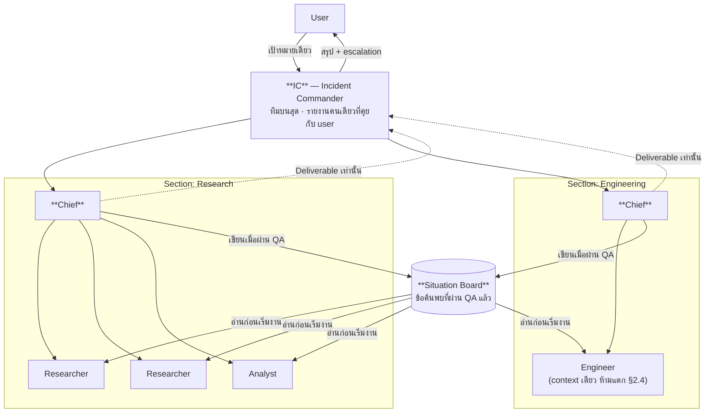

# องค์กร · การควบคุมเครื่อง · ระบบการออกแบบ — M17 · M18 · M13

> ส่วนหนึ่งของ [สถาปัตยกรรม Co-AI Workspace](../../ARCHITECTURE.md) — §22–§24
>
> เอกสารนี้ตอบว่า **ระบบคืออะไรและทำไม** ไม่ตอบว่าสร้างถึงไหนแล้ว (นั่นคือ [`docs/plan/`](../plan/README.md)) · กฎที่บังคับด้วยเครื่องอยู่ที่ [`RULES.md`](../../RULES.md)

---

## 22. AI Organization — จากทีมเดียวเป็นองค์กร (M17 Command)

> **ที่มา**: [§2](01-foundations.md#2-ai-team-model--แกนหลักของ-v2) ออกแบบไว้สำหรับ **ทีมเดียว หัวหน้าหนึ่งคน ลูกทีมสี่บทบาท** ซึ่งเพียงพอกับงานที่แตกได้ใน 4–5 ใบ งานที่ใหญ่กว่านั้นวันนี้ไม่มีที่ไป: `maxFanOut` ปฏิเสธแผนที่กว้างเกิน และไม่มีกลไกให้ "แตกเป็นทีมย่อย" — ทางเลือกเดียวคือผู้ใช้แตกงานเองแล้วรันทีละรอบ ซึ่งย้ายภาระการประสานงานกลับมาที่คน
>
> section นี้ยกโครงจาก **Incident Command System (ICS/EOC)** ซึ่งเป็นระบบที่ถูกออกแบบมาเพื่อปัญหานี้พอดี: งานที่โตเร็วเกินกว่าคนคนเดียวจะคุมได้ โดยไม่ทำให้สายบังคับบัญชาพร่า

### 22.1 กฎที่ยืมมาจาก ICS และเหตุผลที่ยืมได้

| กฎ ICS | ในระบบนี้ | ทำไมมันแปลได้ตรง |
|---|---|---|
| **Span of control 3–7 (เหมาะสุด 5)** | หนึ่งทีมมีลูกทีมได้ 3–7 ราย เกินกว่านั้น**ต้องแตกทีมย่อย** | ข้อจำกัดจริงเหมือนกัน: หัวหน้าหนึ่งคนตรวจรับงานได้จำกัด — สำหรับ agent ข้อจำกัดคือ context window ของหัวหน้า ไม่ใช่ความสนใจของมนุษย์ แต่พฤติกรรมที่ได้เหมือนกัน |
| **Unity of command** — ลูกทีมรับคำสั่งจากหัวหน้าคนเดียว | หนึ่ง assignment มีเจ้าของเดียว | agent ที่รับคำสั่งขัดกันจากสองทางไม่มีกลไกไกล่เกลี่ย มันจะเลือกอันหลังสุดเงียบ ๆ |
| **Modular organisation** — ตั้งเฉพาะตำแหน่งที่จำเป็น | ไม่มีทีมที่ว่างงาน · โครงสร้างเกิดจากงาน ไม่ใช่ตั้งไว้ล่วงหน้า | ทีมที่ตั้งไว้เฉย ๆ คือ prompt ที่กินโทเคนทุกรอบโดยไม่ผลิตอะไร |
| **Management by objective** — ทุกระดับได้วัตถุประสงค์ ไม่ใช่ขั้นตอน | `TeamCharter` มี mission + acceptance criteria เหมือน `Assignment` | เป็นกฎเดียวกับที่ §2.2 บังคับอยู่แล้ว แค่ยกขึ้นไปอีกชั้น |
| **Transfer of command เป็นเหตุการณ์ที่บันทึก** | การตั้ง Team Lead ชั่วคราวเป็น span + แถวใน ledger | "ใครสั่งงานนี้ตอนนั้น" ต้องตอบได้ย้อนหลัง ไม่ใช่อนุมานจาก log |

**สิ่งที่ *ไม่* ยืม**: ICS มีตำแหน่งตายตัว (Operations/Planning/Logistics/Finance) ซึ่งมาจากรูปร่างของงานภัยพิบัติ ไม่ใช่ของงานความรู้ — ระบบนี้ใช้ **domain team** แทน (ทีมวิจัย ทีมโค้ด ทีมวิเคราะห์) เพราะสิ่งที่ต้องแยก context ออกจากกันคือ *โดเมน* ไม่ใช่ *ฟังก์ชันการบริหาร*

### 22.2 Recursive Agent Encapsulation — การซ้อนอยู่ในไทป์ ไม่ใช่ในคอนฟิก

หัวใจของ section นี้เป็นการเปลี่ยนเล็กเดียว:

```
protocol Specialist { func execute(_ assignment: Assignment) async throws -> Deliverable }

Team: Specialist        ← ทีมทั้งทีม "เป็น" ลูกทีมหนึ่งราย เมื่อมองจากทีมแม่
```

**ทีมย่อยคือ specialist ตัวหนึ่งของทีมแม่** — ไม่ใช่ชนิดใหม่ ไม่ใช่โหมด ไม่ใช่ flag ผลที่ตามมาโดยไม่ต้องเขียนกฎเพิ่ม:

- **Sub-Workspace Isolation ได้ฟรีและบังคับด้วย compiler** — [§2.3](01-foundations.md#23-context-isolation--กติกาการคืนงาน) บอกอยู่แล้วว่า specialist เป็น `actor` และคืนได้แค่ `Deliverable` ไม่ใช่ transcript ⇒ ทีม Coding มองไม่เห็น context ของทีม Medical Research **เพราะไทป์ไม่มีทางส่งมันข้ามมา** ไม่ใช่เพราะมีวินัย
- **Standardized Hand-off Protocol ได้ฟรี** — อินเทอร์เฟซระหว่างทีมคือ `Assignment` ลงและ `Deliverable` ขึ้น ซึ่งผ่าน `QAReviewer` ตัวเดียวกันทุกชั้น หัวหน้าทีมย่อยตรวจก่อนส่งขึ้น หัวหน้าทีมแม่ตรวจอีกครั้ง — **QA สองชั้นกับหลักฐานชุดเดิม ไม่ใช่ความเห็นสองความเห็น**
- **สิ่งที่ §2.4 ห้ามยังห้ามอยู่** — Engineer ห้าม fan-out และการเป็นทีมย่อยไม่ใช่ช่องหลบ: กฎตรวจที่ระดับ `TeamPlan` ทุกชั้น

**เพดานความลึก = 3 และมันมีอยู่เพราะการซ้อนที่ไม่มีเพดานคือ fork bomb ที่มีใบเสร็จ** — ทุกชั้นคูณจำนวน agent และ R6 วัดไว้แล้วว่า multi-agent กินโทเคน ~15× ชั้นที่ 4 ต้องมีคนอนุมัติ ไม่ใช่ระบบตัดสินเอง

### 22.3 Dynamic Scaling — เมื่อไรถึงแตกทีม และใครจ่าย



**เงื่อนไขแตกทีม** — ทั้งสามข้อต้องจริง ไม่ใช่ข้อใดข้อหนึ่ง:

1. ใบงานในทีมนั้นเกิน **7** (span of control)
2. ใบงานที่เกินมา**แตกได้จริงและอิสระต่อกัน** — ถ้ามันผูกกันแน่น การแตกทีมทำให้สองทีมแก้ขัดกันเอง ซึ่งเป็นเหตุผลเดียวกับ §2.4
3. **งบที่เหลือรับไหว** — `BudgetGovernor` ประเมินก่อนตั้ง ไม่ใช่ค้นพบตอนหมด

**ถ้าข้อ 3 ไม่ผ่าน ระบบไม่แตกทีมและบอกว่าทำไม** — ทางเลือกคือทำเป็นรอบ ๆ หรือผู้ใช้ยกเพดาน การแตกทีมเงียบ ๆ จนงบหมดกลางทางแย่กว่าการทำช้า

**Team Lead ชั่วคราวคือการแต่งตั้งที่บันทึก** — agent ที่ถูกยกขึ้นเป็นหัวหน้าได้ tool set ของหัวหน้า (plan/delegate/review/report) และ**เสียสิทธิ์ทูลลงมือทำ** ตามกฎ §2.2 การเป็นหัวหน้าไม่ใช่การได้สิทธิ์เพิ่ม แต่เป็นการเปลี่ยนสิทธิ์

### 22.4 Team Role & Team Skill — ตอบข้อ "ต้องมีอะไรครอบอีกชั้นไหม"

**ต้องมี แต่เป็นของที่อนุมานได้ ไม่ใช่ของที่ตั้งใหม่ทั้งชุด**

| | ระดับ agent (มีอยู่แล้ว [§21](05-research.md#21-agent-competence-model--อะไรทำให้-agent-แต่ละตัวต่างกัน)) | ระดับทีม (ใหม่) |
|---|---|---|
| ตัวตน | `Role` (enum ปิด) | `TeamCharter { mission, domain, acceptanceCriteria }` |
| ทำอะไรได้ | tool manifest ต่อ role | **union ของลูกทีม ∩ เพดานของ charter** |
| รู้อะไร | `KnowledgeView` ต่อ role | scope ของทีม + สิ่งที่ Situation Board เปิดให้ |
| เก่งแค่ไหน | `ToolProficiency` (P12.8) | ประวัติ span ระดับทีม — เวลา รอบ rework งบ |

**Invariant ที่สำคัญที่สุดของทั้ง section**: **ทีมมอบสิทธิ์ที่ตัวเองไม่มีให้ลูกทีมไม่ได้** สิทธิ์ไหลลงอย่างเดียวและหดได้เท่านั้น — ถ้าไม่มีกฎนี้ การแตกทีมย่อยจะกลายเป็นวิธีหลบ policy gate ที่ถูกที่สุด (ตั้งทีมใหม่ที่ "ต้องใช้" `run_shell`) ซึ่งเป็นรูปเดียวกับ privilege escalation ผ่านการสร้าง process ลูก

### 22.5 Situation Board — ที่คุยกันระหว่างทีม และเหตุผลที่มันไม่ขัดกับ Isolation

ข้อกำหนดสองข้อดูขัดกันตรง ๆ: §22.2 บอกให้แยก context เพื่อกันหลอน แต่ก็ต้องมีที่แชร์ความรู้เพื่อไม่ให้ทำซ้ำซ้อน **ทางออกคือแยกให้ชัดว่าอะไรแชร์ได้**

| แชร์ | ไม่แชร์ |
|---|---|
| ข้อค้นพบที่**ผ่าน QA แล้ว** พร้อม provenance | transcript ดิบ |
| "ทีมไหนกำลังทำใบงานไหน" (กันงานซ้ำ) | context window ของทีมอื่น |
| ข้อขัดแย้งที่ยังไม่ตัดสิน (เพื่อไม่ให้สองทีมตัดสินคนละทาง) | สมมติฐานระหว่างทาง ความเห็นที่ยังไม่ตรวจ |

**กฎเดียวที่ทำให้บอร์ดนี้ไม่กลายเป็นเครื่องขยายการหลอน**: **ไม่มีอะไรขึ้นบอร์ดได้ถ้ายังไม่ผ่าน QA** บอร์ดที่รับความเห็นดิบของ agent คือกลไกที่ทำให้ความเข้าใจผิดของตัวหนึ่งกลายเป็น "สิ่งที่รู้กัน" ของทั้งองค์กรภายในหนึ่งรอบ — แย่กว่าไม่มีบอร์ดเลย

**ในทางเทคนิคมันไม่ใช่ระบบใหม่** — เป็น scope หนึ่งใน [M7 Knowledge](02-core-modules.md#11-m7-knowledge) (`Scope.board(runID)`) อ่านผ่าน `kb_search` เดิม เขียนผ่านทางเดียวคือ QA ที่ผ่านแล้ว และ**เป็น pull ไม่ใช่ push**: agent อ่านตอนกำลังจะเริ่มงาน ("มีใครทำเรื่องนี้ไปแล้วไหม") แบบเดียวกับที่ `RoleMemory` (P12.7) เอาบทเรียนมาวางไว้หน้างาน — ไม่ใช่ feed ที่ไหลเข้า context ทุกตัวตลอดเวลา ซึ่งจะทำให้ context ของทุกคนโตพร้อมกัน

### 22.6 EOC Dashboard — Command Tree View

**ไม่ใช่ระบบข้อมูลใหม่** — [§16](03-surfaces-and-ops.md#16-m12-observability--eval) มี span stream เส้นเดียวที่ทุกหน้าจอเป็นฟิลเตอร์ของมัน และ `Span.parent` ก็เป็นต้นไม้อยู่แล้ว Command Tree จึงเป็นการวาด tree นั้นตามสายบังคับบัญชา

| สิ่งที่จอต้องบอก | อ่านจากไหน | กฎความซื่อสัตย์ |
|---|---|---|
| ใครเป็น IC / Chief / ลูกทีม ตอนนี้ | span tree + ledger การแต่งตั้ง | โครงสร้างที่แสดงคือโครงสร้าง ณ เวลานั้น ไม่ใช่ผังที่ตั้งใจไว้ |
| แต่ละตัวกำลังทำ task อะไร | assignment span ที่ยัง `running` (P10.15) | งานที่ span ปิดแล้วไม่ใช่ "กำลังทำ" |
| ทีมไหน **Busy** | `AdmissionControl` + span ที่ค้างอยู่ ไม่ใช่สถานะที่ agent รายงานเอง | สถานะที่ agent บอกเองคือคำกล่าวอ้าง ไม่ใช่การวัด — หลักเดียวกับ §2.5 |
| ใช้งบไปเท่าไรต่อทีม | spend ledger รวมตาม subtree | |

### 22.7 การรายงานผ่านช่องทางแชท — กัน Notification Fatigue

**ค่าเริ่มต้น: มีเพียง IC ที่คุยกับผู้ใช้** ลูกทีมรายงานหัวหน้าตัวเอง หัวหน้ารายงานขึ้นไป — ผู้ใช้ได้ข้อความจากที่เดียว

**ข้อยกเว้นเดียวคือ escalation** — เมื่อ retry หมดแล้วยังไม่ผ่าน ([§2.5](01-foundations.md#25-qa-loop--ตรวจตามมาตรฐาน)) สิ่งนั้นเป็น "คำถามที่ต้องการคนตอบ" ไม่ใช่ความคืบหน้า และมันต้องไปถึงคนโดยไม่รอสรุปรอบถัดไป — เพราะทั้งองค์กรอาจกำลังรอคำตอบนั้นอยู่

**กฎที่ป้องกันความเงียบผิดจังหวะ**: ถ้าไม่มีอะไรรายงานเกินช่วงเวลาที่ตั้งไว้ ระบบต้องส่ง "ยังทำอยู่ ตอนนี้ถึงไหน" — ความเงียบสองชั่วโมงจากระบบที่เผางบอยู่ อ่านเหมือนระบบตายไปแล้วเป๊ะ

---

## 23. Machine Control — ให้ระบบทดสอบหน้าจอตัวเองได้ (M18 ScreenDriver)

> **ที่มา**: [`docs/DRIVING_LOG.md`](../DRIVING_LOG.md) บันทึกไว้ว่า**ทุกรอบของการขับหน้าจอด้วยมือเจอบั๊กที่เทสทั้งชุดมองไม่เห็น** (8 · 10 · 5 · 7 · 7 · 3 ตัว) — และตัวขับปัจจุบัน (`spikes/ScreenDriver/ax.py` ผ่าน System Events/AppleScript) พิมพ์ลง `TextField`/`TextEditor`/`SecureField` ไม่ได้ ทำให้ของค้างหลายข้อในแผนค้างอยู่ที่ "ขับไม่ได้" ไม่ใช่ "ยังไม่ได้ทำ"

### 23.1 สามชั้น และหน้าที่ที่ต่างกัน

| ชั้น | API | ตอบคำถามอะไร |
|---|---|---|
| **โครงสร้าง** | Accessibility (AX) — `AXUIElement` | "ปุ่มชื่อนี้อยู่ไหน มีสถานะอะไร" — เป็นชั้นหลัก เพราะมันคือสิ่งเดียวกับที่ผู้พิการใช้ ([§11.3 ของ HIG](#24-design-system--human-interface-guidelines-m13)) ⇒ **ตัวขับที่ทำงานได้ พิสูจน์ว่าหน้าจอเข้าถึงได้จริงไปด้วยในตัว** |
| **อินพุต** | Core Graphics `CGEvent` | "กด/พิมพ์/ลาก" — ระดับ event ของระบบ จึงพิมพ์ลงตัวควบคุมที่ AX เขียนค่าไม่ได้ ซึ่งเป็นข้อจำกัดที่ทำให้ตัวขับปัจจุบันตัน |
| **เอาต์พุต** | ScreenCaptureKit | "หน้าจอตอนนี้เป็นยังไงจริง ๆ" — จับภาพหน้าต่างเฉพาะแอปได้ ไม่ต้องจับทั้งจอ |

**AX มาก่อน CGEvent เสมอ** — คลิกที่พิกัดคือคำสั่งที่พังเงียบเมื่อเลย์เอาต์ขยับหนึ่งพิกเซล ส่วนการหาปุ่มจากชื่อแล้วค่อยคลิกที่กึ่งกลางของมันคือคำสั่งที่พังแบบมีข้อความบอก CGEvent ใช้เมื่อ AX **เขียนค่าไม่ได้** เท่านั้น ไม่ใช่ใช้แทน

### 23.2 สิ่งที่ต้องยอมรับตั้งแต่ออกแบบ ไม่ใช่ค้นพบตอนรัน

1. **สิทธิ์ TCC ให้ตัวเองไม่ได้** — Accessibility, Input Monitoring และ Screen Recording ต้องให้**คนกดอนุญาตใน System Settings** ระบบทำแทนไม่ได้ และไม่ควรพยายามทำให้เนียน
2. **สิทธิ์ผูกกับลายเซ็นของไบนารี** — แอปนี้ยังเซ็นแบบ ad-hoc (R11) ⇒ **build ใหม่อาจทำให้สิทธิ์ที่เคยให้ถูกเพิกถอน** อาการคือ "ตัวขับเคยทำงาน วันนี้ไม่ทำ" โดยไม่มีข้อความอะไร นี่เป็นเหตุผลตรง ๆ อีกข้อที่ต้อง notarize
3. **มันควบคุมได้ทุกแอป ไม่ใช่แค่แอปนี้** — ค่าเริ่มต้นจึงจำกัดที่หน้าต่างของแอปตัวเอง (ตรวจจาก pid) การขับแอปอื่นต้องเปิดเป็นรายครั้งพร้อมเหตุผล และเป็นการกระทำระดับ `high` ในตารางความเสี่ยง
4. **ภาพหน้าจอคือข้อมูล ไม่ใช่คำสั่ง** — ข้อความที่อ่านได้จากจอ (รวมถึงหน้าเว็บที่เปิดอยู่) ต้องถูกปฏิบัติเหมือน tool output ที่ไม่น่าเชื่อถือ ผ่าน hook chain เดิม การให้ agent ทำตามสิ่งที่มันอ่านเจอบนจอคือ prompt injection ที่มีมือและคีย์บอร์ด

### 23.3 หลักฐาน ไม่ใช่คำกล่าวอ้าง

เหตุผลที่สร้างสิ่งนี้คือให้ระบบ**ทดสอบตัวเองได้** ⇒ ผลของการขับต้องเป็นสิ่งที่ QA ตรวจได้ตาม [§2.5](01-foundations.md#25-qa-loop--ตรวจตามมาตรฐาน) ไม่ใช่โมเดลบอกว่ากดแล้ว

- `Evidence.kind` เพิ่ม `.screenObservation` — เก็บ **AX tree snapshot + ภาพ** ณ ก่อน/หลังการกระทำ
- **Done-when ของงานที่มีหน้าจอเปลี่ยนจาก "ขับด้วยมือ" เป็น "ขับด้วยมือ *หรือ* มีหลักฐานหน้าจอที่ QA อ่านแล้วผ่าน"** — และการขับด้วยมือยังต้องมีอยู่ในรอบสุดท้ายก่อนปล่อย เพราะตัวขับเห็นสิ่งที่มันถูกสอนให้มอง
- ทุกการกระทำเป็น span ([§16](03-surfaces-and-ops.md#16-m12-observability--eval)) — "ตัวขับกดอะไรไปบ้าง" ต้องย้อนดูได้เหมือนทูลอื่น

---

## 24. Design System & Human Interface Guidelines (M13)

> **ที่มา**: หน้าจอถูกสร้างทีละหน้าตามลำดับที่ทำ task ไม่ได้สร้างจากระบบการออกแบบ ⇒ วันนี้มีทั้ง `GroupBox`, `List`, ปุ่มต่อแถว, popover และ sheet ที่แก้ปัญหาเดียวกันคนละวิธี ([U33-7](../DRIVING_LOG.md) — `List(selection:)` ใช้ไม่ได้ ทุกที่อื่นในแอปใช้ Button ต่อแถว จึงต้องตามนั้น "เพราะที่อื่นทำแบบนั้น" ไม่ใช่เพราะมีกฎ)

### 24.1 สี่เสาของ HIG กับสิ่งที่แอปนี้ต้องแก้จริง

| เสา | สถานะวันนี้ | สิ่งที่ต้องเปลี่ยน |
|---|---|---|
| **Clarity** | ข้อความเยอะมาก ทุกกล่องอธิบายเหตุผลของตัวเอง | เหตุผลย้ายไป popover/help ส่วนบรรทัดแรกเหลือคำตอบ — **ไม่ใช่ลบคำอธิบาย** เพราะมันคือสิ่งที่ทำให้ตัวเลขในแอปนี้เถียงได้ |
| **Deference** | พื้นหลังแข่งกับเนื้อหาน้อย แต่ chrome ต่อหน้าจอไม่เท่ากัน | โครงหน้าเดียวกันทุกพื้นที่: หัวเรื่อง → การกระทำหลัก → เนื้อหา → คำอธิบาย |
| **Depth** | ไม่มีลำดับชั้นทางสายตาเลย ทุกกล่องน้ำหนักเท่ากัน | ชั้นตาม Liquid Glass (ดู §24.2) |
| **Consistency** | **นี่คือข้อที่แย่ที่สุด** | Design tokens + ชุด component กลาง แล้ว**มีกฎใน `check.sh` ห้ามสร้าง control ใหม่นอกชุด** — ไม่งั้นเอกสารนี้จะเป็นความตั้งใจอีกฉบับ |

### 24.2 Liquid Glass — ใช้เท่าที่มันทำหน้าที่

API ที่ใช้ได้จริงบน macOS 26 คือ `.glassEffect(_:in:)` และ `GlassEffectContainer` — **ตรวจกับ SDK บนเครื่องแล้ว ([E.27](../verification/02-e16-e30.md#e27-liquid-glass-บน-sdk-ของเครื่องนี้--และเครื่องมือตรวจที่ตอบผิด-2026-08-16))**: ลายเซ็นที่เคยเขียนไว้ที่นี่คือ `.glassEffect(_:in:isEnabled:)` ซึ่ง**ไม่มีพารามิเตอร์ `isEnabled` จริง** — เปิด/ปิดแก้วต้องแยกสาขาใน view · และวิธีตรวจก็สำคัญ: grep ใน `.swiftinterface` ตอบว่าไม่มีทั้งที่มี ต้องคอมไพล์ถึงจะรู้

**Honest Materiality เป็นกฎที่บังคับได้ ไม่ใช่คำขวัญ**: ชั้นแก้วใช้กับ**สิ่งที่ลอยอยู่เหนือเนื้อหาและปิดมันบางส่วน**เท่านั้น (แถบเครื่องมือ · แถบสถานะ · popover) เนื้อหาที่ต้องอ่าน — ตาราง ตัวเลข ผลสถิติ ข้อความอ้างอิง — อยู่บน **Solid Layer** เสมอ

> **ข้อนี้ไม่ใช่รสนิยม**: แอปนี้แสดงค่า p, ช่วงความเชื่อมั่น และข้อความที่มี citation ตัวเลขที่อ่านผิดเพราะพื้นหลังโปร่งแสงพาดผ่าน คือความเสียหายที่แก้ไม่ได้ในงานวิจัย — ความคมชัดของตัวอักษรบนตัวเลขจึงเป็นข้อกำหนด ไม่ใช่ตัวเลือก

### 24.3 Agentic UX — สี่อย่างที่หน้าจอของระบบอัตโนมัติต้องมี

| ข้อกำหนด | มีแล้วบางส่วน | ที่ต้องเติม |
|---|---|---|
| **Status Communication** | span stream · Live Monitor · แถบสถานะ 6 ช่อง | Command Tree ([§22.6](#226-eoc-dashboard--command-tree-view)) — วันนี้เห็นว่ามีอะไรเกิด แต่ไม่เห็นว่าใครสั่งใคร |
| **Visible Decision-Making** | hook chain บอกว่าอะไรถูกหยุดและด้วยกฎข้อไหน | **เหตุผลของการ*เลือกทำ*** ยังไม่แสดง — วันนี้เห็นเฉพาะเหตุผลของการปฏิเสธ |
| **Human-in-the-loop** | ApprovalBroker · pause/stop · Plan-only · แก้แผนก่อนเริ่ม | แทรกกลางทางระดับทีมย่อย (หยุดทีมเดียวโดยไม่หยุดทั้งองค์กร) |
| **Confidence Indicators** | `ConflictDetector` มี confidence และ `ToolProficiency` มีอัตราสำเร็จ | ยังไม่มีที่ไหน**แสดง**ให้ผู้ใช้เห็นก่อนอนุมัติ — และกฎต้องเป็น: **ความมั่นใจต่ำ = ต้องมีคนดู ไม่ใช่แค่แสดงตัวเลขให้สวย** |

**Adaptive Interface มีเงื่อนไขเดียวที่ยอมรับได้**: ปรับตาม **project type** ที่ผู้ใช้เลือกเอง ([§20.2](05-research.md#202-project-type--manifest-ไม่ใช่โค้ด)) ไม่ใช่ระบบเดาจากพฤติกรรม — หน้าจอที่ย้ายของเองตามที่มันคิดว่าคุณกำลังทำอะไร คือหน้าจอที่จำตำแหน่งอะไรไม่ได้เลย

---
